# 收银台类型系统

<cite>
**本文档引用的文件**
- [cashier.types.ts](file://miniprogram/pages/cashier/cashier.types.ts)
- [cashier.ts](file://miniprogram/pages/cashier/cashier.ts)
- [cashier.wxml](file://miniprogram/pages/cashier/cashier.wxml)
- [data-loader.service.ts](file://miniprogram/pages/cashier/services/data-loader.service.ts)
- [customer-match.ts](file://miniprogram/pages/cashier/utils/customer-match.ts)
- [reservation.handler.ts](file://miniprogram/pages/cashier/handlers/reservation.handler.ts)
- [settlement.handler.ts](file://miniprogram/pages/cashier/handlers/settlement.handler.ts)
- [push.handler.ts](file://miniprogram/pages/cashier/handlers/push.handler.ts)
- [app.ts](file://miniprogram/app.ts)
- [cloud-db.ts](file://miniprogram/utils/cloud-db.ts)
- [util.ts](file://miniprogram/utils/util.ts)
- [constants.ts](file://miniprogram/utils/constants.ts)
- [getAvailableTechnicians/index.js](file://cloudfunctions/getAvailableTechnicians/index.js)
- [manageRotation/index.js](file://cloudfunctions/manageRotation/index.js)
- [sendWechatMessage/index.js](file://cloudfunctions/sendWechatMessage/index.js)
- [loading-service.ts](file://miniprogram/utils/loading-service.ts)
- [index.d.ts](file://typings/index.d.ts)
</cite>

## 更新摘要
**变更内容**
- 将CashierPage接口的使用从any类型替换为明确的CashierPage类型，提升了类型安全性和代码可维护性
- 新增了快速预约功能，支持四种不同的预约类型（1位男技师、1位女技师、2位男技师、2位女技师）
- 新增了推送通知确认模态框，提供更精确的消息控制
- 增强了预约修改跟踪机制，支持详细的变更通知
- 改进了技师选择逻辑，支持点钟和轮钟两种模式
- 新增了到店确认弹窗，提供推送和跳过的双重选项
- 增强了轮班重置功能，集成了加载服务和权限控制
- **新增** 应用类型系统增强：在IAppOption接口中新增checkUpdate方法签名，确保更新检测功能的类型安全性

## 目录
1. [简介](#简介)
2. [项目结构](#项目结构)
3. [核心组件](#核心组件)
4. [架构概览](#架构概览)
5. [详细组件分析](#详细组件分析)
6. [依赖关系分析](#依赖关系分析)
7. [类型系统改进](#类型系统改进)
8. [性能考虑](#性能考虑)
9. [故障排除指南](#故障排除指南)
10. [结论](#结论)

## 简介

收银台类型系统是一个基于微信小程序开发的专业按摩服务管理系统。该系统通过模块化的架构设计，实现了预约管理、结算处理、技师调度、消息推送等核心功能。系统采用前后端分离的架构，前端使用TypeScript和WXML进行开发，后端通过云函数提供数据处理能力。

该系统主要服务于按摩店的日常运营，提供了完整的从客户预约到服务完成的全流程管理。通过智能化的技师调度算法和实时的消息推送机制，大大提高了服务效率和客户体验。

**更新** 系统现已大幅增强快速预约功能，支持四种不同的预约类型，包括点钟预约、轮钟预约、1位男技师和1位女技师等模式，为用户提供了更加灵活和便捷的预约体验。同时，通过引入明确的CashierPage接口类型，显著提升了代码的类型安全性和可维护性。**新增** 应用类型系统也得到了重要增强，通过在IAppOption接口中新增checkUpdate方法签名，确保了小程序版本更新检测功能的类型安全性。

## 项目结构

系统采用按功能模块组织的目录结构，主要分为以下几个层次：

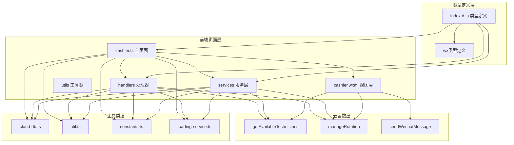

**图表来源**
- [cashier.ts](file://miniprogram/pages/cashier/cashier.ts#L1-L497)
- [cashier.wxml](file://miniprogram/pages/cashier/cashier.wxml#L1-L334)
- [data-loader.service.ts](file://miniprogram/pages/cashier/services/data-loader.service.ts#L1-L241)
- [reservation.handler.ts](file://miniprogram/pages/cashier/handlers/reservation.handler.ts#L1-L1075)
- [loading-service.ts](file://miniprogram/utils/loading-service.ts#L1-L282)
- [index.d.ts](file://typings/index.d.ts#L225-L245)

**章节来源**
- [cashier.ts](file://miniprogram/pages/cashier/cashier.ts#L1-L497)
- [app.ts](file://miniprogram/app.ts#L1-L232)
- [index.d.ts](file://typings/index.d.ts#L225-L245)

## 核心组件

### 类型定义系统

系统建立了完整的类型定义体系，确保代码的类型安全性和可维护性：

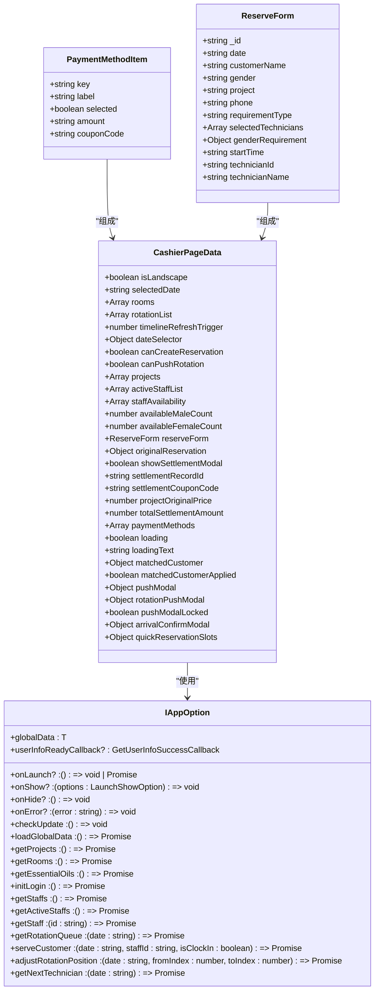

**图表来源**
- [cashier.types.ts](file://miniprogram/pages/cashier/cashier.types.ts#L1-L122)
- [index.d.ts](file://typings/index.d.ts#L225-L245)

### 处理器架构

系统采用处理器模式，将不同的业务逻辑分离到独立的处理类中：

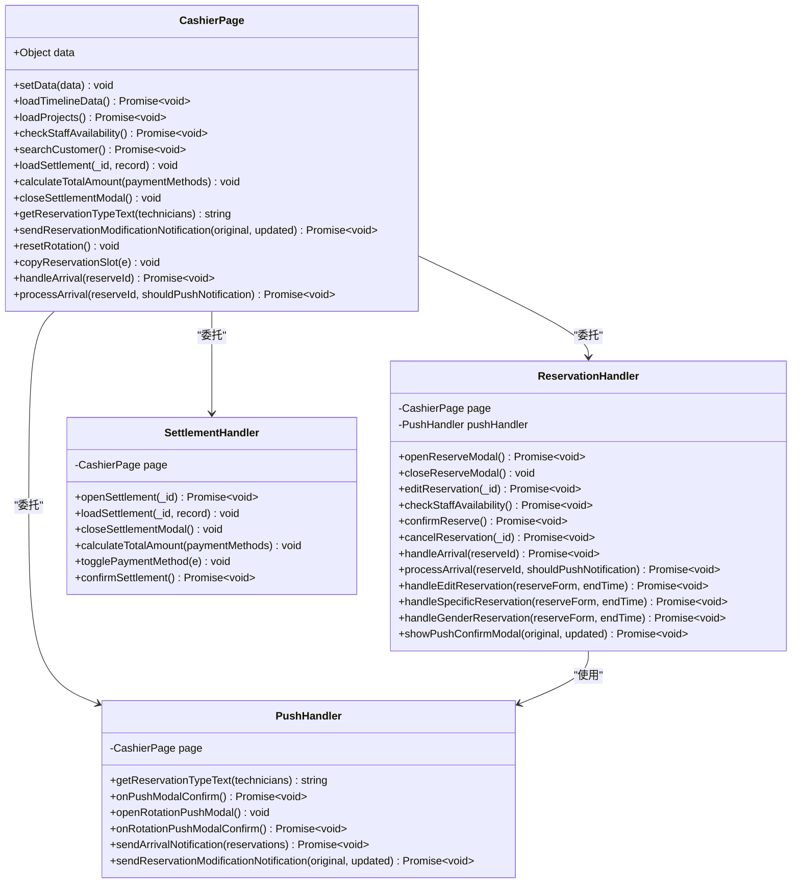

**图表来源**
- [cashier.types.ts](file://miniprogram/pages/cashier/cashier.types.ts#L102-L122)
- [reservation.handler.ts](file://miniprogram/pages/cashier/handlers/reservation.handler.ts#L11-L18)
- [settlement.handler.ts](file://miniprogram/pages/cashier/handlers/settlement.handler.ts#L8-L14)
- [push.handler.ts](file://miniprogram/pages/cashier/handlers/push.handler.ts#L8-L13)

**章节来源**
- [cashier.types.ts](file://miniprogram/pages/cashier/cashier.types.ts#L1-L122)
- [reservation.handler.ts](file://miniprogram/pages/cashier/handlers/reservation.handler.ts#L1-L1075)
- [settlement.handler.ts](file://miniprogram/pages/cashier/handlers/settlement.handler.ts#L1-L293)
- [push.handler.ts](file://miniprogram/pages/cashier/handlers/push.handler.ts#L1-L355)

## 架构概览

系统采用分层架构设计，实现了清晰的职责分离：

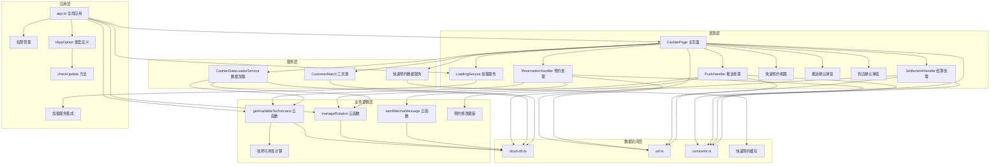

**图表来源**
- [cashier.ts](file://miniprogram/pages/cashier/cashier.ts#L1-L497)
- [cashier.wxml](file://miniprogram/pages/cashier/cashier.wxml#L1-L334)
- [data-loader.service.ts](file://miniprogram/pages/cashier/services/data-loader.service.ts#L1-L241)
- [getAvailableTechnicians/index.js](file://cloudfunctions/getAvailableTechnicians/index.js#L1-L331)
- [manageRotation/index.js](file://cloudfunctions/manageRotation/index.js#L1-L334)
- [loading-service.ts](file://miniprogram/utils/loading-service.ts#L1-L282)
- [app.ts](file://miniprogram/app.ts#L43-L79)
- [index.d.ts](file://typings/index.d.ts#L225-L245)

## 详细组件分析

### 快速预约系统

快速预约系统是本次更新的核心功能，支持四种不同的预约类型，为用户提供了更加灵活和便捷的预约体验。

#### 快速预约类型

系统支持以下四种快速预约类型：

1. **1位男技师** (`oneMale`)：单人男性技师服务
2. **1位女技师** (`oneFemale`)：单人女性技师服务  
3. **2位男技师** (`twoMale`)：双人男性技师服务
4. **2位女技师** (`twoFemale`)：双人女性技师服务

#### 快速预约界面

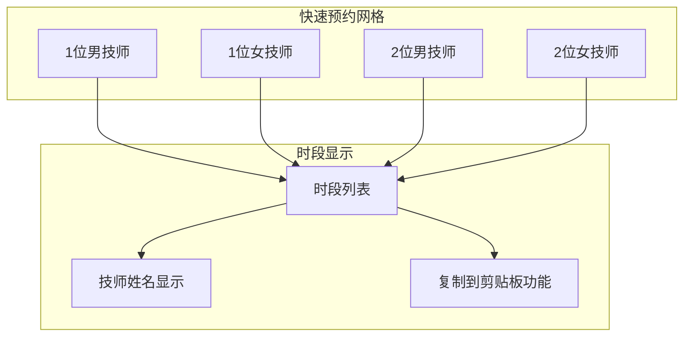

**图表来源**
- [cashier.wxml](file://miniprogram/pages/cashier/cashier.wxml#L26-L68)

#### 快速预约流程

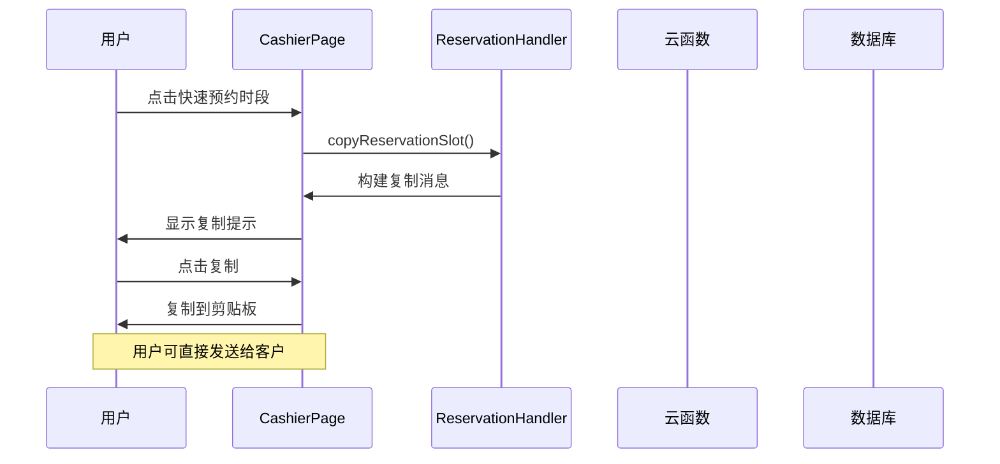

**图表来源**
- [cashier.ts](file://miniprogram/pages/cashier/cashier.ts#L205-L237)

**章节来源**
- [cashier.wxml](file://miniprogram/pages/cashier/cashier.wxml#L21-L68)
- [cashier.ts](file://miniprogram/pages/cashier/cashier.ts#L205-L237)

### 预约管理系统

预约管理系统是整个收银台的核心功能之一，支持多种预约模式：

#### 预约流程序列图

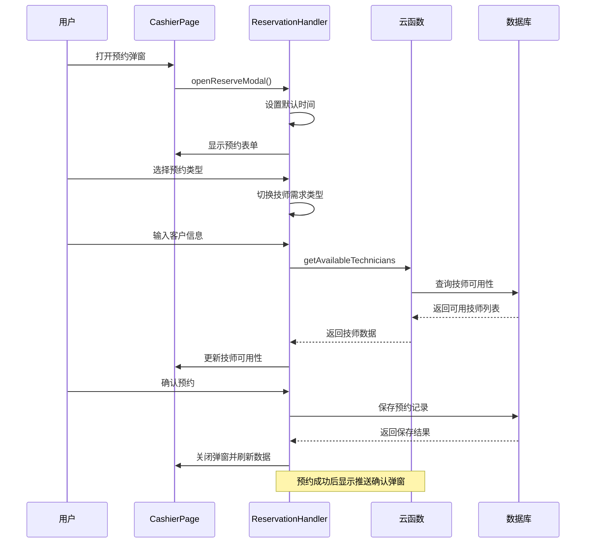

**图表来源**
- [reservation.handler.ts](file://miniprogram/pages/cashier/handlers/reservation.handler.ts#L23-L61)
- [getAvailableTechnicians/index.js](file://cloudfunctions/getAvailableTechnicians/index.js#L9-L143)

#### 技师可用性计算算法

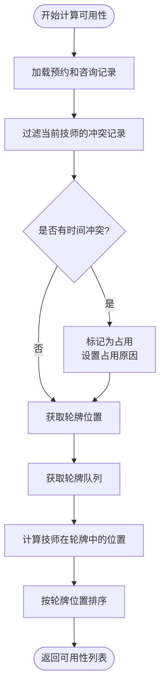

**图表来源**
- [getAvailableTechnicians/index.js](file://cloudfunctions/getAvailableTechnicians/index.js#L70-L136)

**章节来源**
- [reservation.handler.ts](file://miniprogram/pages/cashier/handlers/reservation.handler.ts#L1-L1075)
- [getAvailableTechnicians/index.js](file://cloudfunctions/getAvailableTechnicians/index.js#L1-L331)

### 推送通知确认系统

推送通知确认系统是本次更新的重要功能，为用户提供了精确的消息控制能力。

#### 推送确认弹窗

系统新增了推送确认弹窗，支持用户对推送内容进行预览和编辑：

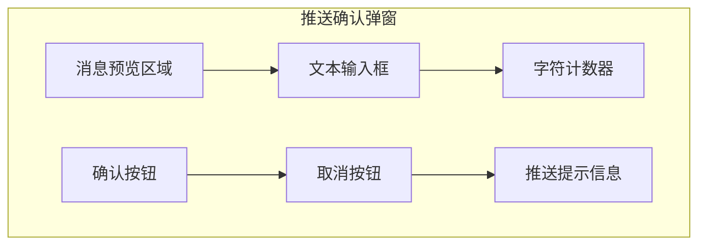

**图表来源**
- [cashier.wxml](file://miniprogram/pages/cashier/cashier.wxml#L283-L292)

#### 预约变更跟踪

系统增强了预约变更跟踪机制，能够详细记录和通知所有变更：

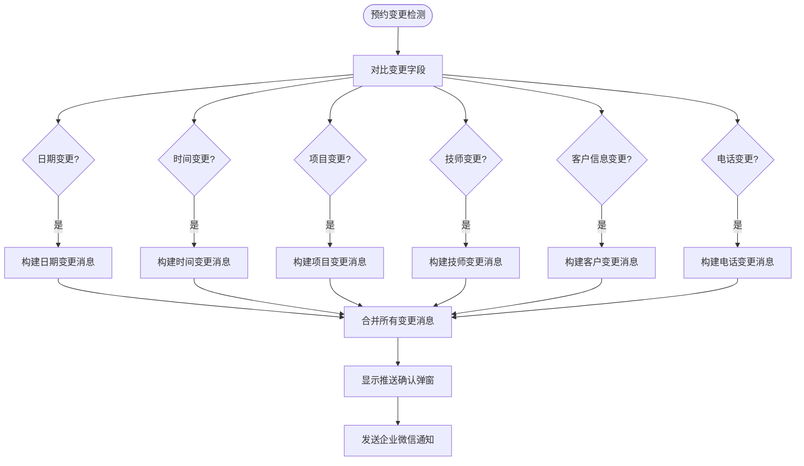

**图表来源**
- [reservation.handler.ts](file://miniprogram/pages/cashier/handlers/reservation.handler.ts#L724-L799)

**章节来源**
- [cashier.wxml](file://miniprogram/pages/cashier/cashier.wxml#L283-L292)
- [reservation.handler.ts](file://miniprogram/pages/cashier/handlers/reservation.handler.ts#L724-L799)

### 到店确认系统

到店确认系统提供了更加人性化的到店处理流程：

#### 到店确认弹窗

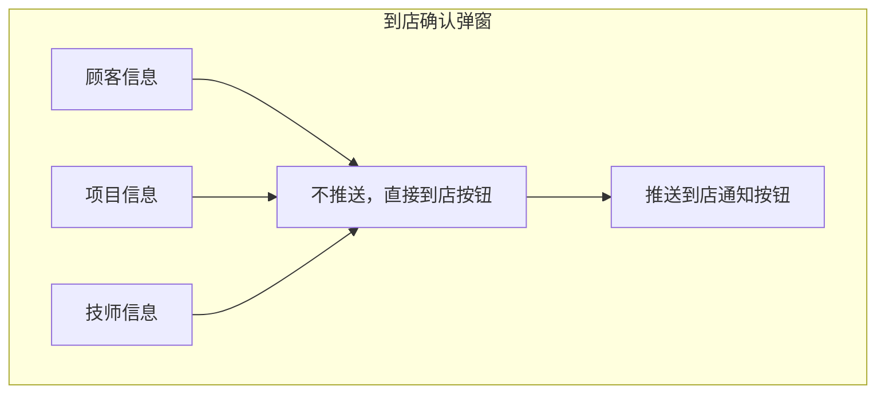

**图表来源**
- [cashier.wxml](file://miniprogram/pages/cashier/cashier.wxml#L313-L334)

#### 到店处理流程

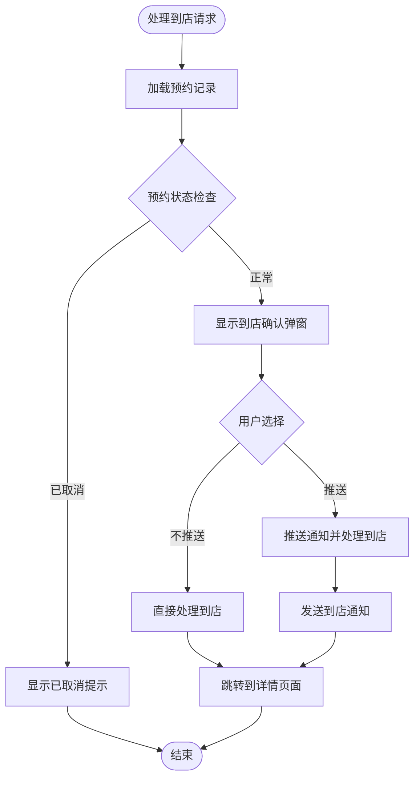

**图表来源**
- [reservation.handler.ts](file://miniprogram/pages/cashier/handlers/reservation.handler.ts#L345-L419)

**章节来源**
- [cashier.wxml](file://miniprogram/pages/cashier/cashier.wxml#L313-L334)
- [reservation.handler.ts](file://miniprogram/pages/cashier/handlers/reservation.handler.ts#L345-L419)

### 轮班管理系统

轮班管理系统是收银台的重要组成部分，支持轮班计划的创建、调整和重置功能：

#### 轮班重置流程图

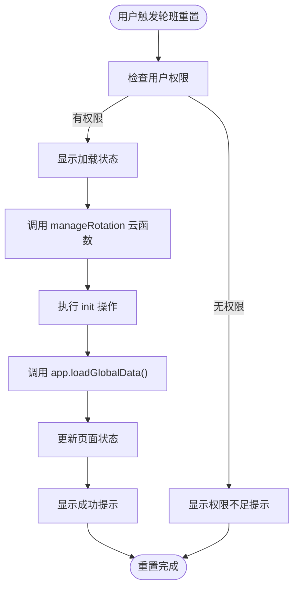

**图表来源**
- [cashier.ts](file://miniprogram/pages/cashier/cashier.ts#L418-L438)
- [manageRotation/index.js](file://cloudfunctions/manageRotation/index.js#L14-L15)

#### 轮班调度算法

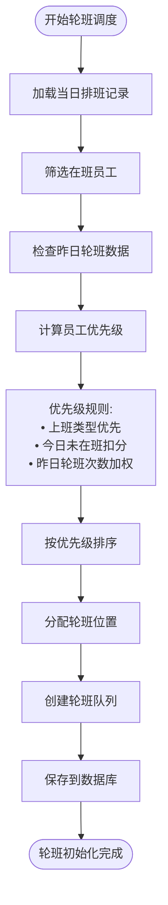

**图表来源**
- [manageRotation/index.js](file://cloudfunctions/manageRotation/index.js#L78-L121)

**更新** 新增了 `resetRotation()` 方法的详细说明，该方法允许管理员手动重置轮班计划，集成了加载服务并提供用户反馈。

**章节来源**
- [cashier.ts](file://miniprogram/pages/cashier/cashier.ts#L418-L438)
- [manageRotation/index.js](file://cloudfunctions/manageRotation/index.js#L38-L153)
- [loading-service.ts](file://miniprogram/utils/loading-service.ts#L80-L141)

### 结算处理系统

结算系统支持多种支付方式和复杂的计费逻辑：

#### 结算流程图

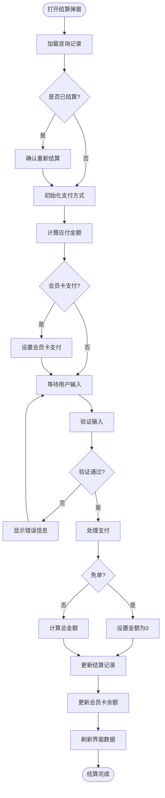

**图表来源**
- [settlement.handler.ts](file://miniprogram/pages/cashier/handlers/settlement.handler.ts#L18-L99)

**章节来源**
- [settlement.handler.ts](file://miniprogram/pages/cashier/handlers/settlement.handler.ts#L1-L293)

### 消息推送系统

推送系统实现了多场景的通知机制：

#### 推送流程图

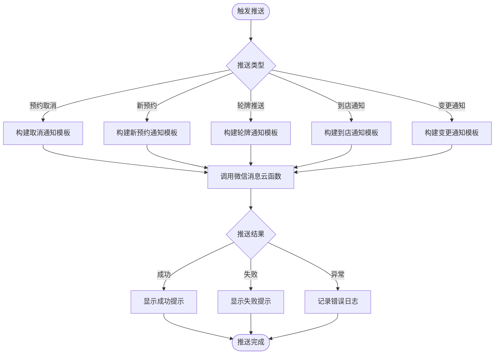

**图表来源**
- [push.handler.ts](file://miniprogram/pages/cashier/handlers/push.handler.ts#L58-L94)

**章节来源**
- [push.handler.ts](file://miniprogram/pages/cashier/handlers/push.handler.ts#L1-L355)
- [sendWechatMessage/index.js](file://cloudfunctions/sendWechatMessage/index.js#L1-L72)

### 数据加载服务

数据加载服务负责聚合多个数据源的信息：

#### 数据加载流程

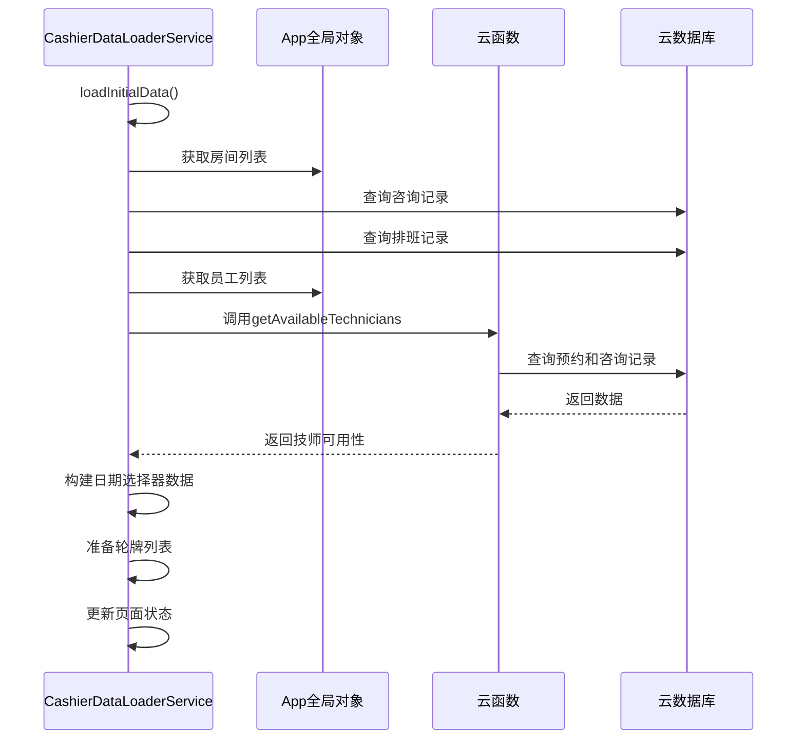

**图表来源**
- [data-loader.service.ts](file://miniprogram/pages/cashier/services/data-loader.service.ts#L30-L85)

**章节来源**
- [data-loader.service.ts](file://miniprogram/pages/cashier/services/data-loader.service.ts#L1-L241)

### 应用类型系统增强

**更新** 本次更新重点关注应用类型系统的增强，特别是IAppOption接口中新增的checkUpdate方法签名，确保了小程序版本更新检测功能的类型安全性。

#### IAppOption接口类型增强

系统在IAppOption接口中新增了checkUpdate方法签名，提供了完整的类型安全保障：

```mermaid
classDiagram
class IAppOption {
<<interface>>
+T extends Record~string, any~ globalData
+userInfoReadyCallback? : GetUserInfoSuccessCallback
+onLaunch? : () => void | Promise~void~
+onShow? : (options : LaunchShowOption) => void
+onHide? : () => void
+onError? : (error : string) => void
+checkUpdate : () => void
+loadGlobalData : () => Promise~void~
+getProjects : () => Promise~Project[]~
+getRooms : () => Promise~Room[]~
+getEssentialOils : () => Promise~EssentialOil[]~
+initLogin : () => Promise~void~
+getStaffs : () => Promise~StaffInfo[]~
+getActiveStaffs : () => Promise~StaffInfo[]~
+getStaff : (id : string) => Promise~StaffInfo | null~
+getRotationQueue : (date : string) => Promise~RotationQueue | null~
+serveCustomer : (date : string, staffId : string, isClockIn : boolean) => Promise~void~
+adjustRotationPosition : (date : string, fromIndex : number, toIndex : number) => Promise~RotationQueue | null~
+getNextTechnician : (date : string) => Promise~RotationItem | null~
}
class App {
+checkUpdate() void
+onLaunch() void
+loadGlobalData() Promise~void~
}
class UpdateManager {
+onCheckForUpdate(callback) void
+onUpdateReady(callback) void
+onUpdateFailed(callback) void
+applyUpdate() void
}
IAppOption --> App : "约束"
App --> UpdateManager : "使用"
```

**图表来源**
- [index.d.ts](file://typings/index.d.ts#L225-L245)
- [app.ts](file://miniprogram/app.ts#L43-L79)

#### 类型安全性的提升

通过在IAppOption接口中新增checkUpdate方法签名，系统获得了以下类型安全性改进：

1. **编译时类型检查**：所有实现IAppOption接口的应用实例都必须提供checkUpdate方法
2. **IDE智能提示**：开发者可以获得checkUpdate方法的完整签名和文档提示
3. **重构安全性**：当checkUpdate方法签名发生变化时，编译器会立即报告所有相关的类型错误
4. **契约明确化**：IAppOption接口明确了应用实例应该提供的完整API契约，包括更新检测功能

#### 类型使用示例

在app.ts文件中，checkUpdate方法的实现方式如下：

```typescript
// 在应用启动时调用
onLaunch() {
    this.checkUpdate(); // 类型安全的调用
    this.initLogin();
    this.loadGlobalData();
}

// 实现checkUpdate方法
checkUpdate() {
    if (!wx.getUpdateManager) {
        return;
    }

    const updateManager = wx.getUpdateManager();

    updateManager.onCheckForUpdate((res) => {
        if (res.hasUpdate) {
            console.log('检测到新版本');
        }
    });

    updateManager.onUpdateReady(() => {
        wx.showModal({
            title: '更新提示',
            content: '新版本已准备好，是否重启应用？',
            showCancel: true,
            confirmText: '立即重启',
            cancelText: '稍后再说',
            success: (res) => {
                if (res.confirm) {
                    updateManager.applyUpdate();
                }
            }
        });
    });

    updateManager.onUpdateFailed(() => {
        wx.showModal({
            title: '更新提示',
            content: '新版本下载失败，请删除当前小程序后重新搜索打开',
            showCancel: false,
            confirmText: '知道了'
        });
    });
}
```

**章节来源**
- [index.d.ts](file://typings/index.d.ts#L225-L245)
- [app.ts](file://miniprogram/app.ts#L43-L79)

## 依赖关系分析

系统采用了清晰的依赖层次结构：

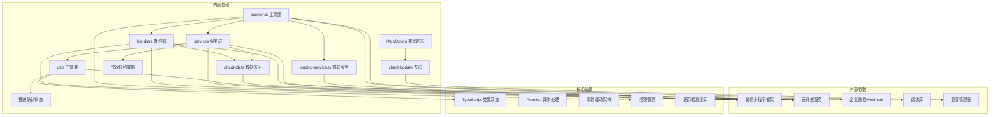

**图表来源**
- [cashier.ts](file://miniprogram/pages/cashier/cashier.ts#L1-L497)
- [cloud-db.ts](file://miniprogram/utils/cloud-db.ts#L1-L321)
- [loading-service.ts](file://miniprogram/utils/loading-service.ts#L1-L282)
- [sendWechatMessage/index.js](file://cloudfunctions/sendWechatMessage/index.js#L1-L72)
- [index.d.ts](file://typings/index.d.ts#L225-L245)
- [app.ts](file://miniprogram/app.ts#L43-L79)

**章节来源**
- [cashier.ts](file://miniprogram/pages/cashier/cashier.ts#L1-L497)
- [cloud-db.ts](file://miniprogram/utils/cloud-db.ts#L1-L321)
- [index.d.ts](file://typings/index.d.ts#L225-L245)

## 类型系统改进

**更新** 本次更新重点关注TypeScript类型系统的改进，特别是CashierPage接口的使用从any类型替换为明确的CashierPage类型，显著提升了代码的类型安全性和可维护性。**新增** IAppOption接口中checkUpdate方法签名的增强，确保了小程序版本更新检测功能的类型安全性。

### CashierPage接口类型改进

系统现在使用明确的CashierPage接口类型替代了any类型，提供了完整的类型安全保障：

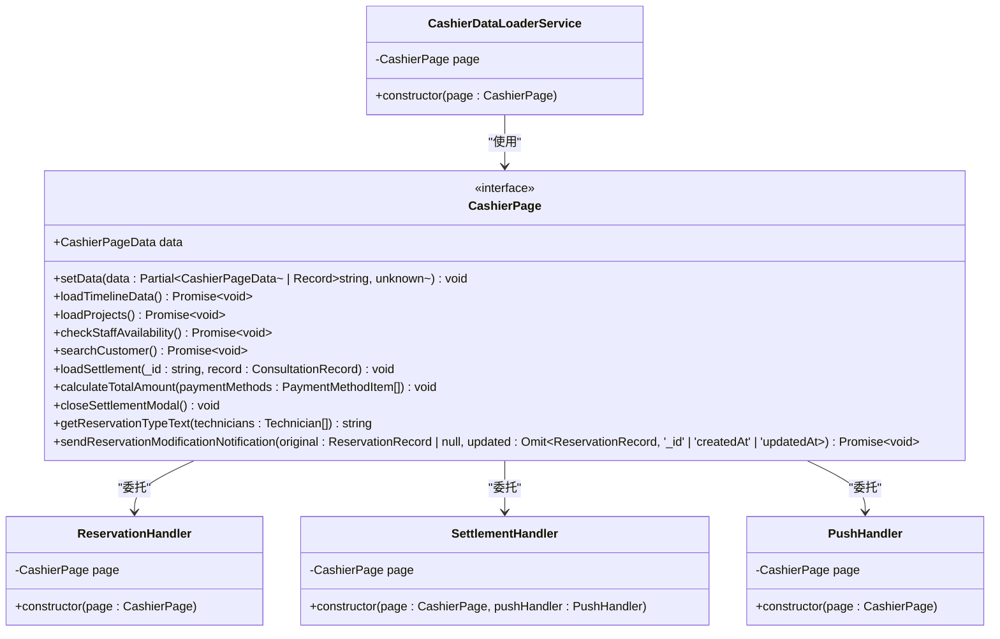

**图表来源**
- [cashier.types.ts](file://miniprogram/pages/cashier/cashier.types.ts#L102-L121)
- [reservation.handler.ts](file://miniprogram/pages/cashier/handlers/reservation.handler.ts#L11-L18)
- [settlement.handler.ts](file://miniprogram/pages/cashier/handlers/settlement.handler.ts#L8-L14)
- [push.handler.ts](file://miniprogram/pages/cashier/handlers/push.handler.ts#L8-L13)
- [data-loader.service.ts](file://miniprogram/pages/cashier/services/data-loader.service.ts#L16-L21)

### IAppOption接口类型增强

**新增** 系统在IAppOption接口中新增了checkUpdate方法签名，确保了小程序版本更新检测功能的类型安全性：

```mermaid
classDiagram
class IAppOption {
<<interface>>
+T extends Record~string, any~ globalData
+userInfoReadyCallback? : GetUserInfoSuccessCallback
+onLaunch? : () => void | Promise~void~
+onShow? : (options : LaunchShowOption) => void
+onHide? : () => void
+onError? : (error : string) => void
+checkUpdate : () => void
+loadGlobalData : () => Promise~void~
+getProjects : () => Promise~Project[]~
+getRooms : () => Promise~Room[]~
+getEssentialOils : () => Promise~EssentialOil[]~
+initLogin : () => Promise~void~
+getStaffs : () => Promise~StaffInfo[]~
+getActiveStaffs : () => Promise~StaffInfo[]~
+getStaff : (id : string) => Promise~StaffInfo | null~
+getRotationQueue : (date : string) => Promise~RotationQueue | null~
+serveCustomer : (date : string, staffId : string, isClockIn : boolean) => Promise~void~
+adjustRotationPosition : (date : string, fromIndex : number, toIndex : number) => Promise~RotationQueue | null~
+getNextTechnician : (date : string) => Promise~RotationItem | null~
}
class App {
+checkUpdate() void
+onLaunch() void
}
IAppOption --> App : "约束"
```

**图表来源**
- [index.d.ts](file://typings/index.d.ts#L225-L245)
- [app.ts](file://miniprogram/app.ts#L43-L79)

### 类型安全性的提升

通过使用CashierPage和IAppOption接口，系统获得了以下类型安全性改进：

1. **编译时类型检查**：所有对CashierPage和App实例的操作都会经过TypeScript编译器的类型检查
2. **IDE智能提示**：开发者可以获得完整的属性和方法智能提示，包括checkUpdate方法
3. **重构安全性**：当CashierPage或IAppOption接口发生变化时，编译器会立即报告所有相关的类型错误
4. **文档化契约**：CashierPage和IAppOption接口明确了页面实例和应用实例应该提供的完整API契约
5. **更新检测类型安全**：通过IAppOption接口的checkUpdate方法签名，确保了更新检测功能的类型安全性

### 类型使用示例

在各个处理器中，CashierPage接口的使用方式如下：

```typescript
// 在构造函数中使用
constructor(page: CashierPage) {
    this.page = page;
}

// 在方法调用中使用
async openReserveModal(): Promise<void> {
    await this.page.checkStaffAvailability();
    this.page.setData({ showReserveModal: true });
}

// 在数据访问中使用
const { date, startTime, project } = this.page.data.reserveForm;
```

在应用层，checkUpdate方法的使用方式如下：

```typescript
// 在应用启动时调用
onLaunch() {
    this.checkUpdate(); // 类型安全的调用
    this.initLogin();
    this.loadGlobalData();
}

// 在IAppOption接口中声明
interface IAppOption<T extends Record<string, any> = AppGlobalData> {
    // ... 其他方法
    checkUpdate: () => void;
}
```

**章节来源**
- [cashier.types.ts](file://miniprogram/pages/cashier/cashier.types.ts#L102-L121)
- [index.d.ts](file://typings/index.d.ts#L225-L245)
- [reservation.handler.ts](file://miniprogram/pages/cashier/handlers/reservation.handler.ts#L11-L18)
- [settlement.handler.ts](file://miniprogram/pages/cashier/handlers/settlement.handler.ts#L8-L14)
- [push.handler.ts](file://miniprogram/pages/cashier/handlers/push.handler.ts#L8-L13)
- [data-loader.service.ts](file://miniprogram/pages/cashier/services/data-loader.service.ts#L16-L21)
- [app.ts](file://miniprogram/app.ts#L43-L79)

## 性能考虑

### 并行数据加载优化

系统在数据加载阶段采用了并行处理策略，显著提升了响应速度：

```mermaid
flowchart TD
Start([开始数据加载]) --> ParallelLoad["并行加载多个数据源"]
ParallelLoad --> Rooms["获取房间列表"]
ParallelLoad --> Consultations["查询咨询记录"]
ParallelLoad --> Schedules["获取排班记录"]
ParallelLoad --> Staffs["获取员工列表"]
ParallelLoad --> TechAvailability["调用技师可用性接口"]
Rooms --> WaitAll["等待所有请求完成"]
Consultations --> WaitAll
Schedules --> WaitAll
Staffs --> WaitAll
TechAvailability --> WaitAll
WaitAll --> ProcessData["处理和组装数据"]
ProcessData --> UpdateUI["更新页面状态"]
UpdateUI --> End([数据加载完成])
```

**图表来源**
- [data-loader.service.ts](file://miniprogram/pages/cashier/services/data-loader.service.ts#L36-L50)

### 加载服务集成优化

**更新** 新增了加载服务的集成优化，通过 `LoadingService` 提供统一的加载状态管理和防重复提交机制：

```mermaid
flowchart TD
Start([开始异步操作]) --> CheckLock["检查锁状态"]
CheckLock --> |已锁定| SkipRequest["跳过重复请求"]
CheckLock --> |未锁定| AcquireLock["获取锁"]
AcquireLock --> ShowLoading["显示加载状态"]
ShowLoading --> ExecuteOp["执行异步操作"]
ExecuteOp --> Success{"操作成功?"}
Success --> |是| ShowSuccess["显示成功提示"]
Success --> |否| ShowError["显示错误提示"]
ShowSuccess --> HideLoading["隐藏加载状态"]
ShowError --> HideLoading
HideLoading --> ReleaseLock["释放锁"]
SkipRequest --> End([结束])
ReleaseLock --> End
```

### 内存管理和状态优化

系统通过合理的状态管理避免了内存泄漏和性能问题：

- 使用局部状态管理，避免全局状态污染
- 实现状态更新的批量处理，减少不必要的重渲染
- 采用懒加载策略，只在需要时初始化处理器实例
- 集成加载服务，提供统一的加载状态管理
- 新增推送确认状态管理，防止重复推送
- 优化快速预约数据缓存，提升响应速度
- **更新** 通过CashierPage接口的明确类型定义，减少了运行时类型检查的开销
- **新增** 通过IAppOption接口的checkUpdate方法签名，确保了更新检测功能的类型安全性

## 故障排除指南

### 常见问题及解决方案

#### 登录认证问题

**问题描述**: 用户登录状态异常或权限验证失败

**解决方案**:
1. 检查 `authManager` 的登录状态
2. 验证 `currentUser` 和 `token` 的有效性
3. 实施自动重定向到登录页面的机制

#### 数据同步问题

**问题描述**: 页面数据显示不同步或过期

**解决方案**:
1. 实现数据刷新机制，在页面显示时重新加载数据
2. 使用 `timelineRefreshTrigger` 确保时间轴正确刷新
3. 检查 `loadGlobalData` 的执行状态

#### 云函数调用失败

**问题描述**: 预约、结算或推送功能调用云函数失败

**解决方案**:
1. 检查网络连接状态
2. 验证云函数的返回格式和状态码
3. 实施重试机制和错误回退策略

#### 轮班重置失败

**问题描述**: `resetRotation()` 方法执行失败

**解决方案**:
1. 检查用户权限，确保具有 `pushRotation` 权限
2. 验证 `manageRotation` 云函数的 `init` 操作
3. 检查 `LoadingService` 的锁状态和加载状态
4. 查看控制台错误日志，确认数据库连接状态

#### 快速预约功能异常

**问题描述**: 快速预约功能无法正常使用

**解决方案**:
1. 检查快速预约数据的加载状态
2. 验证 `quickReservationSlots` 数据结构
3. 确认 `copyReservationSlot` 方法的执行状态
4. 检查剪贴板权限和API调用

#### 推送确认弹窗问题

**问题描述**: 推送确认弹窗无法正常显示或操作

**解决方案**:
1. 检查 `pushModal` 状态管理
2. 验证推送消息的内容和格式
3. 确认企业微信Webhook配置
4. 检查推送权限和网络连接

#### 到店确认功能异常

**问题描述**: 到店确认功能无法正常工作

**解决方案**:
1. 检查 `arrivalConfirmModal` 状态
2. 验证预约记录的加载状态
3. 确认推送和跳过功能的实现
4. 检查页面导航逻辑

#### 类型系统相关问题

**更新** 新增了类型系统相关的故障排除指南：

**问题描述**: TypeScript编译错误，提示CashierPage类型不匹配

**解决方案**:
1. 检查CashierPage接口定义是否完整
2. 确认所有处理器都使用CashierPage接口而非any类型
3. 验证setData方法的参数类型是否符合CashierPageData接口
4. 检查类型导入语句是否正确
5. 确认TypeScript配置文件中的类型检查设置

**问题描述**: TypeScript编译错误，提示IAppOption接口缺少checkUpdate方法

**解决方案**:
1. 检查IAppOption接口定义，确认checkUpdate方法签名
2. 确认App类实现了checkUpdate方法
3. 验证checkUpdate方法的返回类型和参数类型
4. 检查类型导入语句是否正确
5. 确认TypeScript配置文件中的类型检查设置

**问题描述**: 更新检测功能异常

**解决方案**:
1. 检查wx.getUpdateManager是否存在
2. 验证checkUpdate方法的实现逻辑
3. 确认更新管理器的事件监听器正确设置
4. 检查应用启动时是否正确调用了checkUpdate方法
5. 验证更新检测的权限和配置

#### 应用类型系统相关问题

**新增** 新增了应用类型系统相关的故障排除指南：

**问题描述**: IAppOption接口类型不匹配

**解决方案**:
1. 检查IAppOption接口定义是否完整
2. 确认所有应用实例都实现IAppOption接口
3. 验证checkUpdate方法的签名是否正确
4. 检查类型导入语句是否正确
5. 确认TypeScript配置文件中的类型检查设置

**章节来源**
- [cashier.ts](file://miniprogram/pages/cashier/cashier.ts#L106-L133)
- [app.ts](file://miniprogram/app.ts#L18-L38)
- [loading-service.ts](file://miniprogram/utils/loading-service.ts#L80-L141)
- [cashier.types.ts](file://miniprogram/pages/cashier/cashier.types.ts#L102-L121)
- [index.d.ts](file://typings/index.d.ts#L225-L245)

## 结论

收银台类型系统通过模块化的设计和清晰的架构分离，成功实现了专业按摩服务管理的核心需求。系统的主要优势包括：

### 技术优势

1. **模块化架构**: 采用处理器模式，职责分离明确，便于维护和扩展
2. **类型安全**: 完整的TypeScript类型定义，提升代码质量和开发体验
3. **异步处理**: 合理的Promise和async/await使用，保证良好的用户体验
4. **数据一致性**: 通过云函数实现业务逻辑的集中管理和数据一致性保障
5. **加载服务集成**: 统一的加载状态管理和防重复提交机制，提升用户体验
6. **推送确认机制**: 新增的推送确认弹窗，提供精确的消息控制能力
7. **快速预约功能**: 支持四种不同类型的快速预约，提升用户操作效率
8. **到店确认系统**: 人性化的到店处理流程，支持推送和跳过两种选项
9. **轮班重置功能**: 支持管理员手动重置轮班计划，提供更好的系统管理能力
10. **预约变更跟踪**: 详细的变更记录和通知机制
11. **类型系统改进**: 通过明确的CashierPage接口替代any类型，显著提升类型安全性
12. **应用类型系统增强**: 通过IAppOption接口的checkUpdate方法签名，确保更新检测功能的类型安全性

### 功能特色

1. **智能技师调度**: 基于轮牌算法和实时可用性计算的智能分配
2. **多场景推送**: 支持预约、结算、到店等多种场景的消息通知
3. **灵活支付方式**: 支持多种支付渠道和会员卡结算
4. **实时数据同步**: 云端数据与本地状态的实时同步机制
5. **更新检测功能**: 通过checkUpdate方法实现小程序版本的自动更新检测
6. **快速预约系统**: 四种不同类型的快速预约模式
7. **到店确认流程**: 人性化的到店处理体验

### 扩展性考虑

系统具备良好的扩展性，可以轻松添加新的功能模块：
- 新的支付方式集成
- 额外的业务流程支持
- 自定义报表和统计功能
- 第三方服务集成
- 更多的快速预约类型支持
- 增强的更新检测和管理功能

**更新** 本次更新大幅增强了收银台的功能，特别是快速预约系统、推送确认机制、到店确认流程和应用类型系统。新增的四种预约类型、推送确认弹窗功能、到店确认流程和IAppOption接口的checkUpdate方法签名，使得系统能够更好地满足专业按摩服务行业的复杂需求。

通过引入明确的CashierPage接口类型和增强的IAppOption接口，系统在保持功能强大性的同时，显著提升了代码的类型安全性和可维护性。这种类型安全性的提升不仅减少了运行时错误，还改善了开发体验，使开发者能够获得更好的IDE支持和重构能力。

通过持续的优化和迭代，该系统能够满足专业按摩服务行业的复杂需求，为用户提供高效、便捷的服务管理体验。**新增** 的应用类型系统增强确保了小程序版本更新检测功能的类型安全性，为系统的长期稳定运行提供了坚实的基础。