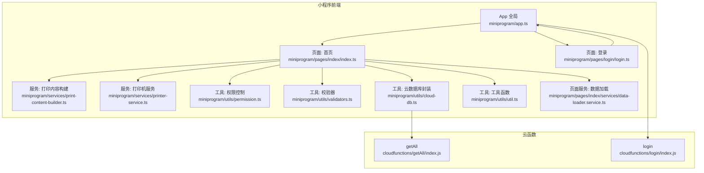
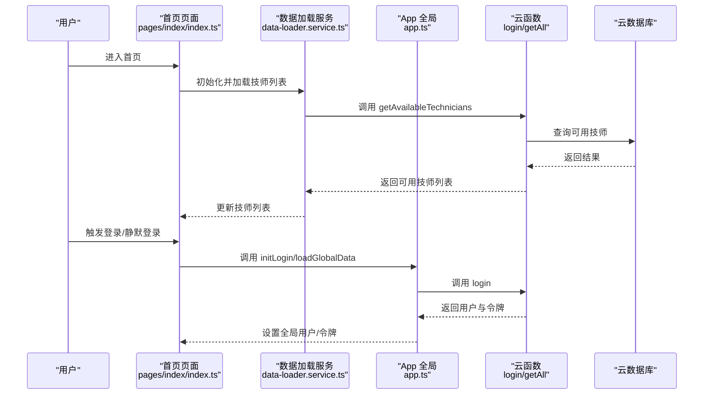
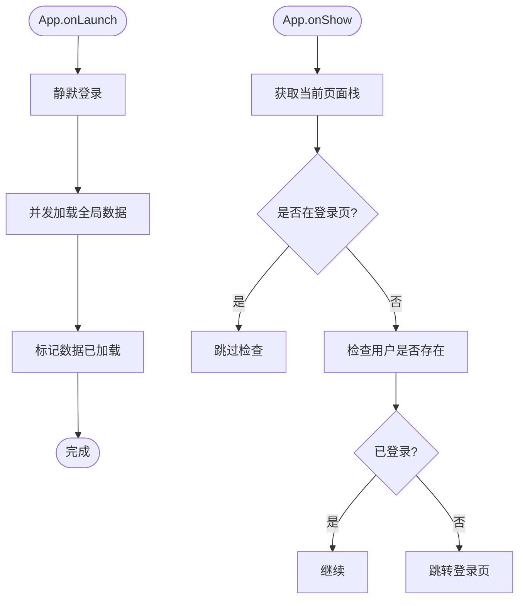
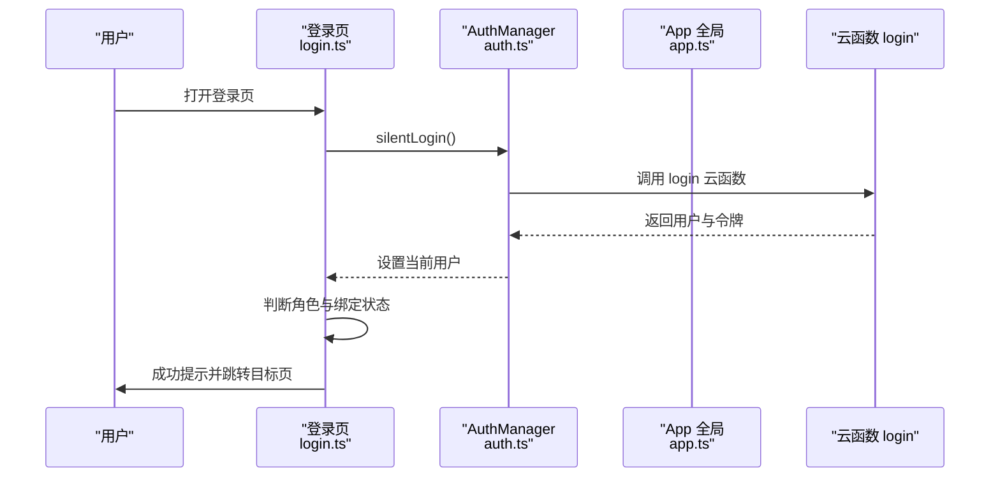
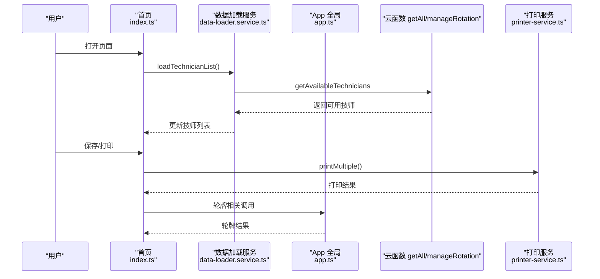
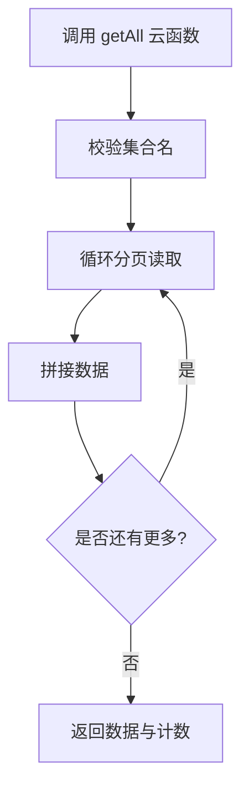
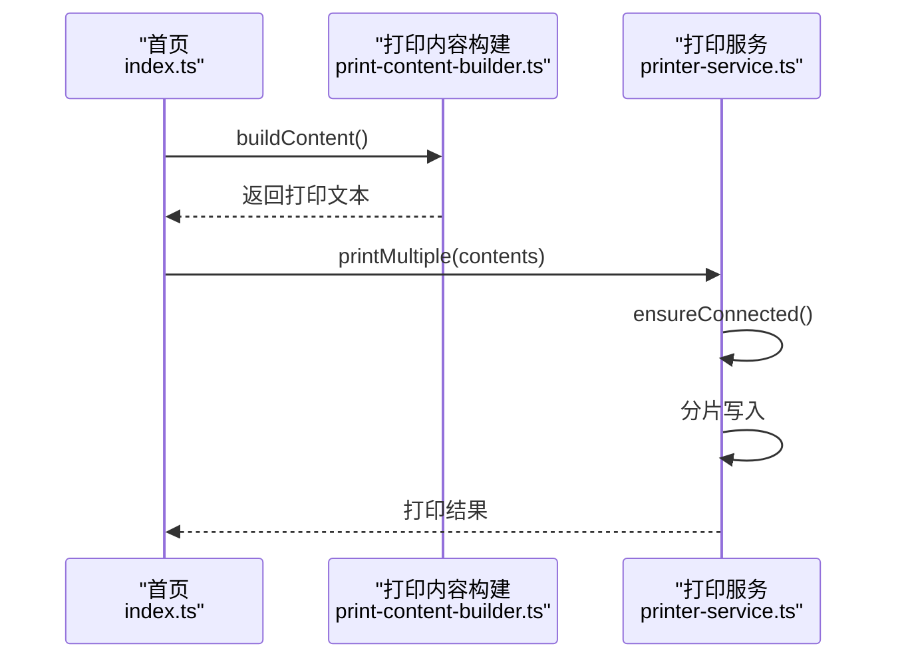
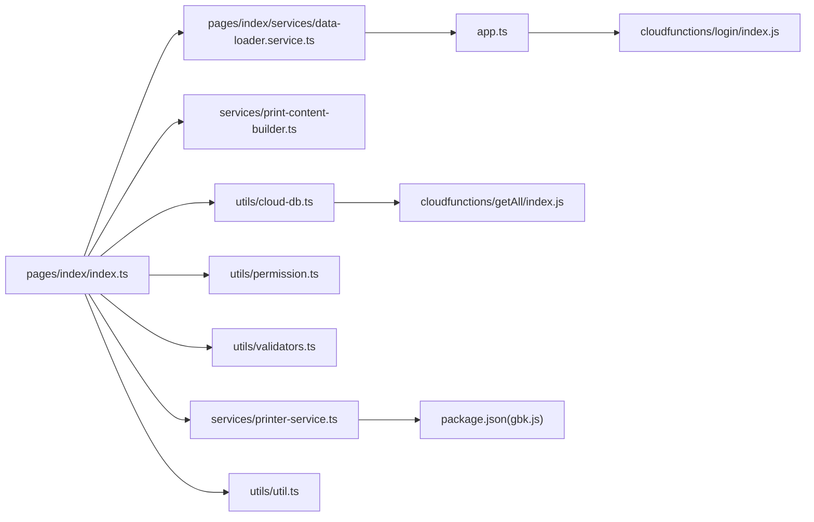

# 小程序运行时问题

<cite>
**本文引用的文件**
- [miniprogram/app.ts](file://miniprogram/app.ts)
- [miniprogram/app.json](file://miniprogram/app.json)
- [miniprogram/utils/auth.ts](file://miniprogram/utils/auth.ts)
- [miniprogram/utils/cloud-db.ts](file://miniprogram/utils/cloud-db.ts)
- [miniprogram/utils/util.ts](file://miniprogram/utils/util.ts)
- [miniprogram/pages/index/index.ts](file://miniprogram/pages/index/index.ts)
- [miniprogram/pages/login/login.ts](file://miniprogram/pages/login/login.ts)
- [miniprogram/services/print-content-builder.ts](file://miniprogram/services/print-content-builder.ts)
- [miniprogram/services/printer-service.ts](file://miniprogram/services/printer-service.ts)
- [miniprogram/utils/validators.ts](file://miniprogram/utils/validators.ts)
- [miniprogram/utils/permission.ts](file://miniprogram/utils/permission.ts)
- [miniprogram/pages/index/services/data-loader.service.ts](file://miniprogram/pages/index/services/data-loader.service.ts)
- [cloudfunctions/getAll/index.js](file://cloudfunctions/getAll/index.js)
- [cloudfunctions/login/index.js](file://cloudfunctions/login/index.js)
- [package.json](file://package.json)
</cite>

## 目录
1. [简介](#简介)
2. [项目结构](#项目结构)
3. [核心组件](#核心组件)
4. [架构总览](#架构总览)
5. [详细组件分析](#详细组件分析)
6. [依赖关系分析](#依赖关系分析)
7. [性能与内存考虑](#性能与内存考虑)
8. [故障排查指南](#故障排查指南)
9. [结论](#结论)
10. [附录](#附录)

## 简介
本指南面向小程序运行时问题的快速定位与解决，覆盖页面加载失败、组件渲染异常、生命周期错误、内存泄漏、性能瓶颈、兼容性问题、网络请求失败、异步操作异常、状态管理问题、调试工具使用、版本兼容与API变更适配、第三方库冲突、缓存与本地存储异常、权限申请失败、崩溃日志分析与错误上报、用户反馈收集等主题。文档结合代码库实际实现，提供可执行的排查步骤、可视化图示与最佳实践。

## 项目结构
项目采用分层组织：页面层、业务服务层、工具与权限层、云函数层。页面通过服务与工具模块完成数据加载、权限控制、打印输出、表单校验等功能；云函数负责数据库读取与用户认证逻辑；全局应用对象负责全局数据与云函数调用封装。

**图表来源**
- [miniprogram/app.ts](file://miniprogram/app.ts#L1-L191)
- [miniprogram/pages/index/index.ts](file://miniprogram/pages/index/index.ts#L1-L735)
- [miniprogram/pages/login/login.ts](file://miniprogram/pages/login/login.ts#L1-L166)
- [miniprogram/services/print-content-builder.ts](file://miniprogram/services/print-content-builder.ts#L1-L144)
- [miniprogram/services/printer-service.ts](file://miniprogram/services/printer-service.ts#L1-L298)
- [miniprogram/utils/permission.ts](file://miniprogram/utils/permission.ts#L1-L194)
- [miniprogram/utils/validators.ts](file://miniprogram/utils/validators.ts#L1-L81)
- [miniprogram/utils/cloud-db.ts](file://miniprogram/utils/cloud-db.ts#L1-L321)
- [miniprogram/utils/util.ts](file://miniprogram/utils/util.ts#L1-L150)
- [miniprogram/pages/index/services/data-loader.service.ts](file://miniprogram/pages/index/services/data-loader.service.ts#L1-L206)
- [cloudfunctions/getAll/index.js](file://cloudfunctions/getAll/index.js#L1-L59)
- [cloudfunctions/login/index.js](file://cloudfunctions/login/index.js#L1-L180)

**章节来源**
- [miniprogram/app.ts](file://miniprogram/app.ts#L1-L191)
- [miniprogram/app.json](file://miniprogram/app.json#L1-L35)

## 核心组件
- 全局应用对象：负责静默登录、全局数据加载、云函数调用封装（轮牌、查询等）。
- 登录页面：负责登录状态检查、授权手机号、权限跳转。
- 首页页面：表单、校验、打印、预约加载、轮牌交互、保存与删除预约。
- 云数据库封装：统一数据库访问、分页、条件查询、插入/更新/删除。
- 打印服务：蓝牙打印机连接、分片写入、多联打印。
- 权限工具：基于角色的页面与按钮级权限判断。
- 校验器：咨询单与双人模式校验。
- 数据加载服务：技师可用性查询、编辑/预约数据加载。
- 工具函数：时间/日期/时长计算、加班单位计算等。

**章节来源**
- [miniprogram/app.ts](file://miniprogram/app.ts#L1-L191)
- [miniprogram/pages/login/login.ts](file://miniprogram/pages/login/login.ts#L1-L166)
- [miniprogram/pages/index/index.ts](file://miniprogram/pages/index/index.ts#L1-L735)
- [miniprogram/utils/cloud-db.ts](file://miniprogram/utils/cloud-db.ts#L1-L321)
- [miniprogram/services/printer-service.ts](file://miniprogram/services/printer-service.ts#L1-L298)
- [miniprogram/utils/permission.ts](file://miniprogram/utils/permission.ts#L1-L194)
- [miniprogram/utils/validators.ts](file://miniprogram/utils/validators.ts#L1-L81)
- [miniprogram/pages/index/services/data-loader.service.ts](file://miniprogram/pages/index/services/data-loader.service.ts#L1-L206)
- [miniprogram/utils/util.ts](file://miniprogram/utils/util.ts#L1-L150)

## 架构总览
小程序前端通过全局应用对象与云函数交互，页面通过服务与工具模块完成业务闭环；打印服务通过蓝牙与第三方编码库实现内容输出；权限与校验贯穿各环节，确保安全与正确性。

**图表来源**
- [miniprogram/pages/index/index.ts](file://miniprogram/pages/index/index.ts#L126-L147)
- [miniprogram/pages/index/services/data-loader.service.ts](file://miniprogram/pages/index/services/data-loader.service.ts#L13-L65)
- [miniprogram/app.ts](file://miniprogram/app.ts#L18-L66)
- [cloudfunctions/login/index.js](file://cloudfunctions/login/index.js#L11-L90)
- [cloudfunctions/getAll/index.js](file://cloudfunctions/getAll/index.js#L9-L58)

## 详细组件分析

### 组件A：全局应用对象与生命周期
- onLaunch：静默登录、全局数据加载。
- onShow：检测登录状态，未登录则跳转登录页。
- 全局数据加载：并发拉取多个集合，设置全局标志位避免重复加载。
- 云函数封装：轮牌队列、下一个技师、服务客户、调整位置等。

**图表来源**
- [miniprogram/app.ts](file://miniprogram/app.ts#L13-L38)
- [miniprogram/app.ts](file://miniprogram/app.ts#L40-L66)

**章节来源**
- [miniprogram/app.ts](file://miniprogram/app.ts#L1-L191)

### 组件B：登录与权限控制
- 登录状态检查：静默登录、绑定技师提示、权限跳转。
- 权限工具：页面与按钮级权限映射，基于角色配置。

**图表来源**
- [miniprogram/pages/login/login.ts](file://miniprogram/pages/login/login.ts#L15-L49)
- [miniprogram/utils/auth.ts](file://miniprogram/utils/auth.ts#L78-L126)
- [cloudfunctions/login/index.js](file://cloudfunctions/login/index.js#L11-L90)

**章节来源**
- [miniprogram/pages/login/login.ts](file://miniprogram/pages/login/login.ts#L1-L166)
- [miniprogram/utils/auth.ts](file://miniprogram/utils/auth.ts#L1-L245)
- [miniprogram/utils/permission.ts](file://miniprogram/utils/permission.ts#L1-L194)

### 组件C：首页页面与数据加载
- 表单与校验：双人模式、项目/精油/部位选择、报钟时间选择。
- 数据加载：并发查询技师列表、项目列表、编辑/预约数据加载。
- 保存与打印：生成打印内容、调用打印机服务、删除预约、轮牌更新、未来预约重新分配。

**图表来源**
- [miniprogram/pages/index/index.ts](file://miniprogram/pages/index/index.ts#L126-L147)
- [miniprogram/pages/index/services/data-loader.service.ts](file://miniprogram/pages/index/services/data-loader.service.ts#L13-L65)
- [miniprogram/app.ts](file://miniprogram/app.ts#L110-L189)
- [miniprogram/services/printer-service.ts](file://miniprogram/services/printer-service.ts#L210-L233)

**章节来源**
- [miniprogram/pages/index/index.ts](file://miniprogram/pages/index/index.ts#L1-L735)
- [miniprogram/pages/index/services/data-loader.service.ts](file://miniprogram/pages/index/services/data-loader.service.ts#L1-L206)

### 组件D：云数据库封装与getAll云函数
- 封装：初始化、集合获取、全量查询、条件查询、分页、增删改查。
- getAll云函数：分页拉取集合全部数据，避免超限。

**图表来源**
- [miniprogram/utils/cloud-db.ts](file://miniprogram/utils/cloud-db.ts#L69-L88)
- [cloudfunctions/getAll/index.js](file://cloudfunctions/getAll/index.js#L9-L58)

**章节来源**
- [miniprogram/utils/cloud-db.ts](file://miniprogram/utils/cloud-db.ts#L1-L321)
- [cloudfunctions/getAll/index.js](file://cloudfunctions/getAll/index.js#L1-L59)

### 组件E：打印服务与内容构建
- 打印服务：蓝牙适配器初始化、设备发现、连接、服务与特征查找、分片写入、断开。
- 内容构建：根据咨询单信息生成打印文本，含项目、技师、房间、力度、精油、部位、备注等。

**图表来源**
- [miniprogram/services/print-content-builder.ts](file://miniprogram/services/print-content-builder.ts#L31-L80)
- [miniprogram/services/printer-service.ts](file://miniprogram/services/printer-service.ts#L182-L233)

**章节来源**
- [miniprogram/services/print-content-builder.ts](file://miniprogram/services/print-content-builder.ts#L1-L144)
- [miniprogram/services/printer-service.ts](file://miniprogram/services/printer-service.ts#L1-L298)

### 组件F：校验器与工具函数
- 校验器：单人/双人模式校验、必填项与精油需求校验。
- 工具函数：时间/日期格式化、项目时长解析、加班单位计算、日期推移。

**章节来源**
- [miniprogram/utils/validators.ts](file://miniprogram/utils/validators.ts#L1-L81)
- [miniprogram/utils/util.ts](file://miniprogram/utils/util.ts#L1-L150)

## 依赖关系分析
- 页面依赖服务与工具模块，服务依赖云数据库与App全局能力。
- 云函数依赖数据库SDK与云开发环境。
- 打印服务依赖 gbk.js 编码库与蓝牙API。
- 权限与校验模块被页面与服务广泛使用。

**图表来源**
- [miniprogram/pages/index/index.ts](file://miniprogram/pages/index/index.ts#L1-L14)
- [miniprogram/pages/index/services/data-loader.service.ts](file://miniprogram/pages/index/services/data-loader.service.ts#L1-L4)
- [miniprogram/services/print-content-builder.ts](file://miniprogram/services/print-content-builder.ts#L1-L2)
- [miniprogram/services/printer-service.ts](file://miniprogram/services/printer-service.ts#L1-L1)
- [miniprogram/utils/permission.ts](file://miniprogram/utils/permission.ts#L1-L1)
- [miniprogram/utils/validators.ts](file://miniprogram/utils/validators.ts#L1-L1)
- [miniprogram/utils/cloud-db.ts](file://miniprogram/utils/cloud-db.ts#L1-L1)
- [miniprogram/utils/util.ts](file://miniprogram/utils/util.ts#L1-L1)
- [miniprogram/app.ts](file://miniprogram/app.ts#L1-L2)
- [cloudfunctions/getAll/index.js](file://cloudfunctions/getAll/index.js#L1-L1)
- [cloudfunctions/login/index.js](file://cloudfunctions/login/index.js#L1-L1)
- [package.json](file://package.json#L25-L27)

**章节来源**
- [package.json](file://package.json#L1-L28)

## 性能与内存考虑
- 并发加载：全局数据使用并发拉取，减少等待时间，注意避免同时发起过多请求导致抖动。
- 分页查询：getAll云函数采用分页策略，避免一次性读取过多数据。
- 打印分片：打印服务按固定块大小分片写入，降低单次写入压力。
- 状态管理：页面setData使用局部更新，避免不必要的整页重绘。
- 内存优化：打印服务断开时清理状态与监听，避免残留回调占用内存。

[本节为通用建议，无需特定文件引用]

## 故障排查指南

### 页面加载失败
- 症状：进入页面白屏或长时间无响应。
- 排查步骤：
  - 检查页面是否进行登录校验与权限判断。
  - 查看数据加载服务是否成功调用云函数并返回数据。
  - 确认全局数据加载是否已完成或处于加载中。
- 关键路径参考：
  - 页面加载与权限：[miniprogram/pages/index/index.ts](file://miniprogram/pages/index/index.ts#L126-L147)
  - 数据加载服务：[miniprogram/pages/index/services/data-loader.service.ts](file://miniprogram/pages/index/services/data-loader.service.ts#L13-L65)
  - 全局数据加载：[miniprogram/app.ts](file://miniprogram/app.ts#L40-L66)

**章节来源**
- [miniprogram/pages/index/index.ts](file://miniprogram/pages/index/index.ts#L126-L147)
- [miniprogram/pages/index/services/data-loader.service.ts](file://miniprogram/pages/index/services/data-loader.service.ts#L13-L65)
- [miniprogram/app.ts](file://miniprogram/app.ts#L40-L66)

### 组件渲染异常
- 症状：界面元素不显示、布局错乱、数据不更新。
- 排查步骤：
  - 检查 setData 的字段路径是否正确，避免深层路径拼接错误。
  - 确认模板中使用的变量是否已在 data 中初始化。
  - 校验器返回的验证结果是否阻断了渲染。
- 关键路径参考：
  - 表单事件与setData：[miniprogram/pages/index/index.ts](file://miniprogram/pages/index/index.ts#L210-L260)
  - 校验器：[miniprogram/utils/validators.ts](file://miniprogram/utils/validators.ts#L51-L72)

**章节来源**
- [miniprogram/pages/index/index.ts](file://miniprogram/pages/index/index.ts#L210-L260)
- [miniprogram/utils/validators.ts](file://miniprogram/utils/validators.ts#L51-L72)

### 生命周期错误
- 症状：onShow/onHide时机不当、重复初始化。
- 排查步骤：
  - onShow中仅做必要刷新，避免重复加载。
  - onLaunch中只做一次初始化，避免重复调用。
- 关键路径参考：
  - 生命周期入口：[miniprogram/app.ts](file://miniprogram/app.ts#L13-L38)

**章节来源**
- [miniprogram/app.ts](file://miniprogram/app.ts#L13-L38)

### 内存泄漏
- 症状：页面切换后仍占用内存、打印服务断开后仍有回调。
- 排查步骤：
  - 打印服务断开时关闭蓝牙适配器与停止扫描。
  - 清理连接中的Promise与状态。
- 关键路径参考：
  - 断开逻辑：[miniprogram/services/printer-service.ts](file://miniprogram/services/printer-service.ts#L271-L294)

**章节来源**
- [miniprogram/services/printer-service.ts](file://miniprogram/services/printer-service.ts#L271-L294)

### 性能瓶颈
- 症状：页面卡顿、打印延迟、查询缓慢。
- 排查步骤：
  - getAll云函数已采用分页，避免一次性读取过多。
  - 打印分片写入，适当增加间隔。
  - 避免在渲染路径中进行复杂计算。
- 关键路径参考：
  - 分页读取：[cloudfunctions/getAll/index.js](file://cloudfunctions/getAll/index.js#L25-L44)
  - 分片写入：[miniprogram/services/printer-service.ts](file://miniprogram/services/printer-service.ts#L235-L268)

**章节来源**
- [cloudfunctions/getAll/index.js](file://cloudfunctions/getAll/index.js#L25-L44)
- [miniprogram/services/printer-service.ts](file://miniprogram/services/printer-service.ts#L235-L268)

### 兼容性问题
- 症状：不同基础库版本表现不一致。
- 排查步骤：
  - 检查 app.json 中 Skyline 渲染选项与版本范围。
  - 关注组件框架与渲染选项对旧版本的影响。
- 关键路径参考：
  - 渲染与框架配置：[miniprogram/app.json](file://miniprogram/app.json#L23-L34)

**章节来源**
- [miniprogram/app.json](file://miniprogram/app.json#L23-L34)

### 网络请求失败
- 症状：云函数调用失败、返回格式错误。
- 排查步骤：
  - 检查云函数返回结构与code字段。
  - 在调用端对返回值进行类型与字段校验。
- 关键路径参考：
  - 云函数返回结构：[cloudfunctions/login/index.js](file://cloudfunctions/login/index.js#L75-L83)
  - 调用端校验：[miniprogram/utils/cloud-db.ts](file://miniprogram/utils/cloud-db.ts#L76-L84)

**章节来源**
- [cloudfunctions/login/index.js](file://cloudfunctions/login/index.js#L75-L83)
- [miniprogram/utils/cloud-db.ts](file://miniprogram/utils/cloud-db.ts#L76-L84)

### 异步操作异常
- 症状：Promise未捕获异常、竞态条件。
- 排查步骤：
  - 对所有异步调用添加try/catch。
  - 使用App层的loadPromise避免重复并发。
- 关键路径参考：
  - 全局加载Promise：[miniprogram/app.ts](file://miniprogram/app.ts#L40-L66)

**章节来源**
- [miniprogram/app.ts](file://miniprogram/app.ts#L40-L66)

### 状态管理问题
- 症状：页面状态不一致、刷新后丢失。
- 排查步骤：
  - 使用局部setData更新，避免跨组件共享复杂状态。
  - 对关键状态进行持久化或从服务器恢复。
- 关键路径参考：
  - 页面状态定义：[miniprogram/pages/index/index.ts](file://miniprogram/pages/index/index.ts#L76-L120)

**章节来源**
- [miniprogram/pages/index/index.ts](file://miniprogram/pages/index/index.ts#L76-L120)

### 调试工具使用
- 开发者工具：启用“不校验合法域名”“不检验安全域名”“忽略HTTPS证书错误”等选项，便于本地联调。
- 真机调试：通过“预览/上传”二维码在真机上复现问题。
- 远程调试：开启“打开调试”，查看网络面板、控制台、性能面板。
- 日志：在关键路径添加日志，如云函数调用前后、打印服务连接状态变化。

[本节为通用指导，无需特定文件引用]

### 版本兼容与API变更
- 渲染与框架：关注Skyline与组件框架版本差异。
- 云函数：确保云函数SDK版本与基础库兼容。
- 第三方库：如GBK编码库，需在package.json中声明并在编译时可用。

**章节来源**
- [miniprogram/app.json](file://miniprogram/app.json#L23-L34)
- [package.json](file://package.json#L25-L27)

### 第三方库冲突
- 症状：打包失败、运行时报错。
- 排查步骤：
  - 检查依赖版本与冲突。
  - 确保GBK库在运行时可访问。
- 关键路径参考：
  - 依赖声明：[package.json](file://package.json#L25-L27)

**章节来源**
- [package.json](file://package.json#L25-L27)

### 缓存与本地存储异常
- 症状：登录态丢失、用户信息不更新。
- 排查步骤：
  - 检查AuthManager的存储读写与错误处理。
  - 确认静默登录流程与云函数返回。
- 关键路径参考：
  - 存储读写：[miniprogram/utils/auth.ts](file://miniprogram/utils/auth.ts#L21-L49)
  - 静默登录：[miniprogram/utils/auth.ts](file://miniprogram/utils/auth.ts#L78-L126)

**章节来源**
- [miniprogram/utils/auth.ts](file://miniprogram/utils/auth.ts#L21-L49)
- [miniprogram/utils/auth.ts](file://miniprogram/utils/auth.ts#L78-L126)

### 权限申请失败
- 症状：页面无权限、按钮不可见。
- 排查步骤：
  - 检查角色权限映射与用户当前角色。
  - 确认页面与按钮权限判断逻辑。
- 关键路径参考：
  - 权限映射与判断：[miniprogram/utils/permission.ts](file://miniprogram/utils/permission.ts#L46-L161)

**章节来源**
- [miniprogram/utils/permission.ts](file://miniprogram/utils/permission.ts#L46-L161)

### 崩溃日志分析与错误上报
- 崩溃日志：在App全局捕获未处理异常，记录错误堆栈。
- 错误上报：在关键调用处添加错误上报，包含用户角色、页面路径、云函数名、错误信息。
- 用户反馈：在页面提供反馈入口，收集截图与操作步骤。

[本节为通用指导，无需特定文件引用]

## 结论
通过分层架构与完善的工具链，项目在登录、权限、数据加载、打印、校验等方面具备较好的可维护性。针对运行时问题，建议优先从生命周期、异步处理、网络与云函数返回、状态管理与内存释放五个维度入手排查，并结合开发者工具与日志进行定位。对于兼容性与第三方库问题，应严格控制依赖版本与运行时环境。

[本节为总结，无需特定文件引用]

## 附录

### 常见问题定位清单
- 页面无法进入：检查登录校验与权限判断。
- 数据不显示：检查setData字段与模板绑定。
- 云函数报错：检查返回结构与错误码。
- 打印失败：检查蓝牙连接与分片写入。
- 内存占用高：检查打印服务断开与监听清理。

[本节为通用清单，无需特定文件引用]