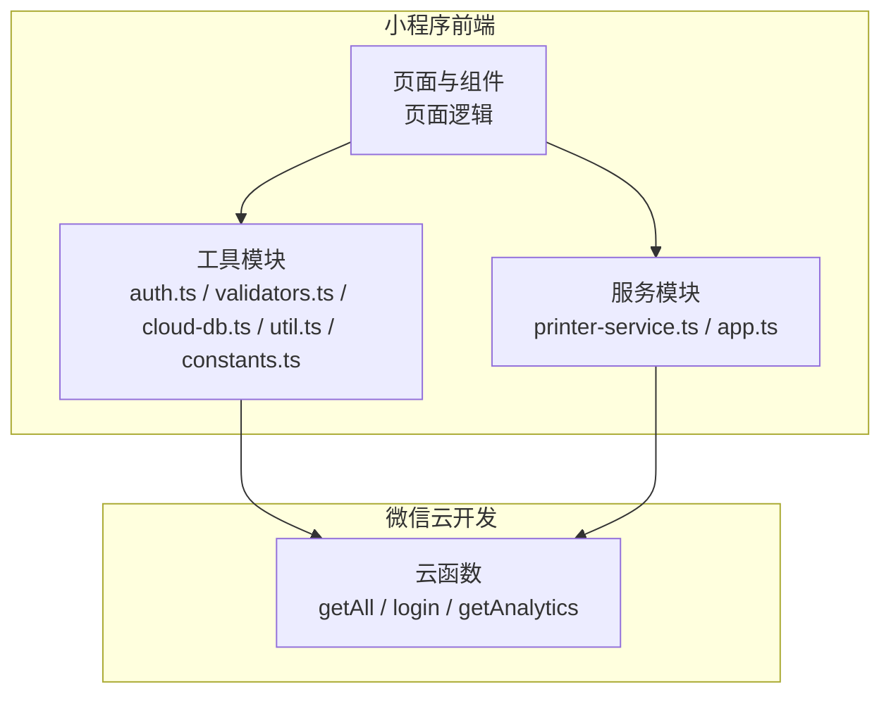
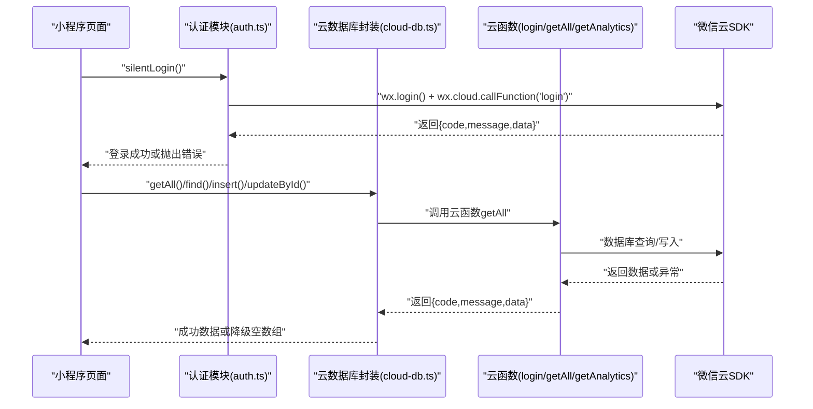
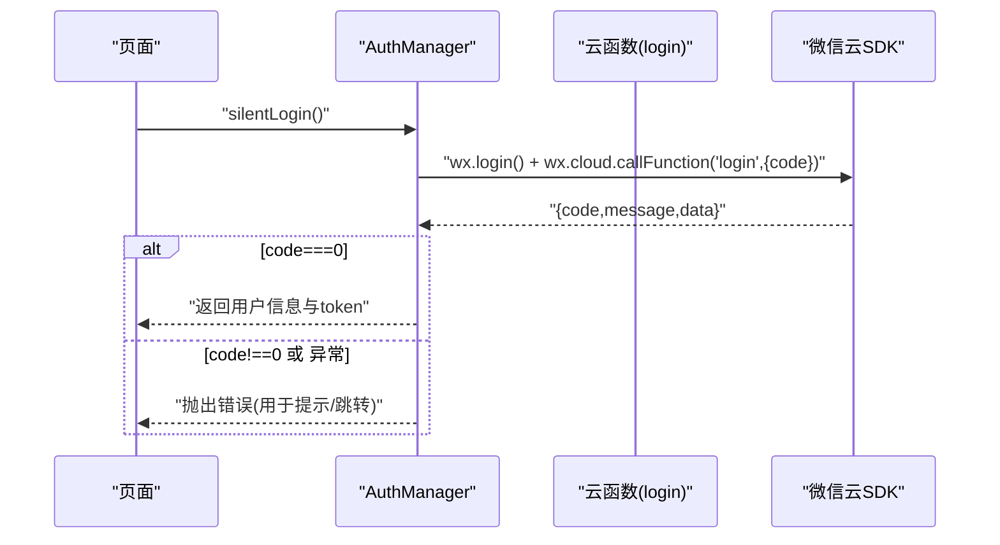
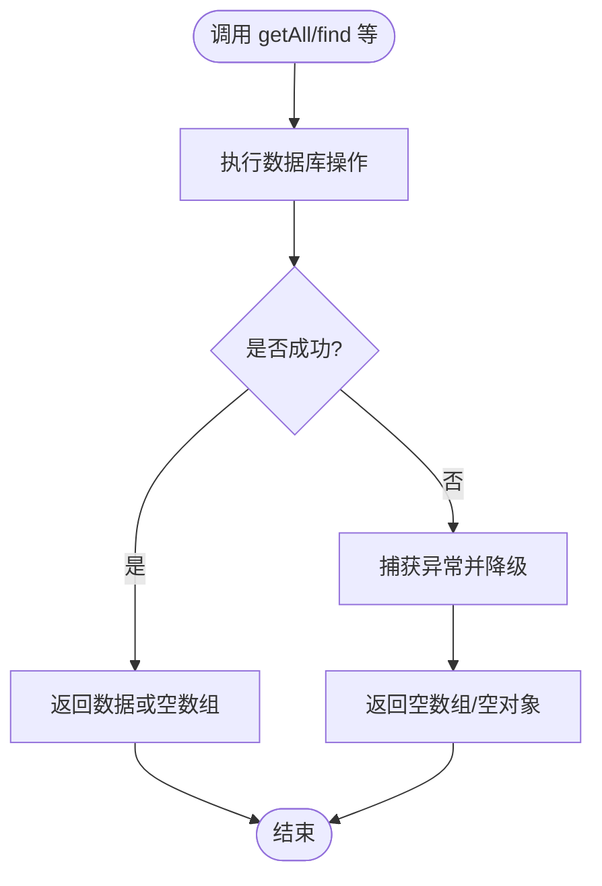
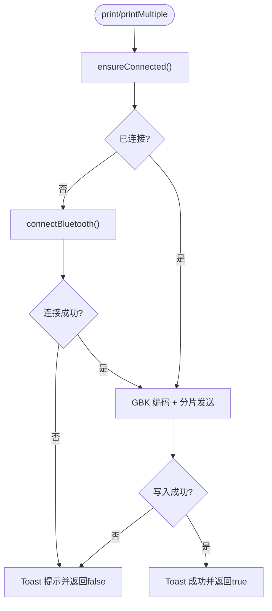
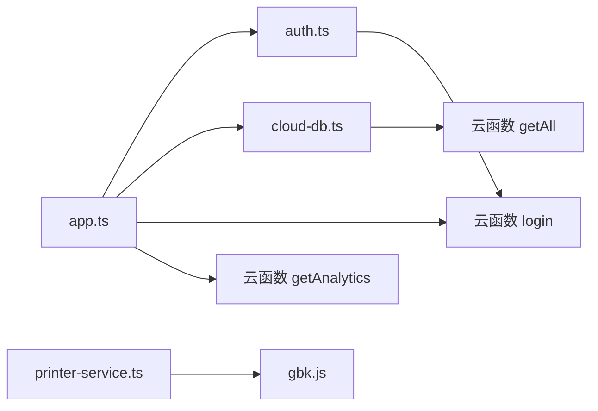

# 常见错误参考手册

<cite>
**本文引用的文件**
- [miniprogram/utils/cloud-db.ts](file://miniprogram/utils/cloud-db.ts)
- [cloudfunctions/getAll/index.js](file://cloudfunctions/getAll/index.js)
- [cloudfunctions/login/index.js](file://cloudfunctions/login/index.js)
- [cloudfunctions/getAnalytics/index.js](file://cloudfunctions/getAnalytics/index.js)
- [miniprogram/services/printer-service.ts](file://miniprogram/services/printer-service.ts)
- [miniprogram/utils/auth.ts](file://miniprogram/utils/auth.ts)
- [miniprogram/utils/validators.ts](file://miniprogram/utils/validators.ts)
- [miniprogram/app.ts](file://miniprogram/app.ts)
- [miniprogram/utils/util.ts](file://miniprogram/utils/util.ts)
- [miniprogram/utils/constants.ts](file://miniprogram/utils/constants.ts)
- [package.json](file://package.json)
</cite>

## 目录
1. [简介](#简介)
2. [项目结构](#项目结构)
3. [核心组件](#核心组件)
4. [架构总览](#架构总览)
5. [详细组件分析](#详细组件分析)
6. [依赖关系分析](#依赖关系分析)
7. [性能与稳定性考量](#性能与稳定性考量)
8. [故障排查指南](#故障排查指南)
9. [结论](#结论)
10. [附录](#附录)

## 简介
本手册面向开发者与运维人员，系统性梳理小程序端与云开发后端在实际业务中的常见错误类型与处理方式，覆盖以下主题：
- 蓝牙连接错误码与处理建议
- 数据库操作错误码与处理建议
- 网络请求错误码与处理建议
- 小程序运行时错误码与处理建议
- 错误日志格式说明、分类标准与优先级评估
- 错误预防策略、最佳实践与代码规范
- 错误监控配置、告警机制与自动恢复方案
- 用户友好的错误提示设计与错误处理流程
- 错误数据收集、分析与持续优化机制

## 项目结构
该项目采用“小程序前端 + 微信云开发云函数”的分层架构：
- 小程序前端：负责界面交互、本地状态管理、蓝牙打印、表单校验、认证与全局数据加载
- 云函数：封装数据库读取、登录鉴权、统计分析等后端逻辑，并统一返回带错误码的响应

图表来源
- [miniprogram/app.ts](file://miniprogram/app.ts#L1-L191)
- [miniprogram/utils/cloud-db.ts](file://miniprogram/utils/cloud-db.ts#L1-L321)
- [cloudfunctions/getAll/index.js](file://cloudfunctions/getAll/index.js#L1-L59)
- [cloudfunctions/login/index.js](file://cloudfunctions/login/index.js#L1-L180)
- [cloudfunctions/getAnalytics/index.js](file://cloudfunctions/getAnalytics/index.js#L1-L172)

章节来源
- [miniprogram/app.ts](file://miniprogram/app.ts#L1-L191)
- [miniprogram/utils/cloud-db.ts](file://miniprogram/utils/cloud-db.ts#L1-L321)
- [cloudfunctions/getAll/index.js](file://cloudfunctions/getAll/index.js#L1-L59)
- [cloudfunctions/login/index.js](file://cloudfunctions/login/index.js#L1-L180)
- [cloudfunctions/getAnalytics/index.js](file://cloudfunctions/getAnalytics/index.js#L1-L172)

## 核心组件
- 认证与会话管理：通过云函数完成登录、刷新、绑定工号等，前端以统一错误码驱动 UI 提示与路由跳转
- 云数据库访问：统一封装查询、插入、更新、删除、分页等能力，对异常进行降级返回空结果
- 蓝牙打印服务：封装蓝牙设备发现、连接、特征读写与多段打印，失败时给出明确 Toast 提示
- 表单校验：集中定义校验规则与错误消息，统一展示
- 全局数据加载：应用启动时并发拉取项目、房间、精油、员工等基础数据，失败不影响主流程

章节来源
- [miniprogram/utils/auth.ts](file://miniprogram/utils/auth.ts#L1-L245)
- [miniprogram/utils/cloud-db.ts](file://miniprogram/utils/cloud-db.ts#L1-L321)
- [miniprogram/services/printer-service.ts](file://miniprogram/services/printer-service.ts#L1-L298)
- [miniprogram/utils/validators.ts](file://miniprogram/utils/validators.ts#L1-L81)
- [miniprogram/app.ts](file://miniprogram/app.ts#L1-L191)

## 架构总览
下图展示了从前端到云函数再到数据库的整体调用链路与错误传播路径。

图表来源
- [miniprogram/utils/auth.ts](file://miniprogram/utils/auth.ts#L78-L126)
- [miniprogram/utils/cloud-db.ts](file://miniprogram/utils/cloud-db.ts#L69-L88)
- [cloudfunctions/getAll/index.js](file://cloudfunctions/getAll/index.js#L9-L58)
- [cloudfunctions/login/index.js](file://cloudfunctions/login/index.js#L11-L90)

## 详细组件分析

### 组件一：认证与登录错误处理
- 错误码约定
  - 成功：code=0
  - 参数缺失/格式错误：code=-1，message 描述具体问题
  - 业务异常：code=-1，message 由云函数捕获并返回
- 关键流程
  - silentLogin：静默登录，若失败则抛出错误供上层处理
  - refreshUserInfo/updateStaffId：刷新用户信息与绑定工号，失败同样以错误码返回
- 失败场景
  - 云函数未返回对象或字段缺失
  - 登录态失效或用户不存在
  - 网络超时或云函数异常

图表来源
- [miniprogram/utils/auth.ts](file://miniprogram/utils/auth.ts#L78-L126)
- [cloudfunctions/login/index.js](file://cloudfunctions/login/index.js#L11-L90)

章节来源
- [miniprogram/utils/auth.ts](file://miniprogram/utils/auth.ts#L1-L245)
- [cloudfunctions/login/index.js](file://cloudfunctions/login/index.js#L1-L180)

### 组件二：云数据库访问错误处理
- 统一返回结构
  - 成功：{code: 0, data, count?}
  - 失败：{code: -1, message/error}
- 查询降级策略
  - getAll/find/findWithPage 等方法在异常时返回空数组/空对象，避免阻塞主流程
  - findById/updateById/deleteById 对“文档不存在”进行特殊分支处理
- 典型错误来源
  - 云函数未传入集合名
  - 数据库查询异常
  - 网络波动导致调用失败

图表来源
- [miniprogram/utils/cloud-db.ts](file://miniprogram/utils/cloud-db.ts#L69-L123)
- [cloudfunctions/getAll/index.js](file://cloudfunctions/getAll/index.js#L9-L58)

章节来源
- [miniprogram/utils/cloud-db.ts](file://miniprogram/utils/cloud-db.ts#L1-L321)
- [cloudfunctions/getAll/index.js](file://cloudfunctions/getAll/index.js#L1-L59)

### 组件三：蓝牙打印错误处理
- 连接阶段
  - 初始化蓝牙适配器失败、扫描设备超时、未发现目标设备、建立 BLE 连接失败、获取服务/特征失败
- 打印阶段
  - 写入特征值失败、内容编码/分片发送异常
- 处理策略
  - 每个失败节点均弹出 Toast 提示，必要时断开蓝牙并重置状态
  - ensureConnected 去重连接 Promise，避免重复发起

图表来源
- [miniprogram/services/printer-service.ts](file://miniprogram/services/printer-service.ts#L31-L269)

章节来源
- [miniprogram/services/printer-service.ts](file://miniprogram/services/printer-service.ts#L1-L298)

### 组件四：表单校验与用户提示
- 校验规则
  - 单人/双人模式必填项校验，缺失时返回 {isValid:false, message}
  - 支持显示校验结果的 Toast
- 处理建议
  - 在提交前统一调用校验函数，失败立即提示并阻止提交
  - message 保持简洁明确，便于国际化扩展

章节来源
- [miniprogram/utils/validators.ts](file://miniprogram/utils/validators.ts#L1-L81)

### 组件五：全局数据加载与错误隔离
- 启动时并发加载项目、房间、精油、员工等基础数据
- 任一集合加载失败不影响其他集合；最终标记 isDataLoaded=true，后续读取可直接使用缓存

章节来源
- [miniprogram/app.ts](file://miniprogram/app.ts#L40-L66)

## 依赖关系分析
- 前端模块间耦合
  - app.ts 依赖 cloud-db.ts 与 auth.ts，承担全局数据与认证入口
  - cloud-db.ts 依赖 wx.cloud 与云函数 getAll
  - printer-service.ts 依赖 gbk.js 与 wx 蓝牙 API
- 云函数依赖
  - getAll 依赖数据库读取能力
  - login 依赖数据库读取/写入与 token 生成
  - getAnalytics 依赖数据库聚合统计

图表来源
- [miniprogram/app.ts](file://miniprogram/app.ts#L1-L191)
- [miniprogram/utils/cloud-db.ts](file://miniprogram/utils/cloud-db.ts#L1-L321)
- [miniprogram/services/printer-service.ts](file://miniprogram/services/printer-service.ts#L1-L298)
- [cloudfunctions/getAll/index.js](file://cloudfunctions/getAll/index.js#L1-L59)
- [cloudfunctions/login/index.js](file://cloudfunctions/login/index.js#L1-L180)
- [cloudfunctions/getAnalytics/index.js](file://cloudfunctions/getAnalytics/index.js#L1-L172)

章节来源
- [package.json](file://package.json#L1-L28)

## 性能与稳定性考量
- 并发加载：app.ts 中对多个集合使用 Promise.all 并发拉取，缩短首屏等待
- 降级策略：cloud-db.ts 的查询方法在异常时返回空数组，避免阻塞 UI
- 连接去重：printer-service.ts 使用 connectingPromise 避免重复连接
- 超时控制：蓝牙扫描设置 10 秒超时并主动停止扫描，防止资源泄露
- 日志采集：建议在关键路径埋点（如登录、数据库查询、蓝牙写入），记录 code/message/timestamp/duration

## 故障排查指南

### 一、蓝牙连接类错误
- 现象
  - 蓝牙初始化失败、搜索设备超时、未发现目标设备、连接失败、获取服务/特征失败、写入失败
- 排查步骤
  - 确认设备名称包含“Printer/打印机”
  - 检查蓝牙权限与系统蓝牙开关
  - 观察 Toast 提示与日志，定位失败节点
  - 断开连接并重置状态，避免残留句柄
- 预防措施
  - 连接前检查 isPrinterConnected 与设备 ID/服务 ID/特征 ID 是否齐全
  - 写入失败后及时断开并重试

章节来源
- [miniprogram/services/printer-service.ts](file://miniprogram/services/printer-service.ts#L31-L180)

### 二、数据库操作类错误
- 现象
  - getAll 返回 {code:-1,message}、find/findWithPage 返回空数组
- 排查步骤
  - 检查云函数是否正确传入 collection
  - 检查数据库权限与集合是否存在
  - 查看网络状态与云函数日志
- 预防措施
  - 前端对空数据进行 UI 层兜底（如“暂无数据”）
  - 对高频查询增加本地缓存与过期策略

章节来源
- [cloudfunctions/getAll/index.js](file://cloudfunctions/getAll/index.js#L9-L58)
- [miniprogram/utils/cloud-db.ts](file://miniprogram/utils/cloud-db.ts#L69-L123)

### 三、网络请求类错误
- 现象
  - 云函数调用失败、silentLogin 失败、返回非对象或字段缺失
- 排查步骤
  - 检查 wx.cloud.callFunction 的返回结构
  - 校验云函数内部 try/catch 是否捕获异常并返回标准错误体
- 预防措施
  - 统一在调用侧判断 result 类型与字段存在性
  - 对关键接口增加重试与退避策略

章节来源
- [miniprogram/utils/auth.ts](file://miniprogram/utils/auth.ts#L78-L126)
- [cloudfunctions/login/index.js](file://cloudfunctions/login/index.js#L11-L90)

### 四、小程序运行时类错误
- 现象
  - 页面未登录被强制跳转登录页、全局数据加载异常
- 排查步骤
  - 检查 app.ts 的 onShow 与 initLogin 流程
  - 确认全局数据 isDataLoaded 标记与缓存一致性
- 预防措施
  - 对异常进行 try/catch 并记录日志，避免影响后续流程

章节来源
- [miniprogram/app.ts](file://miniprogram/app.ts#L13-L38)

### 五、表单校验类错误
- 现象
  - 提交时报“请选择项目/技师/房间/精油”等提示
- 排查步骤
  - 检查 validators.ts 的校验逻辑与 message
  - 确认页面在提交前调用了校验函数
- 预防措施
  - 在输入变更时进行实时校验，减少一次性提交失败

章节来源
- [miniprogram/utils/validators.ts](file://miniprogram/utils/validators.ts#L1-L81)

## 结论
本项目在错误处理方面形成了“前端统一降级 + 云函数标准化返回 + 明确 Toast 提示”的闭环。建议在此基础上进一步完善：
- 统一日志格式与错误标签，接入统一监控平台
- 对关键路径增加重试与熔断策略
- 完善自动化测试与回归用例，覆盖边界条件与异常分支

## 附录

### A. 错误码对照表（小程序端）
- 通用约定
  - 成功：code=0
  - 失败：code=-1，message 为错误描述
- 登录/认证
  - 缺少 code 参数：code=-1
  - 用户不存在/刷新失败：code=-1
  - 更新工号失败：code=-1
- 数据库访问
  - getAll 未指定集合名：code=-1
  - 查询异常：code=-1
- 蓝牙打印
  - 初始化失败/搜索超时/未发现设备/连接失败/获取服务/特征失败/写入失败：均以 Toast 提示并返回 false

章节来源
- [cloudfunctions/login/index.js](file://cloudfunctions/login/index.js#L22-L27)
- [cloudfunctions/login/index.js](file://cloudfunctions/login/index.js#L101-L106)
- [cloudfunctions/login/index.js](file://cloudfunctions/login/index.js#L143-L148)
- [cloudfunctions/getAll/index.js](file://cloudfunctions/getAll/index.js#L12-L17)
- [cloudfunctions/getAll/index.js](file://cloudfunctions/getAll/index.js#L52-L57)
- [miniprogram/services/printer-service.ts](file://miniprogram/services/printer-service.ts#L81-L89)

### B. 错误日志格式说明
- 字段建议
  - timestamp：错误发生时间
  - module：模块名（如 auth、cloud-db、printer-service）
  - action：触发动作（如 login、getAll、connectBluetooth）
  - code：错误码（0/非0）
  - message：错误消息
  - duration：耗时（毫秒）
  - stack：堆栈信息（可选）
- 示例
  - { "timestamp": "...", "module": "printer-service", "action": "connectToDevice", "code": -1, "message": "连接打印机失败", "duration": 1200 }

### C. 错误分类与优先级
- 分类
  - 网络/云函数异常：中
  - 权限/参数缺失：高
  - 设备/硬件异常：中
  - 业务校验失败：低
- 优先级评估
  - 影响登录/支付/核心流程：高
  - 影响体验但不阻塞：中
  - 可忽略或可自动恢复：低

### D. 预防策略与最佳实践
- 前端
  - 统一错误降级与 UI 提示
  - 对高频接口增加缓存与去重
  - 输入实时校验，减少一次性失败
- 云函数
  - 明确参数校验与默认值
  - 捕获异常并返回标准错误体
  - 控制单次查询量，必要时分页/分批
- 蓝牙
  - 设置合理超时与重试
  - 失败后断开并清理状态
- 日志与监控
  - 关键路径埋点，统一上报
  - 建立告警阈值（错误率/耗时/失败次数）

### E. 自动恢复方案
- 登录失败：重试一次，失败则引导重新登录
- 数据库查询失败：回退到本地缓存或空数据，稍后重试
- 蓝牙写入失败：断开重连后重试一次

### F. 用户友好提示设计
- 提示风格
  - 简洁明确，避免技术术语
  - 提供下一步操作指引（如“点击重试”）
- Toast 位置与时机
  - 关键操作前后（连接、保存、打印）给出即时反馈
  - 避免连续刷屏，合并同类提示