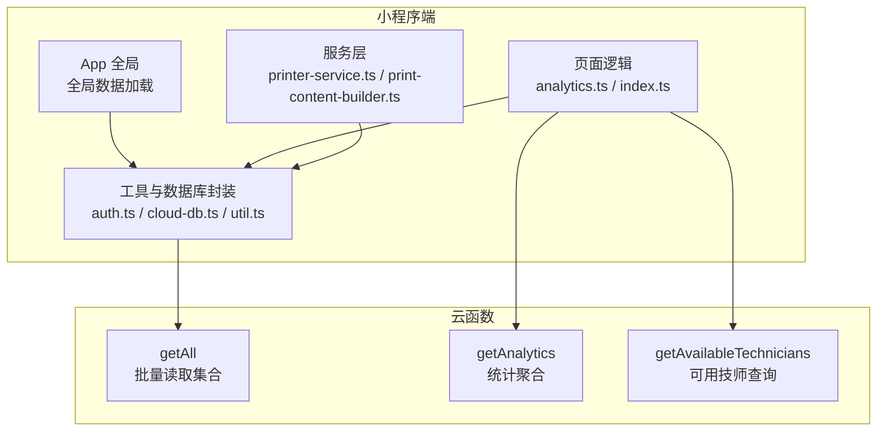
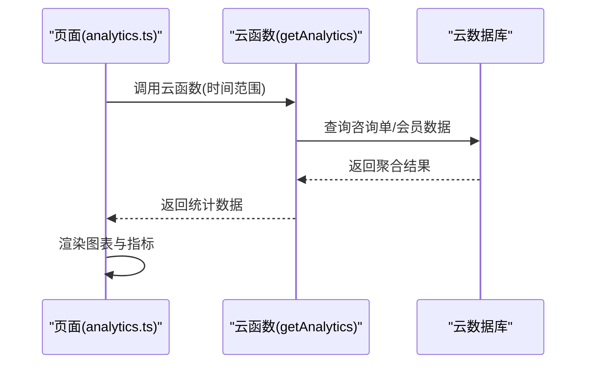
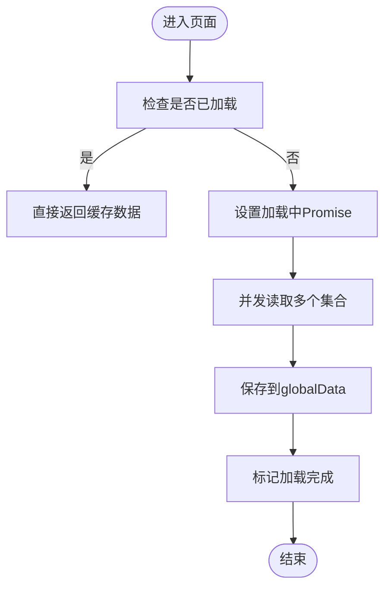
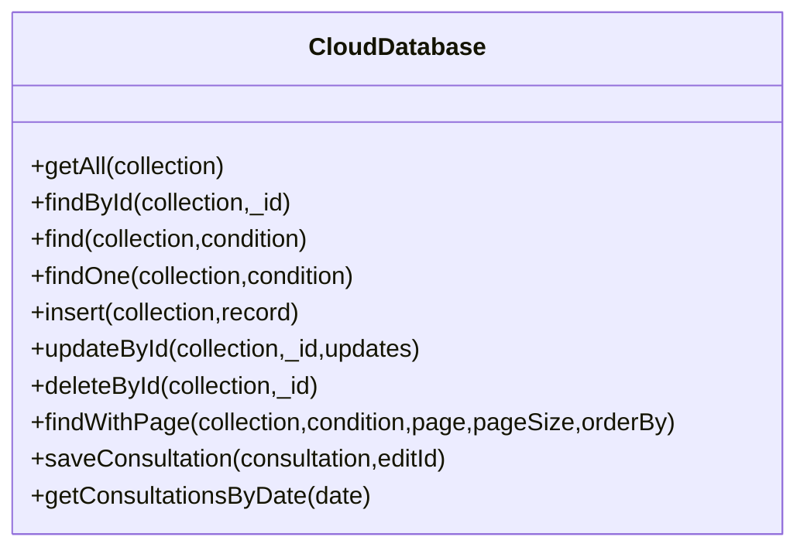
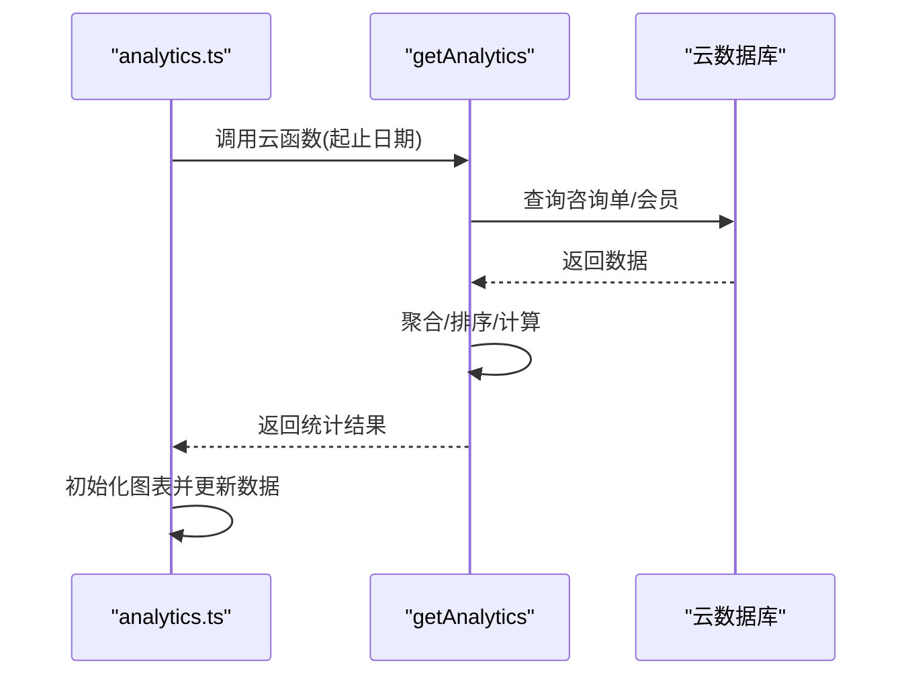
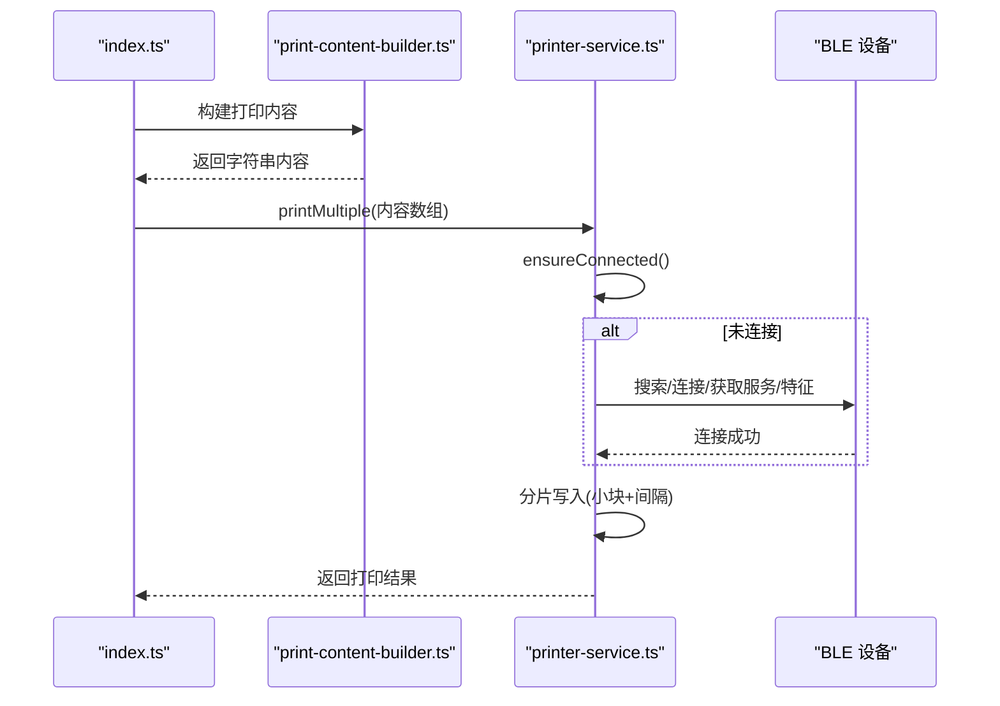
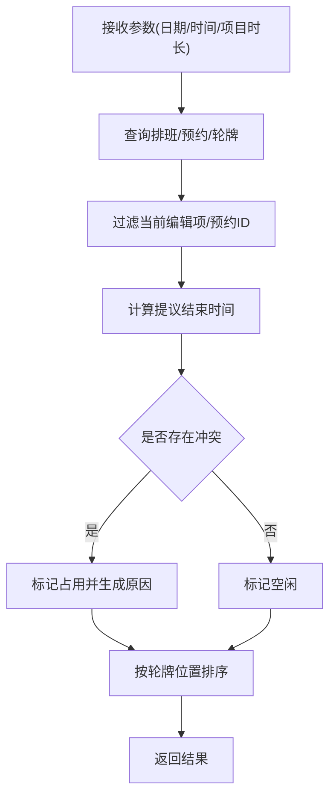
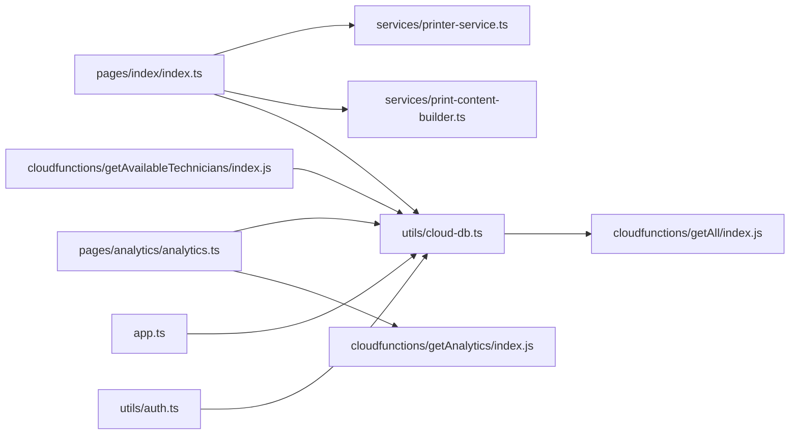

# 性能调试与优化

<cite>
**本文引用的文件**
- [miniprogram/app.ts](file://miniprogram/app.ts)
- [miniprogram/utils/cloud-db.ts](file://miniprogram/utils/cloud-db.ts)
- [cloudfunctions/getAll/index.js](file://cloudfunctions/getAll/index.js)
- [cloudfunctions/getAnalytics/index.js](file://cloudfunctions/getAnalytics/index.js)
- [miniprogram/pages/analytics/analytics.ts](file://miniprogram/pages/analytics/analytics.ts)
- [miniprogram/services/printer-service.ts](file://miniprogram/services/printer-service.ts)
- [miniprogram/services/print-content-builder.ts](file://miniprogram/services/print-content-builder.ts)
- [miniprogram/pages/index/index.ts](file://miniprogram/pages/index/index.ts)
- [miniprogram/utils/util.ts](file://miniprogram/utils/util.ts)
- [miniprogram/utils/auth.ts](file://miniprogram/utils/auth.ts)
- [cloudfunctions/getAvailableTechnicians/index.js](file://cloudfunctions/getAvailableTechnicians/index.js)
</cite>

## 目录
1. [简介](#简介)
2. [项目结构](#项目结构)
3. [核心组件](#核心组件)
4. [架构总览](#架构总览)
5. [详细组件分析](#详细组件分析)
6. [依赖关系分析](#依赖关系分析)
7. [性能考量](#性能考量)
8. [故障排查指南](#故障排查指南)
9. [结论](#结论)
10. [附录](#附录)

## 简介
本指南面向小程序“ConsultationPrinter”项目，围绕性能调试与优化展开，覆盖以下主题：
- 小程序性能分析工具使用：性能面板、网络监控、内存分析
- 页面加载性能优化：资源压缩、懒加载、缓存策略
- 数据库查询优化：索引设计、查询计划、批量操作
- 蓝牙通信性能优化：连接池管理、数据传输优化、功耗控制
- 用户体验指标监控、性能基准测试与A/B测试方法
- 性能瓶颈识别、热点分析与容量规划
- 性能回归测试、自动化监控与预警机制

## 项目结构
项目采用分层与模块化组织：
- 小程序端（miniprogram）：页面、组件、服务、工具、云数据库封装
- 云函数（cloudfunctions）：数据聚合、查询与业务逻辑处理
- 类型与常量：统一的数据模型与配置项

图表来源
- [miniprogram/app.ts](file://miniprogram/app.ts#L40-L87)
- [miniprogram/utils/cloud-db.ts](file://miniprogram/utils/cloud-db.ts#L69-L88)
- [cloudfunctions/getAll/index.js](file://cloudfunctions/getAll/index.js#L9-L58)
- [cloudfunctions/getAnalytics/index.js](file://cloudfunctions/getAnalytics/index.js#L36-L51)
- [miniprogram/pages/analytics/analytics.ts](file://miniprogram/pages/analytics/analytics.ts#L47-L78)
- [cloudfunctions/getAvailableTechnicians/index.js](file://cloudfunctions/getAvailableTechnicians/index.js#L9-L21)

章节来源
- [miniprogram/app.ts](file://miniprogram/app.ts#L1-L191)
- [miniprogram/utils/cloud-db.ts](file://miniprogram/utils/cloud-db.ts#L1-L321)
- [cloudfunctions/getAll/index.js](file://cloudfunctions/getAll/index.js#L1-L59)
- [cloudfunctions/getAnalytics/index.js](file://cloudfunctions/getAnalytics/index.js#L1-L172)
- [miniprogram/pages/analytics/analytics.ts](file://miniprogram/pages/analytics/analytics.ts#L1-L408)
- [cloudfunctions/getAvailableTechnicians/index.js](file://cloudfunctions/getAvailableTechnicians/index.js#L1-L285)

## 核心组件
- 全局App与数据加载：集中加载全局基础数据，避免重复请求，提升首屏性能
- 云数据库封装：统一封装查询、分页、插入、更新、删除等操作，支持批量读取
- 分析页面与云函数：通过云函数进行跨集合聚合统计，前端负责渲染与交互
- 打印服务：蓝牙连接、特征发现、分片写入、断连清理
- 工具与鉴权：时间计算、登录态持久化、权限校验

章节来源
- [miniprogram/app.ts](file://miniprogram/app.ts#L40-L108)
- [miniprogram/utils/cloud-db.ts](file://miniprogram/utils/cloud-db.ts#L69-L298)
- [miniprogram/pages/analytics/analytics.ts](file://miniprogram/pages/analytics/analytics.ts#L47-L78)
- [cloudfunctions/getAnalytics/index.js](file://cloudfunctions/getAnalytics/index.js#L36-L171)
- [miniprogram/services/printer-service.ts](file://miniprogram/services/printer-service.ts#L10-L295)
- [miniprogram/utils/auth.ts](file://miniprogram/utils/auth.ts#L78-L220)

## 架构总览
小程序端通过云函数访问云数据库，实现数据的批量读取与复杂聚合；页面负责UI与交互，服务层负责蓝牙打印流程；App统一管理全局数据与登录态。

图表来源
- [miniprogram/pages/analytics/analytics.ts](file://miniprogram/pages/analytics/analytics.ts#L55-L77)
- [cloudfunctions/getAnalytics/index.js](file://cloudfunctions/getAnalytics/index.js#L36-L171)

## 详细组件分析

### 组件A：全局数据加载与并发优化
- 目标：减少冷启动等待，避免重复请求
- 实现要点：
  - 使用Promise去重避免并发重复加载
  - 并发拉取多个集合，缩短首屏等待
  - 成功后标记加载完成，后续直接返回缓存数据

图表来源
- [miniprogram/app.ts](file://miniprogram/app.ts#L40-L66)

章节来源
- [miniprogram/app.ts](file://miniprogram/app.ts#L40-L108)

### 组件B：云数据库封装与批量读取
- 目标：统一数据库操作，支持批量读取与分页
- 实现要点：
  - getAll通过云函数实现分页拉取，避免一次性读取超大数据集
  - find/findWithPage支持条件查询与排序分页
  - saveConsultation封装新增/更新流程

图表来源
- [miniprogram/utils/cloud-db.ts](file://miniprogram/utils/cloud-db.ts#L69-L298)

章节来源
- [miniprogram/utils/cloud-db.ts](file://miniprogram/utils/cloud-db.ts#L69-L298)
- [cloudfunctions/getAll/index.js](file://cloudfunctions/getAll/index.js#L9-L58)

### 组件C：分析页面与云函数统计
- 目标：按日/项目/平台维度聚合统计，前端渲染可视化图表
- 实现要点：
  - 云函数对多集合数据进行过滤、聚合与排序
  - 前端按时间范围动态计算起止日期，异步渲染图表

图表来源
- [miniprogram/pages/analytics/analytics.ts](file://miniprogram/pages/analytics/analytics.ts#L47-L78)
- [cloudfunctions/getAnalytics/index.js](file://cloudfunctions/getAnalytics/index.js#L36-L171)

章节来源
- [miniprogram/pages/analytics/analytics.ts](file://miniprogram/pages/analytics/analytics.ts#L1-L408)
- [cloudfunctions/getAnalytics/index.js](file://cloudfunctions/getAnalytics/index.js#L1-L172)

### 组件D：蓝牙打印服务与性能优化
- 目标：稳定、低延迟地完成打印任务
- 实现要点：
  - 连接状态管理与去重连接
  - 特征发现与写入能力检测
  - 分片写入与节流发送
  - 断连清理与错误处理

图表来源
- [miniprogram/pages/index/index.ts](file://miniprogram/pages/index/index.ts#L263-L324)
- [miniprogram/services/print-content-builder.ts](file://miniprogram/services/print-content-builder.ts#L31-L80)
- [miniprogram/services/printer-service.ts](file://miniprogram/services/printer-service.ts#L182-L269)

章节来源
- [miniprogram/services/printer-service.ts](file://miniprogram/services/printer-service.ts#L10-L295)
- [miniprogram/services/print-content-builder.ts](file://miniprogram/services/print-content-builder.ts#L1-L144)
- [miniprogram/pages/index/index.ts](file://miniprogram/pages/index/index.ts#L263-L324)

### 组件E：可用技师查询与冲突检测
- 目标：基于排班、预约、轮牌队列与现有咨询单进行冲突检测
- 实现要点：
  - 获取排班/预约/轮牌数据
  - 计算时间区间冲突
  - 按轮牌位置排序输出

图表来源
- [cloudfunctions/getAvailableTechnicians/index.js](file://cloudfunctions/getAvailableTechnicians/index.js#L9-L124)

章节来源
- [cloudfunctions/getAvailableTechnicians/index.js](file://cloudfunctions/getAvailableTechnicians/index.js#L1-L285)

## 依赖关系分析
- 页面依赖工具与数据库封装，间接依赖云函数
- 服务层依赖工具与数据库封装
- 云函数依赖云数据库命令与SDK
- App全局数据被多页面共享，降低重复请求

图表来源
- [miniprogram/pages/index/index.ts](file://miniprogram/pages/index/index.ts#L1-L15)
- [miniprogram/services/printer-service.ts](file://miniprogram/services/printer-service.ts#L1-L10)
- [miniprogram/services/print-content-builder.ts](file://miniprogram/services/print-content-builder.ts#L1-L9)
- [miniprogram/utils/cloud-db.ts](file://miniprogram/utils/cloud-db.ts#L1-L22)
- [cloudfunctions/getAll/index.js](file://cloudfunctions/getAll/index.js#L1-L10)
- [cloudfunctions/getAnalytics/index.js](file://cloudfunctions/getAnalytics/index.js#L1-L10)
- [cloudfunctions/getAvailableTechnicians/index.js](file://cloudfunctions/getAvailableTechnicians/index.js#L1-L10)
- [miniprogram/app.ts](file://miniprogram/app.ts#L1-L12)
- [miniprogram/utils/auth.ts](file://miniprogram/utils/auth.ts#L1-L10)

章节来源
- [miniprogram/pages/index/index.ts](file://miniprogram/pages/index/index.ts#L1-L15)
- [miniprogram/services/printer-service.ts](file://miniprogram/services/printer-service.ts#L1-L10)
- [miniprogram/services/print-content-builder.ts](file://miniprogram/services/print-content-builder.ts#L1-L9)
- [miniprogram/utils/cloud-db.ts](file://miniprogram/utils/cloud-db.ts#L1-L22)
- [cloudfunctions/getAll/index.js](file://cloudfunctions/getAll/index.js#L1-L10)
- [cloudfunctions/getAnalytics/index.js](file://cloudfunctions/getAnalytics/index.js#L1-L10)
- [cloudfunctions/getAvailableTechnicians/index.js](file://cloudfunctions/getAvailableTechnicians/index.js#L1-L10)
- [miniprogram/app.ts](file://miniprogram/app.ts#L1-L12)
- [miniprogram/utils/auth.ts](file://miniprogram/utils/auth.ts#L1-L10)

## 性能考量

### 页面加载性能优化
- 资源压缩与分包
  - 合理拆分页面与组件，利用分包加载
  - 图片与字体资源压缩，按需加载
- 懒加载策略
  - 大图、图表库按需引入
  - 首屏仅加载必要数据，其他数据延后加载
- 缓存策略
  - App全局数据缓存，避免重复请求
  - 登录态与用户信息本地持久化

章节来源
- [miniprogram/app.ts](file://miniprogram/app.ts#L40-L108)
- [miniprogram/utils/auth.ts](file://miniprogram/utils/auth.ts#L21-L49)

### 数据库查询优化
- 索引设计
  - 在高频查询字段（如日期、状态、技师名）建立索引
- 查询计划
  - 使用复合条件查询时，确保查询条件命中索引
- 批量操作优化
  - getAll通过云函数分页拉取，避免一次性读取超大数据集
  - 分页查询结合count统计，减少不必要的全表扫描

章节来源
- [miniprogram/utils/cloud-db.ts](file://miniprogram/utils/cloud-db.ts#L69-L88)
- [cloudfunctions/getAll/index.js](file://cloudfunctions/getAll/index.js#L9-L58)

### 蓝牙通信性能优化
- 连接池管理
  - 单实例管理连接状态，避免重复连接
  - 连接去重与Promise去重，防止并发冲突
- 数据传输优化
  - 分片写入，控制每片大小与发送间隔
  - 写入成功后再发送下一片，保证顺序与稳定性
- 功耗控制
  - 打印完成后及时断连与关闭适配器
  - 减少无效的扫描与连接尝试

章节来源
- [miniprogram/services/printer-service.ts](file://miniprogram/services/printer-service.ts#L182-L269)

### 用户体验指标监控
- 关键指标
  - 首屏渲染时间、接口响应时间、图表绘制耗时
- 监控手段
  - 使用开发者工具性能面板记录关键路径
  - 云函数埋点记录查询耗时与数据量
- 基准测试与A/B测试
  - 固定场景下的基准测试，对比优化前后差异
  - A/B测试验证新功能或参数调整对性能的影响

### 瓶颈识别、热点分析与容量规划
- 瓶颈识别
  - 通过性能面板定位慢函数与长任务
  - 云函数侧记录耗时与异常，定位热点集合与查询
- 热点分析
  - 分析高频查询字段与数据规模，评估索引与分页策略
- 容量规划
  - 基于查询量与数据增长趋势，评估数据库与云函数资源上限

### 性能回归测试、自动化监控与预警
- 回归测试
  - 建立关键路径的自动化测试，定期运行
- 自动化监控
  - 云函数埋点上报关键指标，前端上报渲染与交互耗时
- 预警机制
  - 设置阈值告警（接口超时、图表渲染超时、蓝牙写入失败率）

## 故障排查指南
- 登录态与权限
  - 检查本地存储的用户信息与token
  - 异常时触发静默登录与重新授权
- 数据加载
  - 全局数据加载失败时，检查getAll云函数与数据库权限
  - 分页查询失败时，确认条件与排序字段是否合理
- 蓝牙打印
  - 连接失败时检查设备名称匹配与适配器状态
  - 写入失败时检查特征属性与分片大小
- 统计页面
  - 云函数异常时查看查询条件与日期范围
  - 前端图表渲染失败时检查数据结构与图表初始化时机

章节来源
- [miniprogram/utils/auth.ts](file://miniprogram/utils/auth.ts#L78-L220)
- [miniprogram/utils/cloud-db.ts](file://miniprogram/utils/cloud-db.ts#L69-L88)
- [miniprogram/services/printer-service.ts](file://miniprogram/services/printer-service.ts#L31-L91)
- [cloudfunctions/getAnalytics/index.js](file://cloudfunctions/getAnalytics/index.js#L36-L51)

## 结论
本项目在全局数据缓存、云函数批量读取与分页、蓝牙分片写入等方面具备良好的性能基础。建议进一步完善：
- 索引与查询计划优化
- 图表渲染与首屏加载的精细化优化
- 云函数与前端的埋点与监控体系
- 回归测试与预警机制的落地

## 附录
- 时间计算工具：用于项目结束时间与加班单位计算
- 页面入口与导航：首页、分析页、收银页、配置页等

章节来源
- [miniprogram/utils/util.ts](file://miniprogram/utils/util.ts#L96-L150)
- [miniprogram/pages/index/index.ts](file://miniprogram/pages/index/index.ts#L492-L511)