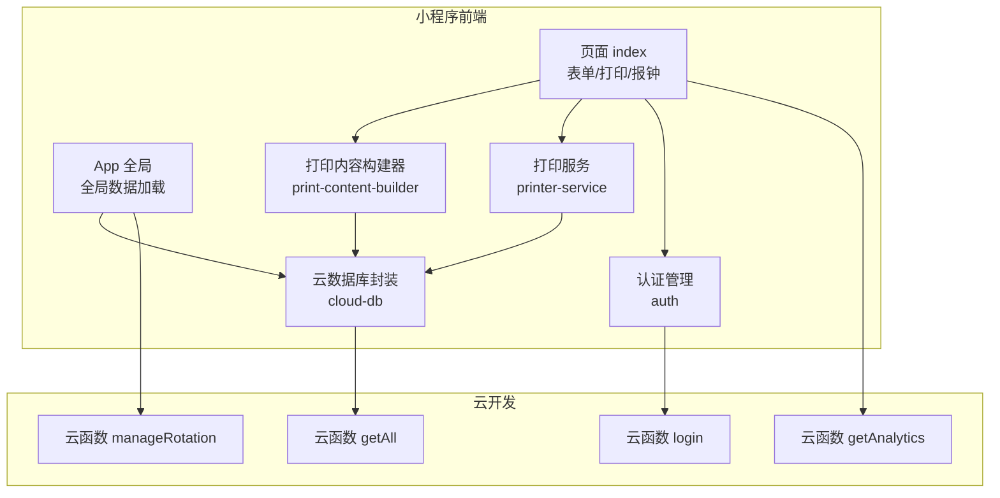
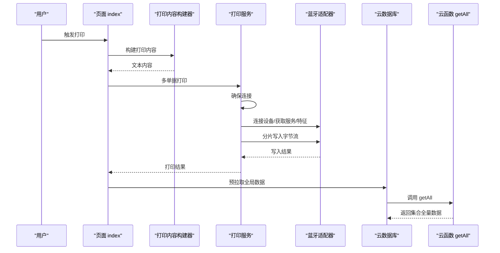
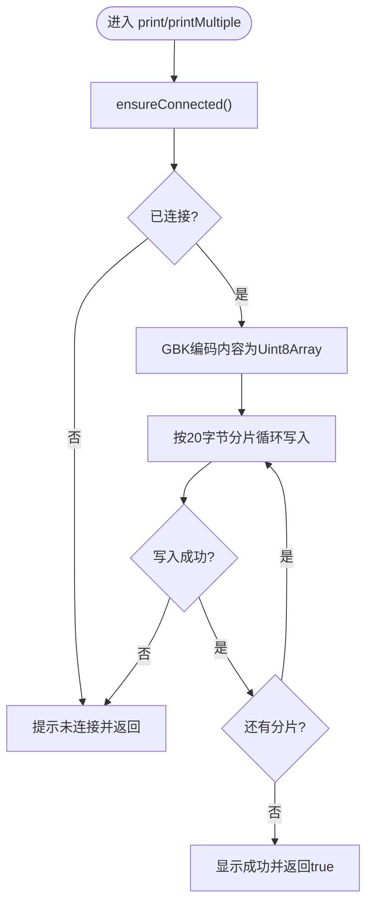
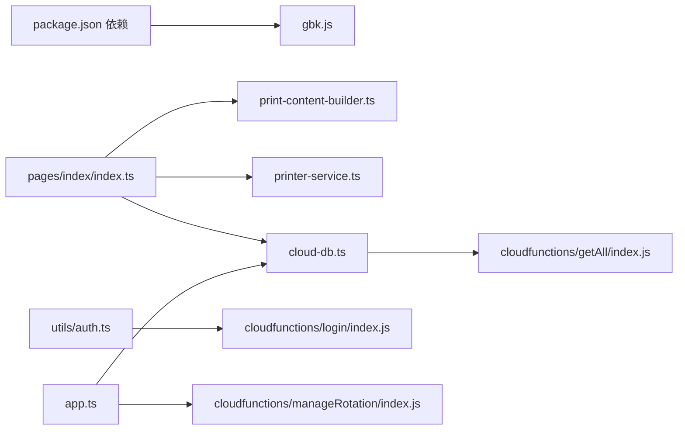
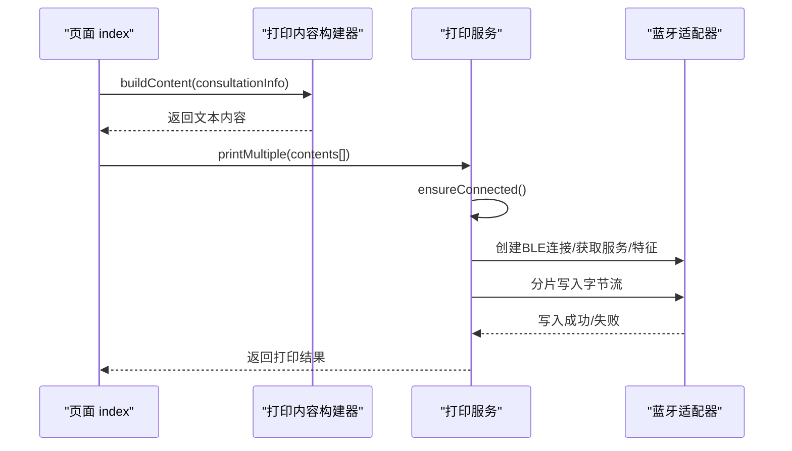
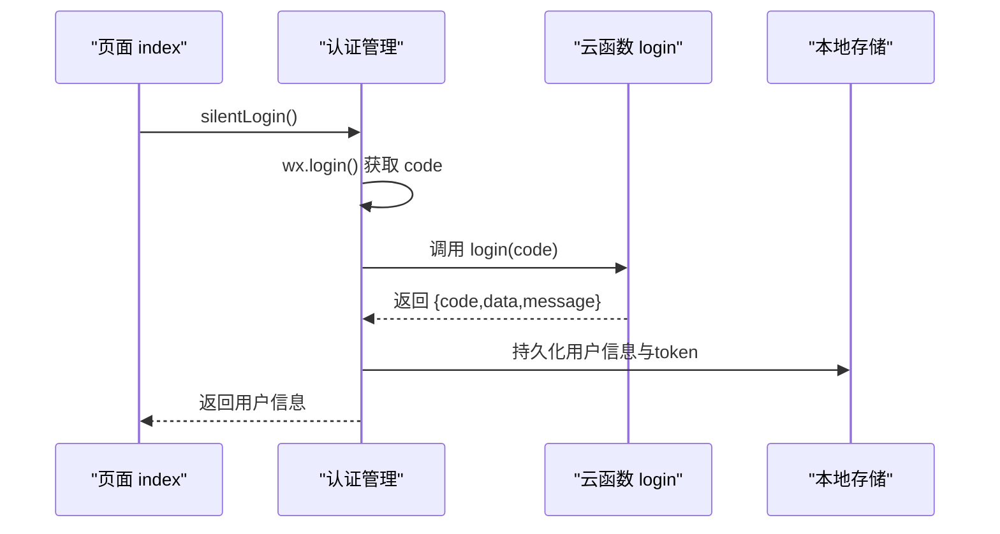

# 故障排查与FAQ

<cite>
**本文引用的文件**
- [miniprogram/app.ts](file://miniprogram/app.ts)
- [miniprogram/services/printer-service.ts](file://miniprogram/services/printer-service.ts)
- [miniprogram/utils/cloud-db.ts](file://miniprogram/utils/cloud-db.ts)
- [miniprogram/services/print-content-builder.ts](file://miniprogram/services/print-content-builder.ts)
- [miniprogram/pages/index/index.ts](file://miniprogram/pages/index/index.ts)
- [miniprogram/utils/auth.ts](file://miniprogram/utils/auth.ts)
- [miniprogram/utils/util.ts](file://miniprogram/utils/util.ts)
- [miniprogram/utils/validators.ts](file://miniprogram/utils/validators.ts)
- [cloudfunctions/getAll/index.js](file://cloudfunctions/getAll/index.js)
- [cloudfunctions/login/index.js](file://cloudfunctions/login/index.js)
- [cloudfunctions/manageRotation/index.js](file://cloudfunctions/manageRotation/index.js)
- [cloudfunctions/getAnalytics/index.js](file://cloudfunctions/getAnalytics/index.js)
- [miniprogram/app.json](file://miniprogram/app.json)
- [package.json](file://package.json)
</cite>

## 目录
1. [简介](#简介)
2. [项目结构](#项目结构)
3. [核心组件](#核心组件)
4. [架构总览](#架构总览)
5. [详细组件分析](#详细组件分析)
6. [依赖关系分析](#依赖关系分析)
7. [性能考虑](#性能考虑)
8. [故障排查指南](#故障排查指南)
9. [结论](#结论)
10. [附录](#附录)

## 简介
本指南面向一线运维与开发人员，围绕蓝牙打印、数据库访问、云函数调用、小程序运行时错误、性能与兼容性问题，提供系统化的诊断流程、根因分析与解决方案。同时给出调试工具使用建议、日志分析技巧、错误码对照、常见错误模式与预防措施，并提供紧急故障处理、备份恢复与系统重建方案，以及用户反馈收集与持续改进机制。

## 项目结构
项目采用“小程序前端 + 云开发云函数”的分层架构：
- 小程序前端：页面、服务、工具模块协同，负责业务交互、打印内容构建与蓝牙打印控制。
- 云开发：通过云函数实现数据库批量读取、登录鉴权、轮牌调度、统计分析等能力。
- 蓝牙打印：基于微信蓝牙API，按特征值写入字节流，支持分片发送与多单据连续打印。

图表来源
- [miniprogram/app.ts](file://miniprogram/app.ts#L40-L66)
- [miniprogram/pages/index/index.ts](file://miniprogram/pages/index/index.ts#L263-L324)
- [miniprogram/services/print-content-builder.ts](file://miniprogram/services/print-content-builder.ts#L31-L80)
- [miniprogram/services/printer-service.ts](file://miniprogram/services/printer-service.ts#L197-L233)
- [miniprogram/utils/cloud-db.ts](file://miniprogram/utils/cloud-db.ts#L69-L88)
- [cloudfunctions/getAll/index.js](file://cloudfunctions/getAll/index.js#L9-L58)
- [cloudfunctions/login/index.js](file://cloudfunctions/login/index.js#L11-L89)
- [cloudfunctions/manageRotation/index.js](file://cloudfunctions/manageRotation/index.js#L9-L36)
- [cloudfunctions/getAnalytics/index.js](file://cloudfunctions/getAnalytics/index.js#L36-L51)

章节来源
- [miniprogram/app.json](file://miniprogram/app.json#L1-L35)

## 核心组件
- 全局应用与数据加载：负责静默登录、全局数据预拉取与并发加载，避免页面渲染时的空数据。
- 打印内容构建器：将咨询单信息格式化为ESC指令可识别的文本内容。
- 打印服务：封装蓝牙适配器初始化、设备发现、连接、服务与特征获取、分片写入打印。
- 云数据库封装：统一封装 getAll、find、insert、update、delete、分页查询与保存咨询单。
- 认证管理：封装静默登录、存储持久化、令牌刷新与登出。
- 云函数：提供批量数据读取、登录鉴权、轮牌调度、统计分析等后端能力。

章节来源
- [miniprogram/app.ts](file://miniprogram/app.ts#L13-L66)
- [miniprogram/services/print-content-builder.ts](file://miniprogram/services/print-content-builder.ts#L10-L80)
- [miniprogram/services/printer-service.ts](file://miniprogram/services/printer-service.ts#L10-L195)
- [miniprogram/utils/cloud-db.ts](file://miniprogram/utils/cloud-db.ts#L12-L255)
- [miniprogram/utils/auth.ts](file://miniprogram/utils/auth.ts#L4-L95)

## 架构总览
小程序前端通过云函数与云数据库交互；打印流程由页面触发，经内容构建器生成文本，再由打印服务通过蓝牙写入打印机特征值。

图表来源
- [miniprogram/pages/index/index.ts](file://miniprogram/pages/index/index.ts#L263-L324)
- [miniprogram/services/print-content-builder.ts](file://miniprogram/services/print-content-builder.ts#L31-L80)
- [miniprogram/services/printer-service.ts](file://miniprogram/services/printer-service.ts#L182-L233)
- [miniprogram/utils/cloud-db.ts](file://miniprogram/utils/cloud-db.ts#L69-L88)
- [cloudfunctions/getAll/index.js](file://cloudfunctions/getAll/index.js#L9-L58)

## 详细组件分析

### 打印服务组件（蓝牙打印）
- 连接流程：初始化蓝牙适配器 → 搜索设备 → 停止搜索 → 建立BLE连接 → 获取服务 → 获取写入特征 → 显示连接成功。
- 打印流程：将内容按GBK编码为Uint8Array，按固定块大小分片写入，写入成功后推进偏移，递归直至完成。
- 并发与去重：ensureConnected对重复调用进行去重，避免多次初始化。
- 异常处理：各阶段失败均显示Toast并返回false；断开时清理状态与监听。

图表来源
- [miniprogram/services/printer-service.ts](file://miniprogram/services/printer-service.ts#L182-L269)

章节来源
- [miniprogram/services/printer-service.ts](file://miniprogram/services/printer-service.ts#L31-L195)
- [miniprogram/services/printer-service.ts](file://miniprogram/services/printer-service.ts#L197-L233)
- [miniprogram/services/printer-service.ts](file://miniprogram/services/printer-service.ts#L235-L269)

### 打印内容构建器
- 将咨询单字段映射为中文标签，拼接成适合热敏小票的文本。
- 支持双人模式分别构建两张单据。
- 通过云数据库查询当日同技师的咨询单数量，作为“当日第N次”展示依据。

章节来源
- [miniprogram/services/print-content-builder.ts](file://miniprogram/services/print-content-builder.ts#L31-L95)
- [miniprogram/services/print-content-builder.ts](file://miniprogram/services/print-content-builder.ts#L97-L141)

### 云数据库封装
- getAll通过云函数一次性拉取集合全量数据，避免前端频繁查询导致超时。
- find/findWithPage支持条件过滤、排序、分页与总数统计。
- saveConsultation支持新建或更新，自动维护createdAt/updatedAt。
- findById/findOne/deleteById/updateById提供常用CRUD。

章节来源
- [miniprogram/utils/cloud-db.ts](file://miniprogram/utils/cloud-db.ts#L69-L88)
- [miniprogram/utils/cloud-db.ts](file://miniprogram/utils/cloud-db.ts#L108-L131)
- [miniprogram/utils/cloud-db.ts](file://miniprogram/utils/cloud-db.ts#L209-L255)
- [miniprogram/utils/cloud-db.ts](file://miniprogram/utils/cloud-db.ts#L260-L278)

### 认证与登录
- 静默登录：调用wx.login获取临时code，再调用云函数login换取用户信息与token，持久化到本地存储。
- 登录态校验：onShow时检测用户是否登录，未登录则跳转登录页。
- 令牌刷新与更新：提供refreshUserInfo与updateStaffId接口。

章节来源
- [miniprogram/utils/auth.ts](file://miniprogram/utils/auth.ts#L78-L126)
- [miniprogram/utils/auth.ts](file://miniprogram/utils/auth.ts#L167-L193)
- [miniprogram/utils/auth.ts](file://miniprogram/utils/auth.ts#L195-L219)
- [miniprogram/app.ts](file://miniprogram/app.ts#L18-L38)

### 页面入口与全局数据加载
- onLaunch执行静默登录与全局数据加载，Promise防抖避免重复请求。
- 全局数据包括项目、房间、精油、员工等，供页面复用。

章节来源
- [miniprogram/app.ts](file://miniprogram/app.ts#L13-L66)

### 云函数：getAll
- 循环分页读取集合，累计至MAX_LIMIT，保证大数据集安全拉取。
- 返回统一结构，包含code/message/data/count。

章节来源
- [cloudfunctions/getAll/index.js](file://cloudfunctions/getAll/index.js#L9-L58)

### 云函数：login
- 通过wx.getWXContext获取OPENID，查询或创建用户记录，更新最近登录时间。
- 生成简单token，支持refresh与updateStaffId动作。

章节来源
- [cloudfunctions/login/index.js](file://cloudfunctions/login/index.js#L11-L89)
- [cloudfunctions/login/index.js](file://cloudfunctions/login/index.js#L92-L126)
- [cloudfunctions/login/index.js](file://cloudfunctions/login/index.js#L134-L179)

### 云函数：manageRotation
- 提供轮牌初始化、获取下一技师、服务完成、调整位置等操作。
- 自动根据排班与昨日轮牌优先级计算今日初始队列。

章节来源
- [cloudfunctions/manageRotation/index.js](file://cloudfunctions/manageRotation/index.js#L9-L36)
- [cloudfunctions/manageRotation/index.js](file://cloudfunctions/manageRotation/index.js#L38-L146)
- [cloudfunctions/manageRotation/index.js](file://cloudfunctions/manageRotation/index.js#L148-L183)
- [cloudfunctions/manageRotation/index.js](file://cloudfunctions/manageRotation/index.js#L185-L246)
- [cloudfunctions/manageRotation/index.js](file://cloudfunctions/manageRotation/index.js#L248-L272)
- [cloudfunctions/manageRotation/index.js](file://cloudfunctions/manageRotation/index.js#L274-L315)

### 云函数：getAnalytics
- 统计指定日期范围内的收入、订单、项目消费、平台消费、性别分布、到店车辆分布与会员卡金额。
- 输出标准化数据结构，便于前端图表渲染。

章节来源
- [cloudfunctions/getAnalytics/index.js](file://cloudfunctions/getAnalytics/index.js#L36-L51)
- [cloudfunctions/getAnalytics/index.js](file://cloudfunctions/getAnalytics/index.js#L53-L171)

## 依赖关系分析
- 打印服务依赖GBK编码库以支持中文字符输出。
- 页面依赖打印内容构建器与打印服务，依赖云数据库进行全局数据与咨询单保存。
- 认证模块依赖云函数login完成登录与令牌管理。
- 全局App依赖云数据库getAll与云函数manageRotation进行轮牌相关操作。

图表来源
- [package.json](file://package.json#L25-L27)
- [miniprogram/pages/index/index.ts](file://miniprogram/pages/index/index.ts#L1-L14)
- [miniprogram/services/printer-service.ts](file://miniprogram/services/printer-service.ts#L1-L1)
- [miniprogram/utils/cloud-db.ts](file://miniprogram/utils/cloud-db.ts#L1-L1)
- [miniprogram/utils/auth.ts](file://miniprogram/utils/auth.ts#L1-L1)
- [miniprogram/app.ts](file://miniprogram/app.ts#L1-L2)

章节来源
- [package.json](file://package.json#L25-L27)

## 性能考虑
- 批量数据拉取：getAll使用分页循环读取，避免单次超大查询导致超时。
- 并发加载：App全局数据使用Promise.all并行拉取多个集合，缩短首屏等待。
- 打印分片：打印服务按20字节分片写入，降低单次写入失败影响面。
- 本地缓存：认证信息与令牌持久化，减少重复登录成本。
- 页面逻辑：表单校验前置，避免无效提交与后续失败重试。

章节来源
- [cloudfunctions/getAll/index.js](file://cloudfunctions/getAll/index.js#L25-L44)
- [miniprogram/app.ts](file://miniprogram/app.ts#L48-L53)
- [miniprogram/services/printer-service.ts](file://miniprogram/services/printer-service.ts#L238-L267)
- [miniprogram/utils/auth.ts](file://miniprogram/utils/auth.ts#L35-L49)

## 故障排查指南

### 一、蓝牙打印问题排查
- 设备连接失败
  - 现象：蓝牙初始化失败、搜索设备失败、连接失败、未找到打印机服务或写入特征。
  - 排查步骤：
    - 确认设备蓝牙已开启且可被发现（名称包含“Printer/打印机”）。
    - 检查页面是否在10秒超时前停止搜索并提示“未找到打印机”。
    - 确认设备服务UUID与特征属性具备write权限。
    - 断开后重连，必要时关闭蓝牙适配器再重新打开。
  - 解决方案：
    - 重启小程序蓝牙适配器与设备。
    - 更换打印设备或更换可写特征。
    - 降低并发调用，确保ensureConnected串行化。
- 打印异常
  - 现象：打印过程中断、部分文字缺失、乱码。
  - 排查步骤：
    - 检查GBK编码是否正确，确保中文字符被正确转换。
    - 观察分片写入回调，定位失败分片。
    - 确认打印间隔与设备处理速度匹配，适当增加延时。
  - 解决方案：
    - 减小chunkSize或增大写入间隔。
    - 对超长内容进行截断或拆分为多张单据。
- 字符编码错误
  - 现象：打印中文乱码或问号。
  - 排查步骤：
    - 确认使用GBK编码库并正确导入。
    - 检查内容是否包含不可见字符或特殊符号。
  - 解决方案：
    - 替换或清洗输入内容，确保仅含可打印字符。

章节来源
- [miniprogram/services/printer-service.ts](file://miniprogram/services/printer-service.ts#L31-L91)
- [miniprogram/services/printer-service.ts](file://miniprogram/services/printer-service.ts#L93-L143)
- [miniprogram/services/printer-service.ts](file://miniprogram/services/printer-service.ts#L145-L180)
- [miniprogram/services/printer-service.ts](file://miniprogram/services/printer-service.ts#L235-L269)
- [package.json](file://package.json#L25-L27)

### 二、数据库连接与查询问题
- 查询超时
  - 现象：getAll调用后长时间无响应或返回空数组。
  - 排查步骤：
    - 检查云函数getAll是否在循环中正确设置查询条件与MAX_LIMIT。
    - 确认集合数据量是否过大，建议分页或限制查询范围。
  - 解决方案：
    - 优化查询条件，使用索引字段过滤。
    - 前端分页加载或懒加载策略。
- 数据不一致
  - 现象：更新后读取旧值或并发写入冲突。
  - 排查步骤：
    - 检查updateById是否返回stats.updated > 0。
    - 确认findById是否存在文档不存在的情况。
  - 解决方案：
    - 在业务侧做幂等处理与重试。
    - 使用事务或原子更新操作（如云开发支持）。

章节来源
- [cloudfunctions/getAll/index.js](file://cloudfunctions/getAll/index.js#L25-L44)
- [miniprogram/utils/cloud-db.ts](file://miniprogram/utils/cloud-db.ts#L170-L188)
- [miniprogram/utils/cloud-db.ts](file://miniprogram/utils/cloud-db.ts#L93-L103)

### 三、小程序运行时错误
- 页面白屏或空白
  - 现象：onLaunch未完成全局数据加载即进入页面。
  - 排查步骤：
    - 检查App全局数据加载Promise是否完成。
    - 确认页面是否在onLoad中调用checkLogin。
  - 解决方案：
    - 在页面渲染前等待App.loadGlobalData完成。
- 登录态失效
  - 现象：onShow时被重定向至登录页。
  - 排查步骤：
    - 检查本地存储的用户信息与token是否存在。
    - 确认云函数login返回code为0。
  - 解决方案：
    - 重新静默登录并更新本地存储。
- 表单校验失败
  - 现象：打印或保存时报“请选择项目/技师/房间/精油”等。
  - 排查步骤：
    - 检查validators.ts的校验规则与页面字段绑定。
    - 确认双人模式下两个客人的信息完整性。
  - 解决方案：
    - 完善必填项并修正默认值。

章节来源
- [miniprogram/app.ts](file://miniprogram/app.ts#L13-L38)
- [miniprogram/utils/auth.ts](file://miniprogram/utils/auth.ts#L78-L126)
- [miniprogram/utils/validators.ts](file://miniprogram/utils/validators.ts#L51-L72)

### 四、性能问题与兼容性问题
- 页面卡顿
  - 现象：全局数据加载或打印过程阻塞UI。
  - 排查步骤：
    - 检查Promise.all并发数量与网络延迟。
    - 确认打印分片写入是否过快导致设备缓冲溢出。
  - 解决方案：
    - 降低并发或增加节流。
    - 优化打印分片大小与写入间隔。
- 兼容性问题
  - 现象：不同机型/基础库版本表现不一致。
  - 排查步骤：
    - 检查app.json rendererOptions与componentFramework配置。
    - 确认API调用是否在低版本基础库可用。
  - 解决方案：
    - 升级基础库或添加降级逻辑。

章节来源
- [miniprogram/app.ts](file://miniprogram/app.ts#L48-L53)
- [miniprogram/services/printer-service.ts](file://miniprogram/services/printer-service.ts#L226-L228)
- [miniprogram/app.json](file://miniprogram/app.json#L25-L32)

### 五、调试工具与日志分析
- 调试工具
  - 微信开发者工具：断点、Network面板查看云函数调用、Storage查看本地存储。
  - 真机调试：开启“调试编译”，观察Toast与控制台输出。
- 日志分析
  - 打印服务：关注“未找到打印机/服务/特征”、“打印失败”等提示。
  - 云函数：检查getAll的分页循环与错误返回码。
  - 认证：核对login返回的code与message，确认OPENID与用户存在性。
- 性能分析
  - 使用WXML/JS性能分析工具定位渲染瓶颈。
  - 评估蓝牙写入耗时与分片策略。

章节来源
- [miniprogram/services/printer-service.ts](file://miniprogram/services/printer-service.ts#L31-L91)
- [cloudfunctions/getAll/index.js](file://cloudfunctions/getAll/index.js#L52-L57)
- [cloudfunctions/login/index.js](file://cloudfunctions/login/index.js#L84-L89)

### 六、错误码对照与常见错误模式
- 云函数通用返回结构
  - 成功：code=0，message='获取成功/登录成功/刷新成功'等。
  - 失败：code=-1，message='获取失败/登录失败/操作失败'等。
- 常见错误模式
  - 未指定集合名：getAll返回“请指定集合名称”。
  - 用户不存在：login刷新或更新时返回“用户不存在”。
  - 未知操作：manageRotation返回“未知操作”。

章节来源
- [cloudfunctions/getAll/index.js](file://cloudfunctions/getAll/index.js#L12-L17)
- [cloudfunctions/getAll/index.js](file://cloudfunctions/getAll/index.js#L52-L57)
- [cloudfunctions/login/index.js](file://cloudfunctions/login/index.js#L22-L27)
- [cloudfunctions/login/index.js](file://cloudfunctions/login/index.js#L101-L106)
- [cloudfunctions/login/index.js](file://cloudfunctions/login/index.js#L143-L148)
- [cloudfunctions/manageRotation/index.js](file://cloudfunctions/manageRotation/index.js#L24-L29)

### 七、紧急故障处理流程
- 快速隔离
  - 暂停打印服务调用，释放蓝牙资源。
  - 降级为本地缓存模式，避免云函数调用。
- 修复与验证
  - 修复代码后在测试环境验证：登录、打印、查询、轮牌。
  - 逐步放开流量，监控错误率与耗时。
- 回滚预案
  - 回退到上一个稳定版本，恢复云函数与数据库结构。
- 备份与恢复
  - 备份：导出关键集合（consultation_records、rotation_queue等）。
  - 恢复：在新环境中重建集合与索引，导入数据。
- 系统重建
  - 清理无效数据与冗余索引，优化查询条件。
  - 重新部署云函数与前端包，验证全流程。

章节来源
- [miniprogram/services/printer-service.ts](file://miniprogram/services/printer-service.ts#L271-L294)
- [cloudfunctions/getAll/index.js](file://cloudfunctions/getAll/index.js#L25-L44)

### 八、用户反馈与持续改进
- 反馈收集
  - 在页面增加“意见反馈”入口，收集打印失败、登录异常、数据异常等场景。
- 问题跟踪
  - 以云函数返回码与小程序Toast为线索建立问题单，追踪修复进度。
- 持续改进
  - 增加重试机制与降级策略（如离线缓存、本地存储）。
  - 定期审计集合结构与索引，优化查询性能。

## 结论
本指南从架构、组件、流程与工具四个维度提供了系统化的故障排查路径。针对蓝牙打印、数据库访问、云函数调用与小程序运行时错误，给出了可落地的诊断步骤、根因分析与解决方案。建议在生产环境中结合日志与监控，持续优化性能与稳定性，并建立完善的用户反馈与问题跟踪闭环。

## 附录

### A. 打印流程时序图（代码级）

图表来源
- [miniprogram/pages/index/index.ts](file://miniprogram/pages/index/index.ts#L263-L324)
- [miniprogram/services/print-content-builder.ts](file://miniprogram/services/print-content-builder.ts#L31-L80)
- [miniprogram/services/printer-service.ts](file://miniprogram/services/printer-service.ts#L182-L233)

### B. 登录与认证流程时序图（代码级）

图表来源
- [miniprogram/utils/auth.ts](file://miniprogram/utils/auth.ts#L78-L126)
- [cloudfunctions/login/index.js](file://cloudfunctions/login/index.js#L11-L89)