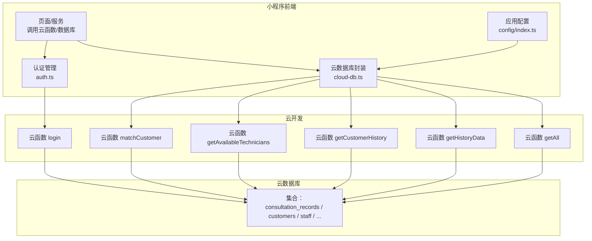
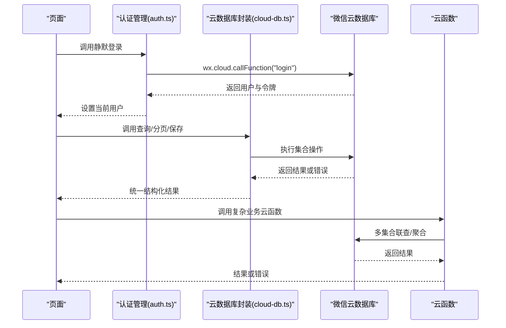
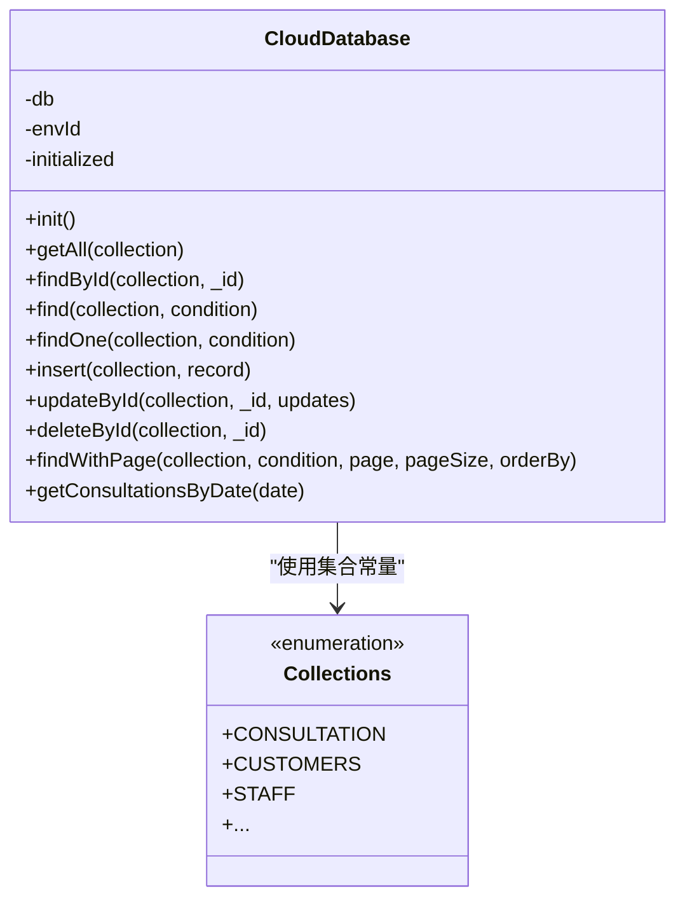
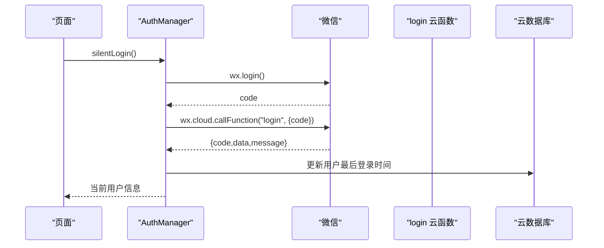
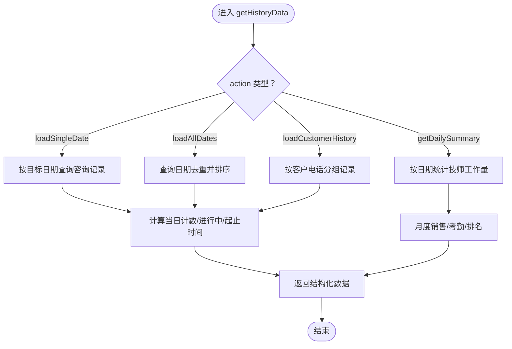
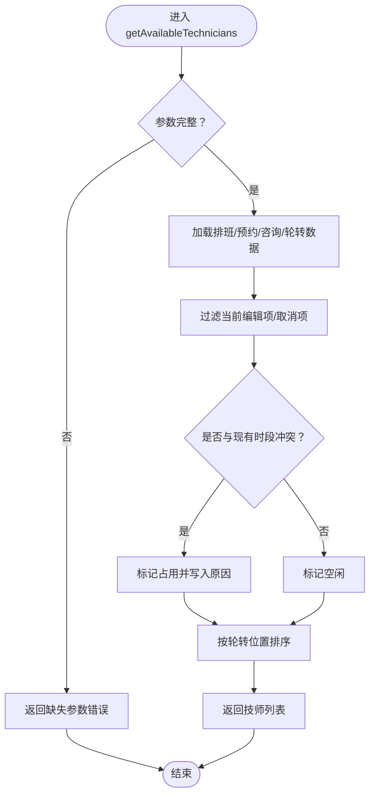
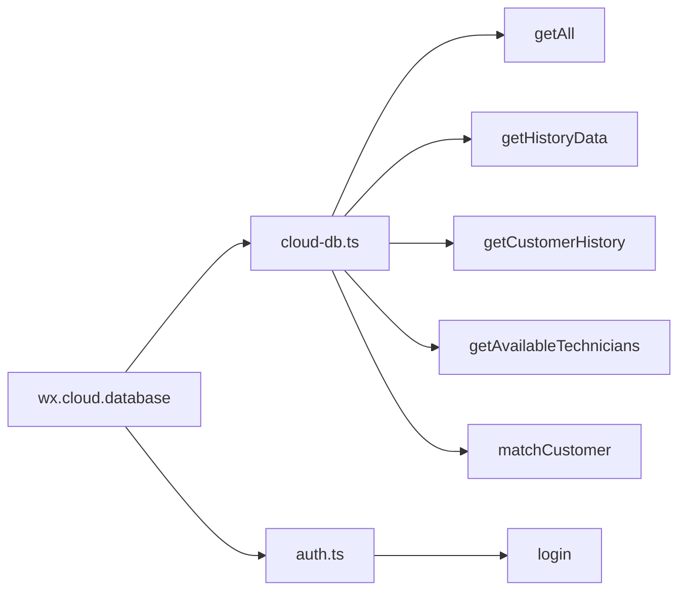

# 数据库问题排查

<cite>
**本文引用的文件**
- [cloud-db.ts](file://miniprogram/utils/cloud-db.ts)
- [auth.ts](file://miniprogram/utils/auth.ts)
- [index.ts（应用配置）](file://miniprogram/config/index.ts)
- [app.ts（全局数据加载）](file://miniprogram/app.ts)
- [index.js（getAll）](file://cloudfunctions/getAll/index.js)
- [index.js（getCustomerHistory）](file://cloudfunctions/getCustomerHistory/index.js)
- [index.js（getHistoryData）](file://cloudfunctions/getHistoryData/index.js)
- [index.js（login）](file://cloudfunctions/login/index.js)
- [index.js（getAvailableTechnicians）](file://cloudfunctions/getAvailableTechnicians/index.js)
- [index.js（matchCustomer）](file://cloudfunctions/matchCustomer/index.js)
- [lib.wx.cloud.d.ts（云开发类型定义）](file://typings/types/wx/lib.wx.cloud.d.ts)
</cite>

## 目录
1. [简介](#简介)
2. [项目结构](#项目结构)
3. [核心组件](#核心组件)
4. [架构总览](#架构总览)
5. [详细组件分析](#详细组件分析)
6. [依赖关系分析](#依赖关系分析)
7. [性能考量](#性能考量)
8. [故障排查指南](#故障排查指南)
9. [结论](#结论)
10. [附录](#附录)

## 简介
本指南面向数据库问题排查与运维，结合代码库中的前端云数据库封装、云函数调用与认证流程，系统性地覆盖以下主题：
- CloudBase 连接问题：网络、权限、API 调用限制
- 查询超时、数据不一致、事务冲突排查
- 性能问题：索引优化、查询计划分析、批量操作优化
- 数据迁移、备份恢复、数据修复
- 错误码对照、日志分析、监控指标
- 冷启动延迟、并发访问控制、数据一致性保障
- 紧急恢复与系统重建

## 项目结构
该仓库采用“小程序前端 + 云开发云函数”的分层架构：
- 前端层：通过 wx.cloud 封装的数据库类进行 CRUD、分页、聚合等操作
- 云函数层：提供业务逻辑与复杂查询，如历史记录汇总、技师可用性计算、客户匹配等
- 认证与会话：基于微信登录态与后端签发的令牌，确保访问安全

图表来源
- [cloud-db.ts](file://miniprogram/utils/cloud-db.ts#L1-L321)
- [auth.ts](file://miniprogram/utils/auth.ts#L1-L245)
- [index.ts（应用配置）](file://miniprogram/config/index.ts#L1-L17)
- [index.js（getAll）](file://cloudfunctions/getAll/index.js#L1-L59)
- [index.js（getHistoryData）](file://cloudfunctions/getHistoryData/index.js#L1-L411)
- [index.js（getCustomerHistory）](file://cloudfunctions/getCustomerHistory/index.js#L1-L100)
- [index.js（login）](file://cloudfunctions/login/index.js#L1-L180)
- [index.js（getAvailableTechnicians）](file://cloudfunctions/getAvailableTechnicians/index.js#L1-L285)
- [index.js（matchCustomer）](file://cloudfunctions/matchCustomer/index.js#L1-L71)

章节来源
- [cloud-db.ts](file://miniprogram/utils/cloud-db.ts#L1-L321)
- [auth.ts](file://miniprogram/utils/auth.ts#L1-L245)
- [index.ts（应用配置）](file://miniprogram/config/index.ts#L1-L17)

## 核心组件
- 云数据库封装（cloud-db.ts）
  - 提供集合常量、初始化、查询、分页、插入、更新、删除、按日期检索等能力
  - 统一错误处理与返回结构，便于前端统一消费
- 认证管理（auth.ts）
  - 微信静默登录、刷新、授权手机号、登出、存储令牌与用户信息
  - 通过云函数 login 完成后端用户态维护与令牌签发
- 应用配置（config/index.ts）
  - 固定云环境 ID，确保前后端使用同一环境
- 全局数据加载（app.ts）
  - 启动时并行拉取项目、房间、精油、员工等基础数据，减少页面级重复请求

章节来源
- [cloud-db.ts](file://miniprogram/utils/cloud-db.ts#L1-L321)
- [auth.ts](file://miniprogram/utils/auth.ts#L1-L245)
- [index.ts（应用配置）](file://miniprogram/config/index.ts#L1-L17)
- [app.ts（全局数据加载）](file://miniprogram/app.ts#L40-L87)

## 架构总览
前端通过 wx.cloud.database() 初始化数据库，使用封装类进行查询；复杂业务由云函数完成，前端通过 wx.cloud.callFunction 调用。

图表来源
- [auth.ts](file://miniprogram/utils/auth.ts#L78-L126)
- [cloud-db.ts](file://miniprogram/utils/cloud-db.ts#L69-L123)
- [index.js（login）](file://cloudfunctions/login/index.js#L11-L90)

## 详细组件分析

### 云数据库封装（cloud-db.ts）
- 设计要点
  - 单例封装，统一 env 初始化
  - 查询支持函数式过滤与条件过滤两种模式
  - 分页查询使用 Promise.all 并行获取数据与总数
  - 插入/更新自动注入时间戳字段
- 关键流程
  - 获取全部数据：调用 getAll，内部通过云函数 getAll 实现分页拉取
  - 条件查询：find 支持函数过滤或 SDK where 条件
  - 分页查询：findWithPage 并行 count 与 get，避免二次请求
  - 日期范围查询：getConsultationsByDate 使用正则匹配日期前缀
- 错误处理
  - 文档不存在时对查找类方法返回空或 null
  - 异常捕获后返回空数组或默认值，避免前端崩溃

图表来源
- [cloud-db.ts](file://miniprogram/utils/cloud-db.ts#L12-L321)

章节来源
- [cloud-db.ts](file://miniprogram/utils/cloud-db.ts#L69-L123)
- [cloud-db.ts](file://miniprogram/utils/cloud-db.ts#L209-L255)
- [cloud-db.ts](file://miniprogram/utils/cloud-db.ts#L283-L298)

### 认证与会话（auth.ts）
- 登录流程
  - wx.login 获取临时 code
  - 调用云函数 login，根据返回结果设置用户与令牌
  - 用户信息变更时可刷新或更新 staffId
- 令牌与状态
  - 本地持久化用户与令牌，支持静默登录
  - 提供管理员角色判断与登出重定向

图表来源
- [auth.ts](file://miniprogram/utils/auth.ts#L78-L126)
- [index.js（login）](file://cloudfunctions/login/index.js#L11-L90)

章节来源
- [auth.ts](file://miniprogram/utils/auth.ts#L78-L126)
- [index.js（login）](file://cloudfunctions/login/index.js#L11-L90)

### 云函数：历史与统计（getHistoryData）
- 功能概览
  - 加载单日/全部日期记录，按日期分组
  - 计算技师当日接诊数、进行中状态、起止时间
  - 月度销售与考勤统计，生成排名
- 关键点
  - 使用正则匹配日期前缀，避免全表扫描
  - 对空值进行容错处理，保证流程稳定
  - 多集合联查与聚合，注意查询顺序与索引

图表来源
- [index.js（getHistoryData）](file://cloudfunctions/getHistoryData/index.js#L88-L410)

章节来源
- [index.js（getHistoryData）](file://cloudfunctions/getHistoryData/index.js#L88-L410)

### 云函数：技师可用性（getAvailableTechnicians）
- 功能概览
  - 基于排班、预约、咨询记录计算技师占用与可用分钟数
  - 支持“实时可用性”模式，结合当前时间判断在岗/忙碌/空闲
- 关键点
  - 时间解析与区间重叠判定
  - 排班轮转队列用于排序权重
  - 多集合联查，需关注索引与查询条件

图表来源
- [index.js（getAvailableTechnicians）](file://cloudfunctions/getAvailableTechnicians/index.js#L9-L124)

章节来源
- [index.js（getAvailableTechnicians）](file://cloudfunctions/getAvailableTechnicians/index.js#L9-L124)

### 云函数：客户匹配（matchCustomer）
- 功能概览
  - 基于姓名、性别、手机号进行评分匹配
  - 仅当评分达到阈值才返回最佳匹配
- 关键点
  - 全量扫描 customers 集合，建议建立手机号前缀索引或优化策略

章节来源
- [index.js（matchCustomer）](file://cloudfunctions/matchCustomer/index.js#L1-L71)

### 云函数：全量拉取（getAll）
- 功能概览
  - 以固定上限分页遍历集合，拼接所有数据
- 关键点
  - 使用游标（lastId）+ 限制条数，避免一次性大查询
  - 适合小到中型集合，大型集合建议使用带条件的分页或导出工具

章节来源
- [index.js（getAll）](file://cloudfunctions/getAll/index.js#L1-L59)

## 依赖关系分析
- 前端依赖
  - wx.cloud.database 与 wx.cloud.callFunction
  - 类型定义来自 lib.wx.cloud.d.ts，提供查询、聚合、命令、监听器等接口
- 云函数依赖
  - 通过 cloud.database() 与命令对象进行查询与更新
  - 多集合联查与正则匹配，需配合索引提升性能

图表来源
- [lib.wx.cloud.d.ts](file://typings/types/wx/lib.wx.cloud.d.ts#L524-L539)
- [cloud-db.ts](file://miniprogram/utils/cloud-db.ts#L1-L321)
- [auth.ts](file://miniprogram/utils/auth.ts#L1-L245)

章节来源
- [lib.wx.cloud.d.ts](file://typings/types/wx/lib.wx.cloud.d.ts#L524-L539)

## 性能考量
- 查询优化
  - 使用正则匹配日期前缀时，建议在日期字段上建立索引
  - 复杂联查优先使用 where + 索引，避免全表扫描
- 分页与批量
  - 前端分页使用并行 count 与 get，减少往返
  - 大数据量场景使用云函数 getAll 的游标分页，或导出工具
- 索引建议
  - 常用查询字段：phone、date、createdAt、technician、status
  - 复合索引：如 date+isVoided、phone+createdAt
- 聚合与计算
  - 月度统计在云函数内完成，建议先做字段规范化与预聚合

[本节为通用性能指导，无需列出具体文件来源]

## 故障排查指南

### 一、CloudBase 连接问题
- 症状
  - 页面无法初始化数据库、云函数调用报错
- 诊断步骤
  - 确认前端 envId 与后端环境一致（应用配置）
  - 检查 wx.cloud 是否可用、初始化是否成功
  - 校验云函数环境变量与权限配置
- 处理建议
  - 在前端封装中增加初始化失败的降级提示
  - 云函数侧增加环境变量校验与错误返回

章节来源
- [index.ts（应用配置）](file://miniprogram/config/index.ts#L1-L17)
- [cloud-db.ts](file://miniprogram/utils/cloud-db.ts#L27-L47)

### 二、权限配置与 API 调用限制
- 症状
  - 登录成功但数据库读写失败；云函数返回权限不足
- 诊断步骤
  - 检查云开发数据库规则与云函数权限
  - 核对用户 openId 与角色映射
- 处理建议
  - 明确集合读写规则，必要时为不同角色开放不同权限
  - 云函数中对敏感操作增加鉴权与审计

章节来源
- [index.js（login）](file://cloudfunctions/login/index.js#L33-L71)
- [auth.ts](file://miniprogram/utils/auth.ts#L67-L70)

### 三、查询超时
- 症状
  - getConsultationsByDate 或 matchCustomer 耗时过长
- 诊断步骤
  - 使用云开发控制台查看慢查询日志
  - 检查是否缺少索引、是否使用了昂贵的正则或全表扫描
- 处理建议
  - 为 date、phone、createdAt 等字段建立合适索引
  - 将全量扫描改为带条件分页或导出工具

章节来源
- [cloud-db.ts](file://miniprogram/utils/cloud-db.ts#L283-L298)
- [index.js（matchCustomer）](file://cloudfunctions/matchCustomer/index.js#L21-L56)

### 四、数据不一致
- 症状
  - 咨询记录与技师统计不一致；技师可用性显示异常
- 诊断步骤
  - 对比咨询记录、预约、排班、轮转队列的数据一致性
  - 检查 isVoided 标记与过滤逻辑
- 处理建议
  - 统一状态机与标记规范，避免中间态数据
  - 在云函数中增加幂等检查与回滚策略

章节来源
- [index.js（getAvailableTechnicians）](file://cloudfunctions/getAvailableTechnicians/index.js#L51-L98)
- [index.js（getHistoryData）](file://cloudfunctions/getHistoryData/index.js#L260-L302)

### 五、事务冲突
- 症状
  - 更新失败、并发写入导致数据异常
- 诊断步骤
  - 检查更新前是否存在并发写入
  - 查看更新返回的统计信息
- 处理建议
  - 使用乐观锁或版本号字段
  - 将高并发写入拆分为原子性更小的操作

章节来源
- [lib.wx.cloud.d.ts](file://typings/types/wx/lib.wx.cloud.d.ts#L1110-L1115)

### 六、数据库性能问题
- 症状
  - 查询慢、分页卡顿、聚合耗时
- 诊断步骤
  - 使用云开发控制台的性能分析与慢查询日志
  - 分析查询计划，确认索引命中情况
- 处理建议
  - 为高频查询字段建立复合索引
  - 优化聚合逻辑，减少不必要的字段投影与排序

章节来源
- [cloud-db.ts](file://miniprogram/utils/cloud-db.ts#L242-L245)
- [index.js（getHistoryData）](file://cloudfunctions/getHistoryData/index.js#L33-L86)

### 七、数据迁移失败、备份恢复与数据修复
- 迁移失败
  - 使用 getAll 云函数进行全量导出，再导入目标环境
  - 导入时注意主键与时间戳字段的兼容性
- 备份恢复
  - 利用云开发提供的备份与回档功能
  - 对关键集合定期导出快照
- 数据修复
  - 通过云函数批量修正字段（如补全日期、修正状态）
  - 修复前先导出快照，修复后验证一致性

章节来源
- [index.js（getAll）](file://cloudfunctions/getAll/index.js#L19-L51)

### 八、错误码对照与日志分析
- 前端封装统一返回结构：code 与 message 字段
- 云函数常见错误：参数缺失、查询失败、权限不足
- 日志分析
  - 前端：捕获 wx.cloud.callFunction 的错误并上报
  - 后端：记录事件参数、查询条件、异常堆栈

章节来源
- [cloud-db.ts](file://miniprogram/utils/cloud-db.ts#L70-L87)
- [index.js（getAll）](file://cloudfunctions/getAll/index.js#L52-L57)

### 九、监控指标解读
- 关键指标
  - 请求成功率、平均响应时间、慢查询占比
  - 云函数并发与超时次数
- 建议
  - 为每个云函数设置告警阈值
  - 对热点集合与高频查询建立基线

[本节为通用监控指导，无需列出具体文件来源]

### 十、冷启动延迟与并发控制
- 冷启动
  - 云函数首次调用可能因初始化而延迟，建议保持热身或使用更短的超时时间
- 并发控制
  - 对高并发写入场景，采用队列化或限流策略
  - 使用幂等设计，避免重复提交造成数据异常

章节来源
- [cloud-db.ts](file://miniprogram/utils/cloud-db.ts#L27-L47)

### 十一、数据一致性保障机制
- 机制
  - 插入/更新自动注入时间戳字段
  - 查询与分页统一返回结构，便于前端一致性展示
- 建议
  - 为关键字段建立唯一索引与校验规则
  - 对跨集合更新使用云函数事务或补偿机制

章节来源
- [cloud-db.ts](file://miniprogram/utils/cloud-db.ts#L136-L165)

### 十二、紧急数据恢复与系统重建
- 应急方案
  - 快速回滚至上一个稳定版本
  - 使用备份恢复关键集合
  - 通过 getAll 导出全量数据，重建索引与规则
- 系统重建
  - 清理异常数据后重新导入
  - 逐步放量，持续监控性能与一致性

章节来源
- [index.js（getAll）](file://cloudfunctions/getAll/index.js#L19-L51)

## 结论
本指南从连接、权限、查询、性能、迁移与恢复等多个维度提供了系统化的排查思路与实操建议。结合前端封装与云函数实现，可快速定位问题并制定修复策略。建议在生产环境中持续完善索引、监控与备份体系，确保系统的稳定性与可维护性。

## 附录

### A. 常见错误码与含义（示例）
- code: 0 表示成功
- code: -1 表示参数缺失或业务异常
- 建议在前端与云函数中统一错误码语义，并记录上下文信息

章节来源
- [index.js（getAll）](file://cloudfunctions/getAll/index.js#L12-L17)
- [index.js（getHistoryData）](file://cloudfunctions/getHistoryData/index.js#L396-L401)

### B. 关键集合与字段建议
- consultation_records：date、startTime、endTime、technician、isVoided、createdAt
- customers：phone、name、gender
- staff/schedule/reservations/rotation_queue：与技师可用性相关的关键字段

章节来源
- [cloud-db.ts](file://miniprogram/utils/cloud-db.ts#L303-L318)
- [index.js（getAvailableTechnicians）](file://cloudfunctions/getAvailableTechnicians/index.js#L26-L63)