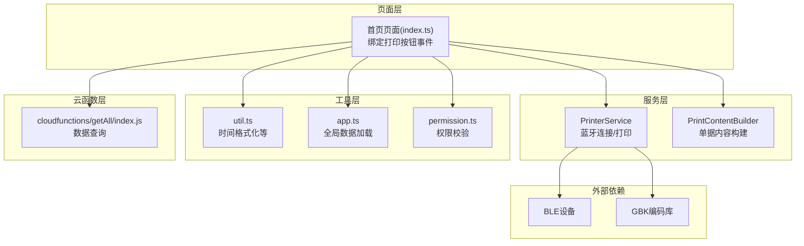
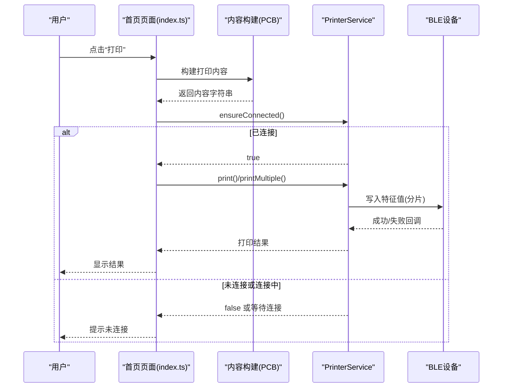
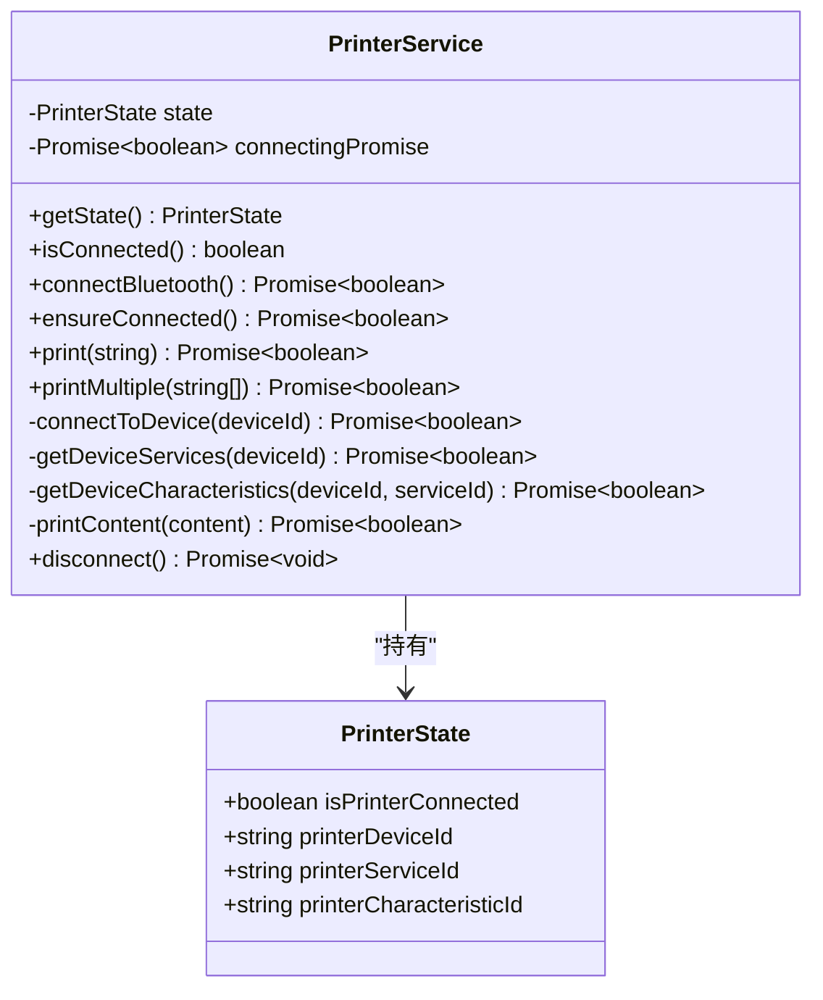
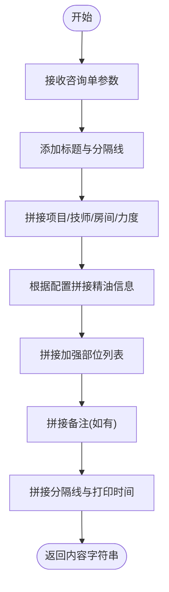
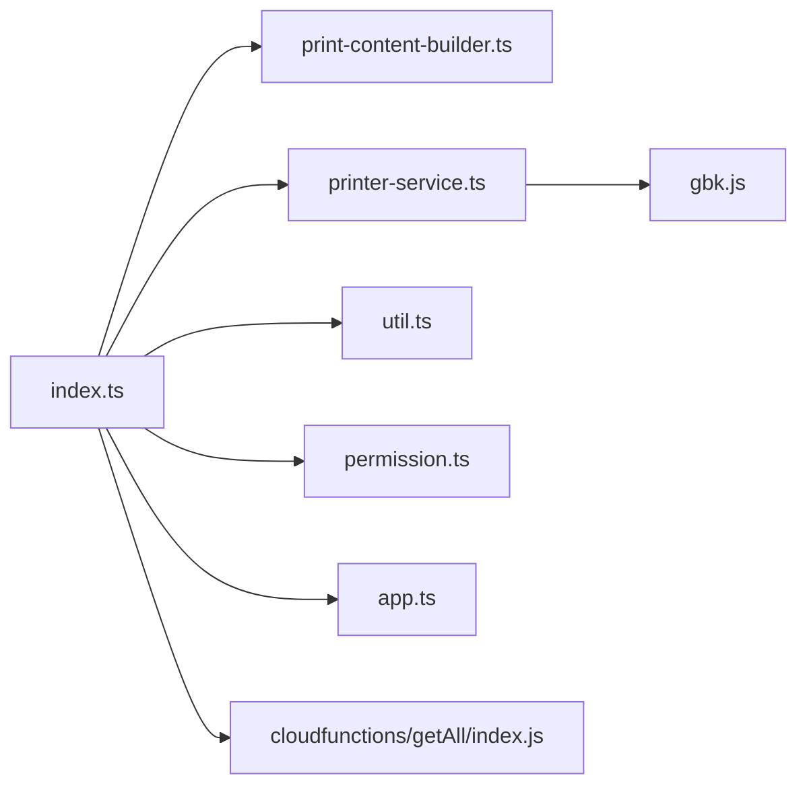

# 蓝牙打印问题排查

<cite>
**本文引用的文件**
- [printer-service.ts](file://miniprogram/services/printer-service.ts)
- [print-content-builder.ts](file://miniprogram/services/print-content-builder.ts)
- [index.ts](file://miniprogram/pages/index/index.ts)
- [index.wxml](file://miniprogram/pages/index/index.wxml)
- [util.ts](file://miniprogram/utils/util.ts)
- [app.ts](file://miniprogram/app.ts)
- [permission.ts](file://miniprogram/utils/permission.ts)
- [index.js](file://cloudfunctions/getAll/index.js)
- [package.json](file://package.json)
</cite>

## 目录
1. [简介](#简介)
2. [项目结构](#项目结构)
3. [核心组件](#核心组件)
4. [架构总览](#架构总览)
5. [详细组件分析](#详细组件分析)
6. [依赖关系分析](#依赖关系分析)
7. [性能考虑](#性能考虑)
8. [故障排查指南](#故障排查指南)
9. [结论](#结论)
10. [附录](#附录)

## 简介
本指南面向蓝牙打印问题的排查与解决，覆盖设备连接失败、配对与连接状态检查、打印异常（内容格式、字符编码、打印质量）、断连重连与超时处理、设备兼容性与权限配置、日志分析与性能优化，以及紧急手动连接与备用打印方案。

## 项目结构
该小程序采用分层架构：
- 页面层：负责用户交互与业务流程编排（如首页页面）
- 服务层：封装蓝牙打印与内容构建逻辑
- 工具层：通用工具函数（时间格式化等）
- 云函数层：数据查询与消息推送等后端能力
- 配置层：全局应用状态与权限控制

图表来源
- [index.ts](file://miniprogram/pages/index/index.ts#L1-L200)
- [printer-service.ts](file://miniprogram/services/printer-service.ts#L1-L298)
- [print-content-builder.ts](file://miniprogram/services/print-content-builder.ts#L1-L144)
- [util.ts](file://miniprogram/utils/util.ts#L1-L150)
- [app.ts](file://miniprogram/app.ts#L1-L191)
- [permission.ts](file://miniprogram/utils/permission.ts#L1-L194)
- [index.js](file://cloudfunctions/getAll/index.js#L1-L100)

章节来源
- [index.ts](file://miniprogram/pages/index/index.ts#L1-L200)
- [printer-service.ts](file://miniprogram/services/printer-service.ts#L1-L298)
- [print-content-builder.ts](file://miniprogram/services/print-content-builder.ts#L1-L144)
- [util.ts](file://miniprogram/utils/util.ts#L1-L150)
- [app.ts](file://miniprogram/app.ts#L1-L191)
- [permission.ts](file://miniprogram/utils/permission.ts#L1-L194)
- [index.js](file://cloudfunctions/getAll/index.js#L1-L100)

## 核心组件
- PrinterService：封装蓝牙适配器打开、设备发现、连接、服务与特征查找、打印分片发送、断开连接等全流程
- PrintContentBuilder：根据咨询单信息生成符合打印机ESC指令的文本内容
- 页面入口与事件：首页页面绑定“打印”按钮，调用内容构建与打印服务
- 工具与权限：时间格式化、全局数据加载、权限校验

章节来源
- [printer-service.ts](file://miniprogram/services/printer-service.ts#L1-L298)
- [print-content-builder.ts](file://miniprogram/services/print-content-builder.ts#L1-L144)
- [index.ts](file://miniprogram/pages/index/index.ts#L1-L200)
- [index.wxml](file://miniprogram/pages/index/index.wxml#L164-L178)
- [util.ts](file://miniprogram/utils/util.ts#L1-L150)
- [permission.ts](file://miniprogram/utils/permission.ts#L1-L194)

## 架构总览
蓝牙打印流程从页面触发，经由内容构建，再到PrinterService执行蓝牙连接与打印，最终通过BLE特征值写入完成输出。

图表来源
- [index.ts](file://miniprogram/pages/index/index.ts#L1-L200)
- [print-content-builder.ts](file://miniprogram/services/print-content-builder.ts#L31-L80)
- [printer-service.ts](file://miniprogram/services/printer-service.ts#L182-L233)

## 详细组件分析

### PrinterService 组件
职责与关键行为：
- 连接状态管理：维护设备ID、服务ID、特征ID与连接标志
- 设备发现与连接：打开适配器、启动发现、监听设备、连接BLE、获取服务与特征
- 打印实现：将内容按GBK编码为字节数组，以固定分片大小循环写入
- 断开与清理：关闭连接、停止发现、关闭适配器并清空状态

图表来源
- [printer-service.ts](file://miniprogram/services/printer-service.ts#L2-L29)
- [printer-service.ts](file://miniprogram/services/printer-service.ts#L10-L295)

章节来源
- [printer-service.ts](file://miniprogram/services/printer-service.ts#L1-L298)

### PrintContentBuilder 组件
职责与关键行为：
- 将咨询单信息映射为可打印文本，包含项目、技师、房间、力度、精油、加强部位、备注与打印时间等
- 使用ESC指令设置大字体，便于热敏打印机识别
- 提供格式化展示文本的辅助方法

图表来源
- [print-content-builder.ts](file://miniprogram/services/print-content-builder.ts#L31-L80)

章节来源
- [print-content-builder.ts](file://miniprogram/services/print-content-builder.ts#L1-L144)

### 页面与事件绑定
- 页面WXML定义“打印”按钮
- 页面TS绑定事件，调用内容构建与打印服务，处理多张单据打印与提示

章节来源
- [index.wxml](file://miniprogram/pages/index/index.wxml#L164-L178)
- [index.ts](file://miniprogram/pages/index/index.ts#L1-L200)

## 依赖关系分析
- PrinterService 依赖 GBK 编码库进行中文内容编码
- 页面依赖 PrinterService 与 PrintContentBuilder 完成打印
- 工具模块提供时间格式化等通用能力
- 权限模块用于页面访问控制
- 云函数用于数据查询与消息推送（与打印流程解耦）

图表来源
- [index.ts](file://miniprogram/pages/index/index.ts#L1-L200)
- [printer-service.ts](file://miniprogram/services/printer-service.ts#L1-L2)
- [print-content-builder.ts](file://miniprogram/services/print-content-builder.ts#L1-L2)
- [util.ts](file://miniprogram/utils/util.ts#L1-L150)
- [permission.ts](file://miniprogram/utils/permission.ts#L1-L194)
- [app.ts](file://miniprogram/app.ts#L1-L191)
- [index.js](file://cloudfunctions/getAll/index.js#L1-L100)

章节来源
- [index.ts](file://miniprogram/pages/index/index.ts#L1-L200)
- [printer-service.ts](file://miniprogram/services/printer-service.ts#L1-L298)
- [print-content-builder.ts](file://miniprogram/services/print-content-builder.ts#L1-L144)
- [util.ts](file://miniprogram/utils/util.ts#L1-L150)
- [permission.ts](file://miniprogram/utils/permission.ts#L1-L194)
- [app.ts](file://miniprogram/app.ts#L1-L191)
- [index.js](file://cloudfunctions/getAll/index.js#L1-L100)

## 性能考虑
- 分片打印：每次写入固定长度片段并延时，避免一次性写入过大导致丢包或阻塞
- 连接去重：ensureConnected 使用 connectingPromise 避免并发重复连接
- 字节编码：GBK编码确保中文字符正确传输
- 多单据间隔：打印多张单据时增加短暂间隔，降低设备处理压力

章节来源
- [printer-service.ts](file://miniprogram/services/printer-service.ts#L182-L233)
- [printer-service.ts](file://miniprogram/services/printer-service.ts#L235-L269)

## 故障排查指南

### 一、蓝牙设备连接失败排查
1. 初始化与发现
- 现象：蓝牙初始化失败/搜索不到设备
- 排查要点：
  - 检查蓝牙适配器是否成功打开
  - 确认设备名称包含“Printer/打印机”关键词
  - 观察10秒超时后是否提示未找到设备
- 处理建议：
  - 重启蓝牙适配器与设备
  - 确保设备处于可被发现状态
  - 在页面中重新触发连接流程

2. 连接与服务/特征
- 现象：连接成功但后续步骤失败
- 排查要点：
  - 是否成功获取服务UUID
  - 是否找到具备写属性的特征
- 处理建议：
  - 更换设备或更换打印服务UUID策略
  - 确认设备支持写入特征

3. 连接状态检查
- 现象：连接状态异常或断连频繁
- 排查要点：
  - PrinterService.isConnected 的判定条件
  - 设备ID/服务ID/特征ID是否完整
- 处理建议：
  - 调用 PrinterService.getState() 获取当前状态
  - 必要时调用 disconnect() 清理并重新连接

章节来源
- [printer-service.ts](file://miniprogram/services/printer-service.ts#L31-L91)
- [printer-service.ts](file://miniprogram/services/printer-service.ts#L93-L180)
- [printer-service.ts](file://miniprogram/services/printer-service.ts#L24-L29)
- [printer-service.ts](file://miniprogram/services/printer-service.ts#L271-L294)

### 二、打印异常排查
1. 内容格式错误
- 现象：打印内容乱码、缺字、布局错位
- 排查要点：
  - ESC指令是否正确（如设置大字体）
  - 加强部位与备注字段是否为空
  - 时间格式是否符合预期
- 处理建议：
  - 检查 PrintContentBuilder 的拼接逻辑
  - 确认字段映射表（力度、部位）是否完整

2. 字符编码问题
- 现象：中文乱码或问号
- 排查要点：
  - 内容是否通过GBK.encode转换
  - 字符集是否与打印机兼容
- 处理建议：
  - 确保使用内置GBK编码库
  - 如需其他字符集，评估设备支持范围

3. 打印质量异常
- 现象：字迹模糊、走纸异常
- 排查要点：
  - 打印浓度与速度设置（设备固件）
  - 纸张类型与厚度
- 处理建议：
  - 调整打印机参数或更换纸张
  - 确保打印内容不含不可打印字符

章节来源
- [print-content-builder.ts](file://miniprogram/services/print-content-builder.ts#L31-L80)
- [printer-service.ts](file://miniprogram/services/printer-service.ts#L235-L269)

### 三、断连重连机制与超时处理
- 重连策略：
  - ensureConnected 会复用连接Promise，避免并发重复连接
  - 若连接失败，需显式调用 disconnect() 清理后重试
- 超时与中断：
  - 设备发现10秒超时自动停止
  - 写入失败时立即返回false并提示
- 建议：
  - 在页面层增加“重试连接”按钮
  - 对连续失败场景记录状态并引导用户重启设备

章节来源
- [printer-service.ts](file://miniprogram/services/printer-service.ts#L182-L195)
- [printer-service.ts](file://miniprogram/services/printer-service.ts#L31-L91)
- [printer-service.ts](file://miniprogram/services/printer-service.ts#L251-L264)

### 四、设备兼容性与权限配置
- 设备兼容性
  - 确认目标设备提供可写的BLE特征
  - 不同品牌/型号可能需要不同的服务UUID与特征属性
- 权限与页面访问
  - 页面访问通过权限模块校验，避免无权限用户进入打印流程
- 建议：
  - 在应用层记录设备信息与兼容性清单
  - 对不兼容设备提供降级提示

章节来源
- [printer-service.ts](file://miniprogram/services/printer-service.ts#L145-L180)
- [permission.ts](file://miniprogram/utils/permission.ts#L149-L193)

### 五、日志分析与性能优化
- 日志分析
  - 关注连接阶段的各步回调（打开适配器、发现设备、连接、获取服务/特征）
  - 打印阶段关注分片写入的成功/失败次数与耗时
- 性能优化
  - 合理设置分片大小与写入间隔
  - 连接去重与状态缓存
  - 多单据打印时增加合理间隔

章节来源
- [printer-service.ts](file://miniprogram/services/printer-service.ts#L235-L269)
- [printer-service.ts](file://miniprogram/services/printer-service.ts#L182-L195)

### 六、紧急手动连接与备用方案
- 手动连接
  - 在页面中提供“手动连接”入口，调用 PrinterService.connectBluetooth()
  - 断开后重新调用 ensureConnected()
- 备用打印
  - 云端打印：通过云函数调用企业微信机器人推送内容
  - 纸质备份：本地记录打印内容，必要时手写补打

章节来源
- [index.ts](file://miniprogram/pages/index/index.ts#L714-L733)
- [printer-service.ts](file://miniprogram/services/printer-service.ts#L31-L91)
- [printer-service.ts](file://miniprogram/services/printer-service.ts#L182-L195)

## 结论
本指南基于现有代码梳理了蓝牙打印的关键流程与常见问题定位方法。建议在生产环境中补充更完善的日志采集、设备兼容性白名单与自动重试策略，并在UI层提供更明确的状态提示与重试入口，以提升用户体验与系统稳定性。

## 附录

### A. 常见错误与处理对照
- 蓝牙初始化失败：检查系统蓝牙开关与权限；尝试重启蓝牙
- 未找到打印机：确认设备名称关键词、靠近设备、关闭干扰源
- 未找到写入特征：确认设备服务UUID与特性属性
- 打印失败：检查分片大小与间隔、内容编码、设备卡纸/缺墨

章节来源
- [printer-service.ts](file://miniprogram/services/printer-service.ts#L37-L89)
- [printer-service.ts](file://miniprogram/services/printer-service.ts#L147-L178)
- [printer-service.ts](file://miniprogram/services/printer-service.ts#L251-L264)

### B. 代码路径参考
- 打印内容构建：[print-content-builder.ts](file://miniprogram/services/print-content-builder.ts#L31-L80)
- 蓝牙连接与打印：[printer-service.ts](file://miniprogram/services/printer-service.ts#L31-L269)
- 页面事件绑定：[index.wxml](file://miniprogram/pages/index/index.wxml#L164-L178)、[index.ts](file://miniprogram/pages/index/index.ts#L1-L200)
- 时间格式化：[util.ts](file://miniprogram/utils/util.ts#L3-L11)
- 权限校验：[permission.ts](file://miniprogram/utils/permission.ts#L149-L193)
- 全局数据加载：[app.ts](file://miniprogram/app.ts#L40-L66)
- 云函数示例：[index.js](file://cloudfunctions/getAll/index.js#L1-L100)