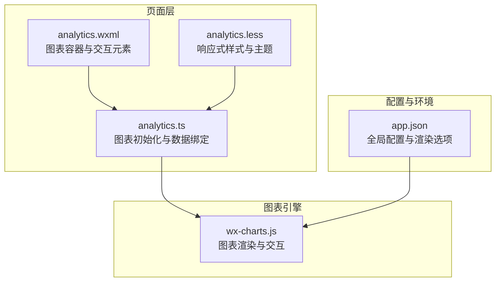
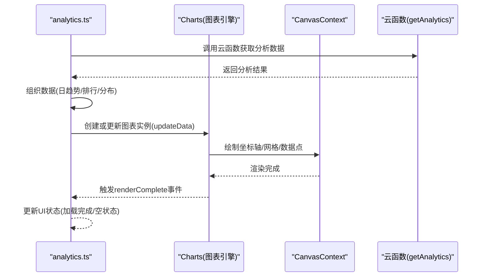
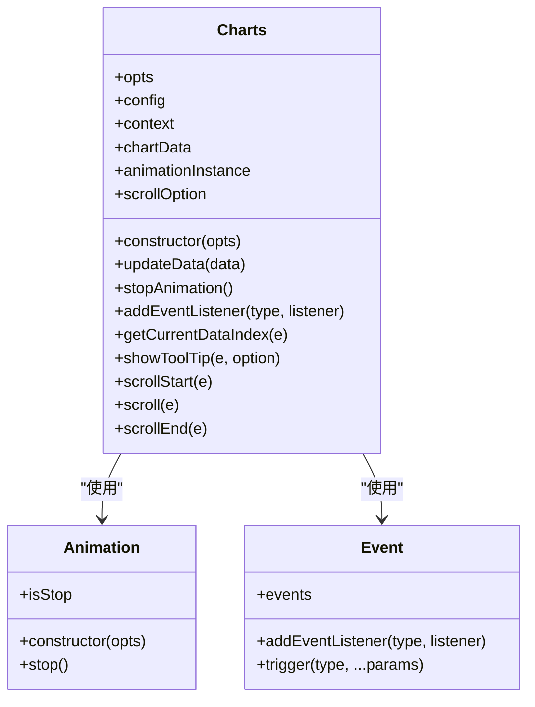
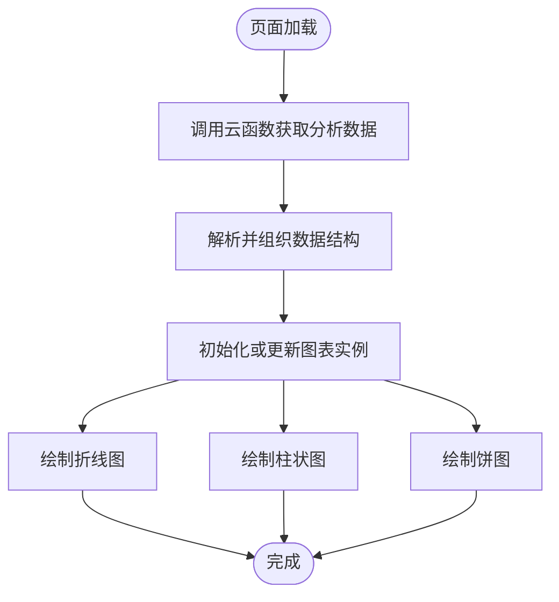
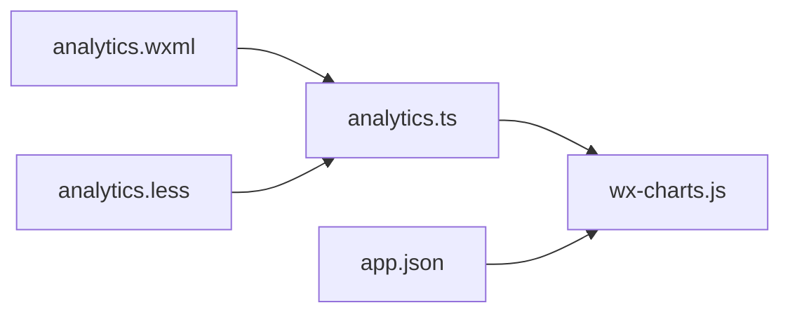

# 图表集成与配置

<cite>
**本文引用的文件**
- [wx-charts.js](file://miniprogram/utils/wx-charts.js)
- [analytics.ts](file://miniprogram/pages/analytics/analytics.ts)
- [analytics.wxml](file://miniprogram/pages/analytics/analytics.wxml)
- [analytics.less](file://miniprogram/pages/analytics/analytics.less)
- [app.json](file://miniprogram/app.json)
</cite>

## 目录
1. [简介](#简介)
2. [项目结构](#项目结构)
3. [核心组件](#核心组件)
4. [架构概览](#架构概览)
5. [详细组件分析](#详细组件分析)
6. [依赖关系分析](#依赖关系分析)
7. [性能考虑](#性能考虑)
8. [故障排除指南](#故障排除指南)
9. [结论](#结论)
10. [附录](#附录)

## 简介
本文件面向图表集成与配置功能，基于仓库中的 wx-charts 图表库实现，提供从初始化到动态更新的完整技术文档。内容涵盖：
- 图表初始化流程与参数配置
- 折线图、柱状图、饼图的样式定制与交互设置
- 响应式设计（屏幕适配、触摸交互、动画效果）
- 实时刷新机制与性能优化策略（大数据量处理与内存管理）
- 主题定制、颜色方案配置与品牌化设计
- 错误处理、兼容性测试与调试技巧

## 项目结构
图表系统主要由以下部分组成：
- 图表库：wx-charts.js 提供统一的图表渲染引擎与交互能力
- 页面集成：analytics 页面通过调用 wx-charts 完成多类型图表的绘制与更新
- 样式与布局：analytics.less 提供响应式容器与主题样式
- 配置入口：app.json 中的全局配置影响渲染环境

**图表来源**
- [wx-charts.js](file://miniprogram/utils/wx-charts.js#L1955-L2124)
- [analytics.ts](file://miniprogram/pages/analytics/analytics.ts#L1-L408)
- [analytics.wxml](file://miniprogram/pages/analytics/analytics.wxml#L1-L154)
- [analytics.less](file://miniprogram/pages/analytics/analytics.less#L1-L274)
- [app.json](file://miniprogram/app.json#L1-L35)

**章节来源**
- [wx-charts.js](file://miniprogram/utils/wx-charts.js#L1955-L2124)
- [analytics.ts](file://miniprogram/pages/analytics/analytics.ts#L1-L408)
- [analytics.wxml](file://miniprogram/pages/analytics/analytics.wxml#L1-L154)
- [analytics.less](file://miniprogram/pages/analytics/analytics.less#L1-L274)
- [app.json](file://miniprogram/app.json#L1-L35)

## 核心组件
- 图表引擎（Charts 类）：封装了初始化、渲染、动画、滚动、工具提示等核心逻辑
- 页面控制器（analytics.ts）：负责数据拉取、时间范围切换、图表实例管理与动态更新
- 视图模板（analytics.wxml）：提供图表容器与交互控件
- 样式系统（analytics.less）：定义图表容器高度、间距、主题色等视觉规范
- 全局配置（app.json）：影响渲染环境与组件框架

关键职责划分：
- 初始化：在页面加载时根据窗口宽度计算图表尺寸，并创建对应类型的图表实例
- 数据绑定：将后端返回的数据映射为图表所需的 series 与 categories
- 动态更新：支持 updateData 方法进行增量更新，避免重建实例
- 交互：支持滚动查看长数据集、工具提示显示、点击索引查询

**章节来源**
- [wx-charts.js](file://miniprogram/utils/wx-charts.js#L1955-L2124)
- [analytics.ts](file://miniprogram/pages/analytics/analytics.ts#L194-L407)

## 架构概览
图表系统采用“页面控制 + 图表引擎”的分层架构。页面负责业务逻辑与数据流，图表引擎负责渲染与交互。

**图表来源**
- [analytics.ts](file://miniprogram/pages/analytics/analytics.ts#L47-L78)
- [wx-charts.js](file://miniprogram/utils/wx-charts.js#L1788-L1924)

**章节来源**
- [analytics.ts](file://miniprogram/pages/analytics/analytics.ts#L47-L78)
- [wx-charts.js](file://miniprogram/utils/wx-charts.js#L1788-L1924)

## 详细组件分析

### 图表引擎（Charts 类）
Charts 类是整个图表系统的核心，负责：
- 参数校验与默认值填充（宽高、动画、图例、坐标轴等）
- 计算坐标系与布局（X/Y轴、图例、标题、文本测量）
- 绘制不同类型的图表（折线、柱状、面积、饼图、雷达）
- 动画控制与事件触发
- 交互处理（滚动、工具提示、点击索引）

关键实现要点：
- 初始化：自动获取窗口信息作为默认宽高，确保在不同设备上的适配
- 布局计算：根据文本长度、角度旋转、图例数量动态调整高度与宽度
- 绘制流程：按类型分别调用对应的绘制函数，统一通过 drawCanvas 提交渲染
- 动画：使用 requestAnimationFrame 或 setTimeout 实现平滑动画，支持 easeIn/easeOut/timing 函数
- 交互：提供 scrollStart/scroll/scrollEnd 处理横向滚动；showToolTip 支持折线/面积图的工具提示

**图表来源**
- [wx-charts.js](file://miniprogram/utils/wx-charts.js#L1955-L2124)

**章节来源**
- [wx-charts.js](file://miniprogram/utils/wx-charts.js#L1955-L2124)

### 页面控制器（analytics.ts）
analytics.ts 负责：
- 时间范围选择与日期计算
- 云函数调用与数据解析
- 图表实例管理与动态更新
- 不同图表类型的绘制方法封装

图表类型与配置要点：
- 折线图：曲线样式、数值格式化、最小值限制
- 柱状图：禁用网格、数值格式化、最小值限制
- 饼图：标签显示、偏移角度、数据标签

**图表来源**
- [analytics.ts](file://miniprogram/pages/analytics/analytics.ts#L194-L407)

**章节来源**
- [analytics.ts](file://miniprogram/pages/analytics/analytics.ts#L1-L408)

### 视图模板与样式（analytics.wxml/analytics.less）
- wxml：提供图表容器 canvas、时间选择器、加载状态与空状态展示
- less：定义图表容器高度、边距、圆角、阴影、主题色等样式，确保在不同设备上的一致体验

响应式特性：
- 容器高度固定（240px），宽度随窗口变化
- 使用安全区域适配（safe-area-inset-*）保证刘海屏/底部安全区
- 主题色变量统一管理，便于品牌化定制

**章节来源**
- [analytics.wxml](file://miniprogram/pages/analytics/analytics.wxml#L75-L121)
- [analytics.less](file://miniprogram/pages/analytics/analytics.less#L172-L189)

## 依赖关系分析
图表系统内部依赖关系清晰，耦合度低：
- analytics.ts 仅依赖 wx-charts.js 的公共接口
- wx-charts.js 内部模块化良好，按功能拆分为布局计算、绘制函数、动画与事件
- 样式与视图独立于逻辑，便于维护与扩展

**图表来源**
- [analytics.ts](file://miniprogram/pages/analytics/analytics.ts#L1-L408)
- [wx-charts.js](file://miniprogram/utils/wx-charts.js#L1-L2124)
- [analytics.wxml](file://miniprogram/pages/analytics/analytics.wxml#L1-L154)
- [analytics.less](file://miniprogram/pages/analytics/analytics.less#L1-L274)
- [app.json](file://miniprogram/app.json#L1-L35)

**章节来源**
- [analytics.ts](file://miniprogram/pages/analytics/analytics.ts#L1-L408)
- [wx-charts.js](file://miniprogram/utils/wx-charts.js#L1-L2124)
- [analytics.wxml](file://miniprogram/pages/analytics/analytics.wxml#L1-L154)
- [analytics.less](file://miniprogram/pages/analytics/analytics.less#L1-L274)
- [app.json](file://miniprogram/app.json#L1-L35)

## 性能考虑
- 动画与重绘节流
  - 工具提示重绘：折线/面积图在短时间内多次触发时进行节流（约 50ms）
  - 滚动重绘：横向滚动时进行节流（约 30ms），避免过度重绘
- 布局与文本测量
  - 文本宽度测量采用字符宽度估算，减少复杂计算
  - X 轴文本抽稀：根据容器宽度动态抽稀，避免密集标签
- 数据处理
  - 分段绘制：折线/面积图对断点数据进行分段绘制，提升可读性
  - 最小最大值计算：自动范围计算，避免极端值导致的渲染异常
- 内存管理
  - 图表实例复用：通过 updateData 替换 series/categories，避免频繁创建销毁
  - 动画实例停止：提供 stopAnimation 接口，及时释放资源

最佳实践建议：
- 大数据量场景下优先使用折线图或柱状图，避免饼图过多扇形
- 合理设置动画时长与缓动函数，平衡用户体验与性能
- 控制同时渲染的图表数量，避免并发重绘造成卡顿

**章节来源**
- [wx-charts.js](file://miniprogram/utils/wx-charts.js#L2046-L2122)

## 故障排除指南
常见问题与解决方案：
- 白屏/渲染异常
  - 现象：某些设备上首次渲染白屏或冻结
  - 处理：引擎内置 try/catch 包裹 draw 调用，失败时自动重试一次
- 数据异常导致的渲染错误
  - 现象：NaN/undefined 导致坐标计算异常
  - 处理：在数据绑定阶段过滤 null/undefined，或在图表库中进行保护性判断
- 滚动边界与越界
  - 现象：滚动超出数据范围
  - 处理：calValidDistance 限制滚动距离，确保不越界
- 工具提示位置异常
  - 现象：右侧边缘工具提示被裁剪
  - 处理：根据偏移位置自动切换箭头方向与背景矩形位置

调试技巧：
- 使用 renderComplete 事件确认渲染完成
- 在 showToolTip 中打印当前索引与坐标，验证拾取逻辑
- 逐步注释掉非必要绘制步骤，定位性能瓶颈

**章节来源**
- [wx-charts.js](file://miniprogram/utils/wx-charts.js#L1697-L1708)
- [wx-charts.js](file://miniprogram/utils/wx-charts.js#L129-L136)
- [wx-charts.js](file://miniprogram/utils/wx-charts.js#L2046-L2080)

## 结论
本图表系统以 wx-charts 为核心，结合页面层的数据处理与交互控制，实现了从初始化到动态更新的完整闭环。通过合理的布局计算、动画控制与性能优化策略，能够在多种设备与数据规模下稳定运行。配合样式系统与主题变量，可快速实现品牌化定制与响应式适配。

## 附录

### 不同类型图表的配置参数与样式定制
- 折线图（line）
  - 关键参数：categories、series、yAxis.format、yAxis.min、extra.lineStyle（curve/直线）
  - 样式：线条宽度、数据点形状、数据标签、工具提示
- 柱状图（column）
  - 关键参数：categories、series、yAxis.format、yAxis.min、xAxis.disableGrid
  - 样式：柱子宽度、颜色、数据标签
- 饼图（pie/ring）
  - 关键参数：series（仅需数值）、dataLabel、extra.pie.offsetAngle
  - 样式：内外半径、描边、标签连线与文本

**章节来源**
- [analytics.ts](file://miniprogram/pages/analytics/analytics.ts#L329-L407)
- [wx-charts.js](file://miniprogram/utils/wx-charts.js#L1818-L1924)

### 响应式设计与屏幕适配
- 容器高度固定（240px），宽度随窗口变化
- 安全区域适配（safe-area-inset-*）保证刘海屏/底部安全区
- 文本旋转与抽稀：根据容器宽度动态调整 X 轴标签角度与密度
- 默认宽高：若未指定则使用窗口宽度与比例高度

**章节来源**
- [analytics.less](file://miniprogram/pages/analytics/analytics.less#L172-L189)
- [wx-charts.js](file://miniprogram/utils/wx-charts.js#L1964-L1977)

### 实时刷新机制与数据绑定
- 数据绑定：页面通过云函数获取最新数据，组织为 series 与 categories
- 动态更新：使用 updateData 进行增量更新，避免重建实例
- 事件驱动：渲染完成后触发 renderComplete，页面据此更新 UI 状态

**章节来源**
- [analytics.ts](file://miniprogram/pages/analytics/analytics.ts#L47-L78)
- [wx-charts.js](file://miniprogram/utils/wx-charts.js#L1999-L2009)

### 主题定制与品牌化设计
- 主题色变量：通过 less 变量统一管理主色、次色、边框色、背景色
- 图表配色：series 中可直接指定颜色，或使用默认颜色数组
- 字体与字号：通过 config 与 opts.yAxis/xAxis/title 等字段控制字体大小与颜色

**章节来源**
- [analytics.less](file://miniprogram/pages/analytics/analytics.less#L1-L274)
- [wx-charts.js](file://miniprogram/utils/wx-charts.js#L12-L37)

### 兼容性测试与调试建议
- 设备差异：在不同机型与系统版本上测试渲染稳定性
- 数据边界：测试空数据、单点数据、极值数据的渲染表现
- 交互验证：滚动、工具提示、点击索引等功能在不同分辨率下的可用性
- 性能监控：关注帧率与内存占用，必要时降低动画复杂度或减少同时渲染的图表数量

**章节来源**
- [wx-charts.js](file://miniprogram/utils/wx-charts.js#L1697-L1708)
- [app.json](file://miniprogram/app.json#L25-L32)