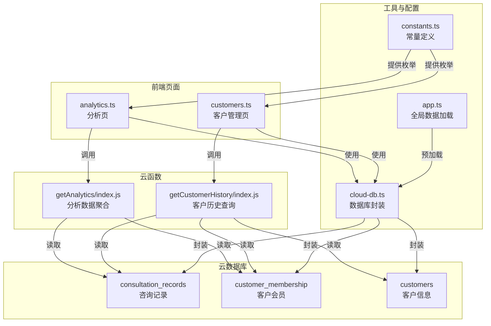
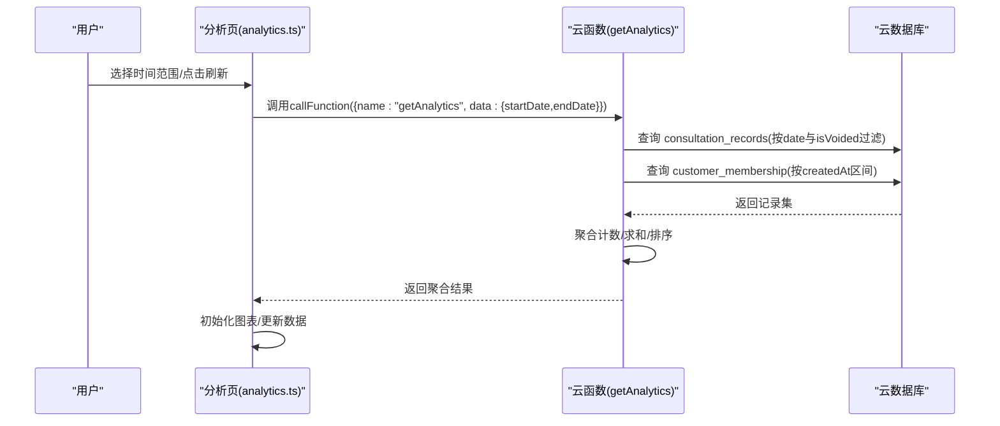
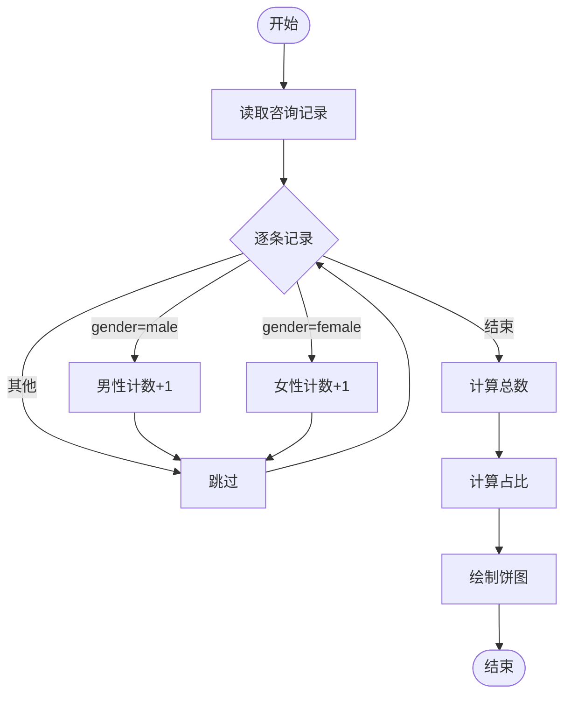
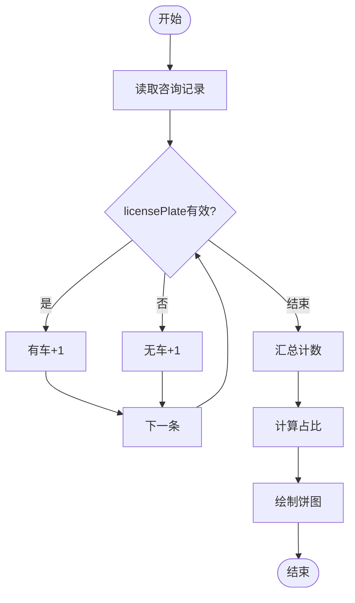
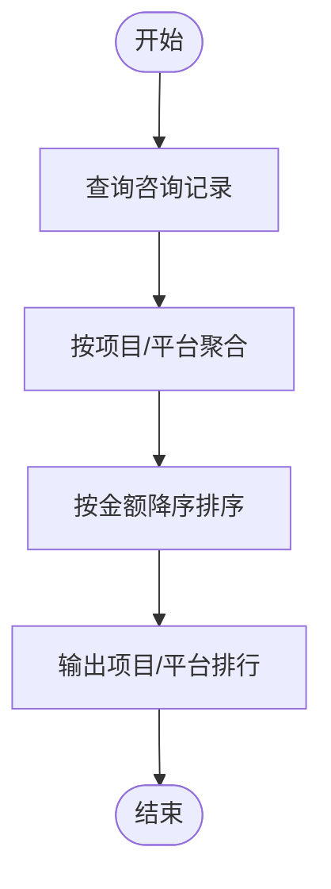
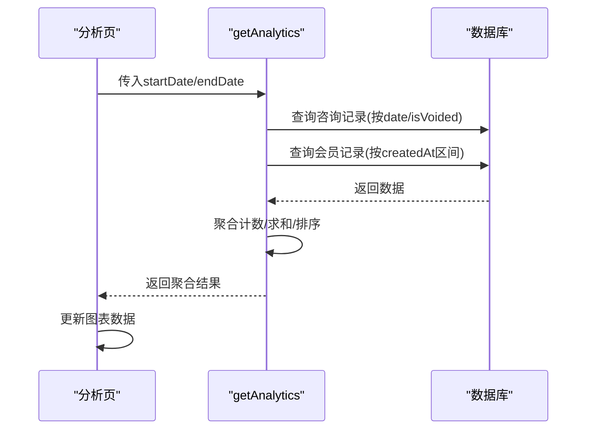
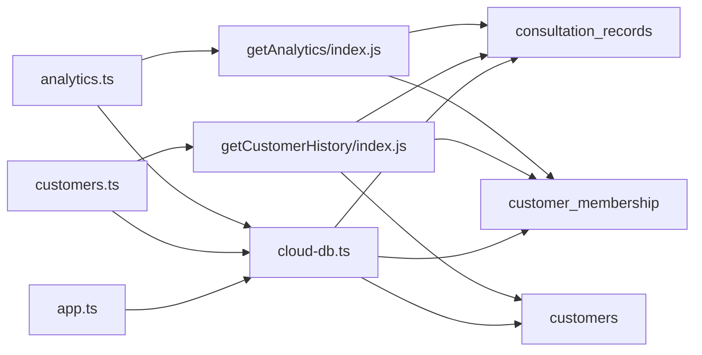

# 客户画像分析

<cite>
**本文档引用的文件**
- [cloudfunctions/getAnalytics/index.js](file://cloudfunctions/getAnalytics/index.js)
- [miniprogram/pages/analytics/analytics.ts](file://miniprogram/pages/analytics/analytics.ts)
- [miniprogram/pages/customers/customers.ts](file://miniprogram/pages/customers/customers.ts)
- [cloudfunctions/getCustomerHistory/index.js](file://cloudfunctions/getCustomerHistory/index.js)
- [miniprogram/utils/cloud-db.ts](file://miniprogram/utils/cloud-db.ts)
- [miniprogram/app.ts](file://miniprogram/app.ts)
- [miniprogram/utils/constants.ts](file://miniprogram/utils/constants.ts)
- [miniprogram/pages/analytics/analytics.json](file://miniprogram/pages/analytics/analytics.json)
- [miniprogram/pages/customers/customers.json](file://miniprogram/pages/customers/customers.json)
</cite>

## 目录
1. [简介](#简介)
2. [项目结构](#项目结构)
3. [核心组件](#核心组件)
4. [架构总览](#架构总览)
5. [详细组件分析](#详细组件分析)
6. [依赖关系分析](#依赖关系分析)
7. [性能考量](#性能考量)
8. [故障排查指南](#故障排查指南)
9. [结论](#结论)
10. [附录](#附录)

## 简介
本功能围绕“客户画像分析”展开，目标是基于咨询与消费数据，提供性别分布、车辆拥有情况、消费趋势、项目偏好、平台来源等多维度的可视化分析，并支持按日、周、月等时间范围灵活查询。同时，系统提供客户详情页以查看历史消费与会员信息，支撑精细化运营与个性化营销。

## 项目结构
前端采用微信小程序框架，后端通过云开发云函数提供数据分析能力；数据存储于云数据库，页面通过云函数调用与数据库交互。

图表来源
- [miniprogram/pages/analytics/analytics.ts](file://miniprogram/pages/analytics/analytics.ts#L47-L78)
- [cloudfunctions/getAnalytics/index.js](file://cloudfunctions/getAnalytics/index.js#L36-L51)
- [cloudfunctions/getCustomerHistory/index.js](file://cloudfunctions/getCustomerHistory/index.js#L9-L18)
- [miniprogram/utils/cloud-db.ts](file://miniprogram/utils/cloud-db.ts#L69-L88)
- [miniprogram/app.ts](file://miniprogram/app.ts#L40-L66)
- [miniprogram/utils/constants.ts](file://miniprogram/utils/constants.ts#L7-L22)

章节来源
- [miniprogram/pages/analytics/analytics.json](file://miniprogram/pages/analytics/analytics.json#L1-L7)
- [miniprogram/pages/customers/customers.json](file://miniprogram/pages/customers/customers.json#L1-L9)

## 核心组件
- 分析页前端组件：负责时间范围选择、调用云函数、渲染折线图、柱状图、饼图等。
- 客户管理页前端组件：负责客户增删改查、会员开卡、历史查询弹窗展示。
- 云函数 getAnalytics：按日期区间聚合咨询与会员数据，产出收入趋势、项目消费排行、平台来源、性别分布、车辆分布等指标。
- 云函数 getCustomerHistory：按手机号查询客户历史消费、会员与使用记录。
- 数据库封装 cloud-db：统一的数据库读写、分页、条件查询等能力。
- 全局数据 app：预加载项目、房间、精油、员工等基础数据，供页面使用。
- 常量 constants：性别、平台等枚举值，便于前端展示与筛选。

章节来源
- [miniprogram/pages/analytics/analytics.ts](file://miniprogram/pages/analytics/analytics.ts#L18-L78)
- [miniprogram/pages/customers/customers.ts](file://miniprogram/pages/customers/customers.ts#L5-L99)
- [cloudfunctions/getAnalytics/index.js](file://cloudfunctions/getAnalytics/index.js#L36-L51)
- [cloudfunctions/getCustomerHistory/index.js](file://cloudfunctions/getCustomerHistory/index.js#L9-L18)
- [miniprogram/utils/cloud-db.ts](file://miniprogram/utils/cloud-db.ts#L69-L88)
- [miniprogram/app.ts](file://miniprogram/app.ts#L40-L66)
- [miniprogram/utils/constants.ts](file://miniprogram/utils/constants.ts#L7-L22)

## 架构总览
分析流程从分析页发起，根据用户选择的时间范围生成查询条件，调用 getAnalytics 云函数；云函数查询咨询与会员集合，进行聚合统计，返回前端绘图所需数据；前端初始化图表并展示。

图表来源
- [miniprogram/pages/analytics/analytics.ts](file://miniprogram/pages/analytics/analytics.ts#L47-L78)
- [cloudfunctions/getAnalytics/index.js](file://cloudfunctions/getAnalytics/index.js#L36-L51)
- [cloudfunctions/getAnalytics/index.js](file://cloudfunctions/getAnalytics/index.js#L53-L171)

## 详细组件分析

### 性别分布分析
- 数据来源：咨询记录集合中的 gender 字段。
- 统计方法：遍历符合条件的咨询记录，分别累加男性与女性计数。
- 比例计算：总人数非零时，分别计算男性与女性占比，用于饼图展示。
- 展示方式：分析页使用饼图组件展示男女比例。

图表来源
- [cloudfunctions/getAnalytics/index.js](file://cloudfunctions/getAnalytics/index.js#L117-L121)
- [miniprogram/pages/analytics/analytics.ts](file://miniprogram/pages/analytics/analytics.ts#L281-L303)

章节来源
- [cloudfunctions/getAnalytics/index.js](file://cloudfunctions/getAnalytics/index.js#L117-L121)
- [miniprogram/pages/analytics/analytics.ts](file://miniprogram/pages/analytics/analytics.ts#L281-L303)

### 车辆拥有情况分析
- 数据来源：咨询记录集合中的 licensePlate 字段。
- 分类标准：当 licensePlate 存在且长度大于0时视为“有车”，否则为“无车”。
- 统计方法：遍历记录，分别累加两类计数。
- 比例计算：总人数非零时，计算两类占比，用于饼图展示。

图表来源
- [cloudfunctions/getAnalytics/index.js](file://cloudfunctions/getAnalytics/index.js#L123-L127)
- [miniprogram/pages/analytics/analytics.ts](file://miniprogram/pages/analytics/analytics.ts#L305-L327)

章节来源
- [cloudfunctions/getAnalytics/index.js](file://cloudfunctions/getAnalytics/index.js#L123-L127)
- [miniprogram/pages/analytics/analytics.ts](file://miniprogram/pages/analytics/analytics.ts#L305-L327)

### 多维度客户分析（年龄、消费频次、偏好项目）
- 年龄：当前代码未直接统计年龄分布。可在咨询记录中扩展 age 字段并在云函数中按年龄段分组聚合。
- 消费频次：项目消费排行 count 即可反映消费频次；平台来源排行 platformConsumption 体现渠道偏好。
- 偏好项目：项目消费金额与次数双指标，结合平台来源，形成消费偏好画像。

图表来源
- [cloudfunctions/getAnalytics/index.js](file://cloudfunctions/getAnalytics/index.js#L97-L115)
- [cloudfunctions/getAnalytics/index.js](file://cloudfunctions/getAnalytics/index.js#L140-L158)
- [miniprogram/pages/analytics/analytics.ts](file://miniprogram/pages/analytics/analytics.ts#L227-L261)

章节来源
- [cloudfunctions/getAnalytics/index.js](file://cloudfunctions/getAnalytics/index.js#L97-L115)
- [cloudfunctions/getAnalytics/index.js](file://cloudfunctions/getAnalytics/index.js#L140-L158)
- [miniprogram/pages/analytics/analytics.ts](file://miniprogram/pages/analytics/analytics.ts#L227-L261)

### 客户画像数据的实时更新与准确性保障
- 实时更新机制：分析页支持多种时间范围选择（今日、昨日、近7天、本月、上月、自定义），每次切换或确认后重新调用云函数获取最新数据。
- 数据准确性：
  - 咨询记录按 date 与 isVoided 过滤，避免作废单影响统计。
  - 会员开卡金额按 createdAt 区间统计，确保统计口径一致。
  - 收入按结算明细 payments 求和，避免遗漏或重复。
  - 图表数据在前端渲染前完成排序与格式化，保证展示一致性。

图表来源
- [miniprogram/pages/analytics/analytics.ts](file://miniprogram/pages/analytics/analytics.ts#L47-L78)
- [cloudfunctions/getAnalytics/index.js](file://cloudfunctions/getAnalytics/index.js#L53-L171)

章节来源
- [miniprogram/pages/analytics/analytics.ts](file://miniprogram/pages/analytics/analytics.ts#L80-L143)
- [cloudfunctions/getAnalytics/index.js](file://cloudfunctions/getAnalytics/index.js#L53-L171)

### 客户行为洞察与个性化营销建议
- 客户细分策略：
  - 性别：男女比例失衡时，针对少数性别定向投放或优化服务体验。
  - 车辆拥有：有车客户可推送停车优惠或到店礼遇；无车客户侧重线上引流与到店引导。
  - 消费频次：高频客户可升级会员等级或专属客服；低频客户推送复购活动。
  - 偏好项目：热门项目组合套餐；冷门项目定向促销。
- 精准营销方案：
  - 基于平台来源（美团、抖音、点评、会员卡等）制定渠道ROI优化策略。
  - 结合时间趋势（日收入趋势）安排促销节点与资源投放。
  - 客户历史查询支持查看过往消费与会员使用，辅助交叉销售与续费提醒。

章节来源
- [cloudfunctions/getAnalytics/index.js](file://cloudfunctions/getAnalytics/index.js#L146-L158)
- [cloudfunctions/getCustomerHistory/index.js](file://cloudfunctions/getCustomerHistory/index.js#L32-L47)
- [miniprogram/pages/customers/customers.ts](file://miniprogram/pages/customers/customers.ts#L228-L291)

### 隐私保护、匿名化与合规性
- 数据最小化：仅采集与业务必要的字段（如性别、车牌号、手机号），避免过度收集。
- 匿名化处理：手机号在查询时先清洗去空格，避免泄露真实号码；历史查询返回的客户信息需谨慎展示。
- 合规性：页面与云函数均对参数进行校验（如手机号必填检查），异常时返回错误码，避免非法输入导致的数据泄漏或异常。
- 权限控制：登录态校验与页面路由守卫确保未登录用户无法访问敏感页面。

章节来源
- [cloudfunctions/getCustomerHistory/index.js](file://cloudfunctions/getCustomerHistory/index.js#L13-L18)
- [miniprogram/pages/customers/customers.ts](file://miniprogram/pages/customers/customers.ts#L146-L152)
- [miniprogram/app.ts](file://miniprogram/app.ts#L27-L38)

## 依赖关系分析
- 前端页面依赖云函数提供的分析数据与客户历史数据。
- 云函数依赖数据库集合：consultation_records、customer_membership、customers。
- 数据库封装提供统一的查询、插入、更新、分页能力，降低页面与云函数的耦合度。
- 全局数据加载在应用启动时完成，减少页面首次加载等待。

图表来源
- [miniprogram/pages/analytics/analytics.ts](file://miniprogram/pages/analytics/analytics.ts#L55-L61)
- [cloudfunctions/getAnalytics/index.js](file://cloudfunctions/getAnalytics/index.js#L56-L71)
- [cloudfunctions/getCustomerHistory/index.js](file://cloudfunctions/getCustomerHistory/index.js#L22-L66)
- [miniprogram/utils/cloud-db.ts](file://miniprogram/utils/cloud-db.ts#L69-L88)
- [miniprogram/app.ts](file://miniprogram/app.ts#L40-L66)

章节来源
- [miniprogram/utils/cloud-db.ts](file://miniprogram/utils/cloud-db.ts#L69-L88)
- [miniprogram/app.ts](file://miniprogram/app.ts#L40-L66)

## 性能考量
- 查询范围控制：按日期区间与状态过滤，避免全表扫描。
- 聚合计算：在云函数内完成计数与求和，减少前端二次处理。
- 图表渲染：前端按需更新图表数据，避免重复初始化。
- 分页与并发：数据库封装提供分页与并发查询能力，提升列表加载效率。

## 故障排查指南
- 云函数调用失败：检查时间范围参数是否正确，确认云函数返回的 code 与错误信息。
- 数据为空：确认咨询记录与会员记录是否存在，核对 isVoided 与 createdAt 过滤条件。
- 图表不显示：检查 genderDistribution 与 vehicleDistribution 是否为 0，前端在总数为 0 时不渲染。
- 参数校验：手机号为空或格式不合法时，云函数会返回错误信息，需在前端提示用户。

章节来源
- [miniprogram/pages/analytics/analytics.ts](file://miniprogram/pages/analytics/analytics.ts#L73-L77)
- [cloudfunctions/getAnalytics/index.js](file://cloudfunctions/getAnalytics/index.js#L45-L50)
- [cloudfunctions/getCustomerHistory/index.js](file://cloudfunctions/getCustomerHistory/index.js#L13-L18)
- [miniprogram/pages/analytics/analytics.ts](file://miniprogram/pages/analytics/analytics.ts#L288-L290)

## 结论
本功能通过云函数对咨询与会员数据进行聚合，结合前端图表组件，实现了性别分布、车辆拥有情况、消费趋势与偏好项目的多维分析。系统具备灵活的时间范围选择、良好的数据准确性与可扩展性，可进一步补充年龄分层与更细粒度的客户标签，以支撑更精准的个性化营销。

## 附录
- 页面入口与导航
  - 分析页：报表分析
  - 客户管理页：顾客管理
- 关键常量
  - 性别枚举：male/female
  - 平台枚举：meituan/dianping/douyin/membership 等

章节来源
- [miniprogram/pages/analytics/analytics.json](file://miniprogram/pages/analytics/analytics.json#L1-L7)
- [miniprogram/pages/customers/customers.json](file://miniprogram/pages/customers/customers.json#L1-L9)
- [miniprogram/utils/constants.ts](file://miniprogram/utils/constants.ts#L7-L22)