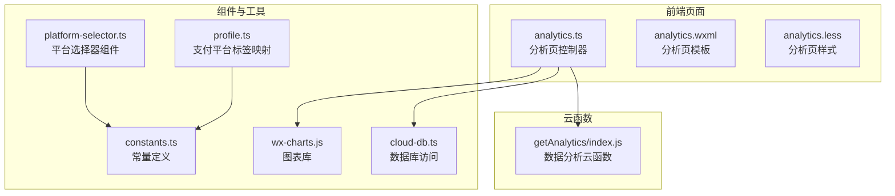
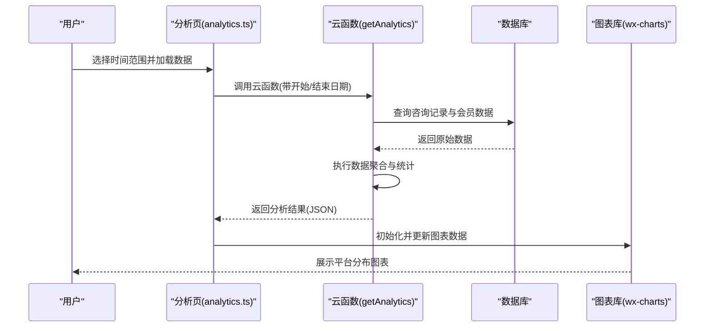
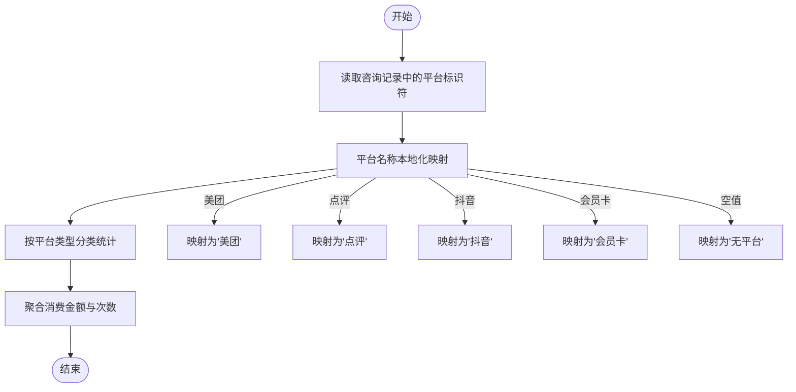
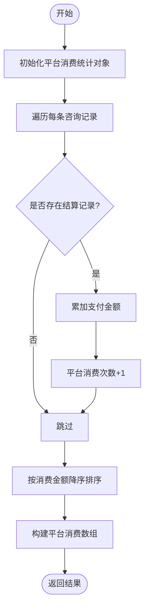
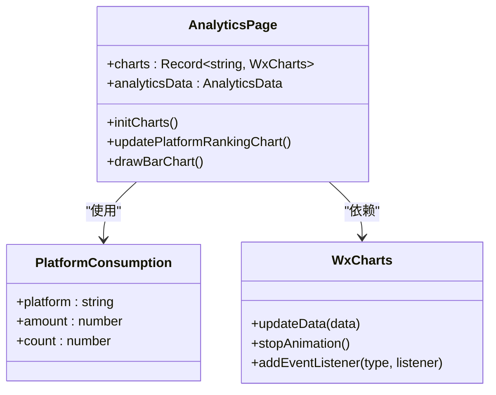
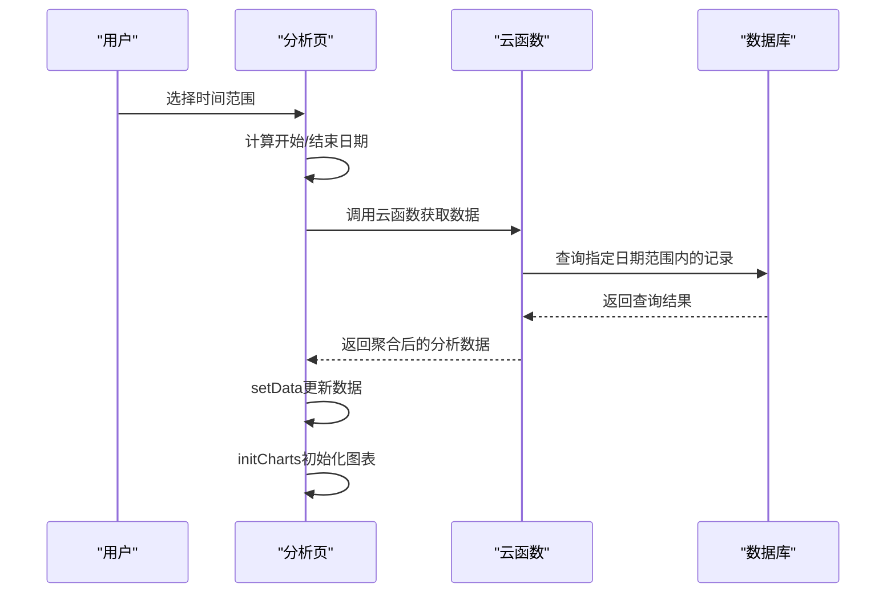
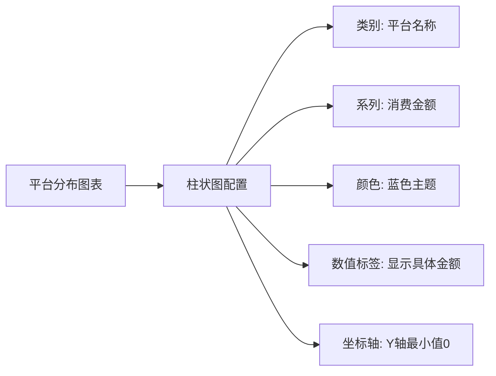
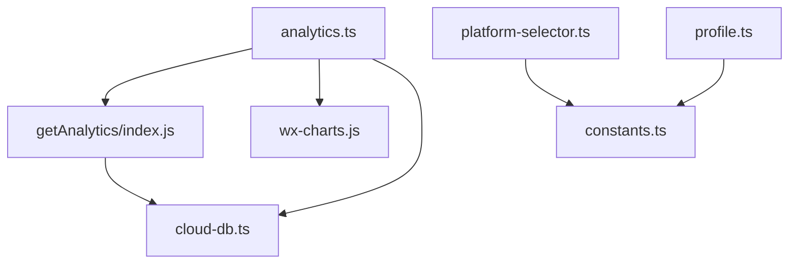

# 平台分布分析

<cite>
**本文档引用的文件**
- [analytics.ts](file://miniprogram/pages/analytics/analytics.ts)
- [analytics.wxml](file://miniprogram/pages/analytics/analytics.wxml)
- [analytics.less](file://miniprogram/pages/analytics/analytics.less)
- [index.js](file://cloudfunctions/getAnalytics/index.js)
- [platform-selector.ts](file://miniprogram/components/platform-selector/platform-selector.ts)
- [constants.ts](file://miniprogram/utils/constants.ts)
- [profile.ts](file://miniprogram/pages/profile/profile.ts)
- [profile.wxml](file://miniprogram/pages/profile/profile.wxml)
- [cloud-db.ts](file://miniprogram/utils/cloud-db.ts)
- [wx-charts.js](file://miniprogram/utils/wx-charts.js)
</cite>

## 目录
1. [简介](#简介)
2. [项目结构](#项目结构)
3. [核心组件](#核心组件)
4. [架构概览](#架构概览)
5. [详细组件分析](#详细组件分析)
6. [依赖关系分析](#依赖关系分析)
7. [性能考虑](#性能考虑)
8. [故障排除指南](#故障排除指南)
9. [结论](#结论)
10. [附录](#附录)

## 简介
本文件为平台分布分析功能的技术文档，深入解释不同平台来源的消费数据分析实现。该功能涵盖平台标识符识别与分类逻辑、平台消费金额与消费次数的统计方法、数据聚合算法与百分比计算、平台分布图表的可视化设计、实时更新机制与数据同步策略，以及基于平台分析的业务洞察与决策支持。

## 项目结构
平台分布分析功能由前端页面、云函数、组件与工具模块协同完成：

- 前端页面：负责用户交互、图表渲染与数据展示
- 云函数：负责数据聚合与统计计算
- 组件：提供平台选择器等可复用UI
- 工具模块：提供图表绘制、常量定义与数据库访问

**图表来源**
- [analytics.ts](file://miniprogram/pages/analytics/analytics.ts#L1-L408)
- [analytics.wxml](file://miniprogram/pages/analytics/analytics.wxml#L44-L113)
- [index.js](file://cloudfunctions/getAnalytics/index.js#L1-L172)
- [platform-selector.ts](file://miniprogram/components/platform-selector/platform-selector.ts#L1-L22)
- [constants.ts](file://miniprogram/utils/constants.ts#L12-L22)
- [wx-charts.js](file://miniprogram/utils/wx-charts.js#L1-L2022)
- [cloud-db.ts](file://miniprogram/utils/cloud-db.ts#L280-L298)
- [profile.ts](file://miniprogram/pages/profile/profile.ts#L55-L65)

**章节来源**
- [analytics.ts](file://miniprogram/pages/analytics/analytics.ts#L1-L408)
- [analytics.wxml](file://miniprogram/pages/analytics/analytics.wxml#L44-L113)
- [index.js](file://cloudfunctions/getAnalytics/index.js#L1-L172)

## 核心组件
平台分布分析的核心组件包括：

- 分析页控制器：负责时间范围选择、数据加载、图表初始化与渲染
- 平台选择器组件：提供平台选项与事件触发
- 云函数：执行数据聚合与统计计算
- 图表库：封装WxCharts，提供折线图、柱状图与饼图绘制
- 常量定义：统一管理平台标识符与标签

**章节来源**
- [analytics.ts](file://miniprogram/pages/analytics/analytics.ts#L18-L78)
- [platform-selector.ts](file://miniprogram/components/platform-selector/platform-selector.ts#L1-L22)
- [constants.ts](file://miniprogram/utils/constants.ts#L12-L22)
- [wx-charts.js](file://miniprogram/utils/wx-charts.js#L329-L406)

## 架构概览
平台分布分析采用前后端分离架构，前端通过云函数获取分析数据，再使用图表库进行可视化展示。

**图表来源**
- [analytics.ts](file://miniprogram/pages/analytics/analytics.ts#L47-L78)
- [index.js](file://cloudfunctions/getAnalytics/index.js#L36-L51)
- [cloud-db.ts](file://miniprogram/utils/cloud-db.ts#L280-L298)
- [wx-charts.js](file://miniprogram/utils/wx-charts.js#L1999-L2009)

## 详细组件分析

### 平台标识符识别与分类逻辑
平台标识符来源于咨询记录中的优惠券平台字段，前端组件提供平台选项，云函数对平台名称进行本地化映射。

**图表来源**
- [index.js](file://cloudfunctions/getAnalytics/index.js#L107-L115)
- [index.js](file://cloudfunctions/getAnalytics/index.js#L144-L158)
- [constants.ts](file://miniprogram/utils/constants.ts#L12-L22)

**章节来源**
- [index.js](file://cloudfunctions/getAnalytics/index.js#L107-L115)
- [index.js](file://cloudfunctions/getAnalytics/index.js#L144-L158)
- [platform-selector.ts](file://miniprogram/components/platform-selector/platform-selector.ts#L1-L22)
- [constants.ts](file://miniprogram/utils/constants.ts#L12-L22)

### 平台消费统计方法
云函数对平台消费进行聚合统计，包括消费金额与消费次数，并按消费金额降序排列。

**图表来源**
- [index.js](file://cloudfunctions/getAnalytics/index.js#L86-L128)
- [index.js](file://cloudfunctions/getAnalytics/index.js#L140-L158)

**章节来源**
- [index.js](file://cloudfunctions/getAnalytics/index.js#L86-L128)
- [index.js](file://cloudfunctions/getAnalytics/index.js#L140-L158)

### 百分比计算与可视化
前端分析页对平台消费金额进行可视化展示，使用柱状图展示消费金额排行，并在图表中显示数值标签。

**图表来源**
- [analytics.ts](file://miniprogram/pages/analytics/analytics.ts#L263-L279)
- [analytics.ts](file://miniprogram/pages/analytics/analytics.ts#L359-L384)
- [analytics.ts](file://miniprogram/pages/analytics/analytics.ts#L194-L204)

**章节来源**
- [analytics.ts](file://miniprogram/pages/analytics/analytics.ts#L263-L279)
- [analytics.ts](file://miniprogram/pages/analytics/analytics.ts#L359-L384)
- [analytics.ts](file://miniprogram/pages/analytics/analytics.ts#L194-L204)

### 实时更新机制与数据同步策略
分析页支持多种时间范围选择，包括今日、昨日、近7天、本月、上月与自定义日期区间。前端通过云函数获取最新数据，并在数据加载完成后初始化图表。

**图表来源**
- [analytics.ts](file://miniprogram/pages/analytics/analytics.ts#L80-L143)
- [analytics.ts](file://miniprogram/pages/analytics/analytics.ts#L47-L78)
- [index.js](file://cloudfunctions/getAnalytics/index.js#L22-L34)

**章节来源**
- [analytics.ts](file://miniprogram/pages/analytics/analytics.ts#L80-L143)
- [analytics.ts](file://miniprogram/pages/analytics/analytics.ts#L47-L78)
- [index.js](file://cloudfunctions/getAnalytics/index.js#L22-L34)

### 可视化设计
平台分布图表采用柱状图展示各平台的消费金额排行，支持响应式宽度与数值标签显示。

**图表来源**
- [analytics.ts](file://miniprogram/pages/analytics/analytics.ts#L263-L279)
- [analytics.ts](file://miniprogram/pages/analytics/analytics.ts#L359-L384)

**章节来源**
- [analytics.ts](file://miniprogram/pages/analytics/analytics.ts#L263-L279)
- [analytics.ts](file://miniprogram/pages/analytics/analytics.ts#L359-L384)

### 支付平台标签映射
支付平台标签用于在详情页展示支付方式的中文名称，确保用户界面的一致性与可读性。

**章节来源**
- [profile.ts](file://miniprogram/pages/profile/profile.ts#L55-L65)
- [profile.wxml](file://miniprogram/pages/profile/profile.wxml#L86-L106)

## 依赖关系分析
平台分布分析涉及多个模块之间的依赖关系，包括前端页面对云函数的调用、图表库的集成、数据库访问层的使用以及常量定义的共享。

**图表来源**
- [analytics.ts](file://miniprogram/pages/analytics/analytics.ts#L1-L408)
- [index.js](file://cloudfunctions/getAnalytics/index.js#L1-L172)
- [platform-selector.ts](file://miniprogram/components/platform-selector/platform-selector.ts#L1-L22)
- [constants.ts](file://miniprogram/utils/constants.ts#L12-L22)
- [profile.ts](file://miniprogram/pages/profile/profile.ts#L55-L65)
- [cloud-db.ts](file://miniprogram/utils/cloud-db.ts#L280-L298)
- [wx-charts.js](file://miniprogram/utils/wx-charts.js#L1-L2022)

**章节来源**
- [analytics.ts](file://miniprogram/pages/analytics/analytics.ts#L1-L408)
- [index.js](file://cloudfunctions/getAnalytics/index.js#L1-L172)
- [platform-selector.ts](file://miniprogram/components/platform-selector/platform-selector.ts#L1-L22)
- [constants.ts](file://miniprogram/utils/constants.ts#L12-L22)
- [profile.ts](file://miniprogram/pages/profile/profile.ts#L55-L65)
- [cloud-db.ts](file://miniprogram/utils/cloud-db.ts#L280-L298)
- [wx-charts.js](file://miniprogram/utils/wx-charts.js#L1-L2022)

## 性能考虑
- 数据聚合优化：云函数在单次查询中完成数据聚合，减少前端处理压力
- 图表渲染优化：使用WxCharts的updateData方法进行增量更新，避免重复创建实例
- 响应式布局：图表宽度根据屏幕宽度动态调整，提升移动端体验
- 时间范围限制：前端支持自定义日期范围，但建议合理设置查询范围以控制数据量

## 故障排除指南
- 数据加载失败：检查云函数调用是否成功，确认返回的数据格式正确
- 图表不显示：验证analyticsData数据是否存在且包含platformConsumption字段
- 平台名称异常：确认平台标识符是否在constants.ts中正确定义
- 数据库查询超时：检查日期范围是否过大，适当缩小查询范围

**章节来源**
- [analytics.ts](file://miniprogram/pages/analytics/analytics.ts#L63-L77)
- [index.js](file://cloudfunctions/getAnalytics/index.js#L40-L50)

## 结论
平台分布分析功能通过前后端协作实现了对不同平台来源消费数据的全面统计与可视化展示。该功能具备良好的扩展性与维护性，能够为业务决策提供有力支持。建议持续监控数据质量，定期优化查询性能，并根据业务需求扩展更多维度的分析指标。

## 附录
- 平台标识符定义：美团、点评、抖音、微信、支付宝、现金、高德、免单、会员卡
- 支付平台标签映射：用于界面展示的中文名称映射
- 图表配置：支持响应式宽度、数值标签与颜色定制