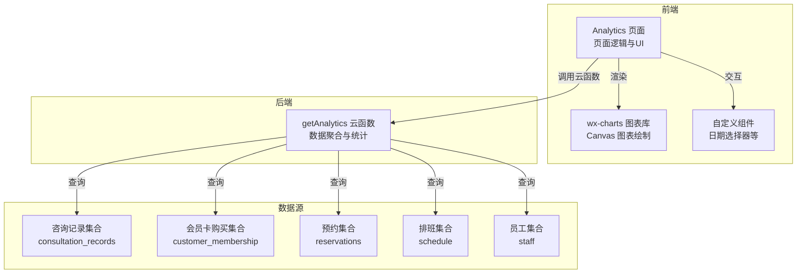
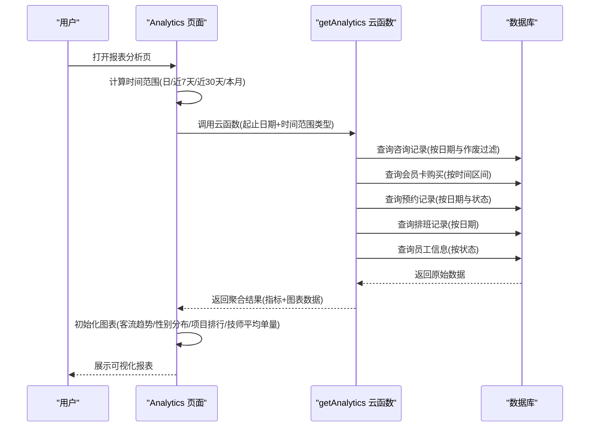
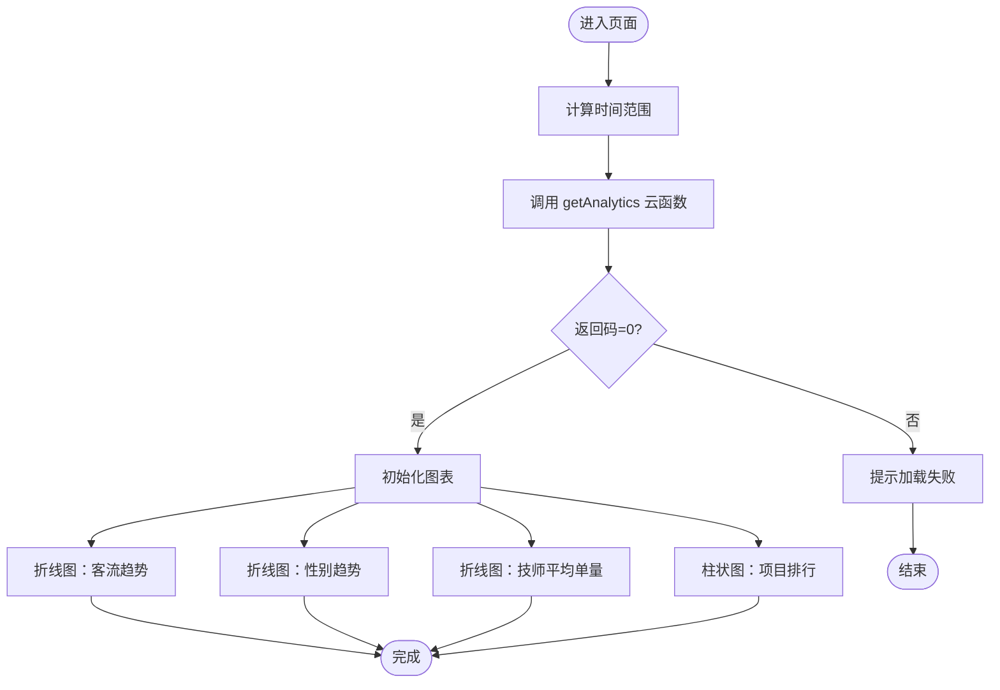
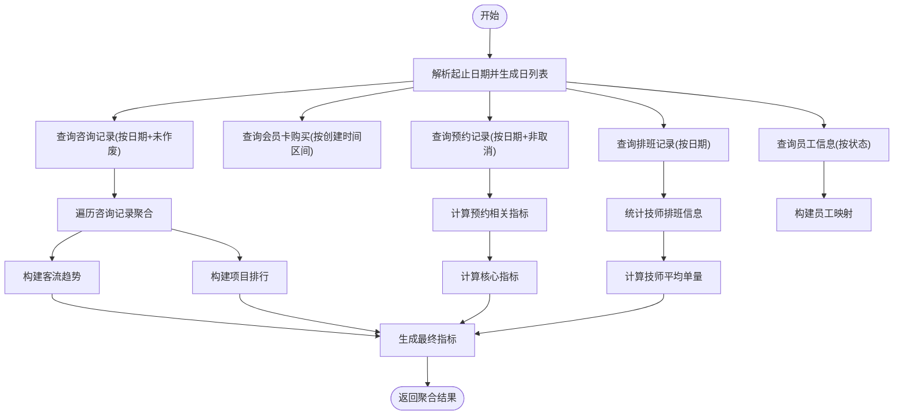
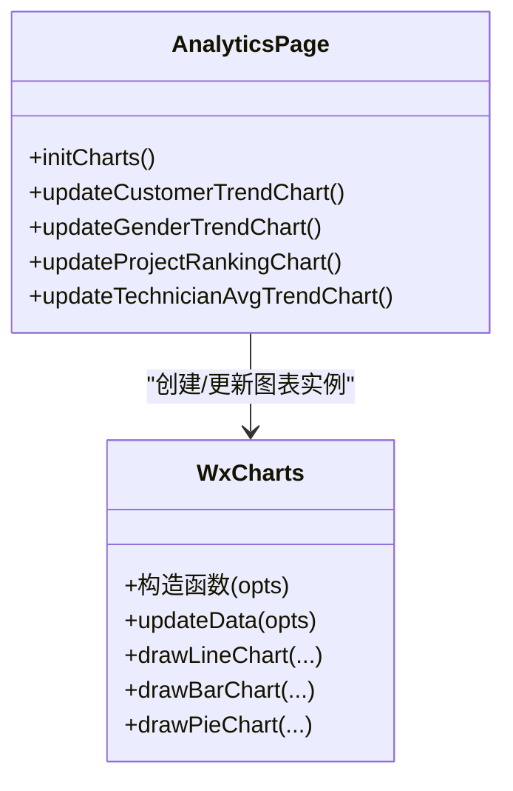
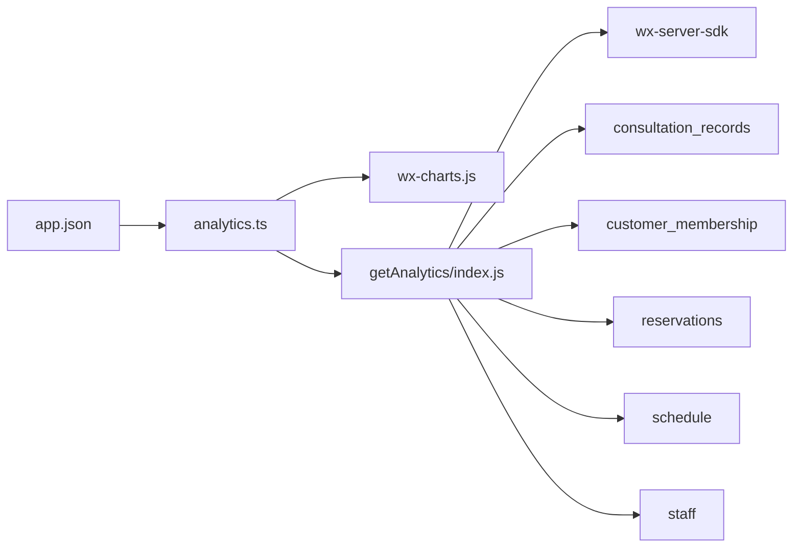

# 数据分析仪表板

<cite>
**本文引用的文件**   
- [cloudfunctions/getAnalytics/index.js](file://cloudfunctions/getAnalytics/index.js)
- [miniprogram/pages/analytics/analytics.ts](file://miniprogram/pages/analytics/analytics.ts)
- [miniprogram/pages/analytics/analytics.wxml](file://miniprogram/pages/analytics/analytics.wxml)
- [miniprogram/utils/wx-charts.js](file://miniprogram/utils/wx-charts.js)
- [miniprogram/components/date-picker/date-picker.ts](file://miniprogram/components/date-picker/date-picker.ts)
- [miniprogram/utils/constants.ts](file://miniprogram/utils/constants.ts)
- [miniprogram/utils/util.ts](file://miniprogram/utils/util.ts)
- [miniprogram/app.json](file://miniprogram/app.json)
- [cloudfunctions/getAnalytics/package.json](file://cloudfunctions/getAnalytics/package.json)
- [miniprogram/utils/cloud-db.ts](file://miniprogram/utils/cloud-db.ts)
</cite>

## 更新摘要
**变更内容**   
- 新增了四种时间范围类型支持：日、近7天、近30天、本月
- 新增了技师平均绩效图表类型，展示男女技师的日均订单量
- 新增了核心指标：总预约数、自来客数
- 扩展了数据源，新增预约、排班、员工集合查询
- 增强了图表展示能力，支持更丰富的业务分析需求

## 目录
1. [简介](#简介)
2. [项目结构](#项目结构)
3. [核心组件](#核心组件)
4. [架构总览](#架构总览)
5. [详细组件分析](#详细组件分析)
6. [依赖关系分析](#依赖关系分析)
7. [性能考虑](#性能考虑)
8. [故障排查指南](#故障排查指南)
9. [结论](#结论)
10. [附录](#附录)

## 简介
本项目为微信小程序"数据分析仪表板"，围绕销售统计、项目分析与平台分布等维度构建可视化报表。前端通过 Analytics 页面实现时间范围筛选、关键指标展示与多图表联动；后端通过 getAnalytics 云函数完成数据聚合与统计计算；图表渲染基于 wx-charts 库，支持折线图、柱状图与饼图等类型。

**更新** 本次升级新增了技师平均绩效分析、多种时间范围类型支持和核心业务指标监控，显著增强了数据分析能力。

## 项目结构
- 前端页面与组件
  - Analytics 页面：负责时间选择、数据请求、图表初始化与渲染
  - wx-charts 图表库：封装 Canvas 图表绘制逻辑
  - 自定义组件：如日期选择器等
- 后端云函数
  - getAnalytics：按时间范围聚合销售、项目与平台数据
- 工具与常量
  - 常量与工具：平台枚举、日期工具、云数据库访问封装

**图表来源**
- [miniprogram/pages/analytics/analytics.ts](file://miniprogram/pages/analytics/analytics.ts#L47-L78)
- [cloudfunctions/getAnalytics/index.js](file://cloudfunctions/getAnalytics/index.js#L83-L117)
- [miniprogram/utils/wx-charts.js](file://miniprogram/utils/wx-charts.js#L1-L200)

**章节来源**
- [miniprogram/pages/analytics/analytics.ts](file://miniprogram/pages/analytics/analytics.ts#L1-L340)
- [cloudfunctions/getAnalytics/index.js](file://cloudfunctions/getAnalytics/index.js#L1-L362)
- [miniprogram/utils/wx-charts.js](file://miniprogram/utils/wx-charts.js#L1-L2124)
- [miniprogram/app.json](file://miniprogram/app.json#L1-L37)

## 核心组件
- Analytics 页面
  - 时间范围选择：支持"日/近7天/近30天/本月"
  - 数据请求：调用 getAnalytics 云函数，传入起止日期和时间范围类型
  - 图表初始化：按需渲染客流趋势、性别趋势、项目排行、技师平均单量等图表
  - 指标展示：总单数、总预约数、男/女技师平均单量、自来客数
- getAnalytics 云函数
  - 时间范围生成：根据起止日期生成连续日列表
  - 数据查询：从咨询记录、会员卡购买、预约、排班、员工集合中按条件检索
  - 统计聚合：日客流趋势、性别分布、项目消费排行、技师平均单量、核心业务指标
- wx-charts 图表库
  - 封装折线图、柱状图、饼图的配置与渲染流程
  - 支持坐标轴、提示框、颜色与动画等配置

**更新** 新增了技师平均单量趋势分析，支持按日、周、月等多时间粒度的业务指标监控。

**章节来源**
- [miniprogram/pages/analytics/analytics.ts](file://miniprogram/pages/analytics/analytics.ts#L47-L78)
- [cloudfunctions/getAnalytics/index.js](file://cloudfunctions/getAnalytics/index.js#L80-L361)
- [miniprogram/utils/wx-charts.js](file://miniprogram/utils/wx-charts.js#L329-L406)

## 架构总览
前端 Analytics 页面通过云函数调用进行数据拉取，返回标准化指标与图表所需数组，随后在页面内初始化 wx-charts 图表实例，完成可视化渲染。

**图表来源**
- [miniprogram/pages/analytics/analytics.ts](file://miniprogram/pages/analytics/analytics.ts#L82-L119)
- [cloudfunctions/getAnalytics/index.js](file://cloudfunctions/getAnalytics/index.js#L63-L78)

## 详细组件分析

### Analytics 页面（数据可视化与交互）
- 时间范围选择
  - 提供预设选项：日、近7天、近30天、本月
  - 日模式下分步弹出日期选择器
  - 支持当前日期切换和刷新操作
- 数据加载与错误处理
  - 调用 wx.cloud.callFunction 请求 getAnalytics
  - 统一处理返回码与异常，显示加载状态与空态
- 图表初始化与更新
  - 按需创建或更新图表实例，避免重复初始化
  - 针对不同图表类型分别构造 categories 与 series 数据
- 图表类型与配置
  - 折线图：客流趋势、性别趋势、技师平均单量趋势
  - 柱状图：项目消费排行
  - 核心指标卡片：总单数、总预约数、男/女技师平均单量、自来客数

**图表来源**
- [miniprogram/pages/analytics/analytics.ts](file://miniprogram/pages/analytics/analytics.ts#L183-L281)

**章节来源**
- [miniprogram/pages/analytics/analytics.ts](file://miniprogram/pages/analytics/analytics.ts#L1-L340)
- [miniprogram/pages/analytics/analytics.wxml](file://miniprogram/pages/analytics/analytics.wxml#L1-L81)

### getAnalytics 云函数（数据聚合与统计）
- 输入参数
  - startDate、endDate：字符串格式日期
  - timeRangeType：时间范围类型（day/last7days/last30days/thisMonth）
  - currentDate：当前日期（用于日模式）
- 时间范围生成
  - 生成闭区间内的每日日期列表
  - 支持小时粒度（日模式）和日粒度（其他模式）
- 数据查询
  - 咨询记录：按日期数组精确匹配，且排除作废记录
  - 会员卡购买：按创建时间区间查询
  - 预约记录：按日期区间查询，排除取消状态
  - 排班记录：按日期区间查询，获取技师排班信息
  - 员工信息：按状态查询活跃员工
- 统计聚合
  - 客流趋势：按日统计男性、女性、总计客流
  - 性别趋势：按日统计男性、女性客流分布
  - 项目排行：按项目统计消费次数及占比
  - 技师平均单量：按日统计男女技师的日均订单量
  - 核心指标：总单数、总预约数、男/女技师平均单量、自来客数
- 输出结构
  - keyMetrics、customerTrend、genderTrend、projectRanking、technicianAvgTrend

**更新** 新增了预约、排班、员工数据源查询，以及技师平均单量和核心业务指标的统计分析。

**图表来源**
- [cloudfunctions/getAnalytics/index.js](file://cloudfunctions/getAnalytics/index.js#L80-L361)

**章节来源**
- [cloudfunctions/getAnalytics/index.js](file://cloudfunctions/getAnalytics/index.js#L1-L362)
- [cloudfunctions/getAnalytics/package.json](file://cloudfunctions/getAnalytics/package.json#L1-L10)

### wx-charts 图表库（集成与配置）
- 图表类型
  - 折线图：用于客流趋势、性别趋势、技师平均单量趋势
  - 柱状图：用于项目排行
- 关键配置
  - categories：横轴标签
  - series：系列数据与颜色
  - width/height：画布尺寸
  - yAxis/xAxis：数值轴与网格
  - dataLabel：是否显示数值标签
  - extra：额外样式配置（如 lineStyle: curve）
- 更新机制
  - 若实例已存在则调用 updateData 更新数据，否则新建实例

**图表来源**
- [miniprogram/utils/wx-charts.js](file://miniprogram/utils/wx-charts.js#L329-L406)
- [miniprogram/pages/analytics/analytics.ts](file://miniprogram/pages/analytics/analytics.ts#L183-L281)

**章节来源**
- [miniprogram/utils/wx-charts.js](file://miniprogram/utils/wx-charts.js#L1-L2124)
- [miniprogram/pages/analytics/analytics.ts](file://miniprogram/pages/analytics/analytics.ts#L283-L338)

### 时间范围与日期选择组件
- 预设时间范围
  - 日：按当前日期统计，支持小时粒度
  - 近7天：最近7天统计
  - 近30天：最近30天统计
  - 本月：当月统计
- 自定义日期
  - 日模式下分步弹出日期选择器
  - 日期格式化与边界校验
- 常量与工具
  - 平台枚举、性别枚举等常量
  - 日期工具：当前日期、前后日期计算

**更新** 新增了四种时间范围类型，支持更灵活的业务分析需求。

**章节来源**
- [miniprogram/pages/analytics/analytics.ts](file://miniprogram/pages/analytics/analytics.ts#L47-L78)
- [miniprogram/pages/analytics/analytics.ts](file://miniprogram/pages/analytics/analytics.ts#L121-L170)
- [miniprogram/components/date-picker/date-picker.ts](file://miniprogram/components/date-picker/date-picker.ts#L1-L101)
- [miniprogram/utils/constants.ts](file://miniprogram/utils/constants.ts#L1-L67)
- [miniprogram/utils/util.ts](file://miniprogram/utils/util.ts#L109-L140)

## 依赖关系分析
- 前端依赖
  - Analytics 页面依赖 wx-charts 进行渲染
  - 通过 wx.cloud.callFunction 调用 getAnalytics 云函数
  - 依赖自定义组件（如日期选择器）与工具类（日期/常量）
- 后端依赖
  - getAnalytics 云函数依赖 wx-server-sdk 进行数据库查询
  - 查询五个集合：consultation_records、customer_membership、reservations、schedule、staff
- 配置
  - app.json 中声明 Analytics 页面为入口之一，启用云开发

**图表来源**
- [miniprogram/pages/analytics/analytics.ts](file://miniprogram/pages/analytics/analytics.ts#L1-L340)
- [cloudfunctions/getAnalytics/index.js](file://cloudfunctions/getAnalytics/index.js#L1-L10)
- [miniprogram/app.json](file://miniprogram/app.json#L1-L37)

**章节来源**
- [cloudfunctions/getAnalytics/package.json](file://cloudfunctions/getAnalytics/package.json#L1-L10)
- [miniprogram/utils/cloud-db.ts](file://miniprogram/utils/cloud-db.ts#L303-L323)

## 性能考虑
- 前端
  - 图表懒渲染：仅在收到数据后再初始化，减少首屏等待
  - 实例复用：已有实例直接 updateData，避免频繁销毁重建
  - 数据截断：项目排行限制前10项，降低渲染压力
  - 条件渲染：技师平均单量图表仅在非日模式下显示
- 后端
  - 精确查询：按日期数组精确匹配咨询记录，避免全表扫描
  - 单次聚合：在云函数内一次性完成多维聚合，减少前端二次处理
  - 限制查询：咨询记录查询限制1000条，防止超大数据集查询
  - 多集合并行查询：使用 Promise.all 并行查询多个数据源
- 其他
  - 图表宽度适配：根据系统窗口宽度动态计算，提升在不同设备上的表现

**更新** 新增了多集合并行查询优化，显著提升了数据聚合效率。

**章节来源**
- [miniprogram/pages/analytics/analytics.ts](file://miniprogram/pages/analytics/analytics.ts#L183-L281)
- [cloudfunctions/getAnalytics/index.js](file://cloudfunctions/getAnalytics/index.js#L83-L109)

## 故障排查指南
- 云函数调用失败
  - 检查返回码与错误信息，确认网络与权限
  - 确认云开发环境变量与数据库访问权限
- 图表不显示或空白
  - 确认数据结构与字段是否存在（如 consultation_records、reservations、schedule、staff）
  - 检查 categories 与 series 是否为空
  - 验证时间范围类型参数是否正确传递
- 数据不准确
  - 确认时间范围边界（起止日期的时分秒处理）
  - 核对作废记录过滤逻辑（isVoided）
  - 检查技师平均单量计算逻辑（订单数/技师数）
- 性能问题
  - 减少默认时间窗口或限制图表项数
  - 避免频繁刷新导致的重复请求
  - 检查数据库查询索引配置

**更新** 新增了技师平均单量相关的故障排查指导。

**章节来源**
- [miniprogram/pages/analytics/analytics.ts](file://miniprogram/pages/analytics/analytics.ts#L82-L119)
- [cloudfunctions/getAnalytics/index.js](file://cloudfunctions/getAnalytics/index.js#L63-L78)

## 结论
该数据分析仪表板通过前后端协同，实现了从时间选择到数据聚合再到可视化呈现的完整闭环。getAnalytics 云函数承担了关键的聚合职责，Analytics 页面负责灵活的时间选择与多图表渲染，wx-charts 提供了稳定高效的图表能力。本次重大升级新增了技师平均绩效分析、多种时间范围类型支持和核心业务指标监控，显著增强了系统的分析能力和业务洞察力。整体架构清晰、扩展性强，便于后续增加自定义报表、数据导出与实时更新等功能。

## 附录

### 数据模型与字段说明
- 咨询记录集合（consultation_records）
  - 字段要点：date、isVoided、settlement.payments、project、couponPlatform、gender、technician
- 会员卡购买集合（customer_membership）
  - 字段要点：createdAt、paidAmount
- 预约集合（reservations）
  - 字段要点：date、status
- 排班集合（schedule）
  - 字段要点：date、staffId
- 员工集合（staff）
  - 字段要点：status、gender、name

**更新** 新增了预约、排班、员工数据集合的字段说明。

**章节来源**
- [cloudfunctions/getAnalytics/index.js](file://cloudfunctions/getAnalytics/index.js#L83-L124)
- [miniprogram/utils/cloud-db.ts](file://miniprogram/utils/cloud-db.ts#L303-L323)

### 最佳实践与建议
- 数据准确性
  - 明确时间范围边界与作废规则，确保统计口径一致
  - 对空值与异常数据进行兜底处理（如 reduce 求和时的默认值）
  - 验证技师平均单量计算的准确性（订单数/技师数）
- 可视化设计
  - 优先使用折线图展示趋势，柱状图对比排行
  - 控制标签长度与角度，避免重叠
  - 合理使用颜色区分不同业务维度
- 性能优化
  - 合理设置默认时间窗口，避免一次性查询过长周期
  - 图表项数限制与懒渲染结合
  - 使用并行查询优化多数据源聚合性能
- 扩展开发
  - 新增报表维度：在云函数中新增聚合逻辑，在页面中新增图表与指标
  - 数据导出：可将聚合后的数组导出为 CSV 或图片
  - 实时更新：结合定时任务或订阅机制定期刷新缓存
  - 新增时间范围类型：扩展时间范围计算逻辑和图表适配

**更新** 新增了技师平均单量分析和多时间范围类型的相关最佳实践建议。