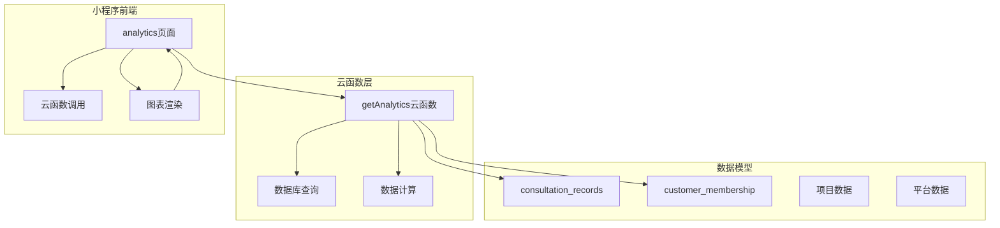
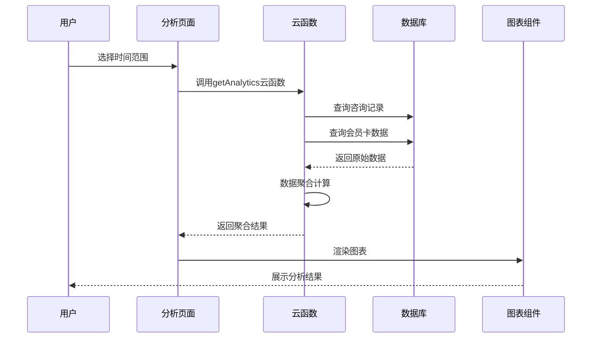
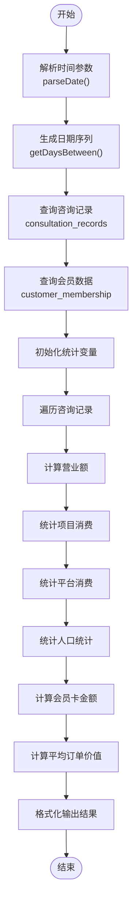
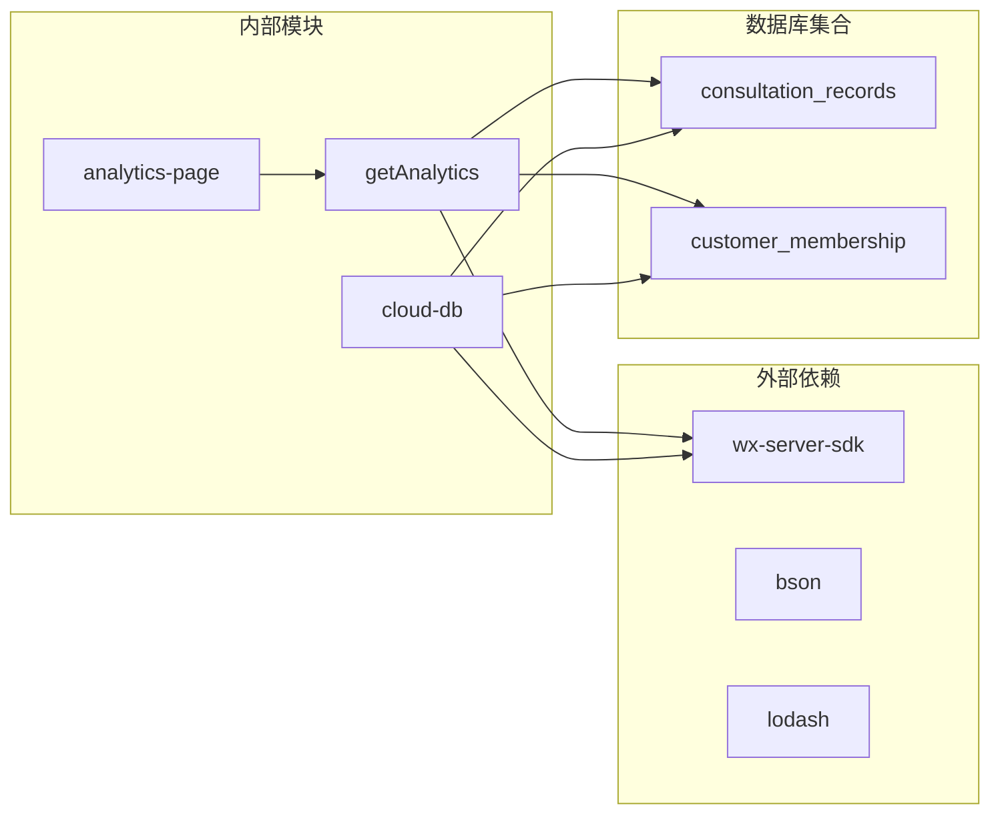

# 数据聚合逻辑

<cite>
**本文档引用的文件**
- [getAnalytics/index.js](file://cloudfunctions/getAnalytics/index.js)
- [getAnalytics/package.json](file://cloudfunctions/getAnalytics/package.json)
- [analytics.ts](file://miniprogram/pages/analytics/analytics.ts)
- [cloud-db.ts](file://miniprogram/utils/cloud-db.ts)
- [index.d.ts](file://typings/index.d.ts)
</cite>

## 目录
1. [简介](#简介)
2. [项目结构](#项目结构)
3. [核心组件](#核心组件)
4. [架构概览](#架构概览)
5. [详细组件分析](#详细组件分析)
6. [依赖关系分析](#依赖关系分析)
7. [性能考虑](#性能考虑)
8. [故障排除指南](#故障排除指南)
9. [结论](#结论)
10. [附录](#附录)

## 简介

本文件详细阐述了ConsultationPrinter小程序中数据聚合逻辑的实现，重点分析getAnalytics云函数的数据处理流程。该系统实现了完整的数据分析功能，包括时间范围过滤、数据分组、统计计算、图表展示等核心功能。系统通过微信云开发平台提供高性能的数据聚合服务，支持多种时间范围选择和多维度统计分析。

## 项目结构

数据聚合功能主要分布在以下目录结构中：



**图表来源**
- [getAnalytics/index.js](file://cloudfunctions/getAnalytics/index.js#L36-L51)
- [analytics.ts](file://miniprogram/pages/analytics/analytics.ts#L47-L78)

**章节来源**
- [getAnalytics/index.js](file://cloudfunctions/getAnalytics/index.js#L1-L172)
- [analytics.ts](file://miniprogram/pages/analytics/analytics.ts#L1-L408)

## 核心组件

### 1. getAnalytics云函数

getAnalytics云函数是整个数据聚合系统的核心，负责从数据库中提取、处理和聚合数据。

#### 主要功能模块

**时间范围处理模块**
- `parseDate()`: 解析日期字符串为Date对象
- `formatDate()`: 将Date对象格式化为YYYY-MM-DD格式
- `getDaysBetween()`: 生成指定时间范围内所有日期的数组

**数据聚合模块**
- `getAnalyticsData()`: 主要聚合逻辑函数
- 处理咨询记录数据
- 处理会员卡数据
- 计算各种统计指标

**数据结构定义**
- `dailyRevenueTrend`: 日营业额趋势
- `projectConsumption`: 项目消费统计
- `platformConsumption`: 平台消费统计
- `genderCount`: 性别分布统计
- `vehicleCount`: 车辆分布统计

**章节来源**
- [getAnalytics/index.js](file://cloudfunctions/getAnalytics/index.js#L10-L34)
- [getAnalytics/index.js](file://cloudfunctions/getAnalytics/index.js#L53-L171)

### 2. 前端分析页面

analytics页面负责用户界面交互和数据展示。

#### 主要功能
- 时间范围选择器
- 图表渲染引擎
- 数据可视化展示
- 用户交互处理

**章节来源**
- [analytics.ts](file://miniprogram/pages/analytics/analytics.ts#L1-L408)

### 3. 数据模型定义

系统使用TypeScript定义了完整的数据模型结构。

#### 核心数据模型

**咨询单记录模型**
```typescript
interface ConsultationRecord {
  isVoided: boolean;
  extraTime: number;
  overtime: number;
  startTime: string;
  endTime: string;
  settlement?: SettlementInfo;
  amount?: number;
  date: string;
}
```

**结算信息模型**
```typescript
interface SettlementInfo {
  payments: PaymentItem[];
  totalAmount: number;
  couponCode?: string;
  settledAt: string;
}
```

**章节来源**
- [index.d.ts](file://typings/index.d.ts#L37-L83)
- [index.d.ts](file://typings/index.d.ts#L22-L35)

## 架构概览

系统采用前后端分离架构，通过云函数提供数据聚合服务。



**图表来源**
- [analytics.ts](file://miniprogram/pages/analytics/analytics.ts#L47-L78)
- [getAnalytics/index.js](file://cloudfunctions/getAnalytics/index.js#L36-L51)

## 详细组件分析

### 1. getAnalytics云函数详细分析

#### 数据处理流程



**图表来源**
- [getAnalytics/index.js](file://cloudfunctions/getAnalytics/index.js#L53-L171)

#### 时间范围过滤实现

系统支持多种时间范围选择：
- 今日、昨日、近7天
- 本月、上月
- 自定义日期范围

**章节来源**
- [getAnalytics/index.js](file://cloudfunctions/getAnalytics/index.js#L22-L34)
- [analytics.ts](file://miniprogram/pages/analytics/analytics.ts#L80-L143)

### 2. 数据分组算法

#### 日营业额趋势分组
- 使用日期作为键，初始化为0
- 遍历咨询记录，按日期累加支付金额
- 确保时间序列的完整性

#### 项目消费分组
- 以项目名称为键，统计消费次数和总金额
- 支持"未知项目"的默认处理

#### 平台消费分组
- 以优惠券平台为键，统计消费次数和总金额
- 包含平台名称映射（美团、点评、抖音、会员卡等）

**章节来源**
- [getAnalytics/index.js](file://cloudfunctions/getAnalytics/index.js#L73-L128)
- [getAnalytics/index.js](file://cloudfunctions/getAnalytics/index.js#L140-L158)

### 3. 统计计算算法

#### 求和计算
```javascript
const paidAmount = settlement.payments.reduce((sum, payment) => sum + (payment.amount || 0), 0);
totalRevenue += paidAmount;
```

#### 计数计算
- 项目消费次数：`projectConsumption[project].count += 1`
- 平台消费次数：`platformConsumption[platform].count += 1`
- 性别统计：根据gender字段递增对应计数

#### 平均值计算
```javascript
const averageOrderValue = totalOrders > 0 ? Math.round(totalRevenue / totalOrders) : 0;
```

#### 百分比计算
系统未直接实现百分比计算，但可以通过以下方式实现：
- 性别分布百分比：`male/(male+female)*100`
- 项目贡献率：`项目金额/总金额*100`

**章节来源**
- [getAnalytics/index.js](file://cloudfunctions/getAnalytics/index.js#L86-L134)

### 4. 数据去重策略

系统通过以下方式实现数据去重：

#### 咨询记录去重
- 使用`isVoided: false`过滤条件，自动排除作废记录
- 通过日期范围精确匹配，避免跨期数据污染

#### 会员卡数据去重
- 基于创建时间范围查询，确保数据准确性
- 通过`paidAmount`字段累加，避免重复计算

**章节来源**
- [getAnalytics/index.js](file://cloudfunctions/getAnalytics/index.js#L56-L69)

### 5. 异常值处理

系统具备基本的异常值处理能力：

#### 空值处理
- 支付金额为空时使用默认值0
- 性别字段为空时跳过统计
- 优惠券平台为空时归类为"无平台"

#### 边界值处理
- 除零保护：平均订单价值计算时检查总数是否为0
- 数组长度检查：确保统计数据的有效性

**章节来源**
- [getAnalytics/index.js](file://cloudfunctions/getAnalytics/index.js#L88-L90)
- [getAnalytics/index.js](file://cloudfunctions/getAnalytics/index.js#L134)

### 6. 数据清洗策略

#### 数据验证
- 日期格式验证：确保YYYY-MM-DD格式
- 数值类型验证：确保金额为数字类型
- 字符串清理：去除多余空格和特殊字符

#### 数据标准化
- 性别字段标准化：统一转换为'male'/'female'
- 平台名称标准化：使用预定义映射表
- 金额单位统一：以分为单位存储

**章节来源**
- [getAnalytics/index.js](file://cloudfunctions/getAnalytics/index.js#L146-L152)

## 依赖关系分析



**图表来源**
- [getAnalytics/package.json](file://cloudfunctions/getAnalytics/package.json#L6-L8)
- [cloud-db.ts](file://miniprogram/utils/cloud-db.ts#L303-L318)

**章节来源**
- [getAnalytics/package.json](file://cloudfunctions/getAnalytics/package.json#L1-L10)
- [cloud-db.ts](file://miniprogram/utils/cloud-db.ts#L303-L318)

## 性能考虑

### 1. 查询优化

#### 索引使用建议
- 在`consultation_records`集合上建立复合索引：
  - `(date, isVoided)` - 支持快速日期过滤和状态筛选
  - `(createdAt)` - 支持会员卡创建时间查询
- 在`customer_membership`集合上建立索引：
  - `(createdAt)` - 支持时间范围查询

#### 查询优化策略
- 使用`_.in()`操作符进行批量日期查询
- 合理设置查询限制，避免全表扫描
- 使用投影操作减少数据传输量

### 2. 缓存机制

#### 前端缓存
- 使用本地存储缓存最近查询结果
- 实现缓存失效机制，确保数据新鲜度
- 支持手动刷新功能

#### 云函数缓存
- 实现Redis缓存层（推荐）
- 缓存热点时间段的聚合结果
- 设置合理的缓存过期时间

### 3. 内存优化

#### 流式处理
- 对大数据集采用流式处理模式
- 分批处理避免内存溢出
- 及时释放中间结果

#### 数据结构优化
- 使用Map/Set替代普通对象进行高频查找
- 合理设计数据结构，减少嵌套层级

## 故障排除指南

### 1. 常见问题及解决方案

#### 云函数超时
**问题描述**：云函数执行时间超过限制
**解决方案**：
- 优化查询条件，减少数据量
- 实现分页查询机制
- 添加适当的索引

#### 数据不一致
**问题描述**：前后端显示数据不一致
**解决方案**：
- 检查时间范围边界值
- 验证数据同步机制
- 实现数据一致性校验

#### 图表渲染异常
**问题描述**：图表无法正常显示
**解决方案**：
- 检查数据格式是否正确
- 验证图表组件版本兼容性
- 实现错误边界处理

### 2. 调试技巧

#### 日志记录
```javascript
console.log('Processing date:', date);
console.log('Total consultations:', consultations.length);
console.log('Total revenue:', totalRevenue);
```

#### 性能监控
- 监控云函数执行时间
- 跟踪数据库查询耗时
- 分析内存使用情况

**章节来源**
- [getAnalytics/index.js](file://cloudfunctions/getAnalytics/index.js#L39-L50)

## 结论

数据聚合逻辑系统通过getAnalytics云函数实现了高效、准确的数据分析功能。系统具备以下优势：

1. **完整的功能覆盖**：支持多种时间范围、多维度统计分析
2. **良好的性能表现**：通过合理的查询优化和数据结构设计
3. **可靠的错误处理**：具备完善的异常值处理和数据验证机制
4. **可扩展的设计**：模块化架构便于功能扩展和维护

未来可以进一步优化的方向包括：实现更完善的缓存机制、增加更多统计维度、优化移动端性能等。

## 附录

### 1. API接口规范

#### getAnalytics云函数接口
- **请求参数**：
  - `startDate`: 开始日期 (YYYY-MM-DD)
  - `endDate`: 结束日期 (YYYY-MM-DD)
- **返回数据**：
  - `totalRevenue`: 总营业额
  - `totalOrders`: 订单总数
  - `averageOrderValue`: 平均订单价值
  - `dailyRevenueTrend`: 日营业额趋势
  - `projectConsumption`: 项目消费统计
  - `platformConsumption`: 平台消费统计
  - `genderDistribution`: 性别分布
  - `vehicleDistribution`: 车辆分布
  - `membershipCardAmount`: 会员卡金额

### 2. 扩展开发指导

#### 添加新的统计维度
1. 在`getAnalyticsData()`函数中添加新的统计变量
2. 实现相应的数据收集逻辑
3. 更新返回结果的数据结构
4. 在前端页面中添加对应的图表展示

#### 添加新的计算指标
1. 在聚合逻辑中实现具体的计算公式
2. 考虑数据验证和异常处理
3. 更新前端显示逻辑
4. 添加必要的测试用例

#### 性能优化建议
1. 实现数据库索引优化
2. 添加缓存层减少重复计算
3. 优化前端渲染性能
4. 实现分页和懒加载机制