# 销售统计分析

<cite>
**本文档引用的文件**
- [analytics.ts](file://miniprogram/pages/analytics/analytics.ts)
- [analytics.wxml](file://miniprogram/pages/analytics/analytics.wxml)
- [index.js](file://cloudfunctions/getAnalytics/index.js)
- [date-picker.ts](file://miniprogram/components/date-picker/date-picker.ts)
- [wx-charts.js](file://miniprogram/utils/wx-charts.js)
- [util.ts](file://miniprogram/utils/util.ts)
- [cloud-db.ts](file://miniprogram/utils/cloud-db.ts)
- [constants.ts](file://miniprogram/utils/constants.ts)
- [app.json](file://miniprogram/app.json)
</cite>

## 目录
1. [简介](#简介)
2. [项目结构](#项目结构)
3. [核心组件](#核心组件)
4. [架构概览](#架构概览)
5. [详细组件分析](#详细组件分析)
6. [依赖关系分析](#依赖关系分析)
7. [性能考虑](#性能考虑)
8. [故障排除指南](#故障排除指南)
9. [结论](#结论)

## 简介
销售统计分析功能是ConsultationPrinter小程序中的核心商业分析模块，为用户提供全面的销售数据可视化和分析能力。该功能实现了营业额趋势分析、关键指标计算、多维度数据图表展示以及灵活的时间范围选择机制。

系统通过云开发后端服务获取和处理销售数据，前端使用微信小程序原生组件和第三方图表库进行数据可视化展示。功能覆盖了从基础数据获取到高级分析的完整业务流程。

## 项目结构
销售统计分析功能主要分布在以下目录结构中：

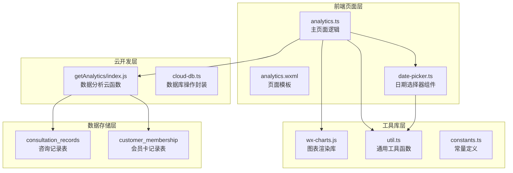

**图表来源**
- [analytics.ts](file://miniprogram/pages/analytics/analytics.ts#L1-L50)
- [index.js](file://cloudfunctions/getAnalytics/index.js#L1-L50)
- [date-picker.ts](file://miniprogram/components/date-picker/date-picker.ts#L1-L50)

**章节来源**
- [analytics.ts](file://miniprogram/pages/analytics/analytics.ts#L1-L50)
- [app.json](file://miniprogram/app.json#L15-L16)

## 核心组件
销售统计分析功能由多个核心组件协同工作，每个组件承担特定的职责：

### 主要数据模型
系统定义了完整的数据结构来支持销售分析：

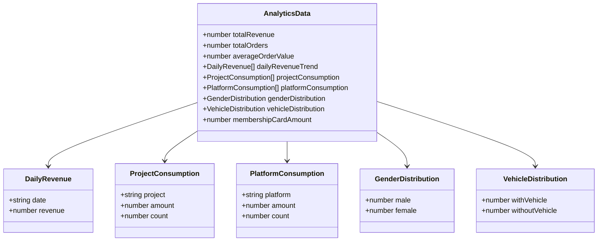

**图表来源**
- [analytics.ts](file://miniprogram/pages/analytics/analytics.ts#L6-L16)

### 时间范围类型定义
系统支持多种预设时间范围和自定义时间范围选择：

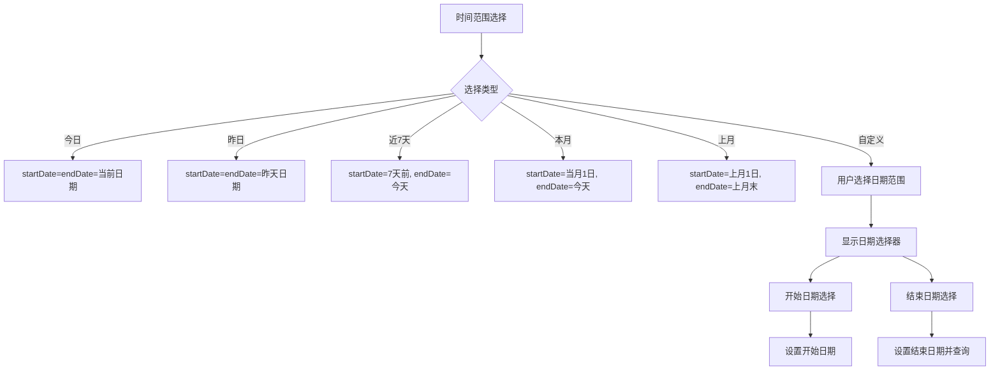

**图表来源**
- [analytics.ts](file://miniprogram/pages/analytics/analytics.ts#L80-L143)

**章节来源**
- [analytics.ts](file://miniprogram/pages/analytics/analytics.ts#L4-L16)
- [analytics.ts](file://miniprogram/pages/analytics/analytics.ts#L80-L143)

## 架构概览
销售统计分析采用分层架构设计，确保数据处理的高效性和可维护性：

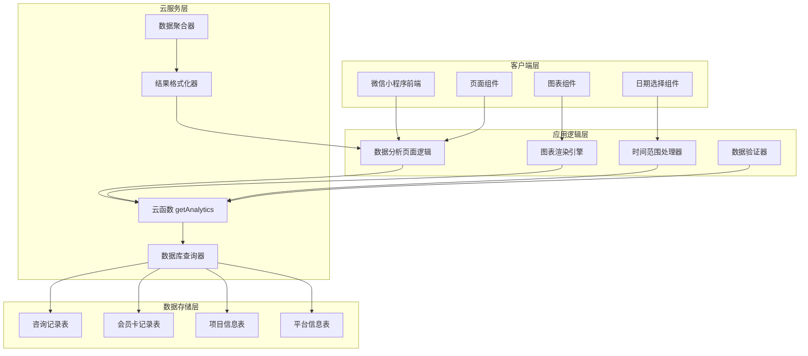

**图表来源**
- [analytics.ts](file://miniprogram/pages/analytics/analytics.ts#L1-L50)
- [index.js](file://cloudfunctions/getAnalytics/index.js#L36-L51)

## 详细组件分析

### 数据分析页面核心逻辑
数据分析页面是整个功能的核心控制器，负责协调各个组件的工作：

#### 页面生命周期管理
页面初始化时自动加载分析数据，并提供手动刷新功能：

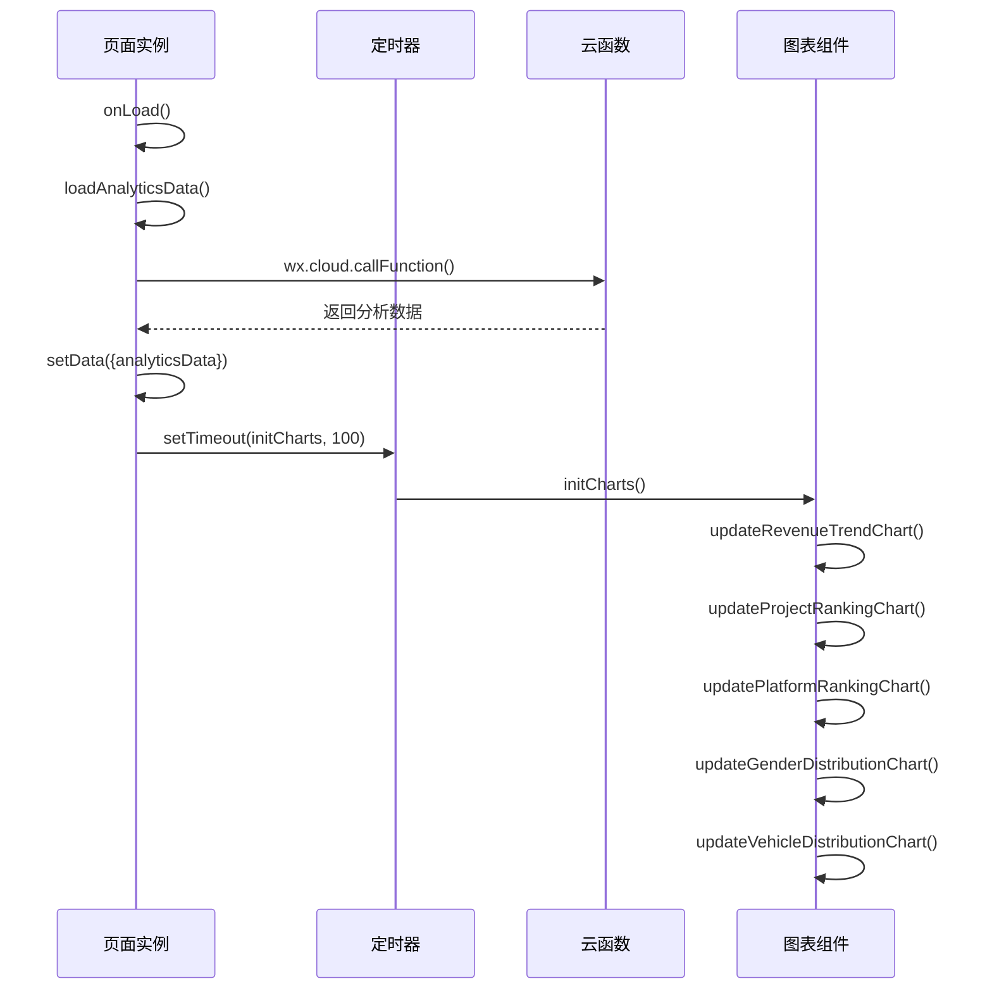

**图表来源**
- [analytics.ts](file://miniprogram/pages/analytics/analytics.ts#L39-L78)
- [analytics.ts](file://miniprogram/pages/analytics/analytics.ts#L194-L204)

#### 关键指标计算逻辑
系统实现了多种关键业务指标的计算，确保数据准确性：

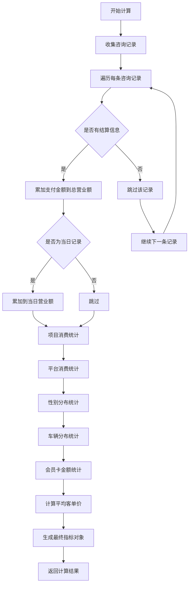

**图表来源**
- [index.js](file://cloudfunctions/getAnalytics/index.js#L86-L132)

**章节来源**
- [analytics.ts](file://miniprogram/pages/analytics/analytics.ts#L39-L78)
- [index.js](file://cloudfunctions/getAnalytics/index.js#L53-L171)

### 营业额趋势分析实现
系统提供了强大的营业额趋势分析功能，支持多种时间粒度的数据展示：

#### 日营业额数据获取机制
系统通过云函数精确计算每日营业额数据：

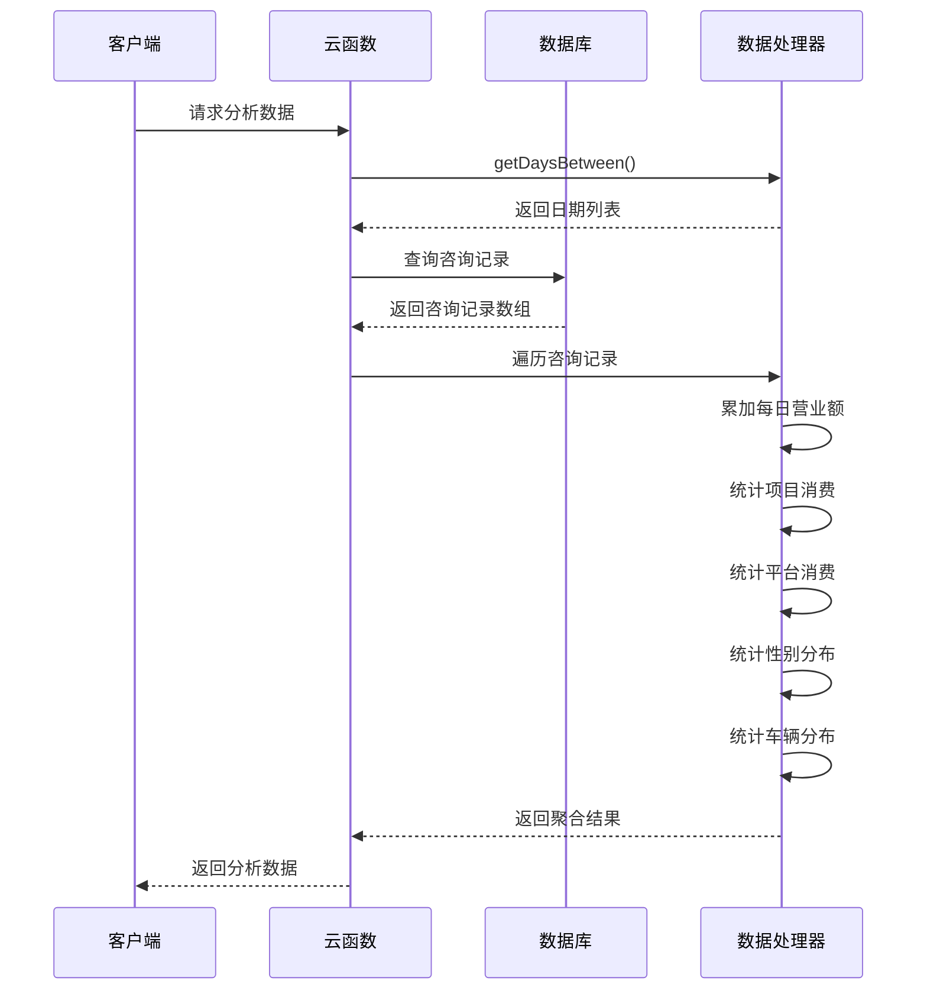

**图表来源**
- [index.js](file://cloudfunctions/getAnalytics/index.js#L53-L171)

#### 日期格式化和趋势图绘制
前端负责将服务器返回的数据转换为图表友好的格式：

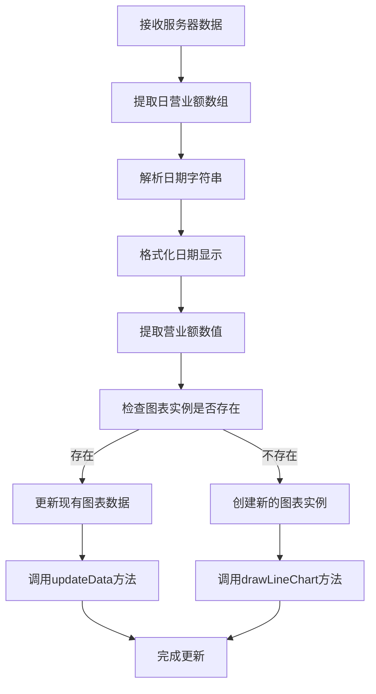

**图表来源**
- [analytics.ts](file://miniprogram/pages/analytics/analytics.ts#L206-L225)

**章节来源**
- [index.js](file://cloudfunctions/getAnalytics/index.js#L73-L84)
- [analytics.ts](file://miniprogram/pages/analytics/analytics.ts#L206-L225)

### 时间范围选择器实现
系统提供了灵活的时间范围选择机制，支持多种预设选项和自定义范围：

#### 预设时间段计算方法
系统内置了多种常用时间范围的计算逻辑：

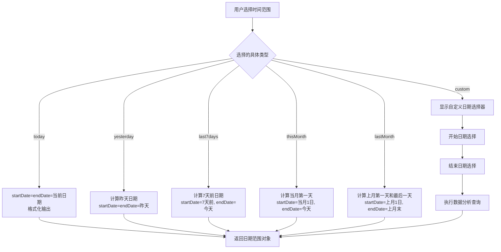

**图表来源**
- [analytics.ts](file://miniprogram/pages/analytics/analytics.ts#L80-L143)

#### 自定义时间范围交互设计
自定义时间范围提供了直观的用户交互体验：

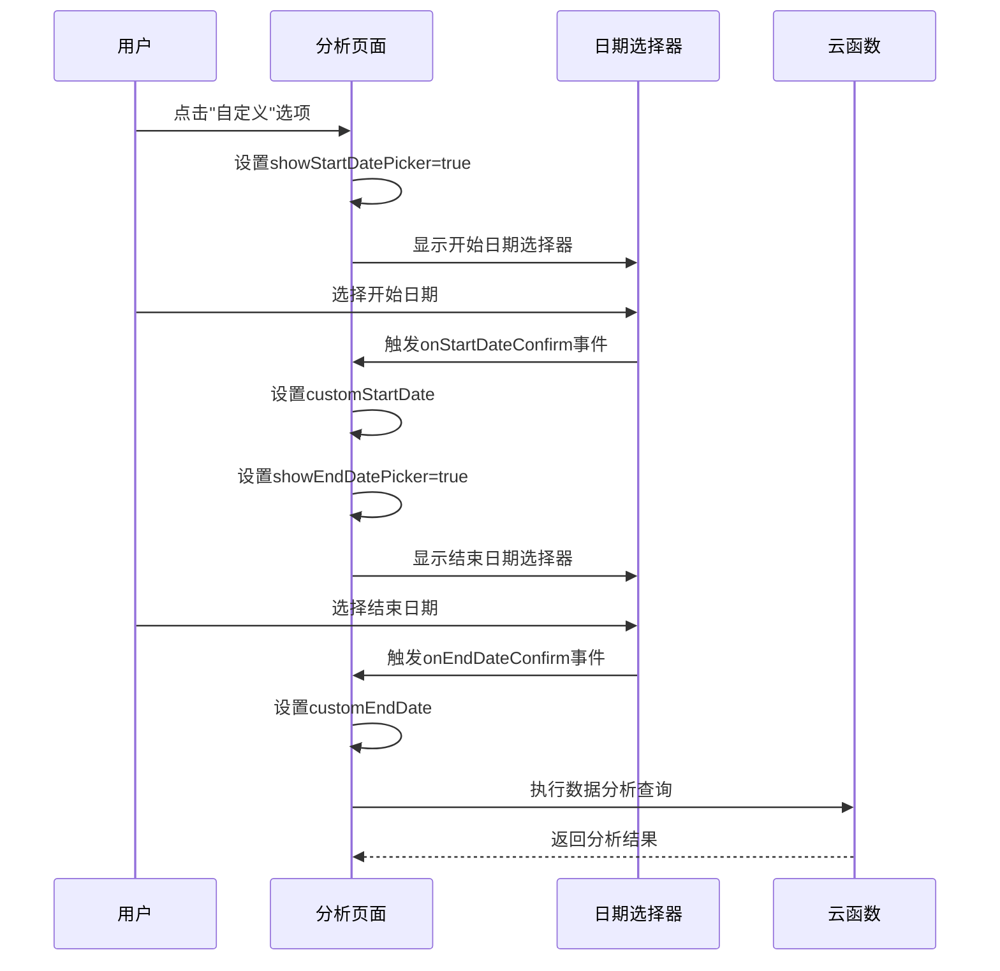

**图表来源**
- [analytics.ts](file://miniprogram/pages/analytics/analytics.ts#L145-L188)
- [date-picker.ts](file://miniprogram/components/date-picker/date-picker.ts#L47-L98)

**章节来源**
- [analytics.ts](file://miniprogram/pages/analytics/analytics.ts#L145-L188)
- [date-picker.ts](file://miniprogram/components/date-picker/date-picker.ts#L47-L98)

### 图表渲染系统
系统集成了强大的图表渲染能力，支持多种图表类型的动态更新：

#### 图表类型和配置
系统支持线图、柱状图和饼图三种主要图表类型：

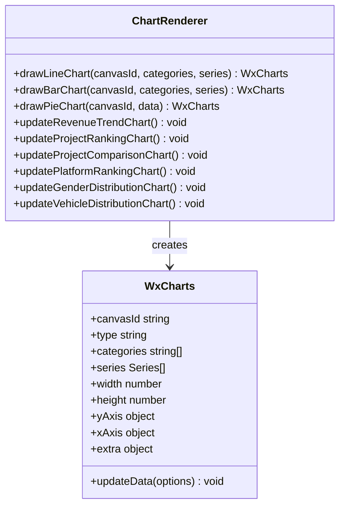

**图表来源**
- [analytics.ts](file://miniprogram/pages/analytics/analytics.ts#L329-L406)

#### 图表配置参数
不同图表类型有不同的配置参数：

| 图表类型 | 配置特点 | 主要用途 |
|---------|---------|---------|
| 线图 | 曲线样式, 连续数据展示 | 营业额趋势分析 |
| 柱状图 | 分类数据对比 | 项目消费排行、平台消费对比 |
| 饼图 | 百分比展示 | 性别分布、车辆分布 |

**章节来源**
- [analytics.ts](file://miniprogram/pages/analytics/analytics.ts#L329-L406)
- [wx-charts.js](file://miniprogram/utils/wx-charts.js#L1-L50)

## 依赖关系分析
销售统计分析功能涉及多个层面的依赖关系，形成了清晰的层次化架构：

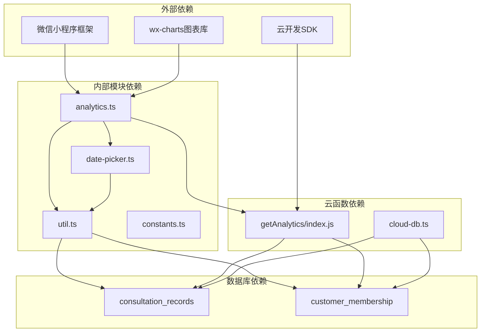

**图表来源**
- [analytics.ts](file://miniprogram/pages/analytics/analytics.ts#L1-L5)
- [index.js](file://cloudfunctions/getAnalytics/index.js#L1-L10)

### 数据流依赖
系统遵循清晰的数据流向设计：

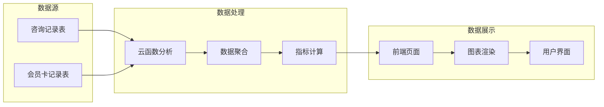

**图表来源**
- [index.js](file://cloudfunctions/getAnalytics/index.js#L53-L171)
- [analytics.ts](file://miniprogram/pages/analytics/analytics.ts#L47-L78)

**章节来源**
- [analytics.ts](file://miniprogram/pages/analytics/analytics.ts#L1-L5)
- [index.js](file://cloudfunctions/getAnalytics/index.js#L1-L10)

## 性能考虑
销售统计分析功能在设计时充分考虑了性能优化，确保在大数据量下的流畅运行：

### 数据查询优化
系统采用了多种查询优化策略：

1. **索引利用**: 咨询记录按日期字段建立索引，支持快速范围查询
2. **批量查询**: 同时查询多个日期范围内的数据，减少网络往返
3. **条件过滤**: 使用`isVoided`字段过滤无效记录，减少数据处理量

### 内存管理策略
前端实现了智能的内存管理机制：

```mermaid
flowchart TD
A[开始加载数据] --> B[设置loading状态]
B --> C[调用云函数查询]
C --> D{查询成功?}
D --> |是| E[接收分析数据]
D --> |否| F[显示错误提示]
E --> G[设置analyticsData]
G --> H[延迟初始化图表]
H --> I[setTimeout(initCharts, 100)]
I --> J[释放loading状态]
F --> J
J --> K[等待用户操作]
```

**图表来源**
- [analytics.ts](file://miniprogram/pages/analytics/analytics.ts#L47-L78)

### 缓存策略
系统实现了多层次的缓存机制：

1. **本地缓存**: 将最近查询的结果缓存在页面数据中
2. **图表缓存**: 图表实例复用，避免重复创建
3. **配置缓存**: 常用配置参数缓存在内存中

### 性能监控
建议实施的性能监控措施：

- 监控云函数执行时间
- 监控图表渲染性能
- 监控网络请求响应时间
- 监控内存使用情况

## 故障排除指南
针对销售统计分析功能可能出现的问题，提供详细的故障排除方案：

### 常见问题及解决方案

#### 数据查询失败
**问题症状**: 页面显示"加载数据失败"提示

**可能原因**:
1. 网络连接异常
2. 云函数执行超时
3. 数据库查询权限不足

**解决步骤**:
1. 检查网络连接状态
2. 查看云函数日志
3. 验证数据库访问权限
4. 重新尝试数据查询

#### 图表显示异常
**问题症状**: 图表无法正常显示或显示不完整

**可能原因**:
1. 图表容器尺寸异常
2. 数据格式不符合要求
3. 图表实例创建失败

**解决步骤**:
1. 检查图表容器CSS样式
2. 验证数据格式正确性
3. 重新初始化图表实例
4. 清理浏览器缓存

#### 时间范围选择问题
**问题症状**: 自定义时间范围选择无效

**可能原因**:
1. 日期格式不正确
2. 开始日期晚于结束日期
3. 日期超出有效范围

**解决步骤**:
1. 验证日期格式为YYYY-MM-DD
2. 确认开始日期不超过结束日期
3. 检查日期是否在允许范围内
4. 重新选择日期范围

**章节来源**
- [analytics.ts](file://miniprogram/pages/analytics/analytics.ts#L73-L75)
- [analytics.ts](file://miniprogram/pages/analytics/analytics.ts#L173-L188)

## 结论
销售统计分析功能通过精心设计的架构和高效的实现方案，为ConsultationPrinter小程序提供了强大的商业分析能力。系统具备以下优势：

### 技术优势
1. **模块化设计**: 清晰的分层架构便于维护和扩展
2. **性能优化**: 多层次的性能优化策略确保流畅运行
3. **用户体验**: 直观的界面设计和灵活的时间选择机制
4. **数据准确性**: 完善的数据验证和错误处理机制

### 功能完整性
系统实现了完整的销售分析功能，包括：
- 多维度数据统计
- 灵活的时间范围选择
- 丰富的图表展示
- 实时数据更新

### 可扩展性
系统设计具有良好的可扩展性，可以轻松添加新的分析维度和图表类型。通过模块化的架构设计，未来可以方便地集成更多业务场景和分析需求。

建议在未来版本中进一步增强的功能包括：实时数据推送、更精细的权限控制、导出功能等，以满足不断增长的业务需求。