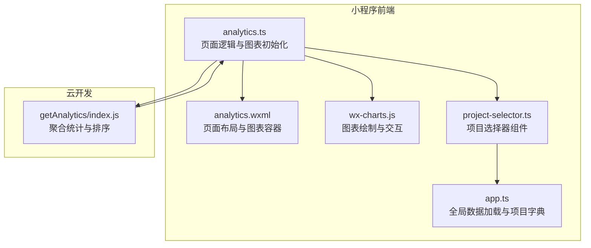
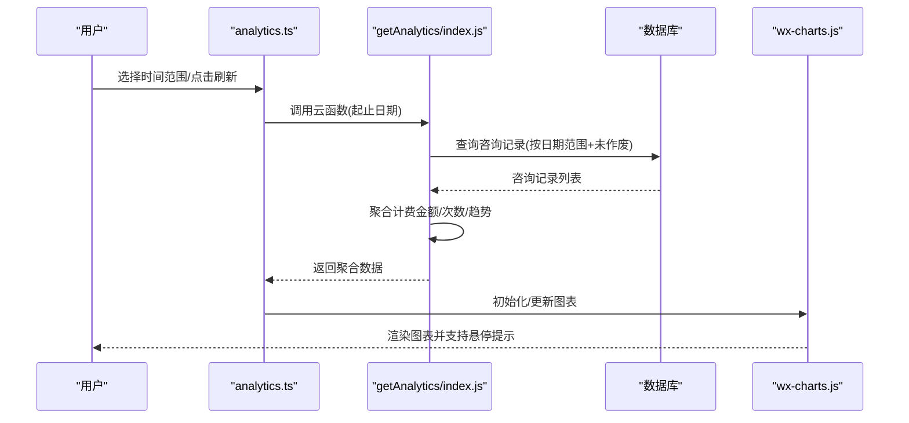
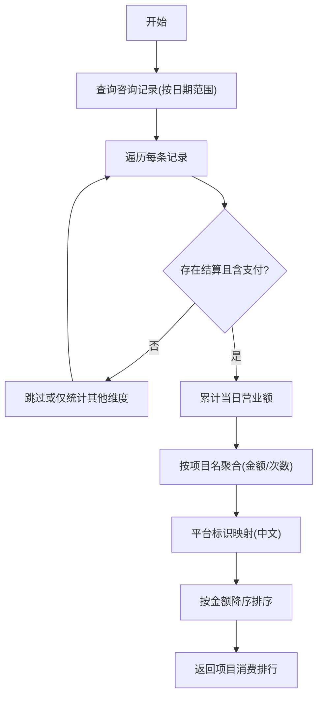
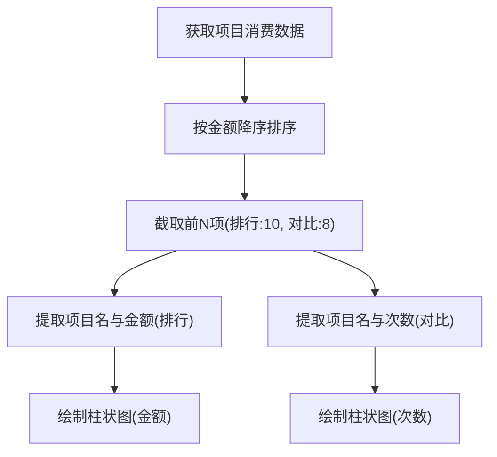
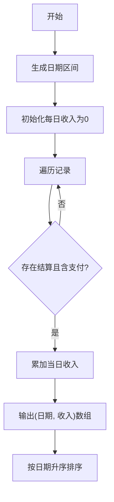
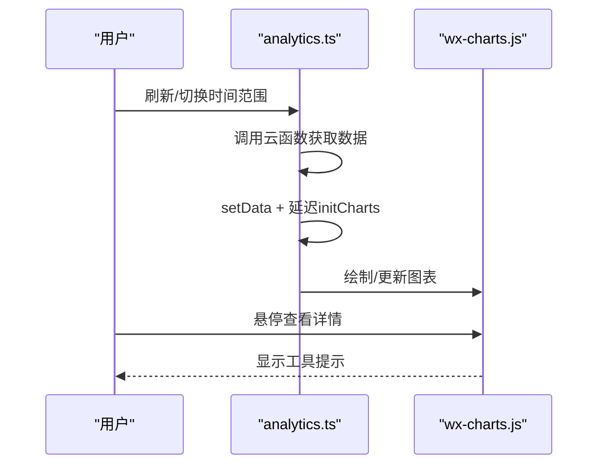
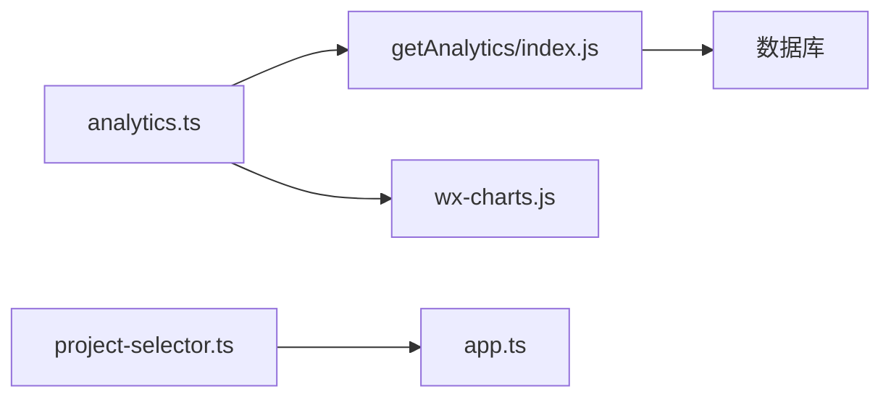

# 项目消费分析

<cite>
**本文引用的文件列表**
- [analytics.ts](file://miniprogram/pages/analytics/analytics.ts)
- [analytics.wxml](file://miniprogram/pages/analytics/analytics.wxml)
- [index.js](file://cloudfunctions/getAnalytics/index.js)
- [wx-charts.js](file://miniprogram/utils/wx-charts.js)
- [project-selector.ts](file://miniprogram/components/project-selector/project-selector.ts)
- [app.ts](file://miniprogram/app.ts)
</cite>

## 目录
1. [简介](#简介)
2. [项目结构](#项目结构)
3. [核心组件](#核心组件)
4. [架构概览](#架构概览)
5. [详细组件分析](#详细组件分析)
6. [依赖关系分析](#依赖关系分析)
7. [性能考量](#性能考量)
8. [故障排查指南](#故障排查指南)
9. [结论](#结论)
10. [附录](#附录)

## 简介
本功能文档聚焦于“项目消费分析”能力，围绕按摩类服务的消费排行统计与可视化展开，涵盖以下要点：
- 项目名称映射：将平台原始标识映射为中文名称，确保报表可读性
- 消费金额与次数聚合：按项目维度统计消费金额与消费次数，并进行降序排序
- 前N个热门项目筛选与数据截断：在排行榜与对比图中对热门项目进行截断，避免信息过载
- 项目消费趋势分析：基于日维度的时间序列趋势展示
- 图表交互：悬停提示、点击筛选（通过项目选择器）、动态更新机制
- 数据准确性与清洗：空值处理、异常值识别与过滤策略
- 实际业务场景与扩展建议：如何结合现有组件与云函数扩展更多维度

## 项目结构
项目消费分析由前端页面、云函数与第三方图表库三部分组成：
- 前端页面负责时间范围选择、数据加载、图表渲染与交互
- 云函数负责从数据库聚合消费数据并返回标准化结果
- 图表库提供线/柱/饼等图表绘制与交互能力

**图表来源**
- [analytics.ts](file://miniprogram/pages/analytics/analytics.ts#L1-L408)
- [analytics.wxml](file://miniprogram/pages/analytics/analytics.wxml#L1-L154)
- [wx-charts.js](file://miniprogram/utils/wx-charts.js#L1-L800)
- [project-selector.ts](file://miniprogram/components/project-selector/project-selector.ts#L1-L38)
- [app.ts](file://miniprogram/app.ts#L1-L191)
- [index.js](file://cloudfunctions/getAnalytics/index.js#L1-L172)

**章节来源**
- [analytics.ts](file://miniprogram/pages/analytics/analytics.ts#L1-L408)
- [analytics.wxml](file://miniprogram/pages/analytics/analytics.wxml#L1-L154)
- [index.js](file://cloudfunctions/getAnalytics/index.js#L1-L172)

## 核心组件
- 页面控制器：负责时间范围选择、调用云函数、接收数据并初始化图表
- 云函数：按日期范围查询咨询记录，聚合项目消费金额与次数，生成趋势与排行
- 图表库：封装线/柱/饼图表绘制、坐标轴、工具提示与滚动交互
- 项目选择器：提供项目列表与点击事件，用于后续扩展点击筛选
- 全局数据：项目字典加载与缓存，供项目名称映射与筛选使用

**章节来源**
- [analytics.ts](file://miniprogram/pages/analytics/analytics.ts#L1-L408)
- [index.js](file://cloudfunctions/getAnalytics/index.js#L1-L172)
- [wx-charts.js](file://miniprogram/utils/wx-charts.js#L1-L800)
- [project-selector.ts](file://miniprogram/components/project-selector/project-selector.ts#L1-L38)
- [app.ts](file://miniprogram/app.ts#L1-L191)

## 架构概览
整体流程如下：
- 用户在页面选择时间范围（今日/昨日/近7天/本月/上月/自定义）
- 页面调用云函数，传入起止日期
- 云函数查询咨询记录集合，按日期范围过滤并聚合项目维度的消费金额与次数
- 返回标准化数据给前端，前端初始化并渲染多类图表
- 图表支持悬停提示、滚动查看长列表等交互

**图表来源**
- [analytics.ts](file://miniprogram/pages/analytics/analytics.ts#L47-L78)
- [index.js](file://cloudfunctions/getAnalytics/index.js#L36-L51)
- [index.js](file://cloudfunctions/getAnalytics/index.js#L53-L171)
- [wx-charts.js](file://miniprogram/utils/wx-charts.js#L1884-L2059)

## 详细组件分析

### 1) 项目消费排行统计实现
- 项目名称映射：云函数对平台标识进行中文映射，如“meituan”映射为“美团”，“membership”映射为“会员卡”
- 消费金额与次数聚合：遍历咨询记录，按项目名累计支付金额与消费次数
- 排序算法：按消费金额降序排序，形成排行榜

**图表来源**
- [index.js](file://cloudfunctions/getAnalytics/index.js#L53-L171)

**章节来源**
- [index.js](file://cloudfunctions/getAnalytics/index.js#L96-L128)
- [index.js](file://cloudfunctions/getAnalytics/index.js#L140-L158)

### 2) 项目对比图表设计原理
- 前N个热门项目筛选：排行榜与对比图分别取前10项与前8项，避免过多标签导致图表拥挤
- 数据截断处理：通过数组切片实现，保证图表可读性与性能
- 对比维度：消费金额（排行）与消费次数（对比），分别使用柱状图展示

**图表来源**
- [analytics.ts](file://miniprogram/pages/analytics/analytics.ts#L227-L261)

**章节来源**
- [analytics.ts](file://miniprogram/pages/analytics/analytics.ts#L227-L261)

### 3) 项目消费趋势分析数据结构设计
- 日维度趋势：以日期为键，累计金额为值，最终转换为有序数组并按日期升序排列
- 数据结构：包含日期与收入两项，便于折线图绘制与时间轴展示

**图表来源**
- [index.js](file://cloudfunctions/getAnalytics/index.js#L73-L84)
- [index.js](file://cloudfunctions/getAnalytics/index.js#L136-L138)

**章节来源**
- [index.js](file://cloudfunctions/getAnalytics/index.js#L73-L84)
- [index.js](file://cloudfunctions/getAnalytics/index.js#L136-L138)

### 4) 图表交互功能
- 悬停显示：图表库内置工具提示，支持悬停时显示系列值与分类标签
- 动态更新：页面在收到数据后延迟初始化图表，避免DOM未就绪导致的渲染问题
- 点击筛选（扩展）：项目选择器组件已具备点击事件，可作为点击筛选的基础，后续可在页面中监听并过滤图表数据

**图表来源**
- [analytics.ts](file://miniprogram/pages/analytics/analytics.ts#L47-L78)
- [analytics.ts](file://miniprogram/pages/analytics/analytics.ts#L194-L204)
- [wx-charts.js](file://miniprogram/utils/wx-charts.js#L2046-L2059)

**章节来源**
- [analytics.ts](file://miniprogram/pages/analytics/analytics.ts#L194-L204)
- [wx-charts.js](file://miniprogram/utils/wx-charts.js#L2046-L2059)
- [project-selector.ts](file://miniprogram/components/project-selector/project-selector.ts#L26-L29)

### 5) 数据准确性验证、异常值处理与清洗策略
- 空值与无效数据处理：
  - 项目名缺失时统一归类为“未知项目”，避免空字符串影响聚合
  - 支付金额为空或非数值时，使用默认值0参与累计
- 异常值识别与过滤：
  - 未作废记录过滤：仅统计有效记录，排除作废单据
  - 日期范围严格匹配：按精确日期区间查询，避免跨期污染
- 数据一致性：
  - 金额与次数分别统计，避免重复计数
  - 客观排序：金额降序，日期升序，确保趋势图顺序正确

**章节来源**
- [index.js](file://cloudfunctions/getAnalytics/index.js#L97-L128)
- [index.js](file://cloudfunctions/getAnalytics/index.js#L56-L61)

### 6) 业务场景应用与扩展开发指导
- 业务场景：
  - 管理员监控：通过“项目消费排行”快速定位热门项目，结合“平台消费排行”评估渠道效果
  - 营销策略：结合“项目消费对比”中的次数维度，制定促销活动与套餐组合策略
  - 预算控制：利用“营业额趋势”观察日均收入波动，辅助排班与成本控制
- 扩展建议：
  - 点击筛选：在页面监听项目选择器的change事件，过滤当前图表数据并重新渲染
  - 多维度对比：增加“技师维度”、“房间维度”的消费分析，丰富决策依据
  - 导出与分享：将图表导出为图片或生成报表链接，便于跨部门共享

**章节来源**
- [project-selector.ts](file://miniprogram/components/project-selector/project-selector.ts#L1-L38)
- [app.ts](file://miniprogram/app.ts#L68-L73)

## 依赖关系分析
- 页面依赖云函数：通过云函数调用获取聚合数据
- 图表库依赖：封装了线/柱/饼等图表类型与交互细节
- 项目选择器依赖全局数据：从全局项目字典加载可用项目列表
- 云函数依赖数据库：查询咨询记录与会员卡数据

**图表来源**
- [analytics.ts](file://miniprogram/pages/analytics/analytics.ts#L1-L408)
- [index.js](file://cloudfunctions/getAnalytics/index.js#L1-L172)
- [wx-charts.js](file://miniprogram/utils/wx-charts.js#L1-L800)
- [project-selector.ts](file://miniprogram/components/project-selector/project-selector.ts#L1-L38)
- [app.ts](file://miniprogram/app.ts#L1-L191)

**章节来源**
- [analytics.ts](file://miniprogram/pages/analytics/analytics.ts#L1-L408)
- [index.js](file://cloudfunctions/getAnalytics/index.js#L1-L172)
- [wx-charts.js](file://miniprogram/utils/wx-charts.js#L1-L800)
- [project-selector.ts](file://miniprogram/components/project-selector/project-selector.ts#L1-L38)
- [app.ts](file://miniprogram/app.ts#L1-L191)

## 性能考量
- 数据量控制：排行榜与对比图采用前N项截断，减少渲染压力
- 图表更新策略：延迟初始化与增量更新，避免频繁重绘
- 云函数聚合：在服务端完成聚合与排序，降低前端计算负担
- 图表库优化：内置动画与节流，提升交互体验

[本节为通用性能建议，不直接分析具体文件]

## 故障排查指南
- 数据为空：
  - 检查时间范围是否正确传递到云函数
  - 确认数据库中是否存在对应日期范围内的有效记录
- 图表不显示：
  - 确认DOM已就绪后再初始化图表（页面已通过延时处理）
  - 检查图表容器尺寸与系统窗口宽度适配
- 项目名称异常：
  - 确认项目字典是否加载成功
  - 检查项目选择器组件是否正确触发change事件

**章节来源**
- [analytics.ts](file://miniprogram/pages/analytics/analytics.ts#L47-L78)
- [analytics.ts](file://miniprogram/pages/analytics/analytics.ts#L194-L204)
- [project-selector.ts](file://miniprogram/components/project-selector/project-selector.ts#L14-L24)

## 结论
项目消费分析功能通过“云函数聚合 + 前端图表渲染”的方式，实现了对项目维度消费金额与次数的高效统计与可视化。其设计遵循“前端轻量化、服务端强聚合”的原则，既保证了性能，又提供了良好的交互体验。未来可在此基础上扩展点击筛选、多维度对比与导出能力，进一步提升业务价值。

[本节为总结性内容，不直接分析具体文件]

## 附录
- 关键字段说明：
  - 项目消费排行：项目名、消费金额、消费次数
  - 平台消费排行：平台名（中文映射）、消费金额、消费次数
  - 营业额趋势：日期、日累计收入
- 可视化图表：
  - 折线图：营业额趋势
  - 柱状图：项目消费排行（金额）、项目消费对比（次数）
  - 饼图：性别分布、车辆分布

[本节为概念性汇总，不直接分析具体文件]