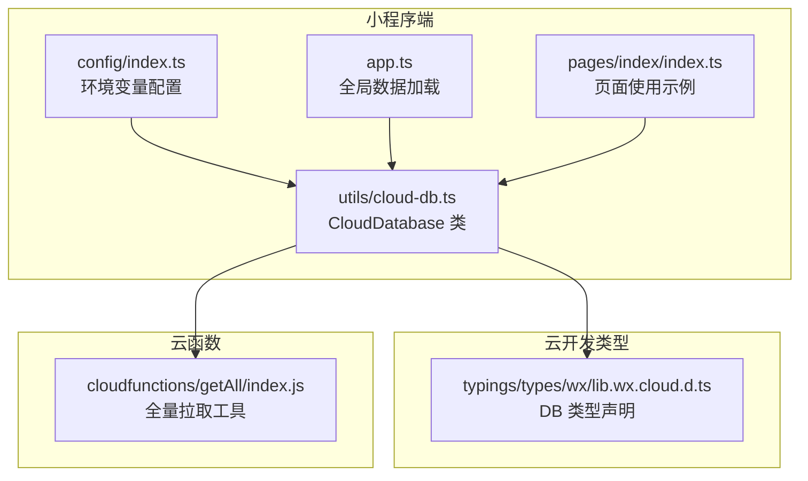
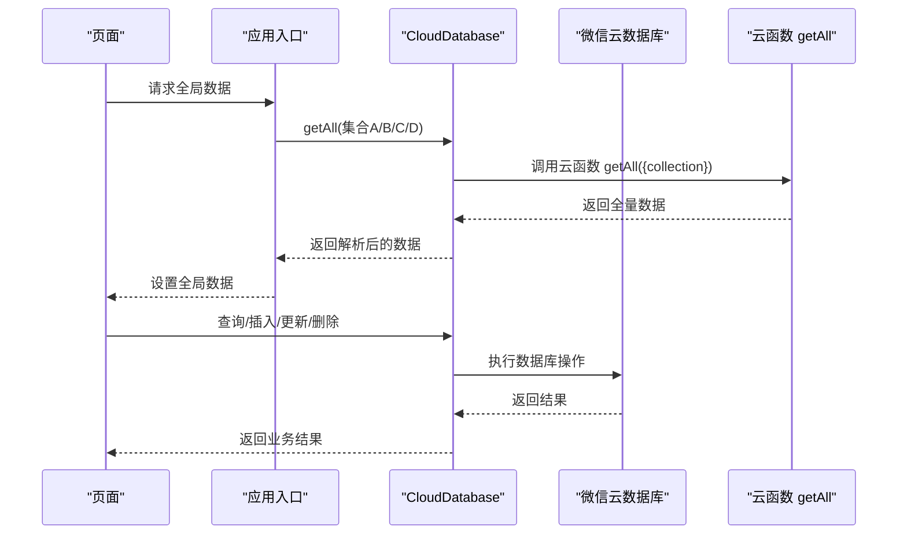
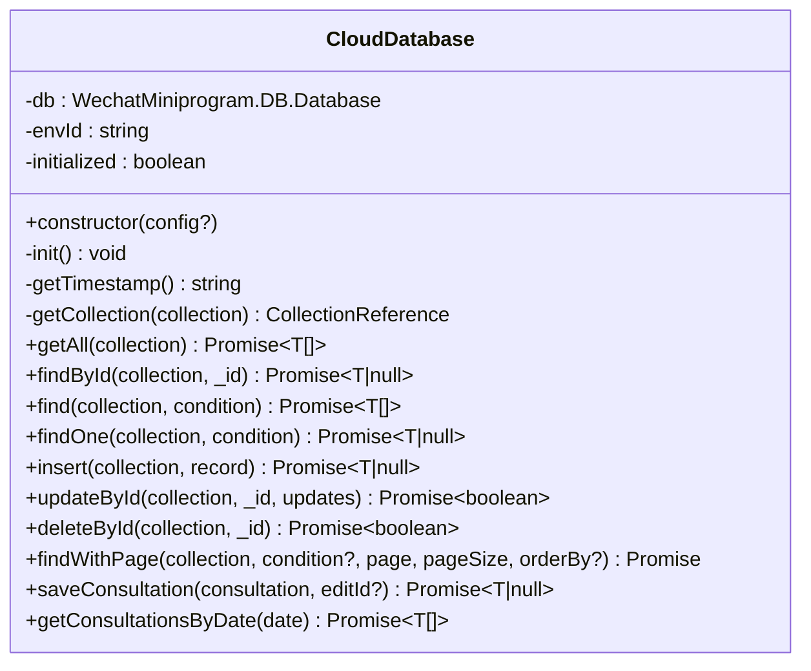
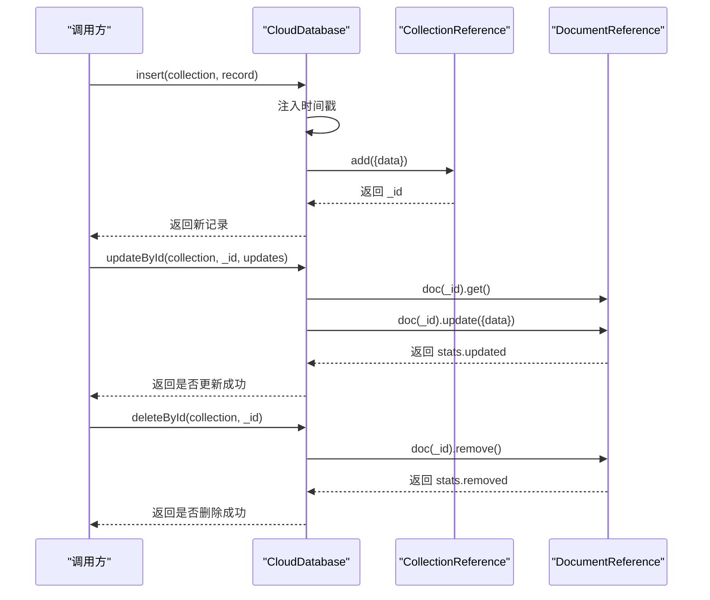
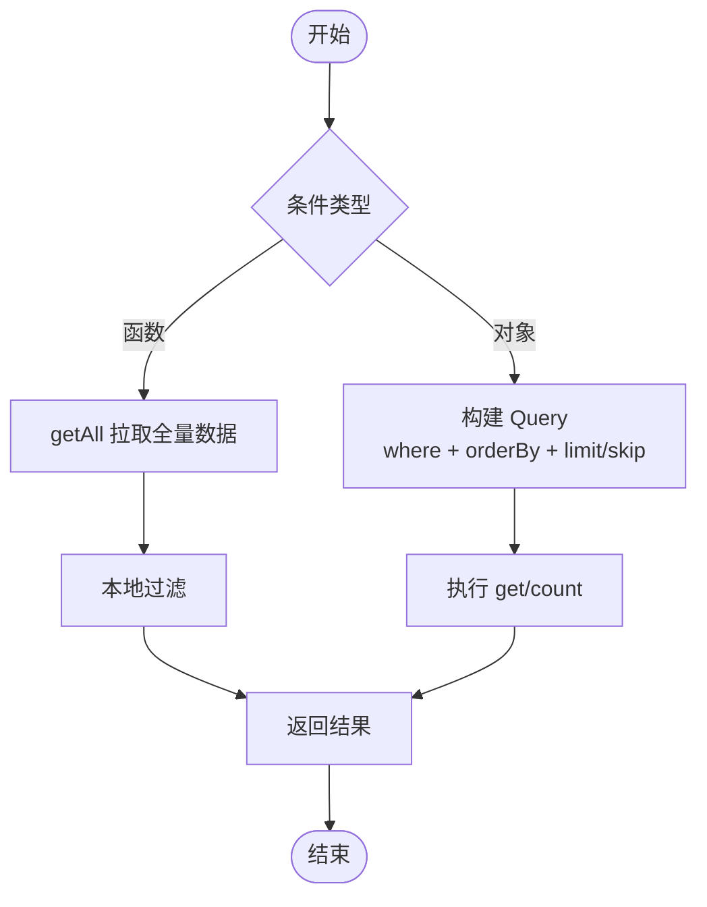
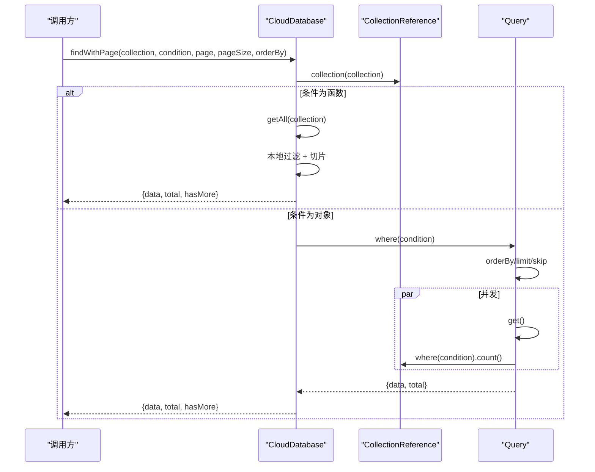
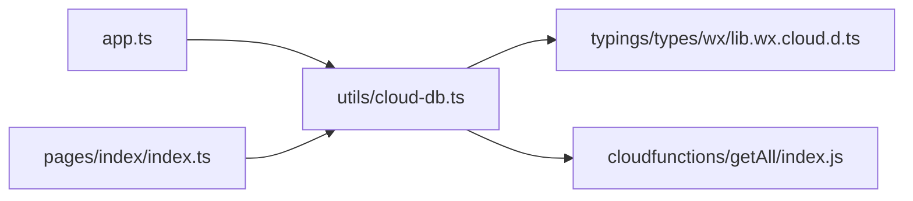

# 云数据库核心

<cite>
**本文档引用的文件**
- [cloud-db.ts](file://miniprogram/utils/cloud-db.ts)
- [lib.wx.cloud.d.ts](file://typings/types/wx/lib.wx.cloud.d.ts)
- [index.js](file://cloudfunctions/getAll/index.js)
- [index.ts](file://miniprogram/config/index.ts)
- [index.ts](file://miniprogram/app.ts)
- [index.ts](file://miniprogram/pages/index/index.ts)
</cite>

## 目录
1. [简介](#简介)
2. [项目结构](#项目结构)
3. [核心组件](#核心组件)
4. [架构总览](#架构总览)
5. [详细组件分析](#详细组件分析)
6. [依赖关系分析](#依赖关系分析)
7. [性能考量](#性能考量)
8. [故障排查指南](#故障排查指南)
9. [结论](#结论)
10. [附录](#附录)

## 简介
本文件面向“云数据库核心”模块，系统性梳理 CloudDatabase 类的设计架构、初始化流程、配置项、连接管理、集合引用获取、CRUD 实现、分页与条件查询策略、错误处理机制，以及数据库配置参数、环境变量与连接池管理要点。文档同时提供使用模式、性能优化建议与最佳实践，帮助开发者在微信小程序与云开发环境中高效、稳定地使用云数据库。

## 项目结构
围绕云数据库的核心代码主要分布在以下位置：
- 小程序端数据库封装：miniprogram/utils/cloud-db.ts
- 微信云开发类型声明：typings/types/wx/lib.wx.cloud.d.ts
- 云函数全量拉取工具：cloudfunctions/getAll/index.js
- 环境变量配置：miniprogram/config/index.ts
- 应用入口与全局数据加载：miniprogram/app.ts
- 页面使用示例：miniprogram/pages/index/index.ts

图表来源
- [cloud-db.ts](file://miniprogram/utils/cloud-db.ts#L1-L321)
- [lib.wx.cloud.d.ts](file://typings/types/wx/lib.wx.cloud.d.ts#L392-L820)
- [index.js](file://cloudfunctions/getAll/index.js#L1-L59)
- [index.ts](file://miniprogram/config/index.ts#L1-L17)
- [index.ts](file://miniprogram/app.ts#L40-L87)
- [index.ts](file://miniprogram/pages/index/index.ts#L1-L200)

章节来源
- [cloud-db.ts](file://miniprogram/utils/cloud-db.ts#L1-L321)
- [lib.wx.cloud.d.ts](file://typings/types/wx/lib.wx.cloud.d.ts#L392-L820)
- [index.js](file://cloudfunctions/getAll/index.js#L1-L59)
- [index.ts](file://miniprogram/config/index.ts#L1-L17)
- [index.ts](file://miniprogram/app.ts#L40-L87)
- [index.ts](file://miniprogram/pages/index/index.ts#L1-L200)

## 核心组件
- CloudDatabase 类：封装数据库初始化、集合引用、CRUD、分页查询、条件查询、日期范围查询等能力；通过云函数 getAll 提供全量数据拉取能力。
- 类型声明：DB 命名空间下的 Database、CollectionReference、DocumentReference、Query、Aggregate 等，定义了云数据库的标准 API 与命令体系。
- 云函数 getAll：提供分页拉取集合数据的能力，避免前端一次性请求过多数据导致超时或内存压力。
- 环境变量配置：集中管理云开发环境 ID，便于切换测试/生产环境。
- 应用入口：在应用启动时并发加载全局基础数据，提升首屏体验。

章节来源
- [cloud-db.ts](file://miniprogram/utils/cloud-db.ts#L12-L321)
- [lib.wx.cloud.d.ts](file://typings/types/wx/lib.wx.cloud.d.ts#L392-L820)
- [index.js](file://cloudfunctions/getAll/index.js#L1-L59)
- [index.ts](file://miniprogram/config/index.ts#L1-L17)
- [index.ts](file://miniprogram/app.ts#L40-L87)

## 架构总览
整体架构由“小程序端封装层 + 云开发类型声明 + 云函数工具层 + 环境配置 + 应用入口”构成。小程序端通过 CloudDatabase 统一访问云数据库，必要时调用云函数 getAll 进行全量数据拉取；类型声明确保 API 的一致性与可维护性；环境配置集中化管理云环境 ID；应用入口负责全局数据预加载。

图表来源
- [index.ts](file://miniprogram/app.ts#L40-L87)
- [cloud-db.ts](file://miniprogram/utils/cloud-db.ts#L69-L88)
- [index.js](file://cloudfunctions/getAll/index.js#L9-L58)

## 详细组件分析

### CloudDatabase 类设计与初始化
- 设计目标：统一数据库访问入口，屏蔽云开发底层差异，提供易用的 CRUD、分页、条件查询与日期范围查询能力。
- 初始化流程：
  - 构造函数接收可选配置对象，支持 envId 与 traceUser。
  - init 方法内判断 wx.cloud 是否可用，若可用则初始化云开发环境（仅一次），随后获取数据库实例。
  - 私有属性 db、envId、initialized 控制初始化状态与环境 ID。
- 错误处理：初始化与各操作均采用 try/catch 包裹，异常时返回空结果或 false，保证调用方不会因异常中断。

图表来源
- [cloud-db.ts](file://miniprogram/utils/cloud-db.ts#L12-L299)

章节来源
- [cloud-db.ts](file://miniprogram/utils/cloud-db.ts#L12-L47)

### 数据库连接管理与集合引用
- 连接管理：
  - 通过 wx.cloud.init 初始化云开发环境，支持 env 参数与 traceUser。
  - 通过 wx.cloud.database 获取数据库实例，后续所有集合操作基于此实例。
- 集合引用：
  - getCollection(collection) 返回 CollectionReference，用于后续查询、新增、聚合等操作。
  - 若 db 未初始化，直接抛出错误，防止后续操作失败。

章节来源
- [cloud-db.ts](file://miniprogram/utils/cloud-db.ts#L27-L47)
- [cloud-db.ts](file://miniprogram/utils/cloud-db.ts#L59-L64)

### CRUD 实现原理
- 插入（insert）：
  - 自动注入 createdAt、updatedAt 时间戳。
  - 调用 CollectionReference.add，成功后返回包含 _id 的新记录。
- 查询（find/findOne）：
  - 支持两种条件形式：对象条件与函数过滤器。
  - 对象条件：构建 Query 并执行 get；函数过滤器：先通过 getAll 拉取全量数据，再在本地过滤。
  - findOne 为 find 的便捷封装，取第一条结果。
- 更新（updateById）：
  - 先 get 校验文档存在，再 update，最后根据 stats.updated 判断是否更新成功。
- 删除（deleteById）：
  - 直接调用 DocumentReference.remove，返回布尔结果。
- 单条记录保存（saveConsultation）：
  - 若提供 editId，则先校验存在性，再更新；否则走插入流程。

图表来源
- [cloud-db.ts](file://miniprogram/utils/cloud-db.ts#L136-L203)

章节来源
- [cloud-db.ts](file://miniprogram/utils/cloud-db.ts#L136-L203)

### 条件查询与复合查询
- 条件查询：
  - 使用 Query.where 构建查询条件，支持链式调用 orderBy、limit、skip、field 等。
  - 支持函数式过滤器：当 condition 为函数时，先 getAll 再在本地过滤，适合复杂逻辑但不适用于大数据集。
- 复合查询：
  - 通过 DatabaseCommand 的 and/or/nor/not 组合多条件。
  - 支持比较、数组、地理、存在性等查询命令。
- 日期范围查询：
  - 使用 db.RegExp 构造正则匹配日期前缀，实现按日筛选。

图表来源
- [cloud-db.ts](file://miniprogram/utils/cloud-db.ts#L108-L123)
- [cloud-db.ts](file://miniprogram/utils/cloud-db.ts#L283-L298)
- [lib.wx.cloud.d.ts](file://typings/types/wx/lib.wx.cloud.d.ts#L521-L539)
- [lib.wx.cloud.d.ts](file://typings/types/wx/lib.wx.cloud.d.ts#L541-L772)

章节来源
- [cloud-db.ts](file://miniprogram/utils/cloud-db.ts#L108-L123)
- [cloud-db.ts](file://miniprogram/utils/cloud-db.ts#L283-L298)
- [lib.wx.cloud.d.ts](file://typings/types/wx/lib.wx.cloud.d.ts#L521-L539)
- [lib.wx.cloud.d.ts](file://typings/types/wx/lib.wx.cloud.d.ts#L541-L772)

### 分页查询实现策略
- 分页策略：
  - 计算 skip = (page - 1) * pageSize，配合 limit 实现分页。
  - 同时并发执行查询与 count，以获得 total 与 hasMore。
  - 若条件为函数过滤器，则先 getAll 再在内存中切片，计算 total 与 hasMore。
- 性能考虑：
  - 对于大集合，优先使用对象条件 + 服务器端分页，避免本地过滤。
  - 合理设置 pageSize，避免单页过大导致网络与渲染压力。

图表来源
- [cloud-db.ts](file://miniprogram/utils/cloud-db.ts#L209-L255)

章节来源
- [cloud-db.ts](file://miniprogram/utils/cloud-db.ts#L209-L255)

### 日期范围查询与业务场景
- getConsultationsByDate：
  - 使用 db.RegExp 对 createdAt 字段进行前缀匹配，按创建时间升序排列。
  - 适用于按日统计、报表生成等场景。

章节来源
- [cloud-db.ts](file://miniprogram/utils/cloud-db.ts#L283-L298)

### 错误处理机制
- 初始化与集合引用：
  - 初始化失败或 db 未初始化时，抛出明确错误，阻止后续操作。
- 查询与写入：
  - try/catch 包裹所有异步操作，捕获异常后返回空结果或 false。
  - 对“document not found”等特定错误进行分支处理，避免泛化异常影响用户体验。
- 云函数 getAll：
  - 对缺失集合名、数据库异常等情况返回标准化错误码与消息，便于前端统一处理。

章节来源
- [cloud-db.ts](file://miniprogram/utils/cloud-db.ts#L60-L64)
- [cloud-db.ts](file://miniprogram/utils/cloud-db.ts#L93-L103)
- [cloud-db.ts](file://miniprogram/utils/cloud-db.ts#L170-L188)
- [cloud-db.ts](file://miniprogram/utils/cloud-db.ts#L193-L203)
- [index.js](file://cloudfunctions/getAll/index.js#L12-L17)
- [index.js](file://cloudfunctions/getAll/index.js#L52-L57)

### 数据库配置参数与环境变量
- CloudDbConfig：
  - envId：指定云开发环境 ID。
  - traceUser：是否开启用户追踪（默认启用）。
- 环境变量配置：
  - AppConfig.cloudEnvId 提供默认环境 ID，可通过 setCloudEnvId 动态修改。
- 使用方式：
  - 在构造 CloudDatabase 时传入 envId，或在 AppConfig 中集中管理。
  - 应用启动时通过 app.getGlobalData 并发加载全局数据，减少首屏等待。

章节来源
- [cloud-db.ts](file://miniprogram/utils/cloud-db.ts#L4-L7)
- [index.ts](file://miniprogram/config/index.ts#L1-L17)
- [index.ts](file://miniprogram/app.ts#L40-L87)

### 连接池管理
- 云开发 SDK 默认管理连接池与重连策略，开发者无需手动配置。
- 建议：
  - 避免在同一页面频繁创建大量数据库实例。
  - 合理复用 CloudDatabase 单例，减少重复初始化开销。
  - 对高频查询使用本地缓存与分页策略，降低数据库压力。

章节来源
- [cloud-db.ts](file://miniprogram/utils/cloud-db.ts#L17-L22)
- [cloud-db.ts](file://miniprogram/utils/cloud-db.ts#L33-L39)

### 使用模式与最佳实践
- 全量数据加载：
  - 使用 getAll 云函数分批拉取，避免前端一次性请求过多数据。
  - 在应用启动时并发加载常用基础数据，提升首屏体验。
- 条件查询：
  - 优先使用对象条件 + 服务器端过滤，避免本地过滤。
  - 对复杂条件使用 and/or 组合，结合索引字段优化查询。
- 分页与排序：
  - 明确 orderBy 字段与方向，避免无序分页。
  - 合理设置 pageSize，避免单页过大。
- 写入与更新：
  - 写入时自动注入时间戳，保持数据一致性。
  - 更新前先 get 校验文档存在，避免无效更新。
- 错误处理：
  - 统一捕获异常并返回空结果或 false，避免崩溃。
  - 对“document not found”等语义化错误进行分支处理。

章节来源
- [index.js](file://cloudfunctions/getAll/index.js#L25-L44)
- [index.ts](file://miniprogram/app.ts#L40-L87)
- [cloud-db.ts](file://miniprogram/utils/cloud-db.ts#L108-L123)
- [cloud-db.ts](file://miniprogram/utils/cloud-db.ts#L209-L255)
- [cloud-db.ts](file://miniprogram/utils/cloud-db.ts#L136-L203)

## 依赖关系分析
- CloudDatabase 依赖微信云开发类型声明，确保 API 与命令体系一致。
- getAll 云函数依赖 wx-server-sdk，负责服务端数据库访问与分页拉取。
- 应用入口依赖 CloudDatabase 进行全局数据加载。
- 页面通过 CloudDatabase 进行业务数据读写。

图表来源
- [cloud-db.ts](file://miniprogram/utils/cloud-db.ts#L1-L321)
- [lib.wx.cloud.d.ts](file://typings/types/wx/lib.wx.cloud.d.ts#L392-L820)
- [index.js](file://cloudfunctions/getAll/index.js#L1-L59)
- [index.ts](file://miniprogram/app.ts#L40-L87)
- [index.ts](file://miniprogram/pages/index/index.ts#L1-L200)

章节来源
- [cloud-db.ts](file://miniprogram/utils/cloud-db.ts#L1-L321)
- [lib.wx.cloud.d.ts](file://typings/types/wx/lib.wx.cloud.d.ts#L392-L820)
- [index.js](file://cloudfunctions/getAll/index.js#L1-L59)
- [index.ts](file://miniprogram/app.ts#L40-L87)
- [index.ts](file://miniprogram/pages/index/index.ts#L1-L200)

## 性能考量
- 查询优化：
  - 优先使用对象条件 + 服务器端过滤，避免本地过滤。
  - 对高频查询字段建立索引，提升查询效率。
- 分页策略：
  - 合理设置 pageSize，避免单页过大。
  - 使用 skip/limit 实现分页，避免一次性拉取全量数据。
- 写入优化：
  - 批量写入时尽量合并更新，减少网络往返。
  - 写入前进行必要校验，避免无效写入。
- 缓存策略：
  - 对静态或低频变更的数据进行本地缓存，减少重复请求。
- 云函数配合：
  - 使用 getAll 云函数进行全量拉取，避免前端压力。

[本节为通用性能建议，不直接分析具体文件]

## 故障排查指南
- 初始化失败：
  - 检查 wx.cloud 是否可用，确认 envId 配置正确。
  - 确认仅初始化一次，避免重复初始化。
- 查询无结果：
  - 确认集合名称与字段名拼写正确。
  - 对函数过滤器场景，确认 getAll 是否返回数据。
- 更新失败：
  - 检查文档是否存在，避免“document not found”。
  - 确认更新字段与类型符合要求。
- 云函数报错：
  - 检查集合名是否传入，数据库权限与环境配置是否正确。
  - 查看返回的错误码与消息，定位问题原因。

章节来源
- [cloud-db.ts](file://miniprogram/utils/cloud-db.ts#L27-L47)
- [cloud-db.ts](file://miniprogram/utils/cloud-db.ts#L60-L64)
- [cloud-db.ts](file://miniprogram/utils/cloud-db.ts#L93-L103)
- [cloud-db.ts](file://miniprogram/utils/cloud-db.ts#L170-L188)
- [index.js](file://cloudfunctions/getAll/index.js#L12-L17)
- [index.js](file://cloudfunctions/getAll/index.js#L52-L57)

## 结论
CloudDatabase 类通过统一封装，提供了简洁、稳定的数据库访问接口，结合 getAll 云函数与类型声明，能够满足大多数业务场景下的数据读写需求。遵循本文档的配置、查询、分页与错误处理最佳实践，可在保证性能的同时提升系统的稳定性与可维护性。

[本节为总结性内容，不直接分析具体文件]

## 附录
- 常用集合名称枚举（Collections）：staff、customers、membership、customer_membership、reservations、settings、schedule、rotation、membership_usage、projects、rooms、essential_oils、consultation_records、users。
- 云开发类型声明覆盖 Database、CollectionReference、DocumentReference、Query、Aggregate、命令体系等，确保 API 一致性与可扩展性。

章节来源
- [cloud-db.ts](file://miniprogram/utils/cloud-db.ts#L303-L321)
- [lib.wx.cloud.d.ts](file://typings/types/wx/lib.wx.cloud.d.ts#L392-L820)