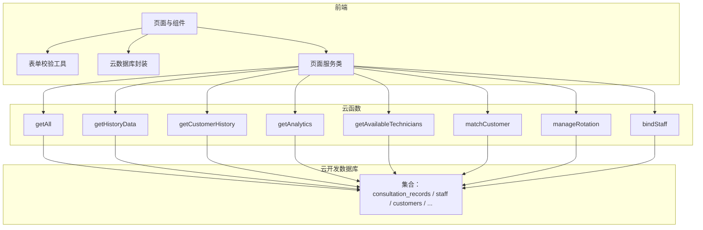
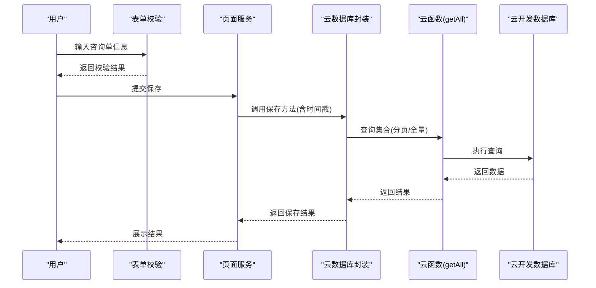
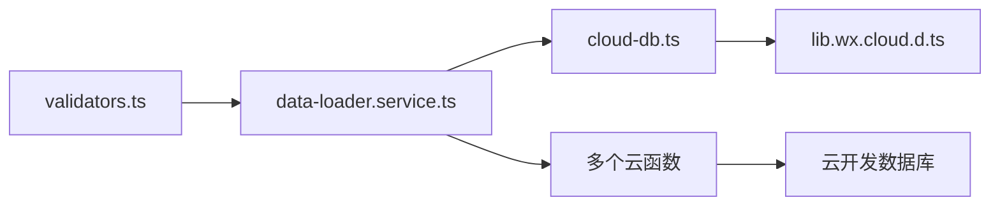
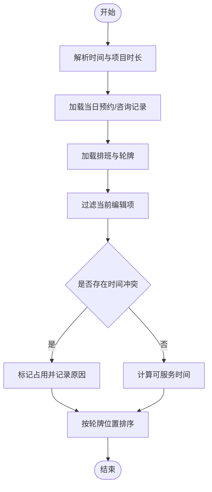
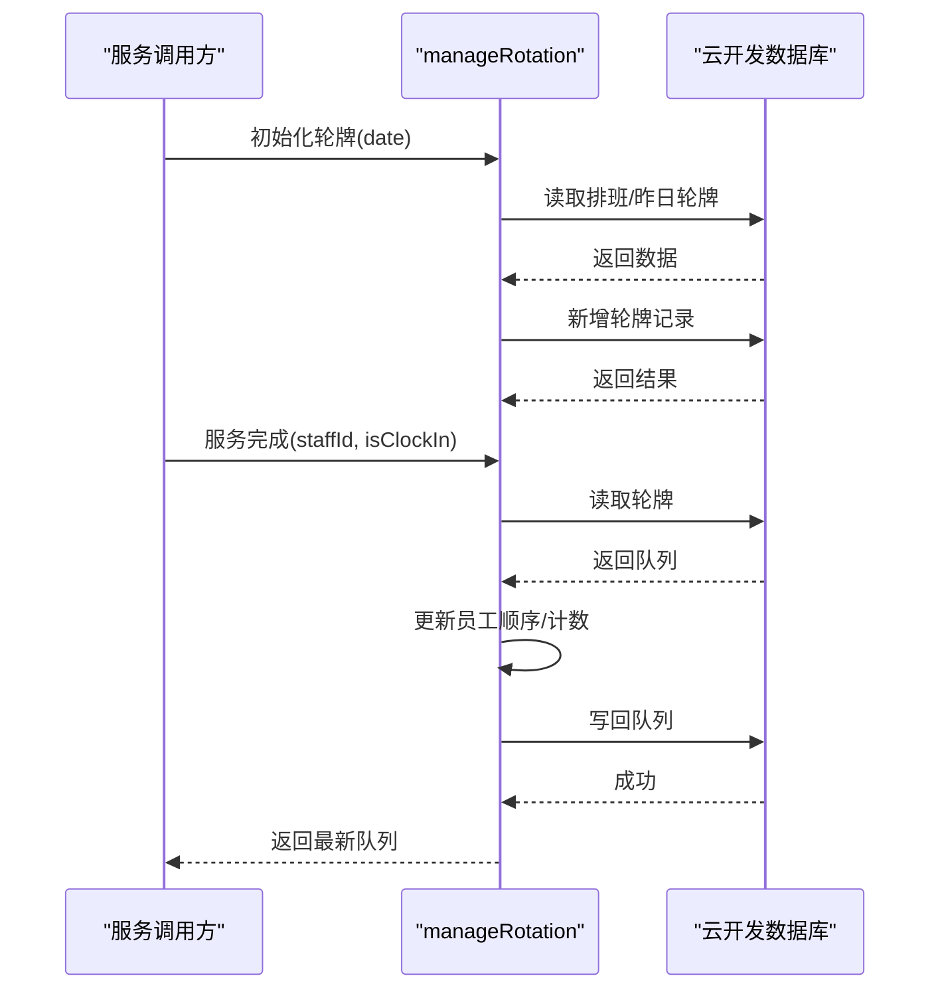

# 数据完整性保障

<cite>
**本文引用的文件**
- [cloudfunctions/getAll/index.js](file://cloudfunctions/getAll/index.js)
- [cloudfunctions/getCustomerHistory/index.js](file://cloudfunctions/getCustomerHistory/index.js)
- [cloudfunctions/getHistoryData/index.js](file://cloudfunctions/getHistoryData/index.js)
- [cloudfunctions/bindStaff/index.js](file://cloudfunctions/bindStaff/index.js)
- [cloudfunctions/getAnalytics/index.js](file://cloudfunctions/getAnalytics/index.js)
- [cloudfunctions/getAvailableTechnicians/index.js](file://cloudfunctions/getAvailableTechnicians/index.js)
- [cloudfunctions/matchCustomer/index.js](file://cloudfunctions/matchCustomer/index.js)
- [cloudfunctions/manageRotation/index.js](file://cloudfunctions/manageRotation/index.js)
- [miniprogram/utils/validators.ts](file://miniprogram/utils/validators.ts)
- [miniprogram/utils/cloud-db.ts](file://miniprogram/utils/cloud-db.ts)
- [miniprogram/pages/index/services/data-loader.service.ts](file://miniprogram/pages/index/services/data-loader.service.ts)
- [typings/types/wx/lib.wx.cloud.d.ts](file://typings/types/wx/lib.wx.cloud.d.ts)
</cite>

## 目录
1. [简介](#简介)
2. [项目结构](#项目结构)
3. [核心组件](#核心组件)
4. [架构总览](#架构总览)
5. [详细组件分析](#详细组件分析)
6. [依赖分析](#依赖分析)
7. [性能考虑](#性能考虑)
8. [故障排查指南](#故障排查指南)
9. [结论](#结论)
10. [附录](#附录)

## 简介
本文件围绕“数据完整性保障”主题，系统梳理本项目在数据验证规则、业务约束、完整性检查、主键与外键关系、级联操作、一致性与并发控制、备份与恢复、迁移与升级、质量监控与异常修复、以及安全与审计等方面的设计与实现现状，并给出可操作的改进建议与最佳实践。

## 项目结构
项目采用“微信小程序前端 + 云开发云函数”的分层架构：
- 前端层：小程序页面与服务类负责用户交互、表单校验、调用云函数、展示数据。
- 云函数层：封装数据库读写、聚合统计、业务逻辑（如技师排班、轮牌、客户匹配等）。
- 数据层：基于微信云开发的集合与文档模型，使用查询、更新、正则匹配等能力进行数据管理。

图表来源
- [miniprogram/utils/validators.ts](file://miniprogram/utils/validators.ts#L1-L81)
- [miniprogram/utils/cloud-db.ts](file://miniprogram/utils/cloud-db.ts#L1-L321)
- [miniprogram/pages/index/services/data-loader.service.ts](file://miniprogram/pages/index/services/data-loader.service.ts#L1-L206)
- [cloudfunctions/getAll/index.js](file://cloudfunctions/getAll/index.js#L1-L59)
- [cloudfunctions/getHistoryData/index.js](file://cloudfunctions/getHistoryData/index.js#L1-L411)
- [cloudfunctions/getCustomerHistory/index.js](file://cloudfunctions/getCustomerHistory/index.js#L1-L100)
- [cloudfunctions/getAnalytics/index.js](file://cloudfunctions/getAnalytics/index.js#L1-L172)
- [cloudfunctions/getAvailableTechnicians/index.js](file://cloudfunctions/getAvailableTechnicians/index.js#L1-L285)
- [cloudfunctions/matchCustomer/index.js](file://cloudfunctions/matchCustomer/index.js#L1-L71)
- [cloudfunctions/manageRotation/index.js](file://cloudfunctions/manageRotation/index.js#L1-L327)
- [cloudfunctions/bindStaff/index.js](file://cloudfunctions/bindStaff/index.js#L1-L189)

章节来源
- [miniprogram/utils/validators.ts](file://miniprogram/utils/validators.ts#L1-L81)
- [miniprogram/utils/cloud-db.ts](file://miniprogram/utils/cloud-db.ts#L1-L321)
- [miniprogram/pages/index/services/data-loader.service.ts](file://miniprogram/pages/index/services/data-loader.service.ts#L1-L206)
- [cloudfunctions/getAll/index.js](file://cloudfunctions/getAll/index.js#L1-L59)
- [cloudfunctions/getHistoryData/index.js](file://cloudfunctions/getHistoryData/index.js#L1-L411)
- [cloudfunctions/getCustomerHistory/index.js](file://cloudfunctions/getCustomerHistory/index.js#L1-L100)
- [cloudfunctions/getAnalytics/index.js](file://cloudfunctions/getAnalytics/index.js#L1-L172)
- [cloudfunctions/getAvailableTechnicians/index.js](file://cloudfunctions/getAvailableTechnicians/index.js#L1-L285)
- [cloudfunctions/matchCustomer/index.js](file://cloudfunctions/matchCustomer/index.js#L1-L71)
- [cloudfunctions/manageRotation/index.js](file://cloudfunctions/manageRotation/index.js#L1-L327)
- [cloudfunctions/bindStaff/index.js](file://cloudfunctions/bindStaff/index.js#L1-L189)

## 核心组件
- 表单与输入校验：前端提供统一的校验器，覆盖必填项、项目选择、技师/房间选择、双人模式等场景，减少非法数据进入后端。
- 云数据库封装：统一封装查询、插入、更新、删除、分页、按日期检索等通用能力，确保时间戳字段一致性与错误兜底。
- 云函数编排：以功能域划分的云函数，分别承担历史查询、客户画像、可用技师计算、轮牌管理、员工绑定、数据分析等职责，避免跨域耦合。
- 类型与命令：通过微信云开发类型定义了解查询、逻辑、投影、更新命令，为后续完善约束与校验提供依据。

章节来源
- [miniprogram/utils/validators.ts](file://miniprogram/utils/validators.ts#L1-L81)
- [miniprogram/utils/cloud-db.ts](file://miniprogram/utils/cloud-db.ts#L1-L321)
- [typings/types/wx/lib.wx.cloud.d.ts](file://typings/types/wx/lib.wx.cloud.d.ts#L694-L814)

## 架构总览
下图展示典型“保存咨询单”流程中的数据流与完整性控制点：

图表来源
- [miniprogram/utils/validators.ts](file://miniprogram/utils/validators.ts#L1-L81)
- [miniprogram/utils/cloud-db.ts](file://miniprogram/utils/cloud-db.ts#L1-L321)
- [cloudfunctions/getAll/index.js](file://cloudfunctions/getAll/index.js#L1-L59)

## 详细组件分析

### 数据验证规则与业务约束
- 前端校验器对必填字段、项目/技师/房间、双人模式信息进行强约束；校验失败时通过提示阻止提交。
- 云函数侧对关键参数进行二次校验（如手机号格式、日期/参数存在性），并在异常时返回明确错误码与消息。
- 云数据库封装在插入/更新时自动填充时间戳，确保数据可追溯。

建议补充：
- 在云函数中引入更细粒度的业务规则校验（如项目时长、技师占用冲突、会员卡状态等）。
- 对外部输入进行白名单/黑名单过滤与长度限制，防止注入与越界。

章节来源
- [miniprogram/utils/validators.ts](file://miniprogram/utils/validators.ts#L1-L81)
- [cloudfunctions/bindStaff/index.js](file://cloudfunctions/bindStaff/index.js#L98-L167)
- [cloudfunctions/getHistoryData/index.js](file://cloudfunctions/getHistoryData/index.js#L88-L124)
- [miniprogram/utils/cloud-db.ts](file://miniprogram/utils/cloud-db.ts#L136-L188)

### 主键约束、外键关系与级联操作
- 当前代码未显式声明主键/外键约束。集合间关系通过字段名约定体现（如 staffId、phone、date 等），查询时通过 where 条件关联。
- 典型关系：
  - 用户与员工：users.staffId → staff._id
  - 咨询单与客户：consultation_records.phone/custId → customers.phone/_id
  - 咨询单与技师：consultation_records.technician → staff.name
  - 日常记录与轮牌：rotation_queue.staffId → staff._id
- 级联：代码中未见自动级联删除/更新；若员工被禁用或删除，需在业务层做保护与迁移。

建议补充：
- 在数据库层面配置主键/外键约束（如支持），或在应用层强制执行引用完整性检查。
- 对删除/禁用操作增加前置检查与回退策略，避免悬挂引用。

章节来源
- [cloudfunctions/bindStaff/index.js](file://cloudfunctions/bindStaff/index.js#L121-L158)
- [cloudfunctions/getAvailableTechnicians/index.js](file://cloudfunctions/getAvailableTechnicians/index.js#L44-L49)
- [cloudfunctions/getHistoryData/index.js](file://cloudfunctions/getHistoryData/index.js#L34-L86)
- [cloudfunctions/manageRotation/index.js](file://cloudfunctions/manageRotation/index.js#L68-L120)

### 一致性保证、事务处理与并发控制
- 云函数内未使用显式事务；多处涉及“先查后改”的原子性风险（如绑定员工、轮牌调整）。
- 并发控制：当前未见分布式锁或乐观锁；高并发下可能出现竞态（如轮牌位置调整、技师占用冲突）。

建议补充：
- 引入原子更新策略（如基于版本号/时间戳的 CAS 更新）。
- 对关键写操作引入幂等设计与重试机制。
- 在冲突场景（技师占用）采用“冲突检测+重试/回滚”策略。

章节来源
- [cloudfunctions/bindStaff/index.js](file://cloudfunctions/bindStaff/index.js#L141-L158)
- [cloudfunctions/manageRotation/index.js](file://cloudfunctions/manageRotation/index.js#L185-L246)

### 数据备份策略、恢复机制与灾难预防
- 仓库未发现专门的备份/恢复脚本或定时任务。
- 可利用云开发提供的集合导出/导入能力进行离线备份与演练恢复。

建议补充：
- 制定定期全量/增量备份计划，保留多版本快照。
- 建立恢复演练流程与回滚预案，确保RTO/RPO目标。

章节来源
- [cloudfunctions/getAll/index.js](file://cloudfunctions/getAll/index.js#L19-L57)

### 数据迁移方案、版本兼容性与升级路径
- 云函数各自独立部署，具备模块化升级能力。
- 建议：
  - 迁移前冻结写入或灰度发布；
  - 保持接口返回结构稳定，新增字段向后兼容；
  - 通过环境变量/开关控制新旧逻辑切换。

章节来源
- [cloudfunctions/getAll/index.js](file://cloudfunctions/getAll/index.js#L1-L59)
- [cloudfunctions/getHistoryData/index.js](file://cloudfunctions/getHistoryData/index.js#L1-L411)

### 数据质量监控、异常检测与修复流程
- 前端与云函数均返回结构化错误码与消息，便于监控告警。
- 建议：
  - 建立指标：请求成功率、响应时延、错误分类分布；
  - 对异常进行分级与根因定位（参数缺失、格式错误、业务冲突）；
  - 自动修复：对可恢复的异常（如临时网络抖动）进行重试；
  - 人工修复：对业务冲突（如重复绑定、轮牌错位）建立工单流程。

章节来源
- [cloudfunctions/getAll/index.js](file://cloudfunctions/getAll/index.js#L52-L57)
- [cloudfunctions/getCustomerHistory/index.js](file://cloudfunctions/getCustomerHistory/index.js#L93-L98)

### 数据安全、访问控制与审计日志
- 访问控制：云函数通过 wxContext 获取 OPENID，结合用户表进行权限校验（如绑定员工）。
- 审计：云数据库封装统一记录 createdAt/updatedAt；可在关键操作处扩展审计字段（操作人、IP、UA、变更详情）。

建议补充：
- 对敏感字段（手机号、车牌号）进行脱敏存储与传输；
- 增加操作审计与访问日志，支持追踪与合规要求。

章节来源
- [cloudfunctions/bindStaff/index.js](file://cloudfunctions/bindStaff/index.js#L10-L51)
- [miniprogram/utils/cloud-db.ts](file://miniprogram/utils/cloud-db.ts#L136-L188)

## 依赖分析
- 前端依赖微信云开发 SDK，通过 wx.cloud.database 与云函数通信。
- 云函数依赖 wx-server-sdk，使用数据库命令（查询、逻辑、投影、更新）。
- 页面服务类依赖云数据库封装与集合枚举，协调数据加载与保存。

图表来源
- [miniprogram/utils/validators.ts](file://miniprogram/utils/validators.ts#L1-L81)
- [miniprogram/pages/index/services/data-loader.service.ts](file://miniprogram/pages/index/services/data-loader.service.ts#L1-L206)
- [miniprogram/utils/cloud-db.ts](file://miniprogram/utils/cloud-db.ts#L1-L321)
- [typings/types/wx/lib.wx.cloud.d.ts](file://typings/types/wx/lib.wx.cloud.d.ts#L694-L814)

章节来源
- [miniprogram/utils/validators.ts](file://miniprogram/utils/validators.ts#L1-L81)
- [miniprogram/pages/index/services/data-loader.service.ts](file://miniprogram/pages/index/services/data-loader.service.ts#L1-L206)
- [miniprogram/utils/cloud-db.ts](file://miniprogram/utils/cloud-db.ts#L1-L321)
- [typings/types/wx/lib.wx.cloud.d.ts](file://typings/types/wx/lib.wx.cloud.d.ts#L694-L814)

## 性能考虑
- 分页与全量拉取：getAll 使用 limit 与游标方式分批拉取，避免一次性大查询。
- 复杂查询：getHistoryData 对多集合进行多次查询与内存聚合，建议在数据库侧建立复合索引与物化视图（如可行）。
- 时间计算：前端/云函数中存在多次时间解析与格式化，建议复用工具函数并缓存常用值。

章节来源
- [cloudfunctions/getAll/index.js](file://cloudfunctions/getAll/index.js#L19-L57)
- [cloudfunctions/getHistoryData/index.js](file://cloudfunctions/getHistoryData/index.js#L33-L86)

## 故障排查指南
- 参数缺失/格式错误：云函数对必填参数进行校验并返回明确错误；前端应根据错误码提示用户修正。
- 文档不存在：云数据库封装对“document not found”进行捕获并返回空/失败，避免抛出异常。
- 冲突与并发问题：绑定/轮牌等操作需关注竞态，建议引入幂等键与重试策略。

章节来源
- [cloudfunctions/bindStaff/index.js](file://cloudfunctions/bindStaff/index.js#L141-L158)
- [cloudfunctions/manageRotation/index.js](file://cloudfunctions/manageRotation/index.js#L185-L246)
- [miniprogram/utils/cloud-db.ts](file://miniprogram/utils/cloud-db.ts#L93-L103)

## 结论
本项目在前端校验、云数据库封装与云函数编排方面已形成较为清晰的数据通路；但在数据库约束、事务与并发控制、备份恢复、迁移升级、质量监控与安全审计等方面仍有较大提升空间。建议优先补齐主外键约束与原子更新策略，再逐步完善备份、监控与安全体系，以实现端到端的数据完整性保障。

## 附录

### 关键流程图：技师可用性计算

图表来源
- [cloudfunctions/getAvailableTechnicians/index.js](file://cloudfunctions/getAvailableTechnicians/index.js#L22-L124)

### 关键流程图：轮牌初始化与服务完成

图表来源
- [cloudfunctions/manageRotation/index.js](file://cloudfunctions/manageRotation/index.js#L38-L246)