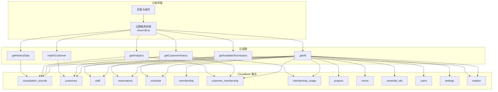
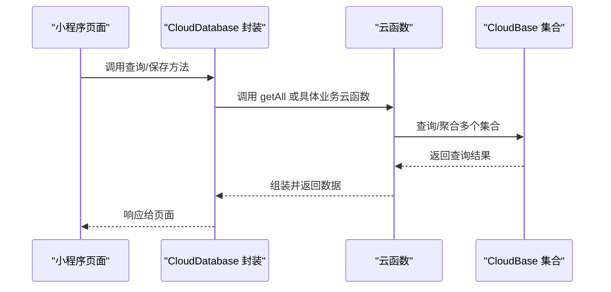
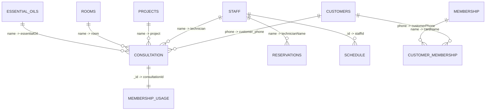
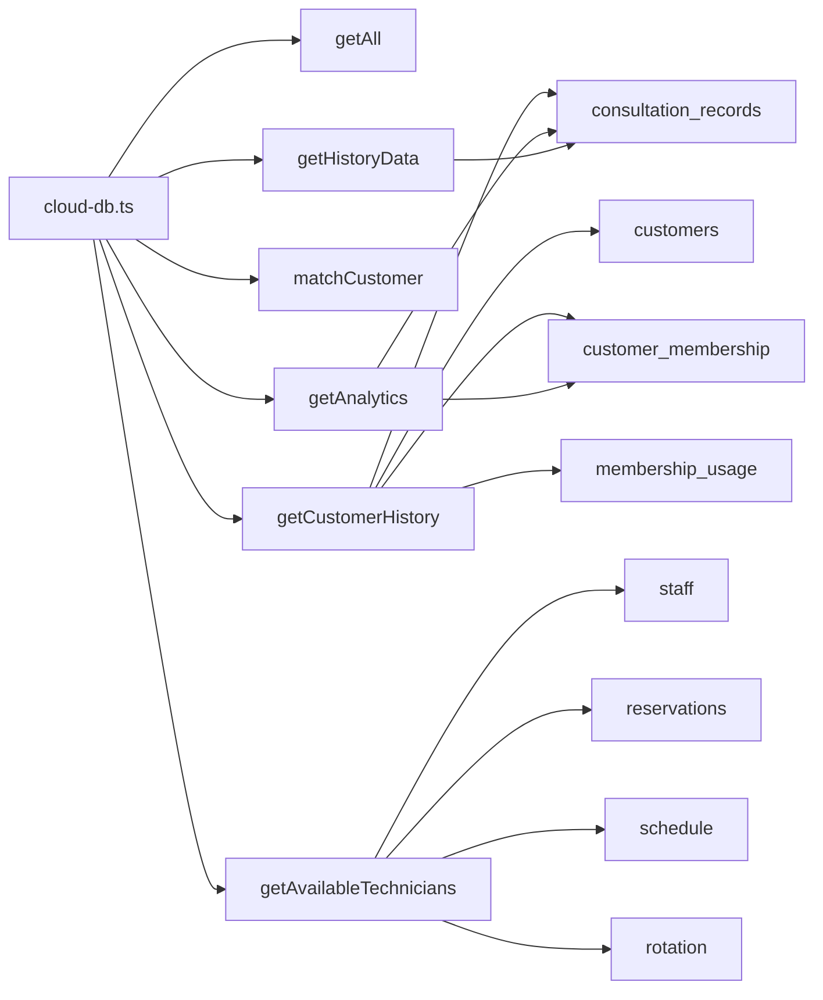
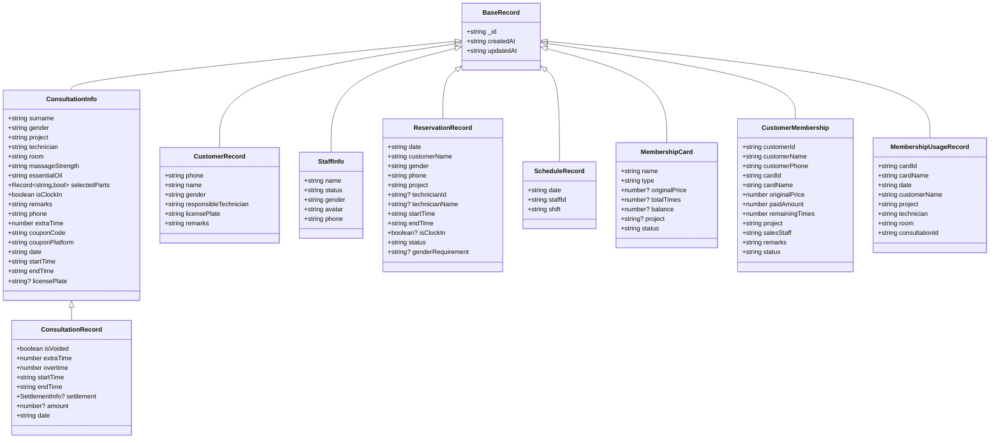
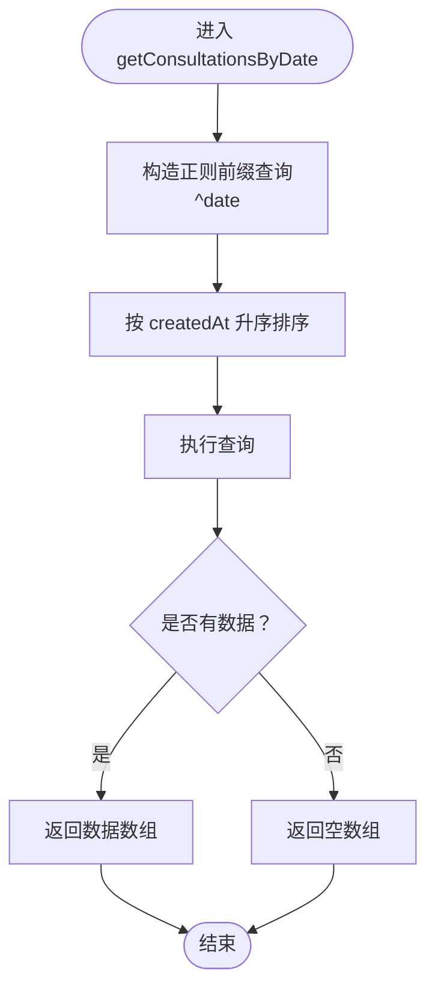
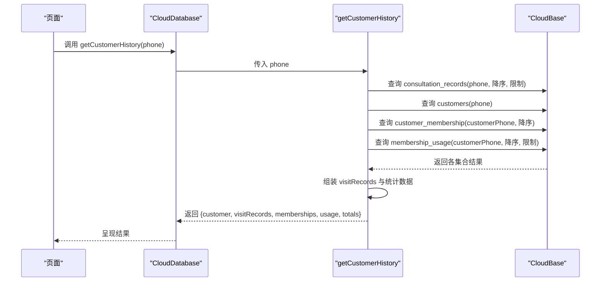

# 数据库设计

<cite>
**本文档引用的文件**
- [miniprogram/utils/cloud-db.ts](file://miniprogram/utils/cloud-db.ts)
- [cloudfunctions/getAll/index.js](file://cloudfunctions/getAll/index.js)
- [cloudfunctions/getCustomerHistory/index.js](file://cloudfunctions/getCustomerHistory/index.js)
- [cloudfunctions/matchCustomer/index.js](file://cloudfunctions/matchCustomer/index.js)
- [cloudfunctions/getAvailableTechnicians/index.js](file://cloudfunctions/getAvailableTechnicians/index.js)
- [cloudfunctions/getAnalytics/index.js](file://cloudfunctions/getAnalytics/index.js)
- [cloudfunctions/getHistoryData/index.js](file://cloudfunctions/getHistoryData/index.js)
- [typings/index.d.ts](file://typings/index.d.ts)
- [typings/types/wx/lib.wx.cloud.d.ts](file://typings/types/wx/lib.wx.cloud.d.ts)
- [miniprogram/app.ts](file://miniprogram/app.ts)
</cite>

## 目录
1. [简介](#简介)
2. [项目结构](#项目结构)
3. [核心组件](#核心组件)
4. [架构总览](#架构总览)
5. [详细组件分析](#详细组件分析)
6. [依赖分析](#依赖分析)
7. [性能考量](#性能考量)
8. [故障排查指南](#故障排查指南)
9. [结论](#结论)
10. [附录](#附录)

## 简介
本文件面向CloudBase数据库的设计与实现，聚焦于以下核心数据模型与关系：
- ConsultationRecord 咨询单记录
- CustomerRecord 客户记录
- StaffInfo 技师信息
- 以及与之相关的集合：consultation_records、customers、staff、reservations、schedule、membership、customer_membership、membership_usage、projects、rooms、essential_oils、users、settings、rotation 等

文档将从数据模型、集合关系、主键外键、索引与查询优化、数据验证与业务约束、数据访问模式与缓存策略、迁移与版本管理、备份恢复策略、扩展与最佳实践等方面进行全面阐述，并提供流程图与时序图帮助理解。

## 项目结构
项目采用“前端小程序 + 云函数 + 类型定义”的分层组织方式：
- 小程序端通过统一的云数据库封装类访问集合数据
- 云函数负责复杂查询、聚合统计与批量导出等场景
- 类型定义文件提供强类型约束，确保前后端一致

图表来源
- [miniprogram/utils/cloud-db.ts](file://miniprogram/utils/cloud-db.ts#L1-L321)
- [cloudfunctions/getAll/index.js](file://cloudfunctions/getAll/index.js#L1-L59)
- [cloudfunctions/getCustomerHistory/index.js](file://cloudfunctions/getCustomerHistory/index.js#L1-L100)
- [cloudfunctions/getAvailableTechnicians/index.js](file://cloudfunctions/getAvailableTechnicians/index.js#L1-L285)
- [cloudfunctions/getAnalytics/index.js](file://cloudfunctions/getAnalytics/index.js#L1-L172)
- [cloudfunctions/getHistoryData/index.js](file://cloudfunctions/getHistoryData/index.js#L1-L411)

章节来源
- [miniprogram/utils/cloud-db.ts](file://miniprogram/utils/cloud-db.ts#L1-L321)
- [cloudfunctions/getAll/index.js](file://cloudfunctions/getAll/index.js#L1-L59)

## 核心组件
- 云数据库封装类 CloudDatabase：提供统一的 CRUD、分页、按日期查询、保存咨询单等能力；内部通过调用 getAll 云函数实现全量集合读取。
- 云函数：提供复杂查询、聚合统计、可用技师计算、客户历史合并查询、日程汇总等。
- 类型系统：以 TypeScript 接口定义各集合字段、枚举与关系，保证数据一致性。

章节来源
- [miniprogram/utils/cloud-db.ts](file://miniprogram/utils/cloud-db.ts#L12-L321)
- [typings/index.d.ts](file://typings/index.d.ts#L1-L435)

## 架构总览
整体数据流由小程序端发起请求，经云数据库封装类路由到相应云函数，云函数对多个集合进行查询与聚合，最终返回结果。

图表来源
- [miniprogram/utils/cloud-db.ts](file://miniprogram/utils/cloud-db.ts#L69-L123)
- [cloudfunctions/getAll/index.js](file://cloudfunctions/getAll/index.js#L9-L58)
- [cloudfunctions/getCustomerHistory/index.js](file://cloudfunctions/getCustomerHistory/index.js#L9-L99)
- [cloudfunctions/getAvailableTechnicians/index.js](file://cloudfunctions/getAvailableTechnicians/index.js#L9-L124)

## 详细组件分析

### 数据模型与实体定义
- ConsultationRecord 咨询单记录
  - 关键字段：日期、开始/结束时间、技师、房间、项目、是否打卡、加钟/加班、结算信息、手机号、车牌号、性别、优惠券平台与券码等
  - 业务含义：记录一次服务过程，支持作废标记与结算信息
- CustomerRecord 客户记录
  - 关键字段：手机号、姓名、性别、负责技师、车牌号、备注
  - 业务含义：客户基础档案，用于匹配与历史查询
- StaffInfo 技师信息
  - 关键字段：姓名、状态、性别、头像、手机号
  - 业务含义：技师档案，配合排班与可用性计算
- 其他相关集合
  - reservations：预约记录（含技师可选、性别要求、状态）
  - schedule：排班记录（日期、技师、班次）
  - membership / customer_membership / membership_usage：会员卡体系
  - projects / rooms / essential_oils：服务项目、房间、精油
  - users / settings / rotation：用户、系统设置、轮转队列

章节来源
- [typings/index.d.ts](file://typings/index.d.ts#L37-L83)
- [typings/index.d.ts](file://typings/index.d.ts#L136-L144)
- [typings/index.d.ts](file://typings/index.d.ts#L89-L96)
- [typings/index.d.ts](file://typings/index.d.ts#L108-L122)
- [typings/index.d.ts](file://typings/index.d.ts#L125-L134)
- [typings/index.d.ts](file://typings/index.d.ts#L157-L171)
- [typings/index.d.ts](file://typings/index.d.ts#L173-L183)
- [typings/index.d.ts](file://typings/index.d.ts#L185-L206)
- [typings/index.d.ts](file://typings/index.d.ts#L308-L324)

### 集合关系与主键外键
- 主键
  - 所有集合均使用 CloudBase 默认 ObjectId 作为主键（_id），在类型定义中体现为字符串类型
- 外键与弱引用
  - ConsultationRecord 中的 technician 字段通常指向 StaffInfo.name；reservation 中的 technicianName 指向 StaffInfo.name
  - customer_membership 通过 customerPhone 关联 CustomerRecord 的 phone
  - membership_usage 通过 consultationId 关联 ConsultationRecord 的 _id
  - schedule 通过 staffId 关联 StaffInfo 的 _id
  - rotation 队列项包含 staffId 与 position
- 关系图

图表来源
- [typings/index.d.ts](file://typings/index.d.ts#L74-L83)
- [typings/index.d.ts](file://typings/index.d.ts#L137-L144)
- [typings/index.d.ts](file://typings/index.d.ts#L108-L122)
- [typings/index.d.ts](file://typings/index.d.ts#L102-L106)
- [typings/index.d.ts](file://typings/index.d.ts#L173-L183)
- [typings/index.d.ts](file://typings/index.d.ts#L157-L171)
- [typings/index.d.ts](file://typings/index.d.ts#L185-L206)

### 数据类型与字段约束
- 枚举与受限值
  - gender、massageStrength、status、ItemStatus、UserRole、ShiftType、PaymentMethod 等均在类型定义中限定取值范围
- 时间与日期
  - date、startTime、endTime、createdAt、updatedAt 等字段遵循约定格式，便于排序与范围查询
- 数值与金额
  - amount、extraTime、overtime、originalPrice、paidAmount、balance、totalTimes 等字段需满足非负与业务语义
- 文本与备注
  - remarks、couponCode、licensePlate 等字段长度与内容需符合业务规则

章节来源
- [typings/index.d.ts](file://typings/index.d.ts#L18-L27)
- [typings/index.d.ts](file://typings/index.d.ts#L37-L83)
- [typings/index.d.ts](file://typings/index.d.ts#L85-L106)
- [typings/index.d.ts](file://typings/index.d.ts#L125-L134)
- [typings/index.d.ts](file://typings/index.d.ts#L136-L144)
- [typings/index.d.ts](file://typings/index.d.ts#L185-L206)

### 查询与访问模式
- 分页查询
  - 提供 findWithPage 方法，支持 where 条件、排序、跳过与限制，同时并发执行查询与计数
- 全量读取
  - getAll 通过云函数分页拉取集合全部数据，避免一次性大查询
- 按日期查询
  - getConsultationsByDate 使用正则前缀匹配日期，实现按天检索
- 复合查询
  - getCustomerHistory 合并咨询单、客户、会员卡与使用记录，计算总次数与总金额
  - getAvailableTechnicians 联合咨询单、预约、排班与轮转队列，计算技师占用与可用时段
- 匹配查询
  - matchCustomer 在本地遍历匹配，结合电话包含度、姓名包含度与性别后缀权重评分

章节来源
- [miniprogram/utils/cloud-db.ts](file://miniprogram/utils/cloud-db.ts#L209-L255)
- [cloudfunctions/getAll/index.js](file://cloudfunctions/getAll/index.js#L9-L58)
- [miniprogram/utils/cloud-db.ts](file://miniprogram/utils/cloud-db.ts#L283-L298)
- [cloudfunctions/getCustomerHistory/index.js](file://cloudfunctions/getCustomerHistory/index.js#L9-L99)
- [cloudfunctions/getAvailableTechnicians/index.js](file://cloudfunctions/getAvailableTechnicians/index.js#L9-L124)
- [cloudfunctions/matchCustomer/index.js](file://cloudfunctions/matchCustomer/index.js#L9-L71)

### 缓存策略与性能考量
- 小程序全局缓存
  - app.ts 在启动时并发加载 projects、rooms、essential_oils、staff 等基础数据，减少重复网络请求
- 云函数批量查询
  - getAll 使用分页游标（基于 _id）避免全表扫描
- 查询优化建议
  - 为高频查询字段建立索引：如 consultation_records.date、consultation_records.phone、consultation_records.technician、customers.phone、schedule.date、reservations.date/status 等
  - 使用复合索引覆盖常见查询：如 date+technician、date+status、phone+createdAt
  - 对聚合查询（getAnalytics、getHistoryData）尽量限定日期范围与过滤条件
- 读写分离与一致性
  - 写入统一通过封装类，读取优先命中本地缓存，再按需调用云函数

章节来源
- [miniprogram/app.ts](file://miniprogram/app.ts#L40-L66)
- [cloudfunctions/getAll/index.js](file://cloudfunctions/getAll/index.js#L25-L44)
- [cloudfunctions/getAnalytics/index.js](file://cloudfunctions/getAnalytics/index.js#L53-L71)
- [cloudfunctions/getHistoryData/index.js](file://cloudfunctions/getHistoryData/index.js#L33-L86)

### 数据验证与业务约束
- 输入校验
  - 云函数对必填参数进行判空与类型检查（如 getCustomerHistory 的 phone 参数）
- 业务规则
  - ConsultationRecord 的 isVoided 控制作废；结算信息 settlement 仅在完成时填充
  - reservations 的 status 支持 active/cancelled/arrived；schedule 的 shift 支持 morning/evening/off/leave
  - customer_membership 的 remainingTimes 与 status 控制使用与生效
- 一致性保障
  - 通过类型定义约束字段取值；封装类统一 createdAt/updatedAt 更新

章节来源
- [cloudfunctions/getCustomerHistory/index.js](file://cloudfunctions/getCustomerHistory/index.js#L10-L18)
- [typings/index.d.ts](file://typings/index.d.ts#L74-L83)
- [typings/index.d.ts](file://typings/index.d.ts#L108-L122)
- [typings/index.d.ts](file://typings/index.d.ts#L102-L106)
- [typings/index.d.ts](file://typings/index.d.ts#L157-L171)

### 数据迁移与版本管理
- 迁移策略
  - 新增字段：在类型定义中添加默认值或可选字段，云函数与封装类兼容旧数据
  - 字段重命名：通过云函数映射旧字段到新字段，逐步替换
  - 删除字段：保留只读映射一段时间，避免破坏历史查询
- 版本管理
  - 以集合版本号或 createdAt 前缀区分数据批次；对日期字段查询使用正则前缀匹配
- 备份与恢复
  - 使用 getAll 云函数导出全量数据；按集合分批导出，结合日期字段进行增量备份

章节来源
- [cloudfunctions/getAll/index.js](file://cloudfunctions/getAll/index.js#L9-L58)
- [miniprogram/utils/cloud-db.ts](file://miniprogram/utils/cloud-db.ts#L283-L298)

### 扩展与最佳实践
- 扩展方向
  - 引入审计日志集合记录关键变更
  - 为高并发场景引入二级索引与读副本
  - 对超大数据集采用分区表或冷热分层存储
- 最佳实践
  - 严格遵守类型定义，避免动态字段污染
  - 对外部输入进行白名单校验与长度限制
  - 使用事务或幂等写入保证一致性（若业务需要）

## 依赖分析
- 小程序端依赖
  - cloud-db.ts 依赖 wx.cloud 与封装的云函数 getAll
  - app.ts 并发加载多集合基础数据
- 云函数依赖
  - getAll 依赖 database.collection 与分页游标
  - getCustomerHistory 依赖 consultation_records、customers、customer_membership、membership_usage
  - getAvailableTechnicians 依赖 staff、reservations、schedule、rotation
  - getAnalytics 依赖 consultation_records、customer_membership
  - getHistoryData 依赖 consultation_records

图表来源
- [miniprogram/utils/cloud-db.ts](file://miniprogram/utils/cloud-db.ts#L69-L88)
- [cloudfunctions/getAll/index.js](file://cloudfunctions/getAll/index.js#L6-L6)
- [cloudfunctions/getCustomerHistory/index.js](file://cloudfunctions/getCustomerHistory/index.js#L22-L64)
- [cloudfunctions/getAvailableTechnicians/index.js](file://cloudfunctions/getAvailableTechnicians/index.js#L26-L63)
- [cloudfunctions/getAnalytics/index.js](file://cloudfunctions/getAnalytics/index.js#L56-L71)
- [cloudfunctions/getHistoryData/index.js](file://cloudfunctions/getHistoryData/index.js#L34-L86)

章节来源
- [miniprogram/utils/cloud-db.ts](file://miniprogram/utils/cloud-db.ts#L1-L321)
- [cloudfunctions/getAll/index.js](file://cloudfunctions/getAll/index.js#L1-L59)
- [cloudfunctions/getCustomerHistory/index.js](file://cloudfunctions/getCustomerHistory/index.js#L1-L100)
- [cloudfunctions/getAvailableTechnicians/index.js](file://cloudfunctions/getAvailableTechnicians/index.js#L1-L285)
- [cloudfunctions/getAnalytics/index.js](file://cloudfunctions/getAnalytics/index.js#L1-L172)
- [cloudfunctions/getHistoryData/index.js](file://cloudfunctions/getHistoryData/index.js#L1-L411)

## 性能考量
- 查询路径优化
  - 使用索引覆盖高频查询字段（date、phone、technician、status）
  - 对聚合查询限定日期范围，减少扫描
- 读写分离
  - 读取走本地缓存与云函数分页；写入统一入口更新 createdAt/updatedAt
- 批处理与并发
  - app.ts 并发加载基础数据；云函数内对多个集合使用 Promise.all 并发查询

章节来源
- [miniprogram/app.ts](file://miniprogram/app.ts#L48-L57)
- [cloudfunctions/getAll/index.js](file://cloudfunctions/getAll/index.js#L25-L44)
- [cloudfunctions/getAnalytics/index.js](file://cloudfunctions/getAnalytics/index.js#L53-L71)

## 故障排查指南
- 常见错误与定位
  - 参数缺失：如 getCustomerHistory 的 phone 参数校验
  - 文档不存在：findById/updateById/deleteById 对异常进行捕获并返回空/失败
  - 查询超时：getAll 使用分页游标避免大查询；必要时增加索引
- 日志与监控
  - 云函数返回统一结构（code/message/data/error），便于前端与运维定位问题
- 修复建议
  - 补充缺失索引；优化聚合查询范围；对输入进行白名单校验

章节来源
- [cloudfunctions/getCustomerHistory/index.js](file://cloudfunctions/getCustomerHistory/index.js#L10-L18)
- [miniprogram/utils/cloud-db.ts](file://miniprogram/utils/cloud-db.ts#L93-L103)
- [cloudfunctions/getAll/index.js](file://cloudfunctions/getAll/index.js#L25-L44)

## 结论
本设计以强类型定义为基础，结合云函数与封装类实现了清晰的数据访问与查询模式。通过合理的集合关系、索引与查询优化策略，能够支撑日常业务的高效运行。建议后续在高并发场景下引入索引与读副本，并完善审计与备份策略，持续提升系统的稳定性与可维护性。

## 附录

### 数据模型类图

图表来源
- [typings/index.d.ts](file://typings/index.d.ts#L1-L435)

### 查询流程图（按日期获取咨询单）

图表来源
- [miniprogram/utils/cloud-db.ts](file://miniprogram/utils/cloud-db.ts#L283-L298)

### 时序图（客户历史合并查询）

图表来源
- [cloudfunctions/getCustomerHistory/index.js](file://cloudfunctions/getCustomerHistory/index.js#L9-L99)
- [miniprogram/utils/cloud-db.ts](file://miniprogram/utils/cloud-db.ts#L69-L88)