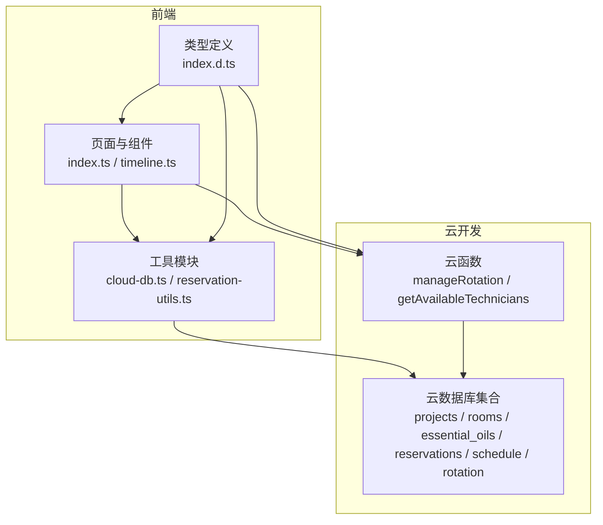
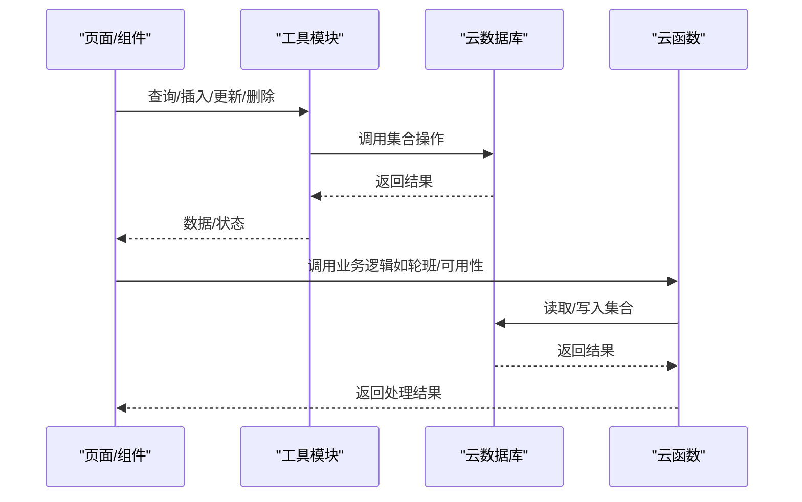
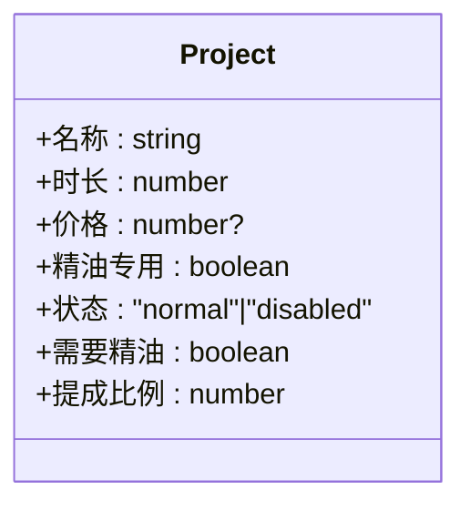
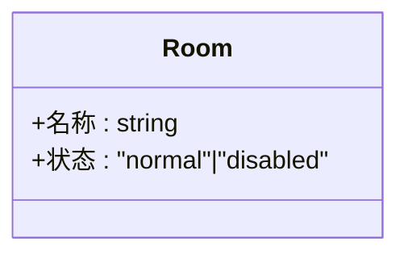
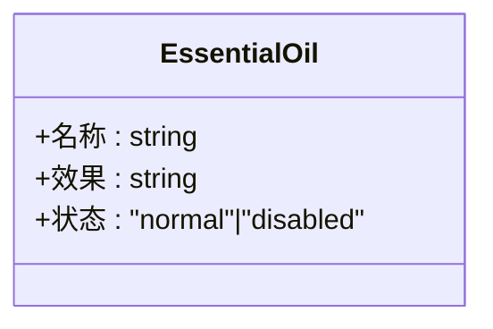
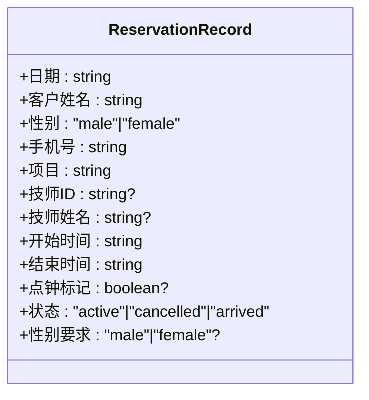
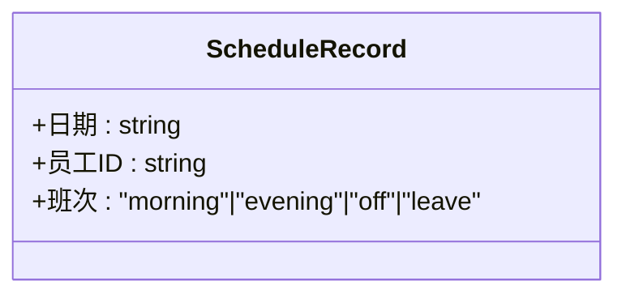
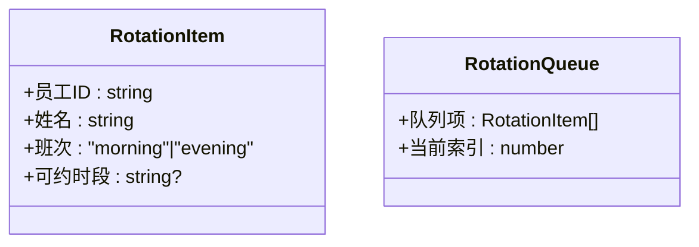
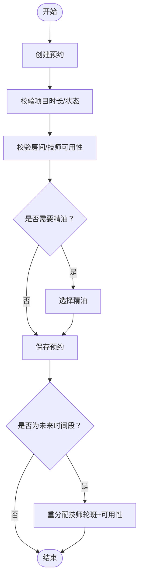
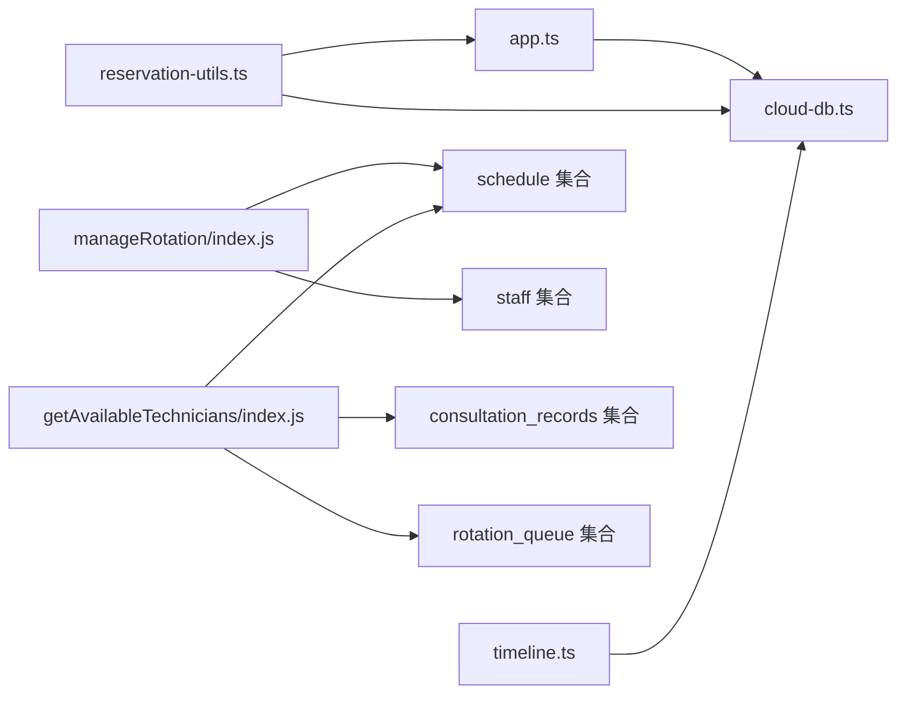

# 业务实体模型

<cite>
**本文引用的文件**
- [app.ts](file://miniprogram/app.ts)
- [cloud-db.ts](file://miniprogram/utils/cloud-db.ts)
- [index.d.ts](file://typings/index.d.ts)
- [reservation-utils.ts](file://miniprogram/pages/index/utils/reservation-utils.ts)
- [manageRotation/index.js](file://cloudfunctions/manageRotation/index.js)
- [getAvailableTechnicians/index.js](file://cloudfunctions/getAvailableTechnicians/index.js)
- [timeline.ts](file://miniprogram/components/timeline/timeline.ts)
</cite>

## 目录
1. [简介](#简介)
2. [项目结构](#项目结构)
3. [核心组件](#核心组件)
4. [架构总览](#架构总览)
5. [详细组件分析](#详细组件分析)
6. [依赖分析](#依赖分析)
7. [性能考虑](#性能考虑)
8. [故障排查指南](#故障排查指南)
9. [结论](#结论)
10. [附录](#附录)

## 简介
本文件面向SPA按摩店业务系统，系统通过微信小程序前端与云开发数据库协同工作，并通过云函数实现业务逻辑处理。本文档围绕以下核心业务实体展开：Project（按摩项目）、Room（房间信息）、EssentialOil（精油信息）、Reservation（预约记录）、Schedule（排班记录）、Rotation（轮班记录）。我们将从字段定义、数据类型、业务规则、实体关系以及典型业务场景入手，帮助读者快速理解并正确使用这些实体。

## 项目结构
系统采用“前端页面 + 工具模块 + 类型定义 + 云函数”的分层组织：
- 前端页面与组件：负责用户交互、调用工具模块与云函数
- 工具模块：封装云数据库访问、集合常量、通用查询/插入/更新/删除等
- 类型定义：统一声明所有业务实体的数据结构与枚举
- 云函数：实现复杂业务流程，如轮班队列管理、技师可用性计算等



图表来源
- [app.ts](file://miniprogram/app.ts#L40-L108)
- [cloud-db.ts](file://miniprogram/utils/cloud-db.ts#L303-L321)
- [index.d.ts](file://typings/index.d.ts#L185-L206)
- [reservation-utils.ts](file://miniprogram/pages/index/utils/reservation-utils.ts#L1-L173)
- [manageRotation/index.js](file://cloudfunctions/manageRotation/index.js#L1-L327)
- [getAvailableTechnicians/index.js](file://cloudfunctions/getAvailableTechnicians/index.js#L42-L171)

章节来源
- [app.ts](file://miniprogram/app.ts#L40-L108)
- [cloud-db.ts](file://miniprogram/utils/cloud-db.ts#L303-L321)

## 核心组件
本节对六大业务实体进行字段定义、数据类型与业务规则说明，并给出典型业务场景下的数据示例。

- Project（按摩项目）
  - 字段与类型
    - 名称：字符串
    - 时长：整数（分钟）
    - 价格：可选数值
    - 精油专用：布尔（是否仅限精油）
    - 状态：枚举（正常/禁用）
    - 需要精油：布尔（是否需要精油）
    - 提成比例：数值
  - 业务规则
    - 项目时长决定可排时段与技师空闲匹配
    - 精油专用或需要精油的项目需在预约时选择对应精油
    - 状态为禁用时不可被选择
  - 示例
    - 名称：肩颈舒缓；时长：60；价格：128；需要精油：true；状态：normal；提成比例：0.1

- Room（房间信息）
  - 字段与类型
    - 名称：字符串
    - 状态：枚举（正常/禁用）
  - 业务规则
    - 状态为禁用时不可被分配
  - 示例
    - 名称：A房；状态：normal

- EssentialOil（精油信息）
  - 字段与类型
    - 名称：字符串
    - 效果：字符串
    - 状态：枚举（正常/禁用）
  - 业务规则
    - 状态为禁用时不可被选择
  - 示例
    - 名称：薰衣草；效果：助眠；状态：normal

- Reservation（预约记录）
  - 字段与类型
    - 日期：字符串（YYYY-MM-DD）
    - 客户姓名：字符串
    - 性别：枚举（male/female）
    - 手机号：字符串
    - 项目：字符串（项目ID或名称）
    - 技师ID/姓名：可选
    - 开始时间：字符串（HH:MM）
    - 结束时间：字符串（HH:MM）
    - 点钟标记：布尔
    - 状态：枚举（active/cancelled/arrived）
    - 性别要求：可选枚举（male/female）
  - 业务规则
    - 时间段冲突校验（与同房间/同技师冲突则不可创建）
    - 性别要求与技师性别一致
    - 状态变更：取消/到达/进行中
    - 未来预约可自动重分配给轮班队列中的合适技师
  - 示例
    - 日期：2025-04-05；客户姓名：张三；性别：male；手机号：13800001111；项目：肩颈舒缓；开始时间：14:00；结束时间：15:00；状态：active；性别要求：male

- Schedule（排班记录）
  - 字段与类型
    - 日期：字符串（YYYY-MM-DD）
    - 员工ID：字符串
    - 班次：枚举（morning/evening/off/leave）
  - 业务规则
    - 同一天同一员工仅允许一条有效排班
    - off/leave 不参与轮班
  - 示例
    - 日期：2025-04-05；员工ID：staff_abc；班次：morning

- Rotation（轮班记录）
  - 字段与类型
    - 队列项：数组（含员工ID、姓名、头像、电话、性别、班次、优先级、服务次数、上次服务时间、当前位置）
    - 当前索引：整数
  - 业务规则
    - 每日初始化，基于排班与昨日轮班情况计算优先级
    - 服务完成后移动到队尾并更新当前索引
    - 支持手动调整队列顺序
  - 示例
    - 队列项：[{员工ID: staff_abc, 服务次数: 2, 上次服务时间: "2025-04-05T18:00:00Z", 位置: 0}, ...]；当前索引：0

章节来源
- [index.d.ts](file://typings/index.d.ts#L185-L206)
- [index.d.ts](file://typings/index.d.ts#L109-L122)
- [index.d.ts](file://typings/index.d.ts#L101-L106)
- [index.d.ts](file://typings/index.d.ts#L308-L324)

## 架构总览
系统通过前端页面与组件调用工具模块，工具模块封装云数据库访问与集合常量；复杂业务由云函数实现，前后端通过云函数桥接。



图表来源
- [cloud-db.ts](file://miniprogram/utils/cloud-db.ts#L69-L88)
- [cloud-db.ts](file://miniprogram/utils/cloud-db.ts#L303-L321)
- [manageRotation/index.js](file://cloudfunctions/manageRotation/index.js#L9-L36)

章节来源
- [cloud-db.ts](file://miniprogram/utils/cloud-db.ts#L69-L88)
- [cloud-db.ts](file://miniprogram/utils/cloud-db.ts#L303-L321)
- [manageRotation/index.js](file://cloudfunctions/manageRotation/index.js#L9-L36)

## 详细组件分析

### Project（按摩项目）分析
- 字段与类型
  - 名称：字符串
  - 时长：整数（分钟）
  - 价格：可选数值
  - 精油专用：布尔
  - 状态：枚举（normal/disabled）
  - 需要精油：布尔
  - 提成比例：数值
- 业务规则
  - 项目时长决定可排时段与技师空闲匹配
  - 精油专用或需要精油的项目需在预约时选择对应精油
  - 状态为禁用时不可被选择
- 典型场景
  - 预约创建时根据项目时长计算结束时间
  - 项目状态变化影响前台展示与选择



图表来源
- [index.d.ts](file://typings/index.d.ts#L185-L193)

章节来源
- [index.d.ts](file://typings/index.d.ts#L185-L193)

### Room（房间信息）分析
- 字段与类型
  - 名称：字符串
  - 状态：枚举（normal/disabled）
- 业务规则
  - 状态为禁用时不可被分配
- 典型场景
  - 预约创建时检查房间可用性
  - 房间维护时调整状态



图表来源
- [index.d.ts](file://typings/index.d.ts#L195-L198)

章节来源
- [index.d.ts](file://typings/index.d.ts#L195-L198)

### EssentialOil（精油信息）分析
- 字段与类型
  - 名称：字符串
  - 效果：字符串
  - 状态：枚举（normal/disabled）
- 业务规则
  - 状态为禁用时不可被选择
- 典型场景
  - 预约创建时选择精油
  - 项目需要精油时强制选择



图表来源
- [index.d.ts](file://typings/index.d.ts#L202-L206)

章节来源
- [index.d.ts](file://typings/index.d.ts#L202-L206)

### Reservation（预约记录）分析
- 字段与类型
  - 日期：字符串（YYYY-MM-DD）
  - 客户姓名：字符串
  - 性别：枚举（male/female）
  - 手机号：字符串
  - 项目：字符串
  - 技师ID/姓名：可选
  - 开始时间：字符串（HH:MM）
  - 结束时间：字符串（HH:MM）
  - 点钟标记：布尔
  - 状态：枚举（active/cancelled/arrived）
  - 性别要求：可选枚举（male/female）
- 业务规则
  - 时间段冲突校验（与同房间/同技师冲突则不可创建）
  - 性别要求与技师性别一致
  - 状态变更：取消/到达/进行中
  - 未来预约可自动重分配给轮班队列中的合适技师
- 典型场景
  - 创建预约后自动匹配性别合适的技师
  - 未来时间段的预约在特定条件下重分配



图表来源
- [index.d.ts](file://typings/index.d.ts#L109-L122)

章节来源
- [index.d.ts](file://typings/index.d.ts#L109-L122)
- [reservation-utils.ts](file://miniprogram/pages/index/utils/reservation-utils.ts#L26-L145)

### Schedule（排班记录）分析
- 字段与类型
  - 日期：字符串（YYYY-MM-DD）
  - 员工ID：字符串
  - 班次：枚举（morning/evening/off/leave）
- 业务规则
  - 同一天同一员工仅允许一条有效排班
  - off/leave 不参与轮班
- 典型场景
  - 初始化轮班队列时依据排班筛选在班员工
  - 计算技师可用性时结合排班与今日咨询单



图表来源
- [index.d.ts](file://typings/index.d.ts#L101-L106)

章节来源
- [index.d.ts](file://typings/index.d.ts#L101-L106)
- [manageRotation/index.js](file://cloudfunctions/manageRotation/index.js#L38-L146)

### Rotation（轮班记录）分析
- 字段与类型
  - 队列项：数组（含员工ID、姓名、头像、电话、性别、班次、优先级、服务次数、上次服务时间、当前位置）
  - 当前索引：整数
- 业务规则
  - 每日初始化，基于排班与昨日轮班情况计算优先级
  - 服务完成后移动到队尾并更新当前索引
  - 支持手动调整队列顺序
- 典型场景
  - 获取下一个技师
  - 服务完成后推进轮班
  - 手动调整队列顺序



图表来源
- [index.d.ts](file://typings/index.d.ts#L308-L324)

章节来源
- [index.d.ts](file://typings/index.d.ts#L308-L324)
- [manageRotation/index.js](file://cloudfunctions/manageRotation/index.js#L148-L246)

### 关联关系图
以下图展示了实体之间的关联关系与典型业务流。

```mermaid
erDiagram
PROJECTS {
string _id PK
string 名称
number 时长
number 价格?
boolean 精油专用?
enum 状态
boolean 需要精油?
number 提成比例
}
ROOMS {
string _id PK
string 名称
enum 状态
}
ESSENTIAL_OILS {
string _id PK
string 名称
string 效果
enum 状态
}
RESERVATIONS {
string _id PK
string 日期
string 客户姓名
enum 性别
string 手机号
string 项目
string 技师ID?
string 技师姓名?
string 开始时间
string 结束时间
boolean 点钟标记?
enum 状态
enum 性别要求?
}
SCHEDULE {
string _id PK
string 日期
string 员工ID
enum 班次
}
ROTATION_QUEUE {
string _id PK
string 日期
json 队列项
number 当前索引
}
PROJECTS ||--o{ RESERVATIONS : "被选择"
ROOMS ||--o{ RESERVATIONS : "被占用"
ESSENTIAL_OILS ||--o{ RESERVATIONS : "被使用"
SCHEDULE ||--o{ RESERVATIONS : "影响可用性"
SCHEDULE ||--o{ ROTATION_QUEUE : "驱动初始化"
RESERVATIONS ||--o{ ROTATION_QUEUE : "影响服务顺序"
```

图表来源
- [cloud-db.ts](file://miniprogram/utils/cloud-db.ts#L303-L321)
- [index.d.ts](file://typings/index.d.ts#L185-L206)
- [index.d.ts](file://typings/index.d.ts#L109-L122)
- [index.d.ts](file://typings/index.d.ts#L101-L106)
- [index.d.ts](file://typings/index.d.ts#L308-L324)

章节来源
- [cloud-db.ts](file://miniprogram/utils/cloud-db.ts#L303-L321)
- [index.d.ts](file://typings/index.d.ts#L185-L206)
- [index.d.ts](file://typings/index.d.ts#L109-L122)
- [index.d.ts](file://typings/index.d.ts#L101-L106)
- [index.d.ts](file://typings/index.d.ts#L308-L324)

### 典型业务流程（预约与轮班）
- 流程概述
  - 预约创建：校验项目时长、房间与技师可用性，必要时选择精油
  - 未来预约重分配：基于轮班队列与技师可用性计算，自动分配合适技师
  - 轮班推进：技师服务完成后更新队列与当前索引



图表来源
- [reservation-utils.ts](file://miniprogram/pages/index/utils/reservation-utils.ts#L26-L145)
- [manageRotation/index.js](file://cloudfunctions/manageRotation/index.js#L148-L246)

章节来源
- [reservation-utils.ts](file://miniprogram/pages/index/utils/reservation-utils.ts#L26-L145)
- [manageRotation/index.js](file://cloudfunctions/manageRotation/index.js#L148-L246)

## 依赖分析
- 前端依赖
  - app.ts 依赖 cloud-db.ts 的集合常量与全局数据加载
  - reservation-utils.ts 依赖 cloud-db.ts 进行 CRUD，依赖 app.ts 获取轮班队列
  - timeline 组件依赖 cloud-db.ts 与 Collections 常量
- 云函数依赖
  - manageRotation 依赖 schedule 与 staff 集合初始化轮班队列
  - getAvailableTechnicians 依赖 schedule、consultation_records、rotation_queue 计算技师可用性



图表来源
- [app.ts](file://miniprogram/app.ts#L40-L108)
- [cloud-db.ts](file://miniprogram/utils/cloud-db.ts#L303-L321)
- [reservation-utils.ts](file://miniprogram/pages/index/utils/reservation-utils.ts#L1-L173)
- [timeline.ts](file://miniprogram/components/timeline/timeline.ts#L89-L105)
- [manageRotation/index.js](file://cloudfunctions/manageRotation/index.js#L38-L146)
- [getAvailableTechnicians/index.js](file://cloudfunctions/getAvailableTechnicians/index.js#L42-L171)

章节来源
- [app.ts](file://miniprogram/app.ts#L40-L108)
- [cloud-db.ts](file://miniprogram/utils/cloud-db.ts#L303-L321)
- [reservation-utils.ts](file://miniprogram/pages/index/utils/reservation-utils.ts#L1-L173)
- [timeline.ts](file://miniprogram/components/timeline/timeline.ts#L89-L105)
- [manageRotation/index.js](file://cloudfunctions/manageRotation/index.js#L38-L146)
- [getAvailableTechnicians/index.js](file://cloudfunctions/getAvailableTechnicians/index.js#L42-L171)

## 性能考虑
- 并发加载与缓存
  - app.ts 在启动时并发加载项目、房间、精油与员工列表，减少多次请求
- 分页与过滤
  - cloud-db.ts 提供分页查询与条件过滤，避免一次性拉取大量数据
- 云函数批处理
  - 云函数集中处理复杂业务逻辑，减少前端重复计算
- 建议
  - 对高频查询建立索引（如日期、状态、技师ID）
  - 控制轮班队列长度，避免过长导致更新成本高

## 故障排查指南
- 预约创建失败
  - 检查项目状态与时长是否正确
  - 校验房间与技师是否存在冲突
  - 若为未来预约，确认轮班队列与技师可用性
- 轮班队列异常
  - 确认当日排班是否正确
  - 检查队列初始化是否成功
  - 查看服务完成后的索引推进是否正确
- 数据一致性
  - 确保更新操作包含时间戳字段
  - 对于批量更新，确保事务性或幂等设计

章节来源
- [cloud-db.ts](file://miniprogram/utils/cloud-db.ts#L136-L203)
- [manageRotation/index.js](file://cloudfunctions/manageRotation/index.js#L185-L246)

## 结论
本文档系统梳理了SPA按摩店业务实体模型，明确了各实体的字段、类型与业务规则，并通过流程图与关系图展示了它们在实际业务中的协作方式。建议在实际开发中严格遵循字段约束与业务规则，配合云函数与前端工具模块，确保系统稳定运行与良好用户体验。

## 附录
- 集合常量（Collections）
  - staff、customers、membership、customer_membership、reservations、settings、schedule、rotation、membership_usage、projects、rooms、essential_oils、consultation_records、users
- 关键类型
  - BaseRecord、Add<T>、Update<T>、ItemStatus、ShiftType、UserRole、UserPermissions

章节来源
- [cloud-db.ts](file://miniprogram/utils/cloud-db.ts#L303-L321)
- [index.d.ts](file://typings/index.d.ts#L1-L16)
- [index.d.ts](file://typings/index.d.ts#L252-L282)