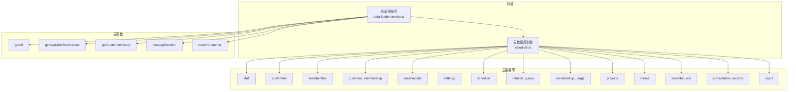
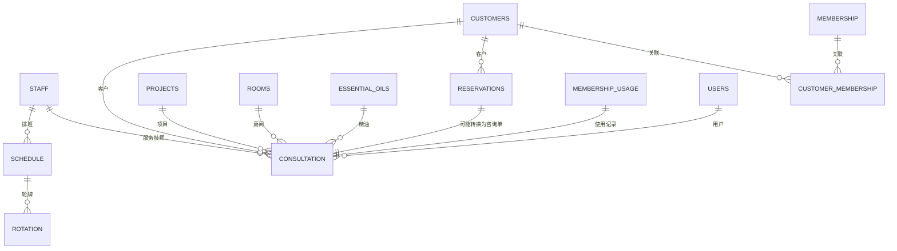
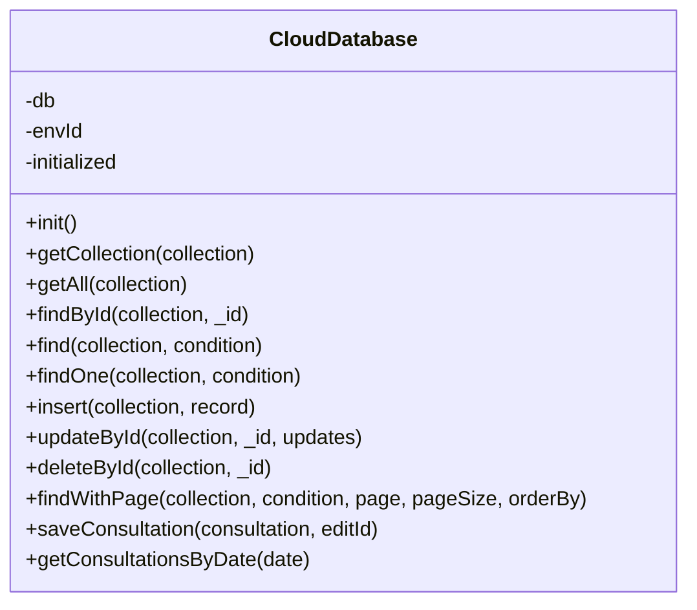
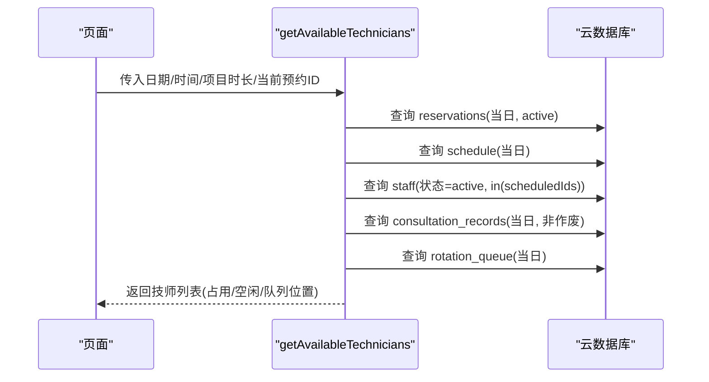
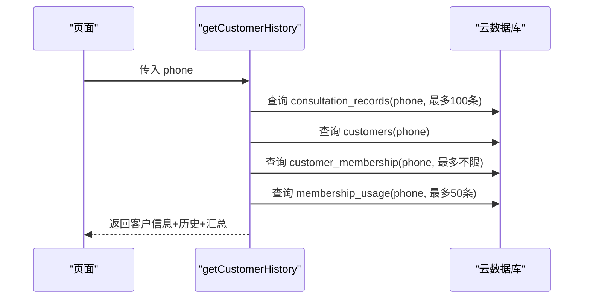
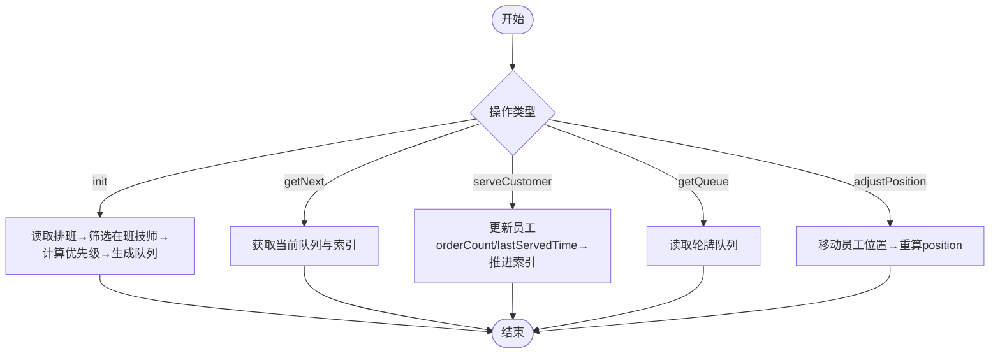
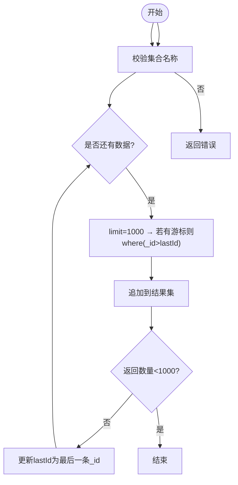
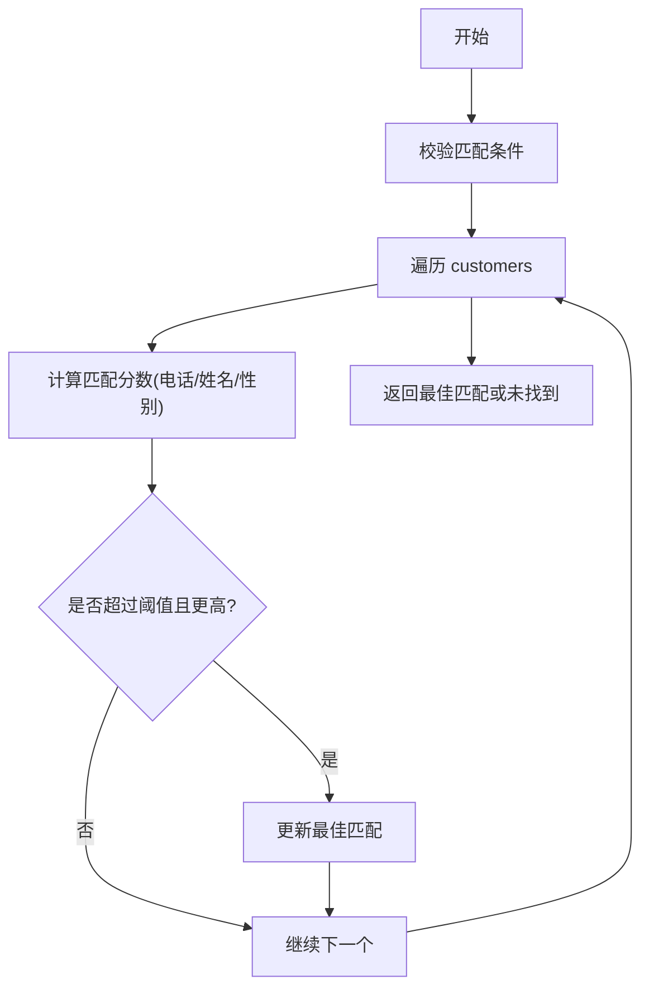
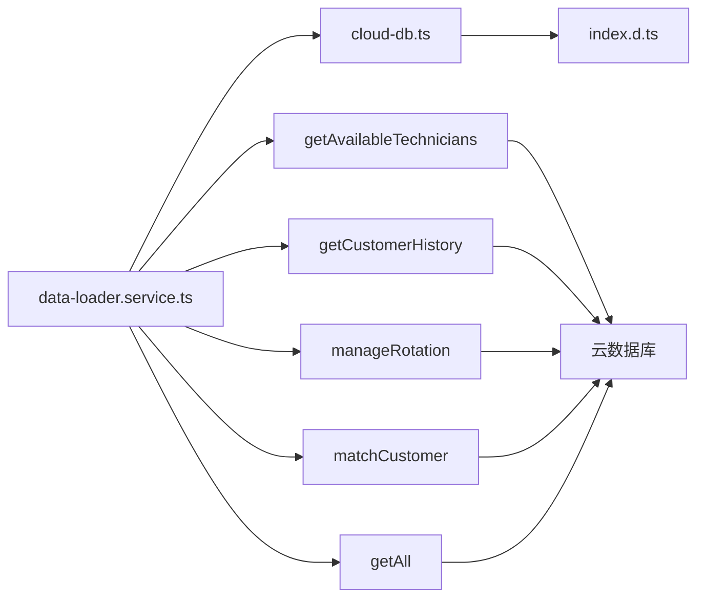

# 数据库架构图

<cite>
**本文档引用的文件**
- [cloud-db.ts](file://miniprogram/utils/cloud-db.ts)
- [index.d.ts](file://typings/index.d.ts)
- [lib.wx.cloud.d.ts](file://typings/types/wx/lib.wx.cloud.d.ts)
- [index.js (getAll)](file://cloudfunctions/getAll/index.js)
- [index.js (getAvailableTechnicians)](file://cloudfunctions/getAvailableTechnicians/index.js)
- [index.js (getCustomerHistory)](file://cloudfunctions/getCustomerHistory/index.js)
- [index.js (manageRotation)](file://cloudfunctions/manageRotation/index.js)
- [index.js (matchCustomer)](file://cloudfunctions/matchCustomer/index.js)
- [data-loader.service.ts](file://miniprogram/pages/index/services/data-loader.service.ts)
</cite>

## 目录
1. [简介](#简介)
2. [项目结构](#项目结构)
3. [核心组件](#核心组件)
4. [架构总览](#架构总览)
5. [详细组件分析](#详细组件分析)
6. [依赖分析](#依赖分析)
7. [性能考虑](#性能考虑)
8. [故障排查指南](#故障排查指南)
9. [结论](#结论)
10. [附录](#附录)

## 简介
本文件面向数据库架构与数据模型，基于现有代码库中的集合定义、查询逻辑与云函数实现，绘制完整的实体关系图（ER），说明各集合的用途、字段关系、查询路径与性能优化策略，并提供数据流图帮助开发者理解整体数据架构。

## 项目结构
该系统采用“小程序前端 + 云开发数据库 + 云托管云函数”的三层架构：
- 前端层：通过云数据库 SDK 进行 CRUD、分页与实时监听
- 云函数层：封装复杂查询、聚合与业务逻辑（如技师可用性、轮牌管理、客户历史）
- 数据存储层：基于微信云开发的集合（Collection）与文档（Document）

**图表来源**
- [cloud-db.ts](file://miniprogram/utils/cloud-db.ts#L1-L321)
- [index.d.ts](file://typings/index.d.ts#L1-L435)
- [index.js (getAll)](file://cloudfunctions/getAll/index.js#L1-L59)
- [index.js (getAvailableTechnicians)](file://cloudfunctions/getAvailableTechnicians/index.js#L1-L285)
- [index.js (getCustomerHistory)](file://cloudfunctions/getCustomerHistory/index.js#L1-L100)
- [index.js (manageRotation)](file://cloudfunctions/manageRotation/index.js#L1-L327)
- [index.js (matchCustomer)](file://cloudfunctions/matchCustomer/index.js#L1-L71)

**章节来源**
- [cloud-db.ts](file://miniprogram/utils/cloud-db.ts#L1-L321)
- [index.d.ts](file://typings/index.d.ts#L1-L435)

## 核心组件
- 云数据库封装类：提供统一的 CRUD、分页、按日期查询等能力，并对错误进行兜底处理
- 类型定义：集中定义了所有数据模型接口（如咨询单、技师、排班、预约、会员卡等）
- 云函数：封装复杂查询与业务逻辑，减少前端压力并提升可维护性
- 页面服务：负责调用云函数与数据库，组装页面所需的数据

**章节来源**
- [cloud-db.ts](file://miniprogram/utils/cloud-db.ts#L1-L321)
- [index.d.ts](file://typings/index.d.ts#L1-L435)
- [data-loader.service.ts](file://miniprogram/pages/index/services/data-loader.service.ts#L1-L206)

## 架构总览
下图展示了前端与云函数如何访问数据库集合，以及集合之间的潜在关联关系（基于字段名与业务语义推断）：

**图表来源**
- [index.d.ts](file://typings/index.d.ts#L89-L183)
- [index.js (getAvailableTechnicians)](file://cloudfunctions/getAvailableTechnicians/index.js#L26-L63)
- [index.js (manageRotation)](file://cloudfunctions/manageRotation/index.js#L38-L146)
- [index.js (getCustomerHistory)](file://cloudfunctions/getCustomerHistory/index.js#L22-L76)

## 详细组件分析

### 1) 云数据库封装（CloudDatabase）
职责与能力：
- 初始化与获取集合引用
- 统一的 CRUD 封装（新增、更新、删除、按ID查询）
- 条件查询与分页查询（含总数统计）
- 日期范围查询（正则匹配）
- 咨询单保存（新增或更新）

关键点：
- 所有写操作自动维护 createdAt/updatedAt 时间戳
- 查询异常时返回空结果，避免前端崩溃
- 分页查询通过并发执行 get 与 count 提升性能

**图表来源**
- [cloud-db.ts](file://miniprogram/utils/cloud-db.ts#L12-L299)

**章节来源**
- [cloud-db.ts](file://miniprogram/utils/cloud-db.ts#L12-L299)

### 2) 数据模型与字段关系
以下模型来自类型定义文件，字段含义与业务语义清晰，便于建立 ER 关系：

```mermaid
erDiagram
STAFF {
string _id PK
string name
string status
string gender
string avatar
string phone
string createdAt
string updatedAt
}
SCHEDULE {
string _id PK
string date
string staffId
string shift
string createdAt
string updatedAt
}
CONSULTATION {
string _id PK
string surname
string gender
string project
string technician
string room
string massageStrength
string essentialOil
json selectedParts
boolean isClockIn
string remarks
string phone
number extraTime
string couponCode
string couponPlatform
string date
string startTime
string endTime
boolean isVoided
number overtime
string createdAt
string updatedAt
}
CUSTOMERS {
string _id PK
string phone
string name
string gender
string responsibleTechnician
string licensePlate
string remarks
string createdAt
string updatedAt
}
RESERVATIONS {
string _id PK
string date
string customerName
string gender
string phone
string project
string technicianId
string technicianName
string startTime
string endTime
boolean isClockIn
string status
string genderRequirement
string createdAt
string updatedAt
}
PROJECTS {
string _id PK
string name
number duration
number price
boolean isEssentialOilOnly
string status
boolean needEssentialOil
number commission
string createdAt
string updatedAt
}
ROOMS {
string _id PK
string name
string status
string createdAt
string updatedAt
}
ESSENTIAL_OILS {
string _id PK
string name
string effect
string status
string createdAt
string updatedAt
}
MEMBERSHIP {
string _id PK
string name
string type
number originalPrice
number totalTimes
number balance
string project
string status
string createdAt
string updatedAt
}
CUSTOMER_MEMBERSHIP {
string _id PK
string customerId
string customerName
string customerPhone
string cardId
string cardName
number originalPrice
number paidAmount
number remainingTimes
string project
string salesStaff
string remarks
string status
string createdAt
string updatedAt
}
MEMBERSHIP_USAGE {
string _id PK
string cardId
string cardName
string date
string customerName
string project
string technician
string room
string consultationId
string createdAt
string updatedAt
}
USERS {
string _id PK
string openId
string unionId
string nickName
string avatarUrl
string phone
string role
string status
string staffId
string staffName
string department
string createdAt
string updatedAt
}
```

**图表来源**
- [index.d.ts](file://typings/index.d.ts#L89-L183)

**章节来源**
- [index.d.ts](file://typings/index.d.ts#L89-L183)

### 3) 云函数与查询流程

#### 3.1 技师可用性查询（getAvailableTechnicians）
流程要点：
- 读取当日排班与有效技师
- 合并当前咨询单与预约冲突时间段
- 计算轮牌队列位置，输出占用/空闲状态

**图表来源**
- [index.js (getAvailableTechnicians)](file://cloudfunctions/getAvailableTechnicians/index.js#L9-L124)

**章节来源**
- [index.js (getAvailableTechnicians)](file://cloudfunctions/getAvailableTechnicians/index.js#L9-L124)

#### 3.2 客户历史查询（getCustomerHistory）
流程要点：
- 依据手机号查询最近咨询单、客户信息、会员卡与使用记录
- 对咨询单进行裁剪与汇总（总次数、总金额）

**图表来源**
- [index.js (getCustomerHistory)](file://cloudfunctions/getCustomerHistory/index.js#L9-L99)

**章节来源**
- [index.js (getCustomerHistory)](file://cloudfunctions/getCustomerHistory/index.js#L9-L99)

#### 3.3 轮牌管理（manageRotation）
流程要点：
- 初始化：根据排班与昨日轮牌优先级生成队列
- 服务完成：更新员工服务次数与位置，推进当前索引
- 调整位置：支持手动调整队列顺序

**图表来源**
- [index.js (manageRotation)](file://cloudfunctions/manageRotation/index.js#L9-L327)

**章节来源**
- [index.js (manageRotation)](file://cloudfunctions/manageRotation/index.js#L9-L327)

#### 3.4 全量数据拉取（getAll）
流程要点：
- 分页游标拉取（每页最多1000条），避免超大数据集一次性传输

**图表来源**
- [index.js (getAll)](file://cloudfunctions/getAll/index.js#L9-L58)

**章节来源**
- [index.js (getAll)](file://cloudfunctions/getAll/index.js#L9-L58)

#### 3.5 客户匹配（matchCustomer）
流程要点：
- 全量扫描 customers 集合，按手机号/姓名/性别评分，返回最佳匹配

**图表来源**
- [index.js (matchCustomer)](file://cloudfunctions/matchCustomer/index.js#L9-L70)

**章节来源**
- [index.js (matchCustomer)](file://cloudfunctions/matchCustomer/index.js#L9-L70)

## 依赖分析
- 前端依赖：cloud-db.ts 依赖微信云开发类型声明（lib.wx.cloud.d.ts）
- 云函数依赖：各云函数直接使用云数据库 SDK 进行集合查询与更新
- 集合依赖：多个集合之间通过字段名（如 technician/technicianName、staffId、customerId 等）形成弱外键关系；实际约束由应用层保证

**图表来源**
- [cloud-db.ts](file://miniprogram/utils/cloud-db.ts#L1-L321)
- [index.d.ts](file://typings/index.d.ts#L1-L435)
- [data-loader.service.ts](file://miniprogram/pages/index/services/data-loader.service.ts#L1-L206)
- [index.js (getAll)](file://cloudfunctions/getAll/index.js#L1-L59)
- [index.js (getAvailableTechnicians)](file://cloudfunctions/getAvailableTechnicians/index.js#L1-L285)
- [index.js (getCustomerHistory)](file://cloudfunctions/getCustomerHistory/index.js#L1-L100)
- [index.js (manageRotation)](file://cloudfunctions/manageRotation/index.js#L1-L327)
- [index.js (matchCustomer)](file://cloudfunctions/matchCustomer/index.js#L1-L71)

**章节来源**
- [cloud-db.ts](file://miniprogram/utils/cloud-db.ts#L1-L321)
- [index.d.ts](file://typings/index.d.ts#L1-L435)
- [data-loader.service.ts](file://miniprogram/pages/index/services/data-loader.service.ts#L1-L206)

## 性能考虑
- 查询优化
  - 使用索引字段进行过滤：date、status、phone、technician/technicianName、staffId、customerId 等
  - 对高频查询（如按日期、状态）建立复合索引
  - 分页查询使用 skip/limit 并行统计总数，避免全表扫描
- 写入优化
  - 批量写入时注意事务与幂等性，避免重复数据
  - 更新时仅变更字段，减少冗余写入
- 云函数优化
  - getAll 使用游标分页，避免单次传输过大
  - getAvailableTechnicians 合理合并查询，减少多次往返
- 缓存策略
  - 前端对常用静态数据（项目、房间、精油）进行本地缓存
  - 对于高频读取的集合，可在云函数侧做短期缓存（需自行扩展）

[本节为通用性能建议，不直接分析具体文件]

## 故障排查指南
- 常见问题
  - 集合未初始化：检查环境变量与初始化逻辑
  - 查询无结果：确认查询条件与索引字段是否匹配
  - 更新失败：检查文档是否存在、字段类型是否正确
- 日志与诊断
  - 云函数返回 code/message 字段，前端据此提示用户
  - 建议在云函数中增加更详细的错误日志与参数校验
- 数据一致性
  - 对关键业务（轮牌、技师占用）采用原子更新或队列化处理
  - 对外键字段（如 technician、staffId、customerId）在写入前进行存在性校验

**章节来源**
- [cloud-db.ts](file://miniprogram/utils/cloud-db.ts#L93-L203)
- [index.js (getAll)](file://cloudfunctions/getAll/index.js#L12-L17)
- [index.js (getAvailableTechnicians)](file://cloudfunctions/getAvailableTechnicians/index.js#L16-L21)
- [index.js (getCustomerHistory)](file://cloudfunctions/getCustomerHistory/index.js#L13-L18)
- [index.js (manageRotation)](file://cloudfunctions/manageRotation/index.js#L24-L29)
- [index.js (matchCustomer)](file://cloudfunctions/matchCustomer/index.js#L12-L18)

## 结论
本数据库架构以集合为中心，通过云数据库与云函数实现松耦合的数据访问与业务处理。类型定义明确了数据模型，前端封装提供了统一的 CRUD 能力，云函数承担复杂查询与业务编排。建议后续引入索引策略、缓存与事务控制，进一步提升性能与一致性保障。

[本节为总结性内容，不直接分析具体文件]

## 附录

### A. 集合用途与典型查询
- staff/schedule：排班与技师信息，支撑可用性计算
- customers/reservations：客户与预约，用于冲突检测与匹配
- consultation_records：咨询单，核心业务数据
- projects/rooms/essential_oils：基础字典与配置
- membership/customer_membership/membership_usage：会员体系
- rotation_queue：轮牌队列
- users：用户与权限

**章节来源**
- [index.d.ts](file://typings/index.d.ts#L89-L183)
- [index.js (getAvailableTechnicians)](file://cloudfunctions/getAvailableTechnicians/index.js#L26-L63)
- [index.js (getCustomerHistory)](file://cloudfunctions/getCustomerHistory/index.js#L22-L76)
- [index.js (manageRotation)](file://cloudfunctions/manageRotation/index.js#L38-L146)

### B. 查询与索引建议
- 常用过滤字段
  - date：consultation_records、reservations、schedule、rotation_queue
  - status：reservations、staff、membership、customer_membership
  - phone：customers、consultation_records、customer_membership、membership_usage
  - technician/technicianName：consultation_records、reservations
  - staffId：schedule、rotation_queue
  - customerId：customer_membership、membership_usage
- 建议索引
  - 复合索引：date+status、phone、technician+date、staffId+date
  - 正则查询（如按日期前缀）建议改为精确字段或前缀索引

**章节来源**
- [cloud-db.ts](file://miniprogram/utils/cloud-db.ts#L283-L298)
- [index.js (getAvailableTechnicians)](file://cloudfunctions/getAvailableTechnicians/index.js#L26-L63)
- [index.js (getCustomerHistory)](file://cloudfunctions/getCustomerHistory/index.js#L22-L76)