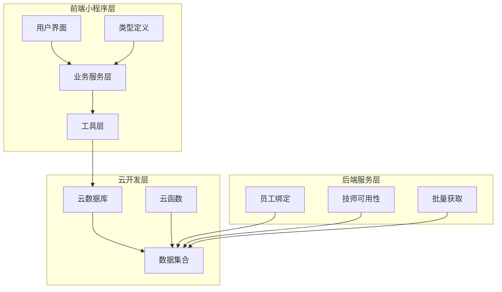
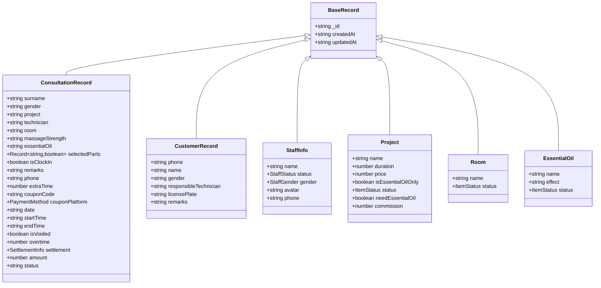
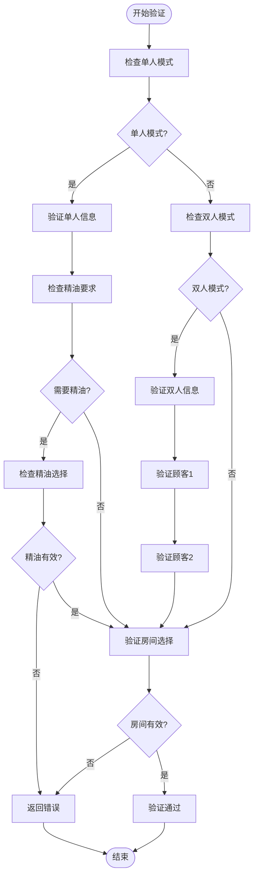
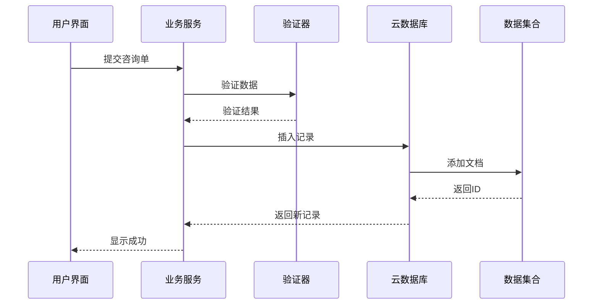
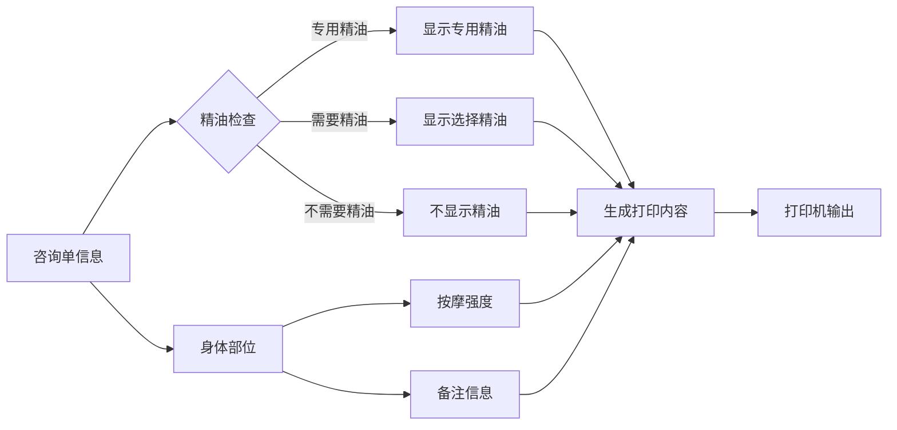
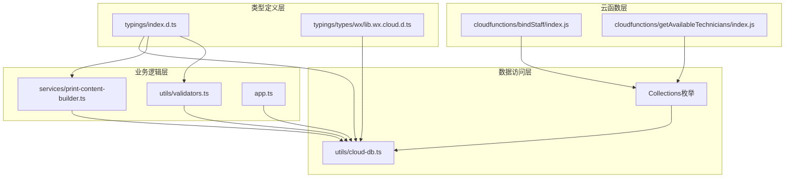

# 数据模型定义

<cite>
**本文档引用的文件**
- [typings/index.d.ts](file://typings/index.d.ts)
- [miniprogram/utils/cloud-db.ts](file://miniprogram/utils/cloud-db.ts)
- [miniprogram/services/print-content-builder.ts](file://miniprogram/services/print-content-builder.ts)
- [miniprogram/pages/index/index.ts](file://miniprogram/pages/index/index.ts)
- [miniprogram/utils/validators.ts](file://miniprogram/utils/validators.ts)
- [miniprogram/app.ts](file://miniprogram/app.ts)
- [cloudfunctions/bindStaff/index.js](file://cloudfunctions/bindStaff/index.js)
- [cloudfunctions/getAvailableTechnicians/index.js](file://cloudfunctions/getAvailableTechnicians/index.js)
- [typings/types/wx/lib.wx.cloud.d.ts](file://typings/types/wx/lib.wx.cloud.d.ts)
</cite>

## 目录
1. [简介](#简介)
2. [项目结构](#项目结构)
3. [核心数据模型](#核心数据模型)
4. [架构概览](#架构概览)
5. [详细组件分析](#详细组件分析)
6. [依赖关系分析](#依赖关系分析)
7. [性能考虑](#性能考虑)
8. [故障排除指南](#故障排除指南)
9. [结论](#结论)

## 简介

本文件为咨询打印系统的核心数据模型定义文档，详细说明了所有关键数据实体的字段定义、数据类型和业务含义。系统采用微信小程序云开发技术栈，主要涉及以下核心实体：

- **ConsultationRecord** 咨询单记录
- **CustomerRecord** 客户记录  
- **StaffInfo** 技师信息
- **Project** 按摩项目
- **Room** 房间信息
- **EssentialOil** 精油信息

系统通过统一的BaseRecord基类实现标准化的数据结构，并通过CloudDatabase提供完整的CRUD操作能力。

## 项目结构

系统采用分层架构设计，主要分为前端小程序层和云函数层：

**图表来源**
- [miniprogram/utils/cloud-db.ts](file://miniprogram/utils/cloud-db.ts#L1-L200)
- [cloudfunctions/bindStaff/index.js](file://cloudfunctions/bindStaff/index.js#L121-L188)

**章节来源**
- [miniprogram/utils/cloud-db.ts](file://miniprogram/utils/cloud-db.ts#L1-L200)
- [typings/index.d.ts](file://typings/index.d.ts#L1-L50)

## 核心数据模型

### BaseRecord 基础记录

所有数据模型都继承自BaseRecord基类，提供统一的标识和时间戳管理：

| 字段名 | 类型 | 必填 | 默认值 | 业务含义 |
|--------|------|------|--------|----------|
| `_id` | string | 是 | - | 文档唯一标识符 |
| `createdAt` | string | 是 | 当前时间 | 创建时间（ISO格式） |
| `updatedAt` | string | 是 | 当前时间 | 最后更新时间（ISO格式） |

### ConsultationRecord 咨询单记录

咨询单记录是系统的核心业务实体，用于记录每次按摩服务的完整信息。

**字段定义：**

| 字段名 | 类型 | 必填 | 默认值 | 业务含义 |
|--------|------|------|--------|----------|
| `surname` | string | 是 | "" | 客户姓氏 |
| `gender` | "male" \| "female" \| "" | 是 | "" | 性别 |
| `project` | string | 是 | "" | 项目名称 |
| `technician` | string | 是 | "" | 技师ID |
| `room` | string | 是 | "" | 房间ID |
| `massageStrength` | "standard" \| "soft" \| "gravity" \| "" | 是 | "" | 按摩强度 |
| `essentialOil` | string | 是 | "" | 精油ID |
| `selectedParts` | Record<string, boolean> | 是 | {} | 选择的身体部位 |
| `isClockIn` | boolean | 是 | false | 是否报钟 |
| `remarks` | string | 是 | "" | 备注信息 |
| `phone` | string | 是 | "" | 客户电话 |
| `extraTime` | number | 是 | 0 | 加钟数（半小时为单位） |
| `couponCode` | string | 是 | "" | 优惠券码 |
| `couponPlatform` | PaymentMethod | 是 | "" | 优惠平台 |
| `date` | string | 是 | 当前日期 | 服务日期（YYYY-MM-DD） |
| `startTime` | string | 是 | "" | 报钟时间（HH:MM） |
| `endTime` | string | 是 | "" | 结束时间（HH:MM） |
| `licensePlate` | string | 否 | undefined | 车牌号 |
| `isVoided` | boolean | 是 | false | 是否作废 |
| `overtime` | number | 是 | 0 | 加班数（半小时为单位） |
| `settlement` | SettlementInfo | 否 | undefined | 结算信息 |
| `amount` | number | 否 | undefined | 金额 |
| `status` | "active" \| "cancelled" \| 'arrived' | 是 | "active" | 记录状态 |

**业务约束：**
- 必须包含至少一个身体部位
- 精油选择遵循项目要求
- 时间格式必须符合HH:MM规范
- 报钟时间不能早于当前时间

### CustomerRecord 客户记录

客户基本信息管理实体。

**字段定义：**

| 字段名 | 类型 | 必填 | 默认值 | 业务含义 |
|--------|------|------|--------|----------|
| `phone` | string | 是 | "" | 手机号码 |
| `name` | string | 是 | "" | 客户姓名 |
| `gender` | 'male' \| 'female' \| '' | 是 | "" | 性别 |
| `responsibleTechnician` | string | 是 | "" | 责任技师ID |
| `licensePlate` | string | 是 | "" | 车牌号 |
| `remarks` | string | 是 | "" | 备注信息 |

**业务规则：**
- 手机号码必须唯一
- 责任技师必须为有效技师
- 支持空性别字段表示未知

### StaffInfo 技师信息

技师档案管理实体。

**字段定义：**

| 字段名 | 类型 | 必填 | 默认值 | 业务含义 |
|--------|------|------|--------|----------|
| `name` | string | 是 | "" | 姓名 |
| `status` | StaffStatus | 是 | "active" | 状态 |
| `gender` | StaffGender | 是 | "male" | 性别 |
| `avatar` | string | 是 | "" | 头像URL |
| `phone` | string | 是 | "" | 联系电话 |

**状态枚举：**
- `active`: 在职
- `disabled`: 离职

### Project 按摩项目

按摩项目配置实体。

**字段定义：**

| 字段名 | 类型 | 必填 | 默认值 | 业务含义 |
|--------|------|------|--------|----------|
| `name` | string | 是 | "" | 项目名称 |
| `duration` | number | 是 | 0 | 预计时长（分钟） |
| `price` | number | 否 | undefined | 价格 |
| `isEssentialOilOnly` | boolean | 否 | false | 是否专用精油项目 |
| `status` | ItemStatus | 是 | "normal" | 状态 |
| `needEssentialOil` | boolean | 否 | false | 是否需要精油 |
| `commission` | number | 是 | 0 | 提成比例 |

**状态枚举：**
- `normal`: 正常
- `disabled`: 停用

### Room 房间信息

房间资源配置实体。

**字段定义：**

| 字段名 | 类型 | 必填 | 默认值 | 业务含义 |
|--------|------|------|--------|----------|
| `name` | string | 是 | "" | 房间名称 |
| `status` | ItemStatus | 是 | "normal" | 状态 |

### EssentialOil 精油信息

精油产品管理实体。

**字段定义：**

| 字段名 | 类型 | 必填 | 默认值 | 业务含义 |
|--------|------|------|--------|----------|
| `name` | string | 是 | "" | 精油名称 |
| `effect` | string | 是 | "" | 功效描述 |
| `status` | ItemStatus | 是 | "normal" | 状态 |

**章节来源**
- [typings/index.d.ts](file://typings/index.d.ts#L37-L219)

## 架构概览

系统采用前后端分离架构，通过云数据库实现数据持久化：

**图表来源**
- [typings/index.d.ts](file://typings/index.d.ts#L1-L219)

## 详细组件分析

### 数据验证流程

系统实现了多层次的数据验证机制：

**图表来源**
- [miniprogram/utils/validators.ts](file://miniprogram/utils/validators.ts#L6-L72)

**章节来源**
- [miniprogram/utils/validators.ts](file://miniprogram/utils/validators.ts#L1-L81)

### 数据持久化流程

**图表来源**
- [miniprogram/utils/cloud-db.ts](file://miniprogram/utils/cloud-db.ts#L136-L165)
- [miniprogram/utils/validators.ts](file://miniprogram/utils/validators.ts#L6-L24)

**章节来源**
- [miniprogram/utils/cloud-db.ts](file://miniprogram/utils/cloud-db.ts#L136-L188)

### 打印内容生成

系统根据咨询单信息生成打印内容：

**图表来源**
- [miniprogram/services/print-content-builder.ts](file://miniprogram/services/print-content-builder.ts#L31-L80)

**章节来源**
- [miniprogram/services/print-content-builder.ts](file://miniprogram/services/print-content-builder.ts#L1-L102)

## 依赖关系分析

系统各模块间的依赖关系如下：

**图表来源**
- [typings/index.d.ts](file://typings/index.d.ts#L303-L318)
- [miniprogram/utils/cloud-db.ts](file://miniprogram/utils/cloud-db.ts#L303-L318)

**章节来源**
- [typings/index.d.ts](file://typings/index.d.ts#L303-L318)
- [miniprogram/utils/cloud-db.ts](file://miniprogram/utils/cloud-db.ts#L303-L320)

## 性能考虑

### 查询优化策略

1. **索引设计**
   - 建议在常用查询字段上建立索引
   - `createdAt` 字段用于日期范围查询
   - `technician` 字段用于技师筛选

2. **批量操作**
   - 使用 `Promise.all()` 并行加载多个数据集合
   - 批量获取数据减少网络往返

3. **缓存策略**
   - 应用级全局数据缓存
   - 避免重复的数据库查询

### 内存管理

- 合理使用 TypeScript 的类型系统避免运行时错误
- 及时清理事件监听器和定时器
- 控制数组和对象的大小，避免内存泄漏

## 故障排除指南

### 常见问题及解决方案

**1. 数据验证失败**
- 检查必填字段是否完整
- 确认数据类型符合要求
- 验证业务规则约束

**2. 数据库操作异常**
- 检查网络连接状态
- 验证用户权限
- 确认集合存在且有正确权限

**3. 打印机输出问题**
- 检查打印机连接状态
- 验证打印内容格式
- 确认字符编码正确

**章节来源**
- [miniprogram/utils/validators.ts](file://miniprogram/utils/validators.ts#L74-L81)
- [miniprogram/utils/cloud-db.ts](file://miniprogram/utils/cloud-db.ts#L170-L203)

## 结论

本数据模型定义文档详细阐述了咨询打印系统的核心数据结构，包括：

1. **标准化的数据模型**：通过BaseRecord基类实现统一的标识和时间戳管理
2. **完整的业务覆盖**：涵盖咨询单、客户、技师、项目、房间、精油等核心实体
3. **严格的验证机制**：多层数据验证确保数据质量和业务逻辑正确性
4. **清晰的架构设计**：前后端分离，职责明确，便于维护和扩展

系统采用的云开发架构提供了良好的可扩展性和维护性，建议在实际部署时根据业务需求进一步完善数据模型和业务逻辑。