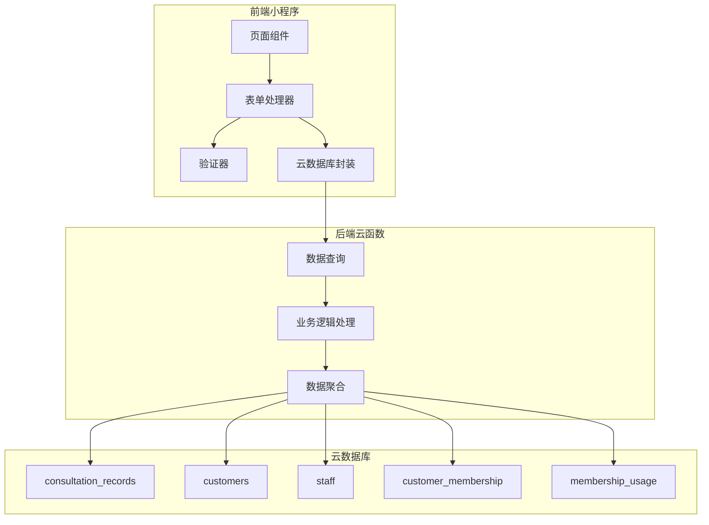
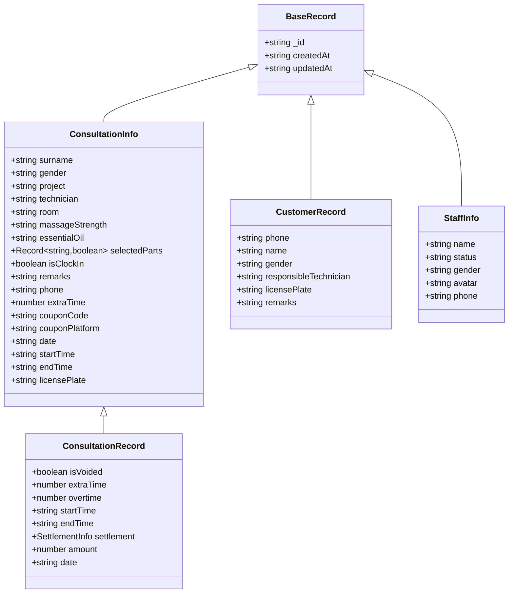
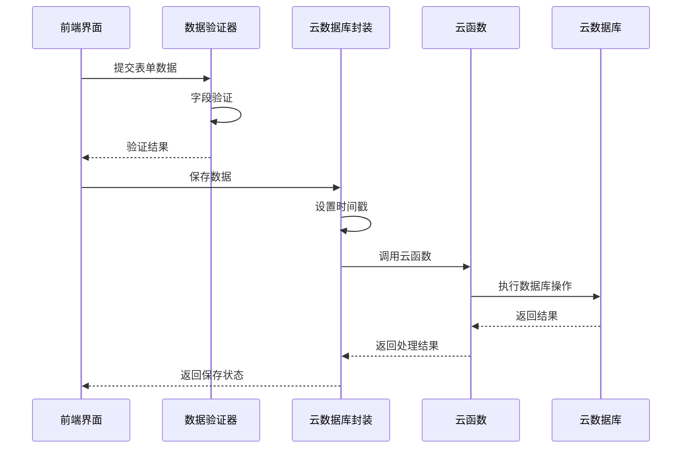
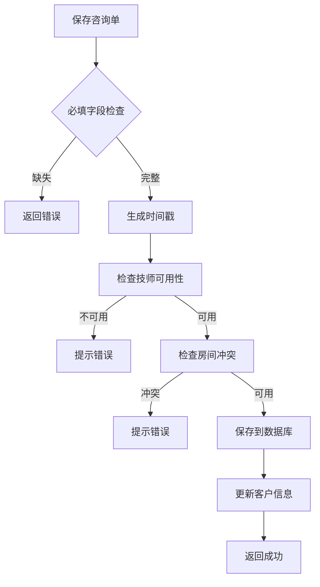
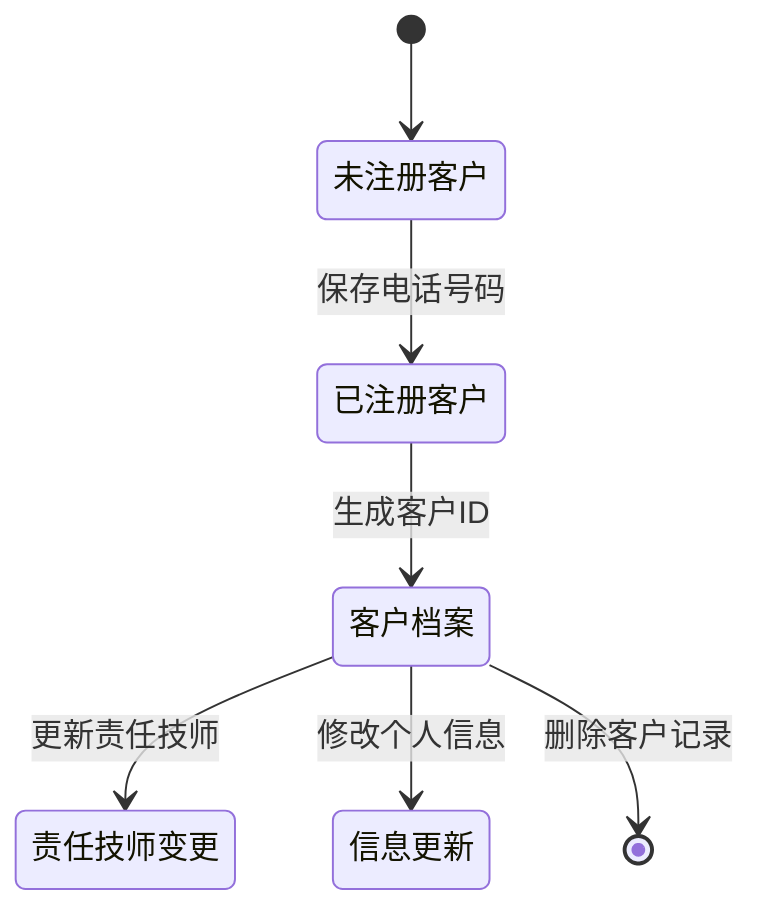
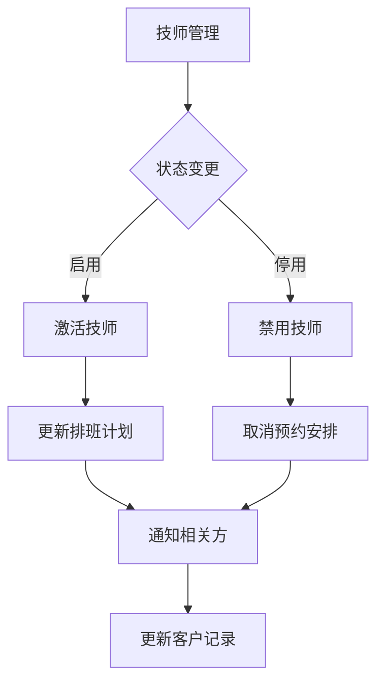
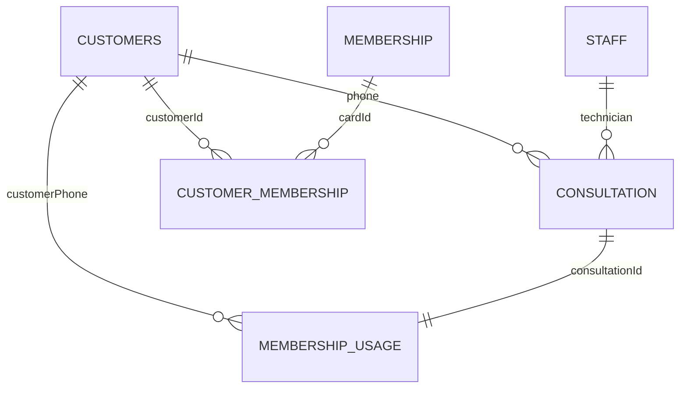
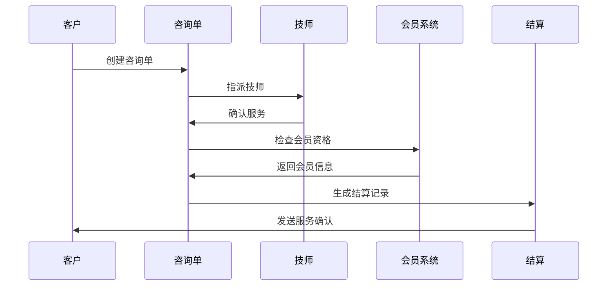
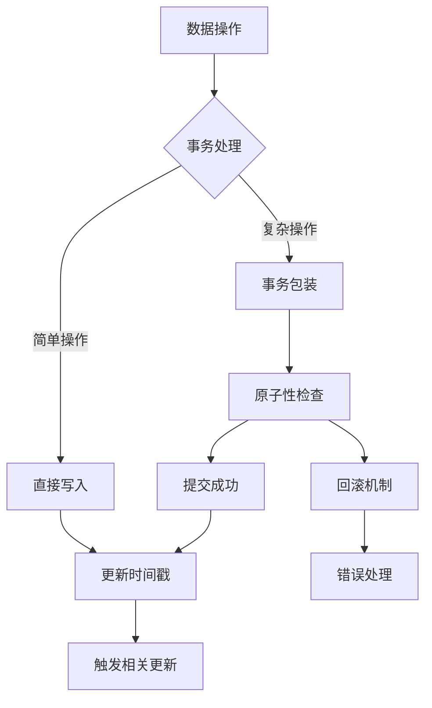

# 核心数据模型

<cite>
**本文档引用的文件**
- [typings/index.d.ts](file://typings/index.d.ts)
- [miniprogram/utils/cloud-db.ts](file://miniprogram/utils/cloud-db.ts)
- [miniprogram/pages/index/utils/reservation-utils.ts](file://miniprogram/pages/index/utils/reservation-utils.ts)
- [miniprogram/utils/validators.ts](file://miniprogram/utils/validators.ts)
- [cloudfunctions/getCustomerHistory/index.js](file://cloudfunctions/getCustomerHistory/index.js)
- [cloudfunctions/getAnalytics/index.js](file://cloudfunctions/getAnalytics/index.js)
- [cloudfunctions/bindStaff/index.js](file://cloudfunctions/bindStaff/index.js)
</cite>

## 目录
1. [简介](#简介)
2. [项目结构](#项目结构)
3. [核心组件](#核心组件)
4. [架构概览](#架构概览)
5. [详细组件分析](#详细组件分析)
6. [依赖分析](#依赖分析)
7. [性能考虑](#性能考虑)
8. [故障排除指南](#故障排除指南)
9. [结论](#结论)

## 简介

本文件详细阐述ConsultationPrinter小程序的核心数据模型，重点分析以下关键实体：

- **ConsultationRecord**：咨询单记录
- **CustomerRecord**：客户记录  
- **StaffInfo**：技师信息

这些模型构成了系统业务流程的基础，包括客户管理、技师排班、预约处理、结算流程等核心功能。

## 项目结构

项目采用前后端分离架构，核心数据模型定义在TypeScript类型文件中，前端通过云数据库操作接口与后端云函数交互。



**图表来源**
- [typings/index.d.ts](file://typings/index.d.ts#L1-L435)
- [miniprogram/utils/cloud-db.ts](file://miniprogram/utils/cloud-db.ts#L118-L223)

## 核心组件

### 基础记录接口

所有数据模型都继承自BaseRecord基础接口，确保统一的数据结构规范。



**图表来源**
- [typings/index.d.ts](file://typings/index.d.ts#L1-L435)

**章节来源**
- [typings/index.d.ts](file://typings/index.d.ts#L1-L435)

## 架构概览

系统采用三层架构设计，确保数据模型的一致性和业务逻辑的清晰分离。



**图表来源**
- [miniprogram/utils/validators.ts](file://miniprogram/utils/validators.ts#L6-L24)
- [miniprogram/utils/cloud-db.ts](file://miniprogram/utils/cloud-db.ts#L136-L165)
- [cloudfunctions/getCustomerHistory/index.js](file://cloudfunctions/getCustomerHistory/index.js#L22-L47)

## 详细组件分析

### ConsultationRecord 咨询单记录

#### 字段定义与数据类型

| 字段名 | 类型 | 必填 | 默认值 | 业务含义 |
|--------|------|------|--------|----------|
| _id | string | 是 | 自动生成 | 文档唯一标识符 |
| createdAt | string | 是 | 自动生成 | 创建时间（ISO格式） |
| updatedAt | string | 是 | 自动生成 | 更新时间（ISO格式） |
| surname | string | 是 | 空字符串 | 客户姓氏 |
| gender | "male"\|"female"\|"" | 是 | "" | 客户性别 |
| project | string | 是 | 空字符串 | 服务项目名称 |
| technician | string | 是 | 空字符串 | 指派技师ID |
| room | string | 是 | 空字符串 | 服务房间 |
| massageStrength | "standard"\|"soft"\|"gravity"\|"" | 否 | "" | 按摩强度 |
| essentialOil | string | 否 | 空字符串 | 精油选择 |
| selectedParts | Record<string,boolean> | 否 | {} | 选择的身体部位 |
| isClockIn | boolean | 否 | false | 是否报钟 |
| remarks | string | 否 | 空字符串 | 备注信息 |
| phone | string | 是 | 空字符串 | 客户电话号码 |
| extraTime | number | 否 | 0 | 加钟数量（半小时为单位） |
| overtime | number | 否 | 0 | 加班数量（半小时为单位） |
| startTime | string | 否 | 空字符串 | 报钟时间（HH:MM） |
| endTime | string | 否 | 空字符串 | 结束时间（HH:MM） |
| isVoided | boolean | 否 | false | 是否作废 |
| settlement | SettlementInfo | 否 | undefined | 结算信息 |
| amount | number | 否 | undefined | 实际金额 |
| date | string | 否 | 空字符串 | 服务日期（YYYY-MM-DD） |
| couponCode | string | 否 | 空字符串 | 优惠券代码 |
| couponPlatform | PaymentMethod | 否 | "cash" | 支付平台 |

#### 主键与外键关系

- **主键**：_id（MongoDB自动生成）
- **外键关系**：
  - technician → staff._id
  - phone → customers.phone

#### 数据完整性规则



**图表来源**
- [miniprogram/utils/validators.ts](file://miniprogram/utils/validators.ts#L6-L24)
- [miniprogram/pages/index/utils/reservation-utils.ts](file://miniprogram/pages/index/utils/reservation-utils.ts#L147-L171)

#### JSON数据示例

```json
{
  "_id": "64b8f0a1e4b0a1a1a1a1a1a1",
  "createdAt": "2023-07-15T09:30:00Z",
  "updatedAt": "2023-07-15T09:30:00Z",
  "surname": "张",
  "gender": "male",
  "project": "泰式按摩",
  "technician": "staff_001",
  "room": "Room101",
  "massageStrength": "standard",
  "essentialOil": "薰衣草",
  "selectedParts": {
    "肩膀": true,
    "背部": true,
    "腿部": false
  },
  "isClockIn": true,
  "remarks": "客户有高血压病史",
  "phone": "13800138000",
  "extraTime": 0,
  "overtime": 0,
  "startTime": "09:30",
  "endTime": "11:00",
  "isVoided": false,
  "amount": 180,
  "date": "2023-07-15",
  "couponCode": "",
  "couponPlatform": "cash"
}
```

**章节来源**
- [typings/index.d.ts](file://typings/index.d.ts#L37-L83)
- [miniprogram/utils/validators.ts](file://miniprogram/utils/validators.ts#L6-L24)

### CustomerRecord 客户记录

#### 字段定义与数据类型

| 字段名 | 类型 | 必填 | 默认值 | 业务含义 |
|--------|------|------|--------|----------|
| _id | string | 是 | 自动生成 | 文档唯一标识符 |
| createdAt | string | 是 | 自动生成 | 创建时间 |
| updatedAt | string | 是 | 自动生成 | 更新时间 |
| phone | string | 是 | 空字符串 | 客户电话号码（唯一索引） |
| name | string | 是 | 空字符串 | 客户姓名 |
| gender | "male"\|"female"\|"" | 否 | "" | 客户性别 |
| responsibleTechnician | string | 否 | 空字符串 | 责任技师ID |
| licensePlate | string | 否 | 空字符串 | 车牌号码 |
| remarks | string | 否 | 空字符串 | 备注信息 |

#### 主键与外键关系

- **主键**：_id
- **唯一约束**：phone（数据库层面保证唯一性）
- **外键关系**：responsibleTechnician → staff._id

#### 数据完整性规则



**图表来源**
- [miniprogram/pages/index/utils/reservation-utils.ts](file://miniprogram/pages/index/utils/reservation-utils.ts#L147-L171)

#### JSON数据示例

```json
{
  "_id": "customer_001",
  "createdAt": "2023-01-15T10:20:00Z",
  "updatedAt": "2023-07-15T14:30:00Z",
  "phone": "13800138000",
  "name": "张先生",
  "gender": "male",
  "responsibleTechnician": "staff_001",
  "licensePlate": "粤B12345",
  "remarks": "VIP客户，推荐技师李师傅"
}
```

**章节来源**
- [typings/index.d.ts](file://typings/index.d.ts#L136-L144)

### StaffInfo 技师信息

#### 字段定义与数据类型

| 字段名 | 类型 | 必填 | 默认值 | 业务含义 |
|--------|------|------|--------|----------|
| _id | string | 是 | 自动生成 | 文档唯一标识符 |
| createdAt | string | 是 | 自动生成 | 创建时间 |
| updatedAt | string | 是 | 自动生成 | 更新时间 |
| name | string | 是 | 空字符串 | 技师姓名 |
| status | "active"\|"disabled" | 是 | "active" | 技师状态 |
| gender | "male"\|"female" | 是 | 空字符串 | 技师性别 |
| avatar | string | 否 | 空字符串 | 头像URL |
| phone | string | 是 | 空字符串 | 联系电话 |

#### 主键与外键关系

- **主键**：_id
- **状态枚举**：status ∈ {"active", "disabled"}

#### 数据完整性规则



**图表来源**
- [cloudfunctions/bindStaff/index.js](file://cloudfunctions/bindStaff/index.js#L121-L140)

#### JSON数据示例

```json
{
  "_id": "staff_001",
  "createdAt": "2022-06-01T09:00:00Z",
  "updatedAt": "2023-07-15T08:45:00Z",
  "name": "李师傅",
  "status": "active",
  "gender": "male",
  "avatar": "https://example.com/avatar/staff_001.jpg",
  "phone": "13900139000"
}
```

**章节来源**
- [typings/index.d.ts](file://typings/index.d.ts#L89-L96)

## 依赖分析

### 数据模型依赖关系



**图表来源**
- [typings/index.d.ts](file://typings/index.d.ts#L136-L183)
- [cloudfunctions/getCustomerHistory/index.js](file://cloudfunctions/getCustomerHistory/index.js#L49-L76)

### 业务流程依赖



**图表来源**
- [cloudfunctions/getAnalytics/index.js](file://cloudfunctions/getAnalytics/index.js#L53-L96)

**章节来源**
- [typings/index.d.ts](file://typings/index.d.ts#L136-L183)

## 性能考虑

### 查询优化策略

1. **索引设计**
   - customers.phone: 唯一索引，用于快速查找客户
   - consultation_records.date: 复合索引，支持日期范围查询
   - consultation_records.technician: 索引，支持技师查询

2. **分页查询**
   - getAll云函数实现分页查询，避免一次性加载大量数据
   - getConsultationsByDate使用正则表达式进行日期过滤

3. **缓存策略**
   - 前端缓存常用数据（项目、房间、精油列表）
   - 云函数缓存查询结果，减少重复计算

### 数据一致性保证



**图表来源**
- [miniprogram/utils/cloud-db.ts](file://miniprogram/utils/cloud-db.ts#L136-L165)

## 故障排除指南

### 常见问题及解决方案

1. **数据验证失败**
   - 检查必填字段是否完整
   - 验证数据类型是否正确
   - 确认枚举值在允许范围内

2. **数据库操作异常**
   - 检查网络连接状态
   - 验证权限配置
   - 查看云函数日志

3. **数据同步问题**
   - 确认时间戳更新机制
   - 检查并发访问控制
   - 验证事务完整性

**章节来源**
- [miniprogram/utils/validators.ts](file://miniprogram/utils/validators.ts#L6-L24)
- [miniprogram/utils/cloud-db.ts](file://miniprogram/utils/cloud-db.ts#L170-L188)

## 结论

本核心数据模型设计遵循了以下原则：

1. **统一性**：所有模型继承BaseRecord，确保一致的数据结构
2. **完整性**：涵盖业务全流程所需的关键字段
3. **扩展性**：预留可选字段，支持业务发展需求
4. **安全性**：通过验证器和权限控制确保数据质量
5. **性能**：合理的索引设计和查询优化策略

通过这些数据模型的有效组织和管理，系统能够稳定地支撑咨询单管理、客户关系维护、技师调度等核心业务功能，为后续的功能扩展奠定了坚实的基础。