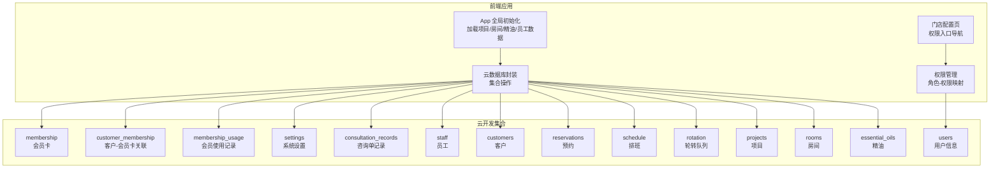
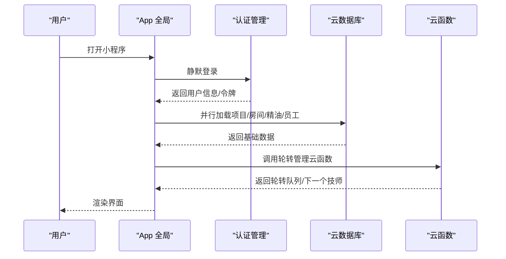
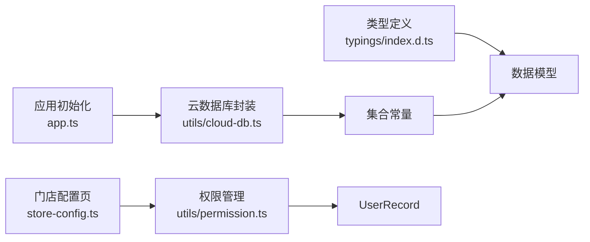

# 系统配置模型

<cite>
**本文档引用的文件**
- [typings/index.d.ts](file://typings/index.d.ts)
- [miniprogram/utils/cloud-db.ts](file://miniprogram/utils/cloud-db.ts)
- [miniprogram/utils/permission.ts](file://miniprogram/utils/permission.ts)
- [miniprogram/app.ts](file://miniprogram/app.ts)
- [miniprogram/pages/store-config/store-config.ts](file://miniprogram/pages/store-config/store-config.ts)
- [miniprogram/config/index.ts](file://miniprogram/config/index.ts)
- [cloudfunctions/getAnalytics/index.js](file://cloudfunctions/getAnalytics/index.js)
- [cloudfunctions/getHistoryData/index.js](file://cloudfunctions/getHistoryData/index.js)
</cite>

## 目录
1. [简介](#简介)
2. [项目结构](#项目结构)
3. [核心组件](#核心组件)
4. [架构概览](#架构概览)
5. [详细组件分析](#详细组件分析)
6. [依赖关系分析](#依赖关系分析)
7. [性能考虑](#性能考虑)
8. [故障排除指南](#故障排除指南)
9. [结论](#结论)

## 简介

本文件详细阐述了ConsultationPrinter小程序系统的配置模型，重点覆盖以下核心数据模型：

- **Membership会员信息**：会员卡的基础信息与状态管理
- **MembershipUsage会员使用记录**：会员卡使用轨迹与关联关系
- **Settings系统设置**：系统级配置项（通过集合名常量体现）
- **Users用户信息**：用户角色、权限与登录状态管理

这些模型共同支撑系统的运行配置与用户管理功能，确保会员服务流程、权限控制、数据统计与初始化加载的顺畅执行。

## 项目结构

系统采用分层架构，前端通过云开发数据库访问后端集合，权限控制基于用户角色映射，应用启动时完成全局数据初始化。

**图表来源**
- [miniprogram/app.ts](file://miniprogram/app.ts#L40-L87)
- [miniprogram/utils/cloud-db.ts](file://miniprogram/utils/cloud-db.ts#L303-L320)
- [miniprogram/utils/permission.ts](file://miniprogram/utils/permission.ts#L46-L147)

**章节来源**
- [miniprogram/app.ts](file://miniprogram/app.ts#L1-L191)
- [miniprogram/utils/cloud-db.ts](file://miniprogram/utils/cloud-db.ts#L1-L321)
- [miniprogram/utils/permission.ts](file://miniprogram/utils/permission.ts#L1-L194)

## 核心组件

### 数据模型总览

- **MembershipCard（会员卡）**
  - 字段要点：名称、类型（次卡/储值）、原价、总次数、余额、关联项目、状态
  - 业务规则：状态枚举为启用/禁用；次卡有totalTimes，储值卡有balance
  - 默认值：未提供时可为空（可选字段）

- **CustomerMembership（客户-会员卡关联）**
  - 字段要点：客户ID/姓名/手机、会员卡ID/名称、原价、实付、剩余次数、项目、销售员工、备注、状态
  - 业务规则：状态枚举启用/禁用；剩余次数随使用递减

- **MembershipUsageRecord（会员使用记录）**
  - 字段要点：会员卡ID/名称、使用日期、客户姓名、项目、技师、房间、关联咨询单ID
  - 业务规则：记录每次使用轨迹，用于统计与审计

- **UserRecord（用户）**
  - 字段要点：openId、unionId、昵称、头像、手机号、角色、状态、员工关联、部门、时间戳
  - 角色枚举：admin、cashier、technician、viewer
  - 状态枚举：active、disabled

- **Settings（系统设置）**
  - 通过集合名常量体现存在性：settings
  - 用途：存放系统运行所需的配置项（如业务开关、默认参数等）

**章节来源**
- [typings/index.d.ts](file://typings/index.d.ts#L125-L183)
- [typings/index.d.ts](file://typings/index.d.ts#L284-L299)
- [miniprogram/utils/cloud-db.ts](file://miniprogram/utils/cloud-db.ts#L303-L320)

## 架构概览

系统初始化流程与权限控制流程如下：

**图表来源**
- [miniprogram/app.ts](file://miniprogram/app.ts#L13-L25)
- [miniprogram/app.ts](file://miniprogram/app.ts#L40-L87)
- [miniprogram/app.ts](file://miniprogram/app.ts#L110-L147)

## 详细组件分析

### 会员信息模型（MembershipCard）

- 字段定义与约束
  - 名称：字符串，必填
  - 类型：枚举 'times' | 'value'
  - 原价：数值（可选）
  - 总次数/余额：数值（次卡/储值卡二选一逻辑）
  - 关联项目：字符串（可选）
  - 状态：枚举 'active' | 'disabled'

- 业务规则
  - 次卡：totalTimes > 0 且 remainingTimes 递减
  - 储值卡：balance >= 0 且按消费扣减
  - 禁用状态下不可使用

- 默认值与有效范围
  - 默认状态：active
  - 数值字段：未提供时为空，需在业务层校验

**章节来源**
- [typings/index.d.ts](file://typings/index.d.ts#L125-L134)

### 会员使用记录模型（MembershipUsageRecord）

- 字段定义与约束
  - 会员卡标识：cardId/cardName
  - 使用日期：字符串（YYYY-MM-DD）
  - 客户姓名：字符串
  - 项目/技师/房间：字符串
  - 关联咨询单ID：consultationId

- 业务规则
  - 每次使用生成一条记录
  - 与CustomerMembership的remainingTimes联动更新

- 默认值与有效范围
  - 默认值：由业务流程填充
  - 日期格式：严格遵循YYYY-MM-DD

**章节来源**
- [typings/index.d.ts](file://typings/index.d.ts#L173-L183)

### 用户信息模型（UserRecord）

- 字段定义与约束
  - 身份标识：openId/unionId
  - 展示信息：昵称、头像、手机号
  - 角色：枚举 'admin' | 'cashier' | 'technician' | 'viewer'
  - 状态：枚举 'active' | 'disabled'
  - 员工关联：staffId/staffName（可选）
  - 时间戳：createdAt/updatedAt/lastLoginAt（可选）

- 权限映射
  - admin：拥有所有页面与按钮权限
  - cashier：收银相关权限，部分管理权限
  - technician/viewer：受限权限

- 默认值与有效范围
  - 默认角色：viewer（若未分配）
  - 默认状态：active

**章节来源**
- [typings/index.d.ts](file://typings/index.d.ts#L284-L299)
- [miniprogram/utils/permission.ts](file://miniprogram/utils/permission.ts#L46-L147)

### 系统设置模型（Settings）

- 存在性与用途
  - 通过集合名常量SETTINGS体现存在性
  - 用于存储系统运行配置（如业务开关、默认参数等）

- 初始化与读取
  - 应用启动时加载基础数据（项目/房间/精油/员工）
  - Settings作为独立集合，可在需要时单独查询

**章节来源**
- [miniprogram/utils/cloud-db.ts](file://miniprogram/utils/cloud-db.ts#L303-L320)

### 数据库集合与操作封装

- 集合常量
  - 包含MEMBERSHIP、CUSTOMER_MEMBERSHIP、MEMBERSHIP_USAGE、SETTINGS、USERS等

- 常用操作
  - 查询全部：getAll
  - 条件查询：find/findOne
  - 插入/更新/删除：insert/updateById/deleteById
  - 分页查询：findWithPage
  - 咨询单保存与按日查询：saveConsultation/getConsultationsByDate

**章节来源**
- [miniprogram/utils/cloud-db.ts](file://miniprogram/utils/cloud-db.ts#L69-L88)
- [miniprogram/utils/cloud-db.ts](file://miniprogram/utils/cloud-db.ts#L108-L131)
- [miniprogram/utils/cloud-db.ts](file://miniprogram/utils/cloud-db.ts#L136-L165)
- [miniprogram/utils/cloud-db.ts](file://miniprogram/utils/cloud-db.ts#L209-L255)
- [miniprogram/utils/cloud-db.ts](file://miniprogram/utils/cloud-db.ts#L260-L298)
- [miniprogram/utils/cloud-db.ts](file://miniprogram/utils/cloud-db.ts#L303-L320)

### 权限控制与角色映射

- 页面权限映射
  - index、cashier、history、staff、customers、membership-cards、data-management、screensaver、analytics、store-config、calculator

- 按钮权限映射
  - voidConsultation、editConsultation、deleteConsultation、editReservation、cancelReservation、createReservation、pushRotation、manageStaff、manageSchedule、manageRooms、exportData

- 角色权限矩阵
  - admin：全量页面与按钮权限
  - cashier：收银与部分管理权限
  - technician/viewer：受限权限

**章节来源**
- [miniprogram/utils/permission.ts](file://miniprogram/utils/permission.ts#L1-L44)
- [miniprogram/utils/permission.ts](file://miniprogram/utils/permission.ts#L46-L147)
- [miniprogram/pages/store-config/store-config.ts](file://miniprogram/pages/store-config/store-config.ts#L1-L64)

### 应用初始化与全局数据加载

- 启动流程
  - 静默登录获取用户信息
  - 并行加载项目、房间、精油、员工数据
  - 设置全局数据加载完成标志

- 数据访问方法
  - 提供getProjects/getRooms/getEssentialOils/getStaffs等异步方法
  - 支持强制重新加载

**章节来源**
- [miniprogram/app.ts](file://miniprogram/app.ts#L13-L25)
- [miniprogram/app.ts](file://miniprogram/app.ts#L40-L87)
- [miniprogram/app.ts](file://miniprogram/app.ts#L88-L108)

### 配置参数与业务规则

- 环境配置
  - AppConfig提供云环境ID的读取与设置

- 业务规则摘要
  - 会员卡状态与余额/次数的联动
  - 使用记录与咨询单的关联
  - 用户角色对页面与按钮权限的限制
  - 咨询单按日查询与结算信息的聚合

**章节来源**
- [miniprogram/config/index.ts](file://miniprogram/config/index.ts#L1-L17)
- [cloudfunctions/getAnalytics/index.js](file://cloudfunctions/getAnalytics/index.js#L92-L130)
- [cloudfunctions/getHistoryData/index.js](file://cloudfunctions/getHistoryData/index.js#L312-L330)

## 依赖关系分析

**图表来源**
- [typings/index.d.ts](file://typings/index.d.ts#L1-L435)
- [miniprogram/utils/cloud-db.ts](file://miniprogram/utils/cloud-db.ts#L303-L320)
- [miniprogram/utils/permission.ts](file://miniprogram/utils/permission.ts#L1-L194)
- [miniprogram/app.ts](file://miniprogram/app.ts#L1-L191)
- [miniprogram/pages/store-config/store-config.ts](file://miniprogram/pages/store-config/store-config.ts#L1-L64)

**章节来源**
- [typings/index.d.ts](file://typings/index.d.ts#L1-L435)
- [miniprogram/utils/cloud-db.ts](file://miniprogram/utils/cloud-db.ts#L1-L321)
- [miniprogram/utils/permission.ts](file://miniprogram/utils/permission.ts#L1-L194)
- [miniprogram/app.ts](file://miniprogram/app.ts#L1-L191)
- [miniprogram/pages/store-config/store-config.ts](file://miniprogram/pages/store-config/store-config.ts#L1-L64)

## 性能考虑

- 并行加载
  - 应用启动时对多个集合进行并行查询，减少首屏等待时间

- 分页查询
  - 提供findWithPage以支持大数据集的分页展示

- 正则查询优化
  - 按日期查询咨询单时使用正则表达式匹配，注意索引与性能

- 云函数调用
  - 轮转队列等复杂逻辑通过云函数实现，减轻前端压力

[本节为通用性能建议，不直接分析具体文件]

## 故障排除指南

- 数据加载失败
  - 检查云数据库连接与集合权限
  - 确认getAll返回结果的结构与类型

- 权限访问被拒绝
  - 核对用户角色与权限映射
  - 验证页面路径到权限键的映射

- 咨询单查询异常
  - 确认日期格式与正则表达式匹配
  - 检查排序字段与查询条件

**章节来源**
- [miniprogram/utils/cloud-db.ts](file://miniprogram/utils/cloud-db.ts#L69-L88)
- [miniprogram/utils/permission.ts](file://miniprogram/utils/permission.ts#L163-L173)
- [miniprogram/utils/cloud-db.ts](file://miniprogram/utils/cloud-db.ts#L283-L298)

## 结论

本系统通过清晰的数据模型与严格的权限控制，实现了会员服务、用户管理与系统配置的统一管理。核心要点包括：

- 会员信息与使用记录的完整闭环，确保业务可追溯
- 用户角色驱动的细粒度权限体系，保障系统安全
- 初始化加载与云函数配合，提升用户体验
- 集合常量与类型定义明确，便于维护与扩展

建议在实际部署中：
- 为高频查询字段建立索引
- 对关键业务流程增加事务与一致性检查
- 定期清理过期的会员使用记录与临时数据