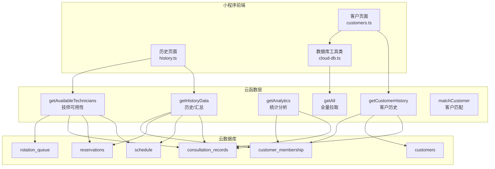
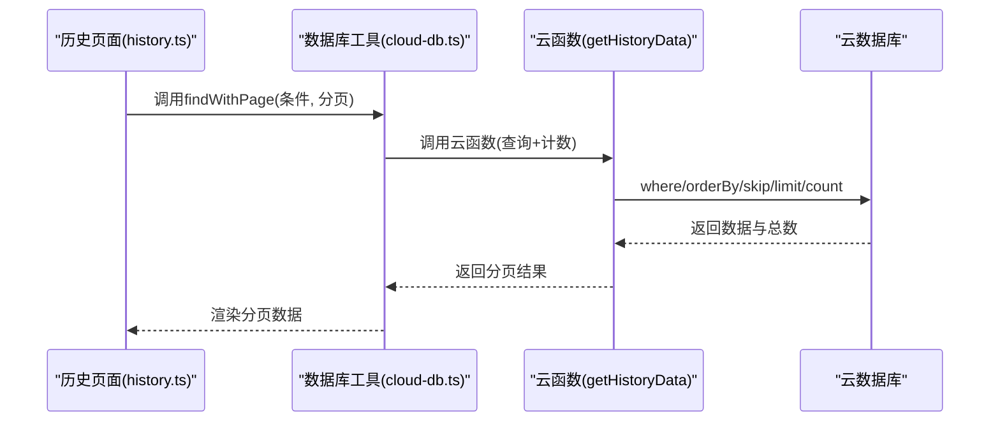
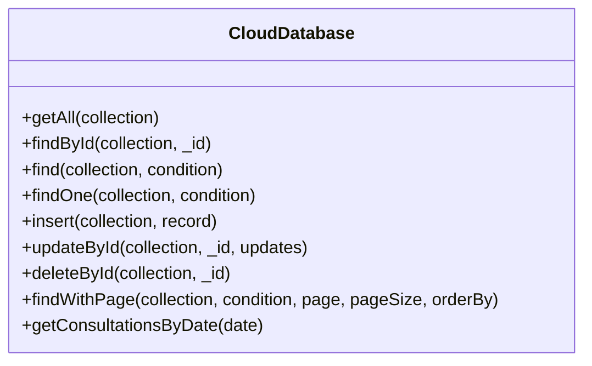
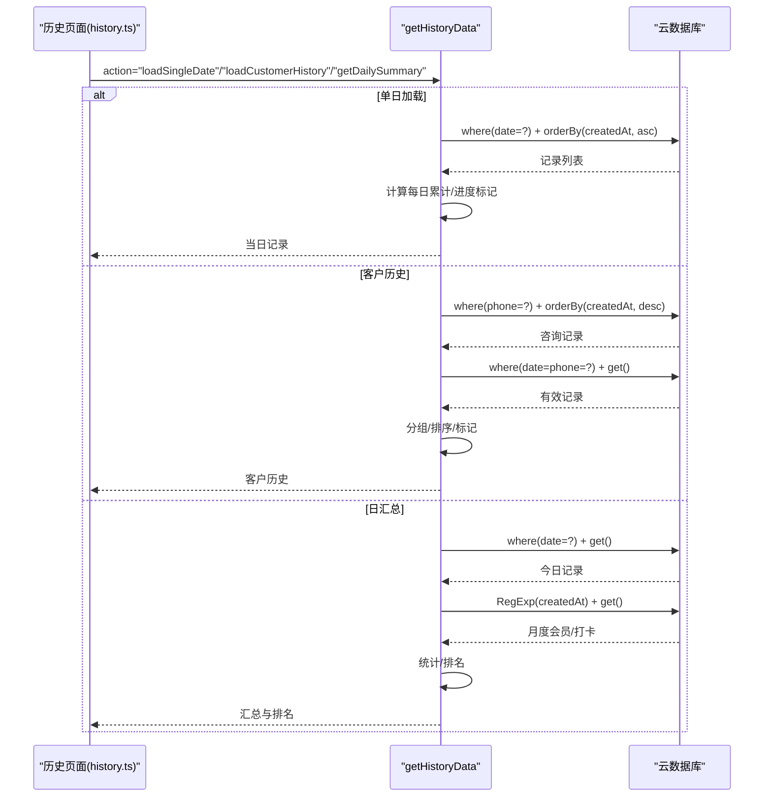
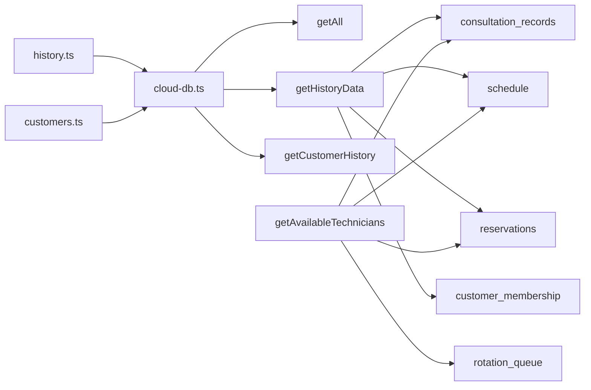

# 查询优化策略

<cite>
**本文引用的文件**
- [cloudfunctions/getAll/index.js](file://cloudfunctions/getAll/index.js)
- [cloudfunctions/getAnalytics/index.js](file://cloudfunctions/getAnalytics/index.js)
- [cloudfunctions/getHistoryData/index.js](file://cloudfunctions/getHistoryData/index.js)
- [cloudfunctions/getCustomerHistory/index.js](file://cloudfunctions/getCustomerHistory/index.js)
- [cloudfunctions/getAvailableTechnicians/index.js](file://cloudfunctions/getAvailableTechnicians/index.js)
- [cloudfunctions/matchCustomer/index.js](file://cloudfunctions/matchCustomer/index.js)
- [miniprogram/utils/cloud-db.ts](file://miniprogram/utils/cloud-db.ts)
- [miniprogram/pages/history/history.ts](file://miniprogram/pages/history/history.ts)
- [miniprogram/pages/customers/customers.ts](file://miniprogram/pages/customers/customers.ts)
- [miniprogram/utils/constants.ts](file://miniprogram/utils/constants.ts)
- [project.config.json](file://project.config.json)
</cite>

## 目录
1. [简介](#简介)
2. [项目结构](#项目结构)
3. [核心组件](#核心组件)
4. [架构总览](#架构总览)
5. [详细组件分析](#详细组件分析)
6. [依赖关系分析](#依赖关系分析)
7. [性能考量](#性能考量)
8. [故障排查指南](#故障排查指南)
9. [结论](#结论)
10. [附录](#附录)

## 简介
本文件面向CloudBase数据库在实际业务中的查询优化策略，结合项目中现有的云函数与小程序端实现，系统梳理索引设计原则、查询条件优化、分页策略、复杂查询执行计划与瓶颈识别、缓存与预加载、批量操作优化、性能监控与慢查询分析，并给出可落地的优化建议与案例。文档同时覆盖大数据量场景下的扩展性考虑，帮助团队在不牺牲用户体验的前提下提升查询性能与稳定性。

## 项目结构
该项目采用“小程序前端 + 云开发云函数 + 云数据库”的三层架构：
- 小程序前端：负责用户交互与调用云函数，实现历史记录、客户列表、技师可用性等页面的数据加载与展示。
- 云函数层：封装数据库查询、聚合统计、跨表关联与复杂逻辑处理，统一对外提供稳定的接口能力。
- 云数据库层：存储咨询记录、客户、技师排班、预约、会员卡等业务数据。

图表来源
- [miniprogram/pages/history/history.ts](file://miniprogram/pages/history/history.ts#L146-L186)
- [miniprogram/pages/customers/customers.ts](file://miniprogram/pages/customers/customers.ts#L68-L99)
- [miniprogram/utils/cloud-db.ts](file://miniprogram/utils/cloud-db.ts#L69-L88)
- [cloudfunctions/getAll/index.js](file://cloudfunctions/getAll/index.js#L9-L58)
- [cloudfunctions/getHistoryData/index.js](file://cloudfunctions/getHistoryData/index.js#L88-L410)
- [cloudfunctions/getAvailableTechnicians/index.js](file://cloudfunctions/getAvailableTechnicians/index.js#L9-L124)
- [cloudfunctions/getAnalytics/index.js](file://cloudfunctions/getAnalytics/index.js#L36-L51)
- [cloudfunctions/getCustomerHistory/index.js](file://cloudfunctions/getCustomerHistory/index.js#L9-L99)

章节来源
- [project.config.json](file://project.config.json#L1-L54)

## 核心组件
- 数据库工具类（cloud-db.ts）：封装查询、分页、插入、更新、删除等通用操作，支持本地过滤与远程查询两种模式；提供分页查询findWithPage，内部通过Promise.all并发执行查询与计数，减少往返次数。
- 历史数据云函数（getHistoryData/index.js）：按日期加载当日记录、生成日汇总、按客户维度聚合历史；使用正则匹配日期前缀、排序与字段选择，避免一次性拉取全量数据。
- 客户历史云函数（getCustomerHistory/index.js）：基于手机号查询客户历史、客户信息与会员卡使用记录，限制返回条目以控制网络与计算开销。
- 统计分析云函数（getAnalytics/index.js）：按日期范围聚合收入、订单、性别分布、车辆分布、项目消费、平台消费等指标，涉及多集合查询与内存聚合。
- 技师可用性云函数（getAvailableTechnicians/index.js）：综合排班、预约、咨询记录与轮值队列，计算冲突与空闲状态，支持实时可用性查询。
- 全量拉取云函数（getAll/index.js）：通过游标式分页（基于_id）逐页拉取集合数据，避免一次性全量查询带来的超时与内存压力。
- 客户匹配云函数（matchCustomer/index.js）：对所有客户进行评分匹配，适合小规模数据或离线缓存场景。

章节来源
- [miniprogram/utils/cloud-db.ts](file://miniprogram/utils/cloud-db.ts#L108-L131)
- [miniprogram/utils/cloud-db.ts](file://miniprogram/utils/cloud-db.ts#L209-L255)
- [cloudfunctions/getHistoryData/index.js](file://cloudfunctions/getHistoryData/index.js#L88-L410)
- [cloudfunctions/getCustomerHistory/index.js](file://cloudfunctions/getCustomerHistory/index.js#L9-L99)
- [cloudfunctions/getAnalytics/index.js](file://cloudfunctions/getAnalytics/index.js#L36-L51)
- [cloudfunctions/getAvailableTechnicians/index.js](file://cloudfunctions/getAvailableTechnicians/index.js#L9-L124)
- [cloudfunctions/getAll/index.js](file://cloudfunctions/getAll/index.js#L9-L58)
- [cloudfunctions/matchCustomer/index.js](file://cloudfunctions/matchCustomer/index.js#L9-L70)

## 架构总览
整体流程从页面发起请求到云函数，再由云函数访问数据库，最后返回结果给前端渲染。关键优化点包括：
- 分页与游标分页：避免一次性全量查询。
- 并发查询与计数：减少往返次数。
- 字段投影与排序：降低网络与CPU开销。
- 内存聚合与正则匹配：在云函数侧完成聚合，减轻前端负担。

图表来源
- [miniprogram/pages/history/history.ts](file://miniprogram/pages/history/history.ts#L146-L186)
- [miniprogram/utils/cloud-db.ts](file://miniprogram/utils/cloud-db.ts#L209-L255)
- [cloudfunctions/getHistoryData/index.js](file://cloudfunctions/getHistoryData/index.js#L88-L410)

## 详细组件分析

### 数据库工具类（cloud-db.ts）
- 功能要点
  - 远程查询：where + orderBy + skip + limit + count，支持并发查询与计数，减少往返。
  - 本地过滤：当条件为函数时，先全量拉取再过滤，适用于小数据集或临时需求。
  - 分页查询：findWithPage，返回数据、总数与是否还有下一页。
  - 基础增删改查：findById、findOne、insert、updateById、deleteById。
- 性能影响
  - 远程查询可利用索引与排序，避免全表扫描。
  - 并发查询与计数减少RTT，但会增加数据库负载，需配合限流与缓存。
  - 本地过滤仅适合小数据集，大数据量应迁移到远程查询。

图表来源
- [miniprogram/utils/cloud-db.ts](file://miniprogram/utils/cloud-db.ts#L12-L299)

章节来源
- [miniprogram/utils/cloud-db.ts](file://miniprogram/utils/cloud-db.ts#L69-L88)
- [miniprogram/utils/cloud-db.ts](file://miniprogram/utils/cloud-db.ts#L108-L131)
- [miniprogram/utils/cloud-db.ts](file://miniprogram/utils/cloud-db.ts#L209-L255)

### 历史数据云函数（getHistoryData/index.js）
- 功能要点
  - 单日加载：按日期查询咨询记录，排序后计算每个技师当日累计数、进行进度标记。
  - 全量日期聚合：抽取所有日期并排序，支持默认选中最新日期。
  - 客户历史：按手机号查询客户历史，按日期分组并二次筛选有效记录。
  - 日汇总：统计技师项目数、打卡数、加班/加时等，结合月度会员销售与打卡统计生成排名。
  - 正则匹配：使用RegExp按日期前缀匹配，避免字符串转换成本。
- 性能影响
  - 多集合查询与内存聚合，适合中等规模数据。
  - 正则匹配与多次查询可能成为瓶颈，建议引入索引与缓存。

图表来源
- [cloudfunctions/getHistoryData/index.js](file://cloudfunctions/getHistoryData/index.js#L88-L410)

章节来源
- [cloudfunctions/getHistoryData/index.js](file://cloudfunctions/getHistoryData/index.js#L88-L410)

### 客户历史云函数（getCustomerHistory/index.js）
- 功能要点
  - 基于手机号查询咨询记录，限制返回条目，避免超大结果集。
  - 同步查询客户信息与会员卡使用记录，合并返回。
- 性能影响
  - 限制返回条目可显著降低网络与前端处理压力。
  - 若手机号未建索引，查询成本较高，建议建立索引。

章节来源
- [cloudfunctions/getCustomerHistory/index.js](file://cloudfunctions/getCustomerHistory/index.js#L9-L99)

### 统计分析云函数（getAnalytics/index.js）
- 功能要点
  - 按日期范围查询咨询记录与会员卡创建记录，进行内存聚合。
  - 计算日收入趋势、项目消费排行、平台消费排行、性别与车辆分布、平均客单价等。
- 性能影响
  - 多集合查询与内存聚合，适合周期性任务或后台报表。
  - 建议引入索引与缓存，避免重复计算。

章节来源
- [cloudfunctions/getAnalytics/index.js](file://cloudfunctions/getAnalytics/index.js#L36-L171)

### 技师可用性云函数（getAvailableTechnicians/index.js）
- 功能要点
  - 综合排班、预约、咨询记录与轮值队列，计算冲突与空闲状态。
  - 支持实时可用性查询与岗位排序。
- 性能影响
  - 多集合查询与时间区间冲突检测，建议建立相关索引与缓存。

章节来源
- [cloudfunctions/getAvailableTechnicians/index.js](file://cloudfunctions/getAvailableTechnicians/index.js#L9-L124)
- [cloudfunctions/getAvailableTechnicians/index.js](file://cloudfunctions/getAvailableTechnicians/index.js#L131-L285)

### 全量拉取云函数（getAll/index.js）
- 功能要点
  - 使用游标分页（基于_id）逐页拉取，避免一次性全量查询。
  - 通过MAX_LIMIT限制单次拉取数量，防止超时与内存压力。
- 性能影响
  - 适合离线导出或迁移场景，不适合在线查询。

章节来源
- [cloudfunctions/getAll/index.js](file://cloudfunctions/getAll/index.js#L9-L58)

### 客户匹配云函数（matchCustomer/index.js）
- 功能要点
  - 对所有客户进行评分匹配，适合小规模数据或离线缓存场景。
- 性能影响
  - 全量扫描，大数据量不建议在线使用。

章节来源
- [cloudfunctions/matchCustomer/index.js](file://cloudfunctions/matchCustomer/index.js#L9-L70)

## 依赖关系分析
- 页面到工具类：历史页面与客户页面通过数据库工具类发起查询，工具类统一调用云函数或直接访问数据库。
- 工具类到云函数：工具类在findWithPage中并发调用查询与计数，减少往返。
- 云函数到数据库：各云函数根据业务需要查询多个集合，部分使用正则匹配与内存聚合。

图表来源
- [miniprogram/pages/history/history.ts](file://miniprogram/pages/history/history.ts#L146-L186)
- [miniprogram/pages/customers/customers.ts](file://miniprogram/pages/customers/customers.ts#L68-L99)
- [miniprogram/utils/cloud-db.ts](file://miniprogram/utils/cloud-db.ts#L209-L255)
- [cloudfunctions/getHistoryData/index.js](file://cloudfunctions/getHistoryData/index.js#L88-L410)
- [cloudfunctions/getAvailableTechnicians/index.js](file://cloudfunctions/getAvailableTechnicians/index.js#L9-L124)

章节来源
- [miniprogram/pages/history/history.ts](file://miniprogram/pages/history/history.ts#L146-L186)
- [miniprogram/pages/customers/customers.ts](file://miniprogram/pages/customers/customers.ts#L68-L99)
- [miniprogram/utils/cloud-db.ts](file://miniprogram/utils/cloud-db.ts#L209-L255)

## 性能考量

### 索引设计原则
- 选择性高的字段优先：如手机号、日期字段、状态字段等。
- 复合索引：where条件中经常成组出现的字段组合建立复合索引，例如(date, isVoided)、(phone, createdAt)。
- 排序字段：若常用orderBy某字段，建议在该字段上建立索引，避免额外排序成本。
- 正则匹配：尽量避免在高频查询中使用正则，可改为前缀匹配或建立辅助字段。

章节来源
- [cloudfunctions/getHistoryData/index.js](file://cloudfunctions/getHistoryData/index.js#L33-L86)
- [cloudfunctions/getCustomerHistory/index.js](file://cloudfunctions/getCustomerHistory/index.js#L22-L28)
- [cloudfunctions/getAvailableTechnicians/index.js](file://cloudfunctions/getAvailableTechnicians/index.js#L51-L54)

### 查询条件优化
- 使用精确匹配替代模糊匹配：优先使用等值查询，减少全表扫描。
- 合理使用范围查询：如日期范围、金额范围，确保索引命中。
- 减少不必要的字段投影：仅返回需要的字段，降低网络与解析成本。
- 避免在where中对字段进行函数运算，尽量在写入时规范化数据格式。

章节来源
- [cloudfunctions/getHistoryData/index.js](file://cloudfunctions/getHistoryData/index.js#L33-L86)
- [cloudfunctions/getCustomerHistory/index.js](file://cloudfunctions/getCustomerHistory/index.js#L22-L28)

### 分页策略
- 游标分页：基于_lastId或时间戳游标，避免深度分页导致的偏移成本。
- 并发查询：在分页场景下并发执行查询与计数，减少往返次数。
- 限制每页大小：合理设置pageSize，避免单页过大导致内存压力。

章节来源
- [cloudfunctions/getAll/index.js](file://cloudfunctions/getAll/index.js#L25-L44)
- [miniprogram/utils/cloud-db.ts](file://miniprogram/utils/cloud-db.ts#L209-L255)

### 复杂查询执行计划与瓶颈识别
- 执行计划：优先使用索引扫描，避免全表扫描；对多集合查询进行分步执行，减少联表成本。
- 瓶颈识别：关注正则匹配、内存聚合、多集合查询与排序成本。
- 解决方案：引入索引、缓存热点数据、拆分查询、减少内存聚合。

章节来源
- [cloudfunctions/getHistoryData/index.js](file://cloudfunctions/getHistoryData/index.js#L88-L410)
- [cloudfunctions/getAnalytics/index.js](file://cloudfunctions/getAnalytics/index.js#L53-L171)

### 缓存策略、数据预加载与批量操作优化
- 缓存策略：对高频查询结果（如技师可用性、日汇总）进行短期缓存，结合失效策略。
- 预加载：在页面进入时预加载最近日期的数据，减少首屏等待。
- 批量操作：合并多次更新为批量更新，减少网络往返与事务开销。

章节来源
- [miniprogram/pages/history/history.ts](file://miniprogram/pages/history/history.ts#L394-L498)
- [miniprogram/pages/customers/customers.ts](file://miniprogram/pages/customers/customers.ts#L460-L469)

### 查询性能监控与慢查询分析
- 监控指标：查询耗时、返回条数、数据库连接数、缓存命中率。
- 慢查询分析：定位正则匹配、内存聚合、多集合查询与排序成本高的环节。
- 调优案例：引入索引、缓存、游标分页与字段投影，减少不必要的计算与网络传输。

章节来源
- [miniprogram/utils/cloud-db.ts](file://miniprogram/utils/cloud-db.ts#L209-L255)
- [cloudfunctions/getHistoryData/index.js](file://cloudfunctions/getHistoryData/index.js#L88-L410)

### 大数据量场景下的查询策略与扩展性
- 索引与分区：对高频查询字段建立索引，必要时考虑按时间分区。
- 异步与批处理：将复杂统计任务放入异步云函数或定时任务，避免阻塞主线程。
- 读写分离：对只读报表类查询使用副本或只读实例。
- 扩展性：通过游标分页与缓存提升横向扩展能力，避免单点压力。

章节来源
- [cloudfunctions/getAll/index.js](file://cloudfunctions/getAll/index.js#L9-L58)
- [cloudfunctions/getAnalytics/index.js](file://cloudfunctions/getAnalytics/index.js#L36-L51)

## 故障排查指南
- 查询超时
  - 检查是否使用了正则匹配或未命中索引的查询条件。
  - 优化为精确匹配或添加复合索引。
- 内存溢出
  - 避免一次性全量拉取，使用游标分页或限制返回条目。
  - 将内存聚合转移到数据库侧或缓存侧。
- 分页错乱
  - 使用稳定排序字段（如createdAt）与游标分页，避免使用不稳定排序。
- 缓存不一致
  - 设置合理的过期时间与失效策略，确保缓存与数据库一致性。

章节来源
- [cloudfunctions/getAll/index.js](file://cloudfunctions/getAll/index.js#L25-L44)
- [cloudfunctions/getHistoryData/index.js](file://cloudfunctions/getHistoryData/index.js#L88-L410)
- [miniprogram/utils/cloud-db.ts](file://miniprogram/utils/cloud-db.ts#L209-L255)

## 结论
通过对现有代码的分析，项目在查询优化方面已具备基础能力：游标分页、并发查询与计数、字段投影与排序、以及正则匹配与内存聚合的使用。为进一步提升性能与稳定性，建议：
- 在高频查询字段上建立索引，尤其是日期、状态、手机号等。
- 优化正则匹配与内存聚合，引入缓存与异步统计任务。
- 规范化数据写入，避免在查询时进行昂贵的函数运算。
- 建立完善的监控与慢查询分析机制，持续迭代优化。

## 附录
- 查询语句示例路径
  - 历史单日查询：[cloudfunctions/getHistoryData/index.js](file://cloudfunctions/getHistoryData/index.js#L33-L86)
  - 客户历史查询：[cloudfunctions/getCustomerHistory/index.js](file://cloudfunctions/getCustomerHistory/index.js#L22-L28)
  - 技师可用性查询：[cloudfunctions/getAvailableTechnicians/index.js](file://cloudfunctions/getAvailableTechnicians/index.js#L51-L54)
  - 全量拉取：[cloudfunctions/getAll/index.js](file://cloudfunctions/getAll/index.js#L25-L44)
- 性能对比与优化效果评估
  - 建议在相同数据规模下对比启用索引前后、游标分页与偏移分页、缓存命中与未命中场景的查询耗时与资源占用，形成量化报告。
- 最佳实践清单
  - 优先使用精确匹配与复合索引。
  - 控制单页大小与并发查询数量。
  - 对只读报表使用缓存与副本。
  - 定期清理与重建索引，保持查询计划最优。