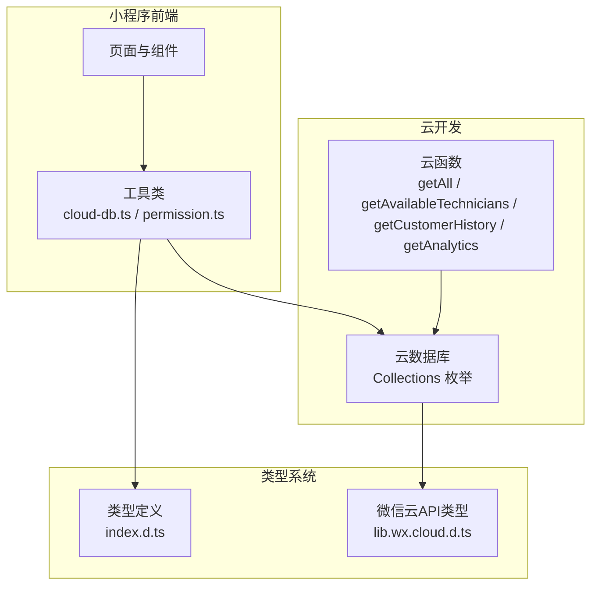
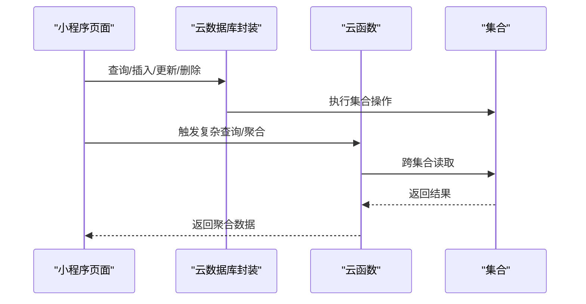
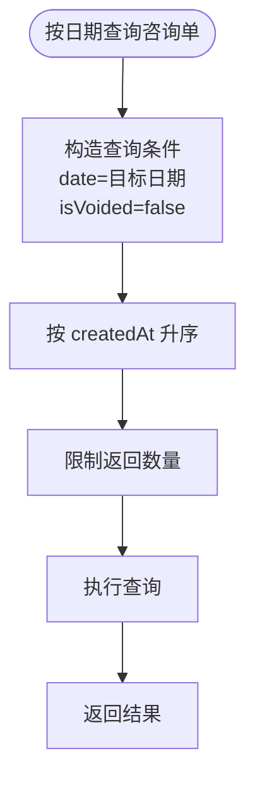
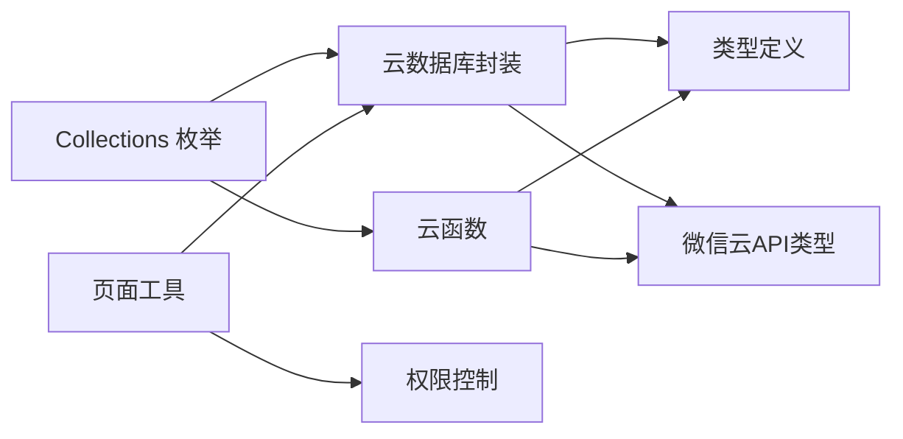

# 集合架构设计

<cite>
**本文档引用的文件**
- [cloud-db.ts](file://miniprogram/utils/cloud-db.ts)
- [index.ts](file://miniprogram/config/index.ts)
- [index.js (getAll)](file://cloudfunctions/getAll/index.js)
- [index.js (getAvailableTechnicians)](file://cloudfunctions/getAvailableTechnicians/index.js)
- [index.js (getCustomerHistory)](file://cloudfunctions/getCustomerHistory/index.js)
- [index.js (getAnalytics)](file://cloudfunctions/getAnalytics/index.js)
- [index.d.ts](file://typings/index.d.ts)
- [permission.ts](file://miniprogram/utils/permission.ts)
- [reservation-utils.ts](file://miniprogram/pages/index/utils/reservation-utils.ts)
- [clockin-utils.ts](file://miniprogram/pages/index/utils/clockin-utils.ts)
- [lib.wx.cloud.d.ts](file://typings/types/wx/lib.wx.cloud.d.ts)
</cite>

## 目录
1. [简介](#简介)
2. [项目结构](#项目结构)
3. [核心组件](#核心组件)
4. [架构总览](#架构总览)
5. [详细组件分析](#详细组件分析)
6. [依赖关系分析](#依赖关系分析)
7. [性能考量](#性能考量)
8. [故障排查指南](#故障排查指南)
9. [结论](#结论)
10. [附录](#附录)

## 简介
本文件系统性梳理该咨询打印系统的数据库集合架构设计，覆盖集合命名规范、结构设计、用途说明、索引与查询优化、集合间关系映射、数据冗余与一致性、权限控制与安全、扩展指南、性能监控与维护最佳实践。重点围绕 Collections 枚举中定义的集合展开，包括 staff、customers、consultation_records、reservations 等，并结合云函数与前端工具类的使用模式，给出可操作的设计与运维建议。

## 项目结构
系统采用“小程序前端 + 云开发数据库 + 云托管云函数”的三层架构：
- 小程序前端通过统一的云数据库封装类访问集合
- 云函数负责复杂聚合与跨集合查询
- 类型定义文件提供强类型约束与字段规范

**图表来源**
- [cloud-db.ts](file://miniprogram/utils/cloud-db.ts#L1-L321)
- [index.js (getAll)](file://cloudfunctions/getAll/index.js#L1-L59)
- [index.js (getAvailableTechnicians)](file://cloudfunctions/getAvailableTechnicians/index.js#L1-L285)
- [index.js (getCustomerHistory)](file://cloudfunctions/getCustomerHistory/index.js#L1-L100)
- [index.js (getAnalytics)](file://cloudfunctions/getAnalytics/index.js#L1-L172)
- [index.d.ts](file://typings/index.d.ts#L1-L435)
- [lib.wx.cloud.d.ts](file://typings/types/wx/lib.wx.cloud.d.ts#L392-L540)

**章节来源**
- [cloud-db.ts](file://miniprogram/utils/cloud-db.ts#L1-L321)
- [index.ts](file://miniprogram/config/index.ts#L1-L18)
- [index.d.ts](file://typings/index.d.ts#L1-L435)

## 核心组件
- 集合枚举与命名规范：通过 Collections 枚举集中管理集合名，确保命名一致性与可维护性
- 云数据库封装：提供通用 CRUD、分页、正则查询、保存咨询单等能力
- 云函数：提供全量拉取、可用技师匹配、客户历史、统计分析等复杂逻辑
- 权限控制：基于角色的页面与按钮级权限映射
- 类型系统：强类型约束集合字段与业务实体

**章节来源**
- [cloud-db.ts](file://miniprogram/utils/cloud-db.ts#L303-L321)
- [index.js (getAll)](file://cloudfunctions/getAll/index.js#L1-L59)
- [index.js (getAvailableTechnicians)](file://cloudfunctions/getAvailableTechnicians/index.js#L1-L285)
- [permission.ts](file://miniprogram/utils/permission.ts#L1-L194)
- [index.d.ts](file://typings/index.d.ts#L1-L435)

## 架构总览
下图展示集合间的典型交互路径与数据流向：

**图表来源**
- [cloud-db.ts](file://miniprogram/utils/cloud-db.ts#L69-L255)
- [index.js (getAvailableTechnicians)](file://cloudfunctions/getAvailableTechnicians/index.js#L26-L124)
- [index.js (getCustomerHistory)](file://cloudfunctions/getCustomerHistory/index.js#L22-L92)
- [index.js (getAnalytics)](file://cloudfunctions/getAnalytics/index.js#L56-L171)

## 详细组件分析

### 集合命名规范与枚举
- 命名风格：采用小写加下划线或小驼峰，语义明确
- 枚举集中化：通过 Collections 枚举统一管理集合名，避免魔法字符串
- 环境隔离：通过配置文件设置云环境 ID，便于多环境部署

**章节来源**
- [cloud-db.ts](file://miniprogram/utils/cloud-db.ts#L303-L321)
- [index.ts](file://miniprogram/config/index.ts#L5-L15)

### staff 集合
- 结构要点：包含员工基本信息、状态、性别、头像、电话等
- 用途：排班、技师匹配、权限绑定
- 查询优化：按状态与排班日期过滤；与 schedule、rotation 队列配合
- 索引建议：status、date（排班日）上建立复合索引；name/phone 建立单列索引

**章节来源**
- [index.d.ts](file://typings/index.d.ts#L89-L96)
- [index.js (getAvailableTechnicians)](file://cloudfunctions/getAvailableTechnicians/index.js#L138-L159)

### customers 集合
- 结构要点：手机号、姓名、性别、负责技师、车牌、备注等
- 用途：客户画像、历史查询、会员卡关联
- 查询优化：以 phone 作为主查询键；与 consultation_records、customer_membership 建立关联
- 索引建议：phone 建立唯一或单列索引；name 建立辅助索引

**章节来源**
- [index.d.ts](file://typings/index.d.ts#L137-L144)
- [reservation-utils.ts](file://miniprogram/pages/index/utils/reservation-utils.ts#L154-L168)
- [index.js (getCustomerHistory)](file://cloudfunctions/getCustomerHistory/index.js#L49-L57)

### consultation_records 集合
- 结构要点：咨询单核心字段（姓名、性别、项目、技师、房间、精油、部位选择、点钟、备注、手机号、加钟、加班、日期、开始/结束时间、结算信息、金额、是否作废、优惠券等）
- 用途：历史查询、统计分析、点钟计数、作废控制
- 查询优化：按 date、isVoided、createdAt 进行过滤与排序；分页查询
- 索引建议：date、isVoided、createdAt（按需）、phone、technician 建立索引

**图表来源**
- [cloud-db.ts](file://miniprogram/utils/cloud-db.ts#L283-L298)

**章节来源**
- [index.d.ts](file://typings/index.d.ts#L37-L83)
- [cloud-db.ts](file://miniprogram/utils/cloud-db.ts#L283-L298)
- [clockin-utils.ts](file://miniprogram/pages/index/utils/clockin-utils.ts#L70-L74)
- [index.js (getAnalytics)](file://cloudfunctions/getAnalytics/index.js#L56-L61)

### reservations 集合
- 结构要点：日期、客户姓名/性别/手机、项目、技师（可选）、时间段、点钟标记、状态、性别要求等
- 用途：预约管理、技师分配、冲突检测
- 查询优化：按 date、status、startTime/endTime 过滤；与 rotation 队列联动
- 索引建议：date、status、startTime、endTime、technicianName/technicianId 建立索引

**章节来源**
- [index.d.ts](file://typings/index.d.ts#L108-L122)
- [reservation-utils.ts](file://miniprogram/pages/index/utils/reservation-utils.ts#L26-L85)
- [index.js (getAvailableTechnicians)](file://cloudfunctions/getAvailableTechnicians/index.js#L26-L56)

### 其他重要集合
- schedule：排班记录，包含日期、员工 ID、班次类型
- rotation：轮转队列，包含当日员工顺序与位置
- membership、customer_membership、membership_usage：会员卡体系相关
- projects、rooms、essential_oils：基础字典与项目资源
- settings、users：系统配置与用户账户

**章节来源**
- [index.d.ts](file://typings/index.d.ts#L101-L106)
- [index.d.ts](file://typings/index.d.ts#L125-L134)
- [index.d.ts](file://typings/index.d.ts#L157-L183)
- [index.d.ts](file://typings/index.d.ts#L185-L206)
- [cloud-db.ts](file://miniprogram/utils/cloud-db.ts#L303-L318)

### 集合间关系映射与一致性
- 一对一/多对一：consultation_records.technician → staff.name；reservations.technicianId → staff._id
- 多对多/弱关联：customers 与 consultation_records、customer_membership；membership_usage 与 consultation_records
- 一致性保障：
  - 业务层在更新技师或客户信息时，同步更新相关记录中的引用字段
  - 使用 isVoided 标记作废，避免物理删除造成历史断链
  - 通过云函数进行跨集合校验与补偿（如技师可用性、预约冲突）

**章节来源**
- [index.js (getAvailableTechnicians)](file://cloudfunctions/getAvailableTechnicians/index.js#L161-L171)
- [index.js (getCustomerHistory)](file://cloudfunctions/getCustomerHistory/index.js#L22-L47)

### 数据冗余控制
- 冗余字段：consultation_records 中存储 technician/room/project 等，便于查询与报表
- 控制策略：仅存储必要冗余；在更新源数据时同步更新冗余字段；通过云函数批量校验与修复

**章节来源**
- [index.d.ts](file://typings/index.d.ts#L37-L83)
- [index.js (getAvailableTechnicians)](file://cloudfunctions/getAvailableTechnicians/index.js#L70-L111)

### 查询优化方案
- 常用查询模式：
  - 按日期范围/单日查询：consultation_records.date、reservations.date
  - 状态过滤：reservations.status、staff.status
  - 正则/前缀匹配：consultation_records.createdAt 的日期前缀
- 分页与并发：
  - 云函数 getAll 使用游标式分页（_id>lastId）提升大集合读取性能
  - 并发查询多个集合后在应用层合并（如可用技师计算）
- 索引建议：
  - 常用过滤字段建立单列/复合索引
  - 对排序字段（如 createdAt）建立索引以避免排序开销

**章节来源**
- [cloud-db.ts](file://miniprogram/utils/cloud-db.ts#L209-L255)
- [index.js (getAll)](file://cloudfunctions/getAll/index.js#L25-L44)
- [index.js (getAvailableTechnicians)](file://cloudfunctions/getAvailableTechnicians/index.js#L138-L171)

### 权限控制与安全
- 角色与权限：
  - admin：全功能；cashier：收银与部分编辑；technician/viewer：受限访问
  - 按页面与按钮维度控制（canAccess*、canEdit*、canCancel* 等）
- 访问策略：
  - 前端路由与页面入口校验；按钮级权限动态显隐
  - 云函数侧二次校验敏感操作（如作废、删除）
- 安全考虑：
  - 不暴露内部实现细节；对输入参数进行清洗与校验
  - 仅返回必要字段，避免敏感信息泄露

**章节来源**
- [permission.ts](file://miniprogram/utils/permission.ts#L46-L147)
- [index.d.ts](file://typings/index.d.ts#L252-L299)

### 集合扩展指南
- 新增集合步骤：
  - 在 Collections 枚举中新增常量
  - 在 index.d.ts 中补充对应接口定义
  - 在云函数中按需添加查询/聚合逻辑
  - 在前端工具类中封装 CRUD 方法
- 命名与结构约定：
  - 遵循现有命名风格；字段类型与默认值清晰
  - 为高频查询字段预留索引位
- 向后兼容：
  - 新增字段采用可选；迁移时提供默认值与兼容逻辑

**章节来源**
- [cloud-db.ts](file://miniprogram/utils/cloud-db.ts#L303-L321)
- [index.d.ts](file://typings/index.d.ts#L1-L16)

## 依赖关系分析

**图表来源**
- [cloud-db.ts](file://miniprogram/utils/cloud-db.ts#L303-L321)
- [index.d.ts](file://typings/index.d.ts#L1-L435)
- [lib.wx.cloud.d.ts](file://typings/types/wx/lib.wx.cloud.d.ts#L392-L540)
- [permission.ts](file://miniprogram/utils/permission.ts#L1-L194)

**章节来源**
- [cloud-db.ts](file://miniprogram/utils/cloud-db.ts#L1-L321)
- [index.d.ts](file://typings/index.d.ts#L1-L435)
- [lib.wx.cloud.d.ts](file://typings/types/wx/lib.wx.cloud.d.ts#L392-L540)
- [permission.ts](file://miniprogram/utils/permission.ts#L1-L194)

## 性能考量
- 查询性能
  - 优先使用索引字段过滤；避免全表扫描
  - 对日期/状态等高选择性字段建立复合索引
  - 使用分页与并发查询减少单次请求压力
- 写入性能
  - 批量写入与事务合并（如需要）
  - 避免频繁更新冗余字段，必要时异步补偿
- 云函数优化
  - getAll 使用游标分页，避免一次性拉取过多数据
  - 聚合查询中尽量先过滤再投影，减少中间结果集大小

[本节为通用指导，无需列出具体文件来源]

## 故障排查指南
- 常见问题定位
  - 查询无结果：检查日期格式、状态字段、索引是否存在
  - 更新失败：确认文档存在、字段类型匹配、权限校验
  - 云函数报错：查看事件参数、集合名拼写、命令对象使用
- 日志与监控
  - 前端：捕获异常并上报；记录关键操作与耗时
  - 云函数：统一返回 code/message 结构，便于前端处理
- 快速恢复
  - 对于数据不一致，优先通过云函数进行补偿更新
  - 对于索引缺失导致的慢查询，及时补充索引并验证

**章节来源**
- [cloud-db.ts](file://miniprogram/utils/cloud-db.ts#L93-L203)
- [index.js (getAll)](file://cloudfunctions/getAll/index.js#L12-L17)
- [index.js (getAvailableTechnicians)](file://cloudfunctions/getAvailableTechnicians/index.js#L118-L123)

## 结论
该集合架构以统一的枚举与类型系统为基础，结合云数据库封装与云函数实现复杂业务逻辑，形成了清晰、可扩展且具备一定性能与安全性的数据层。建议在后续演进中持续完善索引策略、加强数据一致性校验与补偿机制，并逐步引入更细粒度的审计与监控能力。

[本节为总结性内容，无需列出具体文件来源]

## 附录

### 集合字段与用途对照表
- staff：员工信息与状态，支撑排班与技师匹配
- customers：客户基础信息，支撑历史与会员关联
- consultation_records：咨询单核心数据，支撑历史、统计与点钟
- reservations：预约数据，支撑技师分配与冲突检测
- schedule/rotation：排班与轮转队列，支撑可用性计算
- membership/customer_membership/membership_usage：会员卡体系
- projects/rooms/essential_oils/settings/users：基础字典与系统配置

**章节来源**
- [index.d.ts](file://typings/index.d.ts#L89-L206)
- [cloud-db.ts](file://miniprogram/utils/cloud-db.ts#L303-L318)