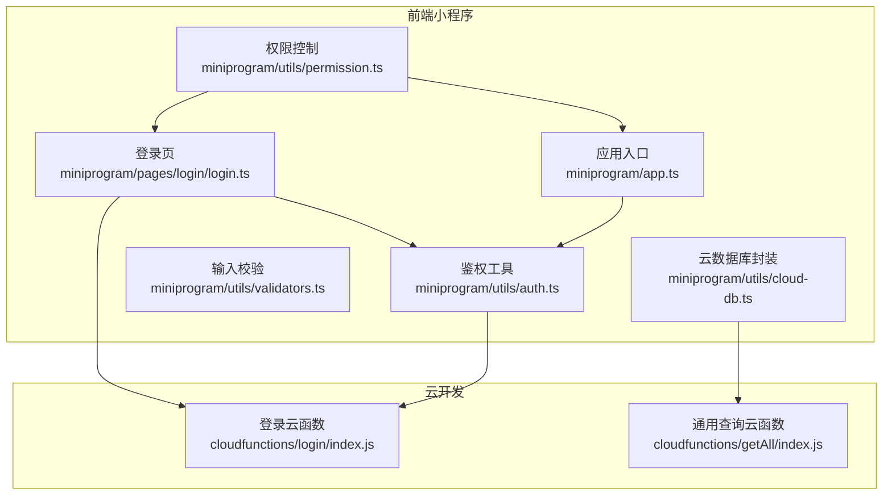
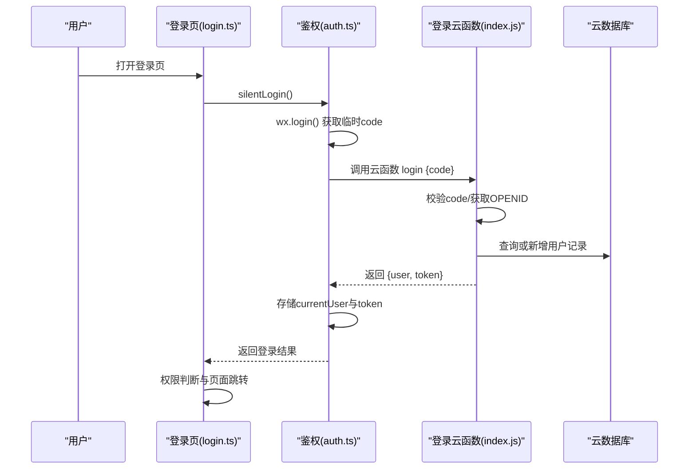
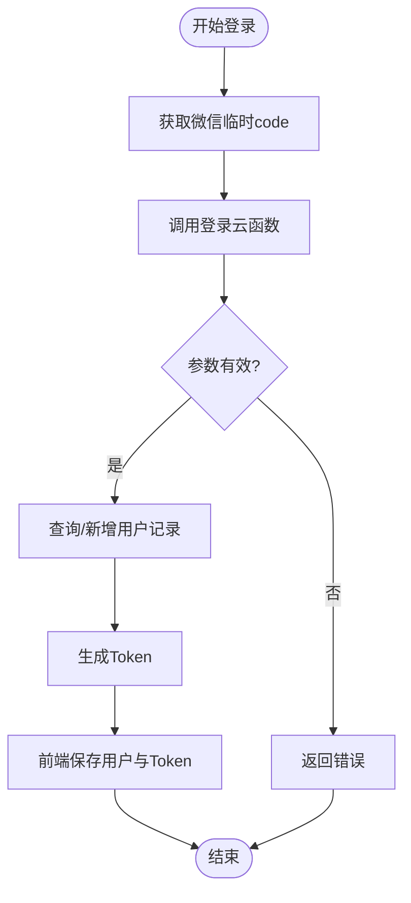
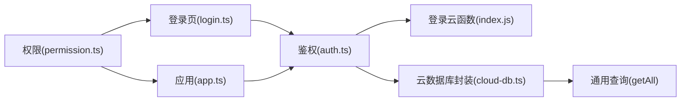

# 安全防护措施

<cite>
**本文引用的文件**
- [miniprogram/pages/login/login.ts](file://miniprogram/pages/login/login.ts)
- [cloudfunctions/login/index.js](file://cloudfunctions/login/index.js)
- [miniprogram/utils/auth.ts](file://miniprogram/utils/auth.ts)
- [miniprogram/app.ts](file://miniprogram/app.ts)
- [miniprogram/utils/cloud-db.ts](file://miniprogram/utils/cloud-db.ts)
- [miniprogram/utils/validators.ts](file://miniprogram/utils/validators.ts)
- [miniprogram/utils/permission.ts](file://miniprogram/utils/permission.ts)
- [cloudfunctions/getAll/index.js](file://cloudfunctions/getAll/index.js)
- [project.config.json](file://project.config.json)
- [miniprogram/app.json](file://miniprogram/app.json)
- [package.json](file://package.json)
</cite>

## 目录
1. [引言](#引言)
2. [项目结构](#项目结构)
3. [核心组件](#核心组件)
4. [架构总览](#架构总览)
5. [详细组件分析](#详细组件分析)
6. [依赖关系分析](#依赖关系分析)
7. [性能与安全特性](#性能与安全特性)
8. [故障排查指南](#故障排查指南)
9. [结论](#结论)
10. [附录](#附录)

## 引言
本文件面向“ConsultationPrinter”微信小程序项目，系统化梳理并输出一套可落地的安全防护方案。重点覆盖登录安全（防暴力破解、验证码验证与登录尝试限制）、数据传输安全（HTTPS加密、Token安全存储与敏感信息保护）、会话管理（Token过期与自动登出、会话劫持防护）、前端安全（XSS与CSRF防护、输入验证）以及安全配置、漏洞扫描建议与应急响应流程，并给出威胁模型、风险评估与合规要点。

## 项目结构
项目采用“前端小程序 + 云开发云函数”的分层架构：
- 前端层：登录页、业务页面、工具模块（鉴权、权限、数据库封装、校验器）
- 后端层：云函数（登录、数据查询等），通过云数据库进行数据持久化

图表来源
- [miniprogram/pages/login/login.ts](file://miniprogram/pages/login/login.ts#L1-L166)
- [miniprogram/app.ts](file://miniprogram/app.ts#L1-L191)
- [miniprogram/utils/auth.ts](file://miniprogram/utils/auth.ts#L1-L245)
- [miniprogram/utils/permission.ts](file://miniprogram/utils/permission.ts#L1-L194)
- [miniprogram/utils/validators.ts](file://miniprogram/utils/validators.ts#L1-L81)
- [miniprogram/utils/cloud-db.ts](file://miniprogram/utils/cloud-db.ts#L1-L321)
- [cloudfunctions/login/index.js](file://cloudfunctions/login/index.js#L1-L180)
- [cloudfunctions/getAll/index.js](file://cloudfunctions/getAll/index.js#L1-L59)

章节来源
- [miniprogram/pages/login/login.ts](file://miniprogram/pages/login/login.ts#L1-L166)
- [miniprogram/app.ts](file://miniprogram/app.ts#L1-L191)
- [miniprogram/utils/auth.ts](file://miniprogram/utils/auth.ts#L1-L245)
- [miniprogram/utils/permission.ts](file://miniprogram/utils/permission.ts#L1-L194)
- [miniprogram/utils/validators.ts](file://miniprogram/utils/validators.ts#L1-L81)
- [miniprogram/utils/cloud-db.ts](file://miniprogram/utils/cloud-db.ts#L1-L321)
- [cloudfunctions/login/index.js](file://cloudfunctions/login/index.js#L1-L180)
- [cloudfunctions/getAll/index.js](file://cloudfunctions/getAll/index.js#L1-L59)

## 核心组件
- 登录与会话管理：前端通过鉴权工具完成静默登录、Token存储与登出；后端登录云函数负责生成轻量Token并写入用户信息。
- 权限控制：基于角色的页面与按钮级权限映射，统一校验访问合法性。
- 数据访问：云数据库封装统一调用云函数进行查询，避免直接暴露数据库接口。
- 输入校验：集中式表单校验器，保证前端输入质量与一致性。

章节来源
- [miniprogram/utils/auth.ts](file://miniprogram/utils/auth.ts#L1-L245)
- [cloudfunctions/login/index.js](file://cloudfunctions/login/index.js#L1-L180)
- [miniprogram/utils/permission.ts](file://miniprogram/utils/permission.ts#L1-L194)
- [miniprogram/utils/cloud-db.ts](file://miniprogram/utils/cloud-db.ts#L1-L321)
- [miniprogram/utils/validators.ts](file://miniprogram/utils/validators.ts#L1-L81)

## 架构总览
下图展示登录与会话的关键交互流程，涵盖前后端协作、Token生成与存储、权限判定与页面跳转。

图表来源
- [miniprogram/pages/login/login.ts](file://miniprogram/pages/login/login.ts#L15-L94)
- [miniprogram/utils/auth.ts](file://miniprogram/utils/auth.ts#L78-L126)
- [cloudfunctions/login/index.js](file://cloudfunctions/login/index.js#L11-L90)

章节来源
- [miniprogram/pages/login/login.ts](file://miniprogram/pages/login/login.ts#L1-L166)
- [miniprogram/utils/auth.ts](file://miniprogram/utils/auth.ts#L1-L245)
- [cloudfunctions/login/index.js](file://cloudfunctions/login/index.js#L1-L180)

## 详细组件分析

### 登录安全设计
- 防暴力破解与登录尝试限制
  - 当前实现未见服务端显式的登录频率限制或账户锁定策略。建议在登录云函数中增加IP/账号维度的速率限制与失败计数阈值，超过阈值进行临时封禁或触发二次验证。
  - 可结合微信平台能力与云开发安全策略，对异常登录行为进行告警与阻断。
- 验证码验证
  - 当前登录流程基于微信code换取用户身份，未集成图形验证码或短信验证码。建议在高危场景引入图形/短信验证码，降低自动化脚本成功率。
- 登录状态与Token
  - 前端使用本地存储保存用户信息与Token，建议仅存储必要字段，避免长期有效期；后端生成的Token应具备不可逆向解析的特征，避免泄露敏感信息。

图表来源
- [cloudfunctions/login/index.js](file://cloudfunctions/login/index.js#L11-L90)
- [miniprogram/utils/auth.ts](file://miniprogram/utils/auth.ts#L78-L126)

章节来源
- [cloudfunctions/login/index.js](file://cloudfunctions/login/index.js#L1-L180)
- [miniprogram/utils/auth.ts](file://miniprogram/utils/auth.ts#L1-L245)

### 数据传输安全
- HTTPS加密
  - 小程序与云开发通信默认走微信服务器通道，建议在项目配置中启用HTTPS与可信域名校验，确保网络传输链路安全。
- Token安全存储
  - 前端使用本地存储保存Token，建议：
    - 仅存储必要字段，避免冗余敏感信息；
    - 对Token设置较短有效期并在后台轮换；
    - 结合小程序安全存储能力，尽量减少明文持久化。
- 敏感信息保护
  - 用户手机号等敏感字段通过专用云函数授权获取，避免在前端直接请求或暴露；对日志与错误信息进行脱敏处理。

章节来源
- [miniprogram/utils/auth.ts](file://miniprogram/utils/auth.ts#L1-L245)
- [cloudfunctions/login/index.js](file://cloudfunctions/login/index.js#L1-L180)

### 会话安全管理
- Token过期处理
  - 当前未见Token过期检测与自动刷新逻辑。建议：
    - 前端在发起请求前检查Token有效性；
    - 失效时触发静默刷新或引导重新登录；
    - 后端对Token进行签名与有效期校验。
- 自动登出机制
  - 应用入口在非登录页检测到未登录时自动跳转登录页，形成基本的强制登出保护。
- 会话劫持防护
  - 建议在后端登录流程中加入设备指纹、登录环境校验与Token绑定策略，降低会话被复用的风险。

章节来源
- [miniprogram/app.ts](file://miniprogram/app.ts#L27-L37)
- [miniprogram/utils/auth.ts](file://miniprogram/utils/auth.ts#L157-L165)

### 前端安全防护
- XSS防护
  - 使用模板渲染与受控组件，避免内联事件与动态eval；对用户输入进行白名单过滤与HTML实体编码。
- CSRF攻击防范
  - 小程序天然具备同源策略与域名校验，但仍需注意云函数调用的来源校验与幂等性设计；对关键操作增加二次确认与Token校验。
- 输入验证
  - 使用集中式校验器对必填项、格式与范围进行校验，失败时以Toast提示，避免无效数据进入后端。

章节来源
- [miniprogram/utils/validators.ts](file://miniprogram/utils/validators.ts#L1-L81)
- [miniprogram/utils/auth.ts](file://miniprogram/utils/auth.ts#L1-L245)

### 权限与数据访问安全
- 角色驱动的页面与按钮权限
  - 基于角色映射页面与按钮权限，统一在入口与页面加载时进行校验，防止越权访问。
- 云数据库访问
  - 通过云函数封装查询，避免直接暴露集合与查询条件；对查询结果进行最小化返回与脱敏处理。

章节来源
- [miniprogram/utils/permission.ts](file://miniprogram/utils/permission.ts#L1-L194)
- [miniprogram/utils/cloud-db.ts](file://miniprogram/utils/cloud-db.ts#L1-L321)
- [cloudfunctions/getAll/index.js](file://cloudfunctions/getAll/index.js#L1-L59)

## 依赖关系分析
- 前端依赖关系
  - 登录页依赖鉴权工具；应用入口依赖鉴权工具进行全局登录初始化与强制登出；权限工具贯穿页面与按钮级访问控制；云数据库封装统一调用云函数。
- 后端依赖关系
  - 登录云函数依赖云数据库进行用户读写；通用查询云函数提供全量数据拉取能力，需配合权限与分页策略使用。

图表来源
- [miniprogram/pages/login/login.ts](file://miniprogram/pages/login/login.ts#L1-L166)
- [miniprogram/app.ts](file://miniprogram/app.ts#L1-L191)
- [miniprogram/utils/auth.ts](file://miniprogram/utils/auth.ts#L1-L245)
- [miniprogram/utils/cloud-db.ts](file://miniprogram/utils/cloud-db.ts#L1-L321)
- [cloudfunctions/login/index.js](file://cloudfunctions/login/index.js#L1-L180)
- [cloudfunctions/getAll/index.js](file://cloudfunctions/getAll/index.js#L1-L59)
- [miniprogram/utils/permission.ts](file://miniprogram/utils/permission.ts#L1-L194)

章节来源
- [miniprogram/pages/login/login.ts](file://miniprogram/pages/login/login.ts#L1-L166)
- [miniprogram/app.ts](file://miniprogram/app.ts#L1-L191)
- [miniprogram/utils/auth.ts](file://miniprogram/utils/auth.ts#L1-L245)
- [miniprogram/utils/cloud-db.ts](file://miniprogram/utils/cloud-db.ts#L1-L321)
- [cloudfunctions/login/index.js](file://cloudfunctions/login/index.js#L1-L180)
- [cloudfunctions/getAll/index.js](file://cloudfunctions/getAll/index.js#L1-L59)
- [miniprogram/utils/permission.ts](file://miniprogram/utils/permission.ts#L1-L194)

## 性能与安全特性
- 性能
  - 云函数批量查询采用分页拉取策略，避免一次性返回大量数据；前端并发加载全局数据，提升首屏体验。
- 安全
  - 登录流程基于微信code，减少弱口令风险；权限控制集中在后端与前端统一校验，降低越权风险。

章节来源
- [cloudfunctions/getAll/index.js](file://cloudfunctions/getAll/index.js#L1-L59)
- [miniprogram/app.ts](file://miniprogram/app.ts#L40-L66)

## 故障排查指南
- 登录失败
  - 检查云函数返回的错误码与消息；确认前端是否正确处理响应格式；核对微信code是否过期。
- Token异常
  - 确认前端存储的Token是否为空或已过期；检查静默登录流程是否抛错；必要时触发重新登录。
- 页面无权限
  - 检查当前用户角色与目标页面权限映射；确认权限校验逻辑是否生效。
- 数据查询异常
  - 检查云函数返回码与数据结构；确认集合名称与查询条件；关注分页与最大限制。

章节来源
- [cloudfunctions/login/index.js](file://cloudfunctions/login/index.js#L84-L89)
- [miniprogram/utils/auth.ts](file://miniprogram/utils/auth.ts#L224-L244)
- [miniprogram/utils/permission.ts](file://miniprogram/utils/permission.ts#L149-L173)
- [cloudfunctions/getAll/index.js](file://cloudfunctions/getAll/index.js#L19-L57)

## 结论
本项目在登录与权限方面具备良好基础，建议优先补齐服务端登录风控、验证码机制与Token过期处理；同时强化前端输入校验与错误日志脱敏，完善HTTPS与可信域名配置，构建端到端的安全闭环。

## 附录

### 安全配置清单
- 项目配置
  - 启用HTTPS与可信域名校验，确保网络传输安全。
- 小程序配置
  - 开启编译优化与资源压缩，减少敏感信息泄露面。
- 云开发配置
  - 严格控制云函数访问权限与数据库读写策略，启用日志审计与异常告警。

章节来源
- [project.config.json](file://project.config.json#L1-L54)
- [miniprogram/app.json](file://miniprogram/app.json#L1-L35)
- [package.json](file://package.json#L1-L28)

### 漏洞扫描建议
- 代码静态分析：使用ESLint与Prettier规则，定期扫描潜在注入点与不安全调用。
- 依赖安全审计：定期更新依赖并扫描已知漏洞包。
- 云函数安全：对所有输入参数进行白名单校验与长度限制，避免命令注入与路径遍历。

章节来源
- [package.json](file://package.json#L5-L9)

### 应急响应流程
- 发现异常
  - 立即冻结受影响账号与Token，回滚可疑变更。
- 修复与验证
  - 修复漏洞后进行回归测试与渗透验证。
- 通知与复盘
  - 通知用户与相关方，总结经验并完善安全基线。

### 威胁模型与风险评估
- 威胁
  - 未授权访问、会话劫持、暴力破解、XSS/CSRF、敏感信息泄露。
- 风险等级
  - 中高风险：会话与权限控制；高风险：登录与Token管理。
- 缓释措施
  - 引入登录风控、验证码、Token过期与刷新、严格的输入校验与权限校验。

### 合规性要求
- 数据最小化与去标识化
  - 仅收集必要信息，对敏感字段进行脱敏与加密存储。
- 日志与审计
  - 记录关键操作与异常事件，保留审计轨迹。
- 第三方依赖与供应链安全
  - 定期扫描依赖漏洞，及时升级修复。