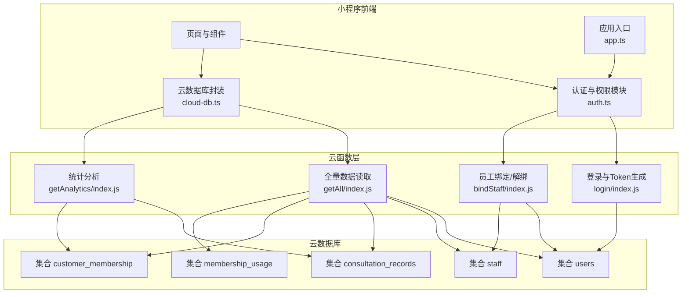
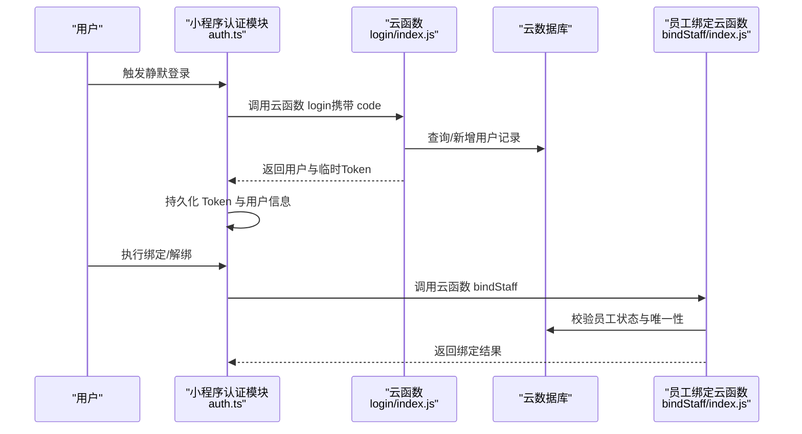
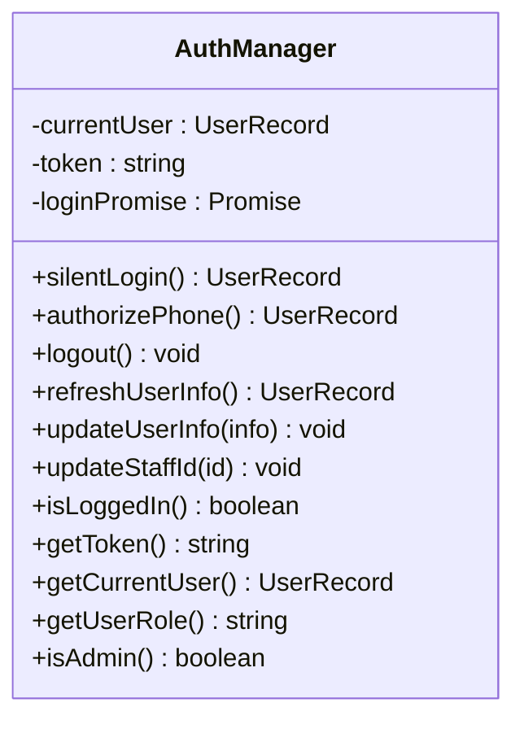
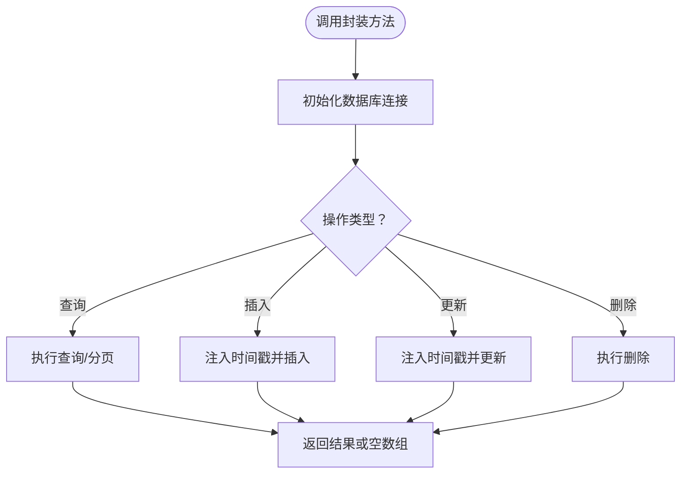
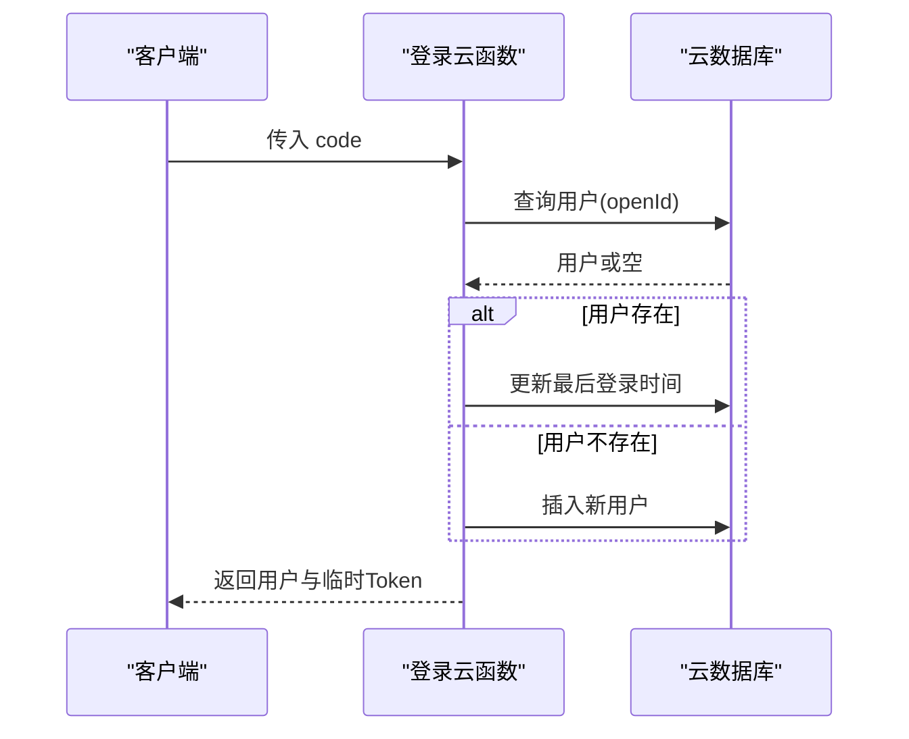
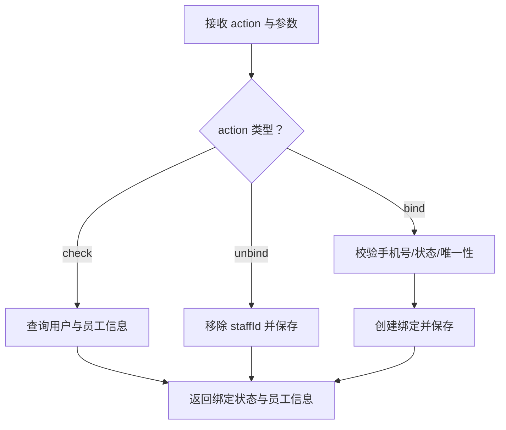
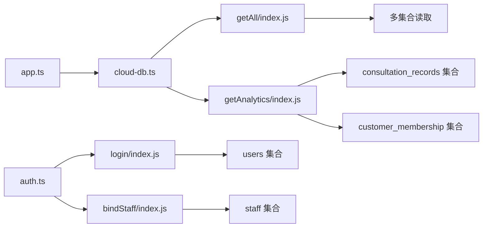

# 数据安全保障

<cite>
**本文引用的文件**
- [login/index.js](file://cloudfunctions/login/index.js)
- [bindStaff/index.js](file://cloudfunctions/bindStaff/index.js)
- [auth.ts](file://miniprogram/utils/auth.ts)
- [cloud-db.ts](file://miniprogram/utils/cloud-db.ts)
- [permission.ts](file://miniprogram/utils/permission.ts)
- [getAll/index.js](file://cloudfunctions/getAll/index.js)
- [getAnalytics/index.js](file://cloudfunctions/getAnalytics/index.js)
- [app.ts](file://miniprogram/app.ts)
- [project.config.json](file://project.config.json)
- [index.ts](file://miniprogram/config/index.ts)
- [util.ts](file://miniprogram/utils/util.ts)
</cite>

## 目录
1. [引言](#引言)
2. [项目结构](#项目结构)
3. [核心组件](#核心组件)
4. [架构总览](#架构总览)
5. [详细组件分析](#详细组件分析)
6. [依赖关系分析](#依赖关系分析)
7. [性能考量](#性能考量)
8. [故障排查指南](#故障排查指南)
9. [结论](#结论)
10. [附录](#附录)

## 引言
本文件面向“数据安全保障”，系统化梳理云端数据安全策略与实践，覆盖数据库访问控制、数据加密与传输安全、用户隐私保护（含个人信息脱敏、数据最小化、用户同意机制）、数据访问日志与审计、敏感数据处理（密码哈希、Token管理、会话数据保护）、备份与灾难恢复、数据完整性校验、以及数据安全政策与合规检查清单。文档以代码库为依据，结合前端小程序与云函数层实现，给出可落地的安全建议与最佳实践。

## 项目结构
项目采用微信小程序 + 云开发（CloudBase）架构：前端通过 wx.cloud 调用云函数，云函数访问云数据库，部分功能通过云函数聚合查询与统计分析。整体安全边界围绕“前端信任但不可信”“后端服务端可信”展开，强调服务端逻辑与数据访问控制。

图表来源
- [auth.ts](file://miniprogram/utils/auth.ts#L1-L245)
- [cloud-db.ts](file://miniprogram/utils/cloud-db.ts#L1-L321)
- [login/index.js](file://cloudfunctions/login/index.js#L1-L180)
- [bindStaff/index.js](file://cloudfunctions/bindStaff/index.js#L1-L189)
- [getAll/index.js](file://cloudfunctions/getAll/index.js#L1-L59)
- [getAnalytics/index.js](file://cloudfunctions/getAnalytics/index.js#L1-L172)
- [app.ts](file://miniprogram/app.ts#L1-L191)

章节来源
- [project.config.json](file://project.config.json#L1-L54)
- [index.ts](file://miniprogram/config/index.ts#L1-L18)

## 核心组件
- 前端认证与会话管理：负责静默登录、Token持久化、用户信息刷新与登出。
- 云数据库封装：统一封装查询、分页、插入、更新、删除等操作，统一时间戳与错误处理。
- 权限控制：基于角色的页面与按钮级权限映射，限制敏感操作。
- 登录与绑定：登录流程生成临时Token；员工绑定/解绑涉及手机号校验与状态检查。
- 全量数据读取：用于后台管理或导出场景，需严格控制调用来源与范围。
- 统计分析：按日期区间聚合消费、收入、性别分布等指标。

章节来源
- [auth.ts](file://miniprogram/utils/auth.ts#L1-L245)
- [cloud-db.ts](file://miniprogram/utils/cloud-db.ts#L1-L321)
- [permission.ts](file://miniprogram/utils/permission.ts#L1-L194)
- [login/index.js](file://cloudfunctions/login/index.js#L1-L180)
- [bindStaff/index.js](file://cloudfunctions/bindStaff/index.js#L1-L189)
- [getAll/index.js](file://cloudfunctions/getAll/index.js#L1-L59)
- [getAnalytics/index.js](file://cloudfunctions/getAnalytics/index.js#L1-L172)

## 架构总览
下图展示从用户触发到云函数与数据库交互的关键路径，并标注安全关注点。

图表来源
- [auth.ts](file://miniprogram/utils/auth.ts#L78-L126)
- [login/index.js](file://cloudfunctions/login/index.js#L11-L90)
- [bindStaff/index.js](file://cloudfunctions/bindStaff/index.js#L10-L51)

## 详细组件分析

### 认证与会话管理（auth.ts）
- 设计要点
  - 单例模式管理当前用户与Token，避免重复登录。
  - 静默登录优先使用本地存储，失败再发起云函数登录。
  - 登录成功后持久化用户与Token至本地存储。
  - 提供刷新用户信息与更新员工ID的接口。
- 安全建议
  - 当前Token为Base64编码字符串，建议替换为短期有效、服务端签发的JWT，并启用HTTPS与安全Cookie（若迁移至Web后端）。
  - 对本地存储进行加密（如使用对称加密库），防止设备泄露导致Token被读取。
  - 在App生命周期中增加Token过期检测与自动刷新策略。

图表来源
- [auth.ts](file://miniprogram/utils/auth.ts#L4-L222)

章节来源
- [auth.ts](file://miniprogram/utils/auth.ts#L1-L245)

### 云数据库封装（cloud-db.ts）
- 设计要点
  - 统一初始化与环境配置，支持动态envId。
  - 封装查询、分页、插入、更新、删除等常用操作。
  - 自动注入createdAt/updatedAt时间戳。
  - 错误兜底返回空结果，避免前端崩溃。
- 安全建议
  - 对所有写操作增加权限校验与字段白名单。
  - 分页查询默认限制最大条数，防止大范围扫描。
  - 对敏感字段（如手机号）在前端脱敏显示，仅在必要时传递原始值。

图表来源
- [cloud-db.ts](file://miniprogram/utils/cloud-db.ts#L69-L255)

章节来源
- [cloud-db.ts](file://miniprogram/utils/cloud-db.ts#L1-L321)

### 登录与Token生成（login/index.js）
- 设计要点
  - 使用微信code换取用户上下文OPENID，查询或创建用户记录。
  - 新增用户时设置初始角色与状态，记录最后登录时间。
  - 生成临时Token（Base64编码），包含OPENID与时间戳随机串。
- 安全建议
  - Token应具备有效期与服务端签名校验，避免长期有效与可逆推。
  - 登录流程中对OPENID进行幂等处理，避免重复创建。
  - 对异常情况返回统一错误码，避免泄露内部细节。

图表来源
- [login/index.js](file://cloudfunctions/login/index.js#L11-L90)

章节来源
- [login/index.js](file://cloudfunctions/login/index.js#L1-L180)

### 员工绑定/解绑（bindStaff/index.js）
- 设计要点
  - 校验手机号格式与员工状态，确保绑定唯一性。
  - 支持检查、绑定、解绑三种动作。
  - 绑定成功后更新用户记录中的staffId。
- 安全建议
  - 绑定前对手机号进行二次确认与短信验证码校验。
  - 解绑时记录操作人与时间，便于审计。
  - 对staffId字段变更进行权限校验与日志记录。

图表来源
- [bindStaff/index.js](file://cloudfunctions/bindStaff/index.js#L10-L51)

章节来源
- [bindStaff/index.js](file://cloudfunctions/bindStaff/index.js#L1-L189)

### 权限控制（permission.ts）
- 设计要点
  - 基于角色映射页面与按钮级权限。
  - 提供权限校验与跳转提示。
- 安全建议
  - 页面路由守卫中强制校验权限。
  - 对高风险操作（如导出数据）增加二次确认与日志记录。

章节来源
- [permission.ts](file://miniprogram/utils/permission.ts#L1-L194)

### 全量数据读取（getAll/index.js）
- 设计要点
  - 支持遍历读取指定集合，分批拉取避免超限。
- 安全建议
  - 限制集合白名单与调用频率，防止滥用。
  - 对返回数据进行脱敏与最小化输出。

章节来源
- [getAll/index.js](file://cloudfunctions/getAll/index.js#L1-L59)

### 统计分析（getAnalytics/index.js）
- 设计要点
  - 按日期区间聚合消费、收入、性别与平台分布等指标。
- 安全建议
  - 对输入日期进行严格校验与范围限制。
  - 输出聚合结果，避免直接暴露明细数据。

章节来源
- [getAnalytics/index.js](file://cloudfunctions/getAnalytics/index.js#L1-L172)

### 应用入口与全局数据加载（app.ts）
- 设计要点
  - 启动时尝试静默登录并加载全局基础数据。
  - 提供轮值队列与技师服务等业务云函数调用。
- 安全建议
  - 登录失败时重定向至登录页，避免未授权页面渲染。
  - 全局数据加载失败时进行降级处理与错误上报。

章节来源
- [app.ts](file://miniprogram/app.ts#L1-L191)

## 依赖关系分析
- 前端依赖
  - 微信小程序SDK（wx.cloud）用于云函数调用与数据库访问。
  - TypeScript类型定义保障数据模型一致性。
- 云函数依赖
  - wx-server-sdk 初始化与数据库命令。
  - 云数据库集合：users、staff、consultation_records、customer_membership、membership_usage等。
- 配置依赖
  - 项目配置文件指定了云函数根目录与云开发环境ID。

图表来源
- [auth.ts](file://miniprogram/utils/auth.ts#L1-L245)
- [cloud-db.ts](file://miniprogram/utils/cloud-db.ts#L1-L321)
- [login/index.js](file://cloudfunctions/login/index.js#L1-L180)
- [bindStaff/index.js](file://cloudfunctions/bindStaff/index.js#L1-L189)
- [getAll/index.js](file://cloudfunctions/getAll/index.js#L1-L59)
- [getAnalytics/index.js](file://cloudfunctions/getAnalytics/index.js#L1-L172)
- [app.ts](file://miniprogram/app.ts#L1-L191)

章节来源
- [project.config.json](file://project.config.json#L1-L54)
- [index.ts](file://miniprogram/config/index.ts#L1-L18)

## 性能考量
- 分页与批量读取
  - 云函数全量读取采用分批拉取，避免一次性返回过多数据。
- 并发与缓存
  - 前端App在启动时并发加载全局基础数据，减少等待时间。
- 时间复杂度
  - 查询与更新操作遵循集合索引设计，避免全表扫描。
- 建议
  - 对高频查询建立复合索引；对统计类查询考虑物化视图或预聚合。

章节来源
- [getAll/index.js](file://cloudfunctions/getAll/index.js#L25-L44)
- [app.ts](file://miniprogram/app.ts#L48-L53)

## 故障排查指南
- 登录失败
  - 检查云函数返回的错误码与message，确认code是否有效。
  - 核对用户集合是否存在对应openId记录。
- 绑定失败
  - 校验手机号格式、员工状态与唯一性约束。
  - 查看staff集合是否存在目标员工。
- 查询异常
  - 检查集合名称与查询条件，确认权限与索引。
- 权限不足
  - 确认用户角色与页面/按钮权限映射。
- 统计异常
  - 校验日期格式与范围，确认集合数据完整性。

章节来源
- [login/index.js](file://cloudfunctions/login/index.js#L84-L89)
- [bindStaff/index.js](file://cloudfunctions/bindStaff/index.js#L121-L139)
- [cloud-db.ts](file://miniprogram/utils/cloud-db.ts#L108-L123)
- [permission.ts](file://miniprogram/utils/permission.ts#L163-L173)
- [getAnalytics/index.js](file://cloudfunctions/getAnalytics/index.js#L36-L51)

## 结论
本项目在前端与云函数层面实现了基础的认证、权限与数据访问控制。为进一步强化数据安全保障，建议引入短期JWT、服务端签名校验、本地存储加密、严格的输入校验与审计日志、以及完善的备份与灾难恢复机制。同时，持续完善隐私政策与合规检查清单，确保满足数据最小化与用户同意要求。

## 附录

### 数据安全策略清单
- 认证与会话
  - 使用短期有效的服务端签发Token，启用HTTPS与安全存储。
  - 实施Token过期检测与自动刷新。
- 数据库访问控制
  - 为敏感集合建立最小权限访问策略。
  - 对写操作进行字段白名单与权限校验。
- 数据加密与传输
  - 传输链路使用TLS 1.3以上版本。
  - 本地存储敏感数据采用对称加密。
- 用户隐私保护
  - 明确最小化原则，仅收集必要信息。
  - 对手机号等敏感字段进行前端脱敏显示。
  - 建立用户同意机制与撤回通道。
- 日志与审计
  - 记录关键操作（登录、绑定、修改、导出）的审计日志。
  - 设置异常监控与告警阈值。
- 敏感数据处理
  - 密码哈希采用业界标准算法（如bcrypt）。
  - Token与会话数据不落盘或加密存储。
- 备份与恢复
  - 制定定期备份策略与恢复演练计划。
  - 验证备份数据的完整性与可恢复性。
- 合规性检查
  - 明确隐私政策与数据处理目的。
  - 建立数据主体权利（访问、更正、删除、可携权）实现流程。

### 数据完整性验证
- 前端：对关键字段进行格式校验与必填校验。
- 服务端：对写入数据进行字段白名单与类型校验。
- 统计：对聚合结果进行交叉验证与异常值检测。

### 云开发环境配置
- 环境ID与云函数根目录在项目配置中明确，确保部署一致性。

章节来源
- [project.config.json](file://project.config.json#L50-L53)
- [index.ts](file://miniprogram/config/index.ts#L5-L15)