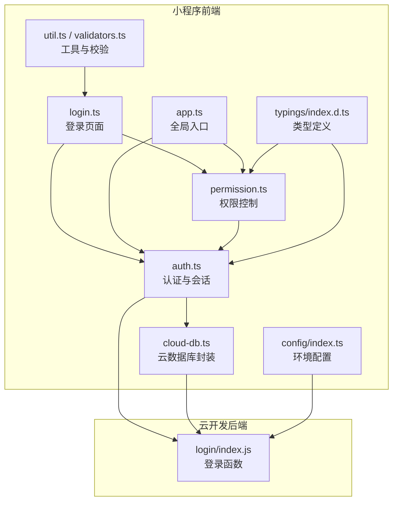
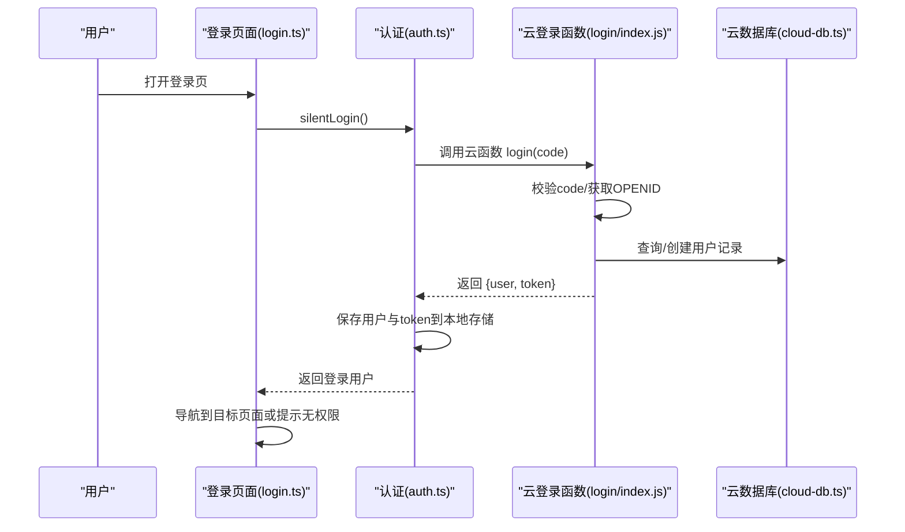
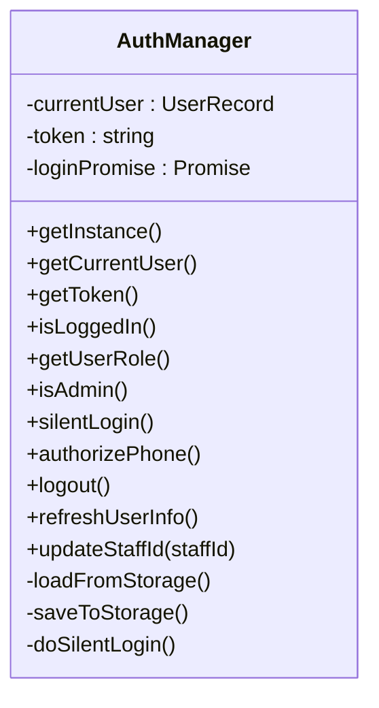
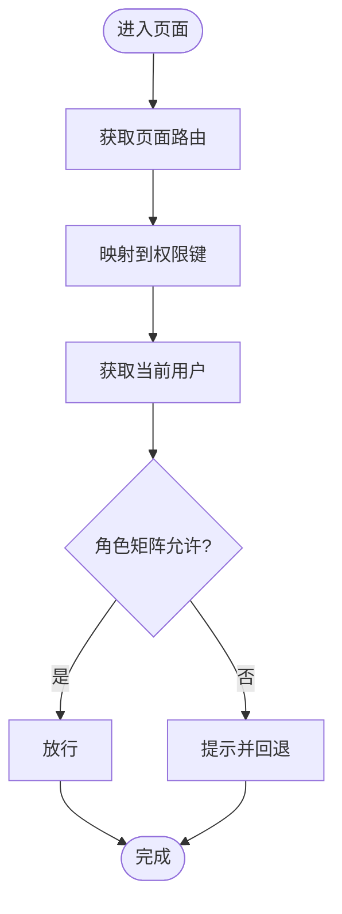
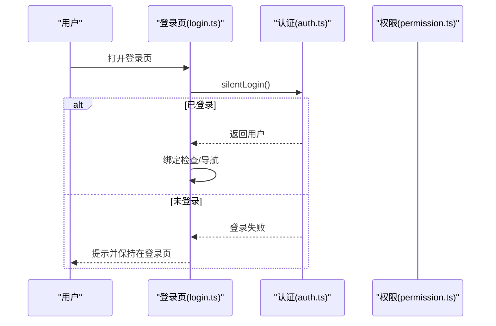
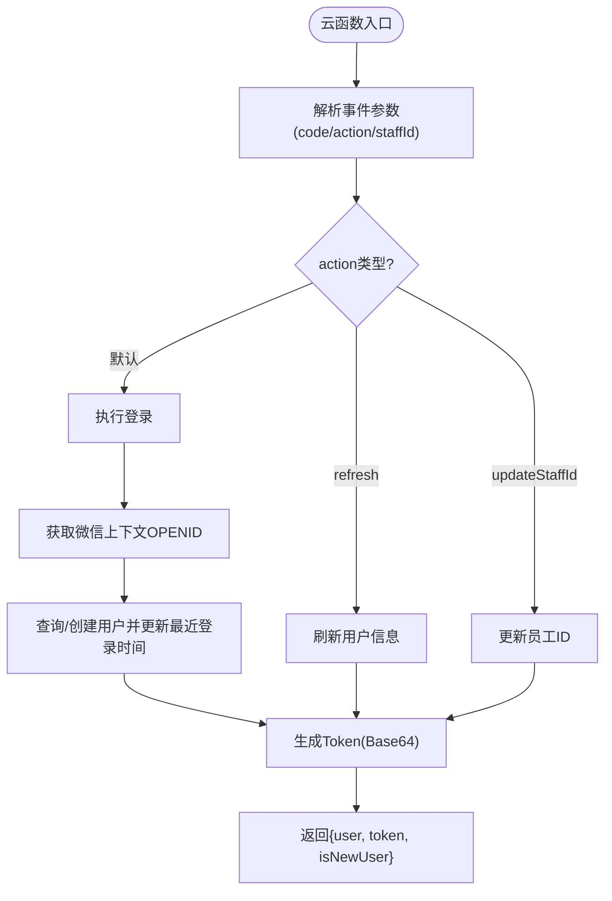
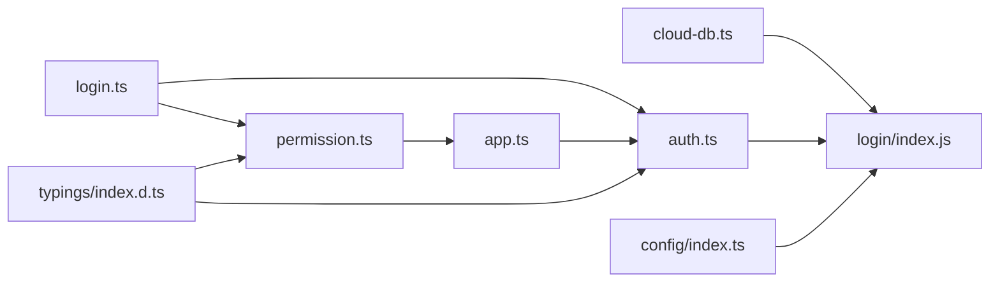

# 权限与安全

<cite>
**本文引用的文件**
- [miniprogram/utils/auth.ts](file://miniprogram/utils/auth.ts)
- [miniprogram/utils/permission.ts](file://miniprogram/utils/permission.ts)
- [miniprogram/pages/login/login.ts](file://miniprogram/pages/login/login.ts)
- [cloudfunctions/login/index.js](file://cloudfunctions/login/index.js)
- [miniprogram/app.ts](file://miniprogram/app.ts)
- [miniprogram/utils/cloud-db.ts](file://miniprogram/utils/cloud-db.ts)
- [miniprogram/config/index.ts](file://miniprogram/config/index.ts)
- [typings/index.d.ts](file://typings/index.d.ts)
- [miniprogram/utils/util.ts](file://miniprogram/utils/util.ts)
- [miniprogram/utils/validators.ts](file://miniprogram/utils/validators.ts)
</cite>

## 目录
1. [引言](#引言)
2. [项目结构](#项目结构)
3. [核心组件](#核心组件)
4. [架构总览](#架构总览)
5. [详细组件分析](#详细组件分析)
6. [依赖关系分析](#依赖关系分析)
7. [性能与安全特性](#性能与安全特性)
8. [故障排查指南](#故障排查指南)
9. [结论](#结论)
10. [附录](#附录)

## 引言
本文件面向权限与安全模块，系统性梳理用户认证机制、权限控制系统与数据安全保障措施。重点覆盖：
- Auth 工具类的登录状态管理、Token 处理与会话维护
- Permission 权限控制的实现逻辑（角色定义、权限验证与访问控制）
- Login 页面的安全设计（密码加密、防暴力破解与安全登录流程）
- 数据安全最佳实践、敏感信息保护与隐私合规建议
- 安全审计、日志记录与异常监控机制
- 安全漏洞防护、渗透测试与应急响应方案

## 项目结构
围绕权限与安全的关键文件分布如下：
- 小程序前端
  - 认证与会话：miniprogram/utils/auth.ts
  - 权限控制：miniprogram/utils/permission.ts
  - 登录页面：miniprogram/pages/login/login.ts
  - 全局应用入口：miniprogram/app.ts
  - 云数据库封装：miniprogram/utils/cloud-db.ts
  - 配置：miniprogram/config/index.ts
  - 类型定义：typings/index.d.ts
  - 工具与校验：miniprogram/utils/util.ts、miniprogram/utils/validators.ts
- 云开发后端
  - 登录函数：cloudfunctions/login/index.js

图表来源
- [miniprogram/utils/auth.ts](file://miniprogram/utils/auth.ts#L1-L245)
- [miniprogram/utils/permission.ts](file://miniprogram/utils/permission.ts#L1-L194)
- [miniprogram/pages/login/login.ts](file://miniprogram/pages/login/login.ts#L1-L166)
- [miniprogram/app.ts](file://miniprogram/app.ts#L1-L191)
- [miniprogram/utils/cloud-db.ts](file://miniprogram/utils/cloud-db.ts#L1-L321)
- [miniprogram/config/index.ts](file://miniprogram/config/index.ts#L1-L18)
- [cloudfunctions/login/index.js](file://cloudfunctions/login/index.js#L1-L180)
- [typings/index.d.ts](file://typings/index.d.ts#L252-L306)
- [miniprogram/utils/util.ts](file://miniprogram/utils/util.ts#L1-L150)
- [miniprogram/utils/validators.ts](file://miniprogram/utils/validators.ts#L1-L80)

章节来源
- [miniprogram/utils/auth.ts](file://miniprogram/utils/auth.ts#L1-L245)
- [miniprogram/utils/permission.ts](file://miniprogram/utils/permission.ts#L1-L194)
- [miniprogram/pages/login/login.ts](file://miniprogram/pages/login/login.ts#L1-L166)
- [cloudfunctions/login/index.js](file://cloudfunctions/login/index.js#L1-L180)
- [miniprogram/app.ts](file://miniprogram/app.ts#L1-L191)
- [miniprogram/utils/cloud-db.ts](file://miniprogram/utils/cloud-db.ts#L1-L321)
- [miniprogram/config/index.ts](file://miniprogram/config/index.ts#L1-L18)
- [typings/index.d.ts](file://typings/index.d.ts#L252-L306)
- [miniprogram/utils/util.ts](file://miniprogram/utils/util.ts#L1-L150)
- [miniprogram/utils/validators.ts](file://miniprogram/utils/validators.ts#L1-L80)

## 核心组件
- 认证与会话管理（AuthManager）
  - 单例模式，负责用户信息与 Token 的本地持久化与同步刷新
  - 提供静默登录、授权手机号、刷新用户信息、登出等能力
- 权限控制（Permission）
  - 基于角色的权限矩阵，提供页面级与按钮级权限判断
  - 对访问路径进行动态权限判定
- 登录页面（Login）
  - 负责触发静默登录、处理登录结果、引导绑定流程与导航
- 云登录函数（login/index.js）
  - 通过微信云 SDK 获取用户上下文，完成用户查询/创建、Token 生成与返回
- 全局应用入口（app.ts）
  - 启动阶段初始化登录状态，全局拦截未登录跳转至登录页
- 云数据库封装（cloud-db.ts）
  - 统一封装云数据库调用，统一错误处理与返回格式
- 类型与配置（typings/index.d.ts、config/index.ts）
  - 定义用户角色、权限、数据模型与云环境配置

章节来源
- [miniprogram/utils/auth.ts](file://miniprogram/utils/auth.ts#L4-L220)
- [miniprogram/utils/permission.ts](file://miniprogram/utils/permission.ts#L3-L194)
- [miniprogram/pages/login/login.ts](file://miniprogram/pages/login/login.ts#L1-L166)
- [cloudfunctions/login/index.js](file://cloudfunctions/login/index.js#L11-L90)
- [miniprogram/app.ts](file://miniprogram/app.ts#L13-L38)
- [miniprogram/utils/cloud-db.ts](file://miniprogram/utils/cloud-db.ts#L12-L321)
- [typings/index.d.ts](file://typings/index.d.ts#L252-L306)
- [miniprogram/config/index.ts](file://miniprogram/config/index.ts#L5-L15)

## 架构总览
下图展示从用户进入小程序到完成登录与权限校验的整体流程，以及前后端交互与数据存储关系。

图表来源
- [miniprogram/pages/login/login.ts](file://miniprogram/pages/login/login.ts#L15-L49)
- [miniprogram/utils/auth.ts](file://miniprogram/utils/auth.ts#L78-L126)
- [cloudfunctions/login/index.js](file://cloudfunctions/login/index.js#L11-L90)
- [miniprogram/utils/cloud-db.ts](file://miniprogram/utils/cloud-db.ts#L69-L88)

## 详细组件分析

### 认证与会话管理（AuthManager）
- 设计要点
  - 单例模式，避免重复实例造成状态不同步
  - 本地存储键名固定，分别保存用户信息与 Token
  - 静默登录去重：同一时刻仅一次登录请求
  - 支持授权手机号、刷新用户信息、更新员工 ID 等扩展动作
- 关键流程
  - 静默登录：若本地已有用户与 Token，则直接返回；否则通过 wx.login 获取临时 code，调用云函数 login，解析返回的用户与 Token 并持久化
  - 授权手机号：调用云函数 login(action='authorizePhone')，更新用户信息与 Token
  - 刷新用户信息：调用云函数 login(action='refresh')，重新生成 Token
  - 登出：清空本地存储并跳转登录页
- 安全考虑
  - Token 由云函数生成，前端仅作为访问凭证存储，不暴露在客户端业务逻辑中
  - 本地存储采用小程序云提供的 wx.get/setStorageSync，具备一定隔离性
  - 登录态依赖微信 code 与云函数校验，前端不直接持有长期密钥

图表来源
- [miniprogram/utils/auth.ts](file://miniprogram/utils/auth.ts#L4-L220)

章节来源
- [miniprogram/utils/auth.ts](file://miniprogram/utils/auth.ts#L4-L220)

### 权限控制系统（Permission）
- 角色与权限
  - 角色类型：admin、cashier、technician、viewer
  - 权限字段涵盖页面访问与按钮操作两大类
  - 基于角色的权限矩阵集中定义，便于统一维护与审计
- 权限判定
  - 页面级权限：根据页面路径映射到权限键，再查角色矩阵
  - 按钮级权限：直接按权限键查角色矩阵
  - 访问控制：requirePagePermission 在无权限时弹提示并回退
- 安全意义
  - 将“谁可以做什么”集中定义，避免分散硬编码导致的权限绕过
  - 通过 hasPagePermission 与 canAccessPage 在前端进行快速判定，减少无效请求

图表来源
- [miniprogram/utils/permission.ts](file://miniprogram/utils/permission.ts#L175-L194)

章节来源
- [miniprogram/utils/permission.ts](file://miniprogram/utils/permission.ts#L3-L194)
- [typings/index.d.ts](file://typings/index.d.ts#L252-L282)

### 登录页面安全设计
- 登录流程
  - 静默登录：onLoad/onLogin 调用 authManager.silentLogin，自动完成登录态检查与跳转
  - 绑定流程：技师角色且未绑定员工 ID 时，引导跳转绑定页面
  - 成功后根据权限决定首页或收银页
- 安全要点
  - 未登录自动跳转登录页，防止未授权访问
  - 登录成功后延迟导航，避免页面切换过快导致的异常
  - 授权手机号回调中进行错误处理与提示
- 防暴力破解建议
  - 当前实现未见显式防暴力破解策略（如失败次数限制、滑块验证码、短信验证码等），可在登录函数侧增加限制与风控

图表来源
- [miniprogram/pages/login/login.ts](file://miniprogram/pages/login/login.ts#L15-L133)
- [miniprogram/utils/permission.ts](file://miniprogram/utils/permission.ts#L163-L173)

章节来源
- [miniprogram/pages/login/login.ts](file://miniprogram/pages/login/login.ts#L1-L166)

### 云登录函数（登录与Token）
- 功能概述
  - 校验 code，获取微信上下文 OPENID
  - 查询/创建用户记录，更新最近登录时间
  - 生成 Token 并返回给前端
  - 支持刷新用户信息与更新员工 ID
- Token 生成
  - 基于 OPENID、时间戳与随机串进行 Base64 编码，作为轻量 Token
- 安全建议
  - 当前 Token 未设置过期时间，建议引入过期控制与刷新机制
  - 建议在云函数侧增加登录失败次数限制与 IP/设备风控

图表来源
- [cloudfunctions/login/index.js](file://cloudfunctions/login/index.js#L11-L180)

章节来源
- [cloudfunctions/login/index.js](file://cloudfunctions/login/index.js#L11-L180)

### 全局应用入口与会话维护
- 启动初始化：onLaunch 调用 initLogin，读取 authManager 状态并注入全局数据
- 前台显示拦截：onShow 中若当前页非登录页且未登录，强制 reLaunch 到登录页
- 作用：确保全局一致的登录态与页面访问控制

章节来源
- [miniprogram/app.ts](file://miniprogram/app.ts#L13-L38)

### 云数据库封装与数据安全
- 统一封装：getAll/find/insert/update/delete 等方法，统一错误处理与返回格式
- 安全要点
  - 所有数据库操作通过云函数调用，避免前端直连数据库
  - 错误处理中对“文档不存在”等场景进行容错，避免泄露内部细节
  - 建议在云函数层增加鉴权与参数校验，防止越权与注入风险

章节来源
- [miniprogram/utils/cloud-db.ts](file://miniprogram/utils/cloud-db.ts#L69-L203)

## 依赖关系分析
- 前端依赖
  - 登录页依赖认证与权限模块
  - 应用入口依赖认证模块进行全局拦截
  - 云数据库封装被多处业务模块复用
- 后端依赖
  - 登录函数依赖云数据库与微信上下文
- 类型与配置
  - 类型定义贯穿前后端，保证数据结构一致性
  - 环境配置集中管理云环境 ID

图表来源
- [miniprogram/pages/login/login.ts](file://miniprogram/pages/login/login.ts#L1-L3)
- [miniprogram/utils/auth.ts](file://miniprogram/utils/auth.ts#L1-L3)
- [miniprogram/utils/permission.ts](file://miniprogram/utils/permission.ts#L1-L2)
- [miniprogram/app.ts](file://miniprogram/app.ts#L1-L2)
- [miniprogram/utils/cloud-db.ts](file://miniprogram/utils/cloud-db.ts#L1-L2)
- [cloudfunctions/login/index.js](file://cloudfunctions/login/index.js#L1-L5)
- [miniprogram/config/index.ts](file://miniprogram/config/index.ts#L1-L15)
- [typings/index.d.ts](file://typings/index.d.ts#L252-L306)

章节来源
- [miniprogram/pages/login/login.ts](file://miniprogram/pages/login/login.ts#L1-L3)
- [miniprogram/utils/auth.ts](file://miniprogram/utils/auth.ts#L1-L3)
- [miniprogram/utils/permission.ts](file://miniprogram/utils/permission.ts#L1-L2)
- [miniprogram/app.ts](file://miniprogram/app.ts#L1-L2)
- [miniprogram/utils/cloud-db.ts](file://miniprogram/utils/cloud-db.ts#L1-L2)
- [cloudfunctions/login/index.js](file://cloudfunctions/login/index.js#L1-L5)
- [miniprogram/config/index.ts](file://miniprogram/config/index.ts#L1-L15)
- [typings/index.d.ts](file://typings/index.d.ts#L252-L306)

## 性能与安全特性
- 性能
  - 静默登录去重：loginPromise 避免并发重复登录
  - 本地存储：减少重复网络请求，提升首屏体验
- 安全
  - 前端不持有长期密钥，Token 由云函数生成并下发
  - 登录态依赖微信 code 与云函数校验，降低中间人攻击风险
  - 权限集中定义，避免分散硬编码导致的绕过

[本节为通用讨论，无需列出具体文件来源]

## 故障排查指南
- 登录失败
  - 检查 wx.login 是否成功获取 code
  - 检查云函数返回的响应格式与错误信息
  - 确认用户是否被禁用或状态异常
- 权限不足
  - 使用 hasPagePermission/canAccessPage 进行调试
  - 核对角色与权限矩阵配置
- 数据访问异常
  - 检查云数据库封装的错误处理分支
  - 确认集合名称与查询条件
- Token 问题
  - 确认前端存储的 token 是否存在
  - 若需刷新，调用 refreshUserInfo 重新获取

章节来源
- [miniprogram/utils/auth.ts](file://miniprogram/utils/auth.ts#L78-L126)
- [miniprogram/utils/permission.ts](file://miniprogram/utils/permission.ts#L149-L173)
- [miniprogram/utils/cloud-db.ts](file://miniprogram/utils/cloud-db.ts#L69-L203)
- [cloudfunctions/login/index.js](file://cloudfunctions/login/index.js#L84-L90)

## 结论
本项目在权限与安全方面采用了“前端认证 + 云函数鉴权 + 角色权限矩阵”的整体设计，实现了基本的登录态管理、权限控制与数据访问隔离。为进一步提升安全性，建议：
- 在云函数侧增加登录失败次数限制与风控策略
- 引入 Token 过期与刷新机制
- 对敏感操作增加二次确认与审计日志
- 在前端增加输入校验与异常监控上报

[本节为总结性内容，无需列出具体文件来源]

## 附录

### 数据安全最佳实践
- 敏感信息保护
  - 不在前端存储明文密码或长期密钥
  - 使用微信 code 与云函数校验，避免前端直连数据库
- 隐私合规
  - 明确收集与使用范围，遵循最小必要原则
  - 提供用户撤回授权与删除数据的渠道
- 数据传输
  - 使用 HTTPS 通道，避免明文传输
  - 对外暴露的 API 增加鉴权与限流

[本节为通用指导，无需列出具体文件来源]

### 安全审计与日志
- 建议在云函数中记录登录、权限变更、敏感操作等关键事件
- 前端可记录异常与错误堆栈，配合后端日志定位问题
- 定期审计权限矩阵与访问日志，发现异常及时处置

[本节为通用指导，无需列出具体文件来源]

### 渗透测试与应急响应
- 渗透测试
  - 模拟越权访问、SQL 注入、XSS、CSRF 等常见攻击
  - 对登录函数与权限接口进行专项测试
- 应急响应
  - 建立快速封禁与回滚机制
  - 明确事件分级与上报流程
  - 定期演练与复盘

[本节为通用指导，无需列出具体文件来源]