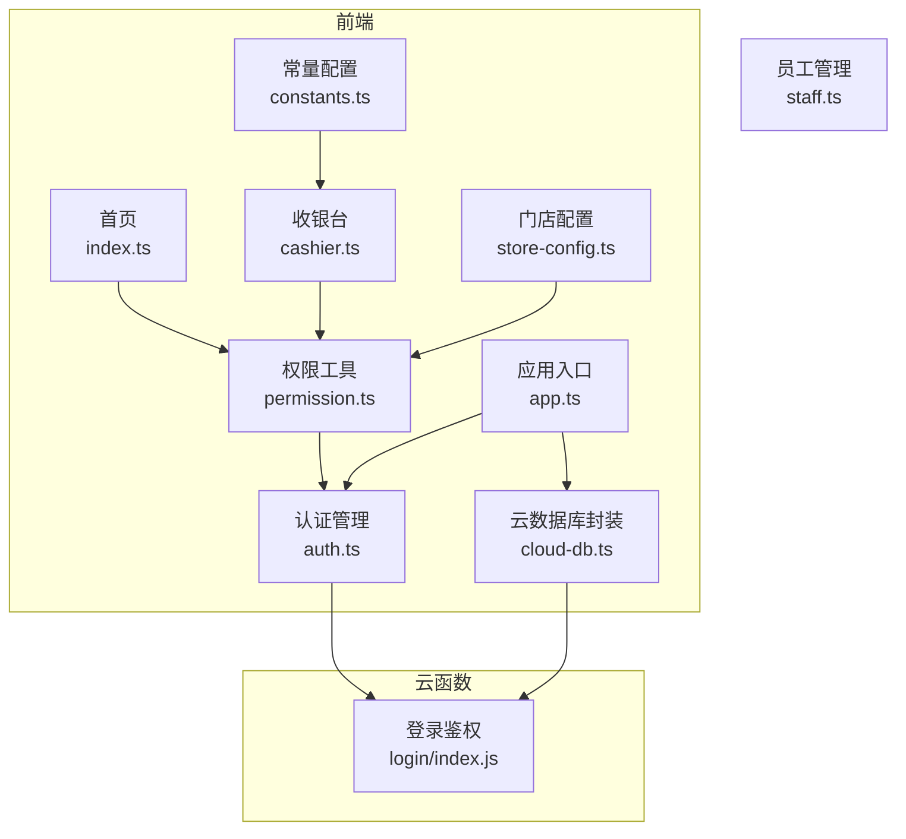
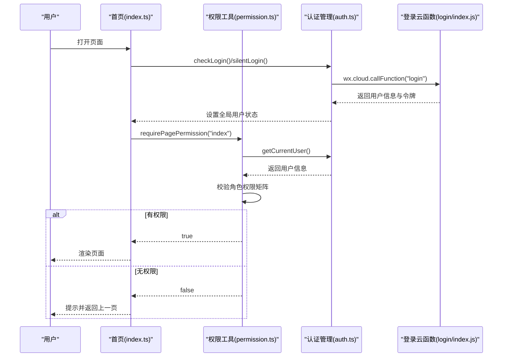
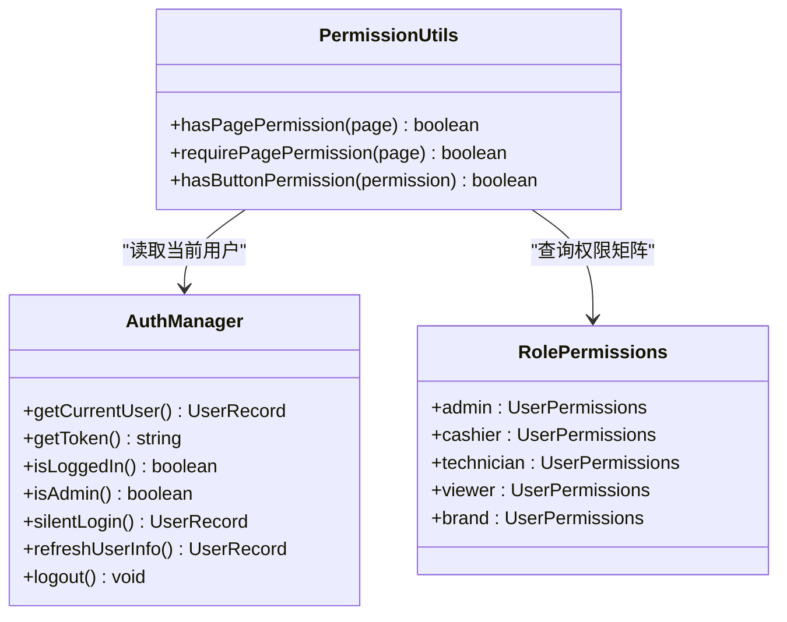
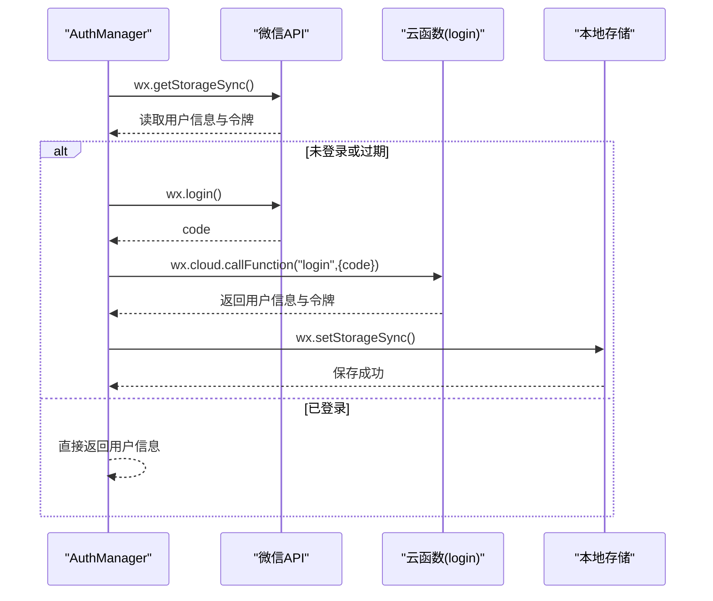
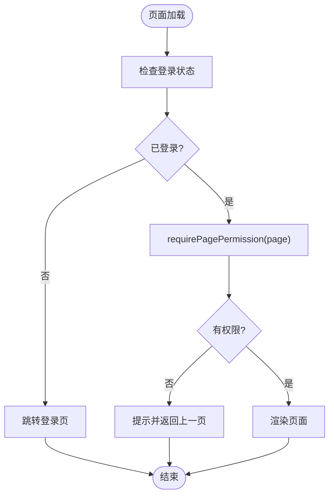
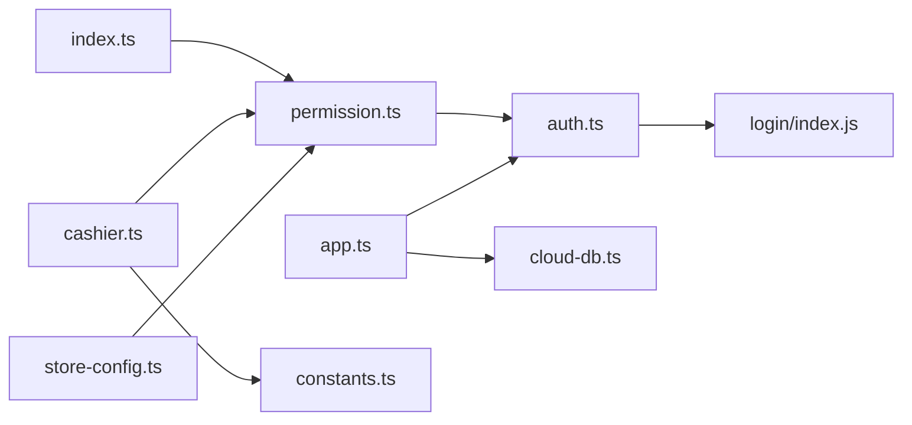
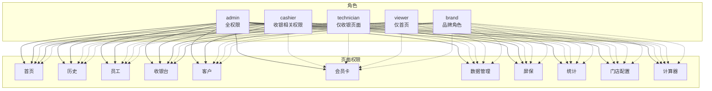

# 权限控制系统

<cite>
**本文档引用的文件**
- [miniprogram/utils/permission.ts](file://miniprogram/utils/permission.ts)
- [miniprogram/utils/auth.ts](file://miniprogram/utils/auth.ts)
- [miniprogram/app.ts](file://miniprogram/app.ts)
- [miniprogram/pages/index/index.ts](file://miniprogram/pages/index/index.ts)
- [miniprogram/pages/cashier/cashier.ts](file://miniprogram/pages/cashier/cashier.ts)
- [miniprogram/pages/store-config/store-config.ts](file://miniprogram/pages/store-config/store-config.ts)
- [cloudfunctions/login/index.js](file://cloudfunctions/login/index.js)
- [typings/index.d.ts](file://typings/index.d.ts)
- [miniprogram/utils/cloud-db.ts](file://miniprogram/utils/cloud-db.ts)
- [miniprogram/utils/constants.ts](file://miniprogram/utils/constants.ts)
</cite>

## 更新摘要
**变更内容**
- 移除了 `canAccessPage` 函数，简化权限系统架构
- 保留并优化了 `hasPagePermission` 和 `requirePagePermission` 核心功能
- 更新权限检查机制，使权限系统更加直接和高效

## 目录
1. [简介](#简介)
2. [项目结构](#项目结构)
3. [核心组件](#核心组件)
4. [架构总览](#架构总览)
5. [详细组件分析](#详细组件分析)
6. [依赖关系分析](#依赖关系分析)
7. [性能考虑](#性能考虑)
8. [故障排查指南](#故障排查指南)
9. [结论](#结论)
10. [附录](#附录)

## 简介
本项目采用前端本地权限控制与云函数登录鉴权相结合的方式，构建了完整的权限控制系统。系统通过角色驱动的权限矩阵实现页面级、按钮级和API级的多层访问控制，确保不同用户角色在业务流程中的职责边界清晰且可审计。

**更新** 权限系统经过重构，移除了冗余的 `canAccessPage` 函数，简化了权限检查流程，提高了系统的执行效率和可维护性。

## 项目结构
权限控制相关的代码主要分布在以下模块：
- 权限工具：miniprogram/utils/permission.ts
- 认证管理：miniprogram/utils/auth.ts
- 应用入口：miniprogram/app.ts
- 页面级权限：各页面的 onLoad/onShow 中调用 requirePagePermission
- 云函数登录：cloudfunctions/login/index.js
- 类型定义：typings/index.d.ts
- 数据访问：miniprogram/utils/cloud-db.ts
- 常量配置：miniprogram/utils/constants.ts

图表来源
- [miniprogram/utils/permission.ts](file://miniprogram/utils/permission.ts#L1-L199)
- [miniprogram/utils/auth.ts](file://miniprogram/utils/auth.ts#L1-L245)
- [miniprogram/app.ts](file://miniprogram/app.ts#L1-L191)
- [miniprogram/pages/index/index.ts](file://miniprogram/pages/index/index.ts#L1-L755)
- [miniprogram/pages/cashier/cashier.ts](file://miniprogram/pages/cashier/cashier.ts#L1-L497)
- [miniprogram/pages/store-config/store-config.ts](file://miniprogram/pages/store-config/store-config.ts#L1-L47)
- [cloudfunctions/login/index.js](file://cloudfunctions/login/index.js#L1-L180)
- [miniprogram/utils/cloud-db.ts](file://miniprogram/utils/cloud-db.ts#L1-L321)
- [miniprogram/utils/constants.ts](file://miniprogram/utils/constants.ts#L1-L48)

章节来源
- [miniprogram/utils/permission.ts](file://miniprogram/utils/permission.ts#L1-L199)
- [miniprogram/utils/auth.ts](file://miniprogram/utils/auth.ts#L1-L245)
- [miniprogram/app.ts](file://miniprogram/app.ts#L1-L191)

## 核心组件
- 权限工具（Permission 工具类）
  - 角色权限矩阵：基于用户角色映射到具体权限布尔值
  - 页面权限检查：hasPagePermission、requirePagePermission
  - 按钮权限检查：hasButtonPermission
  - 权限映射：PagePermission/PagePermissionMap、ButtonPermission/ButtonPermissionMap
- 认证管理（AuthManager）
  - 单例模式：全局唯一实例
  - 本地存储：用户信息与令牌持久化
  - 静默登录：自动拉取用户信息
  - 令牌刷新：支持刷新用户信息与更新 staffId
- 应用入口（App）
  - 自动初始化登录状态
  - 全局数据加载与共享
  - 云函数调用封装

**更新** 权限工具类现在只包含两个核心函数：`hasPagePermission` 和 `requirePagePermission`，移除了冗余的 `canAccessPage` 函数，简化了权限检查流程。

章节来源
- [miniprogram/utils/permission.ts](file://miniprogram/utils/permission.ts#L3-L199)
- [miniprogram/utils/auth.ts](file://miniprogram/utils/auth.ts#L4-L222)
- [miniprogram/app.ts](file://miniprogram/app.ts#L4-L66)

## 架构总览
权限控制采用"前端本地权限 + 云函数登录鉴权"的双重保障机制：
- 前端本地权限：基于角色的权限矩阵，快速判断页面与按钮访问权限
- 云函数登录鉴权：统一的登录、刷新与用户信息维护，保证用户身份可信
- 页面级控制：每个页面在加载时进行权限校验，防止越权访问
- 组件级控制：按钮权限在交互时动态判断，避免无效操作

图表来源
- [miniprogram/pages/index/index.ts](file://miniprogram/pages/index/index.ts#L131-L135)
- [miniprogram/utils/permission.ts](file://miniprogram/utils/permission.ts#L188-L198)
- [miniprogram/utils/auth.ts](file://miniprogram/utils/auth.ts#L78-L126)
- [cloudfunctions/login/index.js](file://cloudfunctions/login/index.js#L11-L90)

## 详细组件分析

### 权限工具类（Permission 工具类）
- 角色权限矩阵
  - admin：拥有所有页面与按钮权限
  - cashier：有限页面与按钮权限，侧重收银与预约相关
  - technician：仅能访问收银页面，其他页面不可见
  - viewer：仅能访问首页，其他页面不可见
  - brand：品牌角色，权限与技师类似但更有限
- 页面权限检查
  - hasPagePermission：根据页面标识查询权限矩阵（用于动态UI控制）
  - requirePagePermission：无权限时给出提示并返回上一页（用于强制权限验证）
- 按钮权限检查
  - hasButtonPermission：根据按钮标识查询权限矩阵
- 权限映射
  - PagePermission 与 PAGE_PERMISSION_MAP
  - ButtonPermission 与 BUTTON_PERMISSION_MAP

**更新** 权限工具类现在移除了 `canAccessPage` 函数，简化了权限检查机制。现在只有两个核心函数：
- `hasPagePermission`：用于页面加载时的动态权限检查，控制UI元素的显示/隐藏
- `requirePagePermission`：用于页面生命周期中的强制权限验证，防止越权访问

图表来源
- [miniprogram/utils/permission.ts](file://miniprogram/utils/permission.ts#L46-L198)
- [miniprogram/utils/auth.ts](file://miniprogram/utils/auth.ts#L51-L69)

章节来源
- [miniprogram/utils/permission.ts](file://miniprogram/utils/permission.ts#L3-L199)

### 认证管理（AuthManager）
- 单例模式：getInstance 确保全局唯一实例
- 本地存储：STORAGE_KEY_USER/STORAGE_KEY_TOKEN 持久化用户信息与令牌
- 静默登录：silentLogin 自动拉取用户信息，避免重复请求
- 令牌刷新：refreshUserInfo 与 updateStaffId 支持用户信息更新
- 登出：logout 清空本地状态并跳转登录页

图表来源
- [miniprogram/utils/auth.ts](file://miniprogram/utils/auth.ts#L21-L126)
- [cloudfunctions/login/index.js](file://cloudfunctions/login/index.js#L11-L90)

章节来源
- [miniprogram/utils/auth.ts](file://miniprogram/utils/auth.ts#L4-L222)

### 应用入口（App）
- 自动初始化登录：initLogin 在应用启动时尝试静默登录
- 全局数据加载：loadGlobalData 并发加载项目、房间、精油、员工等基础数据
- 云函数调用：封装 manageRotation、getAvailableTechnicians 等常用操作

章节来源
- [miniprogram/app.ts](file://miniprogram/app.ts#L13-L66)

### 页面级权限控制
- 首页（index.ts）
  - 在 onLoad 中调用 requirePagePermission('index') 进行页面级权限校验
  - 无权限时提示并返回上一页
- 收银台（cashier.ts）
  - 在 onLoad/onShow 中调用 requirePagePermission('cashier') 与 hasButtonPermission('createReservation')/'pushRotation' 进行页面与按钮权限校验
- 员工管理（staff.ts）
  - 通过云数据库封装进行数据操作，权限由角色矩阵决定可见性
- 门店配置（store-config.ts）
  - 动态检测各模块权限并控制导航入口

**更新** 页面级权限控制现在只使用 `requirePagePermission` 函数进行强制权限验证，移除了对 `canAccessPage` 的依赖。

图表来源
- [miniprogram/pages/index/index.ts](file://miniprogram/pages/index/index.ts#L131-L135)
- [miniprogram/pages/cashier/cashier.ts](file://miniprogram/pages/cashier/cashier.ts#L125-L149)
- [miniprogram/pages/store-config/store-config.ts](file://miniprogram/pages/store-config/store-config.ts#L16-L27)
- [miniprogram/utils/permission.ts](file://miniprogram/utils/permission.ts#L188-L198)

章节来源
- [miniprogram/pages/index/index.ts](file://miniprogram/pages/index/index.ts#L131-L152)
- [miniprogram/pages/cashier/cashier.ts](file://miniprogram/pages/cashier/cashier.ts#L125-L152)
- [miniprogram/pages/store-config/store-config.ts](file://miniprogram/pages/store-config/store-config.ts#L16-L27)

### 组件级权限验证
- 收银台按钮权限
  - hasButtonPermission('createReservation') 控制新增预约按钮
  - hasButtonPermission('pushRotation') 控制推送轮牌按钮
- 交互时动态判断
  - 在用户点击操作前再次校验按钮权限，避免无效操作

**更新** 组件级权限验证现在完全依赖 `hasButtonPermission` 函数，移除了对 `canAccessPage` 的使用。

章节来源
- [miniprogram/pages/cashier/cashier.ts](file://miniprogram/pages/cashier/cashier.ts#L145-L149)
- [miniprogram/pages/cashier/cashier.ts](file://miniprogram/pages/cashier/cashier.ts#L145-L149)

### API级权限保护
- 登录云函数
  - login/index.js 统一处理登录、刷新与用户信息维护
  - 基于 openId 查询用户，不存在则创建默认角色为 technician 的新用户
  - 生成 base64 令牌并返回给前端
- 云数据库封装
  - cloud-db.ts 封装 getAll/find/updateById 等常用操作
  - 通过 wx.cloud.callFunction 调用后端接口，确保数据访问受控

章节来源
- [cloudfunctions/login/index.js](file://cloudfunctions/login/index.js#L11-L90)
- [miniprogram/utils/cloud-db.ts](file://miniprogram/utils/cloud-db.ts#L69-L88)

## 依赖关系分析
- 权限工具依赖认证管理：通过 getCurrentUser 获取当前用户角色
- 页面依赖权限工具：在生命周期中进行权限校验
- 认证管理依赖云函数：通过 wx.cloud.callFunction 调用登录接口
- 应用入口依赖认证管理与云数据库：负责全局状态与数据加载
- 常量配置影响排班与时间计算：为收银台等功能提供时间维度支持

**更新** 依赖关系保持不变，但权限检查流程更加简洁，移除了对 `canAccessPage` 的依赖。

图表来源
- [miniprogram/utils/permission.ts](file://miniprogram/utils/permission.ts#L1-L199)
- [miniprogram/utils/auth.ts](file://miniprogram/utils/auth.ts#L1-L245)
- [miniprogram/pages/index/index.ts](file://miniprogram/pages/index/index.ts#L1-L755)
- [miniprogram/pages/cashier/cashier.ts](file://miniprogram/pages/cashier/cashier.ts#L1-L497)
- [miniprogram/pages/store-config/store-config.ts](file://miniprogram/pages/store-config/store-config.ts#L1-L47)
- [cloudfunctions/login/index.js](file://cloudfunctions/login/index.js#L1-L180)
- [miniprogram/app.ts](file://miniprogram/app.ts#L1-L191)
- [miniprogram/utils/cloud-db.ts](file://miniprogram/utils/cloud-db.ts#L1-L321)
- [miniprogram/utils/constants.ts](file://miniprogram/utils/constants.ts#L1-L48)

章节来源
- [miniprogram/utils/permission.ts](file://miniprogram/utils/permission.ts#L1-L199)
- [miniprogram/utils/auth.ts](file://miniprogram/utils/auth.ts#L1-L245)
- [miniprogram/app.ts](file://miniprogram/app.ts#L1-L191)

## 性能考虑
- 权限检查本地化：权限矩阵与映射在内存中查找，避免网络请求
- 静默登录：减少重复登录请求，提升用户体验
- 并发加载：应用入口并发加载全局数据，缩短首屏等待
- 云函数调用：通过 callFunction 统一管理后端接口，便于扩展与优化
- 简化检查流程：移除 `canAccessPage` 函数后，权限检查流程更加直接，减少了不必要的函数调用开销

**更新** 性能优化方面，移除 `canAccessPage` 函数后，权限检查流程更加直接，减少了函数调用层级，提升了执行效率。

## 故障排查指南
- 登录失败
  - 检查 wx.login 是否成功获取 code
  - 检查云函数返回的 result 格式与 code 字段
  - 确认本地存储是否成功写入用户信息与令牌
- 权限不足
  - 确认用户角色是否正确
  - 检查权限矩阵中对应权限是否为 true
  - 验证页面路径映射是否正确
- 页面无法访问
  - 检查 requirePagePermission 的调用时机
  - 确认页面路由与权限映射一致
- 权限检查异常
  - 检查 hasPagePermission 函数的返回值
  - 确认权限矩阵配置是否完整
  - 验证用户角色是否正确设置

**更新** 新增了权限检查异常的排查指南，帮助开发者定位权限系统问题。

章节来源
- [miniprogram/utils/auth.ts](file://miniprogram/utils/auth.ts#L78-L126)
- [cloudfunctions/login/index.js](file://cloudfunctions/login/index.js#L22-L90)
- [miniprogram/utils/permission.ts](file://miniprogram/utils/permission.ts#L188-L198)

## 结论
该权限控制系统通过角色驱动的权限矩阵与前端本地权限检查，结合云函数登录鉴权，实现了页面级、按钮级与API级的多层次访问控制。系统经过重构后，移除了冗余的 `canAccessPage` 函数，简化了权限检查机制，使权限系统更加直接、高效且易于维护。系统具备良好的可扩展性与可维护性，能够满足不同角色在业务流程中的权限需求。

**更新** 权限系统经过重构后，架构更加简洁，移除了不必要的复杂性，同时保持了完整的权限控制能力。

## 附录

### 权限矩阵图

图表来源
- [miniprogram/utils/permission.ts](file://miniprogram/utils/permission.ts#L46-L172)

### 访问控制列表（ACL）
- admin：所有页面与按钮权限为 true
- cashier：收银相关页面与按钮权限为 true，其他为 false
- technician：仅收银页面权限为 true，其他为 false
- viewer：仅首页权限为 true，其他为 false
- brand：品牌角色，权限与技师类似但更有限

**更新** 新增了 brand 角色的权限配置，完善了权限矩阵的完整性。

章节来源
- [miniprogram/utils/permission.ts](file://miniprogram/utils/permission.ts#L46-L172)

### 权限配置示例
- 页面权限配置
  - 页面路径映射到 PagePermission
  - 通过 RolePermissions 决定是否允许访问
- 按钮权限配置
  - 按钮标识映射到 UserPermissions 中的具体权限字段
  - 在交互时动态校验权限

**更新** 权限配置示例现在只涉及两个核心函数：`hasPagePermission` 和 `requirePagePermission`，移除了对 `canAccessPage` 的使用。

章节来源
- [miniprogram/utils/permission.ts](file://miniprogram/utils/permission.ts#L174-L198)
- [miniprogram/utils/permission.ts](file://miniprogram/utils/permission.ts#L18-L44)

### 权限继承规则
- 角色继承：admin 继承所有权限；cashier 继承部分权限；technician/viewer/brand 权限最小
- 页面继承：页面权限由角色矩阵统一控制，无需逐项继承
- 按钮继承：按钮权限同样由角色矩阵统一控制

**更新** 权限继承规则保持不变，新增了 brand 角色的权限配置。

章节来源
- [miniprogram/utils/permission.ts](file://miniprogram/utils/permission.ts#L46-L172)

### 权限扩展指南
- 新增角色
  - 在 RolePermissions 中添加新角色条目
  - 在 UserPermissions 中定义新角色所需的权限字段
- 新增页面
  - 在 PagePermission 中添加新页面标识
  - 在 PAGE_PERMISSION_MAP 中建立页面到权限字段的映射
  - 在 RolePermissions 中为各角色设置默认权限
- 新增按钮
  - 在 ButtonPermission 中添加新按钮标识
  - 在 BUTTON_PERMISSION_MAP 中建立按钮到权限字段的映射
  - 在 RolePermissions 中为各角色设置默认权限
- 新增权限字段
  - 在 UserPermissions 中添加新字段
  - 在 RolePermissions 中为各角色设置默认值
  - 在权限检查函数中使用新字段

**更新** 权限扩展指南保持不变，适用于新的权限系统架构。

章节来源
- [typings/index.d.ts](file://typings/index.d.ts#L263-L289)
- [miniprogram/utils/permission.ts](file://miniprogram/utils/permission.ts#L3-L44)
- [miniprogram/utils/permission.ts](file://miniprogram/utils/permission.ts#L46-L172)