# 用户认证机制

<cite>
**本文档引用的文件**
- [miniprogram/utils/auth.ts](file://miniprogram/utils/auth.ts)
- [cloudfunctions/login/index.js](file://cloudfunctions/login/index.js)
- [miniprogram/pages/login/login.ts](file://miniprogram/pages/login/login.ts)
- [miniprogram/utils/permission.ts](file://miniprogram/utils/permission.ts)
- [miniprogram/app.ts](file://miniprogram/app.ts)
- [miniprogram/utils/cloud-db.ts](file://miniprogram/utils/cloud-db.ts)
- [miniprogram/config/index.ts](file://miniprogram/config/index.ts)
- [typings/index.d.ts](file://typings/index.d.ts)
- [miniprogram/pages/cashier/cashier.ts](file://miniprogram/pages/cashier/cashier.ts)
- [miniprogram/pages/bind-staff/bind-staff.ts](file://miniprogram/pages/bind-staff/bind-staff.ts)
</cite>

## 更新摘要
**变更内容**
- 登录页增强了错误处理和用户反馈机制，包括更完善的登录失败提示和加载状态管理
- 新增了技师角色的员工绑定要求检查，确保技师必须绑定员工账号才能正常登录
- 改进了认证后的导航逻辑，增加了页面栈深度检查和更智能的跳转策略
- 增强了手机号授权的错误处理和用户反馈
- 完善了员工绑定流程的集成和状态同步

## 目录
1. [简介](#简介)
2. [项目结构](#项目结构)
3. [核心组件](#核心组件)
4. [架构总览](#架构总览)
5. [详细组件分析](#详细组件分析)
6. [依赖关系分析](#依赖关系分析)
7. [性能考量](#性能考量)
8. [故障排除指南](#故障排除指南)
9. [结论](#结论)
10. [附录](#附录)

## 简介
本文件系统性阐述该小程序的用户认证机制，重点围绕 AuthManager 单例类的设计与实现，涵盖用户状态管理、Token 处理、会话维护策略、静默登录流程、微信登录授权、用户信息获取与更新、登录状态检查、自动登录重试与异常处理、角色权限体系与安全令牌生成与验证等。同时提供登录流程图、状态转换图与安全考虑要点，并给出 API 调用示例路径与最佳实践建议。

**更新** 增强了登录页的错误处理和用户反馈机制，新增了技师角色的员工绑定要求检查，改进了认证后的导航逻辑，提供了更完善的安全保障和用户体验。

## 项目结构
认证相关的核心代码分布在以下模块：
- 前端工具层：AuthManager（用户态与Token管理）、权限工具（角色到权限映射）
- 云函数层：登录与用户信息维护（生成Token、刷新用户信息、绑定员工ID）
- 页面层：登录页与应用生命周期中的登录检查，以及增强的导航逻辑
- 类型定义：用户记录、权限接口、登录响应等

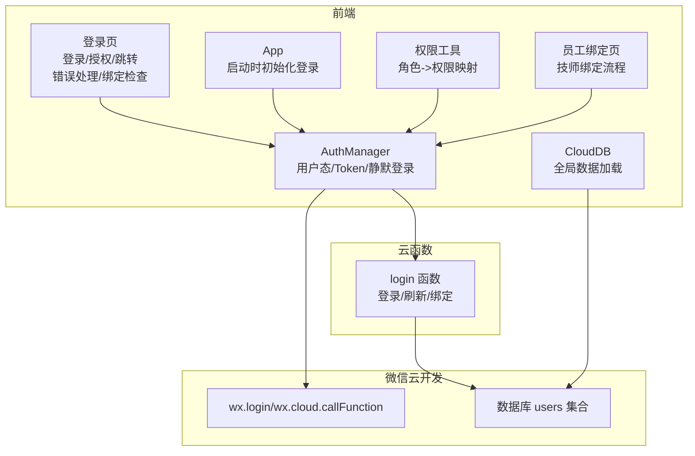

**图表来源**
- [miniprogram/utils/auth.ts](file://miniprogram/utils/auth.ts#L4-L220)
- [cloudfunctions/login/index.js](file://cloudfunctions/login/index.js#L11-L90)
- [miniprogram/pages/login/login.ts](file://miniprogram/pages/login/login.ts#L100-L139)
- [miniprogram/app.ts](file://miniprogram/app.ts#L13-L38)
- [miniprogram/utils/cloud-db.ts](file://miniprogram/utils/cloud-db.ts#L12-L321)
- [miniprogram/pages/bind-staff/bind-staff.ts](file://miniprogram/pages/bind-staff/bind-staff.ts#L1-L199)

**章节来源**
- [miniprogram/utils/auth.ts](file://miniprogram/utils/auth.ts#L1-L247)
- [cloudfunctions/login/index.js](file://cloudfunctions/login/index.js#L1-L180)
- [miniprogram/pages/login/login.ts](file://miniprogram/pages/login/login.ts#L1-L166)
- [miniprogram/app.ts](file://miniprogram/app.ts#L1-L232)
- [miniprogram/utils/cloud-db.ts](file://miniprogram/utils/cloud-db.ts#L1-L321)

## 核心组件
- AuthManager：单例用户态管理器，负责本地存储、Token 管理、静默登录、授权手机号、登出、刷新用户信息、更新员工ID等。
- 权限工具：基于角色的页面与按钮级权限控制，提供 hasPagePermission、hasButtonPermission、requirePagePermission 等方法。
- 登录云函数：封装微信登录、用户查询/创建、Token 生成、用户信息刷新与员工ID绑定。
- 登录页与应用生命周期：在页面加载与应用显示时进行登录状态检查与引导跳转，包含增强的错误处理和导航逻辑。
- 员工绑定页：专门处理技师角色的员工绑定流程，确保技师功能的完整性。
- 类型定义：UserRecord、UserPermissions、LoginResponse 等，确保前后端一致的数据契约。

**更新** 登录页新增了更完善的错误处理机制和用户反馈，增强了技师角色的绑定要求检查，改进了导航逻辑的智能化程度。

**章节来源**
- [miniprogram/utils/auth.ts](file://miniprogram/utils/auth.ts#L4-L220)
- [miniprogram/utils/permission.ts](file://miniprogram/utils/permission.ts#L1-L199)
- [cloudfunctions/login/index.js](file://cloudfunctions/login/index.js#L11-L180)
- [typings/index.d.ts](file://typings/index.d.ts#L252-L313)

## 架构总览
整体认证流程由前端发起静默登录，通过 wx.login 获取临时 code，再调用云函数 login 完成用户查询/创建与 Token 生成；随后将用户信息与 Token 存入本地存储并在内存中维护；后续页面与应用生命周期中通过 AuthManager 进行状态检查与权限判断。登录流程现在包含了更完善的错误处理和用户反馈机制。

**更新** 增强了登录页的错误处理和用户反馈，新增了技师角色的员工绑定检查，改进了导航逻辑的智能化程度。

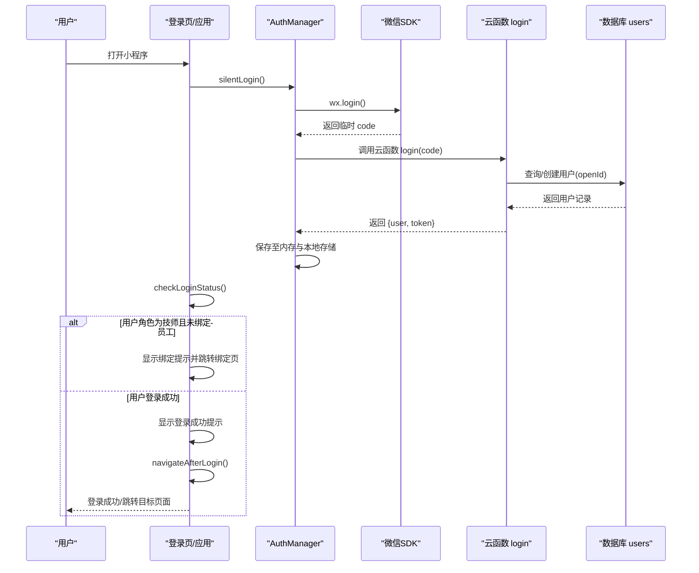

**图表来源**
- [miniprogram/utils/auth.ts](file://miniprogram/utils/auth.ts#L78-L126)
- [cloudfunctions/login/index.js](file://cloudfunctions/login/index.js#L11-L90)
- [miniprogram/pages/login/login.ts](file://miniprogram/pages/login/login.ts#L15-L49)

## 详细组件分析

### AuthManager 类分析
- 单例模式：通过静态 getInstance 提供全局唯一实例，避免重复初始化。
- 用户状态管理：内存中维护 currentUser 与 token，同时从本地存储恢复状态。
- Token 处理：登录成功后保存 token，并在本地存储中持久化。
- 会话维护策略：提供 refreshUserInfo 刷新用户信息；logout 清空状态并跳转登录页。
- 静默登录：若已登录直接返回；否则并发请求去重（loginPromise），避免重复登录。
- 微信登录授权：支持 authorizePhone 获取手机号并更新用户信息。
- 员工ID绑定：updateStaffId 调用云函数完成绑定并刷新用户信息。

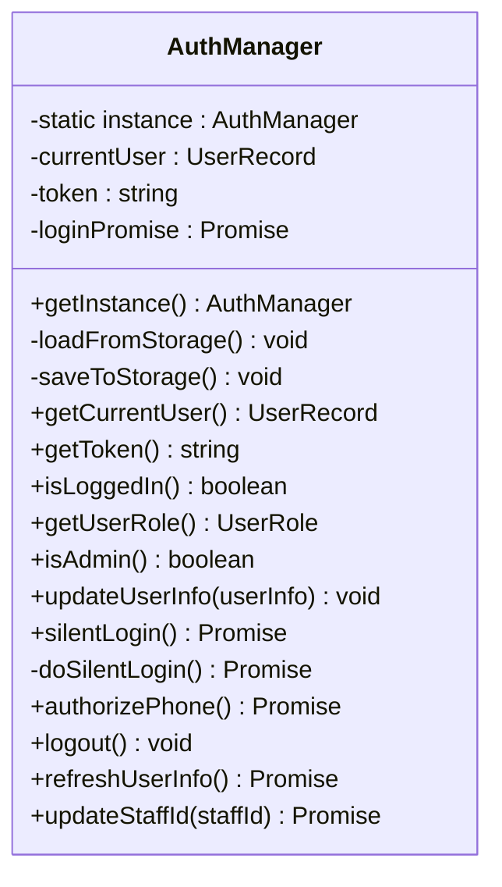

**图表来源**
- [miniprogram/utils/auth.ts](file://miniprogram/utils/auth.ts#L4-L220)

**章节来源**
- [miniprogram/utils/auth.ts](file://miniprogram/utils/auth.ts#L4-L220)

### 静默登录流程
- 若已登录则直接返回用户信息。
- 若存在并发登录请求，则复用同一 Promise，避免重复请求。
- 调用微信登录获取 code，调用云函数 login 完成用户查询/创建与 Token 生成。
- 将用户信息与 Token 写入内存与本地存储。

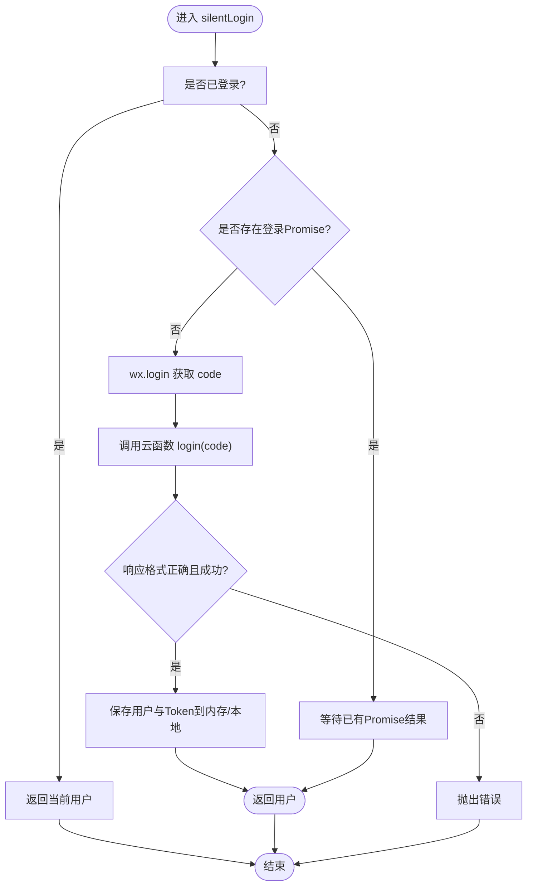

**图表来源**
- [miniprogram/utils/auth.ts](file://miniprogram/utils/auth.ts#L78-L126)

**章节来源**
- [miniprogram/utils/auth.ts](file://miniprogram/utils/auth.ts#L78-L126)

### 微信登录授权与手机号授权
- 静默登录：使用 wx.login 获取 code 并调用云函数 login。
- 手机号授权：调用云函数 login(action='authorizePhone')，成功后更新用户信息与 Token。

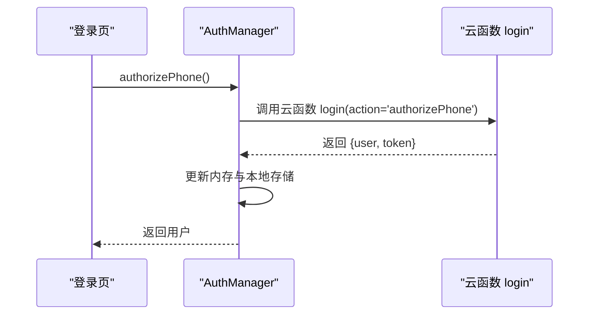

**图表来源**
- [miniprogram/utils/auth.ts](file://miniprogram/utils/auth.ts#L128-L155)
- [cloudfunctions/login/index.js](file://cloudfunctions/login/index.js#L11-L90)

**章节来源**
- [miniprogram/utils/auth.ts](file://miniprogram/utils/auth.ts#L128-L155)
- [cloudfunctions/login/index.js](file://cloudfunctions/login/index.js#L11-L90)

### 用户信息获取与更新机制
- 刷新用户信息：调用云函数 login(action='refresh')，重新生成 Token 并返回最新用户信息。
- 更新员工ID：调用云函数 login(action='updateStaffId', staffId)，更新用户记录并刷新 Token。

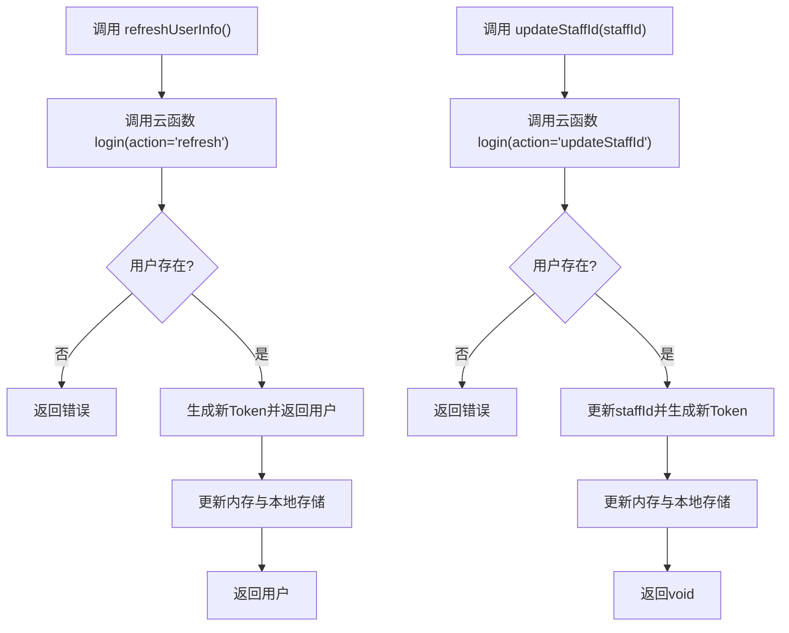

**图表来源**
- [miniprogram/utils/auth.ts](file://miniprogram/utils/auth.ts#L167-L219)
- [cloudfunctions/login/index.js](file://cloudfunctions/login/index.js#L92-L179)

**章节来源**
- [miniprogram/utils/auth.ts](file://miniprogram/utils/auth.ts#L167-L219)
- [cloudfunctions/login/index.js](file://cloudfunctions/login/index.js#L92-L179)

### 登录状态检查与自动登录重试
- 应用生命周期 onShow 中检测当前页面路由，若非登录页且未登录则跳转登录页。
- 页面 onLoad/onShow 中调用 checkLogin/requireLogin，实现自动登录与强制登录。

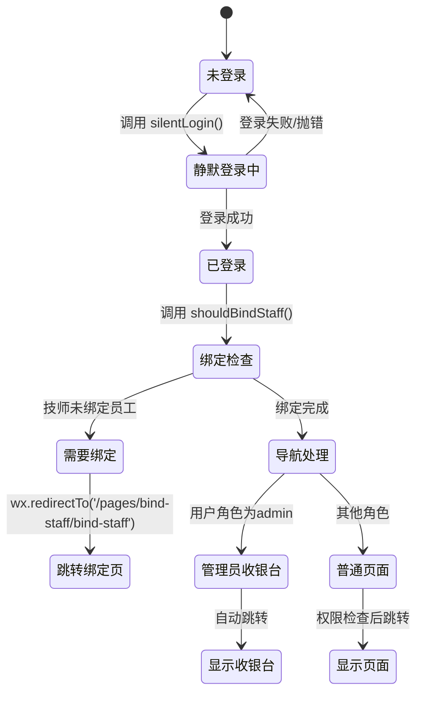

**图表来源**
- [miniprogram/app.ts](file://miniprogram/app.ts#L27-L38)
- [miniprogram/pages/login/login.ts](file://miniprogram/pages/login/login.ts#L100-L139)
- [miniprogram/utils/auth.ts](file://miniprogram/utils/auth.ts#L224-L244)

**章节来源**
- [miniprogram/app.ts](file://miniprogram/app.ts#L18-L38)
- [miniprogram/pages/login/login.ts](file://miniprogram/pages/login/login.ts#L15-L49)
- [miniprogram/utils/auth.ts](file://miniprogram/utils/auth.ts#L224-L244)

### 角色管理、权限标识与安全令牌
- 角色管理：UserRecord 中包含 role 字段，支持 admin、cashier、technician、viewer、brand 五种角色。
- 权限标识：UserPermissions 定义页面与按钮级权限，权限值由角色决定。
- 安全令牌：云函数 login 中生成简单 Base64 编码的 Token（openId:timestamp:随机串）。

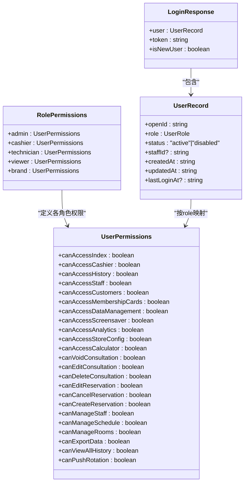

**图表来源**
- [typings/index.d.ts](file://typings/index.d.ts#L252-L313)
- [miniprogram/utils/permission.ts](file://miniprogram/utils/permission.ts#L46-L147)
- [cloudfunctions/login/index.js](file://cloudfunctions/login/index.js#L128-L132)

**章节来源**
- [typings/index.d.ts](file://typings/index.d.ts#L252-L313)
- [miniprogram/utils/permission.ts](file://miniprogram/utils/permission.ts#L1-L199)
- [cloudfunctions/login/index.js](file://cloudfunctions/login/index.js#L128-L132)

### 登录API调用示例与最佳实践
- 静默登录：调用 AuthManager.silentLogin()，在页面 onLoad 或应用 onShow 中使用。
- 强制登录：调用 AuthManager.requireLogin()，未登录时抛出错误并跳转登录页。
- 登录页交互：登录按钮触发 silentLogin()，授权手机号触发 authorizePhone()。
- 最佳实践：
  - 在应用启动时调用 initLogin 初始化用户态。
  - 使用 requireLogin 包裹需要登录保护的页面或操作。
  - 使用 hasPagePermission/hasButtonPermission 控制界面元素显示。
  - 定期调用 refreshUserInfo 保持用户信息最新。
  - 登录失败时统一提示并允许重试。

**更新** 增强了登录页的错误处理机制，提供了更完善的用户反馈和加载状态管理。

**章节来源**
- [miniprogram/utils/auth.ts](file://miniprogram/utils/auth.ts#L224-L244)
- [miniprogram/pages/login/login.ts](file://miniprogram/pages/login/login.ts#L51-L94)
- [miniprogram/app.ts](file://miniprogram/app.ts#L18-L25)
- [miniprogram/utils/permission.ts](file://miniprogram/utils/permission.ts#L149-L173)

### 员工绑定要求与增强的导航逻辑
**新增功能** 登录页新增了技师角色的员工绑定检查，确保技师必须绑定员工账号才能正常登录。

员工绑定检查流程：
- 检查用户角色是否为 technician 且 staffId 为空
- 如果满足条件，显示绑定提示模态框并跳转到绑定页面
- 绑定完成后重新检查登录状态
- 改进的导航逻辑：检查页面栈深度，智能选择跳转目标

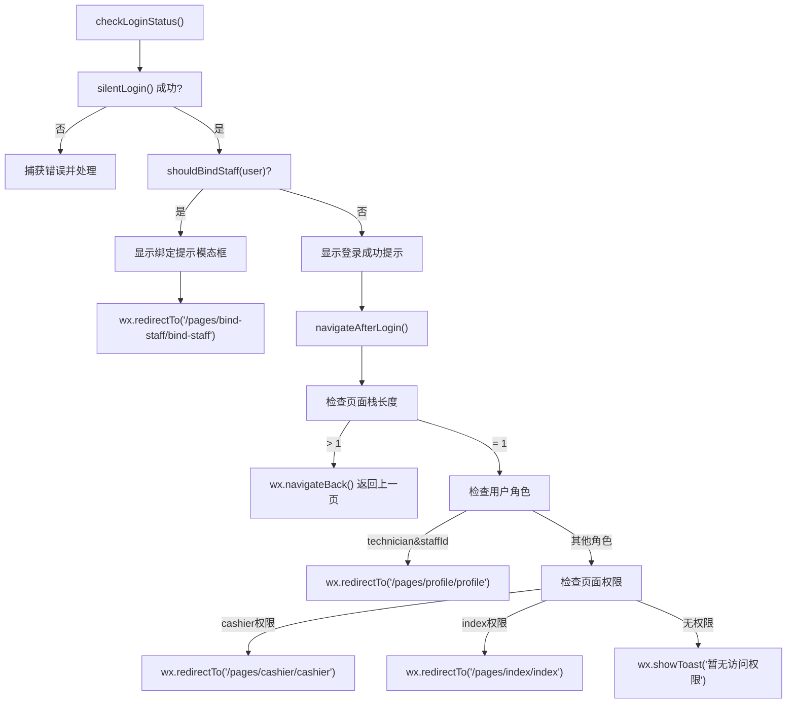

**图表来源**
- [miniprogram/pages/login/login.ts](file://miniprogram/pages/login/login.ts#L15-L49)
- [miniprogram/pages/login/login.ts](file://miniprogram/pages/login/login.ts#L96-L133)

**章节来源**
- [miniprogram/pages/login/login.ts](file://miniprogram/pages/login/login.ts#L15-L49)
- [miniprogram/pages/login/login.ts](file://miniprogram/pages/login/login.ts#L96-L133)

### 增强的错误处理和用户反馈机制
**新增功能** 登录页实现了更完善的错误处理和用户反馈机制。

增强的错误处理特性：
- 登录失败时显示友好的错误提示
- 加载状态管理，防止重复提交
- 手机号授权失败时的详细错误反馈
- 绑定流程中的输入验证和错误提示

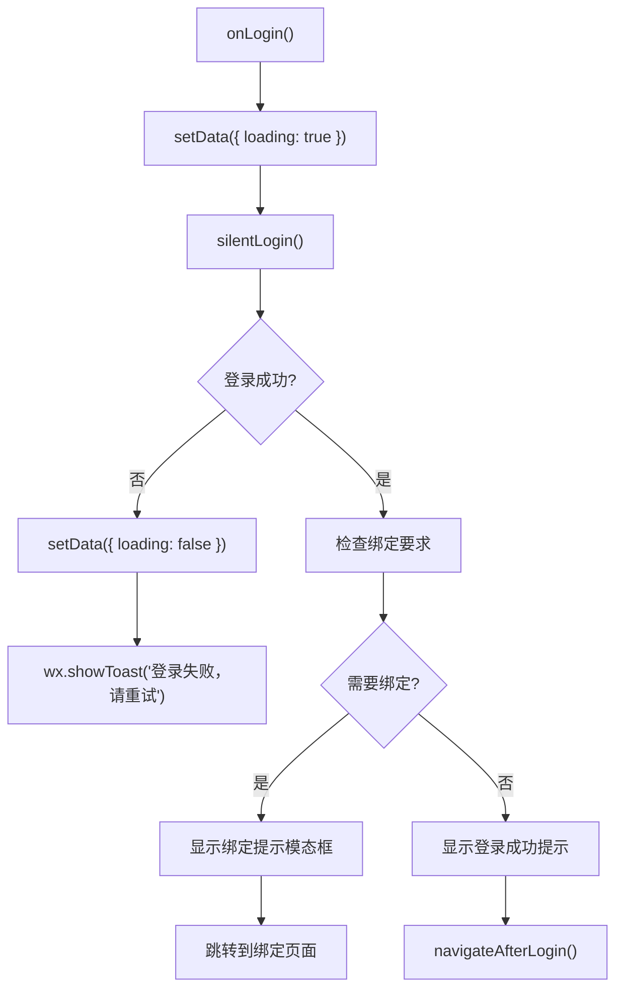

**图表来源**
- [miniprogram/pages/login/login.ts](file://miniprogram/pages/login/login.ts#L51-L94)

**章节来源**
- [miniprogram/pages/login/login.ts](file://miniprogram/pages/login/login.ts#L51-L94)

## 依赖关系分析
- 前端依赖：AuthManager 依赖微信 SDK（wx.login、wx.cloud.callFunction）与本地存储（wx.setStorageSync/getStorageSync）。
- 云函数依赖：login 函数依赖微信云开发 SDK（cloud.init、cloud.getWXContext、wx.cloud.database）与数据库 users 集合。
- 权限工具依赖：基于 AuthManager 当前用户角色进行权限判断。
- 应用生命周期依赖：App 在 onLaunch/onShow 中调用 AuthManager 进行登录初始化与状态检查。
- 登录页依赖：登录页依赖权限工具进行页面权限检查和员工绑定状态检查。
- 员工绑定页依赖：绑定页依赖 AuthManager 进行用户信息刷新和状态同步。

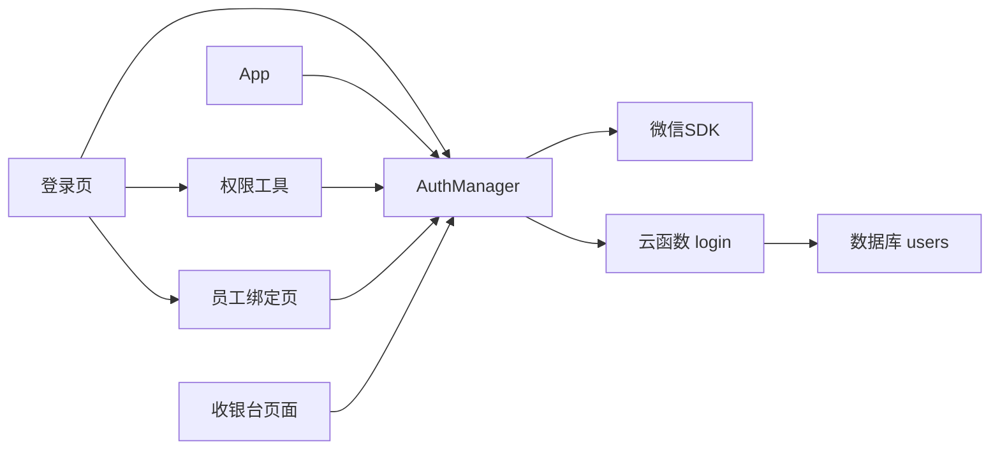

**图表来源**
- [miniprogram/utils/auth.ts](file://miniprogram/utils/auth.ts#L78-L126)
- [cloudfunctions/login/index.js](file://cloudfunctions/login/index.js#L11-L90)
- [miniprogram/pages/login/login.ts](file://miniprogram/pages/login/login.ts#L1-L166)
- [miniprogram/app.ts](file://miniprogram/app.ts#L18-L38)
- [miniprogram/utils/permission.ts](file://miniprogram/utils/permission.ts#L1-L199)
- [miniprogram/pages/bind-staff/bind-staff.ts](file://miniprogram/pages/bind-staff/bind-staff.ts#L1-L199)

**章节来源**
- [miniprogram/utils/auth.ts](file://miniprogram/utils/auth.ts#L1-L247)
- [cloudfunctions/login/index.js](file://cloudfunctions/login/index.js#L1-L180)
- [miniprogram/pages/login/login.ts](file://miniprogram/pages/login/login.ts#L1-L166)
- [miniprogram/app.ts](file://miniprogram/app.ts#L1-L232)
- [miniprogram/utils/permission.ts](file://miniprogram/utils/permission.ts#L1-L199)
- [miniprogram/pages/bind-staff/bind-staff.ts](file://miniprogram/pages/bind-staff/bind-staff.ts#L1-L199)

## 性能考量
- 并发登录去重：通过 loginPromise 避免重复请求，减少网络与云函数调用次数。
- 本地存储：用户信息与 Token 持久化，减少重复登录成本。
- 权限判断：权限映射为常量表，判断复杂度低，适合频繁调用。
- 数据加载：App 启动时异步加载全局数据，避免阻塞登录流程。
- 错误处理优化：登录页的错误处理减少了不必要的重试和重复操作。
- 绑定检查优化：技师绑定检查只在必要时触发，避免影响其他用户的登录体验。

**更新** 增强了错误处理和用户反馈机制，优化了绑定检查的性能表现。

## 故障排除指南
- 登录失败：检查 wx.login 是否成功获取 code，云函数 login 是否返回正确格式与状态码。
- Token 无效：确认云函数 generateToken 的实现与前端存储一致；必要时调用 refreshUserInfo 重新获取。
- 权限不足：确认用户角色与页面/按钮权限映射；使用 requirePagePermission 进行拦截提示。
- 本地存储异常：AuthManager 的 loadFromStorage/saveToStorage 对异常有容错处理，可清理缓存后重试。
- 员工ID绑定失败：检查 updateStaffId 的调用参数与云函数实现，确认用户存在且未被禁用。
- 技师绑定问题：检查 shouldBindStaff 方法的逻辑，确认技师角色和 staffId 状态。
- 导航异常：检查 navigateAfterLogin 方法的页面栈检查逻辑，确保正确的跳转策略。
- 错误处理问题：检查登录页的错误处理逻辑，确认加载状态管理和用户反馈机制正常工作。

**更新** 新增了技师绑定、导航逻辑和错误处理相关的故障排除指导。

**章节来源**
- [miniprogram/utils/auth.ts](file://miniprogram/utils/auth.ts#L21-L49)
- [cloudfunctions/login/index.js](file://cloudfunctions/login/index.js#L128-L132)
- [miniprogram/utils/permission.ts](file://miniprogram/utils/permission.ts#L163-L173)
- [miniprogram/pages/login/login.ts](file://miniprogram/pages/login/login.ts#L47-L94)

## 结论
该认证机制以 AuthManager 为核心，结合微信登录与云函数 login 实现了完整的用户态管理、Token 管理与权限控制。通过静默登录、并发去重、本地存储与权限映射，提供了良好的用户体验与安全性。

**更新** 新增的登录页错误处理和用户反馈机制显著提升了系统的健壮性和用户体验。技师角色的员工绑定要求检查确保了业务逻辑的完整性，改进的导航逻辑提供了更智能的用户体验。建议在生产环境中进一步增强 Token 验证与加密、引入更细粒度的权限校验与审计日志，同时可以考虑为不同角色用户提供个性化的默认导航页面。

## 附录
- 关键类型定义参考：UserRecord、UserPermissions、LoginResponse。
- 配置项：AppConfig.cloudEnvId 用于设置云环境 ID。
- 全局数据加载：App 通过 CloudDatabase 并行加载项目、房间、精油、员工等基础数据。
- 员工绑定流程：技师角色必须先绑定员工账号才能正常使用登录功能。
- 错误处理机制：登录页实现了完善的错误处理和用户反馈机制。
- 导航策略：根据用户角色和权限智能选择跳转目标页面。

**更新** 新增了员工绑定流程、错误处理机制和导航策略的详细说明。

**章节来源**
- [typings/index.d.ts](file://typings/index.d.ts#L252-L313)
- [miniprogram/config/index.ts](file://miniprogram/config/index.ts#L5-L15)
- [miniprogram/utils/cloud-db.ts](file://miniprogram/utils/cloud-db.ts#L40-L66)
- [miniprogram/pages/bind-staff/bind-staff.ts](file://miniprogram/pages/bind-staff/bind-staff.ts#L1-L199)
- [miniprogram/pages/login/login.ts](file://miniprogram/pages/login/login.ts#L47-L94)