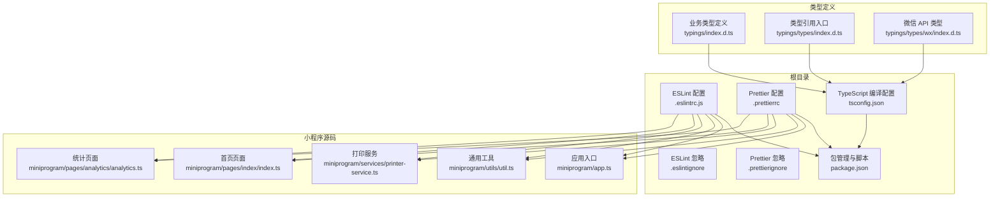
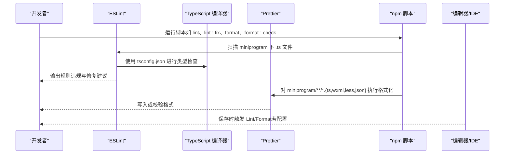
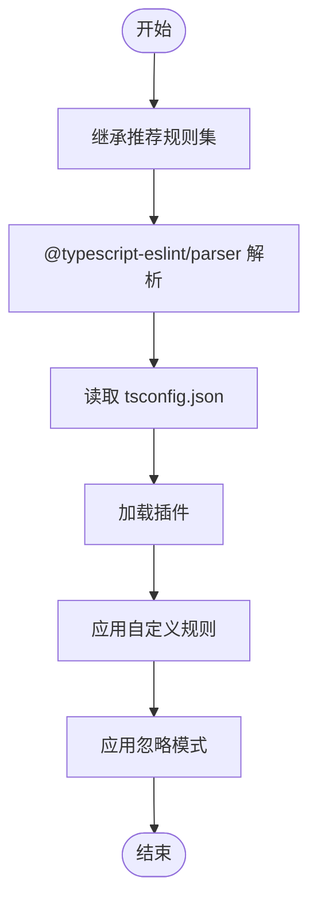
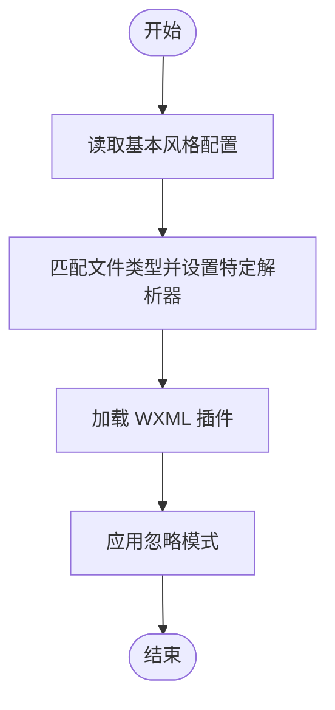
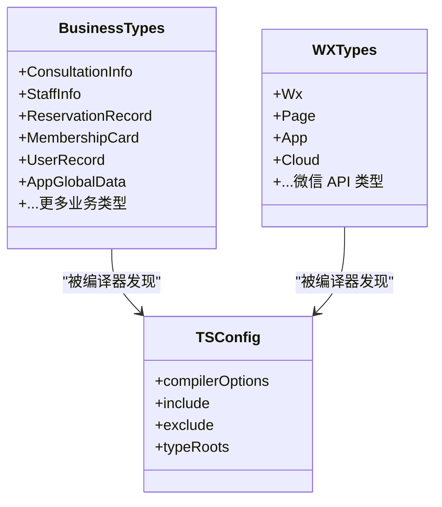
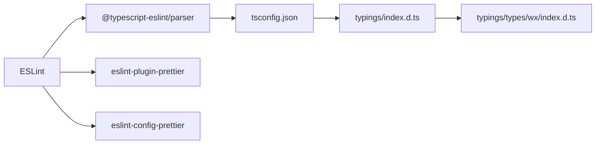

# 代码质量保证

<cite>
**本文引用的文件**
- [.eslintrc.js](file://.eslintrc.js)
- [.eslintignore](file://.eslintignore)
- [.prettierrc](file://.prettierrc)
- [.prettierignore](file://.prettierignore)
- [package.json](file://package.json)
- [tsconfig.json](file://tsconfig.json)
- [typings/index.d.ts](file://typings/index.d.ts)
- [typings/types/index.d.ts](file://typings/types/index.d.ts)
- [typings/types/wx/index.d.ts](file://typings/types/wx/index.d.ts)
- [miniprogram/app.ts](file://miniprogram/app.ts)
- [miniprogram/utils/util.ts](file://miniprogram/utils/util.ts)
- [miniprogram/services/printer-service.ts](file://miniprogram/services/printer-service.ts)
- [miniprogram/pages/index/index.ts](file://miniprogram/pages/index/index.ts)
- [miniprogram/pages/analytics/analytics.ts](file://miniprogram/pages/analytics/analytics.ts)
</cite>

## 目录
1. [简介](#简介)
2. [项目结构](#项目结构)
3. [核心组件](#核心组件)
4. [架构总览](#架构总览)
5. [详细组件分析](#详细组件分析)
6. [依赖关系分析](#依赖关系分析)
7. [性能考量](#性能考量)
8. [故障排查指南](#故障排查指南)
9. [结论](#结论)
10. [附录](#附录)

## 简介
本文件面向代码质量保证，系统性梳理并解释本仓库的 ESLint 规则与配置、TypeScript 类型检查与编译配置、Prettier 代码格式化策略，以及三者在项目中的集成方式、执行流程与结果处理。同时给出代码审查最佳实践、常见问题解决方案与性能优化建议，并补充静态分析与持续质量监控的落地思路。

## 项目结构
本项目采用“小程序 + 云开发 + TypeScript + 自定义类型定义”的组织方式：
- 根目录提供质量工具配置文件（ESLint、Prettier、TypeScript、Git 忽略等）
- 类型定义集中于 typings 目录，覆盖业务模型与微信小程序 API
- 小程序源码位于 miniprogram 目录，按页面、组件、服务、工具分层组织
- 云函数位于 cloudfunctions 目录，与小程序端通过 wx.cloud 调用交互

图表来源
- [.eslintrc.js](file://.eslintrc.js#L1-L46)
- [.prettierrc](file://.prettierrc#L1-L30)
- [package.json](file://package.json#L1-L28)
- [tsconfig.json](file://tsconfig.json#L1-L31)
- [typings/index.d.ts](file://typings/index.d.ts#L1-L435)
- [typings/types/index.d.ts](file://typings/types/index.d.ts#L1-L2)
- [typings/types/wx/index.d.ts](file://typings/types/wx/index.d.ts#L1-L164)
- [miniprogram/app.ts](file://miniprogram/app.ts#L1-L191)
- [miniprogram/utils/util.ts](file://miniprogram/utils/util.ts#L1-L150)
- [miniprogram/services/printer-service.ts](file://miniprogram/services/printer-service.ts#L1-L298)
- [miniprogram/pages/index/index.ts](file://miniprogram/pages/index/index.ts#L1-L735)
- [miniprogram/pages/analytics/analytics.ts](file://miniprogram/pages/analytics/analytics.ts#L1-L408)

章节来源
- [.eslintrc.js](file://.eslintrc.js#L1-L46)
- [.prettierrc](file://.prettierrc#L1-L30)
- [package.json](file://package.json#L1-L28)
- [tsconfig.json](file://tsconfig.json#L1-L31)
- [typings/index.d.ts](file://typings/index.d.ts#L1-L435)
- [typings/types/index.d.ts](file://typings/types/index.d.ts#L1-L2)
- [typings/types/wx/index.d.ts](file://typings/types/wx/index.d.ts#L1-L164)
- [miniprogram/app.ts](file://miniprogram/app.ts#L1-L191)
- [miniprogram/utils/util.ts](file://miniprogram/utils/util.ts#L1-L150)
- [miniprogram/services/printer-service.ts](file://miniprogram/services/printer-service.ts#L1-L298)
- [miniprogram/pages/index/index.ts](file://miniprogram/pages/index/index.ts#L1-L735)
- [miniprogram/pages/analytics/analytics.ts](file://miniprogram/pages/analytics/analytics.ts#L1-L408)

## 核心组件
- ESLint 配置与规则集
  - 继承推荐规则集与 TypeScript ESLint 推荐规则，结合 Prettier 插件统一格式化与风格
  - 解析器为 TypeScript ESLint Parser，解析目标指向 tsconfig.json
  - 全局变量声明覆盖微信小程序运行时 API
  - 自定义规则包括：未使用变量警告（忽略以下划线开头的参数）、显式函数返回类型关闭、any 类型警告、非空断言关闭、控制台输出策略、首选 const 等
  - 忽略模式覆盖 node_modules、miniprogram_npm、typings、JS 文件与声明文件
- Prettier 配置
  - 统一分号、单引号、缩进宽度、Tab 行尾等风格
  - 针对 WXML 与 LESS 使用专用解析器与敏感度设置
  - 通过插件支持 WXML 格式化
  - 忽略模式覆盖 node_modules、miniprogram_npm、typings、声明文件与部分配置文件
- TypeScript 编译配置
  - 严格模式开启，启用严格空值检查、隐式 any、隐式 this、隐式返回、严格标量、switch 无 fallthrough、未使用局部变量/参数等
  - 目标 ES2020，允许 JS，启用装饰器，lib 指向 ES2020
  - 类型根目录指向 typings，包含业务类型与微信 API 类型
  - 包含范围为所有 .ts，排除 node_modules
- 类型定义体系
  - 业务模型类型集中于 typings/index.d.ts，涵盖咨询单、员工、排班、预约、会员卡、用户、全局数据等
  - 微信 API 类型通过 typings/types/wx/index.d.ts 提供，typings/types/index.d.ts 引用之
  - 项目通过 tsconfig.json 的 typeRoots 指向 typings，确保编译器可发现类型

章节来源
- [.eslintrc.js](file://.eslintrc.js#L1-L46)
- [.eslintignore](file://.eslintignore#L1-L6)
- [.prettierrc](file://.prettierrc#L1-L30)
- [.prettierignore](file://.prettierignore#L1-L8)
- [tsconfig.json](file://tsconfig.json#L1-L31)
- [typings/index.d.ts](file://typings/index.d.ts#L1-L435)
- [typings/types/index.d.ts](file://typings/types/index.d.ts#L1-L2)
- [typings/types/wx/index.d.ts](file://typings/types/wx/index.d.ts#L1-L164)

## 架构总览
ESLint、Prettier、TypeScript 在本项目中的集成与执行流程如下：

图表来源
- [package.json](file://package.json#L5-L9)
- [.eslintrc.js](file://.eslintrc.js#L13-L18)
- [.prettierrc](file://.prettierrc#L1-L30)
- [tsconfig.json](file://tsconfig.json#L1-L31)

## 详细组件分析

### ESLint 配置与规则
- 继承链
  - eslint:recommended
  - plugin:@typescript-eslint/recommended
  - plugin:prettier/recommended
- 解析器与选项
  - 解析器：@typescript-eslint/parser
  - 解析选项：ecmaVersion 最新，sourceType module，project 指向 tsconfig.json
- 插件
  - @typescript-eslint、prettier
- 全局变量
  - wx、App、Page、Component、getApp、getCurrentPages、WechatMiniprogram 等小程序运行时 API
- 自定义规则
  - prettier/prettier：错误级别
  - @typescript-eslint/no-unused-vars：警告，忽略以下划线开头的参数
  - @typescript-eslint/explicit-function-return-type：关闭
  - @typescript-eslint/no-explicit-any：警告
  - @typescript-eslint/no-non-null-assertion：关闭
  - no-console：关闭
  - prefer-const：警告
- 忽略模式
  - node_modules/
  - miniprogram/miniprogram_npm/
  - typings/
  - *.js
  - *.d.ts

图表来源
- [.eslintrc.js](file://.eslintrc.js#L8-L44)

章节来源
- [.eslintrc.js](file://.eslintrc.js#L1-L46)
- [.eslintignore](file://.eslintignore#L1-L6)

### Prettier 配置与格式化
- 基本风格
  - 分号、单引号、Tab 宽度、行尾等统一
  - printWidth、bracketSpacing、arrowParens、endOfLine 等
- 文件特定解析
  - WXML：parser 为 wxml，htmlWhitespaceSensitivity 严格
  - LESS：parser 为 less
- 插件
  - prettier-plugin-wxml
- 忽略模式
  - node_modules/
  - miniprogram/miniprogram_npm/
  - typings/
  - *.d.ts
  - package-lock.json
  - project.config.json
  - project.private.config.json

图表来源
- [.prettierrc](file://.prettierrc#L1-L30)
- [.prettierignore](file://.prettierignore#L1-L8)

章节来源
- [.prettierrc](file://.prettierrc#L1-L30)
- [.prettierignore](file://.prettierignore#L1-L8)

### TypeScript 编译配置与类型系统
- 编译选项
  - strictNullChecks、noImplicitAny、strict、alwaysStrict、noFallthroughCasesInSwitch、noUnusedLocals、noUnusedParameters、strictPropertyInitialization 等严格选项开启
  - target ES2020，module CommonJS，allowJs，esModuleInterop，experimentalDecorators
  - lib 指向 ES2020
  - typeRoots 指向 ./typings
- 包含与排除
  - include: ./**/*.ts
  - exclude: node_modules
- 类型定义
  - typings/index.d.ts：业务模型与工具类型
  - typings/types/index.d.ts：引用微信 API 类型
  - typings/types/wx/index.d.ts：微信小程序 API 类型声明

图表来源
- [tsconfig.json](file://tsconfig.json#L2-L23)
- [typings/index.d.ts](file://typings/index.d.ts#L1-L435)
- [typings/types/index.d.ts](file://typings/types/index.d.ts#L1-L2)
- [typings/types/wx/index.d.ts](file://typings/types/wx/index.d.ts#L1-L164)

章节来源
- [tsconfig.json](file://tsconfig.json#L1-L31)
- [typings/index.d.ts](file://typings/index.d.ts#L1-L435)
- [typings/types/index.d.ts](file://typings/types/index.d.ts#L1-L2)
- [typings/types/wx/index.d.ts](file://typings/types/wx/index.d.ts#L1-L164)

### 代码规范检查与执行流程
- ESLint 扫描范围
  - 通过 package.json 中的脚本对 miniprogram 下 .ts 文件进行扫描与修复
- Prettier 扫描范围
  - 对 miniprogram/**/*.{ts,wxml,less,json} 执行格式化或校验
- 执行顺序建议
  - 先执行 ESLint（含 --fix），再执行 Prettier（--write 或 --check）
  - 在 CI 中优先使用 --check，避免提交污染

章节来源
- [package.json](file://package.json#L5-L9)

### 类型安全与最佳实践
- 严格模式下的类型安全
  - 严格空值检查、隐式 any、隐式 this、switch 无 fallthrough、未使用变量/参数等规则，有效降低运行时风险
- 业务类型复用
  - 通过 Add<T>/Update<T> 等工具类型，减少重复字段与错误映射
- 微信 API 类型约束
  - 通过 typings/types/wx/index.d.ts 与 tsconfig 的 typeRoots，确保 wx.*、Page、App 等 API 的类型安全
- 实践建议
  - 为复杂函数明确返回类型与参数类型
  - 避免使用 any，必要时使用更精确的联合类型
  - 对外部 API 返回值进行类型守卫与解构保护

章节来源
- [tsconfig.json](file://tsconfig.json#L3-L22)
- [typings/index.d.ts](file://typings/index.d.ts#L1-L435)
- [typings/types/wx/index.d.ts](file://typings/types/wx/index.d.ts#L1-L164)

### 代码审查最佳实践
- 审查清单
  - 是否遵循 ESLint 规则（含 --fix 后的无违规）
  - 是否满足 Prettier 格式化要求（--check 通过）
  - 是否符合 TypeScript 严格模式下的类型约束
  - 是否正确使用微信 API 类型与业务类型
  - 是否存在未使用的变量/参数、隐式 any、非空断言滥用
- 审查流程
  - 本地先执行 lint:fix 与 format:check
  - 提交前再次执行 --check，确保 CI 顺利
  - 对涉及云函数与数据库操作的逻辑，重点审查类型与异常处理

章节来源
- [.eslintrc.js](file://.eslintrc.js#L29-L37)
- [.prettierrc](file://.prettierrc#L1-L30)
- [tsconfig.json](file://tsconfig.json#L3-L22)

### 常见问题与解决方案
- ESLint 无法识别微信 API
  - 已在全局变量中声明 wx、App、Page、Component、getApp、getCurrentPages、WechatMiniprogram 等，确保 IDE 与 CI 一致
- Prettier 对 WXML/LESS 格式化异常
  - 确认已安装 prettier-plugin-wxml 并在 .prettierrc 中配置对应 overrides
- TypeScript 类型缺失或冲突
  - 确保 typings 目录结构正确，tsconfig.json 的 typeRoots 指向 typings
  - 业务类型与微信 API 类型通过 typings/types/index.d.ts 引用
- 忽略模式导致规则失效
  - 检查 .eslintignore 与 .prettierignore，确保不会误忽略 .ts 源文件

章节来源
- [.eslintrc.js](file://.eslintrc.js#L20-L28)
- [.prettierrc](file://.prettierrc#L12-L29)
- [tsconfig.json](file://tsconfig.json#L20-L22)
- [.eslintignore](file://.eslintignore#L1-L6)
- [.prettierignore](file://.prettierignore#L1-L8)

### 性能优化建议
- 规则层面
  - 保持严格模式但避免过度宽松（如关闭显式返回类型、非空断言），以换取更好的类型安全
  - 对频繁改动的文件，优先使用 --fix 一次性修复，减少后续迭代成本
- 格式化层面
  - 在 CI 中使用 --check，避免自动写入导致的额外提交
  - 对大文件采用增量格式化策略（如仅对变更文件执行 --check）
- 编译层面
  - 保持 include 精准，避免不必要的文件参与编译
  - 合理拆分类型定义，减少类型计算复杂度

章节来源
- [.eslintrc.js](file://.eslintrc.js#L29-L37)
- [.prettierrc](file://.prettierrc#L1-L30)
- [tsconfig.json](file://tsconfig.json#L24-L29)

### 静态分析与持续质量监控
- 静态分析工具
  - ESLint：规则检查与自动修复
  - Prettier：格式化一致性校验
  - TypeScript：类型系统与编译期错误检测
- 持续质量监控
  - 在 CI 中执行：
    - npm run lint
    - npm run lint:fix（可选，仅在需要自动修复时）
    - npm run format:check
    - tsc（可选，验证类型）
  - 对关键分支（如主干）强制执行上述步骤，确保每次合并均满足质量门槛

章节来源
- [package.json](file://package.json#L5-L9)
- [tsconfig.json](file://tsconfig.json#L1-L31)

## 依赖关系分析
- ESLint 与 TypeScript
  - ESLint 通过 @typescript-eslint/parser 与 tsconfig.json 进行类型检查，二者耦合紧密
- Prettier 与 ESLint
  - 通过 eslint-plugin-prettier 与 eslint-config-prettier，避免两者规则冲突
- 类型定义与编译器
  - tsconfig.json 的 typeRoots 指向 typings，确保业务类型与微信 API 类型被编译器发现

图表来源
- [.eslintrc.js](file://.eslintrc.js#L8-L19)
- [tsconfig.json](file://tsconfig.json#L20-L22)
- [typings/index.d.ts](file://typings/index.d.ts#L1-L435)
- [typings/types/wx/index.d.ts](file://typings/types/wx/index.d.ts#L1-L164)

章节来源
- [.eslintrc.js](file://.eslintrc.js#L8-L19)
- [tsconfig.json](file://tsconfig.json#L20-L22)
- [typings/index.d.ts](file://typings/index.d.ts#L1-L435)
- [typings/types/wx/index.d.ts](file://typings/types/wx/index.d.ts#L1-L164)

## 性能考量
- 规则数量与执行时间
  - 严格模式下规则较多，建议在本地使用增量检查，在 CI 使用全量检查
- 忽略模式优化
  - 精确控制忽略范围，避免误忽略 .ts 源文件
- 编译范围优化
  - include 精准覆盖，exclude 排除 node_modules，减少编译负担

章节来源
- [.eslintignore](file://.eslintignore#L1-L6)
- [.prettierignore](file://.prettierignore#L1-L8)
- [tsconfig.json](file://tsconfig.json#L24-L29)

## 故障排查指南
- ESLint 报错但本地不生效
  - 检查 .eslintrc.js 的 extends、parser、parserOptions 与 plugins 配置
  - 确认 tsconfig.json 路径正确且可访问
- Prettier 格式化异常
  - 检查 .prettierrc 的 overrides 与 plugins 配置
  - 确认 .prettierignore 未误忽略目标文件
- TypeScript 类型错误
  - 检查 typings 目录结构与 tsconfig.json 的 typeRoots
  - 确认业务类型与微信 API 类型引用正确

章节来源
- [.eslintrc.js](file://.eslintrc.js#L8-L19)
- [.prettierrc](file://.prettierrc#L12-L29)
- [tsconfig.json](file://tsconfig.json#L20-L22)
- [typings/types/index.d.ts](file://typings/types/index.d.ts#L1-L2)

## 结论
本项目通过 ESLint、Prettier 与 TypeScript 的协同，构建了从风格到类型的多层质量保障体系。ESLint 与 Prettier 的集成确保代码风格一致，TypeScript 的严格模式显著提升类型安全。配合合理的忽略模式与 CI 脚本，可在团队协作中稳定维持高质量交付节奏。建议持续完善类型定义、优化 CI 流程，并在关键模块引入单元测试与覆盖率统计，进一步强化质量闭环。

## 附录
- 脚本命令参考
  - npm run lint：扫描 miniprogram 下 .ts 文件
  - npm run lint:fix：同上并自动修复
  - npm run format：格式化 miniprogram/**/*.{ts,wxml,less,json}
  - npm run format:check：校验格式一致性
- 类型定义位置
  - 业务类型：typings/index.d.ts
  - 微信 API 类型：typings/types/wx/index.d.ts
  - 类型引用入口：typings/types/index.d.ts
- 编译配置位置
  - tsconfig.json

章节来源
- [package.json](file://package.json#L5-L9)
- [typings/index.d.ts](file://typings/index.d.ts#L1-L435)
- [typings/types/index.d.ts](file://typings/types/index.d.ts#L1-L2)
- [typings/types/wx/index.d.ts](file://typings/types/wx/index.d.ts#L1-L164)
- [tsconfig.json](file://tsconfig.json#L1-L31)