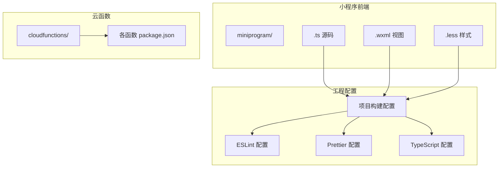
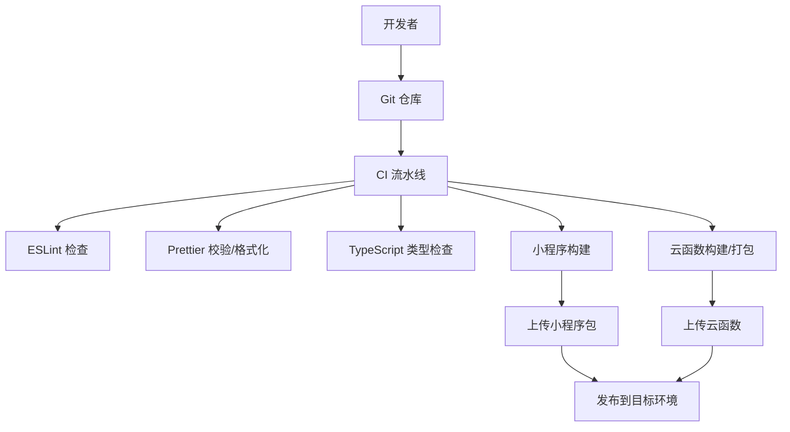
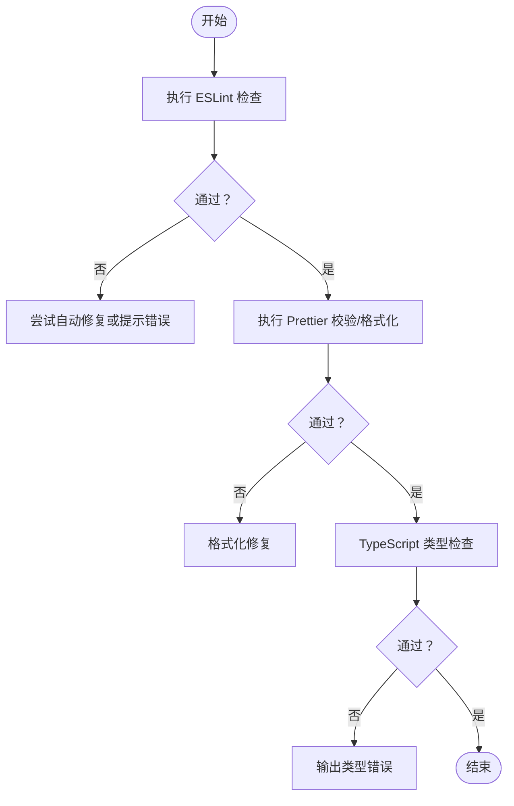
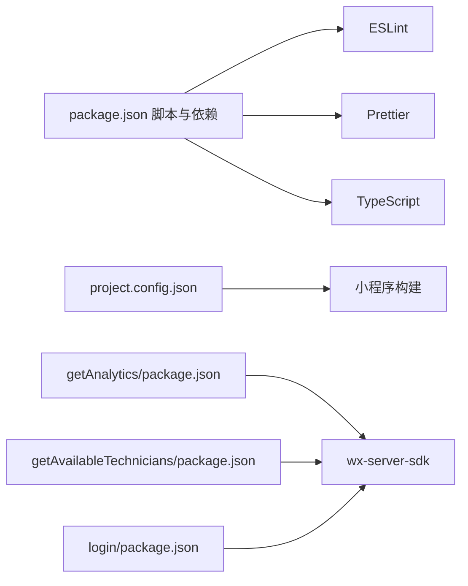

# 测试与部署

<cite>
**本文引用的文件**
- [.eslintrc.js](file://.eslintrc.js)
- [.prettierrc](file://.prettierrc)
- [tsconfig.json](file://tsconfig.json)
- [package.json](file://package.json)
- [.gitignore](file://.gitignore)
- [project.config.json](file://project.config.json)
- [project.private.config.json](file://project.private.config.json)
- [cloudfunctions/getAnalytics/package.json](file://cloudfunctions/getAnalytics/package.json)
- [cloudfunctions/getAvailableTechnicians/package.json](file://cloudfunctions/getAvailableTechnicians/package.json)
- [cloudfunctions/login/package.json](file://cloudfunctions/login/package.json)
</cite>

## 目录
1. [简介](#简介)
2. [项目结构](#项目结构)
3. [核心组件](#核心组件)
4. [架构总览](#架构总览)
5. [详细组件分析](#详细组件分析)
6. [依赖分析](#依赖分析)
7. [性能考虑](#性能考虑)
8. [故障排查指南](#故障排查指南)
9. [结论](#结论)
10. [附录](#附录)

## 简介
本运维文档面向“ConsultationPrinter”微信小程序及其云函数后端，围绕代码质量保证、测试策略与部署流程展开，覆盖以下主题：
- 代码质量：ESLint 规范检查、Prettier 格式化、TypeScript 类型检查的配置与使用
- 测试策略：单元测试、集成测试与端到端测试的实施建议
- 环境与部署：开发、测试、生产三类环境的配置差异与部署策略
- CI/CD：流水线配置与自动化流程建议
- 版本与发布：版本管理、发布与回滚策略
- 运维：监控告警、日志分析、故障排查；性能监控、容量规划与灾难恢复

## 项目结构
该项目由三部分组成：
- 小程序前端（miniprogram）：TypeScript + WXML + LESS 构建
- 云函数（cloudfunctions）：Node.js 运行时，使用微信云开发 SDK
- 工程配置：ESLint、Prettier、TypeScript 编译器、项目构建配置

图表来源
- [project.config.json](file://project.config.json#L1-L54)
- [.eslintrc.js](file://.eslintrc.js#L1-L46)
- [.prettierrc](file://.prettierrc#L1-L30)
- [tsconfig.json](file://tsconfig.json#L1-L31)

章节来源
- [project.config.json](file://project.config.json#L1-L54)
- [package.json](file://package.json#L1-L28)

## 核心组件
- 代码质量工具链
  - ESLint：启用 TypeScript 推荐规则、Prettier 集成，忽略 JS 与声明文件
  - Prettier：统一缩进、引号、分号、换行等风格，并对 wxml/less 做专门解析
  - TypeScript：严格模式、严格属性初始化、严格空检查、严格返回值等
- 构建与打包
  - 小程序编译设置：启用 TypeScript/LESS 插件、压缩、按需上传等
  - 云函数依赖：各函数独立 package.json，依赖微信云开发 SDK
- 质量脚本
  - lint、lint:fix、format、format:check 四类脚本，便于本地与 CI 执行

章节来源
- [.eslintrc.js](file://.eslintrc.js#L1-L46)
- [.prettierrc](file://.prettierrc#L1-L30)
- [tsconfig.json](file://tsconfig.json#L1-L31)
- [package.json](file://package.json#L1-L28)
- [project.config.json](file://project.config.json#L1-L54)

## 架构总览
下图展示从开发者提交到小程序上线的整体流程，以及与云函数的关系。

图表来源
- [package.json](file://package.json#L5-L9)
- [project.config.json](file://project.config.json#L1-L54)
- [cloudfunctions/getAnalytics/package.json](file://cloudfunctions/getAnalytics/package.json#L1-L10)

## 详细组件分析

### 代码质量工具链配置与使用
- ESLint
  - 启用推荐规则集与 TypeScript 插件，结合 Prettier 插件统一风格与规则冲突
  - 解析器指向 tsconfig.json，确保类型感知
  - 忽略 node_modules、miniprogram_npm、typings、JS 与 d.ts 文件
- Prettier
  - 统一 semicolon、singleQuote、tabWidth、printWidth 等
  - 对 wxml 使用专用解析器，对 less 使用 less 解析器
- TypeScript
  - 严格模式开启，严格空检查、严格属性初始化、严格返回值、严格 this 等
  - 类型根目录指向 typings，包含微信小程序 API 类型

图表来源
- [.eslintrc.js](file://.eslintrc.js#L1-L46)
- [.prettierrc](file://.prettierrc#L1-L30)
- [tsconfig.json](file://tsconfig.json#L1-L31)
- [package.json](file://package.json#L5-L9)

章节来源
- [.eslintrc.js](file://.eslintrc.js#L1-L46)
- [.prettierrc](file://.prettierrc#L1-L30)
- [tsconfig.json](file://tsconfig.json#L1-L31)
- [package.json](file://package.json#L1-L28)

### 测试策略
- 单元测试
  - 建议针对小程序逻辑模块（如工具函数、服务层）编写单元测试，使用 Jest 或 Vitest
  - 测试文件命名遵循 .test.ts/.spec.ts，放置于对应模块目录或 tests 目录
- 集成测试
  - 针对云函数接口进行集成测试，模拟调用与数据库/云存储交互
  - 使用微信云开发测试账号与测试环境，避免污染生产数据
- 端到端测试
  - 使用小程序自动化框架（如 Miniprogram Test Runner）在真机或模拟器上执行端到端场景
  - 关注关键业务流程：登录、数据加载、打印内容生成、历史记录查询等

章节来源
- [cloudfunctions/getAnalytics/package.json](file://cloudfunctions/getAnalytics/package.json#L1-L10)
- [cloudfunctions/getAvailableTechnicians/package.json](file://cloudfunctions/getAvailableTechnicians/package.json#L1-L10)
- [cloudfunctions/login/package.json](file://cloudfunctions/login/package.json#L1-L10)

### 环境与部署策略
- 开发环境
  - 使用本地 IDE/编辑器，启用 ESLint/Prettier 插件
  - 本地调试小程序与云函数，连接本地或测试云环境
- 测试环境
  - 与生产隔离的云环境，部署测试版小程序包与云函数
  - 执行全量测试（单元+集成+端到端），收集日志与性能指标
- 生产环境
  - 通过 CI/CD 发布稳定版本，灰度发布可选
  - 云函数与小程序包均需校验通过后方可发布

章节来源
- [project.config.json](file://project.config.json#L1-L54)
- [project.private.config.json](file://project.private.config.json#L1-L112)

### CI/CD 配置与自动化流程
- 触发条件
  - push 到主分支、PR 合并、tag 推送
- 步骤建议
  - 安装依赖
  - 代码质量检查：ESLint、Prettier、TypeScript
  - 单元测试
  - 集成测试（云函数）
  - 端到端测试（可选）
  - 构建小程序包与云函数包
  - 上传到测试环境
  - 审批发布（可选）
  - 上传到生产环境
- 工具选择
  - GitHub Actions / GitLab CI / Jenkins 等

章节来源
- [package.json](file://package.json#L5-L9)
- [project.config.json](file://project.config.json#L1-L54)

### 版本管理、发布与回滚
- 版本管理
  - 使用语义化版本（MAJOR.MINOR.PATCH），以 tag 标记发布版本
- 发布流程
  - 通过 CI 自动构建并上传至测试环境，验证无误后进入生产发布阶段
- 回滚策略
  - 保留最近 N 个版本的小程序包与云函数包
  - 出现问题时快速回滚至上一个稳定版本，必要时回滚数据库迁移

章节来源
- [package.json](file://package.json#L1-L28)

### 监控告警、日志分析与故障排查
- 监控与告警
  - 小程序端：接入性能监控 SDK，关注首屏时延、接口耗时、崩溃率
  - 云函数端：记录请求日志、异常栈、耗时统计，设置阈值告警
- 日志分析
  - 结构化日志，区分业务日志与系统日志，支持关键字检索与聚合
- 故障排查
  - 先看云函数日志与错误码，再定位小程序端网络请求与页面状态
  - 复现最小化步骤，逐步缩小范围

章节来源
- [cloudfunctions/getAnalytics/package.json](file://cloudfunctions/getAnalytics/package.json#L1-L10)
- [cloudfunctions/getAvailableTechnicians/package.json](file://cloudfunctions/getAvailableTechnicians/package.json#L1-L10)
- [cloudfunctions/login/package.json](file://cloudfunctions/login/package.json#L1-L10)

### 性能监控、容量规划与灾难恢复
- 性能监控
  - 关键指标：接口 P95、小程序启动耗时、渲染耗时、云函数冷启动时间
- 容量规划
  - 评估并发峰值与 QPS，预留弹性资源，合理设置云函数超时与并发上限
- 灾难恢复
  - 数据备份策略（数据库/云存储定期快照）
  - 多区域部署与异地容灾（视平台能力）

## 依赖分析
- 小程序前端依赖
  - TypeScript、ESLint、Prettier、微信小程序 API 类型
- 云函数依赖
  - 各函数独立依赖微信云开发 SDK，避免全局污染
- 构建与上传
  - 项目配置中启用编译插件、压缩、按需上传，减少包体与提升加载速度

图表来源
- [package.json](file://package.json#L1-L28)
- [project.config.json](file://project.config.json#L1-L54)
- [cloudfunctions/getAnalytics/package.json](file://cloudfunctions/getAnalytics/package.json#L1-L10)
- [cloudfunctions/getAvailableTechnicians/package.json](file://cloudfunctions/getAvailableTechnicians/package.json#L1-L10)
- [cloudfunctions/login/package.json](file://cloudfunctions/login/package.json#L1-L10)

章节来源
- [package.json](file://package.json#L1-L28)
- [project.config.json](file://project.config.json#L1-L54)
- [cloudfunctions/getAnalytics/package.json](file://cloudfunctions/getAnalytics/package.json#L1-L10)
- [cloudfunctions/getAvailableTechnicians/package.json](file://cloudfunctions/getAvailableTechnicians/package.json#L1-L10)
- [cloudfunctions/login/package.json](file://cloudfunctions/login/package.json#L1-L10)

## 性能考虑
- 代码层面
  - 启用严格类型与空检查，降低运行时错误与性能损耗
  - 使用 Prettier 统一风格，减少差异导致的构建问题
- 构建层面
  - 启用压缩、按需上传、关闭未使用文件上传，控制包体大小
- 运行层面
  - 云函数设置合理超时与并发，避免冷启动抖动影响用户体验

章节来源
- [tsconfig.json](file://tsconfig.json#L1-L31)
- [.prettierrc](file://.prettierrc#L1-L30)
- [project.config.json](file://project.config.json#L1-L54)

## 故障排查指南
- 本地排查
  - 使用 lint 与 format 脚本快速发现风格与语法问题
  - 在本地模拟器/真机调试小程序与云函数
- CI 排查
  - 查看流水线日志，定位 ESLint/Prettier/TS 报错位置
  - 分别执行单元/集成/端到端测试，确认失败点
- 线上排查
  - 查看小程序与云函数日志，定位异常请求与错误堆栈
  - 回滚至上一个稳定版本，观察问题是否消失

章节来源
- [package.json](file://package.json#L5-L9)
- [project.config.json](file://project.config.json#L1-L54)

## 结论
本项目已具备完善的代码质量工具链与工程配置基础。建议在现有基础上补充：
- 明确的测试策略与测试覆盖率门槛
- CI/CD 流水线与审批机制
- 环境变量与密钥管理
- 监控告警与日志分析体系
- 版本发布与回滚流程规范