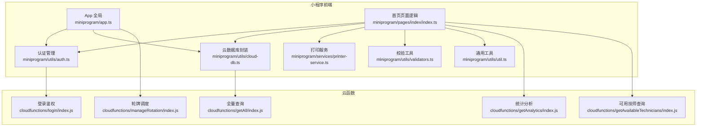
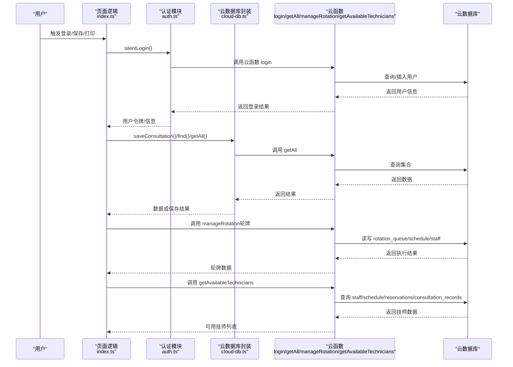
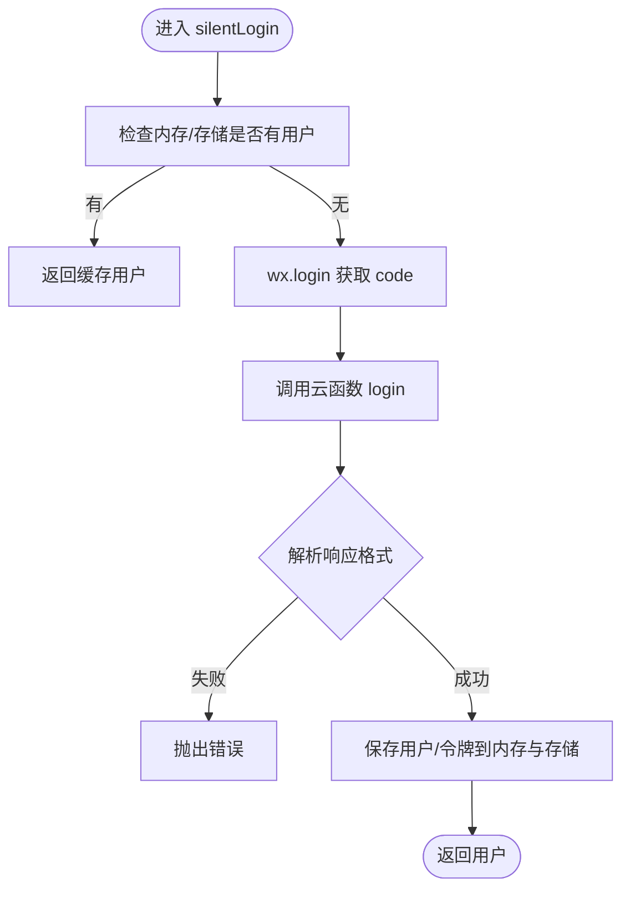
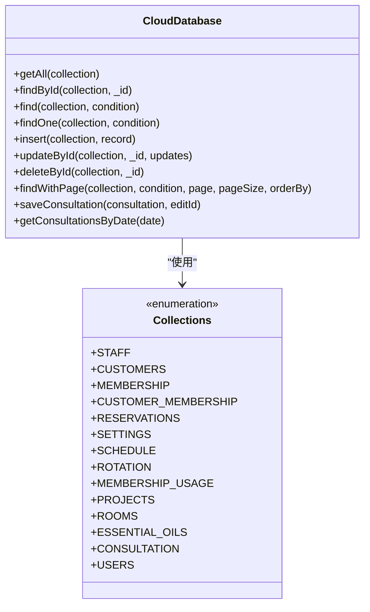
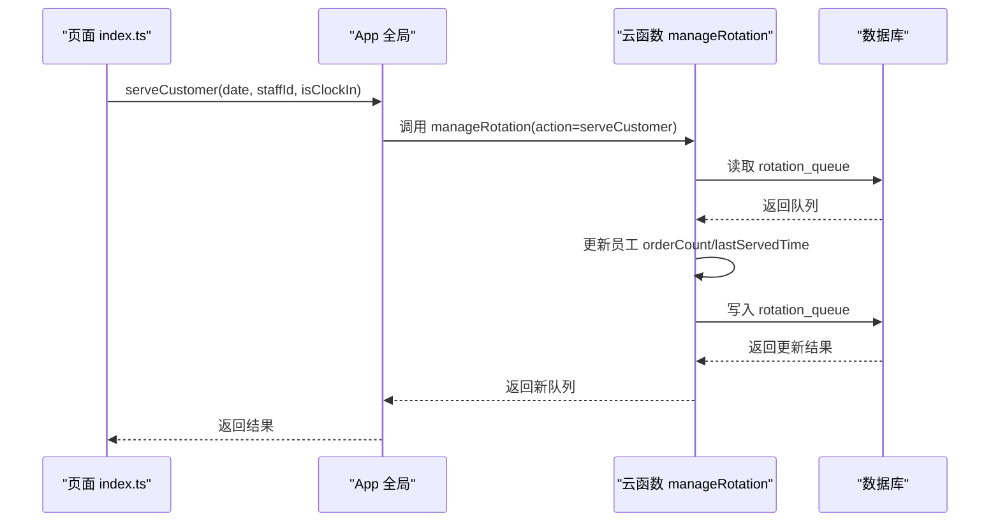
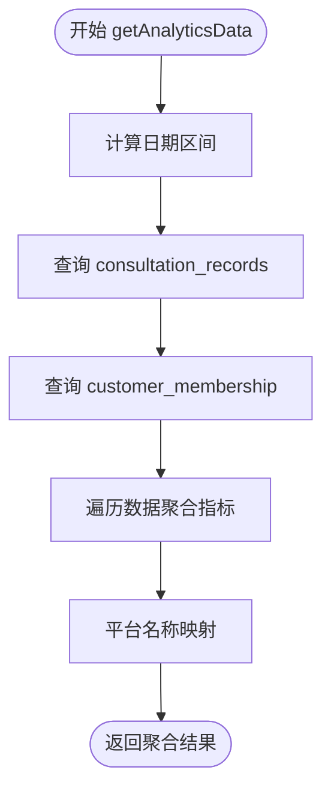
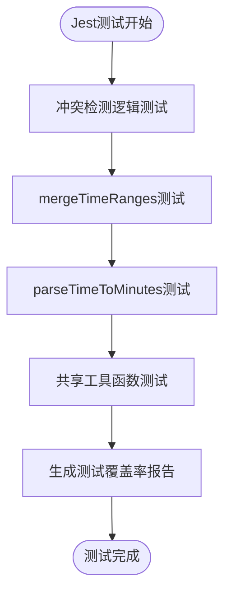
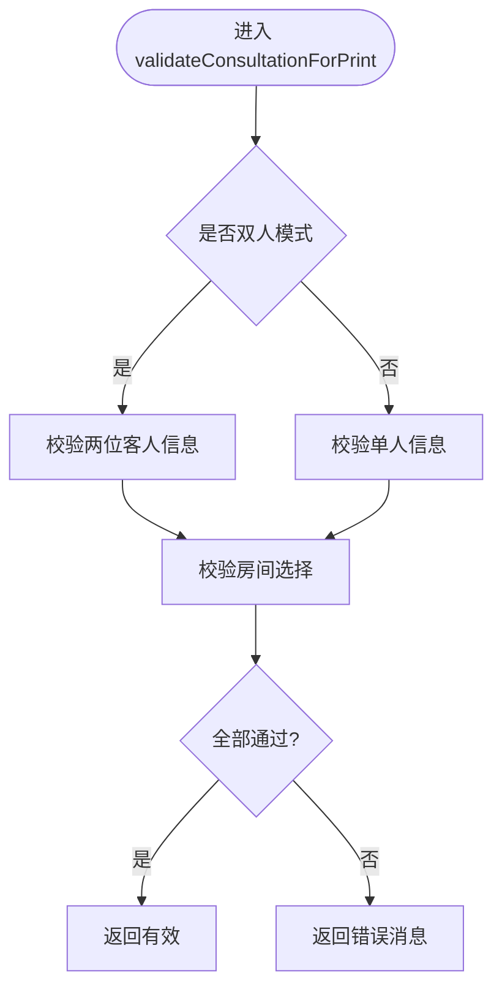
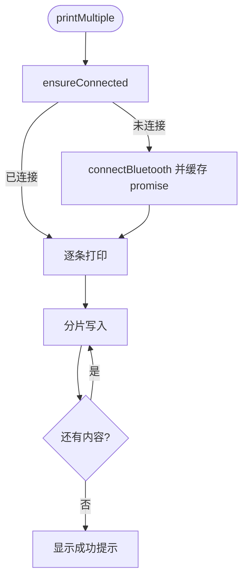
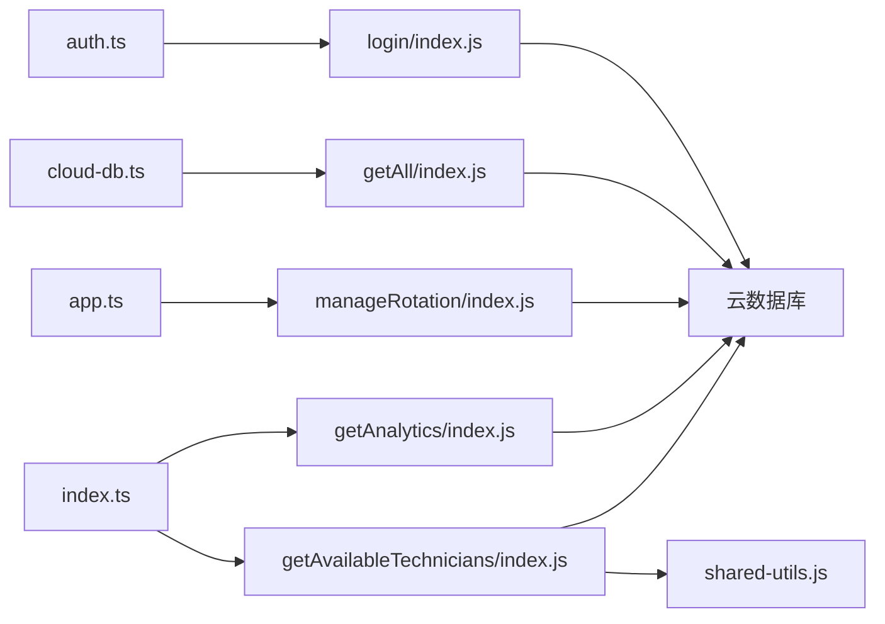

# 测试策略

<cite>
**本文引用的文件**
- [package.json](file://package.json)
- [.eslintrc.js](file://.eslintrc.js)
- [miniprogram/app.ts](file://miniprogram/app.ts)
- [miniprogram/utils/auth.ts](file://miniprogram/utils/auth.ts)
- [miniprogram/utils/cloud-db.ts](file://miniprogram/utils/cloud-db.ts)
- [miniprogram/utils/validators.ts](file://miniprogram/utils/validators.ts)
- [miniprogram/utils/util.ts](file://miniprogram/utils/util.ts)
- [miniprogram/services/printer-service.ts](file://miniprogram/services/printer-service.ts)
- [miniprogram/pages/index/index.ts](file://miniprogram/pages/index/index.ts)
- [cloudfunctions/getAll/index.js](file://cloudfunctions/getAll/index.js)
- [cloudfunctions/login/index.js](file://cloudfunctions/login/index.js)
- [cloudfunctions/manageRotation/index.js](file://cloudfunctions/manageRotation/index.js)
- [cloudfunctions/getAnalytics/index.js](file://cloudfunctions/getAnalytics/index.js)
- [cloudfunctions/getAvailableTechnicians/index.js](file://cloudfunctions/getAvailableTechnicians/index.js)
- [cloudfunctions/getAvailableTechnicians/index.test.js](file://cloudfunctions/getAvailableTechnicians/index.test.js)
- [cloudfunctions/getAvailableTechnicians/jest.config.js](file://cloudfunctions/getAvailableTechnicians/jest.config.js)
- [cloudfunctions/getAvailableTechnicians/package.json](file://cloudfunctions/getAvailableTechnicians/package.json)
- [cloudfunctions/getAvailableTechnicians/shared-utils.js](file://cloudfunctions/getAvailableTechnicians/shared-utils.js)
</cite>

## 更新摘要
**变更内容**
- 新增Jest测试框架配置和单元测试套件
- 为可用技师查询云函数建立完整的测试策略
- 添加边界情况测试和配置文件管理
- 更新测试覆盖率和持续集成方案

## 目录
1. [简介](#简介)
2. [项目结构](#项目结构)
3. [核心组件](#核心组件)
4. [架构总览](#架构总览)
5. [详细组件分析](#详细组件分析)
6. [依赖关系分析](#依赖关系分析)
7. [性能与稳定性测试](#性能与稳定性测试)
8. [故障排查指南](#故障排查指南)
9. [结论](#结论)
10. [附录](#附录)

## 简介
本测试策略面向该小程序项目的整体质量保障，覆盖单元测试、集成测试与端到端测试（E2E）的实施方法与最佳实践；明确测试用例设计原则、Mock 对象使用与测试数据管理；针对小程序特性补充云函数与数据库测试策略；给出覆盖率要求、测试报告生成与持续测试集成建议；并提供性能测试、压力测试与兼容性测试的实施方案，以及测试环境配置、测试数据同步与自动化测试流程。

**更新** 新增Jest测试框架支持，为可用技师查询云函数建立完整的单元测试套件，包括边界情况测试和配置文件管理。

## 项目结构
该项目采用"前端小程序 + 云开发云函数"的分层架构：前端通过云函数访问数据库，业务逻辑分布在页面脚本、工具类与服务类中；云函数负责认证、轮牌调度、统计分析等后端能力。

**图表来源**
- [miniprogram/app.ts:1-191](file://miniprogram/app.ts#L1-L191)
- [miniprogram/utils/auth.ts:1-245](file://miniprogram/utils/auth.ts#L1-L245)
- [miniprogram/utils/cloud-db.ts:1-321](file://miniprogram/utils/cloud-db.ts#L1-L321)
- [miniprogram/utils/validators.ts:1-81](file://miniprogram/utils/validators.ts#L1-L81)
- [miniprogram/utils/util.ts:1-150](file://miniprogram/utils/util.ts#L1-L150)
- [miniprogram/services/printer-service.ts:1-298](file://miniprogram/services/printer-service.ts#L1-L298)
- [miniprogram/pages/index/index.ts:1-735](file://miniprogram/pages/index/index.ts#L1-L735)
- [cloudfunctions/login/index.js:1-180](file://cloudfunctions/login/index.js#L1-L180)
- [cloudfunctions/getAll/index.js:1-59](file://cloudfunctions/getAll/index.js#L1-L59)
- [cloudfunctions/manageRotation/index.js:1-327](file://cloudfunctions/manageRotation/index.js#L1-L327)
- [cloudfunctions/getAnalytics/index.js:1-172](file://cloudfunctions/getAnalytics/index.js#L1-L172)
- [cloudfunctions/getAvailableTechnicians/index.js:1-640](file://cloudfunctions/getAvailableTechnicians/index.js#L1-L640)

**章节来源**
- [package.json:1-28](file://package.json#L1-L28)
- [.eslintrc.js:1-46](file://.eslintrc.js#L1-L46)

## 核心组件
- App 全局：负责启动流程、全局数据加载与云函数调用（如轮牌队列、技师服务等）。
- 认证模块：封装静默登录、用户信息存储与刷新、登出等。
- 云数据库封装：统一提供 CRUD、分页、条件查询、保存咨询单等能力，并通过云函数实现全量读取。
- 校验与工具：提供表单校验、时间计算、加班单位计算等。
- 打印服务：封装蓝牙打印机连接、特征发现与内容打印。
- 页面逻辑：首页承载表单、保存、打印、轮牌交互、预约处理等。
- 云函数：登录鉴权、全量查询、轮牌调度、统计分析、可用技师查询。

**更新** 新增可用技师查询云函数，提供技师可用性检查和快速预约时段计算功能。

**章节来源**
- [miniprogram/app.ts:1-191](file://miniprogram/app.ts#L1-L191)
- [miniprogram/utils/auth.ts:1-245](file://miniprogram/utils/auth.ts#L1-L245)
- [miniprogram/utils/cloud-db.ts:1-321](file://miniprogram/utils/cloud-db.ts#L1-L321)
- [miniprogram/utils/validators.ts:1-81](file://miniprogram/utils/validators.ts#L1-L81)
- [miniprogram/utils/util.ts:1-150](file://miniprogram/utils/util.ts#L1-L150)
- [miniprogram/services/printer-service.ts:1-298](file://miniprogram/services/printer-service.ts#L1-L298)
- [miniprogram/pages/index/index.ts:1-735](file://miniprogram/pages/index/index.ts#L1-L735)
- [cloudfunctions/login/index.js:1-180](file://cloudfunctions/login/index.js#L1-L180)
- [cloudfunctions/getAll/index.js:1-59](file://cloudfunctions/getAll/index.js#L1-L59)
- [cloudfunctions/manageRotation/index.js:1-327](file://cloudfunctions/manageRotation/index.js#L1-L327)
- [cloudfunctions/getAnalytics/index.js:1-172](file://cloudfunctions/getAnalytics/index.js#L1-L172)
- [cloudfunctions/getAvailableTechnicians/index.js:1-640](file://cloudfunctions/getAvailableTechnicians/index.js#L1-L640)

## 架构总览
小程序前端通过云函数访问数据库，形成"前端-云函数-数据库"的三层协作。认证与数据访问均通过云函数进行，保证安全与可测试性。

**图表来源**
- [miniprogram/pages/index/index.ts:1-735](file://miniprogram/pages/index/index.ts#L1-L735)
- [miniprogram/utils/auth.ts:1-245](file://miniprogram/utils/auth.ts#L1-L245)
- [miniprogram/utils/cloud-db.ts:1-321](file://miniprogram/utils/cloud-db.ts#L1-L321)
- [cloudfunctions/login/index.js:1-180](file://cloudfunctions/login/index.js#L1-L180)
- [cloudfunctions/getAll/index.js:1-59](file://cloudfunctions/getAll/index.js#L1-L59)
- [cloudfunctions/manageRotation/index.js:1-327](file://cloudfunctions/manageRotation/index.js#L1-L327)
- [cloudfunctions/getAvailableTechnicians/index.js:1-640](file://cloudfunctions/getAvailableTechnicians/index.js#L1-L640)

## 详细组件分析

### 认证与登录（单元测试重点）
- 测试目标：静默登录、登录刷新、登出、授权手机号、更新 staffId。
- Mock 对象：wx.login、wx.cloud.callFunction、storage。
- 用例设计：正常路径、网络异常、返回格式错误、用户不存在等边界场景。
- 数据管理：本地存储键值、用户对象结构、令牌生成规则。

**图表来源**
- [miniprogram/utils/auth.ts:78-126](file://miniprogram/utils/auth.ts#L78-L126)

**章节来源**
- [miniprogram/utils/auth.ts:1-245](file://miniprogram/utils/auth.ts#L1-L245)
- [cloudfunctions/login/index.js:1-180](file://cloudfunctions/login/index.js#L1-L180)

### 云数据库封装（集成测试重点）
- 测试目标：getAll、findById、find、findOne、insert、updateById、deleteById、分页查询、保存咨询单、按日期查询。
- Mock 对象：wx.cloud.callFunction、wx.cloud.database.collection。
- 用例设计：正常路径、空结果、查询条件函数过滤、分页边界、并发更新失败、删除不存在文档。
- 数据管理：集合常量、时间戳字段、正则查询日期前缀。

**图表来源**
- [miniprogram/utils/cloud-db.ts:1-321](file://miniprogram/utils/cloud-db.ts#L1-L321)

**章节来源**
- [miniprogram/utils/cloud-db.ts:1-321](file://miniprogram/utils/cloud-db.ts#L1-L321)
- [cloudfunctions/getAll/index.js:1-59](file://cloudfunctions/getAll/index.js#L1-L59)

### 轮牌调度（集成/端到端测试重点）
- 测试目标：初始化队列、获取下一位、服务完成、获取队列、调整位置。
- Mock 对象：数据库查询/插入/更新、日期计算。
- 用例设计：无在班员工、队列已存在、员工不在队列、索引越界、跨天逻辑、优先级计算。
- 端到端：结合 App 的轮牌调用链路，验证从页面到云函数再到数据库的一致性。

**图表来源**
- [miniprogram/app.ts:149-168](file://miniprogram/app.ts#L149-L168)
- [cloudfunctions/manageRotation/index.js:185-246](file://cloudfunctions/manageRotation/index.js#L185-L246)

**章节来源**
- [miniprogram/app.ts:1-191](file://miniprogram/app.ts#L1-L191)
- [cloudfunctions/manageRotation/index.js:1-327](file://cloudfunctions/manageRotation/index.js#L1-L327)

### 统计分析（集成测试重点）
- 测试目标：按日期范围聚合收入、订单、项目消费、平台消费、性别分布、车辆分布、会员卡金额。
- Mock 对象：数据库查询、日期区间构造、支付金额累加。
- 用例设计：空数据、边界日期、非法日期、平台映射、排序顺序。

**图表来源**
- [cloudfunctions/getAnalytics/index.js:53-171](file://cloudfunctions/getAnalytics/index.js#L53-L171)

**章节来源**
- [cloudfunctions/getAnalytics/index.js:1-172](file://cloudfunctions/getAnalytics/index.js#L1-L172)

### 可用技师查询（新增单元测试重点）
- 测试目标：技师可用性检查、冲突检测、快速预约时段计算、轮牌+快速预约整合。
- Mock 对象：wx-server-sdk、数据库查询、时间处理函数。
- 用例设计：10分钟重叠容差冲突检测、边界情况、合并时间区间、时间格式转换。
- 测试框架：Jest单元测试，覆盖核心算法逻辑。

**更新** 新增Jest测试框架，为可用技师查询云函数建立完整测试套件。

**图表来源**
- [cloudfunctions/getAvailableTechnicians/index.test.js:1-176](file://cloudfunctions/getAvailableTechnicians/index.test.js#L1-L176)
- [cloudfunctions/getAvailableTechnicians/jest.config.js:1-11](file://cloudfunctions/getAvailableTechnicians/jest.config.js#L1-L11)

**章节来源**
- [cloudfunctions/getAvailableTechnicians/index.js:1-640](file://cloudfunctions/getAvailableTechnicians/index.js#L1-L640)
- [cloudfunctions/getAvailableTechnicians/index.test.js:1-176](file://cloudfunctions/getAvailableTechnicians/index.test.js#L1-L176)
- [cloudfunctions/getAvailableTechnicians/jest.config.js:1-11](file://cloudfunctions/getAvailableTechnicians/jest.config.js#L1-L11)
- [cloudfunctions/getAvailableTechnicians/shared-utils.js:1-164](file://cloudfunctions/getAvailableTechnicians/shared-utils.js#L1-L164)

### 表单校验与工具（单元测试重点）
- 测试目标：单人/双人模式校验、必填项、精油需求、房间选择。
- 工具函数：时间格式化、加班单位计算、项目结束时间、日期前后比较。
- 用例设计：必填缺失、项目类型与精油关系、双人模式完整性。

**图表来源**
- [miniprogram/utils/validators.ts:51-72](file://miniprogram/utils/validators.ts#L51-L72)

**章节来源**
- [miniprogram/utils/validators.ts:1-81](file://miniprogram/utils/validators.ts#L1-L81)
- [miniprogram/utils/util.ts:1-150](file://miniprogram/utils/util.ts#L1-L150)

### 打印服务（单元测试重点）
- 测试目标：蓝牙适配器初始化、设备发现、连接、服务与特征查找、内容分片打印、断开清理。
- Mock 对象：wx.openBluetoothAdapter、wx.startBluetoothDevicesDiscovery、wx.createBLEConnection、wx.getBLEDeviceServices、wx.getBLEDeviceCharacteristics、wx.writeBLECharacteristicValue。
- 用例设计：未找到设备、未找到服务/特征、写入失败、连接并发控制、多单据连续打印。

**图表来源**
- [miniprogram/services/printer-service.ts:197-269](file://miniprogram/services/printer-service.ts#L197-L269)

**章节来源**
- [miniprogram/services/printer-service.ts:1-298](file://miniprogram/services/printer-service.ts#L1-L298)

### 页面逻辑（端到端测试重点）
- 测试目标：表单填写、保存/编辑、打印、轮牌交互、预约删除与重新分配、企业微信推送。
- Mock 对象：云函数调用、页面导航、弹窗与提示。
- 用例设计：编辑模式、双人模式、报钟时间选择、保存失败回滚、推送失败兜底。

**章节来源**
- [miniprogram/pages/index/index.ts:1-735](file://miniprogram/pages/index/index.ts#L1-L735)

## 依赖关系分析
- 前端对云函数的依赖集中在认证、数据读取、轮牌与统计。
- 云函数对数据库的依赖包括 users、consultation_records、customer_membership、schedule、rotation_queue、staff、reservations 等集合。
- 工具与服务类之间低耦合，便于单元测试隔离。
- **新增** 可用技师查询云函数依赖共享工具模块，提供时间处理和数据合并功能。

**图表来源**
- [miniprogram/utils/auth.ts:1-245](file://miniprogram/utils/auth.ts#L1-L245)
- [miniprogram/utils/cloud-db.ts:1-321](file://miniprogram/utils/cloud-db.ts#L1-L321)
- [miniprogram/app.ts:1-191](file://miniprogram/app.ts#L1-L191)
- [miniprogram/pages/index/index.ts:1-735](file://miniprogram/pages/index/index.ts#L1-L735)
- [cloudfunctions/login/index.js:1-180](file://cloudfunctions/login/index.js#L1-L180)
- [cloudfunctions/getAll/index.js:1-59](file://cloudfunctions/getAll/index.js#L1-L59)
- [cloudfunctions/manageRotation/index.js:1-327](file://cloudfunctions/manageRotation/index.js#L1-L327)
- [cloudfunctions/getAnalytics/index.js:1-172](file://cloudfunctions/getAnalytics/index.js#L1-L172)
- [cloudfunctions/getAvailableTechnicians/index.js:1-640](file://cloudfunctions/getAvailableTechnicians/index.js#L1-L640)
- [cloudfunctions/getAvailableTechnicians/shared-utils.js:1-164](file://cloudfunctions/getAvailableTechnicians/shared-utils.js#L1-L164)

## 性能与稳定性测试
- 单元测试
  - 覆盖率：核心工具函数与校验逻辑达到高覆盖率（建议≥80%），关键分支与异常路径全覆盖。
  - Mock 策略：使用最小依赖替换，避免真实网络与蓝牙调用。
  - **新增** Jest测试框架：为可用技师查询云函数提供专门的单元测试套件，覆盖10分钟重叠容差冲突检测逻辑。
- 集成测试
  - 覆盖率：云函数与数据库交互建议≥70%，重点覆盖 getAll、轮牌、登录、统计、可用技师查询。
  - 数据隔离：使用测试环境数据库与独立集合，测试后清理。
- 端到端测试
  - 覆盖率：页面主流程≥90%，包括登录、表单、保存、打印、轮牌、推送、可用技师查询。
  - 场景：弱网、断网、蓝牙不可用、超时重试。
- 性能测试
  - 大数据量 getAll：模拟百万级文档，评估分页与限流策略。
  - 轮牌高频调用：并发 serveCustomer，观察数据库写入与一致性。
  - 打印吞吐：多单据连续打印，测量分片写入耗时与失败重试。
  - **新增** 可用技师查询性能：测试大量技师数据的冲突检测和时间合并算法性能。
- 压力测试
  - 登录风暴：短时间大量用户登录，观察云函数冷启动与数据库负载。
  - 统计报表：大跨度日期聚合，评估聚合复杂度与索引优化。
  - **新增** 可用技师查询压力：模拟高并发的技师可用性查询请求。
- 兼容性测试
  - 不同机型蓝牙适配差异、不同系统版本的蓝牙 API 行为。
  - 小程序基础库版本差异导致的 API 支持情况。

## 故障排查指南
- 登录失败
  - 检查云函数返回格式与错误码；确认 storage 读写；验证 wx.login 是否成功。
- 数据查询为空
  - 检查 getAll 的集合名与分页逻辑；确认数据库权限与索引。
- 轮牌异常
  - 核对 schedule 与 staff 状态；检查 rotation_queue 初始化与索引调整。
- 打印失败
  - 检查蓝牙适配器初始化、设备发现、服务与特征查找；关注分片写入回调。
- 统计异常
  - 核对日期区间、平台映射、支付金额累加逻辑。
- **新增** 可用技师查询异常
  - 检查时间格式转换、冲突检测算法、数据库查询条件；验证10分钟重叠容差逻辑。

**章节来源**
- [miniprogram/utils/auth.ts:1-245](file://miniprogram/utils/auth.ts#L1-L245)
- [miniprogram/utils/cloud-db.ts:1-321](file://miniprogram/utils/cloud-db.ts#L1-L321)
- [cloudfunctions/manageRotation/index.js:1-327](file://cloudfunctions/manageRotation/index.js#L1-L327)
- [miniprogram/services/printer-service.ts:1-298](file://miniprogram/services/printer-service.ts#L1-L298)
- [cloudfunctions/getAnalytics/index.js:1-172](file://cloudfunctions/getAnalytics/index.js#L1-L172)
- [cloudfunctions/getAvailableTechnicians/index.js:1-640](file://cloudfunctions/getAvailableTechnicians/index.js#L1-L640)

## 结论
通过分层测试策略与完善的 Mock/数据管理，可在保证质量的同时提升开发效率。**更新** 新增Jest测试框架支持，为可用技师查询云函数建立了完整的单元测试套件，包括边界情况测试和配置文件管理。建议以单元测试为基础、集成测试为中坚、端到端测试为保障，配合性能与压力测试，构建可持续的质量闭环。

## 附录

### 测试用例设计原则
- 唯一职责：每个用例聚焦单一行为或边界。
- 可重复：用例可重复执行且结果稳定。
- 可维护：用例命名清晰，前置条件与期望明确。
- 可观测：失败时输出上下文与关键变量。
- **新增** 可测试性：为云函数提供专门的测试配置和Mock对象。

### Mock 对象使用建议
- 小程序 API：wx.* 使用框架提供的 mock 或第三方库（如 jest 的全局替换）。
- 云函数：通过代理或拦截 wx.cloud.callFunction，注入测试响应。
- 存储：统一使用内存存储或可控的存储接口，避免真实持久化。
- **新增** Jest Mock：使用jest.mock()模拟wx-server-sdk和数据库操作。

### 测试数据管理
- 数据库：使用测试环境独立集合；测试前导入种子数据，测试后清理或回滚。
- 文件：使用固定大小与格式的测试图片与音频，确保打印稳定性。
- 环境：区分开发/测试/生产环境，强制使用不同 envId 与集合前缀。
- **新增** 配置管理：使用jest.config.js统一配置测试环境和覆盖率收集。

### 小程序特有测试方法
- 交互测试：使用自动化框架（如基于小程序原生调试协议的工具）模拟点击、滑动、输入。
- 蓝牙：在支持蓝牙的真机上运行，或使用模拟器；必要时录制/回放蓝牙事件序列。
- 云函数：在本地或云端部署测试版本，使用测试账号与测试数据集。
- **新增** 单元测试：使用Jest框架对云函数进行单元测试，支持异步操作和Mock。

### 云函数测试策略
- 单元测试：对纯函数与工具函数进行测试；对外部依赖进行 Mock。
- 集成测试：连接测试数据库，验证查询、聚合、事务与索引使用。
- 安全测试：验证权限控制、参数校验与异常处理。
- **新增** Jest测试：为可用技师查询云函数建立完整的单元测试套件，包括冲突检测、时间处理、数据合并等核心逻辑。

### 数据库测试策略
- 查询测试：覆盖等值、范围、正则、聚合、分页。
- 写入测试：并发写入、唯一约束、级联更新。
- 索引测试：验证查询性能与覆盖索引效果。

### 测试覆盖率与报告
- 覆盖率：建议单元测试覆盖率≥80%，集成测试覆盖率≥70%，端到端覆盖率≥90%。
- 报告：生成 HTML/Cobertura/JUnit 报告，接入 CI/CD 展示与阈值告警。
- **新增** Jest覆盖率：使用jest.config.js配置覆盖率收集，生成详细的测试报告。

### 持续测试集成方案
- CI/CD：在流水线中执行单元测试、集成测试与端到端测试；失败即阻断。
- 环境：自动化部署测试环境与数据库快照；每次 PR 自动运行关键测试。
- 回归：每日运行全量回归测试，重点关注登录、数据读写、轮牌、打印、可用技师查询。
- **新增** 自动化测试：配置Jest测试在CI环境中自动执行，确保代码质量。

### Jest测试框架配置
- 测试环境：Node.js环境，支持异步操作和Promise。
- 覆盖率收集：自动收集测试覆盖率，排除配置文件和测试文件。
- 测试脚本：通过package.json中的test脚本运行Jest测试。
- Mock策略：使用jest.mock()模拟外部依赖，如wx-server-sdk和数据库操作。

**章节来源**
- [cloudfunctions/getAvailableTechnicians/jest.config.js:1-11](file://cloudfunctions/getAvailableTechnicians/jest.config.js#L1-L11)
- [cloudfunctions/getAvailableTechnicians/package.json:1-15](file://cloudfunctions/getAvailableTechnicians/package.json#L1-L15)
- [cloudfunctions/getAvailableTechnicians/index.test.js:1-176](file://cloudfunctions/getAvailableTechnicians/index.test.js#L1-L176)