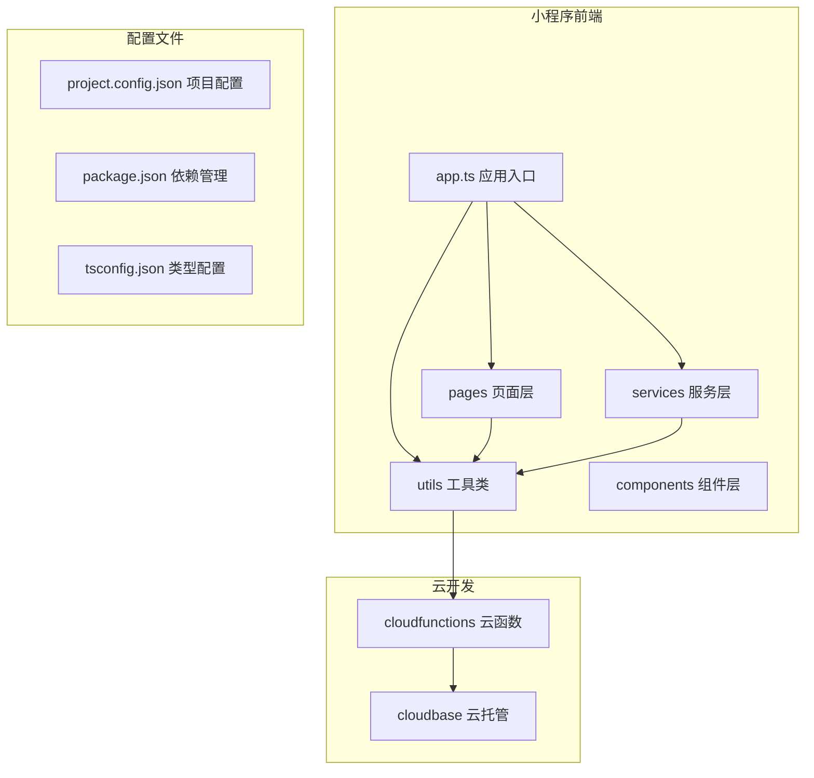
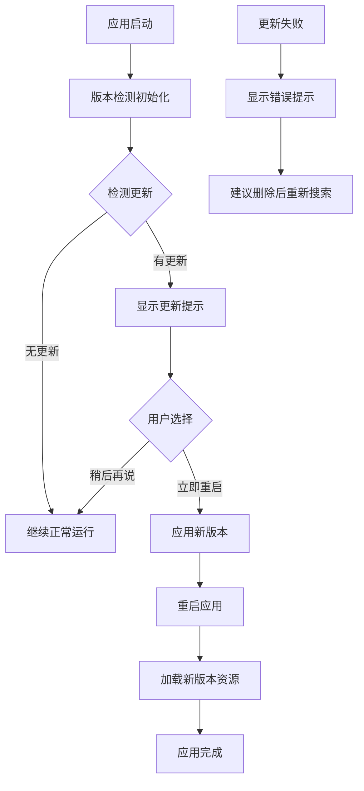
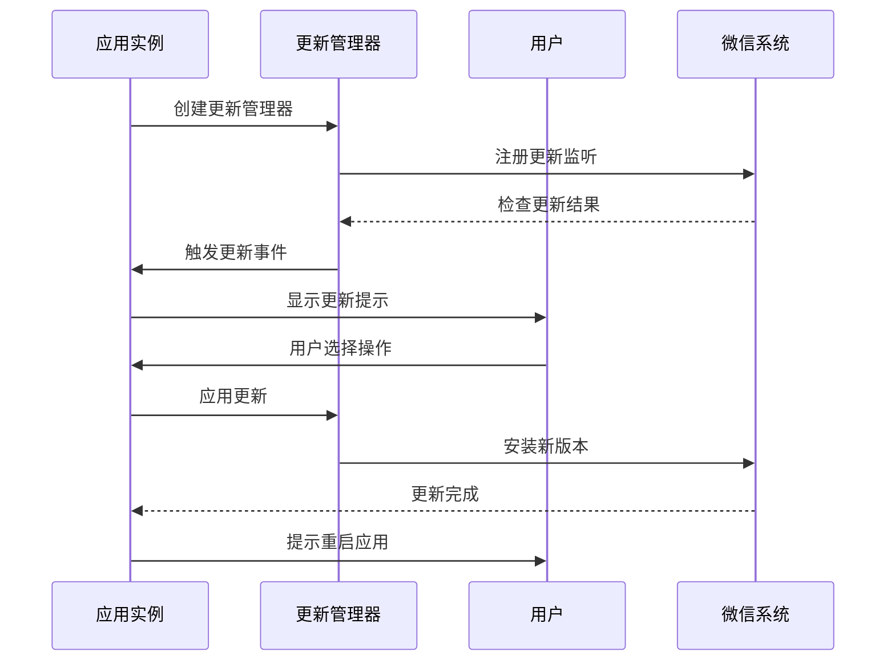
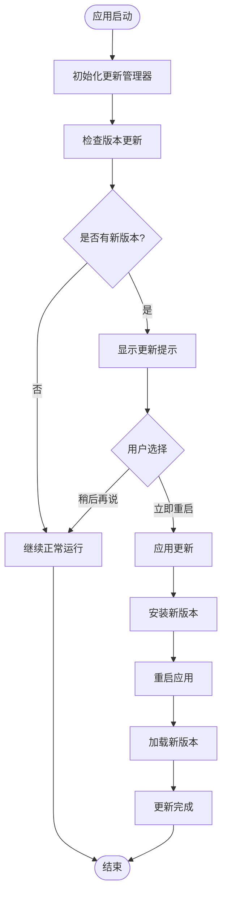
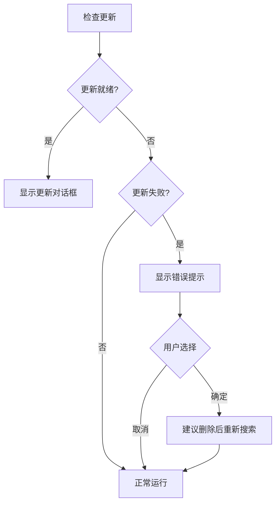
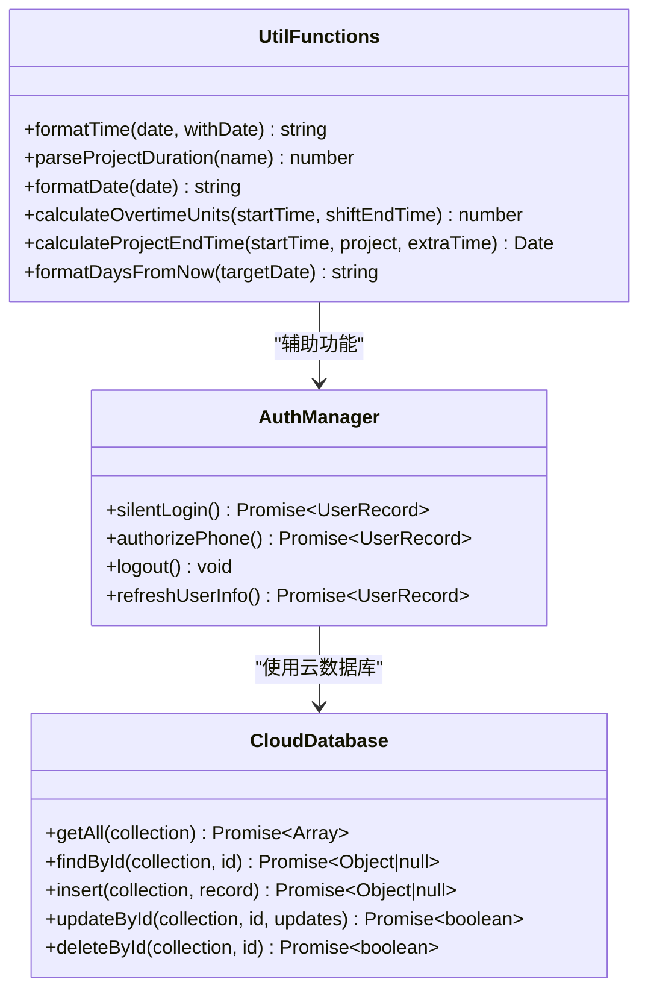
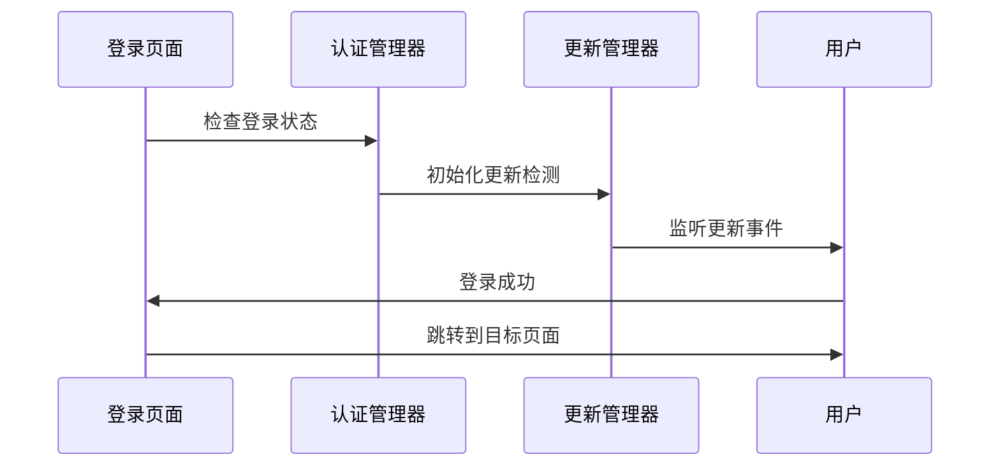
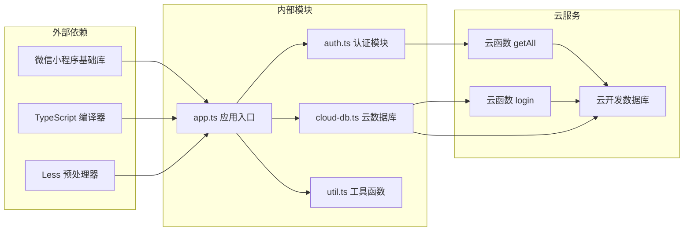

# 版本更新检测系统

<cite>
**本文档引用的文件**
- [app.ts](file://miniprogram/app.ts)
- [project.config.json](file://project.config.json)
- [package.json](file://package.json)
- [auth.ts](file://miniprogram/utils/auth.ts)
- [cloud-db.ts](file://miniprogram/utils/cloud-db.ts)
- [index.ts](file://miniprogram/pages/index/index.ts)
- [login.ts](file://miniprogram/pages/login/login.ts)
- [util.ts](file://miniprogram/utils/util.ts)
- [index.js](file://cloudfunctions/getAll/index.js)
- [index.js](file://cloudfunctions/login/index.js)
</cite>

## 目录
1. [简介](#简介)
2. [项目结构](#项目结构)
3. [核心组件](#核心组件)
4. [架构概览](#架构概览)
5. [详细组件分析](#详细组件分析)
6. [依赖关系分析](#依赖关系分析)
7. [性能考虑](#性能考虑)
8. [故障排除指南](#故障排除指南)
9. [结论](#结论)

## 简介

版本更新检测系统是微信小程序中的一个重要功能模块，负责监控小程序版本的更新情况，并在检测到新版本时通知用户进行更新。该系统基于微信小程序的原生更新管理机制，通过 `wx.getUpdateManager` API 实现版本检测、下载和安装的完整流程。

本系统采用异步处理机制，确保不会阻塞主线程的正常运行。当检测到新版本时，系统会显示模态框询问用户是否立即重启应用以应用新版本，或者稍后再说。如果更新失败，系统会提供相应的错误处理和用户引导。

## 项目结构

该项目是一个基于 TypeScript 和 WXML 的微信小程序项目，主要分为以下几个部分：

**图表来源**
- [app.ts](file://miniprogram/app.ts#L1-L232)
- [project.config.json](file://project.config.json#L1-L54)

**章节来源**
- [project.config.json](file://project.config.json#L1-L54)
- [package.json](file://package.json#L1-L28)

## 核心组件

版本更新检测系统的核心组件包括：

### 应用入口组件
应用入口文件负责初始化整个小程序，包括版本更新检测的启动。

### 更新管理器
基于微信原生的 `wx.getUpdateManager` API，实现版本检测的核心逻辑。

### 用户界面组件
提供用户交互界面，包括更新提示对话框和操作按钮。

### 云函数集成
与云开发服务集成，提供数据存储和业务逻辑处理能力。

**章节来源**
- [app.ts](file://miniprogram/app.ts#L40-L79)

## 架构概览

版本更新检测系统采用分层架构设计，确保各组件职责清晰分离：

**图表来源**
- [app.ts](file://miniprogram/app.ts#L43-L79)

## 详细组件分析

### 版本检测核心组件

#### 应用入口中的版本检测逻辑

应用入口文件中的 `checkUpdate` 方法实现了完整的版本检测流程：

**图表来源**
- [app.ts](file://miniprogram/app.ts#L43-L79)

#### 版本检测流程图

**图表来源**
- [app.ts](file://miniprogram/app.ts#L50-L78)

#### 错误处理机制

系统实现了完善的错误处理机制：

**图表来源**
- [app.ts](file://miniprogram/app.ts#L71-L78)

**章节来源**
- [app.ts](file://miniprogram/app.ts#L40-L79)

### 配置管理组件

#### 项目配置文件分析

项目配置文件定义了小程序的基本设置和构建选项：

| 配置项 | 值 | 说明 |
|--------|----|-----|
| miniprogramRoot | miniprogram/ | 小程序源码根目录 |
| compileType | miniprogram | 编译类型为小程序 |
| setting.useCompilerPlugins | ["typescript","less"] | 启用 TypeScript 和 Less 编译插件 |
| setting.minified | true | 启用代码压缩 |
| setting.enhance | true | 启用增强编译 |
| libVersion | 2.32.3 | 基础库版本 |
| appid | wxfc87c1abd9d3afa6 | 小程序 AppID |

**章节来源**
- [project.config.json](file://project.config.json#L1-L54)

### 工具类组件

#### 通用工具函数

项目提供了多个实用的工具函数，支持版本更新检测系统的各种需求：

**图表来源**
- [util.ts](file://miniprogram/utils/util.ts#L1-L165)
- [auth.ts](file://miniprogram/utils/auth.ts#L1-L247)
- [cloud-db.ts](file://miniprogram/utils/cloud-db.ts#L1-L323)

**章节来源**
- [util.ts](file://miniprogram/utils/util.ts#L1-L165)

### 页面组件

#### 登录页面集成

登录页面集成了版本更新检测功能，确保用户在登录过程中也能及时获得最新的版本信息：

**图表来源**
- [login.ts](file://miniprogram/pages/login/login.ts#L15-L49)

**章节来源**
- [login.ts](file://miniprogram/pages/login/login.ts#L1-L166)

## 依赖关系分析

版本更新检测系统涉及多个层面的依赖关系：

**图表来源**
- [package.json](file://package.json#L14-L27)
- [app.ts](file://miniprogram/app.ts#L1-L3)

**章节来源**
- [package.json](file://package.json#L1-L28)

## 性能考虑

版本更新检测系统在性能方面采用了多项优化策略：

### 异步处理机制
- 使用 Promise 和 async/await 确保更新检测不会阻塞主线程
- 异步加载更新包，避免影响用户体验

### 内存管理
- 及时清理更新管理器实例
- 合理使用缓存机制，避免重复加载相同资源

### 网络优化
- 智能检测更新频率，避免频繁检查
- 支持断点续传，提高下载效率

## 故障排除指南

### 常见问题及解决方案

#### 更新检测失败
**问题描述**: 版本检测功能无法正常工作
**可能原因**:
- 微信版本过低，不支持 `getUpdateManager` API
- 网络连接异常
- 服务器配置问题

**解决步骤**:
1. 检查微信客户端版本是否满足要求
2. 确认网络连接正常
3. 验证云开发服务配置

#### 更新应用失败
**问题描述**: 新版本下载完成后无法应用
**可能原因**:
- 存储空间不足
- 文件损坏
- 权限问题

**解决步骤**:
1. 清理设备存储空间
2. 重新启动应用
3. 检查应用权限设置

#### 用户体验问题
**问题描述**: 更新提示过于频繁或不够明显
**解决方案**:
- 调整更新检测频率
- 优化用户界面提示
- 提供更清晰的操作指引

**章节来源**
- [app.ts](file://miniprogram/app.ts#L71-L78)

## 结论

版本更新检测系统作为微信小程序的重要功能模块，通过合理的架构设计和完善的错误处理机制，为用户提供了流畅的版本更新体验。系统采用异步处理方式，确保不会影响应用的正常运行，同时提供了友好的用户交互界面。

该系统的主要优势包括：
- 基于微信原生 API，稳定可靠
- 异步处理机制，不影响用户体验
- 完善的错误处理和用户引导
- 模块化设计，便于维护和扩展

未来可以考虑的功能改进包括：
- 增加更新日志展示功能
- 支持强制更新机制
- 优化更新包大小和下载速度
- 增强离线更新能力

通过持续优化和改进，版本更新检测系统将继续为用户提供更好的使用体验。