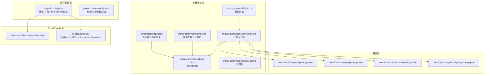
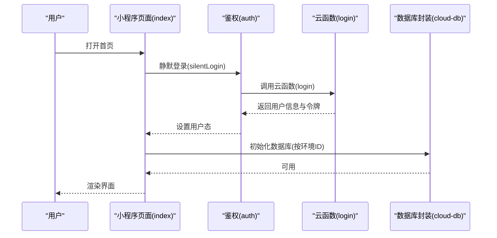
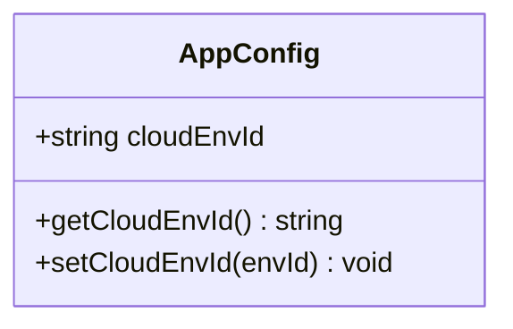
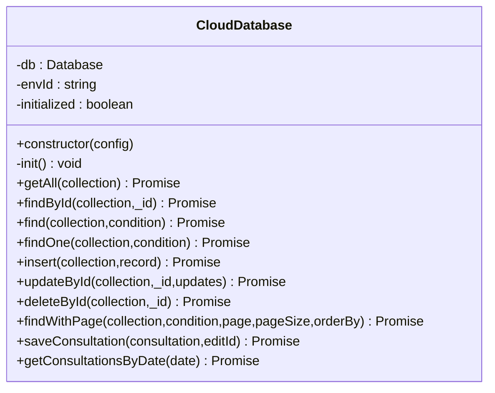
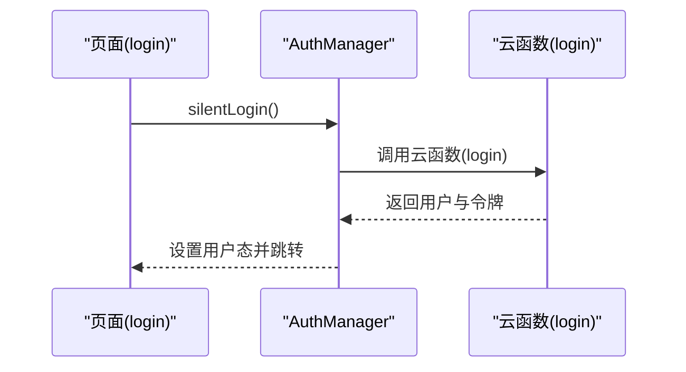
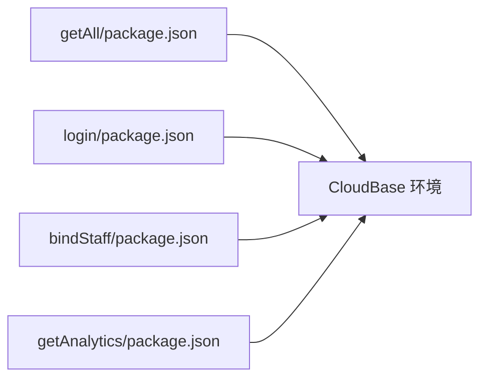
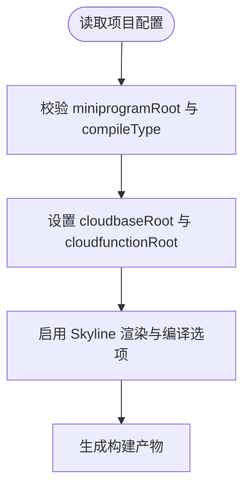
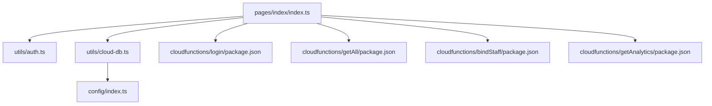

# 环境配置

<cite>
**本文引用的文件**
- [miniprogram/app.json](file://miniprogram/app.json)
- [miniprogram/config/index.ts](file://miniprogram/config/index.ts)
- [project.config.json](file://project.config.json)
- [project.private.config.json](file://project.private.config.json)
- [package.json](file://package.json)
- [cloudfunctions/getAll/package.json](file://cloudfunctions/getAll/package.json)
- [cloudfunctions/login/package.json](file://cloudfunctions/login/package.json)
- [cloudfunctions/bindStaff/package.json](file://cloudfunctions/bindStaff/package.json)
- [cloudfunctions/getAnalytics/package.json](file://cloudfunctions/getAnalytics/package.json)
- [miniprogram/utils/cloud-db.ts](file://miniprogram/utils/cloud-db.ts)
- [miniprogram/utils/auth.ts](file://miniprogram/utils/auth.ts)
- [miniprogram/pages/index/index.ts](file://miniprogram/pages/index/index.ts)
- [miniprogram/pages/login/login.ts](file://miniprogram/pages/login/login.ts)
</cite>

## 目录
1. [简介](#简介)
2. [项目结构](#项目结构)
3. [核心组件](#核心组件)
4. [架构总览](#架构总览)
5. [详细组件分析](#详细组件分析)
6. [依赖关系分析](#依赖关系分析)
7. [性能考量](#性能考量)
8. [故障排查指南](#故障排查指南)
9. [结论](#结论)
10. [附录](#附录)

## 简介
本文件面向小程序与云开发（CloudBase）项目的环境配置管理，系统性梳理开发、测试与生产三类环境的配置差异与管理策略；明确项目配置文件结构、参数含义与环境变量设置方式；阐述小程序编译配置、云函数部署配置与CloudBase平台配置；给出私有配置文件的安全管理、敏感信息保护与版本控制策略；提供环境切换方法、配置验证与故障排查指南，并包含CI/CD环境配置与自动化部署脚本建议及配置模板管理思路。

## 项目结构
本项目采用“小程序前端 + 云开发 + 云函数”的典型分层结构：
- 小程序前端：位于 miniprogram 目录，包含页面、组件、工具类、服务等。
- 云开发配置：通过 project.config.json 与 project.private.config.json 控制编译、打包与CloudBase根目录映射。
- 云函数：位于 cloudfunctions 目录，按功能拆分，每个云函数拥有独立 package.json。
- CloudBase 平台：cloudbase 目录用于存放不同环境的容器与函数资源（多环境隔离）。

图表来源
- [miniprogram/app.json](file://miniprogram/app.json#L1-L35)
- [miniprogram/config/index.ts](file://miniprogram/config/index.ts#L1-L18)
- [project.config.json](file://project.config.json#L1-L54)
- [project.private.config.json](file://project.private.config.json#L1-L112)
- [cloudfunctions/getAll/package.json](file://cloudfunctions/getAll/package.json#L1-L10)
- [cloudfunctions/login/package.json](file://cloudfunctions/login/package.json#L1-L10)
- [cloudfunctions/bindStaff/package.json](file://cloudfunctions/bindStaff/package.json#L1-L10)
- [cloudfunctions/getAnalytics/package.json](file://cloudfunctions/getAnalytics/package.json#L1-L10)

章节来源
- [miniprogram/app.json](file://miniprogram/app.json#L1-L35)
- [project.config.json](file://project.config.json#L1-L54)
- [project.private.config.json](file://project.private.config.json#L1-L112)

## 核心组件
- 应用配置中心：集中管理云环境ID与运行时切换能力，便于在不同环境间快速切换。
- 数据库封装：统一封装云数据库调用，支持按环境ID初始化与查询。
- 鉴权封装：统一处理登录、静默登录、授权手机号、登出与权限校验。
- 云函数：按功能拆分，独立依赖与部署，便于灰度与回滚。
- 项目配置：通过 project.config.json 与 project.private.config.json 控制编译、打包与CloudBase根目录映射。

章节来源
- [miniprogram/config/index.ts](file://miniprogram/config/index.ts#L1-L18)
- [miniprogram/utils/cloud-db.ts](file://miniprogram/utils/cloud-db.ts#L1-L321)
- [miniprogram/utils/auth.ts](file://miniprogram/utils/auth.ts#L1-L245)
- [cloudfunctions/getAll/package.json](file://cloudfunctions/getAll/package.json#L1-L10)
- [cloudfunctions/login/package.json](file://cloudfunctions/login/package.json#L1-L10)
- [cloudfunctions/bindStaff/package.json](file://cloudfunctions/bindStaff/package.json#L1-L10)
- [cloudfunctions/getAnalytics/package.json](file://cloudfunctions/getAnalytics/package.json#L1-L10)

## 架构总览
小程序前端通过云能力与云函数进行数据交互，数据库封装负责底层调用，鉴权封装负责用户态管理。CloudBase平台提供多环境隔离与资源管理，项目配置文件决定编译与打包行为。

图表来源
- [miniprogram/pages/index/index.ts](file://miniprogram/pages/index/index.ts#L126-L147)
- [miniprogram/utils/auth.ts](file://miniprogram/utils/auth.ts#L78-L126)
- [miniprogram/utils/cloud-db.ts](file://miniprogram/utils/cloud-db.ts#L17-L47)
- [cloudfunctions/login/package.json](file://cloudfunctions/login/package.json#L1-L10)

## 详细组件分析

### 应用配置中心（云环境ID）
- 职责：集中管理云环境ID，提供运行时获取与设置能力，支持在不同环境间切换。
- 环境差异：开发/测试/生产可分别指向不同的CloudBase环境ID，实现数据隔离。
- 安全建议：避免硬编码敏感ID，优先通过构建注入或平台变量传递。

图表来源
- [miniprogram/config/index.ts](file://miniprogram/config/index.ts#L5-L14)

章节来源
- [miniprogram/config/index.ts](file://miniprogram/config/index.ts#L1-L18)

### 数据库封装（CloudDatabase）
- 职责：统一封装云数据库初始化、集合操作、分页查询、插入/更新/删除等。
- 环境初始化：支持通过构造函数传入 envId，若未传则使用全局配置。
- 错误处理：对异常进行捕获与降级，保证调用方健壮性。
- 性能优化：提供 getAll 云函数配合突破限制的查询场景。

图表来源
- [miniprogram/utils/cloud-db.ts](file://miniprogram/utils/cloud-db.ts#L12-L299)

章节来源
- [miniprogram/utils/cloud-db.ts](file://miniprogram/utils/cloud-db.ts#L1-L321)

### 鉴权封装（AuthManager）
- 职责：统一处理登录、静默登录、授权手机号、登出与权限校验。
- 登录流程：静默登录优先，失败则触发云函数登录；成功后持久化用户信息与令牌。
- 权限控制：基于用户角色与页面权限进行跳转与渲染控制。

图表来源
- [miniprogram/pages/login/login.ts](file://miniprogram/pages/login/login.ts#L15-L49)
- [miniprogram/utils/auth.ts](file://miniprogram/utils/auth.ts#L78-L126)
- [cloudfunctions/login/package.json](file://cloudfunctions/login/package.json#L1-L10)

章节来源
- [miniprogram/utils/auth.ts](file://miniprogram/utils/auth.ts#L1-L245)
- [miniprogram/pages/login/login.ts](file://miniprogram/pages/login/login.ts#L1-L166)

### 云函数（按功能拆分）
- 结构：每个云函数独立 package.json，声明依赖（如 wx-server-sdk）。
- 部署：通过 CloudBase 平台或命令行工具部署至对应环境。
- 灰度与回滚：可针对不同环境进行独立部署与版本管理。

图表来源
- [cloudfunctions/getAll/package.json](file://cloudfunctions/getAll/package.json#L1-L10)
- [cloudfunctions/login/package.json](file://cloudfunctions/login/package.json#L1-L10)
- [cloudfunctions/bindStaff/package.json](file://cloudfunctions/bindStaff/package.json#L1-L10)
- [cloudfunctions/getAnalytics/package.json](file://cloudfunctions/getAnalytics/package.json#L1-L10)

章节来源
- [cloudfunctions/getAll/package.json](file://cloudfunctions/getAll/package.json#L1-L10)
- [cloudfunctions/login/package.json](file://cloudfunctions/login/package.json#L1-L10)
- [cloudfunctions/bindStaff/package.json](file://cloudfunctions/bindStaff/package.json#L1-L10)
- [cloudfunctions/getAnalytics/package.json](file://cloudfunctions/getAnalytics/package.json#L1-L10)

### 项目配置（编译与CloudBase根目录）
- project.config.json：定义小程序根目录、编译类型、TypeScript/LESS插件、CloudBase根目录、云函数根目录等。
- project.private.config.json：私有配置，包含调试设置、条件启动项（如 profile、login、analytics 等页面快捷入口）。

图表来源
- [project.config.json](file://project.config.json#L3-L53)
- [project.private.config.json](file://project.private.config.json#L1-L112)

章节来源
- [project.config.json](file://project.config.json#L1-L54)
- [project.private.config.json](file://project.private.config.json#L1-L112)

## 依赖关系分析
- 小程序页面依赖鉴权封装与数据库封装；数据库封装依赖应用配置中心提供的环境ID。
- 页面通过云函数完成登录、授权与消息推送等后端逻辑。
- 云函数依赖 wx-server-sdk，按需引入其他依赖包。

图表来源
- [miniprogram/pages/index/index.ts](file://miniprogram/pages/index/index.ts#L1-L11)
- [miniprogram/utils/auth.ts](file://miniprogram/utils/auth.ts#L1-L4)
- [miniprogram/utils/cloud-db.ts](file://miniprogram/utils/cloud-db.ts#L1-L12)
- [miniprogram/config/index.ts](file://miniprogram/config/index.ts#L1-L10)
- [cloudfunctions/login/package.json](file://cloudfunctions/login/package.json#L1-L10)
- [cloudfunctions/getAll/package.json](file://cloudfunctions/getAll/package.json#L1-L10)
- [cloudfunctions/bindStaff/package.json](file://cloudfunctions/bindStaff/package.json#L1-L10)
- [cloudfunctions/getAnalytics/package.json](file://cloudfunctions/getAnalytics/package.json#L1-L10)

章节来源
- [miniprogram/pages/index/index.ts](file://miniprogram/pages/index/index.ts#L1-L11)
- [miniprogram/utils/auth.ts](file://miniprogram/utils/auth.ts#L1-L4)
- [miniprogram/utils/cloud-db.ts](file://miniprogram/utils/cloud-db.ts#L1-L12)
- [miniprogram/config/index.ts](file://miniprogram/config/index.ts#L1-L10)

## 性能考量
- Skyline 渲染与编译优化：项目配置启用了 Skyline 渲染与多种编译优化选项，有助于提升运行时性能与包体体积控制。
- 分页查询与 getAll 云函数：数据库封装提供分页查询与 getAll 云函数，避免小程序端 limit 限制与全量拉取导致的性能问题。
- 连接复用与并发：数据库封装内部仅初始化一次，减少重复初始化成本；分页查询使用 Promise.all 并发计数与查询，提升响应速度。

章节来源
- [project.config.json](file://project.config.json#L23-L35)
- [miniprogram/utils/cloud-db.ts](file://miniprogram/utils/cloud-db.ts#L242-L254)

## 故障排查指南
- 登录失败
  - 现象：静默登录无用户态或授权手机号失败。
  - 排查：检查云函数 login 的返回格式与结果码；确认网络与云函数可用性；查看日志输出。
  - 参考路径：[miniprogram/utils/auth.ts](file://miniprogram/utils/auth.ts#L78-L126)、[cloudfunctions/login/package.json](file://cloudfunctions/login/package.json#L1-L10)
- 数据库查询异常
  - 现象：find/findOne/getAll 失败或返回空。
  - 排查：确认环境ID是否正确；检查集合名称与查询条件；查看 getAll 云函数是否正常。
  - 参考路径：[miniprogram/utils/cloud-db.ts](file://miniprogram/utils/cloud-db.ts#L69-L88)、[miniprogram/utils/cloud-db.ts](file://miniprogram/utils/cloud-db.ts#L108-L123)
- 云函数部署问题
  - 现象：云函数无法调用或返回超时。
  - 排查：确认 cloudbaseRoot 与 cloudfunctionRoot 配置；检查依赖安装与 SDK 版本；查看平台日志。
  - 参考路径：[project.config.json](file://project.config.json#L51-L53)、[cloudfunctions/getAll/package.json](file://cloudfunctions/getAll/package.json#L1-L10)
- 私有配置泄露
  - 现象：本地调试配置被提交到仓库。
  - 排查：确认 .gitignore 中包含 project.private.config.json；不在仓库中保留任何敏感信息。
  - 参考路径：[project.private.config.json](file://project.private.config.json#L1-L112)

章节来源
- [miniprogram/utils/auth.ts](file://miniprogram/utils/auth.ts#L78-L126)
- [miniprogram/utils/cloud-db.ts](file://miniprogram/utils/cloud-db.ts#L69-L88)
- [project.config.json](file://project.config.json#L51-L53)
- [project.private.config.json](file://project.private.config.json#L1-L112)

## 结论
本项目通过清晰的配置分层与模块化设计，实现了小程序前端、云开发与云函数的高效协同。建议在实际落地中进一步完善环境变量注入、私有配置安全与CI/CD自动化流程，以确保开发、测试与生产的稳定与可控。

## 附录

### 开发/测试/生产环境配置差异与管理策略
- 环境ID管理
  - 在应用配置中心集中维护各环境的 cloudEnvId，并提供 setCloudEnvId 以便在不同环境切换。
  - 参考路径：[miniprogram/config/index.ts](file://miniprogram/config/index.ts#L8-L14)
- 项目配置
  - 通过 project.config.json 统一编译与打包策略；CloudBase 根目录与云函数根目录按环境区分。
  - 参考路径：[project.config.json](file://project.config.json#L3-L53)
- 私有配置
  - project.private.config.json 仅用于本地调试与条件启动，严禁提交到仓库；敏感信息通过平台变量注入。
  - 参考路径：[project.private.config.json](file://project.private.config.json#L1-L112)

章节来源
- [miniprogram/config/index.ts](file://miniprogram/config/index.ts#L8-L14)
- [project.config.json](file://project.config.json#L3-L53)
- [project.private.config.json](file://project.private.config.json#L1-L112)

### 小程序编译配置
- 编译类型与插件：compileType、useCompilerPlugins（TypeScript/Less）、skylineRenderEnable 等。
- 打包与压缩：minified、minifyWXSS、minifyWXML、packNpmManually 等。
- 参考路径：[project.config.json](file://project.config.json#L5-L36)

章节来源
- [project.config.json](file://project.config.json#L5-L36)

### 云函数部署配置
- 依赖声明：每个云函数独立 package.json，声明 wx-server-sdk 等依赖。
- 部署根目录：cloudfunctionRoot、cloudbaseRoot 由项目配置指定。
- 参考路径：[cloudfunctions/getAll/package.json](file://cloudfunctions/getAll/package.json#L1-L10)、[project.config.json](file://project.config.json#L51-L53)

章节来源
- [cloudfunctions/getAll/package.json](file://cloudfunctions/getAll/package.json#L1-L10)
- [project.config.json](file://project.config.json#L51-L53)

### CloudBase 平台配置
- 多环境隔离：cloudbase 目录下按环境划分容器与函数资源。
- 环境切换：通过应用配置中心的环境ID与平台侧环境绑定实现。
- 参考路径：[project.config.json](file://project.config.json#L51-L53)、[miniprogram/config/index.ts](file://miniprogram/config/index.ts#L8-L14)

章节来源
- [project.config.json](file://project.config.json#L51-L53)
- [miniprogram/config/index.ts](file://miniprogram/config/index.ts#L8-L14)

### 私有配置文件的安全管理与版本控制
- 安全管理
  - project.private.config.json 不纳入版本控制；本地调试仅使用私有配置。
  - 敏感信息（如 appid、密钥）通过平台变量注入，避免硬编码。
- 版本控制
  - .gitignore 已忽略 project.private.config.json；确保不会误提交。
- 参考路径：[project.private.config.json](file://project.private.config.json#L1-L112)

章节来源
- [project.private.config.json](file://project.private.config.json#L1-L112)

### CI/CD 环境配置与自动化部署脚本建议
- 环境变量注入
  - 在 CI 平台设置环境变量（如 cloudEnvId），在构建阶段注入到应用配置中心。
- 自动化部署
  - 使用 CloudBase CLI 或平台提供的部署工具，按环境执行部署任务。
  - 云函数部署：在云函数目录执行安装与上传命令。
- 配置模板管理
  - 提供环境模板（开发/测试/生产），在 CI 中按模板注入变量并执行部署。
- 参考路径：[miniprogram/config/index.ts](file://miniprogram/config/index.ts#L8-L14)、[cloudfunctions/getAll/package.json](file://cloudfunctions/getAll/package.json#L1-L10)

章节来源
- [miniprogram/config/index.ts](file://miniprogram/config/index.ts#L8-L14)
- [cloudfunctions/getAll/package.json](file://cloudfunctions/getAll/package.json#L1-L10)