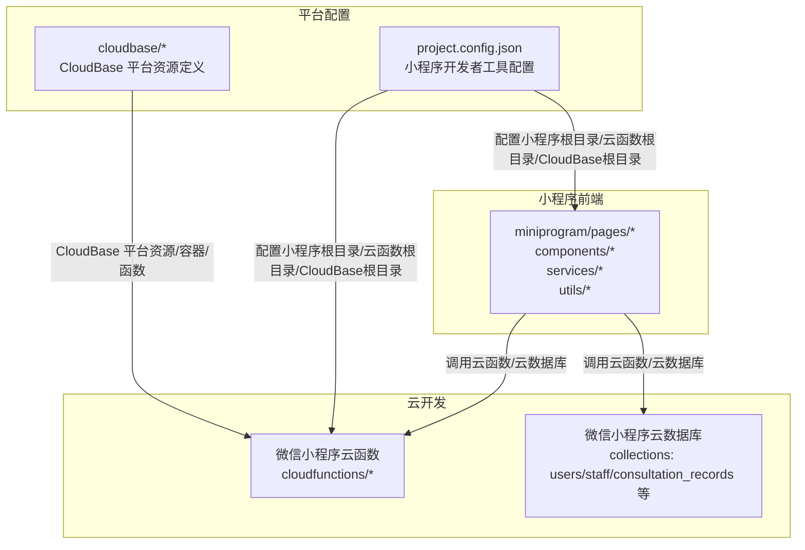
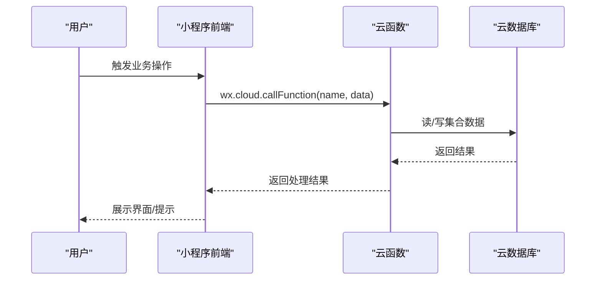
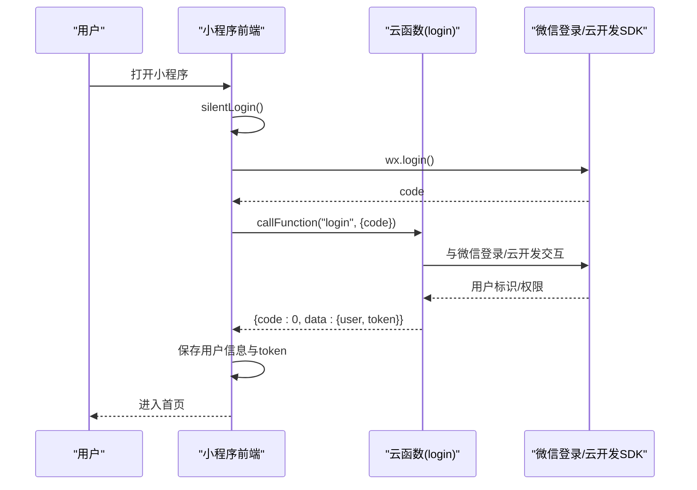
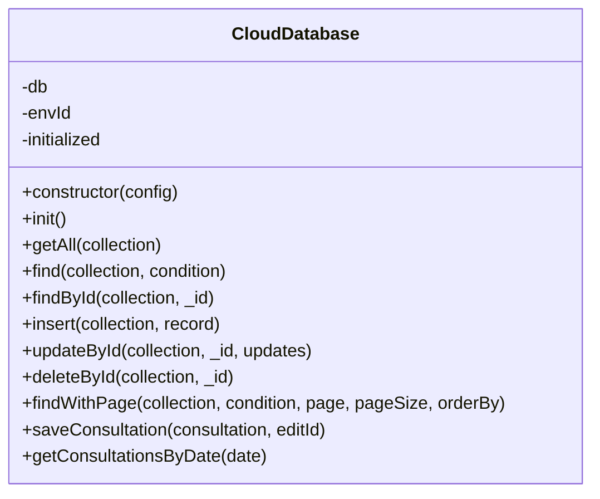
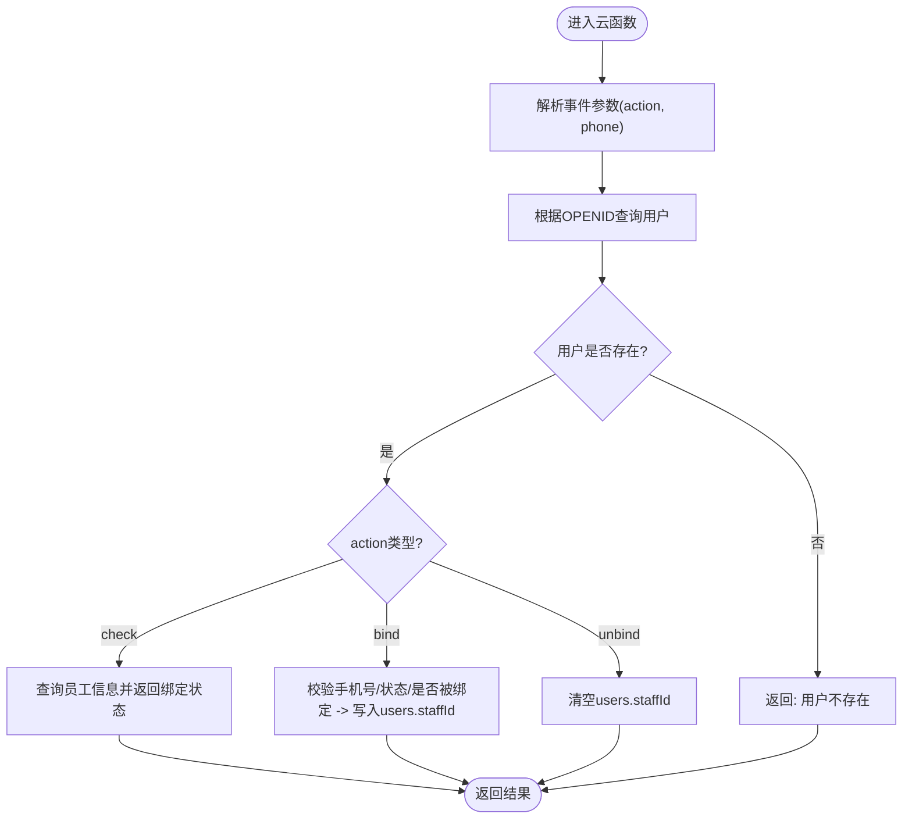
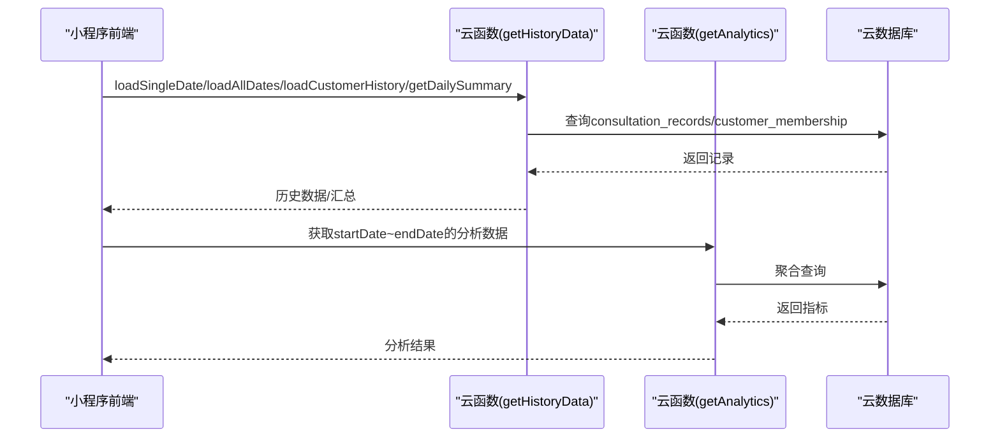
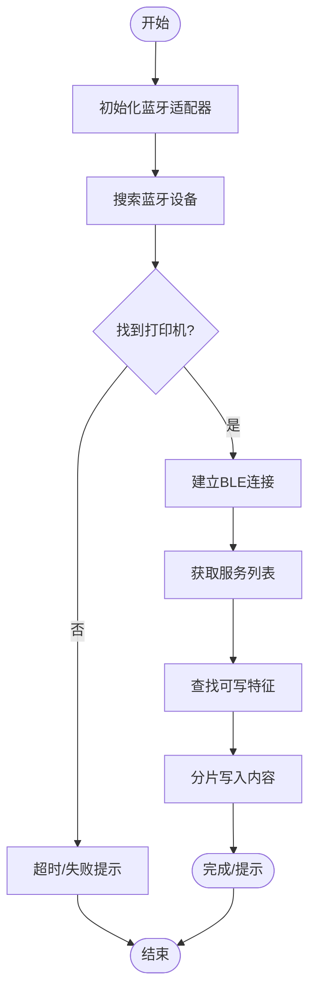
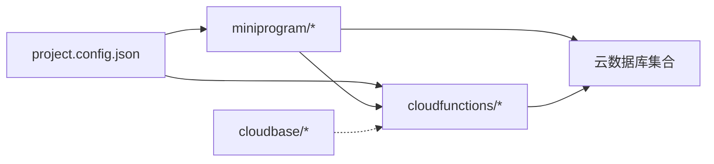

# 部署流程

<cite>
**本文引用的文件**
- [package.json](file://package.json)
- [project.config.json](file://project.config.json)
- [miniprogram/app.json](file://miniprogram/app.json)
- [miniprogram/utils/cloud-db.ts](file://miniprogram/utils/cloud-db.ts)
- [miniprogram/utils/auth.ts](file://miniprogram/utils/auth.ts)
- [miniprogram/services/printer-service.ts](file://miniprogram/services/printer-service.ts)
- [cloudfunctions/bindStaff/package.json](file://cloudfunctions/bindStaff/package.json)
- [cloudfunctions/bindStaff/index.js](file://cloudfunctions/bindStaff/index.js)
- [cloudfunctions/getAll/package.json](file://cloudfunctions/getAll/package.json)
- [cloudfunctions/getAll/index.js](file://cloudfunctions/getAll/index.js)
- [cloudfunctions/getAnalytics/index.js](file://cloudfunctions/getAnalytics/index.js)
- [cloudfunctions/getHistoryData/index.js](file://cloudfunctions/getHistoryData/index.js)
</cite>

## 目录
1. [简介](#简介)
2. [项目结构](#项目结构)
3. [核心组件](#核心组件)
4. [架构总览](#架构总览)
5. [详细组件分析](#详细组件分析)
6. [依赖关系分析](#依赖关系分析)
7. [性能考量](#性能考量)
8. [故障排查指南](#故障排查指南)
9. [结论](#结论)
10. [附录](#附录)

## 简介
本文件面向小程序项目的部署与运维团队，提供从本地开发到生产发布的完整部署操作手册。内容覆盖：
- 小程序前端构建与上传流程
- 云函数部署与依赖管理
- 数据库访问与调用链路
- 多环境部署策略（开发/测试/生产）
- 版本发布与回滚机制
- 自动化部署脚本建议
- 部署前检查清单与部署后验证
- 蓝绿/灰度发布思路
- 监控、健康检查与故障恢复
- 最佳实践与常见问题

## 项目结构
该项目采用“小程序前端 + 微信云开发 + 云函数”的典型架构。关键目录与职责如下：
- miniprogram：小程序前端源码，包含页面、组件、工具类、服务层等
- cloudfunctions：云函数目录，按功能拆分多个云函数
- cloudbase：CloudBase 平台相关配置与容器/函数资源定义（仓库中存在该目录但未包含具体文件）
- project.config.json：小程序开发者工具配置，声明小程序根目录、云开发开关、云函数根目录、CloudBase 根目录等
- package.json：前端工程脚本与依赖（用于代码规范与格式化）

图表来源
- [project.config.json](file://project.config.json#L1-L54)
- [miniprogram/app.json](file://miniprogram/app.json#L1-L35)

章节来源
- [project.config.json](file://project.config.json#L1-L54)
- [miniprogram/app.json](file://miniprogram/app.json#L1-L35)

## 核心组件
- 小程序前端：通过 wx.cloud 调用云函数与云数据库，封装了认证、数据库访问、打印服务等能力
- 云函数：提供用户绑定、全量数据拉取、历史数据统计、分析报表等业务逻辑
- 数据库：使用微信云开发数据库，集合包括 users、staff、consultation_records 等
- 平台配置：project.config.json 声明小程序根目录、云函数根目录、CloudBase 根目录；CloudBase 目录用于平台资源定义

章节来源
- [miniprogram/utils/auth.ts](file://miniprogram/utils/auth.ts#L1-L245)
- [miniprogram/utils/cloud-db.ts](file://miniprogram/utils/cloud-db.ts#L1-L321)
- [cloudfunctions/bindStaff/index.js](file://cloudfunctions/bindStaff/index.js#L1-L189)
- [cloudfunctions/getAll/index.js](file://cloudfunctions/getAll/index.js#L1-L59)
- [cloudfunctions/getAnalytics/index.js](file://cloudfunctions/getAnalytics/index.js#L1-L172)
- [cloudfunctions/getHistoryData/index.js](file://cloudfunctions/getHistoryData/index.js#L1-L411)
- [project.config.json](file://project.config.json#L1-L54)

## 架构总览
下图展示从用户操作到云函数与数据库的调用链路，以及 CloudBase 平台资源的参与位置。

图表来源
- [miniprogram/utils/auth.ts](file://miniprogram/utils/auth.ts#L97-L126)
- [miniprogram/utils/cloud-db.ts](file://miniprogram/utils/cloud-db.ts#L69-L88)
- [cloudfunctions/bindStaff/index.js](file://cloudfunctions/bindStaff/index.js#L10-L51)
- [cloudfunctions/getAll/index.js](file://cloudfunctions/getAll/index.js#L9-L58)

## 详细组件分析

### 组件一：认证与登录（云函数 + 前端）
- 前端通过 wx.cloud.callFunction 调用云函数完成静默登录、授权手机号、刷新用户信息、更新 staffId 等
- 云函数负责与微信登录接口交互、校验用户状态并返回 token 与用户信息
- 登录态持久化在本地存储，后续请求携带 token

图表来源
- [miniprogram/utils/auth.ts](file://miniprogram/utils/auth.ts#L78-L126)
- [cloudfunctions/bindStaff/index.js](file://cloudfunctions/bindStaff/index.js#L10-L51)

章节来源
- [miniprogram/utils/auth.ts](file://miniprogram/utils/auth.ts#L1-L245)
- [cloudfunctions/bindStaff/index.js](file://cloudfunctions/bindStaff/index.js#L1-L189)

### 组件二：数据库访问封装（前端）
- 提供 CloudDatabase 类，统一封装 getAll、find、findById、insert、update、delete、分页查询等
- 通过 wx.cloud.callFunction 调用 getAll 云函数实现突破前端 limit 的全量数据拉取
- 支持条件查询、分页、排序、保存咨询记录等

图表来源
- [miniprogram/utils/cloud-db.ts](file://miniprogram/utils/cloud-db.ts#L12-L321)

章节来源
- [miniprogram/utils/cloud-db.ts](file://miniprogram/utils/cloud-db.ts#L1-L321)
- [cloudfunctions/getAll/index.js](file://cloudfunctions/getAll/index.js#L1-L59)

### 组件三：技师绑定与员工管理（云函数）
- 支持 check、bind、unbind 三种动作
- 校验手机号格式、员工状态、是否被其他用户绑定等
- 更新 users 集合中的 staffId 字段

图表来源
- [cloudfunctions/bindStaff/index.js](file://cloudfunctions/bindStaff/index.js#L10-L189)

章节来源
- [cloudfunctions/bindStaff/index.js](file://cloudfunctions/bindStaff/index.js#L1-L189)
- [cloudfunctions/bindStaff/package.json](file://cloudfunctions/bindStaff/package.json#L1-L10)

### 组件四：历史数据与报表（云函数）
- getHistoryData：支持按日加载、按客户加载、按日汇总统计
- getAnalytics：按日期范围聚合收入、订单、性别分布、平台分布、会员卡销售等指标
- 两个函数均使用云数据库查询并返回聚合结果

图表来源
- [cloudfunctions/getHistoryData/index.js](file://cloudfunctions/getHistoryData/index.js#L88-L410)
- [cloudfunctions/getAnalytics/index.js](file://cloudfunctions/getAnalytics/index.js#L36-L171)

章节来源
- [cloudfunctions/getHistoryData/index.js](file://cloudfunctions/getHistoryData/index.js#L1-L411)
- [cloudfunctions/getAnalytics/index.js](file://cloudfunctions/getAnalytics/index.js#L1-L172)

### 组件五：蓝牙打印服务（前端）
- PrinterService 封装蓝牙打印机连接、服务发现、特征值写入、分片打印、断开连接
- 通过 gbk.js 对中文内容进行编码，按固定分片大小写入 BLE 特征值

图表来源
- [miniprogram/services/printer-service.ts](file://miniprogram/services/printer-service.ts#L31-L269)

章节来源
- [miniprogram/services/printer-service.ts](file://miniprogram/services/printer-service.ts#L1-L298)

## 依赖关系分析
- 小程序前端依赖 wx.cloud 与云函数/云数据库
- 云函数依赖 wx-server-sdk，并通过动态环境变量选择目标环境
- 项目配置文件 project.config.json 指定小程序根目录、云函数根目录、CloudBase 根目录
- CloudBase 目录用于平台资源定义（仓库中存在该目录但未包含具体文件）

图表来源
- [project.config.json](file://project.config.json#L1-L54)

章节来源
- [project.config.json](file://project.config.json#L1-L54)

## 性能考量
- 云函数冷启动：尽量减少依赖体积，避免在模块级做重计算；按需引入依赖
- 数据库查询：对高频查询建立索引；避免一次性拉取超大数据集；使用分页或 getAll 云函数替代前端 limit
- 前端渲染：组件化与按需加载；合理使用分页与懒加载
- 蓝牙打印：分片写入、适当延时；避免频繁连接/断开
- 缓存策略：前端本地缓存登录态与常用数据，降低重复请求

## 故障排查指南
- 登录失败
  - 检查云函数返回的 code/message
  - 确认 wx.login 是否成功获取 code
  - 核对云函数环境变量与权限
- 数据查询异常
  - 检查集合是否存在、字段是否正确
  - 使用 getAll 云函数验证全量数据拉取
- 蓝牙打印失败
  - 确认蓝牙适配器初始化成功
  - 确认服务与特征值存在且具备 write 权限
  - 检查分片大小与延时设置
- CloudBase 资源异常
  - 检查 cloudbase 目录下的资源定义与平台状态
  - 核对函数与容器的运行日志

章节来源
- [miniprogram/utils/auth.ts](file://miniprogram/utils/auth.ts#L97-L126)
- [cloudfunctions/bindStaff/index.js](file://cloudfunctions/bindStaff/index.js#L15-L50)
- [cloudfunctions/getAll/index.js](file://cloudfunctions/getAll/index.js#L19-L57)
- [miniprogram/services/printer-service.ts](file://miniprogram/services/printer-service.ts#L31-L180)

## 结论
本项目采用标准的小程序 + 云开发 + 云函数架构，具备清晰的前后端职责划分与可扩展的数据访问层。通过合理的多环境配置、云函数与数据库的配合，以及 CloudBase 平台资源管理，能够支撑从小规模到中等规模的业务部署。建议结合自动化脚本、监控告警与灰度发布策略，进一步提升交付效率与系统稳定性。

## 附录

### 部署流程总览（本地 → 生产）
- 本地开发
  - 修改前端代码与云函数
  - 在开发者工具中预览与调试
- 构建与上传
  - 小程序前端：在开发者工具中上传代码
  - 云函数：在开发者工具中上传云函数
- 环境切换
  - 通过云函数环境变量选择目标环境
  - 通过 project.config.json 指定不同环境的配置
- 发布与回滚
  - 以版本号管理发布；出现问题回滚至上一稳定版本
- 监控与健康检查
  - 关注云函数耗时、错误率、数据库慢查询
  - 前端埋点与用户反馈收集

### 多环境部署策略
- 开发环境：最小权限、快速迭代
- 测试环境：与生产隔离，模拟真实数据
- 生产环境：严格权限控制、只读备份策略

### 版本发布与回滚
- 版本号管理：语义化版本或日期版本
- 回滚策略：保留最近 N 个版本，一键回滚
- 变更记录：每次发布记录变更点与影响面

### 自动化部署脚本（建议）
- 前端上传：开发者工具命令行上传小程序代码
- 云函数上传：开发者工具命令行上传云函数
- CloudBase 资源：使用平台 CLI 或 Terraform 管理资源
- 钩子：Git 提交触发 CI/CD，自动执行上述步骤

### 部署前检查清单
- 代码质量：通过 ESLint/Prettier 校验
- 云函数依赖：package.json 已更新，依赖安装完成
- 数据库权限：集合读写权限与索引满足需求
- 环境变量：云函数环境变量正确
- CloudBase 资源：容器/函数资源定义正确

### 部署后验证
- 功能验证：登录、绑定、历史查询、报表查看
- 性能验证：首屏加载、云函数响应时间
- 安全验证：鉴权、敏感数据访问控制
- 监控验证：日志、指标、告警

### 蓝绿/灰度发布
- 蓝绿：两套环境并行，流量切换
- 灰度：按用户/地区/设备比例逐步放量
- 云函数：通过环境变量或路由规则分流

### 监控、健康检查与故障恢复
- 监控：云函数耗时/错误率、数据库慢查询、前端崩溃率
- 健康检查：定时任务扫描关键接口可用性
- 故障恢复：自动重试、熔断降级、快速回滚