# 云开发集成架构

<cite>
**本文档引用的文件**
- [cloudfunctions/getAll/index.js](file://cloudfunctions/getAll/index.js)
- [cloudfunctions/login/index.js](file://cloudfunctions/login/index.js)
- [cloudfunctions/getAnalytics/index.js](file://cloudfunctions/getAnalytics/index.js)
- [cloudfunctions/getAvailableTechnicians/index.js](file://cloudfunctions/getAvailableTechnicians/index.js)
- [cloudfunctions/matchCustomer/index.js](file://cloudfunctions/matchCustomer/index.js)
- [cloudfunctions/manageRotation/index.js](file://cloudfunctions/manageRotation/index.js)
- [cloudfunctions/sendWechatMessage/index.js](file://cloudfunctions/sendWechatMessage/index.js)
- [miniprogram/utils/cloud-db.ts](file://miniprogram/utils/cloud-db.ts)
- [miniprogram/utils/auth.ts](file://miniprogram/utils/auth.ts)
- [miniprogram/app.ts](file://miniprogram/app.ts)
- [miniprogram/pages/index/index.ts](file://miniprogram/pages/index/index.ts)
- [miniprogram/config/index.ts](file://miniprogram/config/index.ts)
- [miniprogram/utils/permission.ts](file://miniprogram/utils/permission.ts)
- [project.config.json](file://project.config.json)
</cite>

## 目录
1. [简介](#简介)
2. [项目结构](#项目结构)
3. [核心组件](#核心组件)
4. [架构总览](#架构总览)
5. [详细组件分析](#详细组件分析)
6. [依赖关系分析](#依赖关系分析)
7. [性能考虑](#性能考虑)
8. [故障排查指南](#故障排查指南)
9. [结论](#结论)
10. [附录](#附录)

## 简介
本项目基于 CloudBase 平台构建，采用小程序前端 + 云函数 + 云数据库的三层架构。通过云函数实现业务逻辑与数据访问，前端通过 wx.cloud.callFunction 调用云函数，实现登录认证、数据查询、统计分析、技师排班与轮牌管理、客户匹配等核心功能。云存储用于静态资源托管，企业微信机器人用于消息推送。

## 项目结构
项目采用分层组织：小程序前端位于 miniprogram 目录，云函数位于 cloudfunctions 目录，CloudBase 配置位于 cloudbase 目录。项目配置文件 project.config.json 指定小程序根目录、云函数根目录与 CloudBase 根目录。

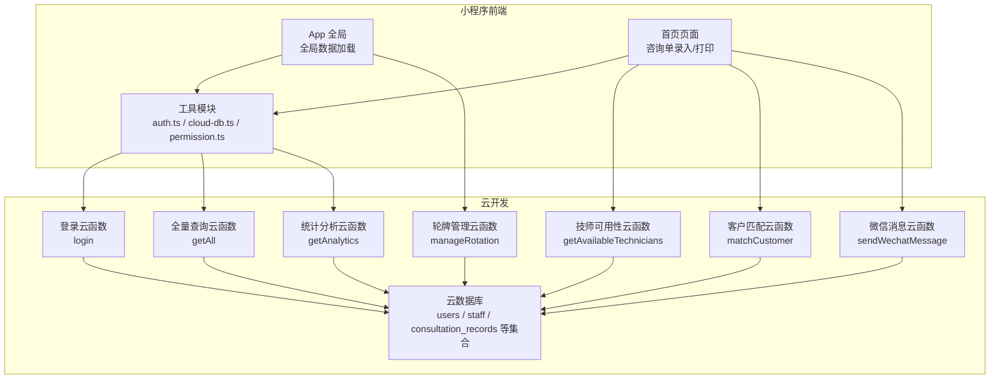

**图表来源**
- [project.config.json](file://project.config.json#L1-L54)
- [miniprogram/app.ts](file://miniprogram/app.ts#L1-L191)
- [miniprogram/pages/index/index.ts](file://miniprogram/pages/index/index.ts#L1-L735)
- [miniprogram/utils/auth.ts](file://miniprogram/utils/auth.ts#L1-L245)
- [miniprogram/utils/cloud-db.ts](file://miniprogram/utils/cloud-db.ts#L1-L321)
- [cloudfunctions/login/index.js](file://cloudfunctions/login/index.js#L1-L180)
- [cloudfunctions/getAll/index.js](file://cloudfunctions/getAll/index.js#L1-L59)
- [cloudfunctions/getAnalytics/index.js](file://cloudfunctions/getAnalytics/index.js#L1-L172)
- [cloudfunctions/getAvailableTechnicians/index.js](file://cloudfunctions/getAvailableTechnicians/index.js#L1-L285)
- [cloudfunctions/matchCustomer/index.js](file://cloudfunctions/matchCustomer/index.js#L1-L71)
- [cloudfunctions/manageRotation/index.js](file://cloudfunctions/manageRotation/index.js#L1-L327)
- [cloudfunctions/sendWechatMessage/index.js](file://cloudfunctions/sendWechatMessage/index.js#L1-L65)

**章节来源**
- [project.config.json](file://project.config.json#L1-L54)

## 核心组件
- 小程序前端：负责用户交互、页面导航、权限校验与云函数调用。
- 云函数：提供登录认证、数据查询、统计分析、技师排班与轮牌管理、客户匹配、消息推送等业务能力。
- 云数据库：存储用户、员工、咨询单、预约、轮牌队列等业务数据。
- 云存储：用于静态资源托管（如图片、字体等）。

**章节来源**
- [miniprogram/utils/auth.ts](file://miniprogram/utils/auth.ts#L1-L245)
- [miniprogram/utils/cloud-db.ts](file://miniprogram/utils/cloud-db.ts#L1-L321)
- [cloudfunctions/login/index.js](file://cloudfunctions/login/index.js#L1-L180)
- [cloudfunctions/getAll/index.js](file://cloudfunctions/getAll/index.js#L1-L59)
- [cloudfunctions/getAnalytics/index.js](file://cloudfunctions/getAnalytics/index.js#L1-L172)
- [cloudfunctions/getAvailableTechnicians/index.js](file://cloudfunctions/getAvailableTechnicians/index.js#L1-L285)
- [cloudfunctions/matchCustomer/index.js](file://cloudfunctions/matchCustomer/index.js#L1-L71)
- [cloudfunctions/manageRotation/index.js](file://cloudfunctions/manageRotation/index.js#L1-L327)
- [cloudfunctions/sendWechatMessage/index.js](file://cloudfunctions/sendWechatMessage/index.js#L1-L65)

## 架构总览
系统采用“前端直连云函数”的轻量级后端架构。小程序通过 wx.cloud.init 初始化环境，随后通过 wx.cloud.callFunction 调用对应云函数，云函数使用 wx-server-sdk 连接云数据库执行 CRUD 操作，并返回标准化结果对象。

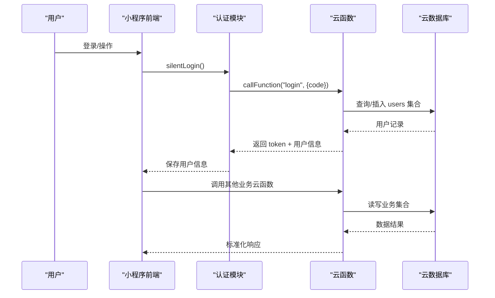

**图表来源**
- [miniprogram/utils/auth.ts](file://miniprogram/utils/auth.ts#L78-L126)
- [cloudfunctions/login/index.js](file://cloudfunctions/login/index.js#L11-L90)
- [cloudfunctions/getAll/index.js](file://cloudfunctions/getAll/index.js#L9-L58)
- [cloudfunctions/getAnalytics/index.js](file://cloudfunctions/getAnalytics/index.js#L36-L51)

## 详细组件分析

### 认证与会话管理
- 小程序启动时通过 AuthManager.silentLogin() 静默登录，内部调用 wx.cloud.callFunction("login") 获取 token 并持久化。
- 支持刷新用户信息、更新 staffId、登出等操作。
- 权限控制通过角色映射实现页面与按钮级别的访问控制。

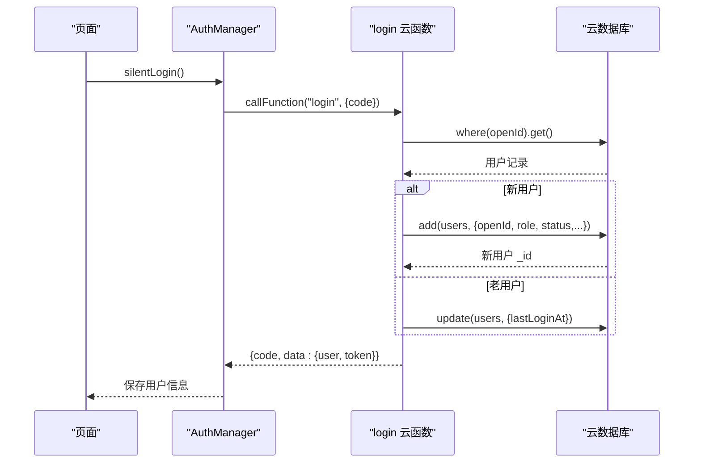

**图表来源**
- [miniprogram/utils/auth.ts](file://miniprogram/utils/auth.ts#L78-L126)
- [cloudfunctions/login/index.js](file://cloudfunctions/login/index.js#L11-L90)

**章节来源**
- [miniprogram/utils/auth.ts](file://miniprogram/utils/auth.ts#L1-L245)
- [cloudfunctions/login/index.js](file://cloudfunctions/login/index.js#L1-L180)

### 数据访问层封装
- CloudDatabase 提供统一的数据访问接口，封装 getAll/find/findOne/insert/updateById/deleteById/findWithPage/saveConsultation 等方法。
- 对于大集合的全量查询，getAll 通过分页游标方式遍历，避免一次性拉取过多数据。
- 支持本地过滤与远程过滤两种模式，提高灵活性。

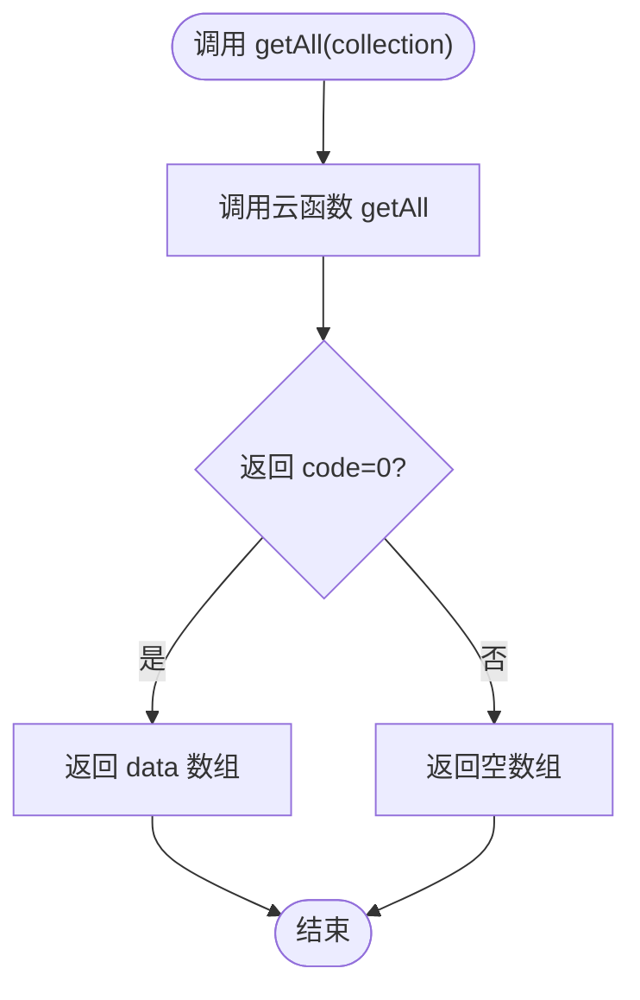

**图表来源**
- [miniprogram/utils/cloud-db.ts](file://miniprogram/utils/cloud-db.ts#L69-L88)
- [cloudfunctions/getAll/index.js](file://cloudfunctions/getAll/index.js#L9-L58)

**章节来源**
- [miniprogram/utils/cloud-db.ts](file://miniprogram/utils/cloud-db.ts#L1-L321)
- [cloudfunctions/getAll/index.js](file://cloudfunctions/getAll/index.js#L1-L59)

### 统计分析与报表
- getAnalytics 云函数按日期范围聚合咨询单与会员卡数据，计算日收入趋势、项目消费排行、平台消费分布、性别与车辆分布等指标。
- 使用日期区间生成器与条件查询，确保跨天统计的准确性。

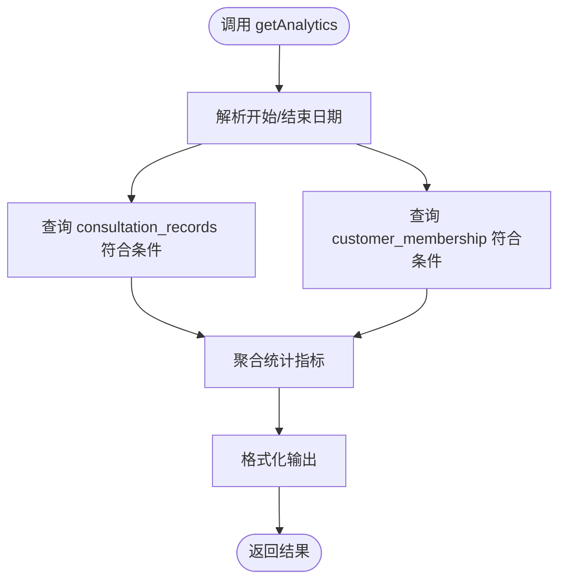

**图表来源**
- [cloudfunctions/getAnalytics/index.js](file://cloudfunctions/getAnalytics/index.js#L36-L171)

**章节来源**
- [cloudfunctions/getAnalytics/index.js](file://cloudfunctions/getAnalytics/index.js#L1-L172)

### 技师排班与可用性
- getAvailableTechnicians 云函数结合预约、排班、轮牌队列与今日咨询单，计算技师的占用情况与可用时间段。
- 支持模式切换：availability 模式返回当日技师状态；普通模式返回可匹配技师列表。

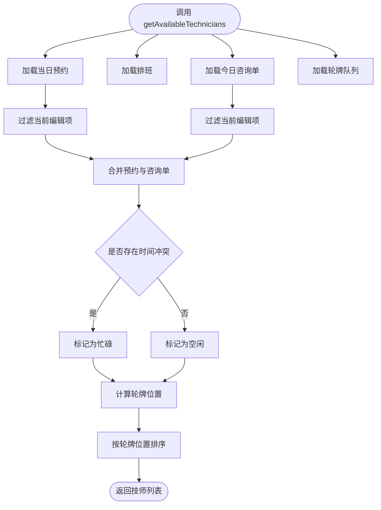

**图表来源**
- [cloudfunctions/getAvailableTechnicians/index.js](file://cloudfunctions/getAvailableTechnicians/index.js#L9-L124)

**章节来源**
- [cloudfunctions/getAvailableTechnicians/index.js](file://cloudfunctions/getAvailableTechnicians/index.js#L1-L285)

### 客户匹配与去重
- matchCustomer 云函数对客户集合进行评分匹配，支持按手机号前缀匹配、姓名包含匹配与性别后缀匹配，返回最佳匹配结果。

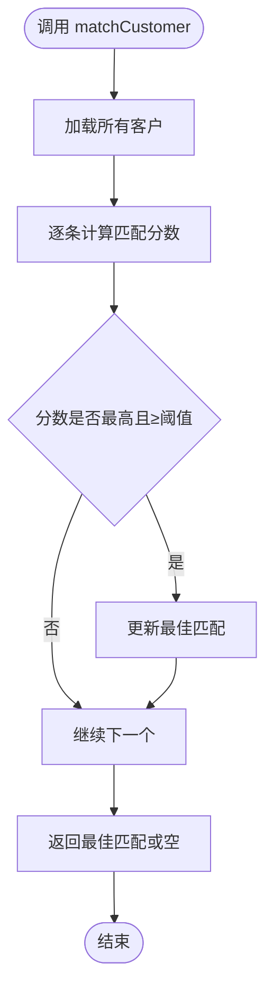

**图表来源**
- [cloudfunctions/matchCustomer/index.js](file://cloudfunctions/matchCustomer/index.js#L20-L70)

**章节来源**
- [cloudfunctions/matchCustomer/index.js](file://cloudfunctions/matchCustomer/index.js#L1-L71)

### 轮牌队列管理
- manageRotation 云函数提供轮牌初始化、获取下一技师、服务完成推进、调整位置等功能，支持优先级计算与昨日轮牌延续。

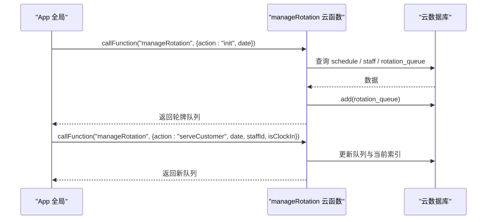

**图表来源**
- [miniprogram/app.ts](file://miniprogram/app.ts#L110-L189)
- [cloudfunctions/manageRotation/index.js](file://cloudfunctions/manageRotation/index.js#L9-L36)

**章节来源**
- [miniprogram/app.ts](file://miniprogram/app.ts#L1-L191)
- [cloudfunctions/manageRotation/index.js](file://cloudfunctions/manageRotation/index.js#L1-L327)

### 微信消息推送
- sendWechatMessage 云函数通过企业微信 Webhook 推送 Markdown 消息，便于运营告警与通知。

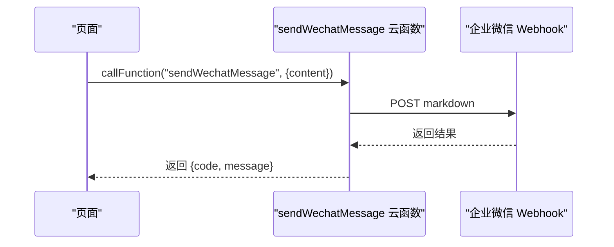

**图表来源**
- [miniprogram/pages/index/index.ts](file://miniprogram/pages/index/index.ts#L714-L733)
- [cloudfunctions/sendWechatMessage/index.js](file://cloudfunctions/sendWechatMessage/index.js#L10-L64)

**章节来源**
- [miniprogram/pages/index/index.ts](file://miniprogram/pages/index/index.ts#L1-L735)
- [cloudfunctions/sendWechatMessage/index.js](file://cloudfunctions/sendWechatMessage/index.js#L1-L65)

### 权限控制与安全模型
- 角色权限映射：admin、cashier、technician、viewer 四种角色，分别映射到页面与按钮权限。
- 页面级权限：canAccessXxx 控制页面访问；按钮级权限：canXxx 控制具体操作。
- 安全模型：前端通过 wx.cloud.callFunction 调用云函数，云函数通过 wx-server-sdk 访问数据库，遵循 CloudBase 默认权限策略；建议在生产环境配置更严格的集合权限与云函数访问控制。

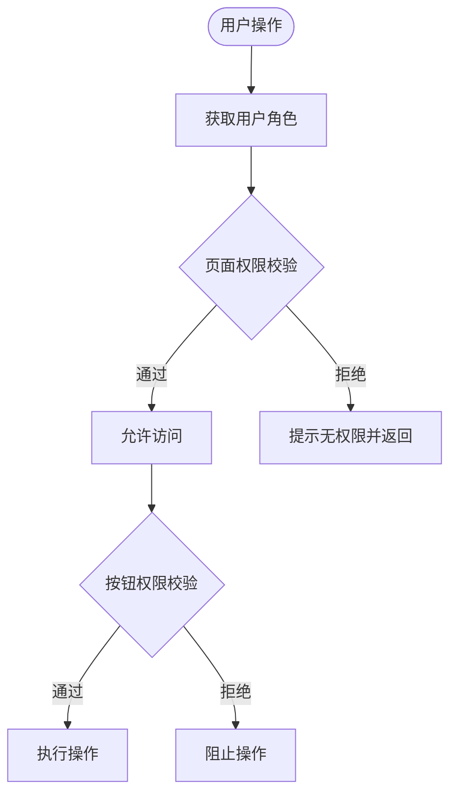

**图表来源**
- [miniprogram/utils/permission.ts](file://miniprogram/utils/permission.ts#L149-L173)

**章节来源**
- [miniprogram/utils/permission.ts](file://miniprogram/utils/permission.ts#L1-L194)

## 依赖关系分析
- 前端依赖：miniprogram/utils/cloud-db.ts 与 miniprogram/utils/auth.ts 作为核心依赖，分别负责数据访问与认证。
- 云函数依赖：各云函数通过 wx-server-sdk 访问云数据库，部分函数依赖第三方库（如 sendWechatMessage 使用 request-promise）。
- 配置依赖：project.config.json 指定小程序根目录、云函数根目录与 CloudBase 根目录，确保 IDE 识别正确。

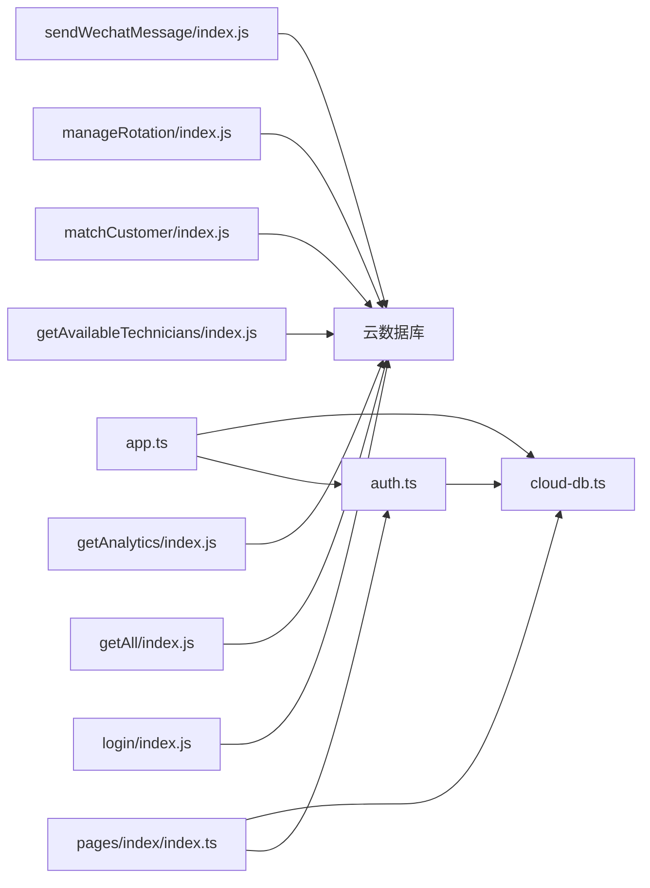

**图表来源**
- [miniprogram/utils/auth.ts](file://miniprogram/utils/auth.ts#L1-L245)
- [miniprogram/utils/cloud-db.ts](file://miniprogram/utils/cloud-db.ts#L1-L321)
- [miniprogram/pages/index/index.ts](file://miniprogram/pages/index/index.ts#L1-L735)
- [miniprogram/app.ts](file://miniprogram/app.ts#L1-L191)
- [cloudfunctions/login/index.js](file://cloudfunctions/login/index.js#L1-L180)
- [cloudfunctions/getAll/index.js](file://cloudfunctions/getAll/index.js#L1-L59)
- [cloudfunctions/getAnalytics/index.js](file://cloudfunctions/getAnalytics/index.js#L1-L172)
- [cloudfunctions/getAvailableTechnicians/index.js](file://cloudfunctions/getAvailableTechnicians/index.js#L1-L285)
- [cloudfunctions/matchCustomer/index.js](file://cloudfunctions/matchCustomer/index.js#L1-L71)
- [cloudfunctions/manageRotation/index.js](file://cloudfunctions/manageRotation/index.js#L1-L327)
- [cloudfunctions/sendWechatMessage/index.js](file://cloudfunctions/sendWechatMessage/index.js#L1-L65)

**章节来源**
- [project.config.json](file://project.config.json#L1-L54)

## 性能考虑
- 分页与游标：getAll 使用固定 MAX_LIMIT 与 lastId 游标分页，避免一次性拉取大量数据导致超时。
- 并发查询：App 全局数据加载使用 Promise.all 并行请求多个集合，提升首屏加载速度。
- 条件查询：云函数中尽量使用 where + 索引字段查询，减少全表扫描。
- 缓存策略：前端可对常用配置（项目、房间、精油、员工）进行内存缓存，减少重复请求。
- 异步处理：轮牌推进与预约重新分配等操作采用异步执行，避免阻塞主流程。

## 故障排查指南
- 登录失败：检查 wx.login() 是否成功获取 code，确认云函数 login 的 action 参数与用户 openId 是否正确。
- 数据查询异常：确认集合名称与查询条件，查看 getAll 的返回码与 message 字段。
- 统计分析异常：核对日期格式与范围，检查 getAnalytics 中的日期区间生成与条件查询。
- 技师可用性异常：检查预约、排班、轮牌队列与今日咨询单数据一致性。
- 轮牌推进异常：确认日期参数与 staffId 是否存在，检查队列初始化状态。
- 消息推送失败：检查企业微信 Webhook 地址与请求体格式，查看返回的 errcode/errmsg。

**章节来源**
- [cloudfunctions/login/index.js](file://cloudfunctions/login/index.js#L22-L89)
- [cloudfunctions/getAll/index.js](file://cloudfunctions/getAll/index.js#L12-L57)
- [cloudfunctions/getAnalytics/index.js](file://cloudfunctions/getAnalytics/index.js#L22-L50)
- [cloudfunctions/getAvailableTechnicians/index.js](file://cloudfunctions/getAvailableTechnicians/index.js#L16-L123)
- [cloudfunctions/manageRotation/index.js](file://cloudfunctions/manageRotation/index.js#L13-L35)
- [cloudfunctions/sendWechatMessage/index.js](file://cloudfunctions/sendWechatMessage/index.js#L13-L63)

## 结论
本项目通过 CloudBase 实现了从认证、数据访问到业务逻辑的完整闭环。前端以云函数为中心进行数据交互，云函数统一管理数据库访问与业务规则，具备良好的扩展性与维护性。建议在生产环境中进一步完善权限控制、监控告警与错误追踪体系，确保系统的稳定性与安全性。

## 附录
- 环境配置：通过 miniprogram/config/index.ts 设置云环境 ID，确保前端与后端环境一致。
- 部署结构：project.config.json 指定小程序根目录、云函数根目录与 CloudBase 根目录，IDE 与构建工具据此识别资源。

**章节来源**
- [miniprogram/config/index.ts](file://miniprogram/config/index.ts#L1-L18)
- [project.config.json](file://project.config.json#L1-L54)