# Profile页面增强功能

<cite>
**本文档引用的文件**
- [miniprogram/pages/profile/profile.ts](file://miniprogram/pages/profile/profile.ts)
- [miniprogram/pages/profile/profile.wxml](file://miniprogram/pages/profile/profile.wxml)
- [miniprogram/pages/profile/profile.json](file://miniprogram/pages/profile/profile.json)
- [miniprogram/pages/profile/profile.less](file://miniprogram/pages/profile/profile.less)
- [miniprogram/services/reservation.service.ts](file://miniprogram/services/reservation.service.ts)
- [miniprogram/utils/cloud-db.ts](file://miniprogram/utils/cloud-db.ts)
- [miniprogram/utils/util.ts](file://miniprogram/utils/util.ts)
- [miniprogram/utils/auth.ts](file://miniprogram/utils/auth.ts)
- [miniprogram/app.ts](file://miniprogram/app.ts)
- [cloudfunctions/manageRotation/index.js](file://cloudfunctions/manageRotation/index.js)
- [cloudfunctions/getAvailableTechnicians/index.js](file://cloudfunctions/getAvailableTechnicians/index.js)
- [miniprogram/components/timeline/timeline.ts](file://miniprogram/components/timeline/timeline.ts)
- [miniprogram/components/reservation-modal/reservation-modal.ts](file://miniprogram/components/reservation-modal/reservation-modal.ts)
</cite>

## 目录
1. [简介](#简介)
2. [项目结构概览](#项目结构概览)
3. [核心功能模块](#核心功能模块)
4. [架构设计](#架构设计)
5. [详细功能分析](#详细功能分析)
6. [数据流分析](#数据流分析)
7. [性能优化考虑](#性能优化考虑)
8. [故障排除指南](#故障排除指南)
9. [总结](#总结)

## 简介

Profile页面是咨询管理系统中的核心个人工作界面，为技师提供全面的工作信息展示和预约管理功能。该页面集成了排班进度可视化、业绩统计、房间状态监控、预约创建等关键功能，通过现代化的UI设计和高效的业务逻辑，提升了技师的工作效率和用户体验。

## 项目结构概览

该系统采用微信小程序的标准目录结构，主要分为以下几个层次：

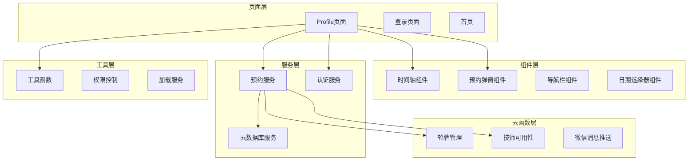

**图表来源**
- [miniprogram/pages/profile/profile.ts](file://miniprogram/pages/profile/profile.ts#L1-L614)
- [miniprogram/services/reservation.service.ts](file://miniprogram/services/reservation.service.ts#L1-L568)

**章节来源**
- [miniprogram/pages/profile/profile.ts](file://miniprogram/pages/profile/profile.ts#L1-L614)
- [miniprogram/pages/profile/profile.wxml](file://miniprogram/pages/profile/profile.wxml#L1-L162)

## 核心功能模块

### 1. 排班进度可视化

Profile页面的核心功能之一是提供直观的排班进度展示。通过时间轴组件，技师可以清晰地看到自己的工作安排和当前状态。

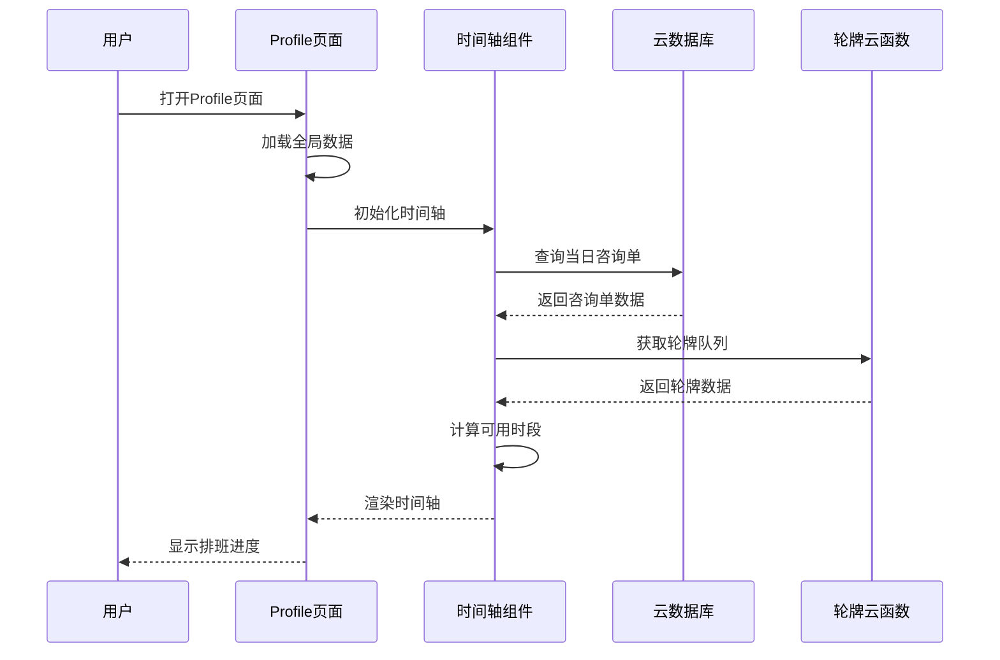

**图表来源**
- [miniprogram/components/timeline/timeline.ts](file://miniprogram/components/timeline/timeline.ts#L100-L228)
- [cloudfunctions/manageRotation/index.js](file://cloudfunctions/manageRotation/index.js#L255-L279)

### 2. 业绩统计分析

系统提供详细的业绩统计功能，包括单量、提成、点钟、加班等关键指标的实时计算和展示。

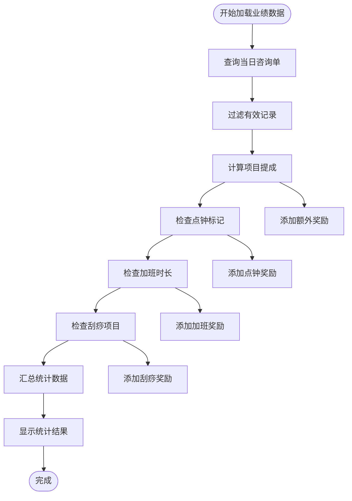

**图表来源**
- [miniprogram/pages/profile/profile.ts](file://miniprogram/pages/profile/profile.ts#L210-L296)

### 3. 预约管理系统

集成化的预约管理功能支持多种预约模式，包括特定技师预约和性别需求预约。

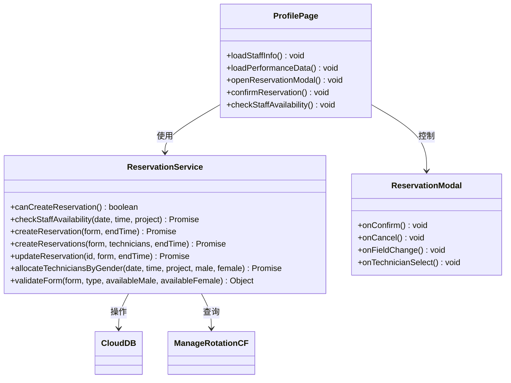

**图表来源**
- [miniprogram/services/reservation.service.ts](file://miniprogram/services/reservation.service.ts#L196-L567)
- [miniprogram/pages/profile/profile.ts](file://miniprogram/pages/profile/profile.ts#L343-L578)

**章节来源**
- [miniprogram/pages/profile/profile.ts](file://miniprogram/pages/profile/profile.ts#L19-L100)
- [miniprogram/services/reservation.service.ts](file://miniprogram/services/reservation.service.ts#L1-L568)

## 架构设计

### 1. 分层架构

系统采用清晰的分层架构设计，确保各层职责明确，便于维护和扩展：

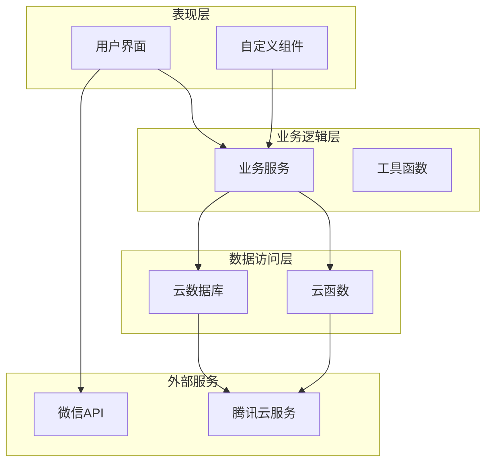

**图表来源**
- [miniprogram/app.ts](file://miniprogram/app.ts#L1-L232)
- [miniprogram/utils/cloud-db.ts](file://miniprogram/utils/cloud-db.ts#L1-L323)

### 2. 数据模型

系统使用标准化的数据模型来管理各种业务实体：

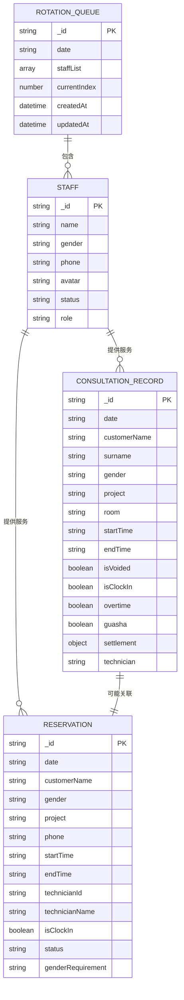

**图表来源**
- [miniprogram/utils/cloud-db.ts](file://miniprogram/utils/cloud-db.ts#L303-L323)

**章节来源**
- [miniprogram/utils/cloud-db.ts](file://miniprogram/utils/cloud-db.ts#L1-L323)

## 详细功能分析

### 1. 登录认证机制

系统采用静默登录和令牌管理相结合的方式，确保用户身份的安全性和连续性。

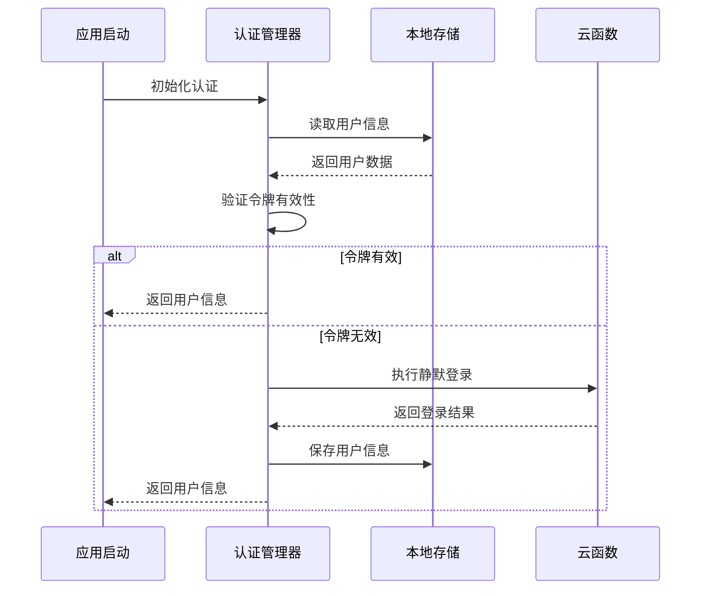

**图表来源**
- [miniprogram/utils/auth.ts](file://miniprogram/utils/auth.ts#L80-L128)

### 2. 全局数据管理

应用级别的全局数据管理确保了跨页面数据的一致性和高效访问。

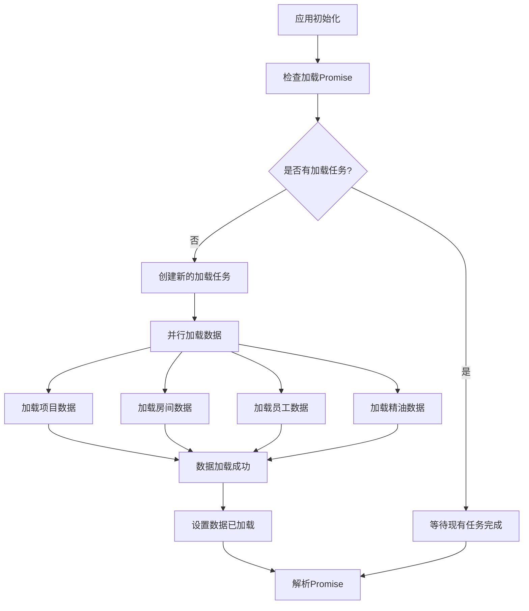

**图表来源**
- [miniprogram/app.ts](file://miniprogram/app.ts#L81-L107)

**章节来源**
- [miniprogram/utils/auth.ts](file://miniprogram/utils/auth.ts#L1-L247)
- [miniprogram/app.ts](file://miniprogram/app.ts#L1-L232)

### 3. 预约流程管理

预约系统支持复杂的业务场景，包括多种预约模式和冲突检测。

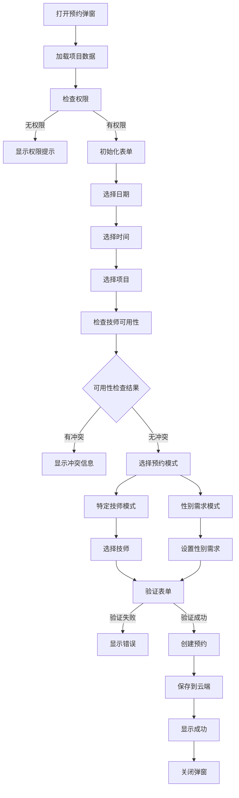

**图表来源**
- [miniprogram/pages/profile/profile.ts](file://miniprogram/pages/profile/profile.ts#L346-L534)
- [miniprogram/services/reservation.service.ts](file://miniprogram/services/reservation.service.ts#L281-L316)

**章节来源**
- [miniprogram/pages/profile/profile.ts](file://miniprogram/pages/profile/profile.ts#L343-L578)
- [miniprogram/services/reservation.service.ts](file://miniprogram/services/reservation.service.ts#L1-L568)

## 数据流分析

### 1. 实时数据同步

系统通过云函数实现数据的实时同步和一致性保证：

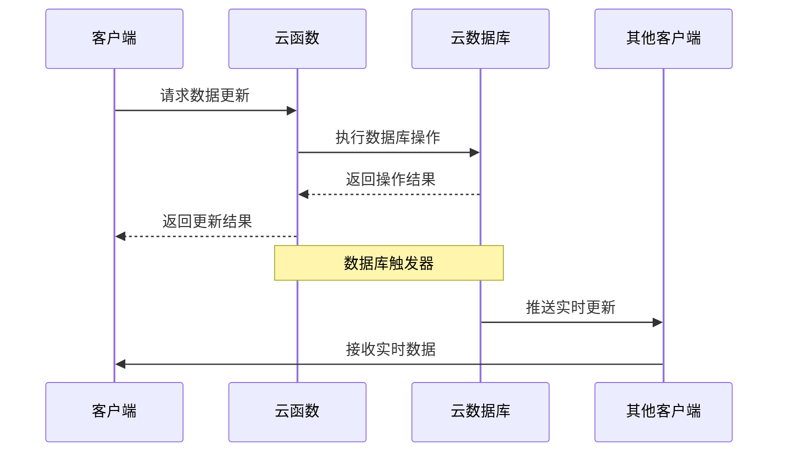

**图表来源**
- [cloudfunctions/manageRotation/index.js](file://cloudfunctions/manageRotation/index.js#L12-L36)
- [miniprogram/utils/cloud-db.ts](file://miniprogram/utils/cloud-db.ts#L136-L188)

### 2. 缓存策略

系统采用多层次缓存策略来提升性能和用户体验：

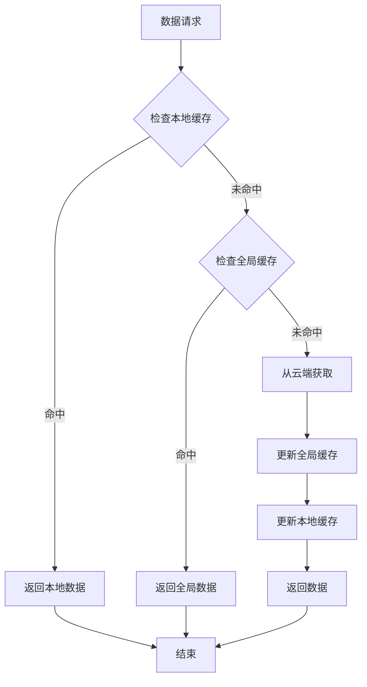

**图表来源**
- [miniprogram/app.ts](file://miniprogram/app.ts#L81-L107)

**章节来源**
- [miniprogram/utils/cloud-db.ts](file://miniprogram/utils/cloud-db.ts#L69-L88)
- [miniprogram/app.ts](file://miniprogram/app.ts#L81-L107)

## 性能优化考虑

### 1. 异步加载优化

系统采用异步加载和并行处理技术来提升响应速度：

- **并行数据加载**：使用Promise.all同时加载多个数据源
- **懒加载策略**：按需加载非关键数据
- **缓存机制**：实现多级缓存减少重复请求

### 2. 内存管理

- **及时释放资源**：组件销毁时清理定时器和监听器
- **数据分页**：大量数据采用分页加载
- **虚拟滚动**：长列表采用虚拟滚动技术

### 3. 网络优化

- **请求去重**：避免重复发送相同请求
- **错误重试**：网络异常时自动重试
- **离线支持**：部分数据支持离线缓存

## 故障排除指南

### 1. 常见问题及解决方案

| 问题类型 | 症状描述 | 可能原因 | 解决方案 |
|---------|---------|---------|---------|
| 登录失败 | 无法进入应用 | 网络连接问题 | 检查网络状态，重新登录 |
| 数据加载失败 | 页面空白或加载缓慢 | 云函数异常 | 重启云函数，检查数据库连接 |
| 预约冲突 | 无法创建预约 | 技师时间冲突 | 检查技师可用性，调整时间 |
| 权限不足 | 功能不可用 | 用户角色限制 | 联系管理员提升权限 |

### 2. 调试技巧

- **启用调试模式**：在开发工具中启用调试模式查看详细日志
- **网络请求监控**：使用开发者工具监控网络请求
- **数据断点**：在关键数据节点设置断点观察数据变化

**章节来源**
- [miniprogram/utils/auth.ts](file://miniprogram/utils/auth.ts#L226-L247)
- [miniprogram/pages/profile/profile.ts](file://miniprogram/pages/profile/profile.ts#L135-L141)

## 总结

Profile页面作为咨询管理系统的核心界面，展现了现代小程序开发的最佳实践。通过精心设计的架构、完善的业务逻辑和优秀的用户体验，该系统为技师提供了高效、便捷的工作平台。

### 主要优势

1. **功能完整性**：涵盖了技师工作的各个方面，从排班到业绩统计
2. **用户体验优秀**：直观的界面设计和流畅的操作体验
3. **技术架构先进**：采用分层架构和微服务设计原则
4. **性能优化到位**：通过多种优化技术确保系统性能

### 发展方向

1. **智能化推荐**：基于历史数据为技师提供工作建议
2. **移动端优化**：进一步优化移动端的交互体验
3. **数据分析增强**：提供更深入的业务洞察和预测分析
4. **集成扩展**：与其他业务系统的深度集成

该系统为类似的企业管理应用提供了优秀的参考模板，其设计理念和技术实现值得其他项目借鉴和学习。