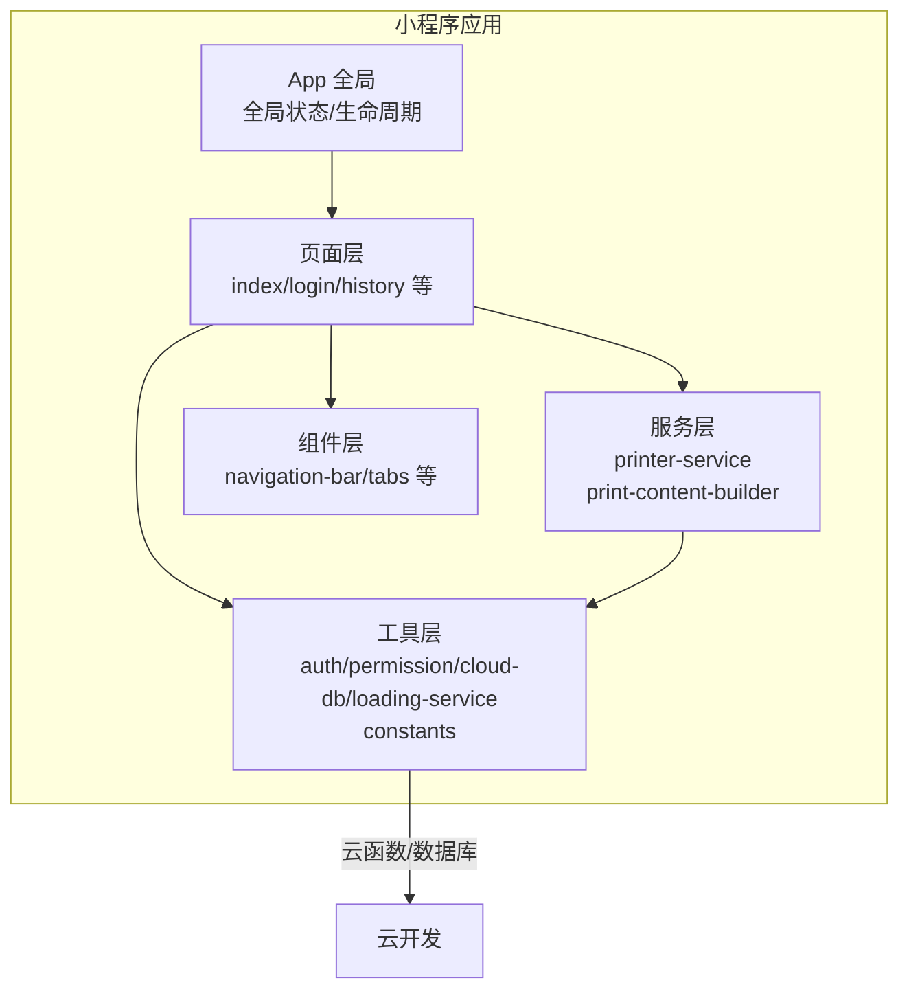
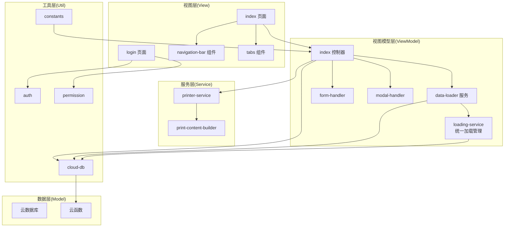
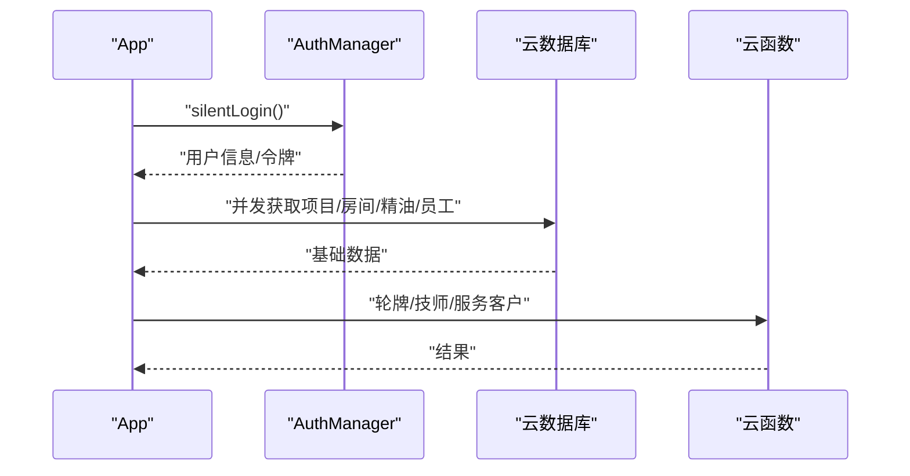
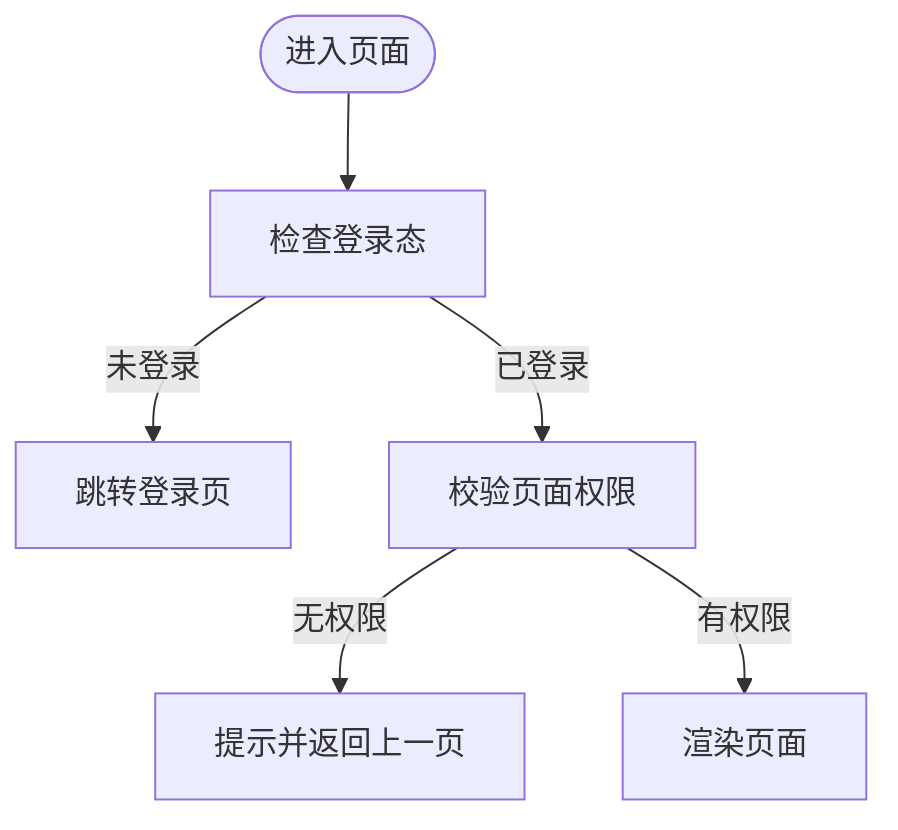
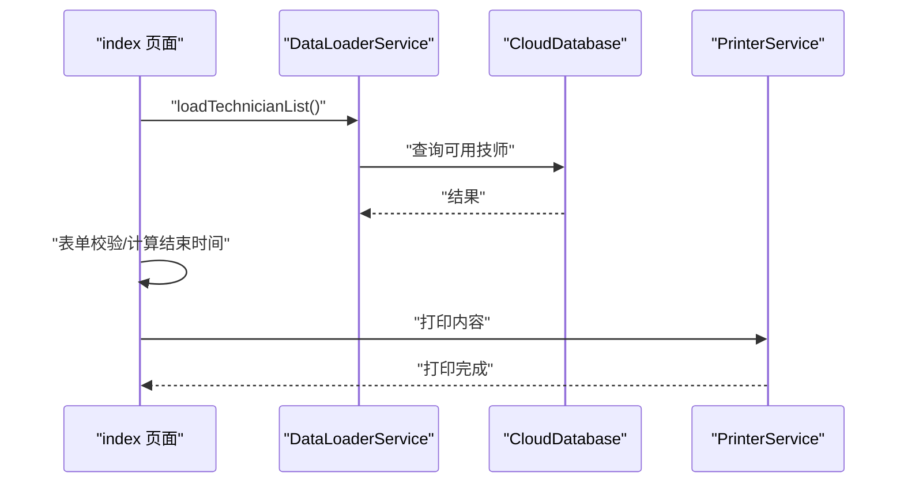
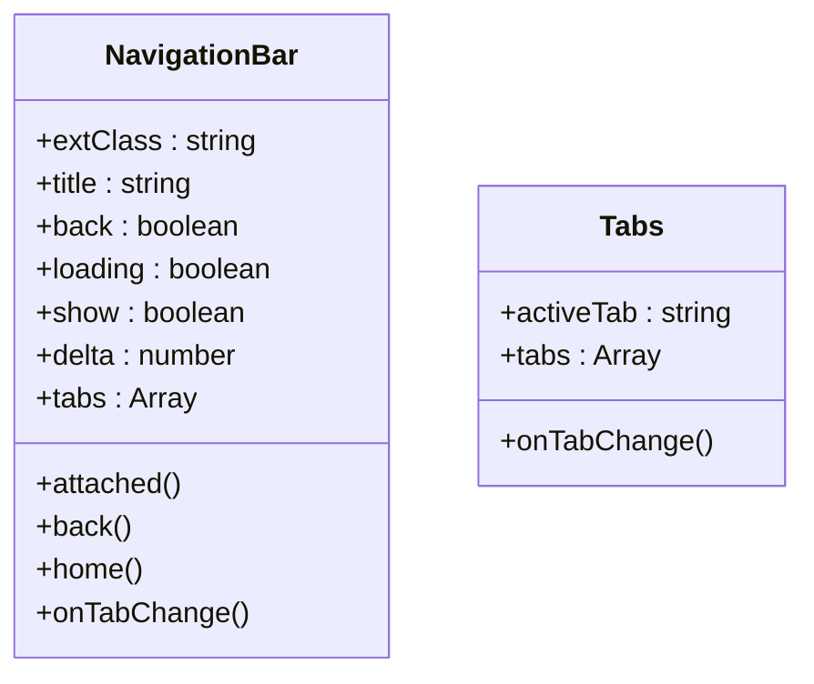
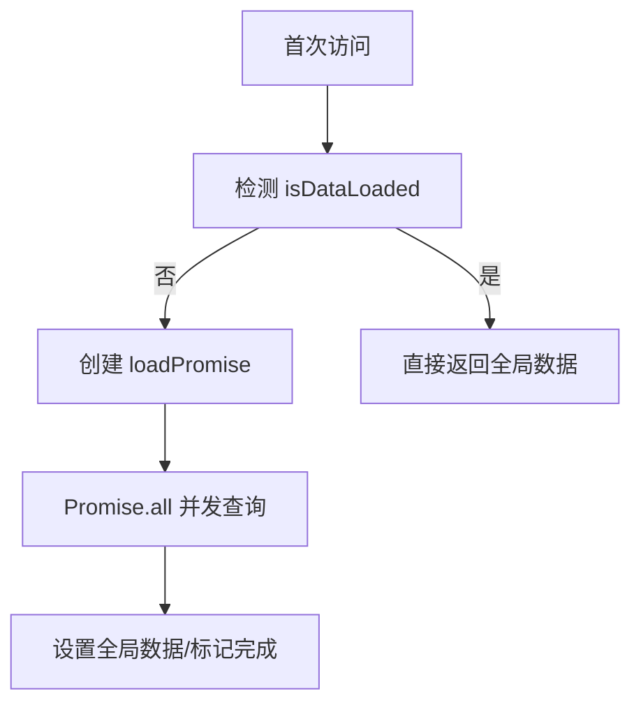
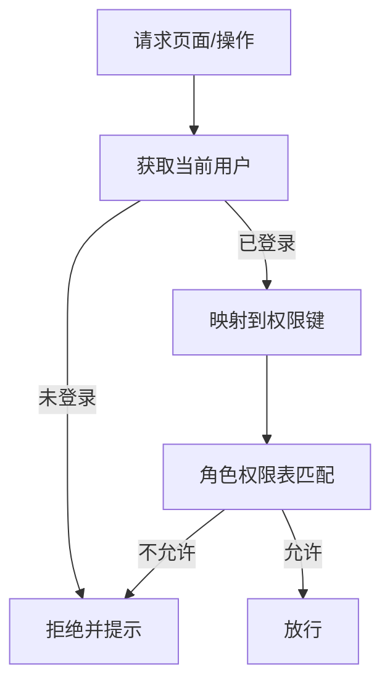
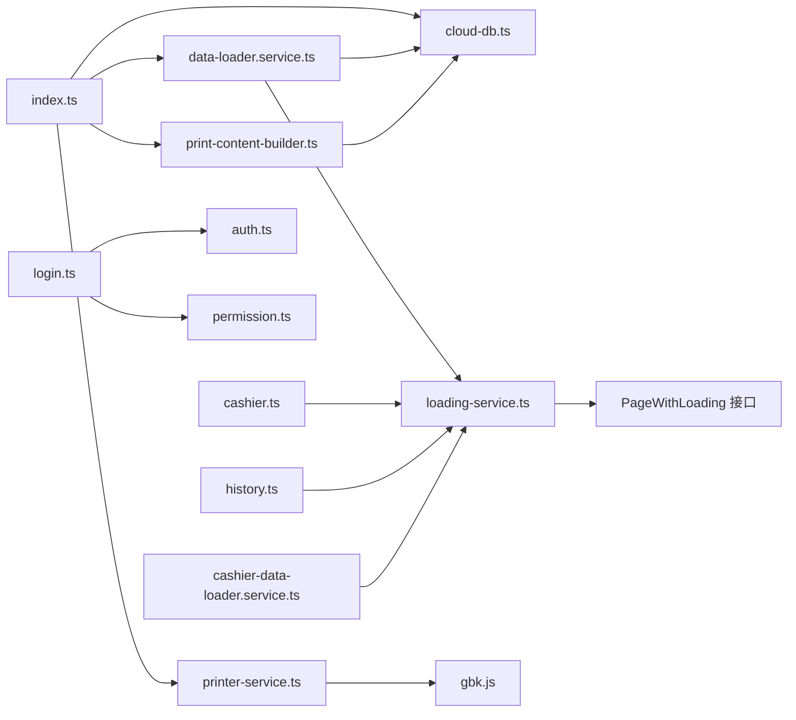

# 前端架构设计

<cite>
**本文档引用的文件**
- [miniprogram/app.ts](file://miniprogram/app.ts)
- [miniprogram/app.json](file://miniprogram/app.json)
- [miniprogram/pages/index/index.ts](file://miniprogram/pages/index/index.ts)
- [miniprogram/utils/auth.ts](file://miniprogram/utils/auth.ts)
- [miniprogram/utils/permission.ts](file://miniprogram/utils/permission.ts)
- [miniprogram/utils/cloud-db.ts](file://miniprogram/utils/cloud-db.ts)
- [miniprogram/services/printer-service.ts](file://miniprogram/services/printer-service.ts)
- [miniprogram/services/print-content-builder.ts](file://miniprogram/services/print-content-builder.ts)
- [miniprogram/pages/index/services/data-loader.service.ts](file://miniprogram/pages/index/services/data-loader.service.ts)
- [miniprogram/components/navigation-bar/navigation-bar.ts](file://miniprogram/components/navigation-bar/navigation-bar.ts)
- [miniprogram/components/tabs/tabs.ts](file://miniprogram/components/tabs/tabs.ts)
- [miniprogram/utils/constants.ts](file://miniprogram/utils/constants.ts)
- [miniprogram/pages/login/login.ts](file://miniprogram/pages/login/login.ts)
- [miniprogram/utils/loading-service.ts](file://miniprogram/utils/loading-service.ts)
- [miniprogram/pages/cashier/cashier.ts](file://miniprogram/pages/cashier/cashier.ts)
- [miniprogram/pages/history/history.ts](file://miniprogram/pages/history/history.ts)
- [miniprogram/pages/cashier/services/data-loader.service.ts](file://miniprogram/pages/cashier/services/data-loader.service.ts)
- [miniprogram/pages/analytics/analytics.ts](file://miniprogram/pages/analytics/analytics.ts)
- [miniprogram/pages/membership-cards/membership-cards.ts](file://miniprogram/pages/membership-cards/membership-cards.ts)
- [miniprogram/pages/staff/staff.ts](file://miniprogram/pages/staff/staff.ts)
- [miniprogram/pages/profile/profile.ts](file://miniprogram/pages/profile/profile.ts)
- [tsconfig.json](file://tsconfig.json)
</cite>

## 更新摘要
**所做更改**
- 新增统一加载管理服务系统章节，详细介绍LoadingService的设计与实现
- 更新页面加载状态管理章节，说明从分散状态管理到统一管理的演进
- 增加防重复提交机制的技术细节和应用场景
- 完善错误处理和用户反馈机制的说明
- 更新架构图表以反映新的加载管理服务

## 目录
1. [引言](#引言)
2. [项目结构](#项目结构)
3. [核心组件](#核心组件)
4. [架构总览](#架构总览)
5. [详细组件分析](#详细组件分析)
6. [依赖关系分析](#依赖关系分析)
7. [性能考虑](#性能考虑)
8. [故障排查指南](#故障排查指南)
9. [结论](#结论)

## 引言
本设计文档面向ConsultationPrinter项目的前端架构，围绕微信小程序框架下的MVVM架构进行系统性梳理，重点涵盖：
- App全局状态管理与生命周期
- 页面路由与权限控制
- 组件化架构与交互
- 全局数据加载机制与云函数集成
- TypeScript类型体系与泛型应用
- 页面间导航、数据传递与状态同步策略
- **新增** 统一加载管理服务系统，提供防重复提交、统一loading状态和错误处理机制

目标是帮助开发者快速理解系统设计思路，并为后续扩展提供清晰的参考。

## 项目结构
ConsultationPrinter采用"按页面/功能分层"的组织方式，核心目录与职责如下：
- miniprogram/pages：页面级代码，每个页面包含逻辑、样式、模板与工具模块
- miniprogram/utils：通用工具与基础设施（认证、权限、云数据库、常量、**加载管理服务**）
- miniprogram/services：业务服务封装（打印服务、内容构建器）
- miniprogram/components：可复用组件（导航栏、标签页等）
- typings：TypeScript声明文件
- tsconfig.json：TypeScript编译配置



**图表来源**
- [miniprogram/app.ts](file://miniprogram/app.ts#L1-L191)
- [miniprogram/app.json](file://miniprogram/app.json#L1-L35)
- [miniprogram/pages/index/index.ts](file://miniprogram/pages/index/index.ts#L1-L735)
- [miniprogram/utils/cloud-db.ts](file://miniprogram/utils/cloud-db.ts#L1-L321)
- [miniprogram/utils/loading-service.ts](file://miniprogram/utils/loading-service.ts#L1-L282)

**章节来源**
- [miniprogram/app.json](file://miniprogram/app.json#L1-L35)

## 核心组件
本节从架构视角提炼关键构件及其职责：
- App全局状态与生命周期：统一管理全局数据、登录态、权限校验与全局加载
- 页面控制器（MVVM中的V+VM）：页面逻辑、事件处理、数据绑定与状态管理
- 服务层：打印服务、内容构建器等业务能力封装
- 工具层：认证、权限、云数据库、**加载管理服务**、常量等基础设施
- 组件层：可复用UI组件，提供插槽、事件与生命周期钩子

**章节来源**
- [miniprogram/app.ts](file://miniprogram/app.ts#L1-L191)
- [miniprogram/pages/index/index.ts](file://miniprogram/pages/index/index.ts#L1-L735)
- [miniprogram/utils/auth.ts](file://miniprogram/utils/auth.ts#L1-L245)
- [miniprogram/utils/permission.ts](file://miniprogram/utils/permission.ts#L1-L194)
- [miniprogram/utils/cloud-db.ts](file://miniprogram/utils/cloud-db.ts#L1-L321)
- [miniprogram/utils/loading-service.ts](file://miniprogram/utils/loading-service.ts#L1-L282)
- [miniprogram/services/printer-service.ts](file://miniprogram/services/printer-service.ts#L1-L298)
- [miniprogram/services/print-content-builder.ts](file://miniprogram/services/print-content-builder.ts#L1-L144)

## 架构总览
ConsultationPrinter前端采用MVVM架构：
- Model：由云数据库与云函数提供，包含项目、房间、精油、员工、咨询记录等实体
- View：WXML模板与WXSS样式，配合组件化提升复用性
- ViewModel：页面逻辑与服务封装，负责数据流转、状态管理与业务编排



**图表来源**
- [miniprogram/pages/index/index.ts](file://miniprogram/pages/index/index.ts#L1-L735)
- [miniprogram/pages/login/login.ts](file://miniprogram/pages/login/login.ts#L1-L166)
- [miniprogram/pages/index/services/data-loader.service.ts](file://miniprogram/pages/index/services/data-loader.service.ts#L1-L206)
- [miniprogram/utils/loading-service.ts](file://miniprogram/utils/loading-service.ts#L34-L246)
- [miniprogram/services/printer-service.ts](file://miniprogram/services/printer-service.ts#L1-L298)
- [miniprogram/services/print-content-builder.ts](file://miniprogram/services/print-content-builder.ts#L1-L144)
- [miniprogram/utils/auth.ts](file://miniprogram/utils/auth.ts#L1-L245)
- [miniprogram/utils/permission.ts](file://miniprogram/utils/permission.ts#L1-L194)
- [miniprogram/utils/cloud-db.ts](file://miniprogram/utils/cloud-db.ts#L1-L321)
- [miniprogram/utils/constants.ts](file://miniprogram/utils/constants.ts#L1-L49)

## 详细组件分析

### App全局状态与生命周期
- 全局数据：项目、房间、精油、员工列表与加载状态
- 登录初始化：静默登录、存储令牌与用户信息
- 权限校验：页面显示时校验登录态，未登录则跳转登录页
- 全局数据加载：并发拉取多类基础数据，Promise防抖避免重复请求
- 业务接口：轮牌队列、下一个技师、服务客户等通过云函数实现



**图表来源**
- [miniprogram/app.ts](file://miniprogram/app.ts#L18-L191)
- [miniprogram/utils/auth.ts](file://miniprogram/utils/auth.ts#L78-L126)
- [miniprogram/utils/cloud-db.ts](file://miniprogram/utils/cloud-db.ts#L69-L88)

**章节来源**
- [miniprogram/app.ts](file://miniprogram/app.ts#L1-L191)

### 页面路由与权限控制
- 页面注册：app.json集中声明页面路径
- 登录页：检查登录状态，引导绑定员工或跳转首页/收银页
- 权限映射：角色到页面/按钮权限的映射表，动态校验
- 页面拦截：onShow时对非登录页进行权限校验



**图表来源**
- [miniprogram/pages/login/login.ts](file://miniprogram/pages/login/login.ts#L1-L166)
- [miniprogram/utils/permission.ts](file://miniprogram/utils/permission.ts#L163-L173)

**章节来源**
- [miniprogram/app.json](file://miniprogram/app.json#L1-L35)
- [miniprogram/pages/login/login.ts](file://miniprogram/pages/login/login.ts#L1-L166)
- [miniprogram/utils/permission.ts](file://miniprogram/utils/permission.ts#L1-L194)

### 页面生命周期与状态管理
- index页面：onLoad加载表单数据、权限校验与全局数据；onShow加载可用技师列表
- 表单状态：默认值、兼容性处理、双人模式切换、匹配顾客应用
- 保存与打印：校验、计算结束时间与加班时长、调用云数据库与云函数、触发打印服务
- 导航：历史、收银、门店配置、屏保等页面跳转



**图表来源**
- [miniprogram/pages/index/index.ts](file://miniprogram/pages/index/index.ts#L125-L147)
- [miniprogram/pages/index/services/data-loader.service.ts](file://miniprogram/pages/index/services/data-loader.service.ts#L13-L65)
- [miniprogram/services/printer-service.ts](file://miniprogram/services/printer-service.ts#L197-L233)

**章节来源**
- [miniprogram/pages/index/index.ts](file://miniprogram/pages/index/index.ts#L1-L735)
- [miniprogram/pages/index/services/data-loader.service.ts](file://miniprogram/pages/index/services/data-loader.service.ts#L1-L206)

### 统一加载管理服务系统
**新增** ConsultationPrinter引入了统一的LoadingService，替代分散的页面加载状态管理：

- **核心功能**：提供防重复提交、统一loading状态管理和错误处理
- **锁机制**：通过lockKey防止同一操作重复执行，支持全局锁计数器
- **多种执行模式**：
  - withLoading：包装异步函数，自动处理loading显示和隐藏
  - withLock：仅防重复提交，不显示loading UI
  - withLoadingBatch：批量异步操作，支持并行和串行执行
- **错误处理**：统一的错误提示和日志记录
- **用户反馈**：可配置的成功/失败提示和loading文本

```mermaid
classDiagram
class LoadingService {
+locks : Map~string, boolean~
+lockCounter : number
+isLocked(lockKey : string) : boolean
+acquireLock(lockKey : string) : boolean
+releaseLock(lockKey : string) : void
+generateLockKey() : string
+withLoading(page, fn, options) : Promise~T | null~
+withLock(lockKey, fn, onLocked?) : Promise~T | null~
+withLoadingBatch(page, tasks, options) : Promise~T | null[]~
+clearAllLocks() : void
}
class PageWithLoading {
+data : { loading : boolean, loadingText : string }
+setData(data) : void
}
class LockKeys {
<<enumeration>>
LOAD_CASHIER_DATA : string
REFRESH_ROTATION : string
ADJUST_ROTATION : string
SAVE_RESERVATION : string
CANCEL_RESERVATION : string
SETTLEMENT : string
PUSH_ROTATION : string
LOAD_HISTORY : string
VOID_CONSULTATION : string
DELETE_CONSULTATION : string
EARLY_FINISH : string
EXTRA_TIME : string
GENERATE_SUMMARY : string
PUSH_SUMMARY : string
LOAD_INDEX_DATA : string
SAVE_CONSULTATION : string
CLOCK_IN : string
SEARCH_CUSTOMER : string
LOAD_ANALYTICS : string
SAVE_MEMBERSHIP : string
TOGGLE_MEMBERSHIP_STATUS : string
DELETE_MEMBERSHIP : string
}
LoadingService --> PageWithLoading
```

**图表来源**
- [miniprogram/utils/loading-service.ts](file://miniprogram/utils/loading-service.ts#L34-L246)
- [miniprogram/utils/loading-service.ts](file://miniprogram/utils/loading-service.ts#L6-L9)
- [miniprogram/utils/loading-service.ts](file://miniprogram/utils/loading-service.ts#L248-L282)

**章节来源**
- [miniprogram/utils/loading-service.ts](file://miniprogram/utils/loading-service.ts#L1-L282)

### 组件化架构
- navigation-bar：支持插槽、动画显示/隐藏、返回与首页跳转、标签切换事件
- tabs：标签切换事件透传，便于页面内分组展示



**图表来源**
- [miniprogram/components/navigation-bar/navigation-bar.ts](file://miniprogram/components/navigation-bar/navigation-bar.ts#L1-L114)
- [miniprogram/components/tabs/tabs.ts](file://miniprogram/components/tabs/tabs.ts#L1-L20)

**章节来源**
- [miniprogram/components/navigation-bar/navigation-bar.ts](file://miniprogram/components/navigation-bar/navigation-bar.ts#L1-L114)
- [miniprogram/components/tabs/tabs.ts](file://miniprogram/components/tabs/tabs.ts#L1-L20)

### 全局数据加载机制
- 并发加载：Promise.all同时获取项目、房间、精油、员工
- 防抖与缓存：loadPromise避免重复请求，isDataLoaded标记加载完成
- 云函数：getAll封装统一查询入口，异常兜底返回空数组



**图表来源**
- [miniprogram/app.ts](file://miniprogram/app.ts#L40-L66)
- [miniprogram/utils/cloud-db.ts](file://miniprogram/utils/cloud-db.ts#L69-L88)

**章节来源**
- [miniprogram/app.ts](file://miniprogram/app.ts#L40-L66)
- [miniprogram/utils/cloud-db.ts](file://miniprogram/utils/cloud-db.ts#L69-L88)

### 权限验证流程
- 角色到权限映射：admin/cashier/technician/viewer四类角色
- 页面与按钮权限：通过PAGE_PERMISSION_MAP/BUTTON_PERMISSION_MAP映射
- 运行时校验：hasPagePermission/hasButtonPermission动态判断



**图表来源**
- [miniprogram/utils/permission.ts](file://miniprogram/utils/permission.ts#L149-L173)

**章节来源**
- [miniprogram/utils/permission.ts](file://miniprogram/utils/permission.ts#L1-L194)

### 页面间导航模式与数据传递
- 基于navigateTo/redirectTo/reLaunch的标准导航
- 数据传递：通过URL参数（如editId、reserveId）传递标识，页面onLoad解析
- 状态同步：保存成功后触发App全局数据刷新，确保其他页面读取最新状态

**章节来源**
- [miniprogram/pages/index/index.ts](file://miniprogram/pages/index/index.ts#L140-L146)
- [miniprogram/pages/login/login.ts](file://miniprogram/pages/login/login.ts#L100-L133)

### TypeScript类型体系与泛型应用
- 类型声明：UserRecord、Project、Room、EssentialOil、StaffInfo、ConsultationRecord等
- 泛型约束：CloudDatabase的getAll/find/saveConsultation等方法使用泛型保证类型安全
- 编译配置：严格模式开启，noImplicitAny、strictNullChecks等增强类型安全

**章节来源**
- [miniprogram/utils/cloud-db.ts](file://miniprogram/utils/cloud-db.ts#L12-L321)
- [tsconfig.json](file://tsconfig.json#L1-L31)

## 依赖关系分析
- 页面依赖：index依赖DataLoaderService、FormHandler、ModalHandler、PrinterService与CloudDatabase
- 服务依赖：PrinterService依赖GBK编码与蓝牙API；PrintContentBuilder依赖云数据库统计日计数
- 工具依赖：AuthManager/Permission/Constants被广泛复用
- **新增** LoadingService被多个页面和服务广泛使用，形成统一的加载管理枢纽
- 云服务依赖：所有数据持久化与业务编排通过云函数与云数据库完成



**图表来源**
- [miniprogram/pages/index/index.ts](file://miniprogram/pages/index/index.ts#L1-L14)
- [miniprogram/pages/index/services/data-loader.service.ts](file://miniprogram/pages/index/services/data-loader.service.ts#L1-L4)
- [miniprogram/services/print-content-builder.ts](file://miniprogram/services/print-content-builder.ts#L1-L2)
- [miniprogram/services/printer-service.ts](file://miniprogram/services/printer-service.ts#L1-L1)
- [miniprogram/utils/cloud-db.ts](file://miniprogram/utils/cloud-db.ts#L1-L321)
- [miniprogram/pages/login/login.ts](file://miniprogram/pages/login/login.ts#L1-L2)
- [miniprogram/utils/auth.ts](file://miniprogram/utils/auth.ts#L1-L245)
- [miniprogram/utils/permission.ts](file://miniprogram/utils/permission.ts#L1-L194)
- [miniprogram/utils/loading-service.ts](file://miniprogram/utils/loading-service.ts#L1-L282)
- [miniprogram/pages/cashier/cashier.ts](file://miniprogram/pages/cashier/cashier.ts#L1-L10)
- [miniprogram/pages/history/history.ts](file://miniprogram/pages/history/history.ts#L1-L5)
- [miniprogram/pages/cashier/services/data-loader.service.ts](file://miniprogram/pages/cashier/services/data-loader.service.ts#L1-L5)

**章节来源**
- [miniprogram/pages/index/index.ts](file://miniprogram/pages/index/index.ts#L1-L14)
- [miniprogram/pages/index/services/data-loader.service.ts](file://miniprogram/pages/index/services/data-loader.service.ts#L1-L4)
- [miniprogram/services/print-content-builder.ts](file://miniprogram/services/print-content-builder.ts#L1-L2)
- [miniprogram/services/printer-service.ts](file://miniprogram/services/printer-service.ts#L1-L1)
- [miniprogram/utils/cloud-db.ts](file://miniprogram/utils/cloud-db.ts#L1-L321)
- [miniprogram/pages/login/login.ts](file://miniprogram/pages/login/login.ts#L1-L2)
- [miniprogram/utils/auth.ts](file://miniprogram/utils/auth.ts#L1-L245)
- [miniprogram/utils/permission.ts](file://miniprogram/utils/permission.ts#L1-L194)
- [miniprogram/utils/loading-service.ts](file://miniprogram/utils/loading-service.ts#L1-L282)
- [miniprogram/pages/cashier/cashier.ts](file://miniprogram/pages/cashier/cashier.ts#L1-L10)
- [miniprogram/pages/history/history.ts](file://miniprogram/pages/history/history.ts#L1-L5)
- [miniprogram/pages/cashier/services/data-loader.service.ts](file://miniprogram/pages/cashier/services/data-loader.service.ts#L1-L5)

## 性能考虑
- 并发加载：App全局数据采用Promise.all并发拉取，减少首屏等待
- 防抖与缓存：loadPromise避免重复请求；isDataLoaded标记已加载
- **新增** 防重复提交：LoadingService通过锁机制防止同一操作重复执行，避免资源浪费
- **新增** 统一loading管理：所有页面共享loading状态，提升用户体验一致性
- 云函数优化：DataLoaderService调用getAvailableTechnicians时传入项目时长、当前预约ID等参数，减少无效数据传输
- 打印性能：PrinterService分块发送字节流，避免超长字符串一次性写入导致阻塞

## 故障排查指南
- 登录失败：检查AuthManager静默登录流程与云函数login返回格式
- 权限不足：确认用户角色与页面权限映射，必要时调用requirePagePermission
- 数据加载异常：查看CloudDatabase.getAll返回码与异常捕获，确认云函数getAll实现
- **新增** 加载服务问题：检查LoadingService的lockKey配置，确认防重复机制正常工作
- **新增** 错误处理：确认LoadingService的错误提示配置，检查console输出的日志信息
- 打印失败：检查PrinterService.ensureConnected与蓝牙设备发现流程，确认设备特征值写入成功

**章节来源**
- [miniprogram/utils/auth.ts](file://miniprogram/utils/auth.ts#L78-L126)
- [miniprogram/utils/permission.ts](file://miniprogram/utils/permission.ts#L163-L173)
- [miniprogram/utils/cloud-db.ts](file://miniprogram/utils/cloud-db.ts#L69-L88)
- [miniprogram/utils/loading-service.ts](file://miniprogram/utils/loading-service.ts#L89-L131)
- [miniprogram/services/printer-service.ts](file://miniprogram/services/printer-service.ts#L182-L195)

## 结论
ConsultationPrinter前端以MVVM为核心，结合组件化与服务化，实现了清晰的职责分离与良好的扩展性。通过App全局状态管理、严格的权限控制与并发数据加载，系统在用户体验与维护性之间取得了平衡。

**重要更新** 新增的统一加载管理服务系统显著提升了系统的稳定性和用户体验：
- 通过防重复提交机制避免了重复操作带来的资源浪费
- 统一的loading状态管理提供了更好的用户反馈
- 标准化的错误处理机制简化了异常情况的处理
- LockKeys常量确保了锁标识的一致性和可维护性

建议后续持续完善类型体系与错误处理，进一步提升稳定性与可测试性。同时可以考虑扩展LoadingService的功能，如添加超时机制、重试策略等高级特性。