# 数据流设计

<cite>
**本文引用的文件**
- [miniprogram/app.ts](file://miniprogram/app.ts)
- [miniprogram/utils/cloud-db.ts](file://miniprogram/utils/cloud-db.ts)
- [miniprogram/utils/validators.ts](file://miniprogram/utils/validators.ts)
- [miniprogram/services/printer-service.ts](file://miniprogram/services/printer-service.ts)
- [miniprogram/services/print-content-builder.ts](file://miniprogram/services/print-content-builder.ts)
- [miniprogram/pages/index/index.ts](file://miniprogram/pages/index/index.ts)
- [miniprogram/pages/cashier/cashier.ts](file://miniprogram/pages/cashier/cashier.ts)
- [miniprogram/pages/index/handlers/form.handler.ts](file://miniprogram/pages/index/handlers/form.handler.ts)
- [miniprogram/pages/index/services/data-loader.service.ts](file://miniprogram/pages/index/services/data-loader.service.ts)
- [miniprogram/utils/auth.ts](file://miniprogram/utils/auth.ts)
- [miniprogram/utils/util.ts](file://miniprogram/utils/util.ts)
- [cloudfunctions/getAll/index.js](file://cloudfunctions/getAll/index.js)
- [cloudfunctions/manageRotation/index.js](file://cloudfunctions/manageRotation/index.js)
- [cloudfunctions/sendWechatMessage/index.js](file://cloudfunctions/sendWechatMessage/index.js)
</cite>

## 目录
1. [简介](#简介)
2. [项目结构](#项目结构)
3. [核心组件](#核心组件)
4. [架构总览](#架构总览)
5. [详细组件分析](#详细组件分析)
6. [依赖关系分析](#依赖关系分析)
7. [性能考量](#性能考量)
8. [故障排查指南](#故障排查指南)
9. [结论](#结论)
10. [附录](#附录)

## 简介
本文件面向ConsultationPrinter项目的“数据流设计”，目标是：
- 从用户输入到数据持久化的完整数据流路径
- 表单验证、数据转换与存储流程
- 全局数据缓存策略、数据同步机制与状态管理
- 跨页面数据共享、组件间通信与事件传递机制
- 数据一致性保证、并发控制与冲突解决策略
- 提供数据流图与状态转换图，说明关键业务场景的数据流转过程

## 项目结构
ConsultationPrinter采用小程序前端 + 云开发数据库 + 云函数的三层架构：
- 小程序前端：页面、组件、服务、工具类
- 云开发数据库：集合读取、写入、查询
- 云函数：批量读取、轮牌管理、消息推送等

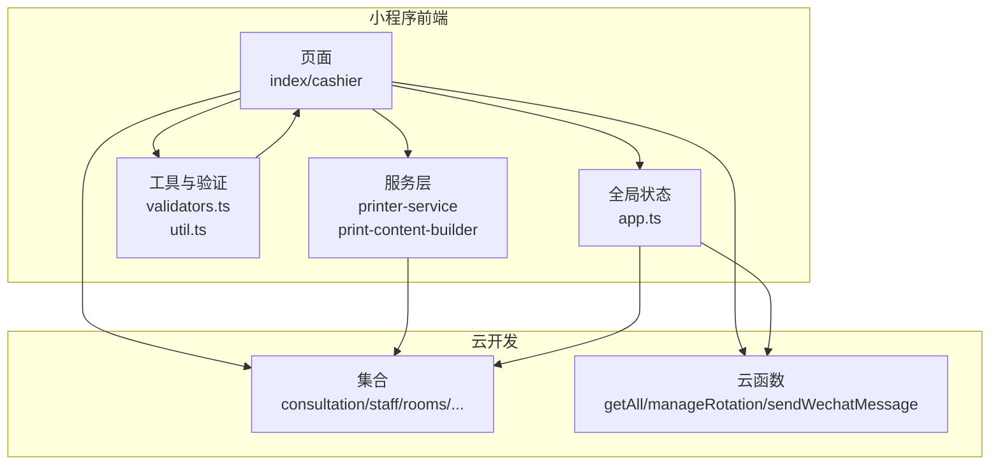

图表来源
- [miniprogram/pages/index/index.ts](file://miniprogram/pages/index/index.ts#L1-L735)
- [miniprogram/pages/cashier/cashier.ts](file://miniprogram/pages/cashier/cashier.ts#L1-L800)
- [miniprogram/services/printer-service.ts](file://miniprogram/services/printer-service.ts#L1-L298)
- [miniprogram/services/print-content-builder.ts](file://miniprogram/services/print-content-builder.ts#L1-L144)
- [miniprogram/utils/cloud-db.ts](file://miniprogram/utils/cloud-db.ts#L1-L321)
- [cloudfunctions/getAll/index.js](file://cloudfunctions/getAll/index.js#L1-L59)
- [cloudfunctions/manageRotation/index.js](file://cloudfunctions/manageRotation/index.js#L1-L327)
- [cloudfunctions/sendWechatMessage/index.js](file://cloudfunctions/sendWechatMessage/index.js#L1-L65)

章节来源
- [miniprogram/app.ts](file://miniprogram/app.ts#L1-L191)
- [miniprogram/utils/cloud-db.ts](file://miniprogram/utils/cloud-db.ts#L1-L321)

## 核心组件
- 全局状态与数据加载：App全局对象负责登录态、全局数据加载与轮牌接口调用
- 数据访问层：CloudDatabase封装集合读取、插入、更新、分页、按日期查询等
- 表单与验证：validators.ts提供咨询单、双人模式、客座信息等校验
- 打印服务：printer-service负责蓝牙连接、打印内容分片发送；print-content-builder负责内容构建
- 页面与服务：index页面承载咨询单录入、保存、打印、报钟；cashier页面承载收银、轮牌、预约管理
- 工具与权限：util.ts提供时间计算、格式化；auth.ts提供登录态与权限管理

章节来源
- [miniprogram/app.ts](file://miniprogram/app.ts#L1-L191)
- [miniprogram/utils/cloud-db.ts](file://miniprogram/utils/cloud-db.ts#L1-L321)
- [miniprogram/utils/validators.ts](file://miniprogram/utils/validators.ts#L1-L81)
- [miniprogram/services/printer-service.ts](file://miniprogram/services/printer-service.ts#L1-L298)
- [miniprogram/services/print-content-builder.ts](file://miniprogram/services/print-content-builder.ts#L1-L144)
- [miniprogram/pages/index/index.ts](file://miniprogram/pages/index/index.ts#L1-L735)
- [miniprogram/pages/cashier/cashier.ts](file://miniprogram/pages/cashier/cashier.ts#L1-L800)
- [miniprogram/utils/util.ts](file://miniprogram/utils/util.ts#L1-L150)
- [miniprogram/utils/auth.ts](file://miniprogram/utils/auth.ts#L1-L245)

## 架构总览
整体数据流分为四段：
1) 用户输入与表单处理：index页面通过FormHandler接收用户输入，DataLoaderService加载可用技师列表
2) 数据验证与转换：validators.ts进行字段校验；util.ts计算项目结束时间、加班单位等
3) 数据持久化：CloudDatabase.saveConsultation写入consultation_records集合
4) 外部集成：轮牌管理（manageRotation）、打印（printer-service）、消息推送（sendWechatMessage）

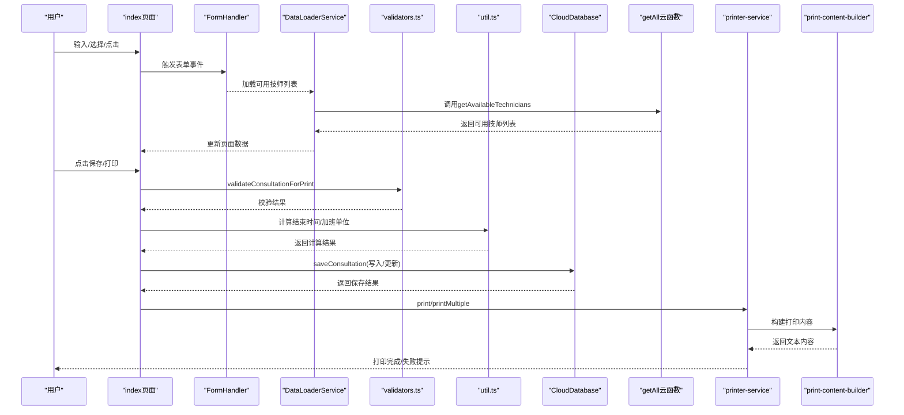

图表来源
- [miniprogram/pages/index/index.ts](file://miniprogram/pages/index/index.ts#L263-L324)
- [miniprogram/pages/index/handlers/form.handler.ts](file://miniprogram/pages/index/handlers/form.handler.ts#L1-L175)
- [miniprogram/pages/index/services/data-loader.service.ts](file://miniprogram/pages/index/services/data-loader.service.ts#L1-L206)
- [miniprogram/utils/validators.ts](file://miniprogram/utils/validators.ts#L51-L72)
- [miniprogram/utils/util.ts](file://miniprogram/utils/util.ts#L96-L105)
- [miniprogram/utils/cloud-db.ts](file://miniprogram/utils/cloud-db.ts#L260-L278)
- [cloudfunctions/getAll/index.js](file://cloudfunctions/getAll/index.js#L1-L59)
- [miniprogram/services/printer-service.ts](file://miniprogram/services/printer-service.ts#L197-L233)
- [miniprogram/services/print-content-builder.ts](file://miniprogram/services/print-content-builder.ts#L31-L80)

## 详细组件分析

### 组件A：全局数据与登录态（App）
- 负责初始化登录、加载全局基础数据（项目、房间、精油、员工），并提供轮牌相关接口
- 提供全局数据加载Promise避免重复请求
- 提供轮牌队列查询、下一个技师、服务客户、调整位置等云函数调用

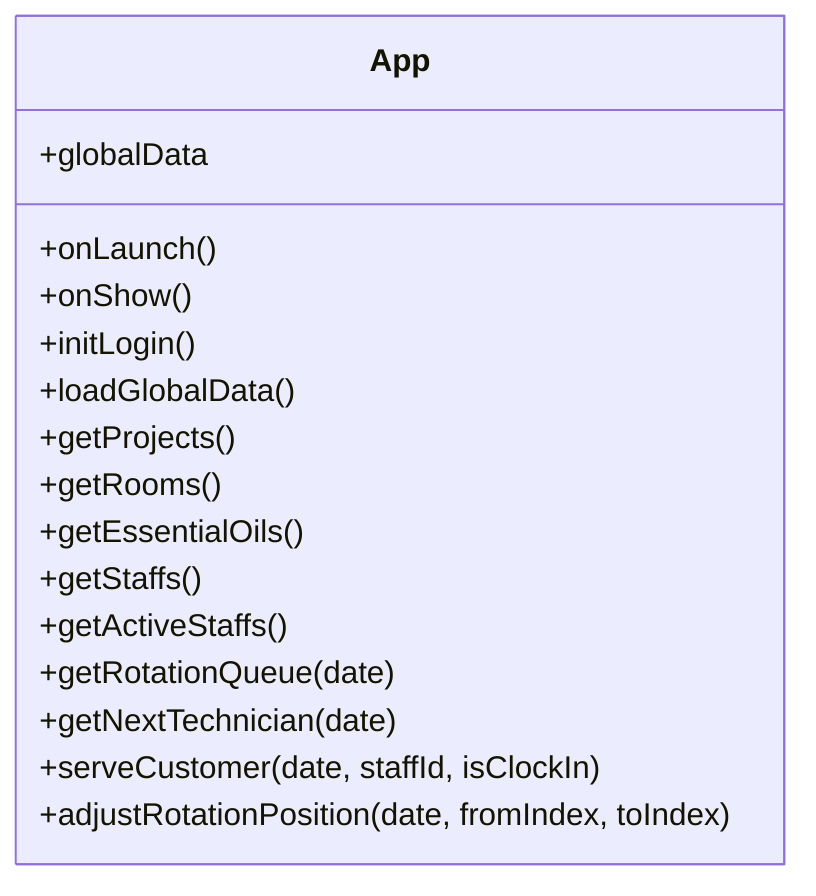

图表来源
- [miniprogram/app.ts](file://miniprogram/app.ts#L4-L191)

章节来源
- [miniprogram/app.ts](file://miniprogram/app.ts#L13-L191)

### 组件B：数据访问层（CloudDatabase）
- 封装集合读取、插入、更新、删除、分页、按条件查询、按日期查询
- 提供saveConsultation统一保存咨询单逻辑（新建或更新）
- 提供getAll通过云函数实现全量读取

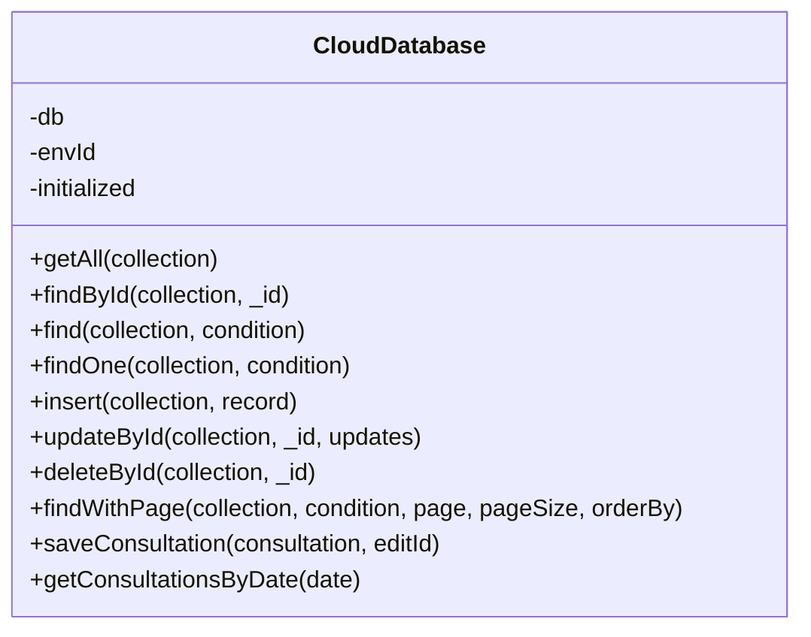

图表来源
- [miniprogram/utils/cloud-db.ts](file://miniprogram/utils/cloud-db.ts#L12-L299)

章节来源
- [miniprogram/utils/cloud-db.ts](file://miniprogram/utils/cloud-db.ts#L69-L299)

### 组件C：表单验证（validators.ts）
- 提供咨询单、双人模式、客座信息的校验方法
- 提供统一的错误提示展示

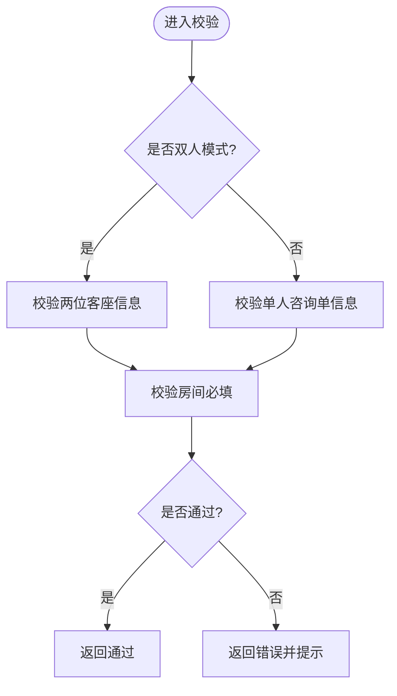

图表来源
- [miniprogram/utils/validators.ts](file://miniprogram/utils/validators.ts#L51-L72)

章节来源
- [miniprogram/utils/validators.ts](file://miniprogram/utils/validators.ts#L6-L81)

### 组件D：打印服务（printer-service + print-content-builder）
- printer-service：蓝牙连接、设备发现、服务与特征查找、打印内容分片发送
- print-content-builder：根据项目配置与用户输入构建打印内容，包含每日计数查询

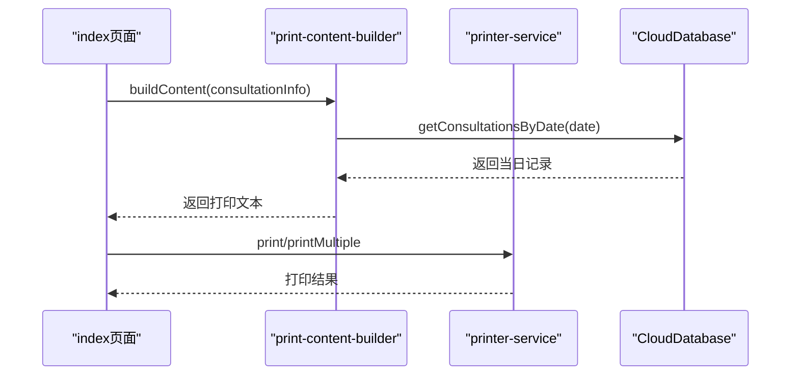

图表来源
- [miniprogram/services/print-content-builder.ts](file://miniprogram/services/print-content-builder.ts#L31-L95)
- [miniprogram/services/printer-service.ts](file://miniprogram/services/printer-service.ts#L197-L269)
- [miniprogram/utils/cloud-db.ts](file://miniprogram/utils/cloud-db.ts#L283-L298)

章节来源
- [miniprogram/services/printer-service.ts](file://miniprogram/services/printer-service.ts#L1-L298)
- [miniprogram/services/print-content-builder.ts](file://miniprogram/services/print-content-builder.ts#L1-L144)

### 组件E：页面与服务（index/cashier）
- index页面：表单处理、保存咨询单、打印、报钟、双人模式、预约导入、顾客匹配
- cashier页面：收银、轮牌、预约管理、消息推送

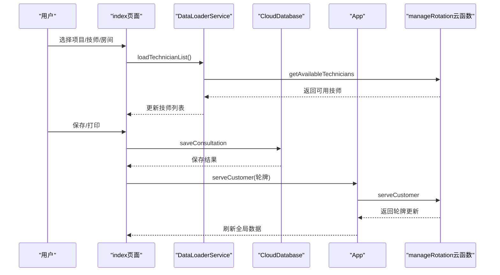

图表来源
- [miniprogram/pages/index/index.ts](file://miniprogram/pages/index/index.ts#L388-L481)
- [miniprogram/pages/index/services/data-loader.service.ts](file://miniprogram/pages/index/services/data-loader.service.ts#L13-L65)
- [miniprogram/utils/cloud-db.ts](file://miniprogram/utils/cloud-db.ts#L260-L278)
- [miniprogram/app.ts](file://miniprogram/app.ts#L149-L168)
- [cloudfunctions/manageRotation/index.js](file://cloudfunctions/manageRotation/index.js#L185-L246)

章节来源
- [miniprogram/pages/index/index.ts](file://miniprogram/pages/index/index.ts#L1-L735)
- [miniprogram/pages/cashier/cashier.ts](file://miniprogram/pages/cashier/cashier.ts#L1-L800)

### 组件F：工具与权限（util.ts + auth.ts）
- util.ts：时间格式化、项目时长解析、加班单位计算、日期计算、时间比较
- auth.ts：登录态管理、静默登录、令牌存储、权限检查

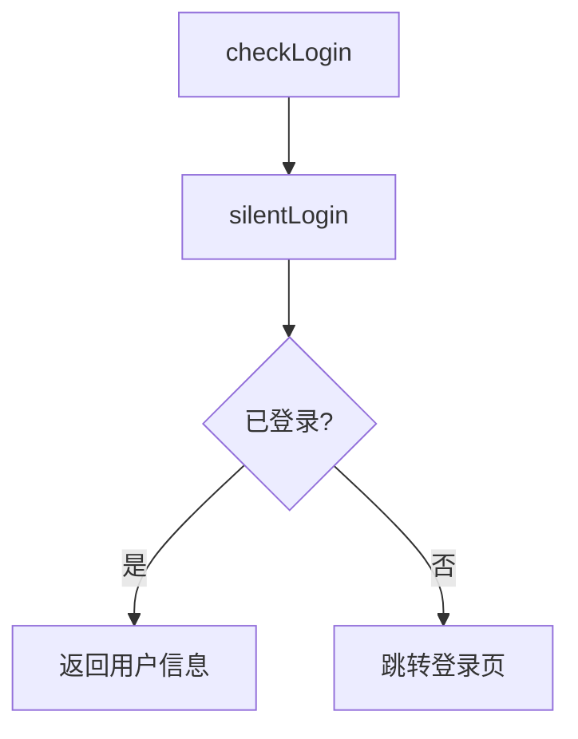

图表来源
- [miniprogram/utils/auth.ts](file://miniprogram/utils/auth.ts#L224-L245)

章节来源
- [miniprogram/utils/util.ts](file://miniprogram/utils/util.ts#L1-L150)
- [miniprogram/utils/auth.ts](file://miniprogram/utils/auth.ts#L1-L245)

## 依赖关系分析
- 页面依赖服务层与工具层，服务层依赖数据访问层与云函数
- index页面与cashier页面均依赖App全局状态与CloudDatabase
- 打印链路依赖printer-service与print-content-builder
- 轮牌链路依赖App与manageRotation云函数

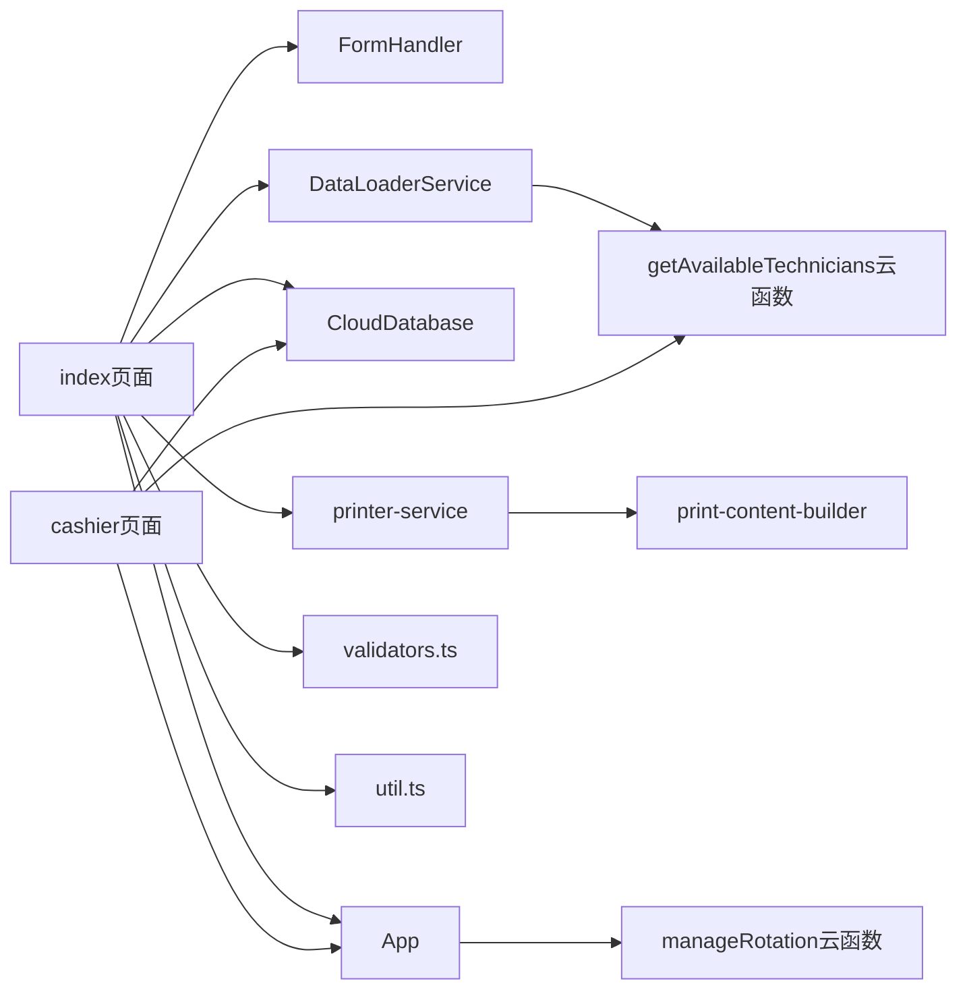

图表来源
- [miniprogram/pages/index/index.ts](file://miniprogram/pages/index/index.ts#L1-L735)
- [miniprogram/pages/index/handlers/form.handler.ts](file://miniprogram/pages/index/handlers/form.handler.ts#L1-L175)
- [miniprogram/pages/index/services/data-loader.service.ts](file://miniprogram/pages/index/services/data-loader.service.ts#L1-L206)
- [miniprogram/utils/cloud-db.ts](file://miniprogram/utils/cloud-db.ts#L1-L321)
- [miniprogram/services/printer-service.ts](file://miniprogram/services/printer-service.ts#L1-L298)
- [miniprogram/services/print-content-builder.ts](file://miniprogram/services/print-content-builder.ts#L1-L144)
- [miniprogram/app.ts](file://miniprogram/app.ts#L1-L191)
- [cloudfunctions/manageRotation/index.js](file://cloudfunctions/manageRotation/index.js#L1-L327)
- [cloudfunctions/getAll/index.js](file://cloudfunctions/getAll/index.js#L1-L59)

章节来源
- [miniprogram/pages/index/index.ts](file://miniprogram/pages/index/index.ts#L1-L735)
- [miniprogram/pages/cashier/cashier.ts](file://miniprogram/pages/cashier/cashier.ts#L1-L800)

## 性能考量
- 全局数据加载：App使用Promise避免重复请求，首次加载后缓存全局数据
- 分页查询：CloudDatabase.findWithPage支持分页与总数统计，减少一次性拉取大量数据
- 云函数批量读取：getAll云函数以分页方式读取集合，避免超限
- 打印分片：printer-service按20字节分片发送，降低单次写入压力
- 并发控制：轮牌调整与服务调用通过云函数原子性处理，避免竞态

[本节为通用指导，无需列出具体文件来源]

## 故障排查指南
- 登录失败：检查静默登录流程与云函数login返回值
- 数据加载失败：检查getAll云函数返回码与集合名称
- 打印失败：检查蓝牙连接状态、设备服务与特征是否存在
- 轮牌异常：检查manageRotation云函数的队列初始化与索引调整
- 消息推送失败：检查sendWechatMessage云函数的webhook地址与网络

章节来源
- [miniprogram/utils/auth.ts](file://miniprogram/utils/auth.ts#L78-L126)
- [cloudfunctions/getAll/index.js](file://cloudfunctions/getAll/index.js#L9-L58)
- [miniprogram/services/printer-service.ts](file://miniprogram/services/printer-service.ts#L31-L91)
- [cloudfunctions/manageRotation/index.js](file://cloudfunctions/manageRotation/index.js#L38-L146)
- [cloudfunctions/sendWechatMessage/index.js](file://cloudfunctions/sendWechatMessage/index.js#L10-L64)

## 结论
ConsultationPrinter通过清晰的分层架构实现了从用户输入到数据持久化的闭环：
- 表单验证与数据转换在前端完成，确保数据质量
- CloudDatabase与云函数提供可靠的数据访问与批量处理能力
- 打印与消息推送作为外部集成，提升用户体验
- 全局状态与轮牌机制保障跨页面数据共享与业务一致性

[本节为总结性内容，无需列出具体文件来源]

## 附录

### 关键业务场景数据流图

#### 场景一：保存并打印咨询单
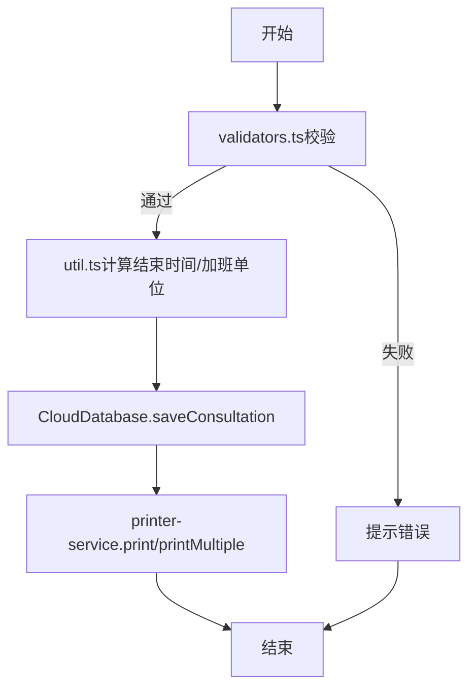

图表来源
- [miniprogram/pages/index/index.ts](file://miniprogram/pages/index/index.ts#L388-L481)
- [miniprogram/utils/validators.ts](file://miniprogram/utils/validators.ts#L51-L72)
- [miniprogram/utils/util.ts](file://miniprogram/utils/util.ts#L96-L105)
- [miniprogram/utils/cloud-db.ts](file://miniprogram/utils/cloud-db.ts#L260-L278)
- [miniprogram/services/printer-service.ts](file://miniprogram/services/printer-service.ts#L197-L233)

#### 场景二：轮牌调整与服务
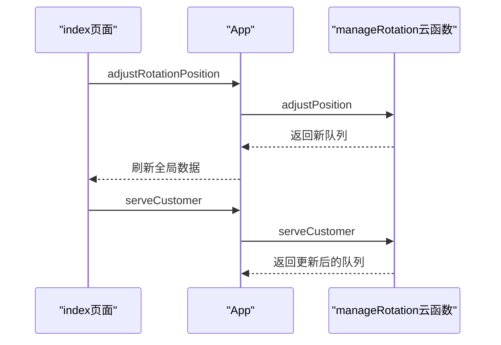

图表来源
- [miniprogram/pages/index/index.ts](file://miniprogram/pages/index/index.ts#L437-L468)
- [miniprogram/app.ts](file://miniprogram/app.ts#L170-L189)
- [cloudfunctions/manageRotation/index.js](file://cloudfunctions/manageRotation/index.js#L274-L315)

#### 场景三：消息推送
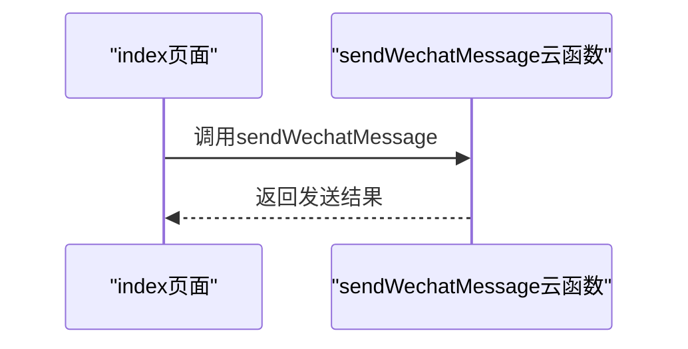

图表来源
- [miniprogram/pages/index/index.ts](file://miniprogram/pages/index/index.ts#L714-L733)
- [cloudfunctions/sendWechatMessage/index.js](file://cloudfunctions/sendWechatMessage/index.js#L10-L64)

### 状态转换图（轮牌队列）
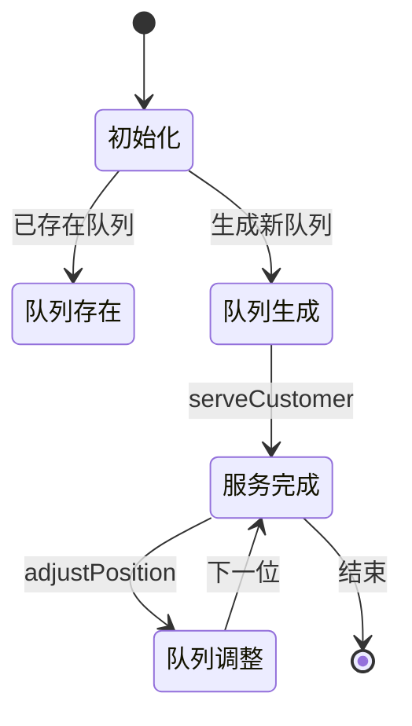

图表来源
- [cloudfunctions/manageRotation/index.js](file://cloudfunctions/manageRotation/index.js#L38-L146)
- [cloudfunctions/manageRotation/index.js](file://cloudfunctions/manageRotation/index.js#L185-L246)
- [cloudfunctions/manageRotation/index.js](file://cloudfunctions/manageRotation/index.js#L274-L315)