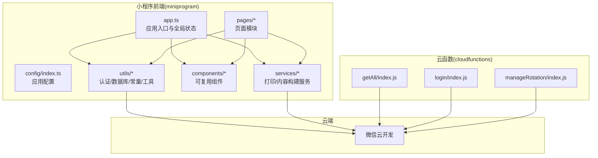
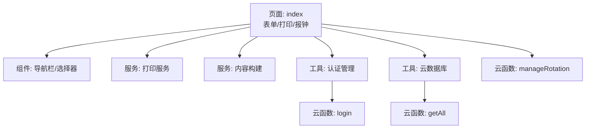
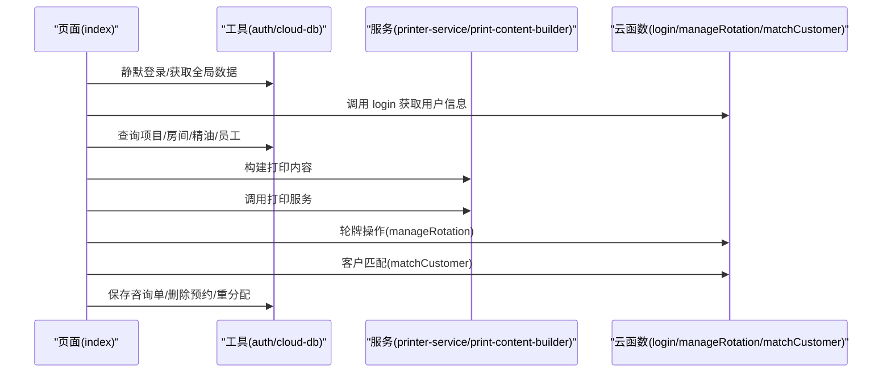
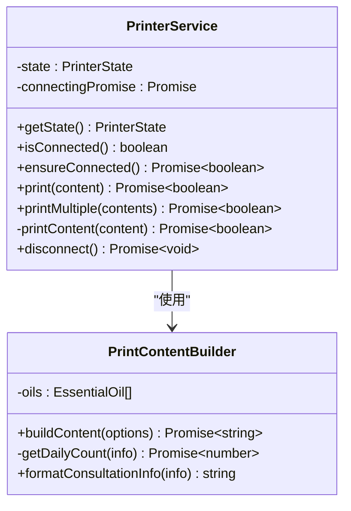
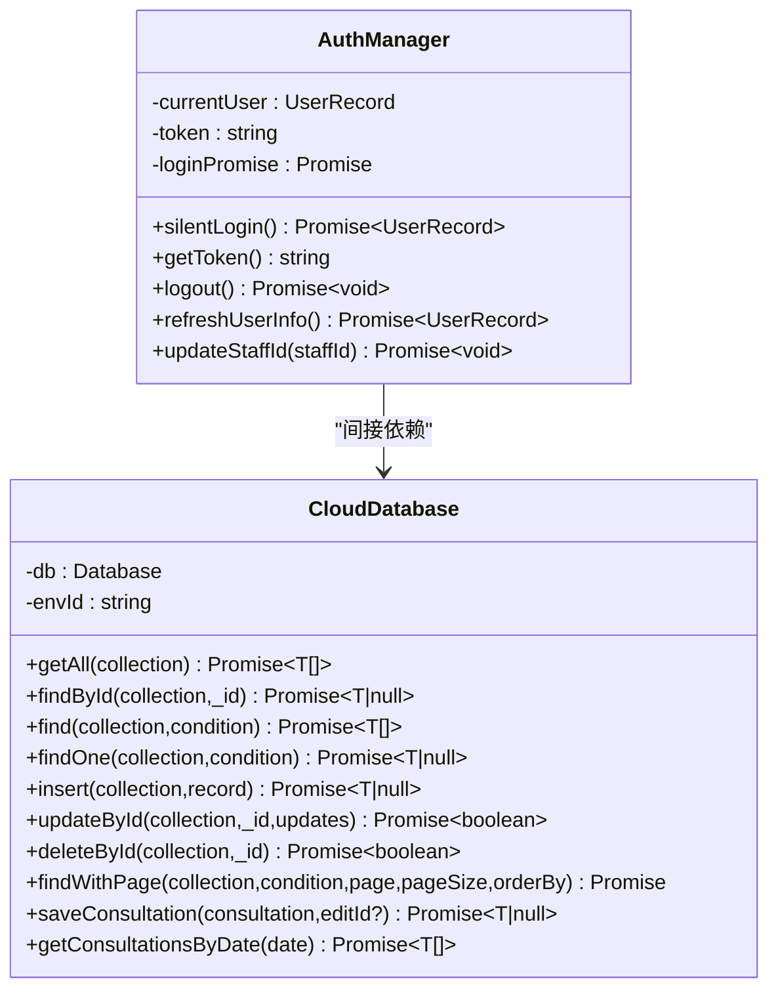
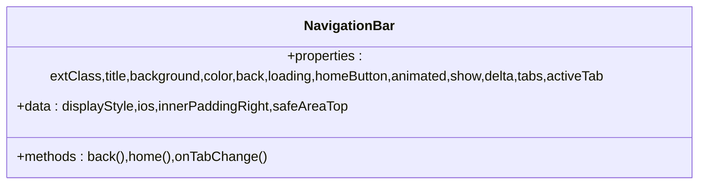
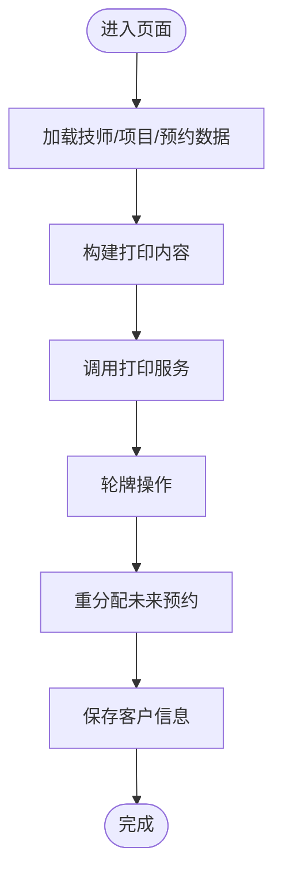
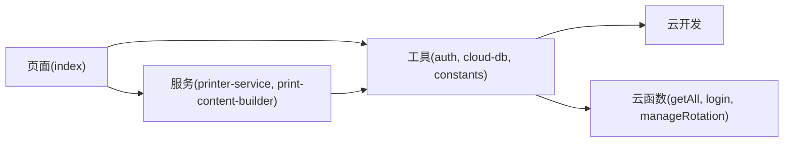

# 模块化架构

<cite>
**本文档引用的文件**
- [miniprogram/app.json](file://miniprogram/app.json)
- [miniprogram/app.ts](file://miniprogram/app.ts)
- [miniprogram/config/index.ts](file://miniprogram/config/index.ts)
- [miniprogram/services/printer-service.ts](file://miniprogram/services/printer-service.ts)
- [miniprogram/services/print-content-builder.ts](file://miniprogram/services/print-content-builder.ts)
- [miniprogram/components/navigation-bar/navigation-bar.ts](file://miniprogram/components/navigation-bar/navigation-bar.ts)
- [miniprogram/pages/index/index.ts](file://miniprogram/pages/index/index.ts)
- [miniprogram/utils/auth.ts](file://miniprogram/utils/auth.ts)
- [miniprogram/utils/cloud-db.ts](file://miniprogram/utils/cloud-db.ts)
- [miniprogram/utils/constants.ts](file://miniprogram/utils/constants.ts)
- [miniprogram/pages/index/services/data-loader.service.ts](file://miniprogram/pages/index/services/data-loader.service.ts)
- [miniprogram/pages/index/utils/clockin-utils.ts](file://miniprogram/pages/index/utils/clockin-utils.ts)
- [miniprogram/pages/index/utils/customer-utils.ts](file://miniprogram/pages/index/utils/customer-utils.ts)
- [miniprogram/pages/index/utils/reservation-utils.ts](file://miniprogram/pages/index/utils/reservation-utils.ts)
- [cloudfunctions/getAll/index.js](file://cloudfunctions/getAll/index.js)
- [cloudfunctions/login/index.js](file://cloudfunctions/login/index.js)
- [cloudfunctions/manageRotation/index.js](file://cloudfunctions/manageRotation/index.js)
- [package.json](file://package.json)
- [tsconfig.json](file://tsconfig.json)
</cite>

## 目录
1. [简介](#简介)
2. [项目结构](#项目结构)
3. [核心组件](#核心组件)
4. [架构总览](#架构总览)
5. [详细组件分析](#详细组件分析)
6. [依赖分析](#依赖分析)
7. [性能考虑](#性能考虑)
8. [故障排查指南](#故障排查指南)
9. [结论](#结论)
10. [附录](#附录)

## 简介
本项目为 ConsultationPrinter 微信小程序，围绕“咨询单打印”与“技师轮牌管理”两大业务域构建，采用模块化架构设计，将系统划分为服务层、工具层、组件层与页面层，明确职责边界与依赖关系，确保可维护性、可扩展性与可复用性。系统通过云开发能力实现数据持久化与业务逻辑处理，并通过云函数提供跨端安全的后端能力；前端通过可复用组件与服务封装提升开发效率。

## 项目结构
项目采用按功能域与层次划分的目录组织方式：
- miniprogram：小程序前端源码
  - app.json：全局页面注册与基础配置
  - app.ts：应用生命周期与全局数据管理
  - config：应用配置（环境变量等）
  - services：打印服务与内容构建服务
  - components：通用可复用组件（导航栏、选择器等）
  - pages：页面级模块（index、history、store-config 等）
  - utils：认证、数据库访问、常量、工具方法
  - styles：样式资源
- cloudfunctions：云函数（getAll、login、manageRotation 等）
- typings：类型声明
- 根目录配置：package.json、tsconfig.json 等

图表来源
- [miniprogram/app.ts](file://miniprogram/app.ts#L1-L191)
- [miniprogram/utils/cloud-db.ts](file://miniprogram/utils/cloud-db.ts#L1-L321)
- [cloudfunctions/getAll/index.js](file://cloudfunctions/getAll/index.js#L1-L59)

章节来源
- [miniprogram/app.json](file://miniprogram/app.json#L1-L35)
- [miniprogram/app.ts](file://miniprogram/app.ts#L1-L191)

## 核心组件
- 应用入口与全局状态：负责应用启动、静默登录、全局数据加载与共享（项目/房间/精油/员工），以及轮牌相关云调用。
- 认证与权限：提供静默登录、令牌管理、用户角色判断、登出与信息刷新。
- 数据访问层：统一封装云数据库读写、分页查询、集合枚举与咨询单保存。
- 打印服务：封装蓝牙打印机连接、特征发现、内容分片写入与断开流程。
- 内容构建：将咨询单信息格式化为打印机可识别的文本内容。
- 页面服务与工具：页面级数据加载、报钟计算、客户匹配、预约重分配等。
- 可复用组件：导航栏、选择器等，统一交互与样式。

章节来源
- [miniprogram/app.ts](file://miniprogram/app.ts#L1-L191)
- [miniprogram/utils/auth.ts](file://miniprogram/utils/auth.ts#L1-L245)
- [miniprogram/utils/cloud-db.ts](file://miniprogram/utils/cloud-db.ts#L1-L321)
- [miniprogram/services/printer-service.ts](file://miniprogram/services/printer-service.ts#L1-L298)
- [miniprogram/services/print-content-builder.ts](file://miniprogram/services/print-content-builder.ts#L1-L144)
- [miniprogram/pages/index/services/data-loader.service.ts](file://miniprogram/pages/index/services/data-loader.service.ts#L1-L206)
- [miniprogram/pages/index/utils/clockin-utils.ts](file://miniprogram/pages/index/utils/clockin-utils.ts#L1-L184)
- [miniprogram/pages/index/utils/customer-utils.ts](file://miniprogram/pages/index/utils/customer-utils.ts#L1-L121)
- [miniprogram/pages/index/utils/reservation-utils.ts](file://miniprogram/pages/index/utils/reservation-utils.ts#L1-L173)
- [miniprogram/components/navigation-bar/navigation-bar.ts](file://miniprogram/components/navigation-bar/navigation-bar.ts#L1-L114)

## 架构总览
系统采用“前端页面 + 服务封装 + 云函数 + 云数据库”的分层架构：
- 表现层：页面与组件，负责用户交互与视图渲染。
- 服务层：打印服务、内容构建、页面工具类，封装复杂业务逻辑。
- 工具层：认证、数据库访问、常量与通用工具，提供横切能力。
- 云函数层：提供安全的后端能力（登录、轮牌、全量数据拉取）。
- 数据层：云数据库集合（staff、projects、rooms、essential_oils、consultation_records 等）。

图表来源
- [miniprogram/pages/index/index.ts](file://miniprogram/pages/index/index.ts#L1-L735)
- [miniprogram/services/printer-service.ts](file://miniprogram/services/printer-service.ts#L1-L298)
- [miniprogram/services/print-content-builder.ts](file://miniprogram/services/print-content-builder.ts#L1-L144)
- [miniprogram/utils/auth.ts](file://miniprogram/utils/auth.ts#L1-L245)
- [miniprogram/utils/cloud-db.ts](file://miniprogram/utils/cloud-db.ts#L1-L321)
- [cloudfunctions/login/index.js](file://cloudfunctions/login/index.js#L1-L180)
- [cloudfunctions/getAll/index.js](file://cloudfunctions/getAll/index.js#L1-L59)
- [cloudfunctions/manageRotation/index.js](file://cloudfunctions/manageRotation/index.js#L1-L327)

## 详细组件分析

### 页面层（以 index 页面为例）
index 页面作为核心入口，整合表单、打印、报钟、客户匹配与预约重分配等功能。其职责包括：
- 初始化与权限校验
- 表单数据绑定与校验
- 调用服务与工具类执行业务
- 与云函数交互（登录、轮牌、客户匹配、可用技师查询）

图表来源
- [miniprogram/pages/index/index.ts](file://miniprogram/pages/index/index.ts#L1-L735)
- [miniprogram/utils/auth.ts](file://miniprogram/utils/auth.ts#L1-L245)
- [miniprogram/utils/cloud-db.ts](file://miniprogram/utils/cloud-db.ts#L1-L321)
- [miniprogram/services/printer-service.ts](file://miniprogram/services/printer-service.ts#L1-L298)
- [miniprogram/services/print-content-builder.ts](file://miniprogram/services/print-content-builder.ts#L1-L144)
- [cloudfunctions/login/index.js](file://cloudfunctions/login/index.js#L1-L180)
- [cloudfunctions/manageRotation/index.js](file://cloudfunctions/manageRotation/index.js#L1-L327)
- [miniprogram/pages/index/utils/customer-utils.ts](file://miniprogram/pages/index/utils/customer-utils.ts#L1-L121)

章节来源
- [miniprogram/pages/index/index.ts](file://miniprogram/pages/index/index.ts#L1-L735)

### 服务层（打印与内容构建）
- 打印服务：封装蓝牙连接、服务与特征发现、内容分片写入、断开流程，提供单次与批量打印能力。
- 内容构建：将咨询单字段映射为中文标签，拼接打印文本，并根据项目属性决定是否显示精油信息。

图表来源
- [miniprogram/services/printer-service.ts](file://miniprogram/services/printer-service.ts#L1-L298)
- [miniprogram/services/print-content-builder.ts](file://miniprogram/services/print-content-builder.ts#L1-L144)

章节来源
- [miniprogram/services/printer-service.ts](file://miniprogram/services/printer-service.ts#L1-L298)
- [miniprogram/services/print-content-builder.ts](file://miniprogram/services/print-content-builder.ts#L1-L144)

### 工具层（认证、数据库、常量）
- 认证管理：单例模式封装静默登录、令牌存储、用户信息更新、登出与刷新。
- 云数据库：统一封装集合读写、条件查询、分页、保存咨询单、按日期查询等。
- 常量：项目强度、性别、优惠平台、班次类型与时间映射等。

图表来源
- [miniprogram/utils/auth.ts](file://miniprogram/utils/auth.ts#L1-L245)
- [miniprogram/utils/cloud-db.ts](file://miniprogram/utils/cloud-db.ts#L1-L321)
- [miniprogram/utils/constants.ts](file://miniprogram/utils/constants.ts#L1-L49)

章节来源
- [miniprogram/utils/auth.ts](file://miniprogram/utils/auth.ts#L1-L245)
- [miniprogram/utils/cloud-db.ts](file://miniprogram/utils/cloud-db.ts#L1-L321)
- [miniprogram/utils/constants.ts](file://miniprogram/utils/constants.ts#L1-L49)

### 组件层（可复用组件）
导航栏组件提供统一的标题、返回、首页跳转与动画控制，支持自定义样式与插槽。

图表来源
- [miniprogram/components/navigation-bar/navigation-bar.ts](file://miniprogram/components/navigation-bar/navigation-bar.ts#L1-L114)

章节来源
- [miniprogram/components/navigation-bar/navigation-bar.ts](file://miniprogram/components/navigation-bar/navigation-bar.ts#L1-L114)

### 页面工具与服务（页面级）
- 数据加载服务：封装可用技师查询、项目加载、编辑数据加载、预约数据加载。
- 报钟工具：计算加班时长、格式化报钟信息、双人报钟构建。
- 客户工具：匹配客户、构建更新字段、车牌号拆分。
- 预约工具：删除预约、未来预约重分配、保存客户信息。

图表来源
- [miniprogram/pages/index/services/data-loader.service.ts](file://miniprogram/pages/index/services/data-loader.service.ts#L1-L206)
- [miniprogram/pages/index/utils/clockin-utils.ts](file://miniprogram/pages/index/utils/clockin-utils.ts#L1-L184)
- [miniprogram/pages/index/utils/customer-utils.ts](file://miniprogram/pages/index/utils/customer-utils.ts#L1-L121)
- [miniprogram/pages/index/utils/reservation-utils.ts](file://miniprogram/pages/index/utils/reservation-utils.ts#L1-L173)

章节来源
- [miniprogram/pages/index/services/data-loader.service.ts](file://miniprogram/pages/index/services/data-loader.service.ts#L1-L206)
- [miniprogram/pages/index/utils/clockin-utils.ts](file://miniprogram/pages/index/utils/clockin-utils.ts#L1-L184)
- [miniprogram/pages/index/utils/customer-utils.ts](file://miniprogram/pages/index/utils/customer-utils.ts#L1-L121)
- [miniprogram/pages/index/utils/reservation-utils.ts](file://miniprogram/pages/index/utils/reservation-utils.ts#L1-L173)

## 依赖分析
- 模块内聚与解耦
  - 页面仅依赖服务与工具层接口，避免直接耦合云函数或底层 SDK。
  - 服务层对工具层进行组合，降低页面复杂度。
  - 组件层通过属性与事件与页面通信，保持低耦合。
- 外部依赖
  - 云开发：数据库、云函数、云调用。
  - 第三方库：gbk.js（打印编码）。
- 依赖方向
  - 页面 → 服务/工具/组件
  - 服务 → 工具/云函数
  - 工具 → 云开发
  - 云函数 → 云数据库

图表来源
- [miniprogram/pages/index/index.ts](file://miniprogram/pages/index/index.ts#L1-L735)
- [miniprogram/services/printer-service.ts](file://miniprogram/services/printer-service.ts#L1-L298)
- [miniprogram/services/print-content-builder.ts](file://miniprogram/services/print-content-builder.ts#L1-L144)
- [miniprogram/utils/auth.ts](file://miniprogram/utils/auth.ts#L1-L245)
- [miniprogram/utils/cloud-db.ts](file://miniprogram/utils/cloud-db.ts#L1-L321)
- [cloudfunctions/getAll/index.js](file://cloudfunctions/getAll/index.js#L1-L59)
- [cloudfunctions/login/index.js](file://cloudfunctions/login/index.js#L1-L180)
- [cloudfunctions/manageRotation/index.js](file://cloudfunctions/manageRotation/index.js#L1-L327)

章节来源
- [miniprogram/pages/index/index.ts](file://miniprogram/pages/index/index.ts#L1-L735)
- [miniprogram/utils/cloud-db.ts](file://miniprogram/utils/cloud-db.ts#L1-L321)

## 性能考虑
- 并发优化：全局数据加载使用 Promise 并行请求多个集合，减少等待时间。
- 云函数分页：getAll 通过游标分批拉取，避免一次性传输大量数据。
- 打印分片：内容按固定大小分片写入，避免超时与丢包。
- 本地缓存：认证令牌与用户信息本地存储，减少重复网络请求。
- 预约重分配：按性别与可用性筛选技师，避免无效尝试。

## 故障排查指南
- 登录失败
  - 检查静默登录流程与云函数 login 返回值，确认 code 参数与用户状态。
  - 参考路径：[miniprogram/utils/auth.ts](file://miniprogram/utils/auth.ts#L78-L126)，[cloudfunctions/login/index.js](file://cloudfunctions/login/index.js#L11-L90)
- 数据加载异常
  - getAll 云函数需传入集合名，检查集合名称与权限。
  - 参考路径：[cloudfunctions/getAll/index.js](file://cloudfunctions/getAll/index.js#L9-L58)，[miniprogram/utils/cloud-db.ts](file://miniprogram/utils/cloud-db.ts#L69-L88)
- 打印失败
  - 检查蓝牙适配器初始化、设备发现、服务与特征查找结果。
  - 参考路径：[miniprogram/services/printer-service.ts](file://miniprogram/services/printer-service.ts#L31-L195)
- 轮牌异常
  - 确认 manageRotation 云函数动作参数与数据库状态一致性。
  - 参考路径：[cloudfunctions/manageRotation/index.js](file://cloudfunctions/manageRotation/index.js#L9-L36)，[miniprogram/app.ts](file://miniprogram/app.ts#L110-L189)

章节来源
- [miniprogram/utils/auth.ts](file://miniprogram/utils/auth.ts#L78-L126)
- [cloudfunctions/login/index.js](file://cloudfunctions/login/index.js#L11-L90)
- [cloudfunctions/getAll/index.js](file://cloudfunctions/getAll/index.js#L9-L58)
- [miniprogram/utils/cloud-db.ts](file://miniprogram/utils/cloud-db.ts#L69-L88)
- [miniprogram/services/printer-service.ts](file://miniprogram/services/printer-service.ts#L31-L195)
- [cloudfunctions/manageRotation/index.js](file://cloudfunctions/manageRotation/index.js#L9-L36)
- [miniprogram/app.ts](file://miniprogram/app.ts#L110-L189)

## 结论
本项目通过清晰的模块划分与职责分离，实现了前端页面、服务、工具与云函数的解耦协作。打印与轮牌为核心业务，通过服务与工具层抽象，提升了可维护性与可扩展性。建议持续完善类型定义、错误处理与日志埋点，进一步增强可观测性与稳定性。

## 附录
- 命名规范与文件组织
  - 文件命名：小驼峰或短横线分隔，如 navigation-bar.ts、print-content-builder.ts
  - 目录组织：按功能域（pages、components、services、utils）与层级（index.ts、*.ts）划分
  - 类型声明：统一放置于 typings/types 下，便于全局引用
- 版本管理与脚手架
  - 使用 TypeScript 与 ESLint/Prettier 规范代码风格
  - 云函数与小程序分别管理依赖，避免污染
- 插件化与扩展
  - 组件层通过属性与事件扩展行为
  - 服务层通过接口注入新能力（如新增打印协议）
  - 云函数通过新增动作扩展业务域

章节来源
- [package.json](file://package.json#L1-L28)
- [tsconfig.json](file://tsconfig.json#L1-L200)