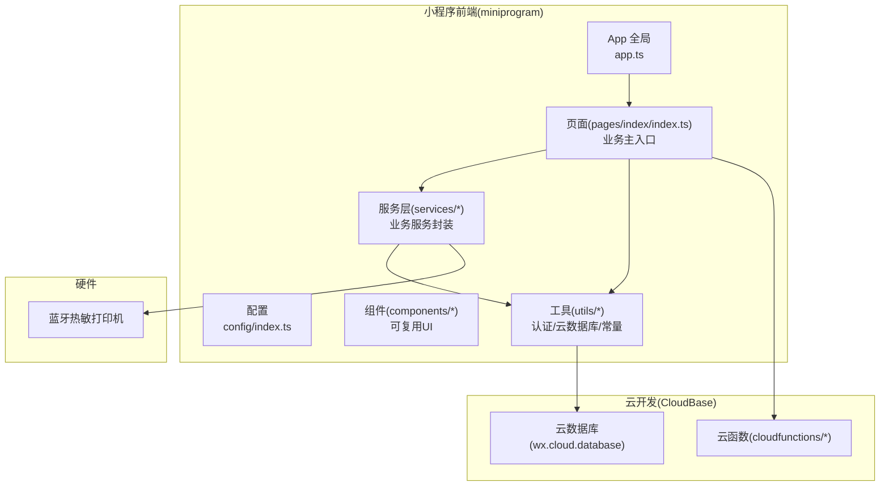
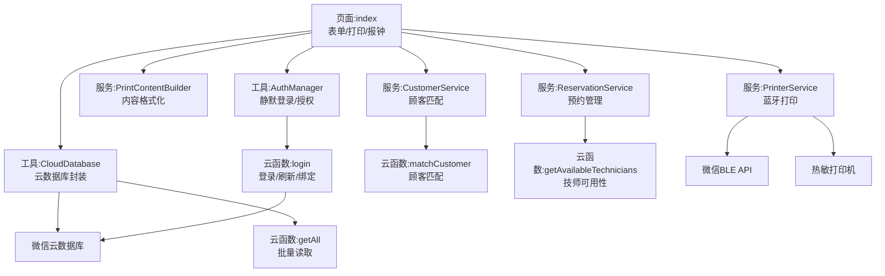
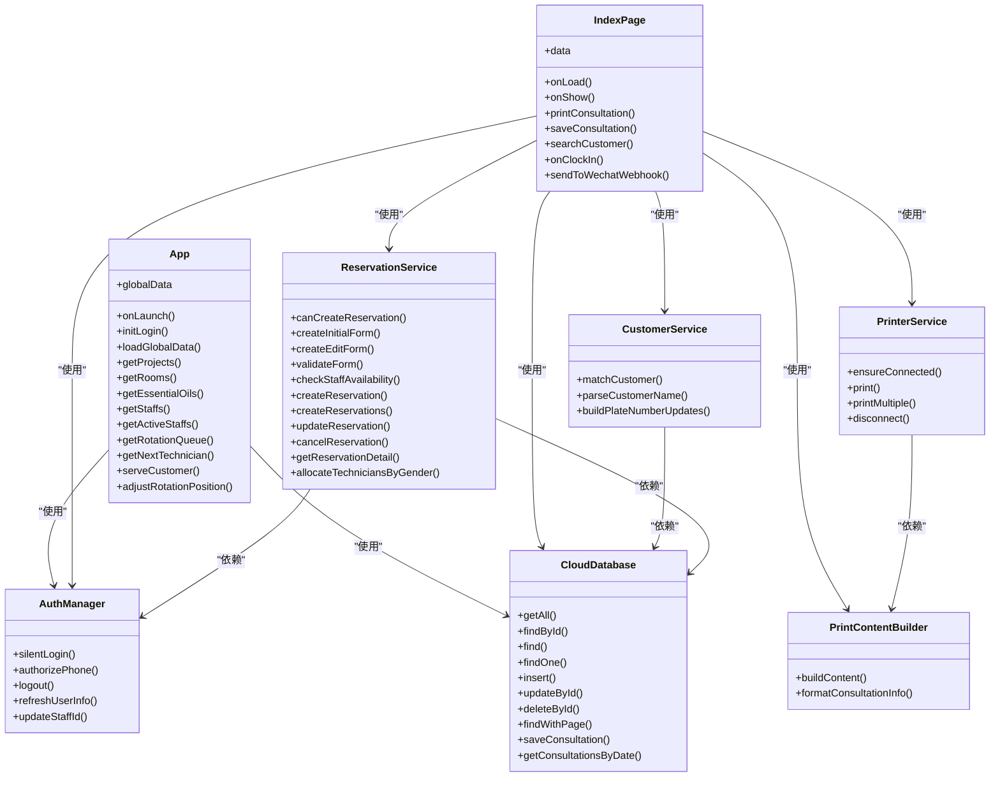
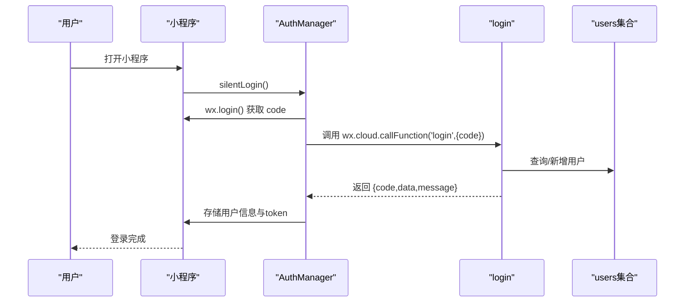
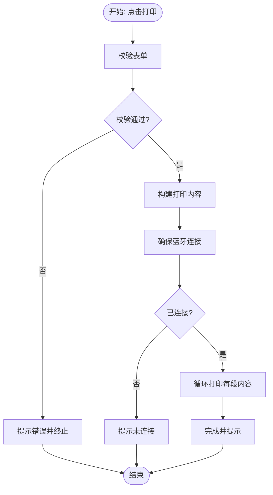
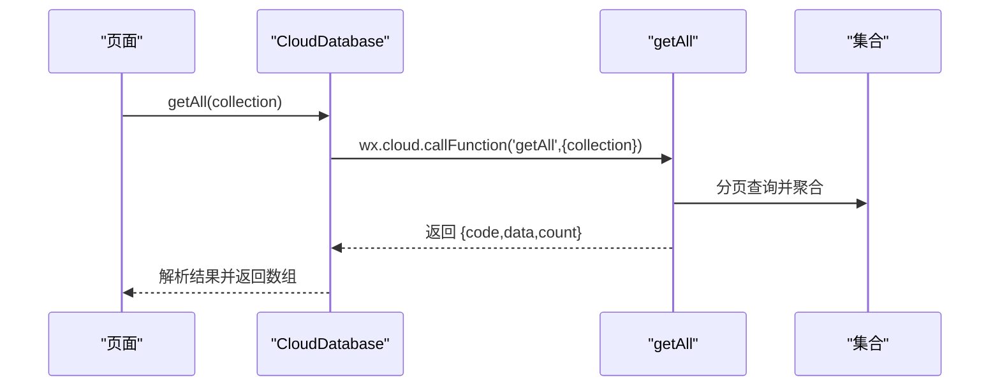
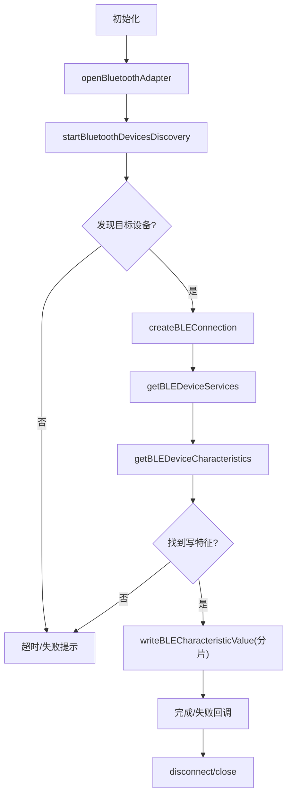
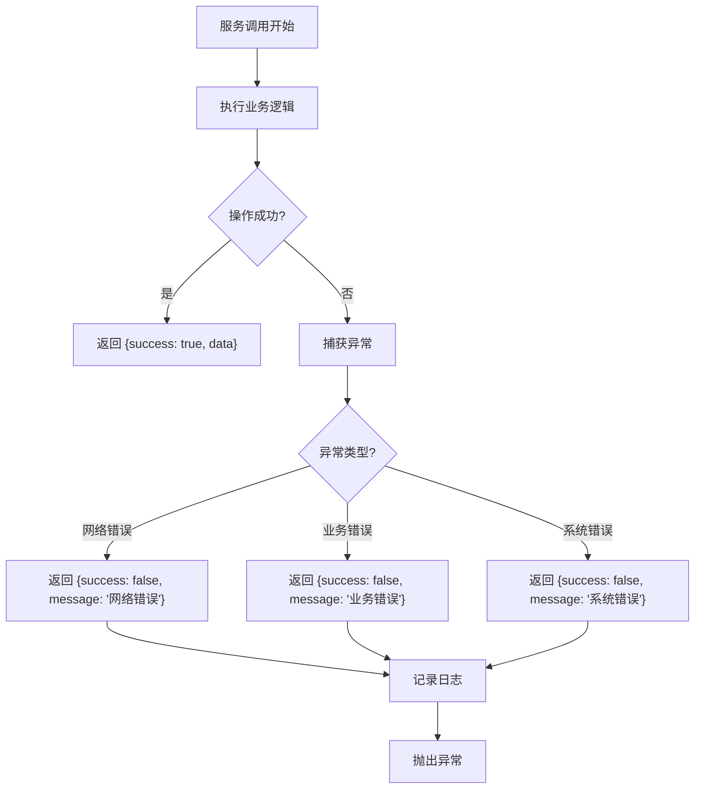
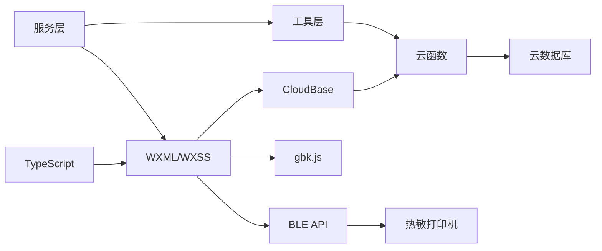
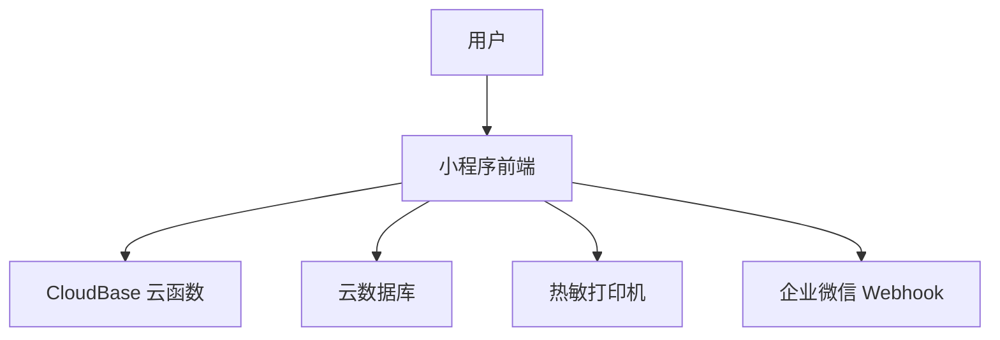

# 系统架构

<cite>
**本文档引用的文件**
- [miniprogram/app.ts](file://miniprogram/app.ts)
- [miniprogram/app.json](file://miniprogram/app.json)
- [miniprogram/config/index.ts](file://miniprogram/config/index.ts)
- [miniprogram/pages/index/index.ts](file://miniprogram/pages/index/index.ts)
- [miniprogram/utils/auth.ts](file://miniprogram/utils/auth.ts)
- [miniprogram/utils/cloud-db.ts](file://miniprogram/utils/cloud-db.ts)
- [miniprogram/services/printer-service.ts](file://miniprogram/services/printer-service.ts)
- [miniprogram/services/print-content-builder.ts](file://miniprogram/services/print-content-builder.ts)
- [miniprogram/services/customer.service.ts](file://miniprogram/services/customer.service.ts)
- [miniprogram/services/reservation.service.ts](file://miniprogram/services/reservation.service.ts)
- [miniprogram/types/reservation.types.ts](file://miniprogram/types/reservation.types.ts)
- [typings/index.d.ts](file://typings/index.d.ts)
- [typings/cloud-function.d.ts](file://typings/cloud-function.d.ts)
- [cloudfunctions/getAll/index.js](file://cloudfunctions/getAll/index.js)
- [cloudfunctions/login/index.js](file://cloudfunctions/login/index.js)
- [cloudfunctions/matchCustomer/index.js](file://cloudfunctions/matchCustomer/index.js)
- [cloudfunctions/getAvailableTechnicians/index.js](file://cloudfunctions/getAvailableTechnicians/index.js)
- [miniprogram/components/body-selector/body-selector.ts](file://miniprogram/components/body-selector/body-selector.ts)
- [miniprogram/components/navigation-bar/navigation-bar.ts](file://miniprogram/components/navigation-bar/navigation-bar.ts)
- [miniprogram/utils/constants.ts](file://miniprogram/utils/constants.ts)
- [package.json](file://package.json)
- [tsconfig.json](file://tsconfig.json)
</cite>

## 更新摘要
**所做更改**
- 新增服务层架构设计章节，详细描述统一的服务层接口和错误处理机制
- 增强了TypeScript类型定义，支持新的服务层接口和统一响应格式
- 改进了全局应用错误处理和调试能力的说明
- 更新了MVVM架构图，体现服务层的引入
- 新增服务层统一错误处理和响应格式化的流程图

## 目录
1. [引言](#引言)
2. [项目结构](#项目结构)
3. [核心组件](#核心组件)
4. [架构总览](#架构总览)
5. [详细组件分析](#详细组件分析)
6. [服务层架构设计](#服务层架构设计)
7. [依赖分析](#依赖分析)
8. [性能考虑](#性能考虑)
9. [故障排查指南](#故障排查指南)
10. [结论](#结论)
11. [附录](#附录)

## 引言
ConsultationPrinter 是一个面向 SPA 按摩门店场景的小程序应用，围绕"咨询单打印"这一核心业务闭环构建，涵盖用户认证、全局数据加载、表单与校验、预约与排班联动、云端数据持久化、以及蓝牙热敏打印机直连打印等能力。系统采用 MVVM 架构思想，通过 Page + 组件 + 服务层的分层设计实现关注点分离；前端使用 TypeScript、WXML/WXSS 进行类型安全与界面描述；后端通过云开发 CloudBase 提供云函数与云数据库；蓝牙通信通过小程序原生 BLE API 实现与热敏打印机的直连。

**更新** 新增服务层架构设计，提供统一的错误处理和响应格式化机制，增强系统的可维护性和一致性。

## 项目结构
项目采用按功能域划分的目录组织方式：
- miniprogram：小程序前端源码，包含页面、组件、服务、工具与类型定义
- cloudfunctions：云函数，封装数据库访问、登录鉴权、消息推送等后端逻辑
- cloudbase：云资源目录（容器/函数），用于托管云函数与环境配置
- typings：自定义类型声明，增强 TS 类型安全性
- 根目录配置：package.json、tsconfig.json 等工程化配置



**图表来源**
- [miniprogram/app.ts:1-191](file://miniprogram/app.ts#L1-L191)
- [miniprogram/pages/index/index.ts:1-735](file://miniprogram/pages/index/index.ts#L1-L735)
- [miniprogram/services/printer-service.ts:1-330](file://miniprogram/services/printer-service.ts#L1-L330)
- [miniprogram/utils/cloud-db.ts:1-323](file://miniprogram/utils/cloud-db.ts#L1-L323)
- [cloudfunctions/getAll/index.js:1-59](file://cloudfunctions/getAll/index.js#L1-L59)
- [cloudfunctions/login/index.js:1-180](file://cloudfunctions/login/index.js#L1-L180)

**章节来源**
- [miniprogram/app.json:1-35](file://miniprogram/app.json#L1-L35)
- [package.json:1-28](file://package.json#L1-L28)
- [tsconfig.json:1-31](file://tsconfig.json#L1-L31)

## 核心组件
- 应用全局(App)：负责静默登录、全局数据加载与共享、调用云函数进行轮牌管理
- 页面(index)：表单驱动的业务主页面，负责数据加载、校验、保存、打印、报钟、预约处理
- 服务层：
  - 打印服务(PrinterService)：蓝牙设备发现/连接/特征读取/分片写入
  - 内容构建(PrintContentBuilder)：将咨询单数据格式化为热敏打印指令
  - 顾客服务(CustomerService)：统一顾客搜索和匹配逻辑
  - 预约服务(ReservationService)：封装预约相关的核心业务逻辑
- 工具层：
  - 认证(AuthManager)：静默登录、授权、登出、刷新用户信息
  - 云数据库(CloudDatabase)：封装 getAll/find/save 等 CRUD 与分页查询
- 云函数：
  - getAll：批量拉取集合数据
  - login：基于微信 code 的登录/刷新/绑定 staffId
  - matchCustomer：顾客匹配服务
  - getAvailableTechnicians：技师可用性查询
- 组件：导航栏、身体部位选择器等可复用 UI
- 配置：应用环境 ID 等配置项

**更新** 新增服务层组件，提供统一的业务逻辑封装和错误处理机制。

**章节来源**
- [miniprogram/app.ts:1-191](file://miniprogram/app.ts#L1-L191)
- [miniprogram/pages/index/index.ts:1-735](file://miniprogram/pages/index/index.ts#L1-L735)
- [miniprogram/services/printer-service.ts:1-330](file://miniprogram/services/printer-service.ts#L1-L330)
- [miniprogram/services/print-content-builder.ts:1-98](file://miniprogram/services/print-content-builder.ts#L1-L98)
- [miniprogram/services/customer.service.ts:1-91](file://miniprogram/services/customer.service.ts#L1-L91)
- [miniprogram/services/reservation.service.ts:1-568](file://miniprogram/services/reservation.service.ts#L1-L568)
- [miniprogram/utils/auth.ts:1-249](file://miniprogram/utils/auth.ts#L1-L249)
- [miniprogram/utils/cloud-db.ts:1-323](file://miniprogram/utils/cloud-db.ts#L1-L323)
- [cloudfunctions/getAll/index.js:1-59](file://cloudfunctions/getAll/index.js#L1-L59)
- [cloudfunctions/login/index.js:1-180](file://cloudfunctions/login/index.js#L1-L180)
- [cloudfunctions/matchCustomer/index.js:1-71](file://cloudfunctions/matchCustomer/index.js#L1-L71)
- [cloudfunctions/getAvailableTechnicians/index.js:1-632](file://cloudfunctions/getAvailableTechnicians/index.js#L1-L632)
- [miniprogram/components/body-selector/body-selector.ts:1-27](file://miniprogram/components/body-selector/body-selector.ts#L1-L27)
- [miniprogram/components/navigation-bar/navigation-bar.ts:1-114](file://miniprogram/components/navigation-bar/navigation-bar.ts#L1-L114)
- [miniprogram/config/index.ts:1-18](file://miniprogram/config/index.ts#L1-L18)

## 架构总览
系统边界与交互关系如下：
- 前端小程序：MVVM 视图层(Page + 组件) + VM 逻辑层(页面逻辑 + 服务) + Model 层(工具/云函数)
- 云开发：云函数作为后端服务，云数据库作为数据存储
- 硬件：蓝牙热敏打印机通过小程序 BLE API 连接并写入字节流
- 外部：微信登录体系、企业微信 Webhook(消息推送)

**更新** 新增服务层作为VM逻辑层的重要组成部分，提供统一的业务逻辑封装。



**图表来源**
- [miniprogram/pages/index/index.ts:1-735](file://miniprogram/pages/index/index.ts#L1-L735)
- [miniprogram/services/printer-service.ts:1-330](file://miniprogram/services/printer-service.ts#L1-L330)
- [miniprogram/services/print-content-builder.ts:1-98](file://miniprogram/services/print-content-builder.ts#L1-L98)
- [miniprogram/services/customer.service.ts:1-91](file://miniprogram/services/customer.service.ts#L1-L91)
- [miniprogram/services/reservation.service.ts:1-568](file://miniprogram/services/reservation.service.ts#L1-L568)
- [miniprogram/utils/auth.ts:1-249](file://miniprogram/utils/auth.ts#L1-L249)
- [miniprogram/utils/cloud-db.ts:1-323](file://miniprogram/utils/cloud-db.ts#L1-L323)
- [cloudfunctions/getAll/index.js:1-59](file://cloudfunctions/getAll/index.js#L1-L59)
- [cloudfunctions/login/index.js:1-180](file://cloudfunctions/login/index.js#L1-L180)
- [cloudfunctions/matchCustomer/index.js:1-71](file://cloudfunctions/matchCustomer/index.js#L1-L71)
- [cloudfunctions/getAvailableTechnicians/index.js:1-632](file://cloudfunctions/getAvailableTechnicians/index.js#L1-L632)

## 详细组件分析

### MVVM 与模块化设计
- 视图层(Page + 组件)：以 WXML/WXSS 描述 UI，组件化复用导航栏、身体部位选择器等
- 逻辑层(Page + 服务)：承载业务流程，调用服务与工具，处理用户交互
- 服务层：打印服务、内容构建服务、顾客服务、预约服务，职责单一，便于测试与替换
- 工具层：认证、云数据库封装，屏蔽云函数与平台差异
- 模块化原则：按功能域拆分目录，页面/组件/服务/工具各司其职，通过显式接口交互

**更新** 服务层作为VM逻辑层的重要组成部分，提供统一的业务逻辑封装和错误处理机制。



**图表来源**
- [miniprogram/app.ts:1-191](file://miniprogram/app.ts#L1-L191)
- [miniprogram/pages/index/index.ts:1-735](file://miniprogram/pages/index/index.ts#L1-L735)
- [miniprogram/utils/auth.ts:1-249](file://miniprogram/utils/auth.ts#L1-L249)
- [miniprogram/utils/cloud-db.ts:1-323](file://miniprogram/utils/cloud-db.ts#L1-L323)
- [miniprogram/services/printer-service.ts:1-330](file://miniprogram/services/printer-service.ts#L1-L330)
- [miniprogram/services/print-content-builder.ts:1-98](file://miniprogram/services/print-content-builder.ts#L1-L98)
- [miniprogram/services/customer.service.ts:1-91](file://miniprogram/services/customer.service.ts#L1-L91)
- [miniprogram/services/reservation.service.ts:1-568](file://miniprogram/services/reservation.service.ts#L1-L568)

**章节来源**
- [miniprogram/app.ts:1-191](file://miniprogram/app.ts#L1-L191)
- [miniprogram/pages/index/index.ts:1-735](file://miniprogram/pages/index/index.ts#L1-L735)
- [miniprogram/utils/auth.ts:1-249](file://miniprogram/utils/auth.ts#L1-L249)
- [miniprogram/utils/cloud-db.ts:1-323](file://miniprogram/utils/cloud-db.ts#L1-L323)
- [miniprogram/services/printer-service.ts:1-330](file://miniprogram/services/printer-service.ts#L1-L330)
- [miniprogram/services/print-content-builder.ts:1-98](file://miniprogram/services/print-content-builder.ts#L1-L98)
- [miniprogram/services/customer.service.ts:1-91](file://miniprogram/services/customer.service.ts#L1-L91)
- [miniprogram/services/reservation.service.ts:1-568](file://miniprogram/services/reservation.service.ts#L1-L568)

### 登录与认证流程


**图表来源**
- [miniprogram/utils/auth.ts:101-130](file://miniprogram/utils/auth.ts#L101-L130)
- [cloudfunctions/login/index.js:11-90](file://cloudfunctions/login/index.js#L11-L90)

**章节来源**
- [miniprogram/utils/auth.ts:1-249](file://miniprogram/utils/auth.ts#L1-L249)
- [cloudfunctions/login/index.js:1-180](file://cloudfunctions/login/index.js#L1-L180)

### 数据加载与全局缓存
- App 在启动时尝试静默登录，并并发加载项目、房间、精油、员工等全局基础数据
- 通过 Promise 避免重复加载，提供 getProjects/getRooms/getEssentialOils/getStaffs 等方法供页面使用
- 页面首次进入时触发数据加载，减少冷启动等待

**章节来源**
- [miniprogram/app.ts:13-66](file://miniprogram/app.ts#L13-L66)

### 表单与打印流程
- 页面收集咨询单信息，进行多维校验
- 生成打印内容，调用打印服务逐段写入蓝牙特征值
- 支持单人/双人模式，分别构建打印内容并串行打印
- 成功后提示用户并刷新技师队列

**更新** 新增服务层封装，提供统一的业务逻辑和错误处理。



**图表来源**
- [miniprogram/pages/index/index.ts:263-324](file://miniprogram/pages/index/index.ts#L263-L324)
- [miniprogram/services/printer-service.ts:218-258](file://miniprogram/services/printer-service.ts#L218-L258)
- [miniprogram/services/print-content-builder.ts:31-80](file://miniprogram/services/print-content-builder.ts#L31-L80)

**章节来源**
- [miniprogram/pages/index/index.ts:1-735](file://miniprogram/pages/index/index.ts#L1-L735)
- [miniprogram/services/printer-service.ts:1-330](file://miniprogram/services/printer-service.ts#L1-L330)
- [miniprogram/services/print-content-builder.ts:1-98](file://miniprogram/services/print-content-builder.ts#L1-L98)

### 云函数与数据库交互
- getAll：分页遍历集合，聚合返回全部数据，避免一次性读取超限
- login：基于微信 code 获取 OPENID，查询/新增用户，生成 token 并返回
- matchCustomer：根据姓名、性别、手机号匹配顾客记录
- getAvailableTechnicians：计算技师可用性，支持轮牌和快速预约模式

**更新** 云函数采用统一的响应格式，提供标准化的错误处理。



**图表来源**
- [miniprogram/utils/cloud-db.ts:69-88](file://miniprogram/utils/cloud-db.ts#L69-L88)
- [cloudfunctions/getAll/index.js:9-59](file://cloudfunctions/getAll/index.js#L9-L59)

**章节来源**
- [miniprogram/utils/cloud-db.ts:1-323](file://miniprogram/utils/cloud-db.ts#L1-L323)
- [cloudfunctions/getAll/index.js:1-59](file://cloudfunctions/getAll/index.js#L1-L59)
- [cloudfunctions/login/index.js:1-180](file://cloudfunctions/login/index.js#L1-L180)
- [cloudfunctions/matchCustomer/index.js:1-71](file://cloudfunctions/matchCustomer/index.js#L1-L71)
- [cloudfunctions/getAvailableTechnicians/index.js:1-632](file://cloudfunctions/getAvailableTechnicians/index.js#L1-L632)

### 蓝牙打印服务
- 设备发现：开启适配器、扫描周边设备，按名称关键字匹配
- 连接与特征：建立 BLE 连接，枚举服务与特征，定位可写特征
- 分片写入：将内容编码为字节流，按固定长度分片连续写入，避免溢出
- 断开清理：关闭连接与适配器，清空状态

**更新** 服务层提供统一的连接管理和状态跟踪。



**图表来源**
- [miniprogram/services/printer-service.ts:50-201](file://miniprogram/services/printer-service.ts#L50-L201)

**章节来源**
- [miniprogram/services/printer-service.ts:1-330](file://miniprogram/services/printer-service.ts#L1-L330)

### 组件化架构
- 导航栏组件：支持返回、首页跳转、tabs 切换、动画显示控制
- 身体部位选择器：多选部位，触发 change 事件供父组件接收
- 统一的属性/事件契约，降低耦合，提升复用性

**章节来源**
- [miniprogram/components/navigation-bar/navigation-bar.ts:1-114](file://miniprogram/components/navigation-bar/navigation-bar.ts#L1-L114)
- [miniprogram/components/body-selector/body-selector.ts:1-27](file://miniprogram/components/body-selector/body-selector.ts#L1-L27)

## 服务层架构设计

### 服务层统一接口设计
服务层作为VM逻辑层的重要组成部分，提供统一的业务逻辑封装和错误处理机制：

- **统一响应格式**：所有服务方法返回标准化的响应对象，包含 success、data、message 等字段
- **集中错误处理**：统一捕获和处理各种异常情况，提供友好的错误信息
- **业务逻辑封装**：将复杂的业务逻辑封装在独立的服务类中，便于测试和维护
- **类型安全保障**：通过 TypeScript 提供完整的类型定义，确保接口的一致性

### 服务层类型定义增强
新增统一的云函数返回值类型定义：

```typescript
interface CloudFunctionResult<T = unknown> {
  code: number;
  message?: string;
  data?: T;
}

interface CloudCallResult<T = unknown> {
  result: CloudFunctionResult<T> | null;
  errMsg?: string;
}
```

### 服务层错误处理机制
服务层采用统一的错误处理模式：



**图表来源**
- [miniprogram/services/customer.service.ts:29-56](file://miniprogram/services/customer.service.ts#L29-L56)
- [miniprogram/services/reservation.service.ts:287-316](file://miniprogram/services/reservation.service.ts#L287-L316)

**章节来源**
- [miniprogram/services/customer.service.ts:1-91](file://miniprogram/services/customer.service.ts#L1-L91)
- [miniprogram/services/reservation.service.ts:1-568](file://miniprogram/services/reservation.service.ts#L1-L568)
- [typings/cloud-function.d.ts:1-76](file://typings/cloud-function.d.ts#L1-L76)
- [typings/index.d.ts:1-513](file://typings/index.d.ts#L1-L513)

## 依赖分析
- 技术栈与选择理由
  - TypeScript：强类型保障，提升可维护性与协作效率
  - WXML/WXSS：小程序原生视图与样式描述，生态完善
  - CloudBase：零运维、与小程序 SDK 深度集成，适合快速迭代
  - gbk.js：热敏打印字符集转换，保证中文与特殊符号正确输出
- 模块间依赖
  - 页面依赖服务与工具，服务依赖工具，工具依赖云函数与平台 API
  - 云函数依赖云数据库，形成清晰的后端抽象层
  - 服务层提供统一的业务逻辑封装，增强系统的可维护性

**更新** 新增服务层依赖关系，体现统一的业务逻辑封装。



**图表来源**
- [package.json:14-27](file://package.json#L14-L27)
- [tsconfig.json:2-22](file://tsconfig.json#L2-L22)
- [miniprogram/services/printer-service.ts:1-1](file://miniprogram/services/printer-service.ts#L1-L1)
- [miniprogram/utils/cloud-db.ts:1-47](file://miniprogram/utils/cloud-db.ts#L1-L47)

**章节来源**
- [package.json:1-28](file://package.json#L1-L28)
- [tsconfig.json:1-31](file://tsconfig.json#L1-L31)

## 性能考虑
- 并发加载：App 全局数据采用 Promise.all 并发拉取，缩短首屏等待
- 分页读取：云函数 getAll 使用分页游标遍历，避免单次读取过大
- 蓝牙写入：分片写入+延迟间隔，平衡吞吐与稳定性
- 缓存策略：全局数据加载一次后缓存，避免重复请求
- 代码质量：ESLint/Prettier 规范与格式化，减少潜在性能问题
- 服务层优化：统一的业务逻辑封装，减少重复代码，提升执行效率

**更新** 新增服务层性能优化考虑。

## 故障排查指南
- 登录失败
  - 检查 wx.login 是否成功获取 code
  - 核对云函数 login 的返回结构与错误码
  - 确认云数据库 users 集合权限与索引
- 蓝牙连接失败
  - 确认设备名称关键字匹配规则
  - 检查服务与特征是否可写
  - 观察分片写入回调与错误日志
- 打印内容异常
  - 校验 gbk.js 编码与字符映射
  - 确认热敏打印机支持的指令集
- 数据加载为空
  - 检查 getAll 云函数集合名与权限
  - 核对 App 全局数据加载 Promise 状态
- 服务层调用失败
  - 检查服务方法的返回格式是否符合预期
  - 查看控制台错误日志和网络请求状态
  - 确认云函数的响应格式和错误码

**更新** 新增服务层故障排查指导。

**章节来源**
- [miniprogram/utils/auth.ts:101-130](file://miniprogram/utils/auth.ts#L101-L130)
- [cloudfunctions/login/index.js:11-90](file://cloudfunctions/login/index.js#L11-L90)
- [miniprogram/services/printer-service.ts:50-201](file://miniprogram/services/printer-service.ts#L50-L201)
- [miniprogram/utils/cloud-db.ts:69-88](file://miniprogram/utils/cloud-db.ts#L69-L88)
- [miniprogram/services/customer.service.ts:29-56](file://miniprogram/services/customer.service.ts#L29-L56)
- [miniprogram/services/reservation.service.ts:287-316](file://miniprogram/services/reservation.service.ts#L287-L316)

## 结论
ConsultationPrinter 以 MVVM 为核心，结合组件化与模块化设计，实现了从表单采集、数据校验、云端持久化到蓝牙打印的完整业务闭环。前端采用 TypeScript 与小程序原生框架，后端依托 CloudBase 云函数与数据库，蓝牙打印通过分片写入保障稳定性。**更新** 新增服务层架构设计，提供统一的错误处理和响应格式化机制，增强了系统的可维护性和一致性。该架构具备良好的可扩展性与可维护性，便于后续接入更多业务场景与硬件设备。

## 附录
- 系统上下文图


- 部署拓扑说明
  - 小程序前端：通过微信公众平台发布，运行于微信客户端
  - 云函数：在 CloudBase 中部署，按需触发
  - 云数据库：与小程序同环境，按集合权限访问
  - 蓝牙打印：依赖用户手机蓝牙与热敏打印机，无额外服务器

**图表来源**
- [miniprogram/app.json:23-23](file://miniprogram/app.json#L23-L23)
- [miniprogram/config/index.ts:6-14](file://miniprogram/config/index.ts#L6-L14)

**章节来源**
- [miniprogram/app.json:1-35](file://miniprogram/app.json#L1-L35)
- [miniprogram/config/index.ts:1-18](file://miniprogram/config/index.ts#L1-L18)