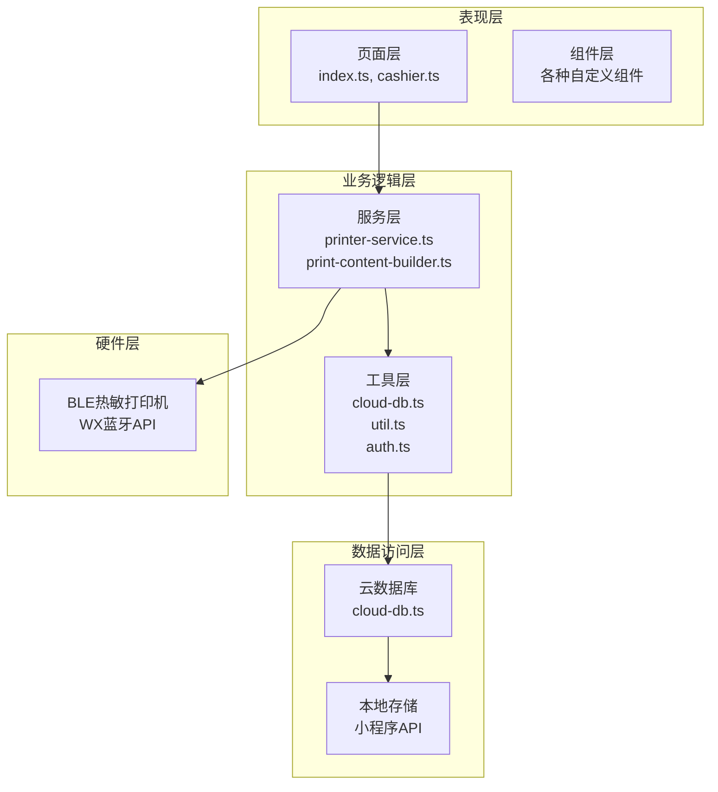
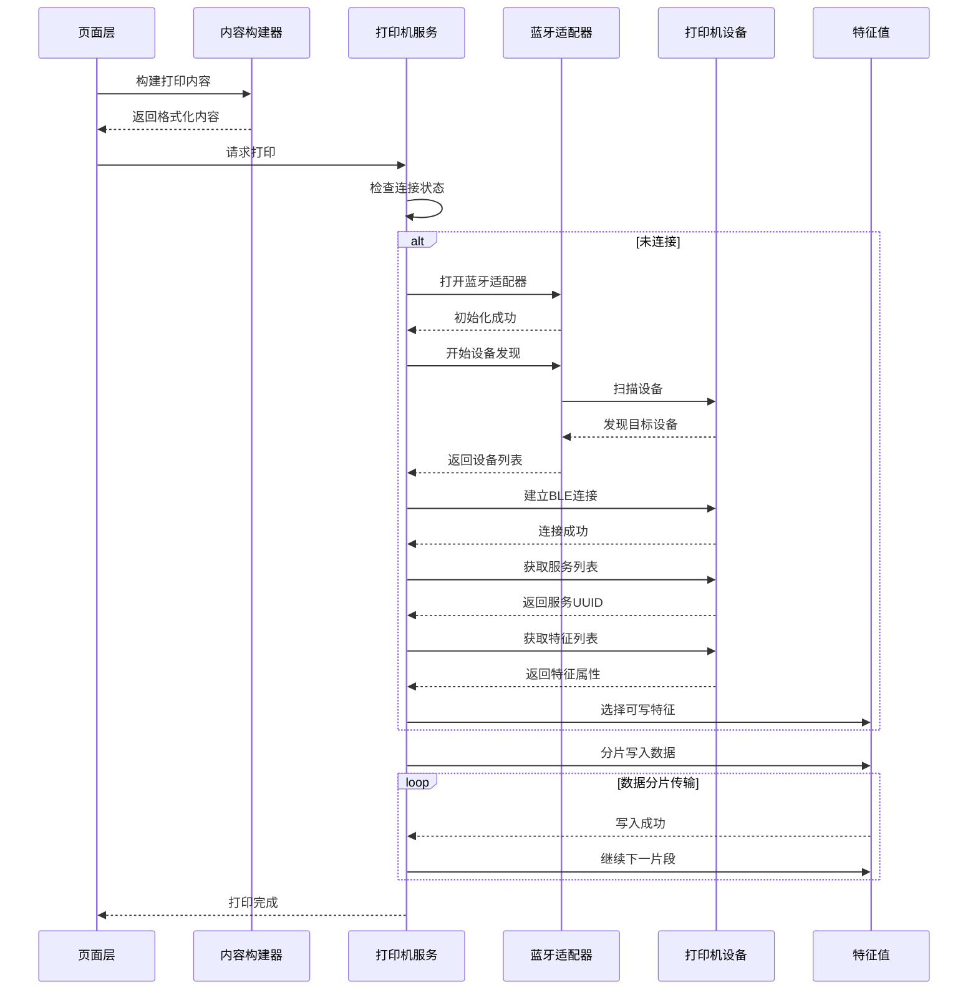
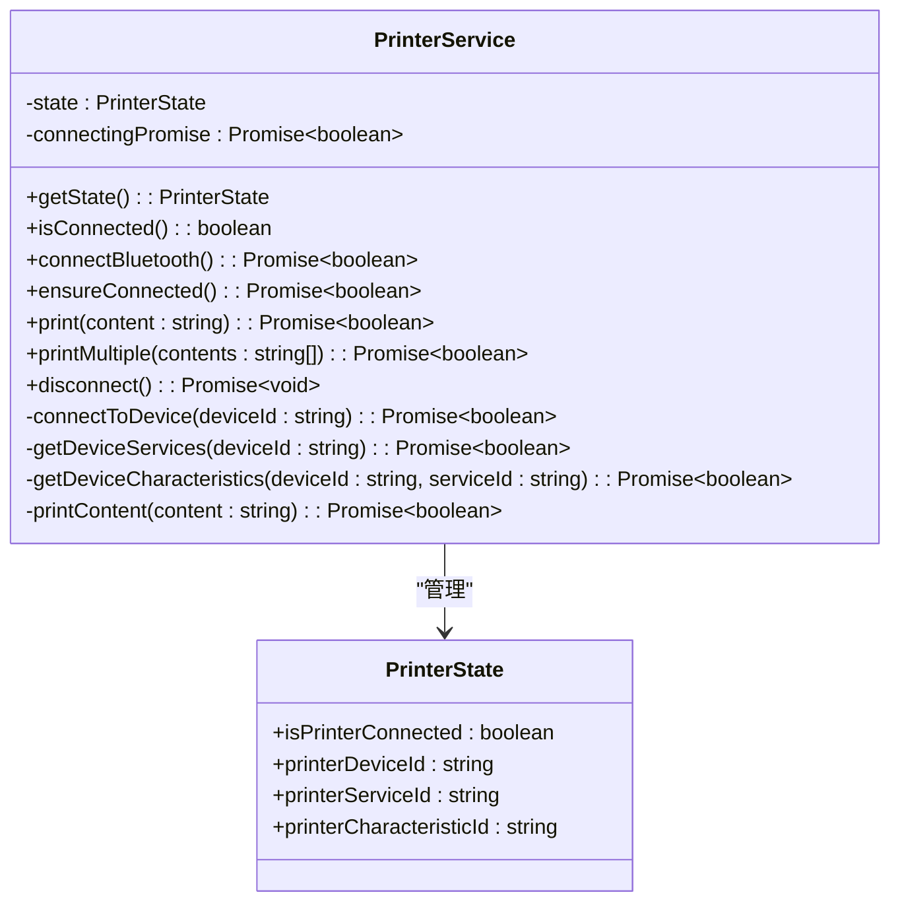
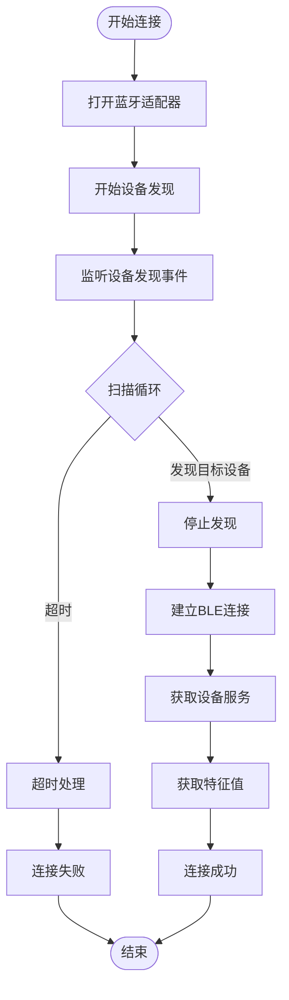
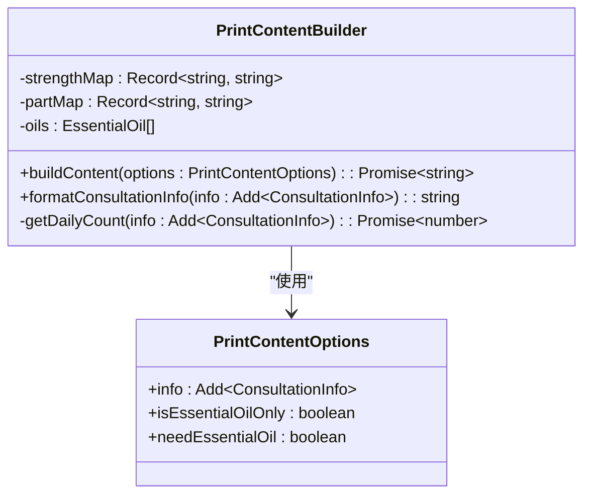
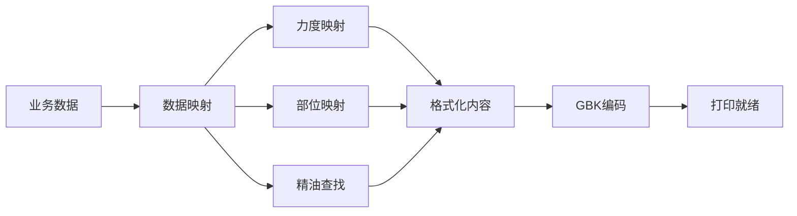
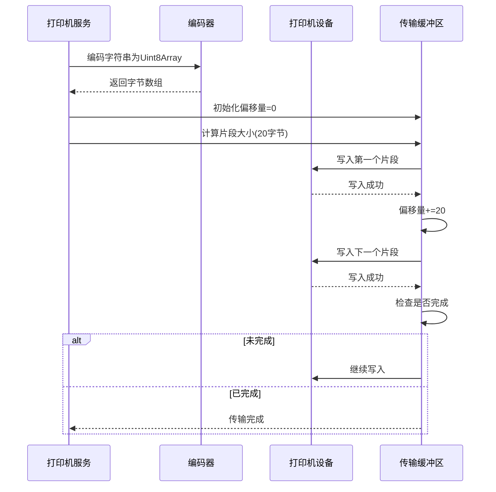
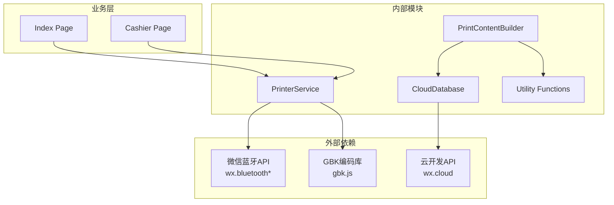
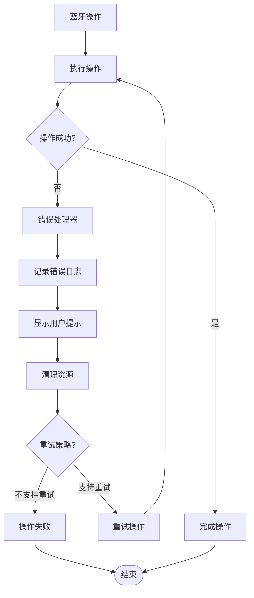

# 蓝牙通信架构

<cite>
**本文档引用的文件**
- [printer-service.ts](file://miniprogram/services/printer-service.ts)
- [print-content-builder.ts](file://miniprogram/services/print-content-builder.ts)
- [index.ts](file://miniprogram/pages/index/index.ts)
- [cashier.ts](file://miniprogram/pages/cashier/cashier.ts)
- [cloud-db.ts](file://miniprogram/utils/cloud-db.ts)
- [util.ts](file://miniprogram/utils/util.ts)
- [app.ts](file://miniprogram/app.ts)
- [index.d.ts](file://typings/types/wx/index.d.ts)
- [index.js](file://miniprogram/miniprogram_npm/gbk.js/index.js)
</cite>

## 目录
1. [简介](#简介)
2. [项目结构](#项目结构)
3. [核心组件](#核心组件)
4. [架构概览](#架构概览)
5. [详细组件分析](#详细组件分析)
6. [依赖关系分析](#依赖关系分析)
7. [性能考虑](#性能考虑)
8. [故障排除指南](#故障排除指南)
9. [结论](#结论)

## 简介

ConsultationPrinter项目是一个基于微信小程序的SPA按摩咨询管理系统，集成了蓝牙热敏打印机功能。本文档详细说明了项目的蓝牙通信架构，包括BLE设备连接流程、特征值读写机制、数据传输协议、打印内容构建策略以及错误处理机制。

该项目采用模块化设计，通过专门的服务层管理蓝牙通信，通过内容构建器生成符合热敏打印机格式要求的文本内容，并通过GBK编码确保中文字符的正确传输。

## 项目结构

项目采用典型的微信小程序三层架构：

**图表来源**
- [printer-service.ts](file://miniprogram/services/printer-service.ts#L1-L298)
- [print-content-builder.ts](file://miniprogram/services/print-content-builder.ts#L1-L144)
- [index.ts](file://miniprogram/pages/index/index.ts#L1-L735)

**章节来源**
- [printer-service.ts](file://miniprogram/services/printer-service.ts#L1-L298)
- [print-content-builder.ts](file://miniprogram/services/print-content-builder.ts#L1-L144)

## 核心组件

### 打印机服务组件

PrinterService是整个蓝牙通信的核心组件，负责管理BLE设备的完整生命周期：

- **设备发现与连接**：自动扫描并连接指定类型的打印机设备
- **服务与特征管理**：动态获取设备服务和可写特征
- **数据传输控制**：实现分片传输和错误处理
- **状态管理**：维护连接状态和设备信息

### 内容构建器组件

PrintContentBuilder负责生成符合热敏打印机格式要求的内容：

- **格式化策略**：使用ESC/POS指令控制字体大小和格式
- **数据映射**：将业务数据转换为打印内容
- **字符编码**：通过GBK编码确保中文字符正确显示
- **动态内容**：支持双人模式和个性化定制

**章节来源**
- [printer-service.ts](file://miniprogram/services/printer-service.ts#L10-L298)
- [print-content-builder.ts](file://miniprogram/services/print-content-builder.ts#L10-L144)

## 架构概览

项目采用事件驱动的异步架构，通过Promise链式调用管理复杂的蓝牙操作流程：

**图表来源**
- [printer-service.ts](file://miniprogram/services/printer-service.ts#L31-L180)
- [index.ts](file://miniprogram/pages/index/index.ts#L263-L324)

## 详细组件分析

### 打印机服务类分析

PrinterService类实现了完整的BLE设备管理功能：

**图表来源**
- [printer-service.ts](file://miniprogram/services/printer-service.ts#L2-L298)

#### 连接状态管理

服务使用内部状态对象管理连接信息，包括设备ID、服务ID和特征ID：

- **状态验证**：`isConnected()`方法确保所有必要标识符都存在
- **连接保护**：`ensureConnected()`防止重复连接尝试
- **资源清理**：`disconnect()`方法优雅关闭所有连接

#### 设备发现流程

**图表来源**
- [printer-service.ts](file://miniprogram/services/printer-service.ts#L31-L180)

**章节来源**
- [printer-service.ts](file://miniprogram/services/printer-service.ts#L10-L298)

### 内容构建器类分析

PrintContentBuilder类专注于生成符合热敏打印机格式的内容：

**图表来源**
- [print-content-builder.ts](file://miniprogram/services/print-content-builder.ts#L4-L144)

#### ESC/POS指令格式化

内容构建器使用ESC/POS指令控制打印格式：

- **字体控制**：`ESC + "!" + String.fromCharCode(0x30)`设置大字体
- **格式标记**：使用特殊字符控制换行和分隔线
- **中文支持**：通过GBK编码确保中文字符正确显示

#### 数据映射策略

**图表来源**
- [print-content-builder.ts](file://miniprogram/services/print-content-builder.ts#L31-L80)

**章节来源**
- [print-content-builder.ts](file://miniprogram/services/print-content-builder.ts#L10-L144)

### 数据传输协议

项目实现了可靠的分片传输协议来处理大量打印数据：

**图表来源**
- [printer-service.ts](file://miniprogram/services/printer-service.ts#L235-L269)

#### 传输参数配置

- **分片大小**：20字节（符合热敏打印机特性）
- **传输间隔**：20毫秒（避免缓冲区溢出）
- **重试机制**：单次失败立即终止传输
- **进度跟踪**：通过偏移量监控传输进度

**章节来源**
- [printer-service.ts](file://miniprogram/services/printer-service.ts#L235-L269)

## 依赖关系分析

项目采用松耦合的设计模式，各组件间通过清晰的接口交互：

**图表来源**
- [printer-service.ts](file://miniprogram/services/printer-service.ts#L1-L2)
- [print-content-builder.ts](file://miniprogram/services/print-content-builder.ts#L1-L2)

### 外部API集成

项目主要依赖以下微信小程序API：

- **蓝牙API**：`wx.openBluetoothAdapter()`, `wx.createBLEConnection()`, `wx.writeBLECharacteristicValue()`
- **云开发API**：`wx.cloud.database()`用于数据持久化
- **定时器API**：`setTimeout()`和`setInterval()`用于异步操作

### 内部模块依赖

- **printer-service.ts**依赖**gbk.js**进行字符编码转换
- **print-content-builder.ts**依赖**cloud-db.ts**和**util.ts**获取业务数据
- **页面组件**通过**app.ts**获取全局数据和业务逻辑

**章节来源**
- [printer-service.ts](file://miniprogram/services/printer-service.ts#L1-L298)
- [print-content-builder.ts](file://miniprogram/services/print-content-builder.ts#L1-L144)

## 性能考虑

### 传输优化策略

1. **分片传输优化**
   - 20字节分片大小经过测试验证，适合大多数热敏打印机
   - 20毫秒间隔平衡了传输速度和稳定性
   - 异步写入避免阻塞主线程

2. **内存管理**
   - 使用Uint8Array减少内存占用
   - 及时释放事件监听器避免内存泄漏
   - 连接断开时清理所有状态信息

3. **并发控制**
   - `connectingPromise`防止重复连接请求
   - 打印队列顺序执行避免数据竞争
   - 超时机制及时释放资源

### 错误处理机制

项目实现了多层次的错误处理：

**图表来源**
- [printer-service.ts](file://miniprogram/services/printer-service.ts#L31-L90)

### 用户体验优化

- **加载状态管理**：使用`wx.showLoading()`提供明确的用户反馈
- **超时处理**：10秒设备发现超时避免长时间等待
- **状态同步**：实时更新连接状态和设备信息

**章节来源**
- [printer-service.ts](file://miniprogram/services/printer-service.ts#L31-L90)

## 故障排除指南

### 常见问题及解决方案

#### 蓝牙设备连接失败

**症状**：设备发现超时或连接建立失败

**可能原因**：
1. 蓝牙适配器初始化失败
2. 目标设备不在范围内
3. 设备名称不符合识别规则

**解决步骤**：
1. 检查设备名称是否包含"Printer"或"打印机"
2. 确保设备处于可发现状态
3. 重启蓝牙适配器后重试

#### 特征值获取失败

**症状**：无法找到可写特征值

**可能原因**：
1. 设备不支持写入操作
2. 服务UUID获取失败
3. 权限不足

**解决步骤**：
1. 验证设备支持的BLE服务
2. 检查设备文档确认特征权限
3. 确认小程序具有蓝牙权限

#### 打印内容乱码

**症状**：打印出的中文字符显示异常

**可能原因**：
1. 字符编码转换错误
2. 打印机不支持GBK编码
3. 编码库加载失败

**解决步骤**：
1. 验证GBK编码库正常工作
2. 检查打印内容是否包含不可转换字符
3. 尝试简化打印内容测试

### 调试技巧

1. **日志记录**：在关键节点添加console.log输出
2. **状态监控**：定期检查PrinterState对象
3. **网络诊断**：验证云开发API调用是否成功
4. **设备测试**：使用多台不同型号的打印机测试兼容性

**章节来源**
- [printer-service.ts](file://miniprogram/services/printer-service.ts#L31-L180)

## 结论

ConsultationPrinter项目的蓝牙通信架构展现了现代小程序开发的最佳实践：

1. **模块化设计**：清晰的职责分离使代码易于维护和扩展
2. **异步处理**：完善的Promise链式调用确保用户体验流畅
3. **错误处理**：多层次的错误处理机制提高了系统稳定性
4. **性能优化**：合理的传输策略和资源管理保证了高效运行

该架构为类似的企业级应用提供了良好的参考模板，特别是在蓝牙设备集成、数据格式化和用户界面交互方面都有值得借鉴的设计思路。通过持续的测试和优化，该系统能够稳定支持SPA按摩行业的日常运营需求。