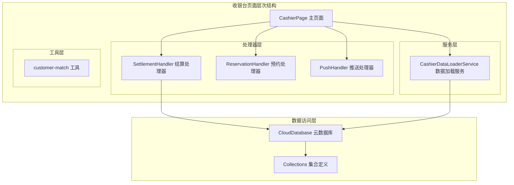
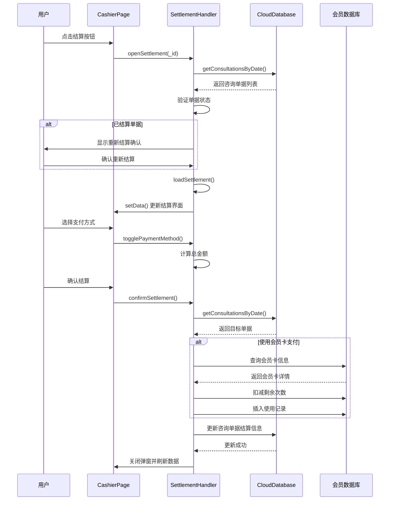
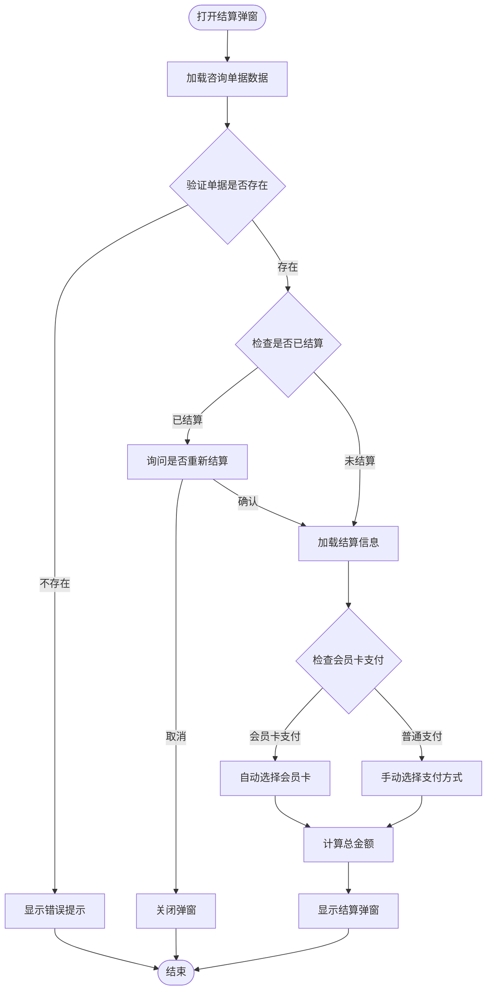
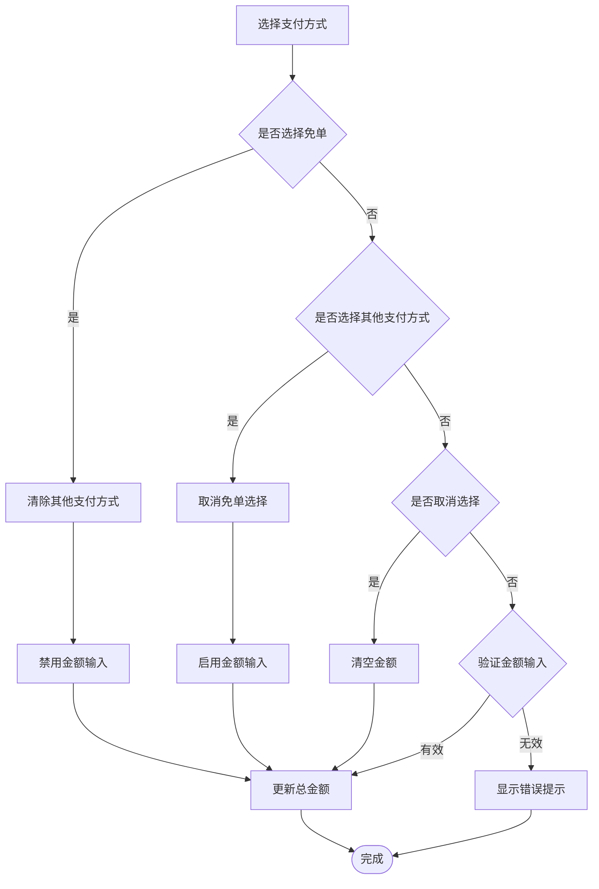
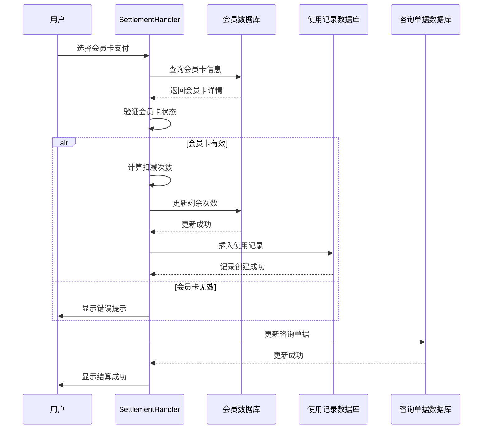
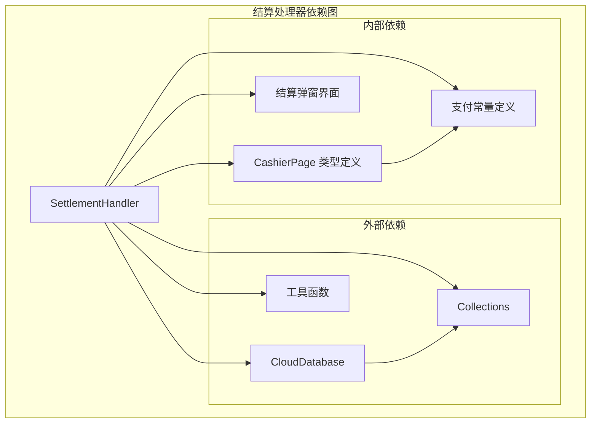

# 结算处理器

<cite>
**本文档引用的文件**
- [settlement.handler.ts](file://miniprogram/pages/cashier/handlers/settlement.handler.ts)
- [cashier.ts](file://miniprogram/pages/cashier/cashier.ts)
- [cashier.types.ts](file://miniprogram/pages/cashier/cashier.types.ts)
- [cashier.wxml](file://miniprogram/pages/cashier/cashier.wxml)
- [data-loader.service.ts](file://miniprogram/pages/cashier/services/data-loader.service.ts)
- [cloud-db.ts](file://miniprogram/utils/cloud-db.ts)
- [constants.ts](file://miniprogram/utils/constants.ts)
- [index.d.ts](file://typings/index.d.ts)
</cite>

## 目录
1. [简介](#简介)
2. [项目结构](#项目结构)
3. [核心组件](#核心组件)
4. [架构概览](#架构概览)
5. [详细组件分析](#详细组件分析)
6. [依赖关系分析](#依赖关系分析)
7. [性能考虑](#性能考虑)
8. [故障排除指南](#故障排除指南)
9. [结论](#结论)

## 简介

结算处理器是咨询按摩管理系统中的核心功能模块，负责处理咨询单据的结算流程。该模块实现了完整的支付管理、会员卡扣减、多平台支付支持等功能，为收银台页面提供专业的结算解决方案。

系统支持多种支付方式，包括美团、大众点评、抖音、微信、支付宝、现金、高德等第三方平台支付，以及免单和会员卡支付功能。结算处理器通过模块化设计，与收银台主页面和其他业务模块紧密集成。

## 项目结构

结算处理器位于收银台页面的模块化架构中，采用分层设计模式：

**图表来源**
- [cashier.ts](file://miniprogram/pages/cashier/cashier.ts#L136-L141)
- [settlement.handler.ts](file://miniprogram/pages/cashier/handlers/settlement.handler.ts#L8-L13)
- [cloud-db.ts](file://miniprogram/utils/cloud-db.ts#L301-L320)

**章节来源**
- [cashier.ts](file://miniprogram/pages/cashier/cashier.ts#L1-L408)
- [settlement.handler.ts](file://miniprogram/pages/cashier/handlers/settlement.handler.ts#L1-L293)

## 核心组件

### SettlementHandler 结算处理器

SettlementHandler 是结算功能的核心实现类，负责处理所有与结算相关的业务逻辑：

**主要职责：**
- 打开和管理结算弹窗
- 处理支付方式选择和验证
- 管理会员卡扣减逻辑
- 执行结算确认流程
- 更新数据库记录

**关键特性：**
- 支持组合支付（多种支付方式同时使用）
- 自动计算实收总额
- 智能支付方式切换逻辑
- 会员卡余额验证和扣减

### 支付方式管理

系统支持9种不同的支付方式，每种支付方式都有特定的处理逻辑：

| 支付方式 | 键值 | 特性 | 验证规则 |
|---------|------|------|----------|
| 美团 | meituan | 第三方平台 | 金额必须大于0 |
| 大众点评 | dianping | 第三方平台 | 金额必须大于0 |
| 抖音 | douyin | 第三方平台 | 金额必须大于0 |
| 微信 | wechat | 第三方平台 | 金额必须大于0 |
| 支付宝 | alipay | 第三方平台 | 金额必须大于0 |
| 现金 | cash | 现金支付 | 金额必须大于0 |
| 高德 | gaode | 第三方平台 | 金额必须大于0 |
| 免单 | free | 特殊支付 | 无需金额输入 |
| 会员卡 | membership | 会员支付 | 次数验证 |

**章节来源**
- [cashier.types.ts](file://miniprogram/pages/cashier/cashier.types.ts#L3-L9)
- [cashier.ts](file://miniprogram/pages/cashier/cashier.ts#L66-L76)
- [constants.ts](file://miniprogram/utils/constants.ts#L12-L22)

## 架构概览

结算处理器采用事件驱动的架构模式，通过页面数据绑定和事件处理实现松耦合的设计：

**图表来源**
- [settlement.handler.ts](file://miniprogram/pages/cashier/handlers/settlement.handler.ts#L18-L51)
- [settlement.handler.ts](file://miniprogram/pages/cashier/handlers/settlement.handler.ts#L192-L291)

**章节来源**
- [settlement.handler.ts](file://miniprogram/pages/cashier/handlers/settlement.handler.ts#L1-L293)

## 详细组件分析

### 结算弹窗管理

结算弹窗是用户交互的核心界面，提供了直观的结算操作体验：

**图表来源**
- [settlement.handler.ts](file://miniprogram/pages/cashier/handlers/settlement.handler.ts#L56-L99)

### 支付方式切换逻辑

支付方式切换是结算处理器的重要功能，实现了智能的支付组合管理：

**图表来源**
- [settlement.handler.ts](file://miniprogram/pages/cashier/handlers/settlement.handler.ts#L127-L157)

### 会员卡支付处理

会员卡支付是结算系统的核心功能之一，实现了完整的会员消费管理：

**图表来源**
- [settlement.handler.ts](file://miniprogram/pages/cashier/handlers/settlement.handler.ts#L242-L276)

**章节来源**
- [settlement.handler.ts](file://miniprogram/pages/cashier/handlers/settlement.handler.ts#L1-L293)

## 依赖关系分析

结算处理器与其他系统组件存在紧密的依赖关系：

**图表来源**
- [settlement.handler.ts](file://miniprogram/pages/cashier/handlers/settlement.handler.ts#L2-L4)
- [cashier.types.ts](file://miniprogram/pages/cashier/cashier.types.ts#L84-L103)
- [constants.ts](file://miniprogram/utils/constants.ts#L1-L49)

**章节来源**
- [cloud-db.ts](file://miniprogram/utils/cloud-db.ts#L301-L320)
- [cashier.types.ts](file://miniprogram/pages/cashier/cashier.types.ts#L1-L104)

## 性能考虑

结算处理器在设计时充分考虑了性能优化：

### 数据加载优化
- 使用并行数据加载减少等待时间
- 缓存全局项目数据避免重复请求
- 智能的数据更新策略

### 内存管理
- 合理的组件生命周期管理
- 及时清理事件监听器
- 避免内存泄漏

### 网络请求优化
- 批量数据库操作
- 智能的错误重试机制
- 连接池管理

## 故障排除指南

### 常见问题及解决方案

**问题1：结算失败**
- 检查网络连接状态
- 验证支付金额的有效性
- 确认会员卡余额充足

**问题2：会员卡扣减异常**
- 检查会员卡状态是否有效
- 验证剩余次数是否足够
- 确认会员卡与顾客信息匹配

**问题3：支付方式选择异常**
- 检查免单与其他支付方式的互斥逻辑
- 验证金额输入格式
- 确认支付方式状态

**章节来源**
- [settlement.handler.ts](file://miniprogram/pages/cashier/handlers/settlement.handler.ts#L286-L290)

## 结论

结算处理器作为咨询按摩管理系统的核心功能模块，实现了专业、可靠的结算管理能力。通过模块化设计和清晰的架构分离，系统具备了良好的可维护性和扩展性。

主要优势包括：
- 完整的支付方式支持
- 智能的业务逻辑处理
- 用户友好的界面设计
- 稳定可靠的数据管理
- 良好的性能表现

未来可以考虑的功能增强：
- 更多支付方式的支持
- 结算报表生成功能
- 异常处理和监控机制
- 移动端优化改进