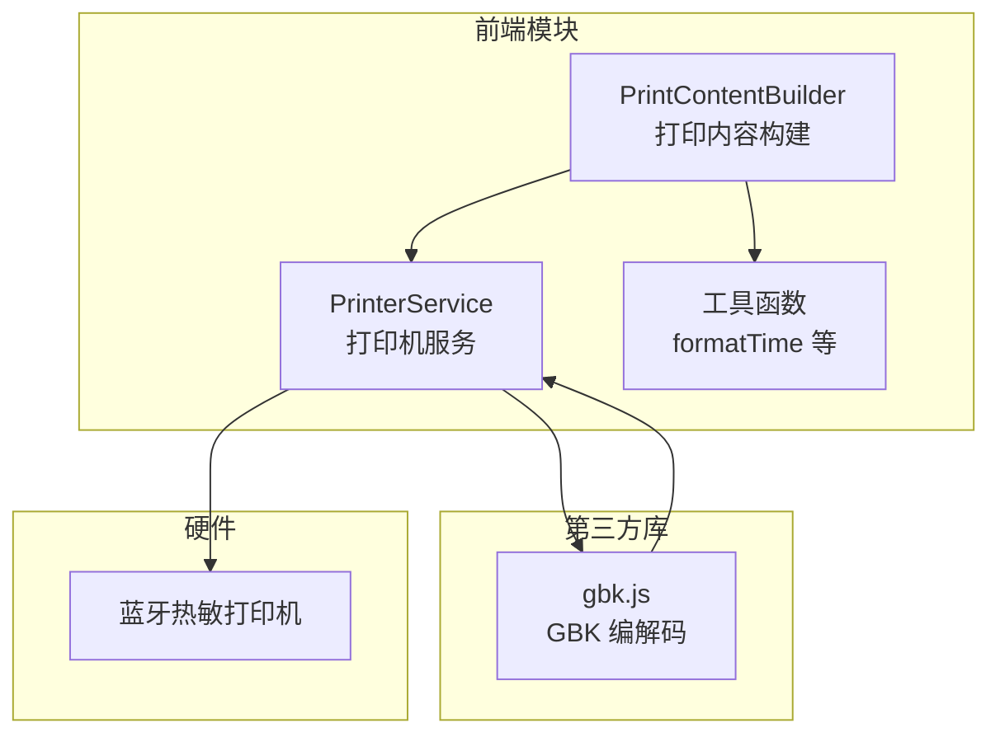
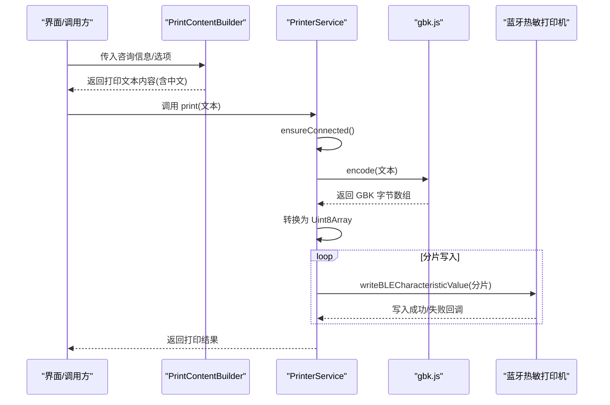
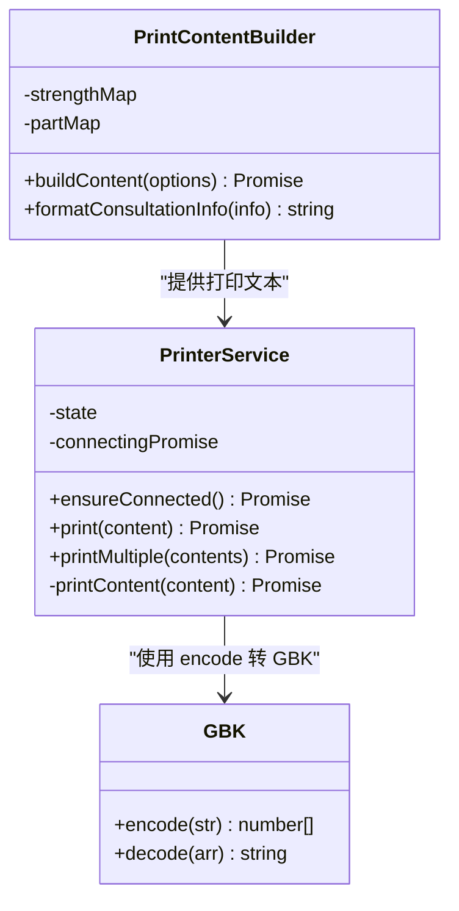
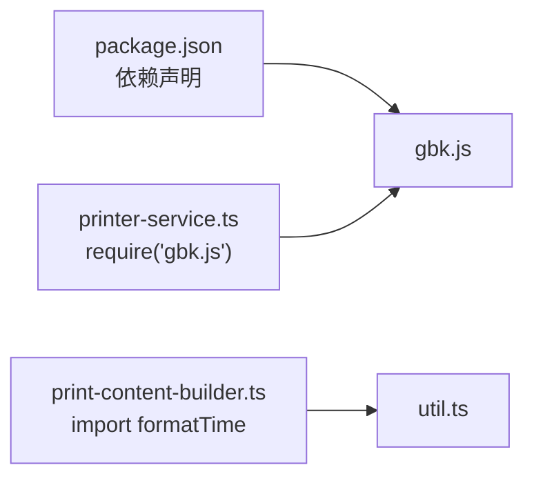
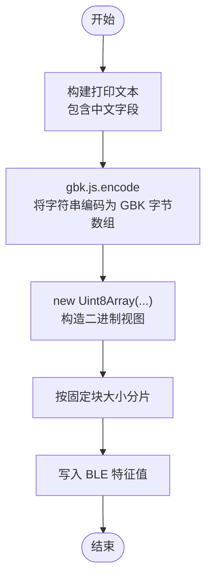

# 字符编码处理

<cite>
**本文引用的文件**
- [miniprogram/services/print-content-builder.ts](file://miniprogram/services/print-content-builder.ts)
- [miniprogram/services/printer-service.ts](file://miniprogram/services/printer-service.ts)
- [miniprogram/utils/util.ts](file://miniprogram/utils/util.ts)
- [miniprogram/miniprogram_npm/gbk.js/index.js](file://miniprogram/miniprogram_npm/gbk.js/index.js)
- [package.json](file://package.json)
</cite>

## 目录
1. [引言](#引言)
2. [项目结构](#项目结构)
3. [核心组件](#核心组件)
4. [架构总览](#架构总览)
5. [详细组件分析](#详细组件分析)
6. [依赖关系分析](#依赖关系分析)
7. [性能考虑](#性能考虑)
8. [故障排查指南](#故障排查指南)
9. [结论](#结论)
10. [附录](#附录)

## 引言
本文件围绕“字符编码处理”主题，系统梳理本项目在中文打印场景下对字符编码的实现与应用，重点解释 gbk.js 库在将 Unicode 文本转换为 GBK 编码以适配蓝牙热敏打印机方面的关键作用，并给出从 Unicode 到 GBK 的转换流程、二进制处理机制（Uint8Array）以及在多语言环境下（简体中文为主）的最佳实践与性能优化建议。

## 项目结构
本项目采用小程序前端架构，涉及打印内容构建、蓝牙打印机通信与字符编码转换三个层面：
- 打印内容构建：负责生成面向打印机的文本内容（含中文字段），并进行基础格式化。
- 打印机服务：负责蓝牙设备发现、连接、特征值获取与数据分片写入。
- 字符编码：通过 gbk.js 将字符串编码为 GBK 字节序列，再封装为 Uint8Array 传输。

图表来源
- [miniprogram/services/print-content-builder.ts](file://miniprogram/services/print-content-builder.ts#L31-L80)
- [miniprogram/services/printer-service.ts](file://miniprogram/services/printer-service.ts#L197-L269)
- [miniprogram/miniprogram_npm/gbk.js/index.js](file://miniprogram/miniprogram_npm/gbk.js/index.js#L1-L136)

章节来源
- [miniprogram/services/print-content-builder.ts](file://miniprogram/services/print-content-builder.ts#L1-L144)
- [miniprogram/services/printer-service.ts](file://miniprogram/services/printer-service.ts#L1-L298)
- [miniprogram/utils/util.ts](file://miniprogram/utils/util.ts#L1-L150)
- [package.json](file://package.json#L25-L27)

## 核心组件
- 打印内容构建器（PrintContentBuilder）
  - 负责将咨询信息（姓名、性别、项目、技师、房间、力度、精油、加强部位、备注等）拼接为面向打印机的文本。
  - 使用中文字段（如“先生/女士”、“标准/轻柔/重力”、“头部/颈部/肩部/后背/手臂/腹部/腰部/大腿/小腿”）。
- 打印机服务（PrinterService）
  - 负责蓝牙设备发现、连接、服务与特征值获取。
  - 在打印阶段调用 gbk.js 将字符串编码为 GBK 字节流，并以 Uint8Array 分片写入打印机。
- gbk.js
  - 提供 encode/decode 方法，将 JavaScript 字符串与 GBK 字节序列互转。
  - 本项目仅使用其 encode 功能，将 Unicode 文本转换为 GBK 字节序列。

章节来源
- [miniprogram/services/print-content-builder.ts](file://miniprogram/services/print-content-builder.ts#L31-L80)
- [miniprogram/services/printer-service.ts](file://miniprogram/services/printer-service.ts#L197-L269)
- [miniprogram/miniprogram_npm/gbk.js/index.js](file://miniprogram/miniprogram_npm/gbk.js/index.js#L14-L62)

## 架构总览
下面的序列图展示了从“构建打印内容”到“发送到打印机”的完整流程，包括字符编码转换与二进制传输的关键步骤。

图表来源
- [miniprogram/services/print-content-builder.ts](file://miniprogram/services/print-content-builder.ts#L31-L80)
- [miniprogram/services/printer-service.ts](file://miniprogram/services/printer-service.ts#L197-L269)
- [miniprogram/miniprogram_npm/gbk.js/index.js](file://miniprogram/miniprogram_npm/gbk.js/index.js#L40-L58)

## 详细组件分析

### 组件一：打印内容构建器（PrintContentBuilder）
- 职责
  - 将咨询信息映射为面向打印机的文本，包含中文字段（如“先生/女士”、“标准/轻柔/重力”、“头部/颈部/肩部/后背/手臂/腹部/腰部/大腿/小腿”）。
  - 支持是否需要精油、是否仅显示精油等选项。
- 关键点
  - 中文字段直接拼接到字符串中，后续由 gbk.js 进行编码转换。
  - 时间格式化使用工具函数 formatTime，确保打印时间可读性。

章节来源
- [miniprogram/services/print-content-builder.ts](file://miniprogram/services/print-content-builder.ts#L31-L80)
- [miniprogram/utils/util.ts](file://miniprogram/utils/util.ts#L3-L11)

### 组件二：打印机服务（PrinterService）
- 职责
  - 蓝牙设备发现与连接。
  - 获取服务与写入特征值，完成数据写入。
  - 核心打印逻辑：将字符串编码为 GBK 字节，封装为 Uint8Array 并分片写入。
- 关键实现
  - 字符编码：调用 gbk.js.encode，返回字节数组。
  - 二进制处理：new Uint8Array(...) 构造视图，按固定块大小（chunkSize=20）分片发送。
  - 错误处理：写入失败时提示“打印失败”，并返回 false；连接失败时提示相应错误。

章节来源
- [miniprogram/services/printer-service.ts](file://miniprogram/services/printer-service.ts#L197-L269)

### 组件三：gbk.js 编解码器
- 职责
  - 提供 encode/decode 方法，将 JavaScript 字符串与 GBK 字节序列互转。
- 实现要点
  - encode：遍历字符串字符，ASCII 小于 0x80 的直接保留；否则查表定位 GBK 码位，输出双字节 GBK 序列；不支持字符以占位符替代。
  - decode：根据 GBK 双字节规则还原为 Unicode 字符串。
- 在本项目中的使用
  - 仅使用 encode，将打印文本转换为 GBK 字节序列，随后转换为 Uint8Array 发送。

章节来源
- [miniprogram/miniprogram_npm/gbk.js/index.js](file://miniprogram/miniprogram_npm/gbk.js/index.js#L14-L62)

### 类关系图（代码级）

图表来源
- [miniprogram/services/print-content-builder.ts](file://miniprogram/services/print-content-builder.ts#L10-L141)
- [miniprogram/services/printer-service.ts](file://miniprogram/services/printer-service.ts#L10-L295)
- [miniprogram/miniprogram_npm/gbk.js/index.js](file://miniprogram/miniprogram_npm/gbk.js/index.js#L14-L62)

## 依赖关系分析
- 依赖声明
  - 项目通过 package.json 声明对 gbk.js 的依赖，版本范围为 ^0.3.0。
- 模块导入
  - 打印机服务在顶部引入 gbk.js，用于编码转换。
- 间接依赖
  - 打印内容构建器依赖工具函数 formatTime 输出打印时间。

图表来源
- [package.json](file://package.json#L25-L27)
- [miniprogram/services/printer-service.ts](file://miniprogram/services/printer-service.ts#L1-L1)
- [miniprogram/services/print-content-builder.ts](file://miniprogram/services/print-content-builder.ts#L1-L2)

章节来源
- [package.json](file://package.json#L25-L27)
- [miniprogram/services/printer-service.ts](file://miniprogram/services/printer-service.ts#L1-L1)
- [miniprogram/services/print-content-builder.ts](file://miniprogram/services/print-content-builder.ts#L1-L2)

## 性能考虑
- 分片写入策略
  - 固定块大小（chunkSize=20）分片发送，避免一次性写入过大导致缓冲区溢出或写入失败。
  - 每次写入后设置短延迟（setTimeout），确保设备端有足够时间处理上一片段。
- 编码效率
  - gbk.js 的 encode 采用线性扫描与查找表匹配，适合小到中等长度文本；对于超长文本可考虑预切分或批量处理。
- 内存占用
  - Uint8Array 直接基于内存缓冲区，避免中间字符串对象的额外开销；但需注意大文本时的内存峰值。
- 连接稳定性
  - ensureConnected 防止重复连接；连接失败时及时提示，减少无效尝试。

章节来源
- [miniprogram/services/printer-service.ts](file://miniprogram/services/printer-service.ts#L235-L269)

## 故障排查指南
- 打印失败
  - 现象：写入特征值失败，弹出“打印失败”提示。
  - 排查：确认打印机处于连接状态、服务与特征值正确获取；检查分片大小与写入间隔是否合理。
- 中文乱码
  - 现象：打印内容出现问号或乱码。
  - 排查：确认使用 gbk.js.encode 转换；检查 gbk.js 版本与兼容性；确保文本中不含 gbk.js 无法映射的字符。
- 连接失败
  - 现象：蓝牙初始化失败、未找到打印机、未找到写入特征。
  - 排查：检查蓝牙权限与设备可用性；确认设备名包含“Printer/打印机”关键词；确认目标服务与特征值存在且具备 write 属性。
- 多联单打印
  - 现象：多联单打印时第二张及以后失败。
  - 排查：检查 printMultiple 是否在每次打印之间等待；确认写入回调成功后再继续下一片段。

章节来源
- [miniprogram/services/printer-service.ts](file://miniprogram/services/printer-service.ts#L31-L91)
- [miniprogram/services/printer-service.ts](file://miniprogram/services/printer-service.ts#L145-L180)
- [miniprogram/services/printer-service.ts](file://miniprogram/services/printer-service.ts#L210-L233)

## 结论
本项目通过 gbk.js 将 Unicode 文本转换为 GBK 字节序列，并以 Uint8Array 分片写入蓝牙热敏打印机，实现了中文打印的稳定路径。PrintContentBuilder 负责生成包含中文字段的打印文本，PrinterService 负责蓝牙连接与数据传输，二者配合确保了中文打印的正确性与可靠性。针对性能与稳定性，建议在超长文本场景下进一步优化分片策略与错误重试机制。

## 附录

### 字符编码转换流程（从 Unicode 到 GBK）

图表来源
- [miniprogram/services/print-content-builder.ts](file://miniprogram/services/print-content-builder.ts#L31-L80)
- [miniprogram/services/printer-service.ts](file://miniprogram/services/printer-service.ts#L235-L269)
- [miniprogram/miniprogram_npm/gbk.js/index.js](file://miniprogram/miniprogram_npm/gbk.js/index.js#L40-L58)

### 不同语言环境下的编码处理最佳实践
- 仅中文场景
  - 使用 gbk.js.encode 即可满足中文打印需求，无需额外 ICU 或国际化库。
- 混合字符
  - 对于 ASCII 与中文混合的文本，gbk.js 会保留 ASCII 并对中文进行 GBK 映射；若遇到 gbk.js 未覆盖的字符，将被替换为占位符，请在业务层提前清洗或替换。
- 多语言/国际化
  - 若未来需要支持英文、日文、韩文等，建议评估打印机固件对多字符集的支持能力；必要时采用 UTF-8 并在设备侧做字符集切换，或改用支持更广字符集的打印协议。

### 性能优化建议
- 合理分片大小
  - 根据设备特性调整 chunkSize，平衡吞吐与稳定性。
- 预处理文本
  - 对超长文本进行预切分，降低单次编码与传输压力。
- 错误重试与退避
  - 在写入失败时增加指数退避与最大重试次数，提升鲁棒性。
- 内存管理
  - 大文本打印完成后及时释放 Uint8Array 视图，避免内存泄漏。