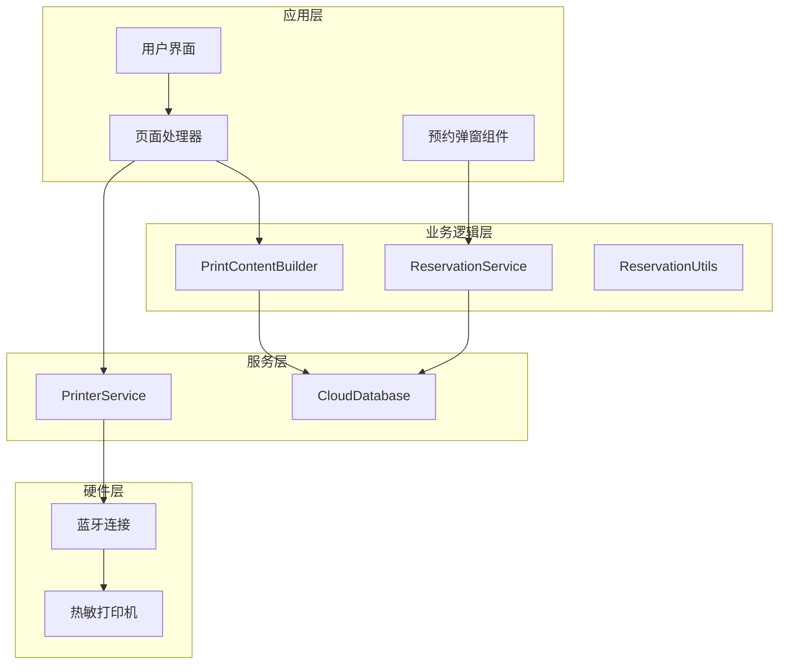
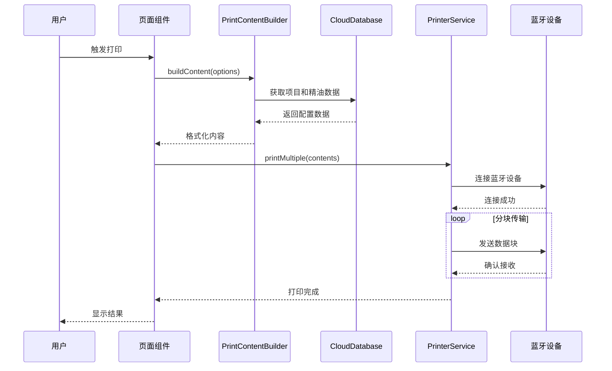
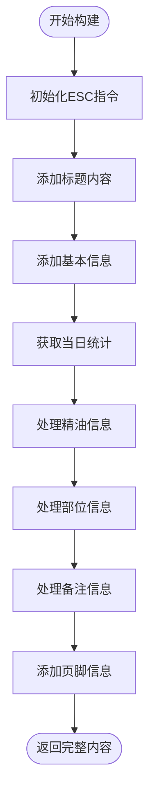
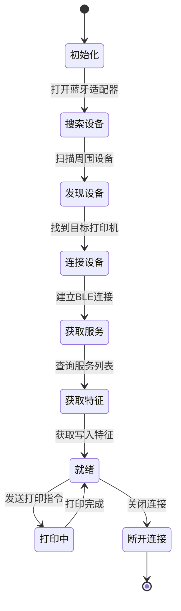
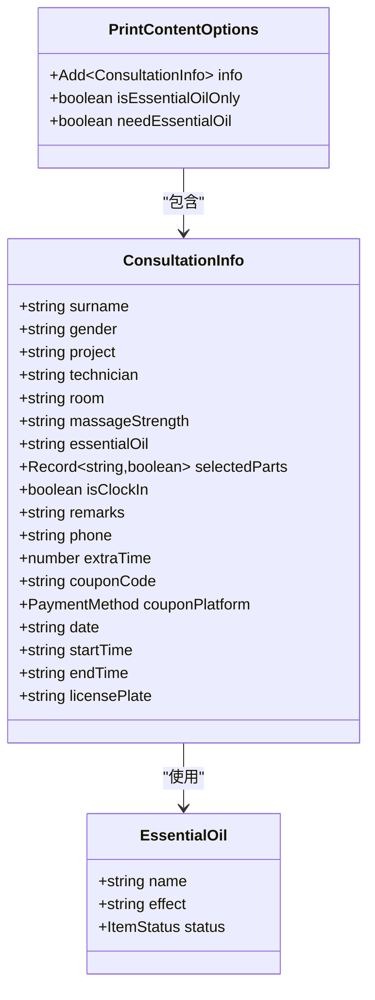
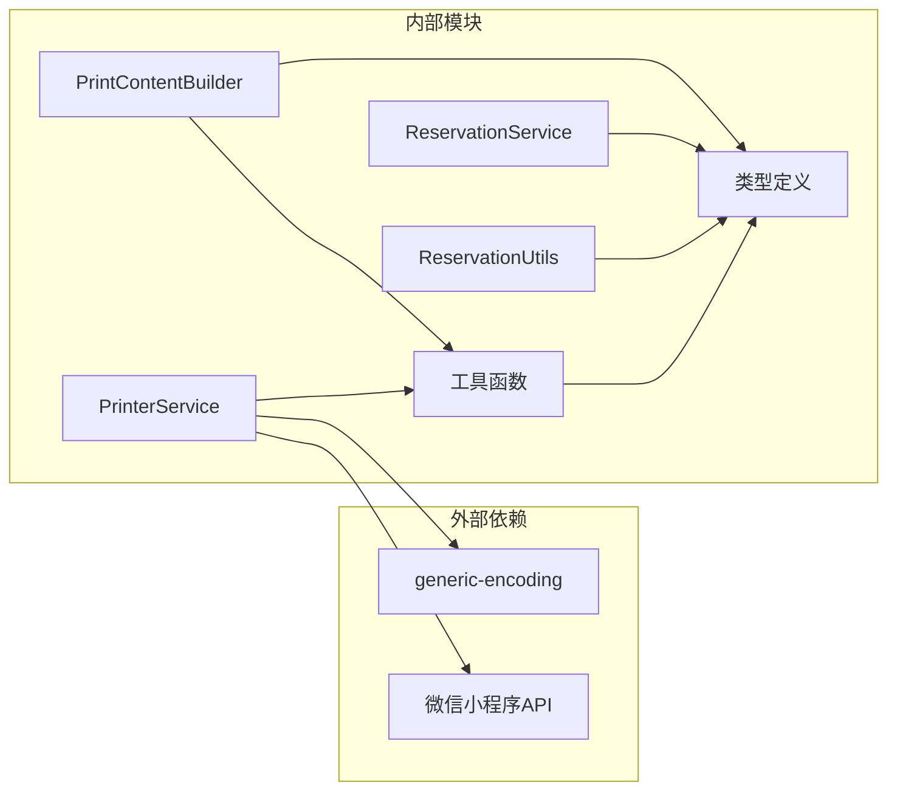
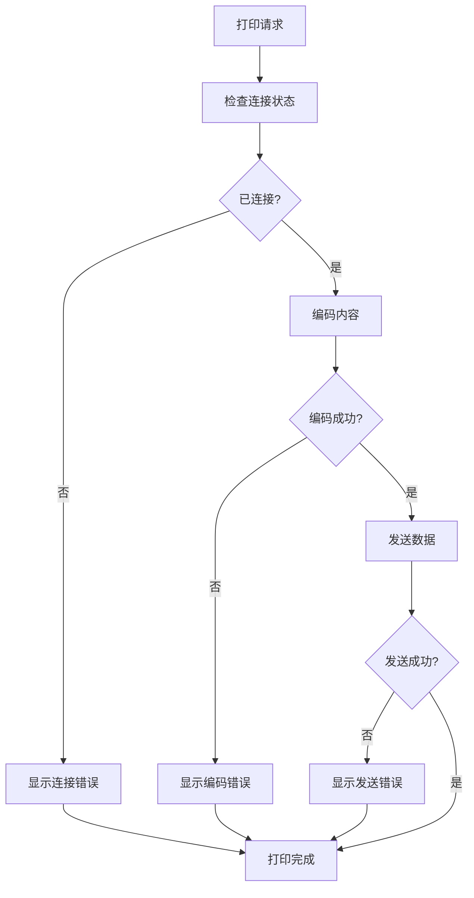

# 打印内容格式化系统

<cite>
**本文档引用的文件**
- [print-content-builder.ts](file://miniprogram/services/print-content-builder.ts)
- [printer-service.ts](file://miniprogram/services/printer-service.ts)
- [util.ts](file://miniprogram/utils/util.ts)
- [cloud-db.ts](file://miniprogram/utils/cloud-db.ts)
- [index.ts](file://miniprogram/pages/index/index.ts)
- [index.d.ts](file://typings/index.d.ts)
- [reservation.service.ts](file://miniprogram/services/reservation.service.ts)
- [reservation.types.ts](file://miniprogram/types/reservation.types.ts)
</cite>

## 更新摘要
**所做更改**
- 更新了服务范围说明，反映系统专注于预约工作流程的打印内容生成
- 移除了咨询信息格式化功能的相关描述
- 更新了架构概览以体现当前的实际服务范围
- 修改了依赖关系分析以反映实际的组件交互
- 更新了故障排除指南以匹配当前的功能范围

## 目录
1. [简介](#简介)
2. [项目结构](#项目结构)
3. [核心组件](#核心组件)
4. [架构概览](#架构概览)
5. [详细组件分析](#详细组件分析)
6. [依赖关系分析](#依赖关系分析)
7. [性能考虑](#性能考虑)
8. [故障排除指南](#故障排除指南)
9. [结论](#结论)

## 简介

打印内容格式化系统是一个专为SPA按摩店设计的微信小程序打印解决方案。该系统通过PrintContentBuilder类将预约工作流程数据转换为标准ESC/POS指令格式，结合PrinterService实现蓝牙热敏打印机的连接和数据传输。系统支持多种打印模板、格式化选项和错误处理机制，能够满足专业SPA场所的预约工作流程打印需求。

**重要更新**：系统现已专注于预约工作流程的打印内容生成，移除了咨询信息格式化功能，专门服务于SPA按摩店的预约管理和工作流程打印需求。

## 项目结构

系统采用模块化架构，主要分为以下层次：

**图表来源**
- [print-content-builder.ts](file://miniprogram/services/print-content-builder.ts#L10-L98)
- [printer-service.ts](file://miniprogram/services/printer-service.ts#L10-L330)
- [reservation.service.ts](file://miniprogram/services/reservation.service.ts#L196-L477)

**章节来源**
- [print-content-builder.ts](file://miniprogram/services/print-content-builder.ts#L1-L98)
- [printer-service.ts](file://miniprogram/services/printer-service.ts#L1-L330)

## 核心组件

### PrintContentBuilder类

PrintContentBuilder是系统的核心组件，负责将预约工作流程数据转换为可打印的格式化内容。

**主要特性：**
- ESC/POS指令生成
- 中文字符支持
- 动态内容构建
- 数据映射和转换

**关键方法：**
- `buildContent()`: 主要内容构建方法
- `getDailyCount()`: 获取当日工作量统计

**更新**：移除了咨询信息格式化功能，专注于预约工作流程的打印内容生成。

**章节来源**
- [print-content-builder.ts](file://miniprogram/services/print-content-builder.ts#L10-L98)

### PrinterService类

PrinterService管理蓝牙打印机的连接和数据传输。

**主要功能：**
- 蓝牙设备发现和连接
- ESC/POS指令发送
- 分块传输优化
- 错误处理和状态管理

**章节来源**
- [printer-service.ts](file://miniprogram/services/printer-service.ts#L10-L330)

### ReservationService类

ReservationService管理预约相关业务逻辑。

**主要功能：**
- 预约数据管理
- 预约状态更新
- 技师分配逻辑
- 预约取消和编辑

**章节来源**
- [reservation.service.ts](file://miniprogram/services/reservation.service.ts#L196-L477)

## 架构概览

系统采用分层架构设计，专注于预约工作流程的打印内容生成：

**图表来源**
- [index.ts](file://miniprogram/pages/index/index.ts#L270-L329)
- [print-content-builder.ts](file://miniprogram/services/print-content-builder.ts#L31-L80)
- [printer-service.ts](file://miniprogram/services/printer-service.ts#L231-L258)

## 详细组件分析

### PrintContentBuilder详细分析

#### 内容构建策略

PrintContentBuilder采用"指令+内容"的混合策略，专注于预约工作流程的打印：

**图表来源**
- [print-content-builder.ts](file://miniprogram/services/print-content-builder.ts#L31-L80)

#### 格式化逻辑实现

系统实现了多种格式化功能：

**文本对齐和布局：**
- 使用等号字符创建分隔线
- 通过换行符控制垂直布局
- 字体大小通过ESC指令控制

**数据映射机制：**
- 力度映射：`strengthMap`将英文强度值映射为中文
- 部位映射：`partMap`将身体部位代码转换为中文描述
- 性别映射：自动根据性别选择称谓

**更新**：移除了咨询信息格式化功能，专注于预约工作流程的数据格式化。

**章节来源**
- [print-content-builder.ts](file://miniprogram/services/print-content-builder.ts#L11-L27)
- [print-content-builder.ts](file://miniprogram/services/print-content-builder.ts#L31-L80)

### PrinterService详细分析

#### 蓝牙连接管理

PrinterService实现了完整的蓝牙设备生命周期管理：

**图表来源**
- [printer-service.ts](file://miniprogram/services/printer-service.ts#L50-L216)

#### 分块传输策略

为了适应蓝牙传输限制，系统采用分块传输机制：

**传输参数：**
- 块大小：20字节
- 传输间隔：20毫秒
- 延迟间隔：500毫秒（多页打印）

**章节来源**
- [printer-service.ts](file://miniprogram/services/printer-service.ts#L260-L301)

### 数据模型和类型定义

系统使用TypeScript强类型定义确保数据完整性：

**图表来源**
- [index.d.ts](file://typings/index.d.ts#L37-L83)
- [index.d.ts](file://typings/index.d.ts#L206-L210)

**章节来源**
- [index.d.ts](file://typings/index.d.ts#L37-L83)
- [index.d.ts](file://typings/index.d.ts#L206-L210)

## 依赖关系分析

系统依赖关系清晰，遵循单一职责原则：

**图表来源**
- [printer-service.ts](file://miniprogram/services/printer-service.ts#L1)
- [print-content-builder.ts](file://miniprogram/services/print-content-builder.ts#L1-L2)

**章节来源**
- [printer-service.ts](file://miniprogram/services/printer-service.ts#L1)
- [print-content-builder.ts](file://miniprogram/services/print-content-builder.ts#L1-L2)

## 性能考虑

### 传输优化策略

1. **分块传输优化**
   - 20字节块大小避免缓冲区溢出
   - 20毫秒间隔平衡传输速度和稳定性
   - 500毫秒延迟处理多页打印场景

2. **内存管理**
   - 使用Uint8Array减少内存占用
   - 异步处理避免阻塞主线程
   - 及时释放连接资源

3. **网络优化**
   - 缓存精油数据减少数据库查询
   - 异步获取统计数据避免UI阻塞

### 错误处理机制

系统实现了多层次的错误处理：

**图表来源**
- [printer-service.ts](file://miniprogram/services/printer-service.ts#L203-L258)

## 故障排除指南

### 常见问题及解决方案

**连接问题：**
- 确保蓝牙适配器正常工作
- 检查打印机电源和连接状态
- 重新启动蓝牙服务

**传输问题：**
- 检查数据编码是否正确
- 验证分块传输是否完整
- 确认打印机内存充足

**内容格式问题：**
- 检查中文字符编码设置
- 验证ESC指令格式
- 确认字体大小设置

**更新**：移除了咨询信息相关的故障排除项，专注于预约工作流程的打印问题。

**章节来源**
- [printer-service.ts](file://miniprogram/services/printer-service.ts#L50-L112)
- [printer-service.ts](file://miniprogram/services/printer-service.ts#L203-L258)

## 结论

打印内容格式化系统通过精心设计的架构和实现，为SPA按摩店提供了可靠的预约工作流程打印解决方案。系统的主要优势包括：

1. **模块化设计**：清晰的职责分离便于维护和扩展
2. **强类型支持**：TypeScript类型定义确保数据完整性
3. **性能优化**：分块传输和异步处理提升用户体验
4. **错误处理**：完善的异常处理机制提高系统稳定性
5. **专注性强**：专门服务于预约工作流程的打印需求

**更新**：系统现已专注于预约工作流程的打印内容生成，移除了咨询信息格式化功能，为SPA按摩店的预约管理和工作流程提供了更加专业和集中的打印解决方案。其设计理念和架构模式可以应用于其他行业的小程序打印解决方案，特别是在预约管理场景中。