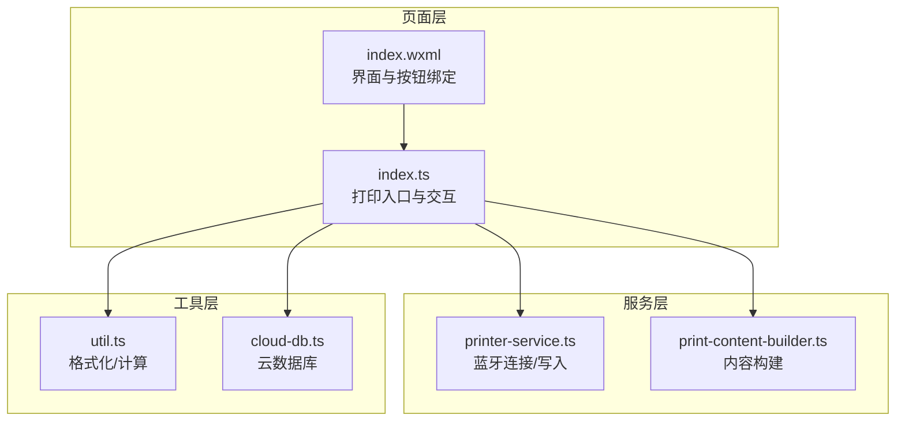
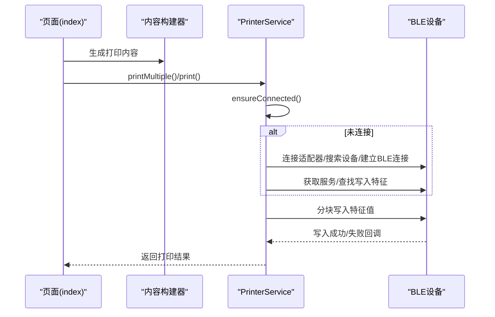
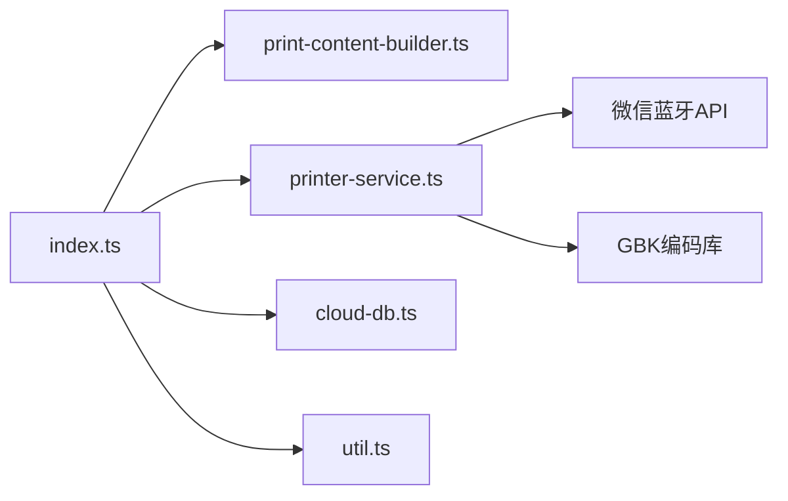

# 打印数据传输

<cite>
**本文引用的文件**
- [printer-service.ts](file://miniprogram/services/printer-service.ts)
- [print-content-builder.ts](file://miniprogram/services/print-content-builder.ts)
- [index.ts](file://miniprogram/pages/index/index.ts)
- [index.wxml](file://miniprogram/pages/index/index.wxml)
- [util.ts](file://miniprogram/utils/util.ts)
- [cloud-db.ts](file://miniprogram/utils/cloud-db.ts)
</cite>

## 目录
1. [简介](#简介)
2. [项目结构](#项目结构)
3. [核心组件](#核心组件)
4. [架构总览](#架构总览)
5. [详细组件分析](#详细组件分析)
6. [依赖关系分析](#依赖关系分析)
7. [性能考量](#性能考量)
8. [故障排查指南](#故障排查指南)
9. [结论](#结论)
10. [附录](#附录)

## 简介
本技术文档围绕“打印数据传输”功能展开，重点解析以下方面：
- printContent() 方法的数据传输机制与分块策略
- BLE 写入特征值的使用方法与数据包大小限制
- chunkSize 参数的选择原则与性能优化策略
- 异步数据传输的实现方式与错误重传机制
- 打印超时处理、连接中断恢复等异常情况的处理方案
- 数据传输的性能监控与调试方法
- 与硬件设备的兼容性考虑

## 项目结构
该功能由三层协作构成：
- 页面层：负责触发打印流程，收集用户输入并生成打印内容
- 服务层：封装蓝牙连接、特征发现与数据写入逻辑
- 工具层：提供内容构建、时间格式化、云数据库访问等辅助能力

图表来源
- [index.ts](file://miniprogram/pages/index/index.ts#L263-L324)
- [printer-service.ts](file://miniprogram/services/printer-service.ts#L197-L269)
- [print-content-builder.ts](file://miniprogram/services/print-content-builder.ts#L31-L80)
- [util.ts](file://miniprogram/utils/util.ts#L1-L150)
- [cloud-db.ts](file://miniprogram/utils/cloud-db.ts#L1-L321)

章节来源
- [index.ts](file://miniprogram/pages/index/index.ts#L263-L324)
- [printer-service.ts](file://miniprogram/services/printer-service.ts#L197-L269)
- [print-content-builder.ts](file://miniprogram/services/print-content-builder.ts#L31-L80)
- [util.ts](file://miniprogram/utils/util.ts#L1-L150)
- [cloud-db.ts](file://miniprogram/utils/cloud-db.ts#L1-L321)

## 核心组件
- PrinterService：封装蓝牙连接、服务与特征发现、打印数据分块写入、断开连接等
- PrintContentBuilder：根据业务数据生成符合打印机指令集的文本内容
- 页面 index.ts：负责收集表单数据、调用内容构建器生成打印内容，并通过 PrinterService 发送打印任务

章节来源
- [printer-service.ts](file://miniprogram/services/printer-service.ts#L10-L297)
- [print-content-builder.ts](file://miniprogram/services/print-content-builder.ts#L10-L144)
- [index.ts](file://miniprogram/pages/index/index.ts#L263-L324)

## 架构总览
从页面到硬件的端到端流程如下：

图表来源
- [index.ts](file://miniprogram/pages/index/index.ts#L263-L324)
- [printer-service.ts](file://miniprogram/services/printer-service.ts#L182-L269)

## 详细组件分析

### PrinterService 组件
职责与关键点：
- 状态管理：维护连接状态、设备ID、服务ID、特征ID
- 连接流程：打开蓝牙适配器、扫描设备、连接目标设备、枚举服务与特征
- 内容写入：将字符串编码为字节流，按 chunkSize 分块，逐块写入特征值
- 异步控制：使用递归定时器推进偏移量，避免阻塞主线程
- 错误处理：在写入失败时立即返回失败，提示用户；连接失败时提示并返回 false

printContent() 方法的数据传输机制与分块策略：
- 字符串编码：使用 GBK 编码生成 Uint8Array
- 分块策略：固定 chunkSize=20，每次取 [offset, offset+chunkSize) 的子数组作为数据包
- 写入方式：调用 wx.writeBLECharacteristicValue，成功后 offset 增加 chunkSize，并延时 20ms 后继续下一块
- 终止条件：当 offset 达到或超过字节数组长度时，resolve(true)，完成一次打印

BLE 写入特征值的使用方法与数据包大小限制：
- 特征发现：通过 getBLEDeviceCharacteristics 查找属性含 write 的特征
- 写入接口：wx.writeBLECharacteristicValue 按服务ID与特征ID写入二进制数据
- 数据包限制：代码中采用固定 20 字节分块，实际可接受的最大长度取决于设备端实现与 MTU 设置。若设备端对单次写入长度有限制，应以设备规格为准进行调整

异步数据传输与错误重试机制：
- 异步模型：基于 Promise 封装，内部使用递归 setTimeout 推进写入进度
- 错误处理：写入失败时直接 resolve(false)，上层可根据返回值决定是否重试
- 重试策略：当前实现未内置自动重试，建议在上层调用处增加指数退避或最大重试次数的策略

打印超时与连接中断恢复：
- 超时：当前未设置写入超时时间，建议在 wx.writeBLECharacteristicValue 的 fail 回调中结合全局状态进行超时判断与重连
- 中断恢复：disconnect() 支持主动断开并清理状态；ensureConnected() 在断开状态下会重新发起连接流程

章节来源
- [printer-service.ts](file://miniprogram/services/printer-service.ts#L10-L297)

### PrintContentBuilder 组件
职责与关键点：
- 业务内容拼装：根据咨询单信息、项目类型、精油需求等动态生成打印文本
- 格式化指令：使用 ESC/POS 指令（如大字体设置）控制打印样式
- 输出内容：返回纯文本字符串，供 PrinterService 编码后写入

章节来源
- [print-content-builder.ts](file://miniprogram/services/print-content-builder.ts#L10-L144)

### 页面 index.ts 与 index.wxml
职责与关键点：
- 触发打印：页面按钮绑定 printConsultation，收集双人模式下的多个咨询单，分别构建内容并调用 PrinterService.printMultiple
- 用户反馈：根据返回结果展示成功/失败提示
- 界面交互：通过 WXML 绑定事件，调用 TS 中的方法

章节来源
- [index.ts](file://miniprogram/pages/index/index.ts#L263-L324)
- [index.wxml](file://miniprogram/pages/index/index.wxml#L164-L178)

## 依赖关系分析
- 页面依赖内容构建器与打印机服务
- 打印机服务依赖微信蓝牙 API 与 GBK 编码库
- 工具层提供格式化与云数据库访问能力，与打印流程解耦

图表来源
- [index.ts](file://miniprogram/pages/index/index.ts#L1-L14)
- [printer-service.ts](file://miniprogram/services/printer-service.ts#L1-L1)
- [print-content-builder.ts](file://miniprogram/services/print-content-builder.ts#L1-L2)

章节来源
- [index.ts](file://miniprogram/pages/index/index.ts#L1-L14)
- [printer-service.ts](file://miniprogram/services/printer-service.ts#L1-L1)
- [print-content-builder.ts](file://miniprogram/services/print-content-builder.ts#L1-L2)
- [cloud-db.ts](file://miniprogram/utils/cloud-db.ts#L1-L321)
- [util.ts](file://miniprogram/utils/util.ts#L1-L150)

## 性能考量
- 分块大小选择原则
  - chunkSize=20 是当前实现的固定值，适合大多数小票打印机的写入缓冲区
  - 实际应依据设备 MTU 与设备端接收能力进行测试与调整
  - 过小会导致写入次数过多，过大可能导致设备端丢包或超时

- 写入间隔与并发
  - 当前写入间隔为 20ms，有助于让出 CPU 给系统处理其他事件
  - 若设备响应较快，可适当缩短间隔；若设备较慢，可延长间隔

- 异步与阻塞
  - 使用递归 setTimeout 推进，避免同步循环阻塞 UI
  - 对于超长内容，建议在 UI 层显示进度条或分段提示

- 编码与内存
  - GBK 编码会将字符串转换为 Uint8Array，注意内存占用
  - 对超长内容可考虑分段发送并在完成后释放中间变量

- 并发打印
  - printMultiple 逐个打印并等待成功后再继续，避免设备过载
  - 可在上层增加队列与限速策略，提升整体吞吐

- 超时与重试
  - 建议在写入失败时增加指数退避与最大重试次数
  - 对于连接中断，可在 fail 回调中触发 ensureConnected() 重连

- 监控与调试
  - 在写入成功/失败回调中记录日志，便于定位问题
  - 在页面层展示“打印中”状态，提升用户体验

章节来源
- [printer-service.ts](file://miniprogram/services/printer-service.ts#L235-L269)

## 故障排查指南
常见问题与处理建议：
- 无法连接设备
  - 检查蓝牙适配器是否可用、设备名是否包含“Printer/打印机”
  - 确认设备处于可被发现状态，必要时重新搜索

- 未找到写入特征
  - 确认设备服务与特征是否正确暴露
  - 检查设备驱动与固件版本

- 写入失败
  - 检查 chunkSize 是否过大，尝试减小
  - 增加写入间隔，观察设备响应
  - 在 fail 回调中记录错误码并提示用户

- 连接中断
  - 在断线时调用 disconnect() 清理状态
  - 下次打印前调用 ensureConnected() 自动重连

- 超时处理
  - 在 wx.writeBLECharacteristicValue 的 fail 回调中增加超时判断
  - 超时后可触发重连与重试

- 兼容性问题
  - 不同品牌/型号的小票打印机对 MTU、命令集、写入速率支持不同
  - 建议在多台设备上进行压力测试与兼容性验证

章节来源
- [printer-service.ts](file://miniprogram/services/printer-service.ts#L31-L180)
- [printer-service.ts](file://miniprogram/services/printer-service.ts#L235-L269)

## 结论
本功能通过 PrinterService 将页面生成的内容以分块方式写入 BLE 设备的写入特征，实现了稳定可靠的打印流程。当前实现具备清晰的状态管理、基础的错误处理与连接保障。为进一步提升稳定性与性能，建议引入超时与重试机制、动态调整分块大小、增加监控与日志记录，并针对不同硬件设备进行兼容性测试与参数优化。

## 附录
- 打印入口与按钮绑定
  - 页面通过按钮触发 printConsultation，最终调用 PrinterService.printMultiple
- 内容构建
  - 根据业务字段动态生成打印文本，包含项目、技师、房间、力度、精油、备注等
- 工具与云数据库
  - 提供时间格式化、项目时长计算与云数据库访问能力，支撑业务数据读取与存储

章节来源
- [index.ts](file://miniprogram/pages/index/index.ts#L263-L324)
- [index.wxml](file://miniprogram/pages/index/index.wxml#L164-L178)
- [print-content-builder.ts](file://miniprogram/services/print-content-builder.ts#L31-L80)
- [util.ts](file://miniprogram/utils/util.ts#L96-L105)
- [cloud-db.ts](file://miniprogram/utils/cloud-db.ts#L283-L298)