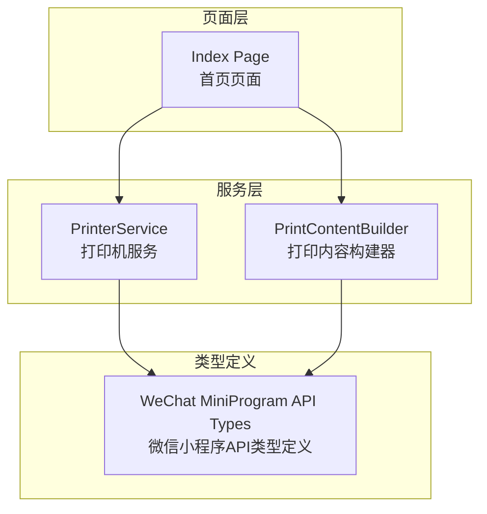
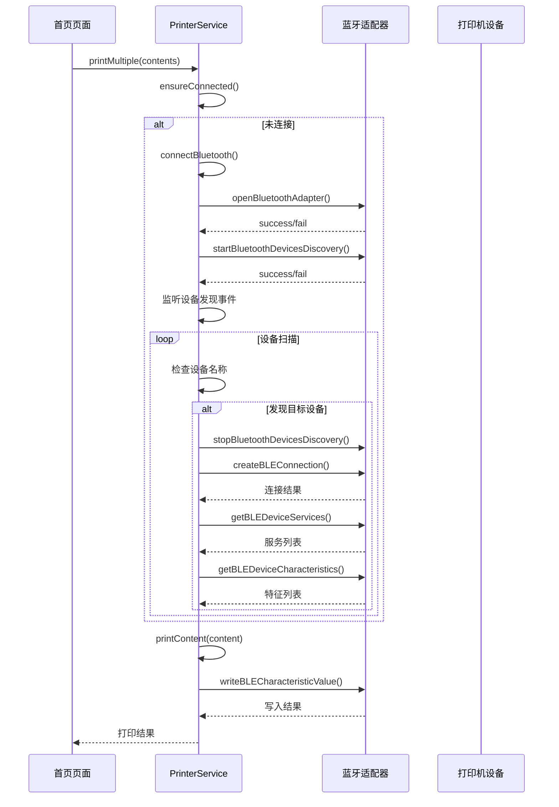
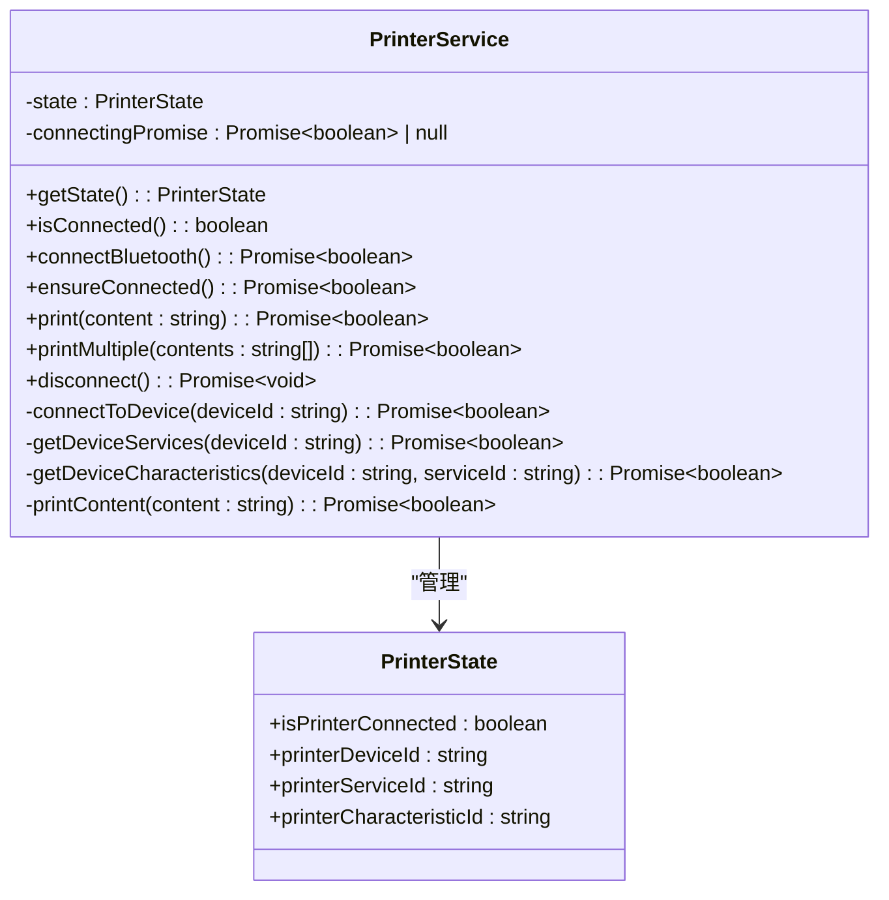
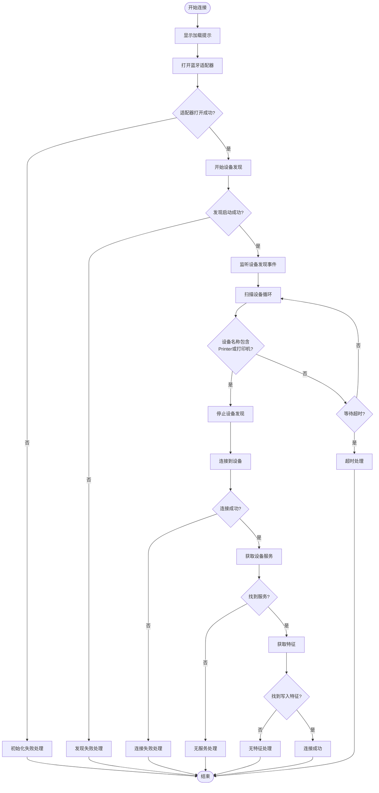
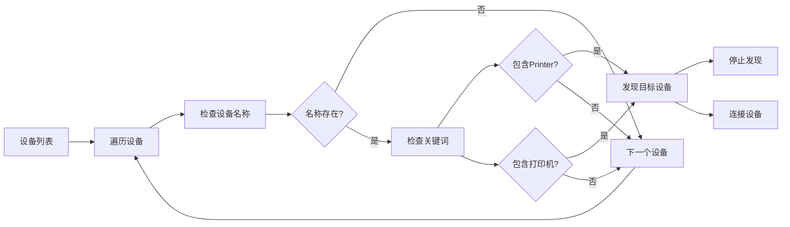
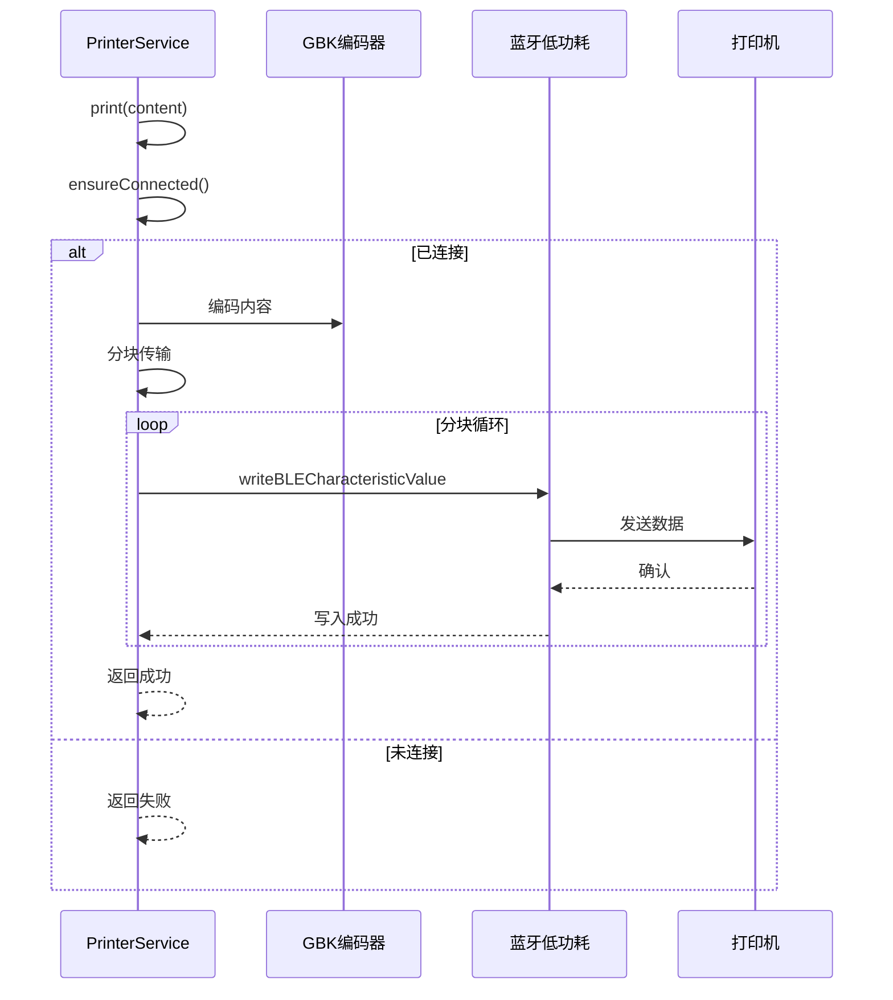
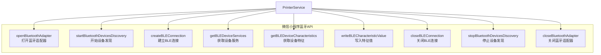

# 打印机连接管理

<cite>
**本文档引用的文件**
- [printer-service.ts](file://miniprogram/services/printer-service.ts)
- [print-content-builder.ts](file://miniprogram/services/print-content-builder.ts)
- [index.ts](file://miniprogram/pages/index/index.ts)
- [lib.wx.api.d.ts](file://typings/types/wx/lib.wx.api.d.ts)
</cite>

## 目录
1. [简介](#简介)
2. [项目结构](#项目结构)
3. [核心组件](#核心组件)
4. [架构概览](#架构概览)
5. [详细组件分析](#详细组件分析)
6. [依赖关系分析](#依赖关系分析)
7. [性能考虑](#性能考虑)
8. [故障排除指南](#故障排除指南)
9. [结论](#结论)

## 简介
本文档深入解析了小程序中的打印机连接管理功能，重点围绕PrinterService类的实现。该服务负责蓝牙设备发现、连接建立、状态管理和打印操作的完整生命周期。文档详细说明了connectBluetooth()方法的设备搜索逻辑，包括wx.openBluetoothAdapter()、wx.startBluetoothDevicesDiscovery()等API的使用方式，解释了设备过滤机制（识别包含'Printer'或'打印机'关键词的设备名称），阐述了连接状态管理（PrinterState接口设计和状态同步机制），并提供了连接失败的错误处理策略和用户体验优化方案。

## 项目结构
打印机连接管理功能主要分布在以下文件中：

**图表来源**
- [printer-service.ts](file://miniprogram/services/printer-service.ts#L1-L298)
- [print-content-builder.ts](file://miniprogram/services/print-content-builder.ts#L1-L144)
- [index.ts](file://miniprogram/pages/index/index.ts#L1-L735)

**章节来源**
- [printer-service.ts](file://miniprogram/services/printer-service.ts#L1-L298)
- [print-content-builder.ts](file://miniprogram/services/print-content-builder.ts#L1-L144)
- [index.ts](file://miniprogram/pages/index/index.ts#L1-L735)

## 核心组件
PrinterService是整个打印机连接管理的核心组件，采用单例模式设计，提供完整的蓝牙打印机连接和打印功能。

### PrinterState接口设计
PrinterState接口定义了打印机连接状态的关键属性：
- isPrinterConnected: 布尔值，指示打印机是否已连接
- printerDeviceId: 字符串，存储设备ID
- printerServiceId: 字符串，存储服务UUID
- printerCharacteristicId: 字符串，存储特征UUID

### 状态管理机制
服务内部维护私有状态对象和connectingPromise，确保连接过程的幂等性和避免重复连接：
- 状态同步：getState()方法返回状态副本，防止外部直接修改
- 连接状态检查：isConnected()方法验证所有必要字段是否就绪
- 并发控制：connectingPromise防止同时发起多个连接请求

**章节来源**
- [printer-service.ts](file://miniprogram/services/printer-service.ts#L2-L29)

## 架构概览
PrinterService采用分层架构设计，从底层的蓝牙API调用到高层的业务逻辑封装：

**图表来源**
- [printer-service.ts](file://miniprogram/services/printer-service.ts#L31-L91)
- [printer-service.ts](file://miniprogram/services/printer-service.ts#L93-L180)
- [printer-service.ts](file://miniprogram/services/printer-service.ts#L235-L269)

## 详细组件分析

### PrinterService类结构

**图表来源**
- [printer-service.ts](file://miniprogram/services/printer-service.ts#L10-L29)

### 设备发现与连接流程
connectBluetooth()方法实现了完整的设备发现和连接流程：

**图表来源**
- [printer-service.ts](file://miniprogram/services/printer-service.ts#L31-L91)
- [printer-service.ts](file://miniprogram/services/printer-service.ts#L93-L180)

### 设备过滤机制
设备过滤逻辑位于设备发现监听器中，采用关键词匹配策略：

**图表来源**
- [printer-service.ts](file://miniprogram/services/printer-service.ts#L42-L56)

**章节来源**
- [printer-service.ts](file://miniprogram/services/printer-service.ts#L31-L91)
- [printer-service.ts](file://miniprogram/services/printer-service.ts#L42-L56)

### 连接状态管理
PrinterService实现了完整的状态管理机制：

#### 状态同步机制
- getState()方法返回状态对象的深拷贝，防止外部直接修改内部状态
- isConnected()方法提供统一的状态检查接口，确保所有必要字段都已设置
- ensureConnected()方法实现连接状态的自动管理，避免重复连接

#### 并发控制
- connectingPromise属性防止同时发起多个连接请求
- 连接完成后及时清理connectingPromise，允许后续连接尝试

**章节来源**
- [printer-service.ts](file://miniprogram/services/printer-service.ts#L20-L29)
- [printer-service.ts](file://miniprogram/services/printer-service.ts#L182-L195)

### 打印功能实现
PrinterService提供了单次打印和批量打印两种模式：

#### 单次打印流程

**图表来源**
- [printer-service.ts](file://miniprogram/services/printer-service.ts#L197-L208)
- [printer-service.ts](file://miniprogram/services/printer-service.ts#L235-L269)

#### 批量打印优化
- 支持多张单据连续打印
- 自动添加延迟避免打印机过载
- 统一的成功/失败反馈

**章节来源**
- [printer-service.ts](file://miniprogram/services/printer-service.ts#L197-L233)
- [printer-service.ts](file://miniprogram/services/printer-service.ts#L235-L269)

### 错误处理策略
PrinterService实现了多层次的错误处理机制：

#### 连接阶段错误处理
- 蓝牙适配器初始化失败：显示"蓝牙初始化失败"提示
- 设备发现失败：显示"搜索蓝牙设备失败"提示
- 连接设备失败：显示"连接打印机失败"提示

#### 设备发现超时处理
- 设置10秒超时机制
- 自动停止设备发现和移除事件监听
- 显示"未找到打印机"提示

#### 打印阶段错误处理
- 写入特征值失败：显示"打印失败"提示
- 自动重试机制避免单次失败影响整体流程

**章节来源**
- [printer-service.ts](file://miniprogram/services/printer-service.ts#L31-L91)
- [printer-service.ts](file://miniprogram/services/printer-service.ts#L93-L180)
- [printer-service.ts](file://miniprogram/services/printer-service.ts#L235-L269)

## 依赖关系分析

### 外部API依赖
PrinterService依赖于微信小程序的蓝牙API，这些API在lib.wx.api.d.ts中有详细定义：

**图表来源**
- [lib.wx.api.d.ts](file://typings/types/wx/lib.wx.api.d.ts#L13837-L13870)
- [lib.wx.api.d.ts](file://typings/types/wx/lib.wx.api.d.ts#L15080-L15091)

### 内部组件依赖
PrinterService与PrintContentBuilder协同工作，形成完整的打印解决方案：

**图表来源**
- [index.ts](file://miniprogram/pages/index/index.ts#L263-L324)
- [print-content-builder.ts](file://miniprogram/services/print-content-builder.ts#L31-L80)

**章节来源**
- [lib.wx.api.d.ts](file://typings/types/wx/lib.wx.api.d.ts#L13837-L13870)
- [index.ts](file://miniprogram/pages/index/index.ts#L263-L324)

## 性能考虑
基于代码分析，PrinterService在性能方面采用了多项优化策略：

### 连接优化
- **单例模式**：确保全局只有一个PrinterService实例，避免资源浪费
- **连接复用**：通过getState()和isConnected()检查现有连接，避免重复连接
- **并发控制**：connectingPromise防止同时发起多个连接请求

### 打印优化
- **分块传输**：默认20字节分块，平衡传输速度和内存使用
- **异步处理**：使用Promise链式调用，避免阻塞主线程
- **批量处理**：printMultiple()方法支持连续打印，减少连接开销

### 内存管理
- **及时清理**：disconnect()方法主动关闭连接和停止发现
- **状态重置**：断开连接后重置所有状态信息

## 故障排除指南

### 常见问题诊断
1. **蓝牙设备无法发现**
   - 检查设备名称是否包含"Printer"或"打印机"
   - 确认蓝牙适配器已正确初始化
   - 验证设备处于可被发现状态

2. **连接失败**
   - 检查设备是否支持BLE协议
   - 确认设备服务列表中存在有效服务
   - 验证设备特征列表中存在写入权限的特征

3. **打印失败**
   - 检查分块传输是否正常完成
   - 确认设备连接状态保持稳定
   - 验证GBK编码转换是否正确

### 用户体验优化
- **加载提示**：使用wx.showLoading提供明确的进度反馈
- **错误提示**：针对不同失败场景提供具体的错误信息
- **超时处理**：10秒超时机制避免用户长时间等待
- **状态反馈**：成功连接和打印提供视觉反馈

**章节来源**
- [printer-service.ts](file://miniprogram/services/printer-service.ts#L31-L91)
- [printer-service.ts](file://miniprogram/services/printer-service.ts#L93-L180)

## 结论
PrinterService类实现了完整的蓝牙打印机连接管理功能，具有以下特点：

### 技术优势
- **完整的生命周期管理**：从设备发现到连接建立再到打印执行
- **健壮的错误处理**：多层次的异常捕获和用户友好的错误提示
- **高效的性能设计**：单例模式、连接复用和异步处理
- **良好的扩展性**：清晰的接口设计便于功能扩展

### 最佳实践建议
1. **连接状态管理**：始终使用ensureConnected()方法确保连接有效性
2. **错误处理**：在调用链中适当的位置添加try-catch处理
3. **性能优化**：合理设置分块大小和延迟间隔
4. **用户体验**：提供清晰的进度反馈和错误提示

该实现为小程序蓝牙打印机集成提供了可靠的基础设施，可以作为类似应用场景的参考模板。