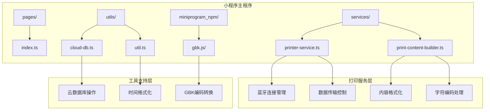
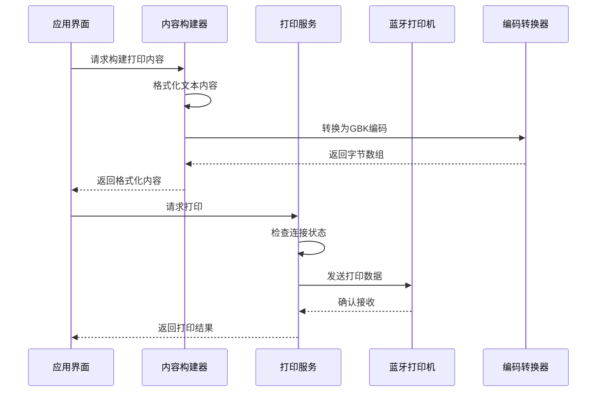
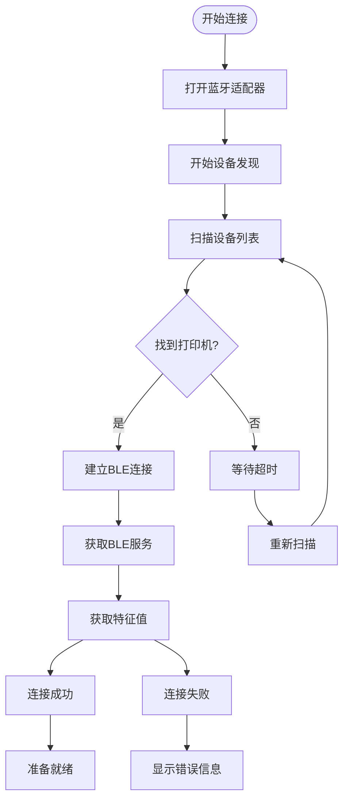
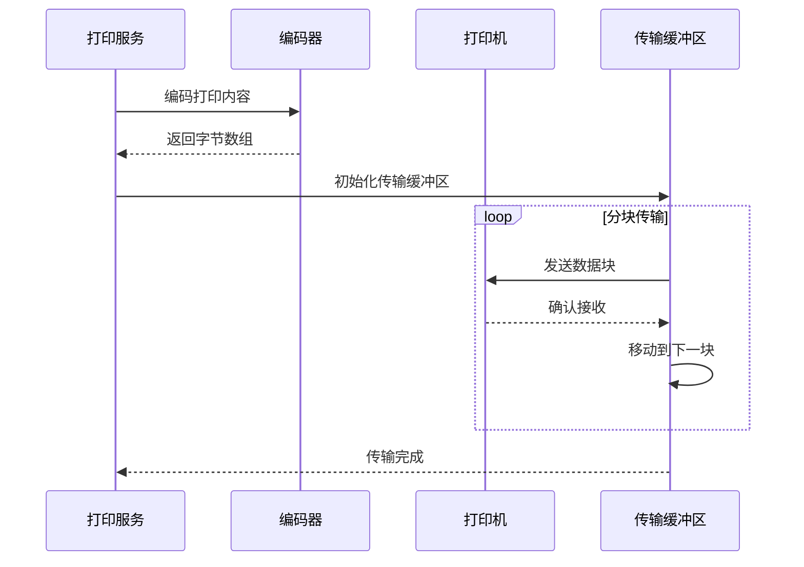
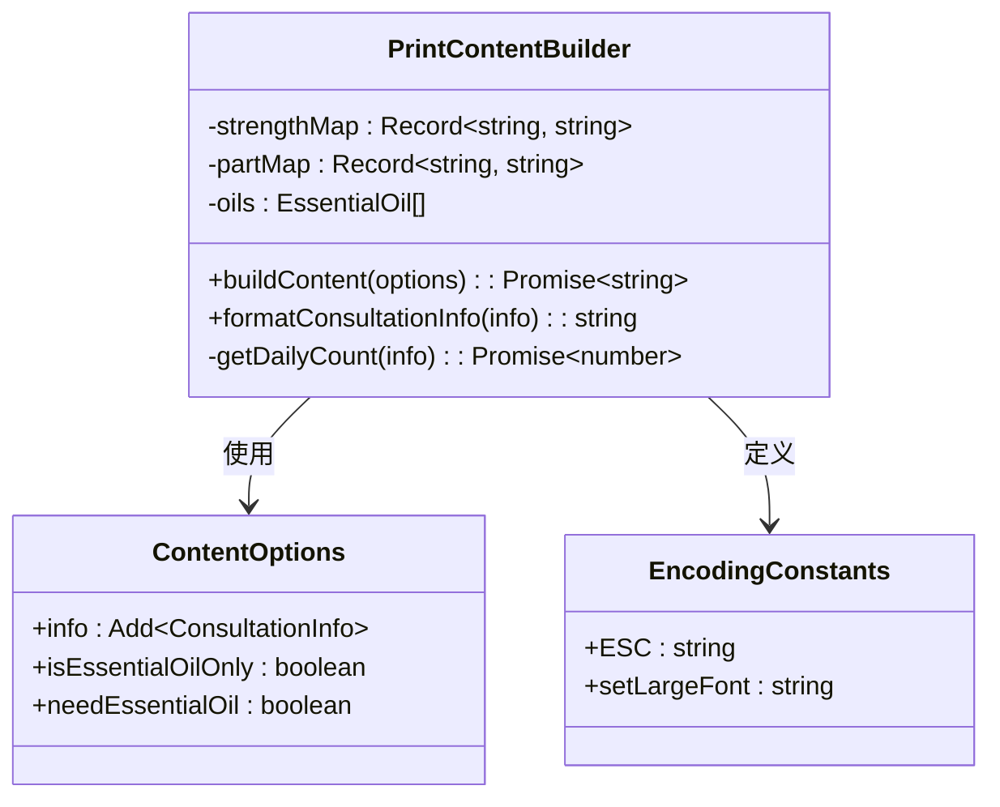
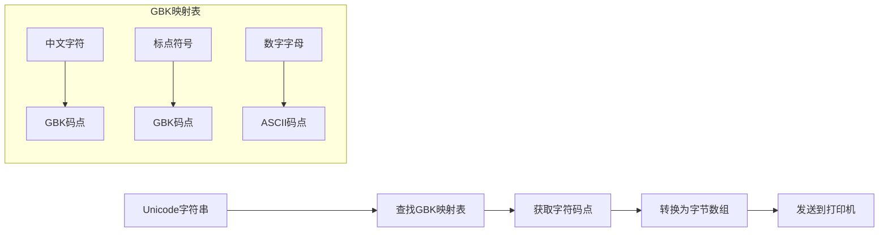
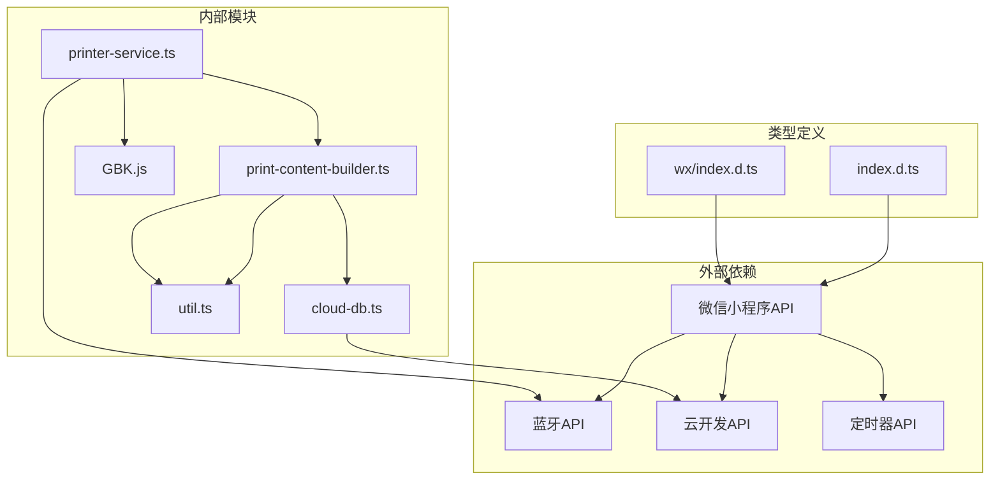

# 蓝牙打印服务

<cite>
**本文档引用的文件**
- [printer-service.ts](file://miniprogram/services/printer-service.ts)
- [print-content-builder.ts](file://miniprogram/services/print-content-builder.ts)
- [cloud-db.ts](file://miniprogram/utils/cloud-db.ts)
- [util.ts](file://miniprogram/utils/util.ts)
- [index.ts](file://miniprogram/pages/index/index.ts)
- [app.json](file://miniprogram/app.json)
- [index.ts](file://miniprogram/config/index.ts)
- [index.d.ts](file://typings/types/wx/index.d.ts)
</cite>

## 目录
1. [简介](#简介)
2. [项目结构](#项目结构)
3. [核心组件](#核心组件)
4. [架构概览](#架构概览)
5. [详细组件分析](#详细组件分析)
6. [依赖关系分析](#依赖关系分析)
7. [性能考虑](#性能考虑)
8. [故障排除指南](#故障排除指南)
9. [结论](#结论)

## 简介

蓝牙打印服务模块是ConsultationPrinter微信小程序的重要组成部分，负责处理蓝牙打印机的连接、数据传输和打印内容构建。该模块采用面向对象的设计模式，提供了完整的蓝牙打印解决方案，包括设备发现、连接管理、数据编码和打印控制等功能。

本模块特别注重中文打印的支持，通过GBK.js字符编码转换确保中文字符能够正确显示在热敏打印机上。同时，打印内容构建器提供了灵活的格式化选项，支持文本对齐、字体大小控制和各种打印格式化功能。

## 项目结构

蓝牙打印服务模块位于小程序项目的`miniprogram/services`目录下，与工具类模块分离，形成了清晰的模块化架构：

**图表来源**
- [printer-service.ts](file://miniprogram/services/printer-service.ts#L1-L297)
- [print-content-builder.ts](file://miniprogram/services/print-content-builder.ts#L1-L144)

**章节来源**
- [printer-service.ts](file://miniprogram/services/printer-service.ts#L1-L297)
- [print-content-builder.ts](file://miniprogram/services/print-content-builder.ts#L1-L144)

## 核心组件

### PrinterService类

PrinterService是蓝牙打印服务的核心类，实现了完整的蓝牙打印机连接和数据传输功能。该类采用单例模式设计，确保在整个应用生命周期内只有一个打印机服务实例。

**主要特性：**
- 自动设备发现和连接
- BLE服务和特征值管理
- 分块数据传输机制
- 连接状态管理和重连策略
- 错误处理和状态反馈

**关键方法：**
- `connectBluetooth()`: 发现并连接蓝牙打印机
- `ensureConnected()`: 确保连接可用的连接管理
- `print()`: 单个内容打印
- `printMultiple()`: 多内容批量打印
- `disconnect()`: 断开蓝牙连接

### PrintContentBuilder类

PrintContentBuilder专门负责打印内容的格式化和构建，提供了丰富的格式化选项和中文支持。

**主要功能：**
- 中文字符映射和格式化
- 力度和部位信息的本地化显示
- 技师工作量统计集成
- 时间格式化和打印标记
- 精油信息的可选显示

**章节来源**
- [printer-service.ts](file://miniprogram/services/printer-service.ts#L10-L297)
- [print-content-builder.ts](file://miniprogram/services/print-content-builder.ts#L10-L144)

## 架构概览

蓝牙打印服务采用了分层架构设计，将蓝牙连接管理、内容格式化和数据传输功能分离到不同的模块中：

**图表来源**
- [printer-service.ts](file://miniprogram/services/printer-service.ts#L197-L269)
- [print-content-builder.ts](file://miniprogram/services/print-content-builder.ts#L31-L80)

**章节来源**
- [printer-service.ts](file://miniprogram/services/printer-service.ts#L31-L297)
- [print-content-builder.ts](file://miniprogram/services/print-content-builder.ts#L31-L144)

## 详细组件分析

### PrinterService类深度解析

PrinterService类实现了完整的蓝牙打印生命周期管理，从设备发现到数据传输的每个环节都有详细的错误处理和状态管理。

#### 设备发现和连接流程

**图表来源**
- [printer-service.ts](file://miniprogram/services/printer-service.ts#L31-L180)

#### 数据传输机制

PrinterService采用了分块传输策略来确保大数据量的可靠传输：

**图表来源**
- [printer-service.ts](file://miniprogram/services/printer-service.ts#L235-L269)

**章节来源**
- [printer-service.ts](file://miniprogram/services/printer-service.ts#L31-L297)

### PrintContentBuilder类详细分析

PrintContentBuilder类专注于打印内容的格式化，提供了丰富的本地化支持和灵活的格式化选项。

#### 内容格式化逻辑

**图表来源**
- [print-content-builder.ts](file://miniprogram/services/print-content-builder.ts#L4-L29)

#### 中文字符编码处理

PrintContentBuilder通过GBK.js实现中文字符的正确编码，确保中文内容能够在热敏打印机上正常显示：

**章节来源**
- [print-content-builder.ts](file://miniprogram/services/print-content-builder.ts#L1-L144)

### GBK.js字符编码转换器

GBK.js是专门为中文打印设计的字符编码转换器，它将Unicode字符串转换为GBK编码格式，这是热敏打印机能够正确识别和显示中文字符的关键。

#### 编码转换流程

**图表来源**
- [printer-service.ts](file://miniprogram/services/printer-service.ts#L238-L238)

**章节来源**
- [printer-service.ts](file://miniprogram/services/printer-service.ts#L1-L2)

## 依赖关系分析

蓝牙打印服务模块的依赖关系清晰明确，遵循了单一职责原则和依赖倒置原则：

**图表来源**
- [printer-service.ts](file://miniprogram/services/printer-service.ts#L1-L1)
- [print-content-builder.ts](file://miniprogram/services/print-content-builder.ts#L1-L2)

**章节来源**
- [printer-service.ts](file://miniprogram/services/printer-service.ts#L1-L297)
- [print-content-builder.ts](file://miniprogram/services/print-content-builder.ts#L1-L144)

## 性能考虑

### 连接管理优化

PrinterService实现了智能的连接管理策略，避免重复连接和资源浪费：

1. **连接状态缓存**: 使用状态对象缓存连接信息，避免重复查询
2. **并发连接控制**: 通过connectingPromise防止重复连接请求
3. **自动重连机制**: 在连接断开时自动尝试重新连接

### 数据传输优化

1. **分块传输**: 采用20字节的数据块传输，平衡传输速度和稳定性
2. **延迟控制**: 每块传输后20ms延迟，确保打印机有足够时间处理数据
3. **批量打印优化**: 多内容打印时添加500ms间隔，避免打印机过载

### 内存管理

1. **流式处理**: 大内容采用流式处理，避免一次性加载到内存
2. **及时释放**: 传输完成后及时释放缓冲区和监听器
3. **错误清理**: 发生错误时自动清理资源和状态

## 故障排除指南

### 常见连接问题

| 问题症状 | 可能原因 | 解决方案 |
|---------|---------|---------|
| 无法发现打印机 | 蓝牙未开启或打印机未开机 | 检查设备蓝牙状态，重启打印机 |
| 连接失败 | 设备名称不符合要求 | 确保打印机名称包含"Printer"或"打印机" |
| 传输中断 | 传输速率过快 | 调整传输延迟参数 |
| 内容乱码 | 字符编码不匹配 | 确保使用GBK.js进行编码转换 |

### 错误处理机制

PrinterService提供了完善的错误处理机制：

1. **连接错误**: 自动显示错误信息并重试
2. **传输错误**: 检测传输失败并回退到初始状态
3. **资源清理**: 发生错误时自动清理蓝牙适配器和连接

### 调试建议

1. **启用日志**: 在开发工具中查看详细的连接和传输日志
2. **检查权限**: 确保应用具有蓝牙和位置访问权限
3. **测试环境**: 在不同环境下测试连接稳定性
4. **监控资源**: 关注内存使用情况，避免内存泄漏

**章节来源**
- [printer-service.ts](file://miniprogram/services/printer-service.ts#L71-L88)
- [printer-service.ts](file://miniprogram/services/printer-service.ts#L260-L263)

## 结论

蓝牙打印服务模块是一个设计精良、功能完整的打印解决方案。它通过以下关键特性确保了可靠的打印体验：

1. **完整的生命周期管理**: 从设备发现到数据传输的全流程管理
2. **中文支持**: 通过GBK.js实现完整的中文字符编码支持
3. **错误处理**: 全面的错误检测和恢复机制
4. **性能优化**: 智能的连接管理和数据传输策略
5. **模块化设计**: 清晰的职责分离和依赖关系

该模块为ConsultationPrinter小程序提供了稳定可靠的蓝牙打印功能，能够满足SPA和按摩店等场景下的打印需求。通过合理的架构设计和充分的错误处理，确保了在各种复杂环境下的稳定运行。

未来可以考虑的功能扩展包括：
- 支持更多类型的打印机
- 增加打印模板自定义功能
- 实现打印队列管理
- 添加打印预览功能
- 支持网络打印机