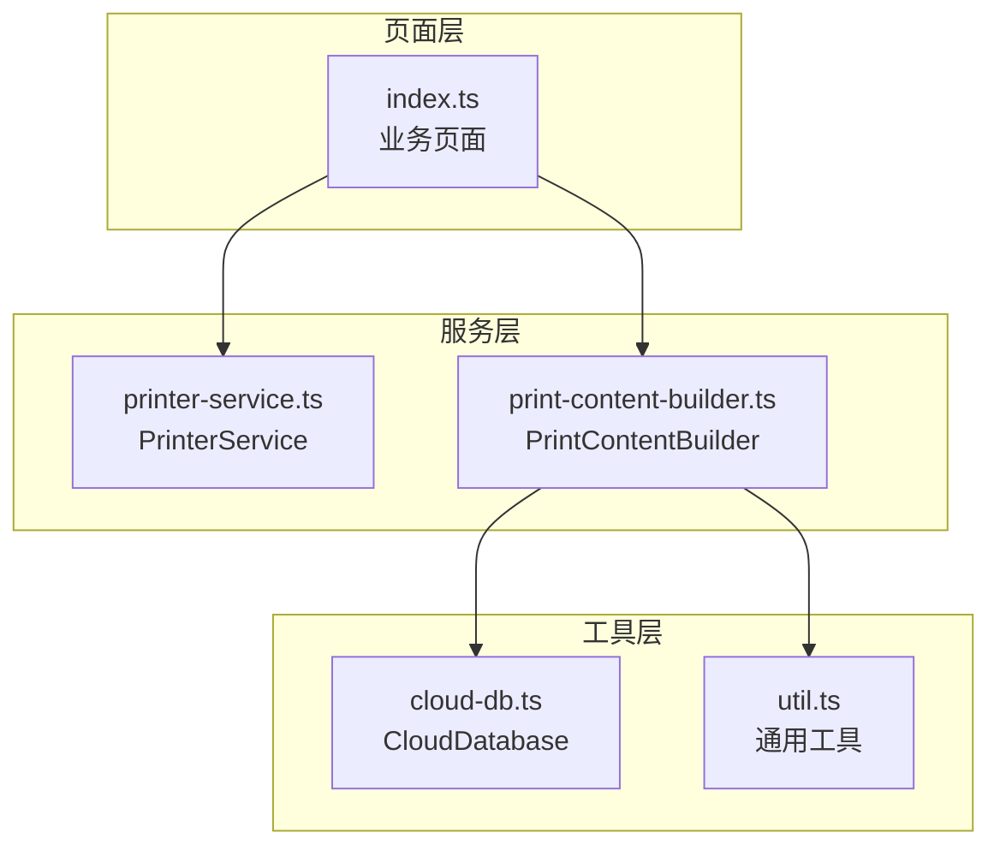
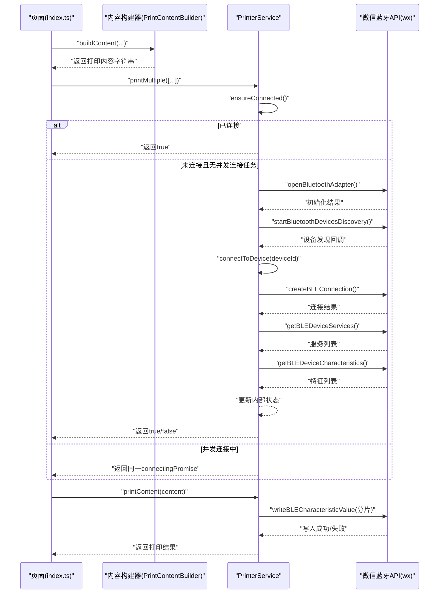
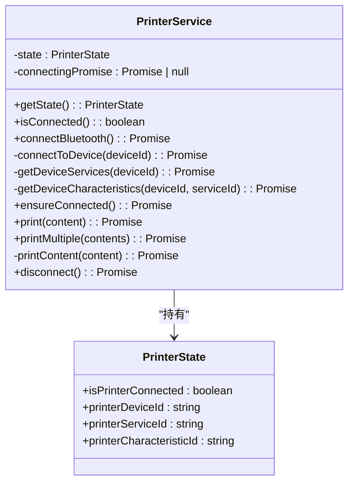
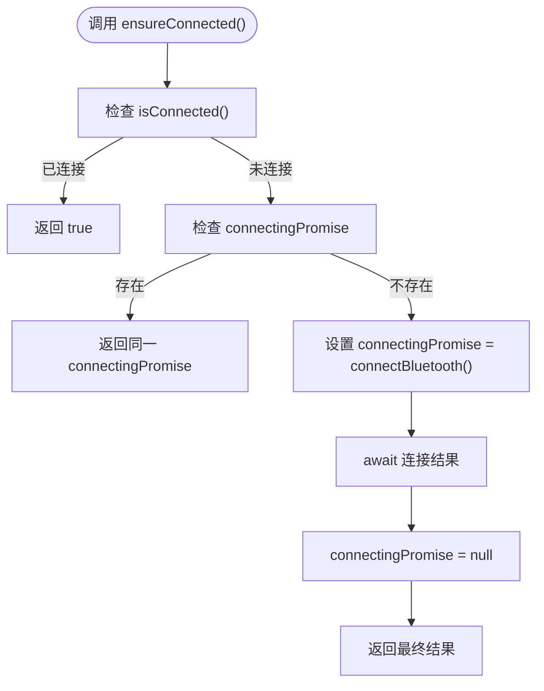
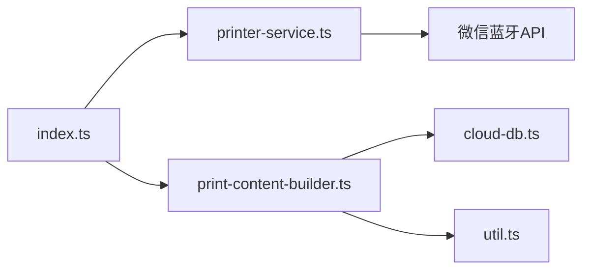
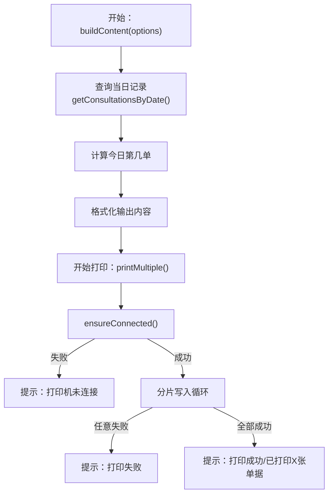

# 错误处理与恢复

<cite>
**本文引用的文件**
- [printer-service.ts](file://miniprogram/services/printer-service.ts)
- [print-content-builder.ts](file://miniprogram/services/print-content-builder.ts)
- [index.ts](file://miniprogram/pages/index/index.ts)
- [cloud-db.ts](file://miniprogram/utils/cloud-db.ts)
- [util.ts](file://miniprogram/utils/util.ts)
</cite>

## 目录
1. [简介](#简介)
2. [项目结构](#项目结构)
3. [核心组件](#核心组件)
4. [架构总览](#架构总览)
5. [组件详细分析](#组件详细分析)
6. [依赖关系分析](#依赖关系分析)
7. [性能考量](#性能考量)
8. [故障排查指南](#故障排查指南)
9. [结论](#结论)
10. [附录](#附录)

## 简介
本文件聚焦于“错误处理与恢复”主题，围绕小程序蓝牙打印子系统进行深入技术文档编写。重点涵盖以下方面：
- 打印错误类型的识别与处理策略
- 连接失败、打印超时、设备断开等异常场景的处理流程
- ensureConnected() 的智能重连机制与连接状态检查逻辑
- connectingPromise 的并发控制与避免重复连接策略
- 用户友好的错误提示与故障诊断建议
- 常见问题的解决方案、预防性措施，以及日志与监控最佳实践

## 项目结构
本项目采用“页面-服务-工具”的分层组织方式，蓝牙打印相关逻辑集中在服务层，页面通过服务层发起打印操作；内容构建与数据库访问分别由内容构建器与云数据库工具提供支持。

图表来源
- [printer-service.ts](file://miniprogram/services/printer-service.ts#L1-L298)
- [print-content-builder.ts](file://miniprogram/services/print-content-builder.ts#L1-L144)
- [index.ts](file://miniprogram/pages/index/index.ts#L1-L735)
- [cloud-db.ts](file://miniprogram/utils/cloud-db.ts#L1-L321)
- [util.ts](file://miniprogram/utils/util.ts#L1-L150)

章节来源
- [printer-service.ts](file://miniprogram/services/printer-service.ts#L1-L298)
- [print-content-builder.ts](file://miniprogram/services/print-content-builder.ts#L1-L144)
- [index.ts](file://miniprogram/pages/index/index.ts#L1-L735)
- [cloud-db.ts](file://miniprogram/utils/cloud-db.ts#L1-L321)
- [util.ts](file://miniprogram/utils/util.ts#L1-L150)

## 核心组件
- PrinterService：负责蓝牙适配器初始化、设备发现、连接建立、服务与特征查找、打印数据分片发送、断开连接与状态管理。
- PrintContentBuilder：负责生成符合打印机协议的文本内容，包含项目映射、格式化等。
- index.ts 页面：调用 PrinterService 与 PrintContentBuilder 完成打印流程，并在异常时给出用户提示。

章节来源
- [printer-service.ts](file://miniprogram/services/printer-service.ts#L10-L298)
- [print-content-builder.ts](file://miniprogram/services/print-content-builder.ts#L10-L144)
- [index.ts](file://miniprogram/pages/index/index.ts#L300-L324)

## 架构总览
整体流程从页面触发打印，先确保连接，再构建内容，最后分片写入设备特征值完成打印。异常路径在各阶段均有明确的错误提示与状态清理。

图表来源
- [printer-service.ts](file://miniprogram/services/printer-service.ts#L31-L195)
- [printer-service.ts](file://miniprogram/services/printer-service.ts#L197-L269)
- [index.ts](file://miniprogram/pages/index/index.ts#L300-L324)

## 组件详细分析

### PrinterService 类与错误处理
PrinterService 是蓝牙打印的核心类，负责：
- 状态管理：连接状态、设备ID、服务ID、特征ID
- 连接流程：打开适配器、发现设备、建立BLE连接、获取服务与特征
- 打印流程：内容编码、分片写入、超时与失败处理
- 断开流程：关闭连接、停止发现、关闭适配器、重置状态

图表来源
- [printer-service.ts](file://miniprogram/services/printer-service.ts#L2-L29)
- [printer-service.ts](file://miniprogram/services/printer-service.ts#L10-L298)

章节来源
- [printer-service.ts](file://miniprogram/services/printer-service.ts#L10-L298)

#### 连接失败处理策略
- 蓝牙适配器初始化失败：显示“蓝牙初始化失败”，返回 false
- 设备发现失败：显示“搜索蓝牙设备失败”，返回 false
- 发现超时（10秒）：停止发现、移除监听、显示“未找到打印机”，返回 false
- 连接设备失败：显示“连接打印机失败”，返回 false
- 获取服务失败：显示“未找到打印机服务”，返回 false
- 获取特征失败：显示“获取特征失败”，返回 false
- 未找到写入特征：显示“未找到写入特征”，返回 false

章节来源
- [printer-service.ts](file://miniprogram/services/printer-service.ts#L31-L180)

#### 打印超时与失败处理策略
- 内容编码：使用 GBK 编码为字节数组
- 分片写入：每次最多 20 字节，成功后延时 20ms 继续下一片
- 失败路径：任一片写入失败即提示“打印失败”，返回 false
- 多张打印：逐张打印，任一张失败立即终止，成功则提示“已打印X张单据”或“打印成功”

章节来源
- [printer-service.ts](file://miniprogram/services/printer-service.ts#L197-L269)

#### 设备断开与状态恢复
- disconnect()：关闭 BLE 连接、停止发现、关闭适配器，重置状态与 connectingPromise
- ensureConnected()：若已连接直接返回；若正在连接则返回同一 Promise；否则启动新连接流程并清理状态

章节来源
- [printer-service.ts](file://miniprogram/services/printer-service.ts#L182-L195)
- [printer-service.ts](file://miniprogram/services/printer-service.ts#L271-L294)

#### ensureConnected() 智能重连机制
- 连接状态检查：isConnected() 要求连接标志与三类ID均有效
- 并发控制：connectingPromise 避免重复发起连接；若已有连接任务，直接复用该 Promise
- 状态更新：连接成功后更新内部状态；失败后保持未连接状态，等待下次调用

图表来源
- [printer-service.ts](file://miniprogram/services/printer-service.ts#L182-L195)
- [printer-service.ts](file://miniprogram/services/printer-service.ts#L31-L180)

章节来源
- [printer-service.ts](file://miniprogram/services/printer-service.ts#L182-L195)

#### connectingPromise 并发控制与避免重复连接
- 作用：保证同一时刻仅有一个连接任务在执行
- 行为：首次连接时赋值并等待；后续调用直接复用该 Promise，避免重复连接
- 清理：连接完成后将 connectingPromise 置空，允许下一次连接尝试

章节来源
- [printer-service.ts](file://miniprogram/services/printer-service.ts#L18-L19)
- [printer-service.ts](file://miniprogram/services/printer-service.ts#L182-L195)

#### 打印内容构建与数据源
- PrintContentBuilder：根据咨询单信息生成符合打印机协议的文本内容，包含项目映射、格式化、时间戳等
- 数据来源：从云数据库查询当日记录以计算“今日第几单”，异常时降级为默认值

章节来源
- [print-content-builder.ts](file://miniprogram/services/print-content-builder.ts#L31-L95)
- [cloud-db.ts](file://miniprogram/utils/cloud-db.ts#L283-L298)

#### 页面集成与错误提示
- 页面在打印前调用 PrinterService.printMultiple()，并在异常时统一提示“打印失败”
- 页面在保存、报钟等其他流程中也广泛使用 wx.showToast 提供用户反馈

章节来源
- [index.ts](file://miniprogram/pages/index/index.ts#L300-L324)

## 依赖关系分析
- PrinterService 依赖微信蓝牙 API（适配器、发现、连接、服务、特征、写入）
- PrintContentBuilder 依赖云数据库工具与通用工具（时间格式化）
- 页面 index.ts 依赖 PrinterService 与 PrintContentBuilder

图表来源
- [printer-service.ts](file://miniprogram/services/printer-service.ts#L31-L180)
- [print-content-builder.ts](file://miniprogram/services/print-content-builder.ts#L1-L144)
- [index.ts](file://miniprogram/pages/index/index.ts#L1-L735)
- [cloud-db.ts](file://miniprogram/utils/cloud-db.ts#L1-L321)
- [util.ts](file://miniprogram/utils/util.ts#L1-L150)

章节来源
- [printer-service.ts](file://miniprogram/services/printer-service.ts#L1-L298)
- [print-content-builder.ts](file://miniprogram/services/print-content-builder.ts#L1-L144)
- [index.ts](file://miniprogram/pages/index/index.ts#L1-L735)
- [cloud-db.ts](file://miniprogram/utils/cloud-db.ts#L1-L321)
- [util.ts](file://miniprogram/utils/util.ts#L1-L150)

## 性能考量
- 分片写入：每次最多 20 字节，延时 20ms，兼顾稳定性与吞吐
- 连接去抖：connectingPromise 避免重复连接导致的资源浪费
- 超时控制：设备发现 10 秒超时，及时释放资源
- 多张打印间隔：相邻打印之间增加 500ms 间隔，降低设备压力

章节来源
- [printer-service.ts](file://miniprogram/services/printer-service.ts#L197-L233)
- [printer-service.ts](file://miniprogram/services/printer-service.ts#L182-L195)
- [printer-service.ts](file://miniprogram/services/printer-service.ts#L31-L90)

## 故障排查指南

### 常见错误类型与处理策略
- 蓝牙初始化失败
  - 现象：无法打开蓝牙适配器
  - 处理：提示“蓝牙初始化失败”，引导用户检查蓝牙开关与权限
- 设备发现失败
  - 现象：启动发现失败
  - 处理：提示“搜索蓝牙设备失败”，建议重启蓝牙或重试
- 发现超时
  - 现象：10 秒内未发现目标设备
  - 处理：提示“未找到打印机”，建议靠近设备、关闭其他蓝牙应用
- 连接失败
  - 现象：createBLEConnection 失败
  - 处理：提示“连接打印机失败”，建议重新搜索或重启设备
- 未找到服务/特征
  - 现象：getBLEDeviceServices 或 getBLEDeviceCharacteristics 失败
  - 处理：提示对应失败信息，确认设备兼容性与权限
- 写入失败
  - 现象：writeBLECharacteristicValue 失败
  - 处理：提示“打印失败”，检查设备电量、缓冲区状态与分片大小

章节来源
- [printer-service.ts](file://miniprogram/services/printer-service.ts#L31-L180)
- [printer-service.ts](file://miniprogram/services/printer-service.ts#L197-L269)

### 异常场景处理流程
- 连接失败
  - 清理：停止发现、移除监听、隐藏加载
  - 提示：显示相应错误消息
  - 状态：保持未连接状态，等待下次调用
- 打印超时
  - 清理：停止写入循环，返回失败
  - 提示：显示“打印失败”
  - 状态：不影响连接状态
- 设备断开
  - 清理：disconnect() 关闭连接、停止发现、关闭适配器、重置状态
  - 提示：可结合业务场景提示“设备断开，请重新连接”

章节来源
- [printer-service.ts](file://miniprogram/services/printer-service.ts#L31-L180)
- [printer-service.ts](file://miniprogram/services/printer-service.ts#L197-L269)
- [printer-service.ts](file://miniprogram/services/printer-service.ts#L271-L294)

### 用户友好提示与诊断建议
- 统一使用 wx.showToast 提供即时反馈
- 在关键步骤显示 wx.showLoading，避免用户误触
- 对于网络/数据库相关异常，参考 PrintContentBuilder 中的降级策略（如当日计数异常时返回默认值）

章节来源
- [printer-service.ts](file://miniprogram/services/printer-service.ts#L31-L180)
- [print-content-builder.ts](file://miniprogram/services/print-content-builder.ts#L82-L95)

### 常见问题与预防措施
- 问题：频繁点击打印导致重复连接
  - 预防：利用 ensureConnected() 的并发控制，避免重复发起连接
- 问题：打印内容过长导致写入失败
  - 预防：合理拆分内容，确保分片大小与延时参数稳定
- 问题：设备电量低或缓冲区满
  - 预防：在打印前检测设备状态，必要时提示用户充电或稍后再试
- 问题：多设备共存干扰
  - 预防：缩短发现时间、靠近设备、减少其他蓝牙应用

章节来源
- [printer-service.ts](file://miniprogram/services/printer-service.ts#L182-L195)
- [printer-service.ts](file://miniprogram/services/printer-service.ts#L197-L269)

### 日志记录与监控最佳实践
- 建议：在关键节点记录事件（连接开始/成功/失败、写入分片、异常类型），便于定位问题
- 建议：对异常进行分类统计（蓝牙初始化失败、连接失败、写入失败），形成趋势报表
- 建议：在页面层捕获异常并上报，同时向用户展示简洁提示

[本节为通用指导，无需特定文件来源]

## 结论
本项目在蓝牙打印链路中实现了较为完善的错误识别与恢复机制：通过 ensureConnected() 的状态检查与并发控制避免重复连接，通过分片写入与超时策略提升稳定性，通过统一的错误提示提升用户体验。建议在现有基础上进一步完善日志与监控体系，以便更高效地定位与解决问题。

## 附录

### 关键流程图：打印内容构建与打印

图表来源
- [print-content-builder.ts](file://miniprogram/services/print-content-builder.ts#L31-L95)
- [printer-service.ts](file://miniprogram/services/printer-service.ts#L197-L233)
- [printer-service.ts](file://miniprogram/services/printer-service.ts#L235-L269)
- [cloud-db.ts](file://miniprogram/utils/cloud-db.ts#L283-L298)