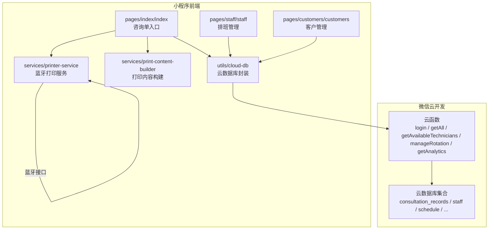
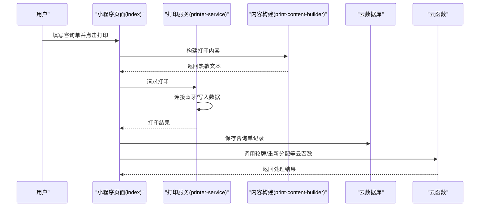
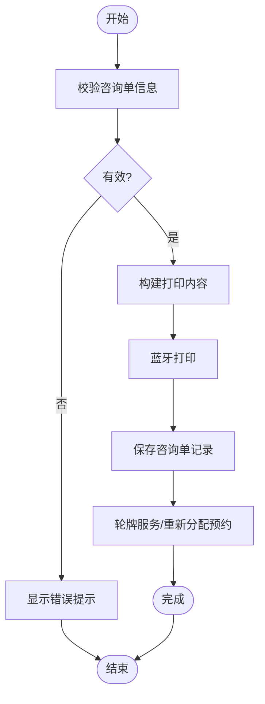
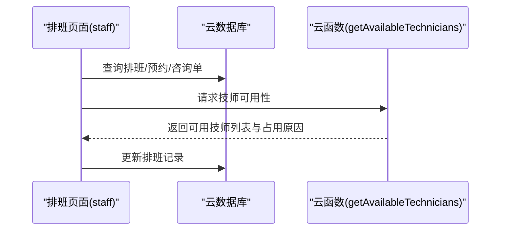
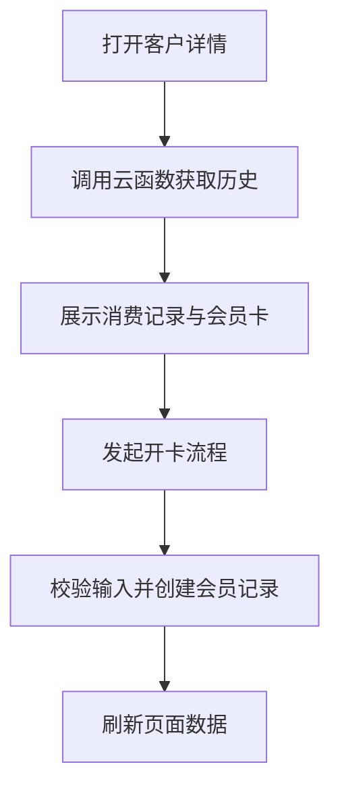
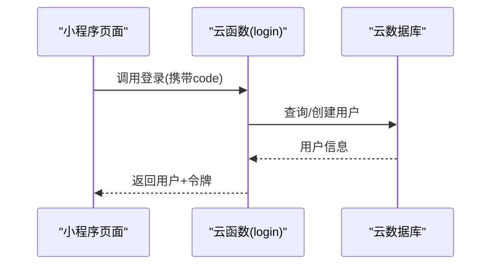
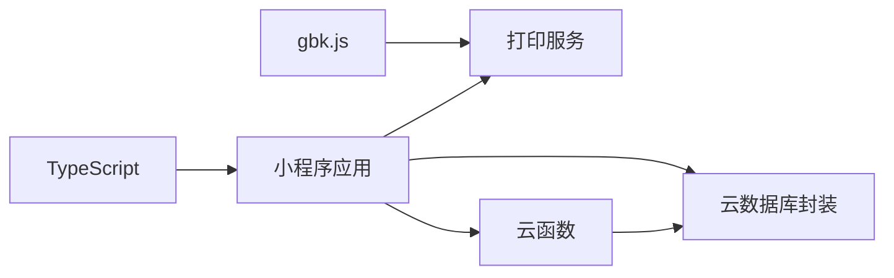

# 项目概述

<cite>
**本文档引用的文件**
- [package.json](file://package.json)
- [miniprogram/app.json](file://miniprogram/app.json)
- [miniprogram/app.ts](file://miniprogram/app.ts)
- [miniprogram/config/index.ts](file://miniprogram/config/index.ts)
- [miniprogram/services/printer-service.ts](file://miniprogram/services/printer-service.ts)
- [miniprogram/services/print-content-builder.ts](file://miniprogram/services/print-content-builder.ts)
- [miniprogram/utils/cloud-db.ts](file://miniprogram/utils/cloud-db.ts)
- [miniprogram/utils/constants.ts](file://miniprogram/utils/constants.ts)
- [miniprogram/pages/index/index.ts](file://miniprogram/pages/index/index.ts)
- [miniprogram/pages/staff/staff.ts](file://miniprogram/pages/staff/staff.ts)
- [miniprogram/pages/customers/customers.ts](file://miniprogram/pages/customers/customers.ts)
- [cloudfunctions/login/index.js](file://cloudfunctions/login/index.js)
- [cloudfunctions/getAll/index.js](file://cloudfunctions/getAll/index.js)
- [cloudfunctions/getAvailableTechnicians/index.js](file://cloudfunctions/getAvailableTechnicians/index.js)
- [cloudfunctions/manageRotation/index.js](file://cloudfunctions/manageRotation/index.js)
- [cloudfunctions/getAnalytics/index.js](file://cloudfunctions/getAnalytics/index.js)
</cite>

## 目录
1. [简介](#简介)
2. [项目结构](#项目结构)
3. [核心组件](#核心组件)
4. [架构总览](#架构总览)
5. [详细组件分析](#详细组件分析)
6. [依赖关系分析](#依赖关系分析)
7. [性能考虑](#性能考虑)
8. [故障排查指南](#故障排查指南)
9. [结论](#结论)
10. [附录](#附录)

## 简介
ConsultationPrinter 是一款面向 SPA 按摩店的微信小程序，旨在通过自动化蓝牙热敏打印解决方案提升门店运营效率。系统围绕“咨询单打印”这一核心业务闭环，提供从客户登记、技师排班、轮牌管理到数据分析的完整能力，并通过云开发实现数据存储与后端逻辑解耦。

- 价值主张
  - 自动化：一键生成并打印咨询单，减少手工录入与重复劳动
  - 规范化：统一打印模板与字段，确保信息一致性
  - 智能化：结合排班与轮牌系统，智能推荐可用技师
  - 数据化：提供多维度报表与趋势分析，辅助经营决策

- 应用场景
  - SPA 按摩店日常咨询单打印
  - 技师排班与轮牌调度
  - 客户档案与会员卡管理
  - 经营数据分析与趋势洞察

## 项目结构
项目采用“小程序前端 + 微信云开发 + 云函数”的分层架构，前端以 TypeScript + WXML/ WXSS 开发，云函数负责数据聚合与业务逻辑，云数据库提供结构化存储。

**图表来源**
- [miniprogram/pages/index/index.ts](file://miniprogram/pages/index/index.ts#L1-L735)
- [miniprogram/services/printer-service.ts](file://miniprogram/services/printer-service.ts#L1-L298)
- [miniprogram/services/print-content-builder.ts](file://miniprogram/services/print-content-builder.ts#L1-L144)
- [miniprogram/utils/cloud-db.ts](file://miniprogram/utils/cloud-db.ts#L1-L321)
- [cloudfunctions/login/index.js](file://cloudfunctions/login/index.js#L1-L180)
- [cloudfunctions/getAll/index.js](file://cloudfunctions/getAll/index.js#L1-L59)

**章节来源**
- [package.json](file://package.json#L1-L28)
- [miniprogram/app.json](file://miniprogram/app.json#L1-L35)

## 核心组件
- 咨询单入口页（index）
  - 负责收集客户信息、项目选择、技师与房间分配、精油与力度设置、报钟与打印等全流程
  - 集成双人模式、顾客匹配、预约冲突检测与重新分配等功能
- 打印服务（printer-service）
  - 封装蓝牙热敏打印机连接、特征发现与写入，支持多单连续打印与中文编码转换
- 打印内容构建（print-content-builder）
  - 将咨询单信息映射为热敏打印所需的文本内容，含项目、技师、房间、力度、精油、部位与打印时间等
- 云数据库封装（cloud-db）
  - 提供集合读写、分页查询、保存咨询单、按日期检索等通用能力
- 云函数（login / getAll / getAvailableTechnicians / manageRotation / getAnalytics）
  - 登录鉴权、全量数据拉取、技师可用性与排班冲突计算、轮牌队列管理、数据分析统计

**章节来源**
- [miniprogram/pages/index/index.ts](file://miniprogram/pages/index/index.ts#L1-L735)
- [miniprogram/services/printer-service.ts](file://miniprogram/services/printer-service.ts#L1-L298)
- [miniprogram/services/print-content-builder.ts](file://miniprogram/services/print-content-builder.ts#L1-L144)
- [miniprogram/utils/cloud-db.ts](file://miniprogram/utils/cloud-db.ts#L1-L321)
- [cloudfunctions/login/index.js](file://cloudfunctions/login/index.js#L1-L180)
- [cloudfunctions/getAll/index.js](file://cloudfunctions/getAll/index.js#L1-L59)
- [cloudfunctions/getAvailableTechnicians/index.js](file://cloudfunctions/getAvailableTechnicians/index.js#L1-L285)
- [cloudfunctions/manageRotation/index.js](file://cloudfunctions/manageRotation/index.js#L1-L327)
- [cloudfunctions/getAnalytics/index.js](file://cloudfunctions/getAnalytics/index.js#L1-L172)

## 架构总览
系统采用“前端即服务”的设计，小程序直接通过云开发 API 调用云函数与访问数据库，云函数作为业务中台提供数据聚合与复杂逻辑处理。

**图表来源**
- [miniprogram/pages/index/index.ts](file://miniprogram/pages/index/index.ts#L263-L324)
- [miniprogram/services/printer-service.ts](file://miniprogram/services/printer-service.ts#L197-L233)
- [miniprogram/services/print-content-builder.ts](file://miniprogram/services/print-content-builder.ts#L31-L80)
- [miniprogram/utils/cloud-db.ts](file://miniprogram/utils/cloud-db.ts#L259-L278)
- [cloudfunctions/manageRotation/index.js](file://cloudfunctions/manageRotation/index.js#L185-L246)

## 详细组件分析

### 咨询单管理流程
- 表单采集与校验
  - 支持单人/双人模式切换，动态绑定顾客信息
  - 校验必填项与项目特殊要求（如专用精油）
- 打印与保存
  - 构建热敏打印内容，支持多单拼接打印
  - 保存咨询单记录，计算加班时长，触发轮牌与预约重新分配
- 报钟与推送
  - 支持报钟时间选择与弹窗确认
  - 可选发送企业微信消息

**图表来源**
- [miniprogram/pages/index/index.ts](file://miniprogram/pages/index/index.ts#L263-L481)
- [miniprogram/services/print-content-builder.ts](file://miniprogram/services/print-content-builder.ts#L31-L80)
- [miniprogram/services/printer-service.ts](file://miniprogram/services/printer-service.ts#L197-L233)

**章节来源**
- [miniprogram/pages/index/index.ts](file://miniprogram/pages/index/index.ts#L1-L735)

### 技师排班与轮牌系统
- 排班管理
  - 支持按日期范围展示排班，限制历史日期不可修改
  - 通过云数据库更新排班记录并刷新界面
- 轮牌队列
  - 基于排班与历史服务记录初始化轮牌队列
  - 提供“服务完成”推进队列、“调整位置”手动排序等操作
- 可用性查询
  - 结合排班、预约与现有咨询单，计算技师可用时间段与占用原因

**图表来源**
- [miniprogram/pages/staff/staff.ts](file://miniprogram/pages/staff/staff.ts#L37-L95)
- [cloudfunctions/getAvailableTechnicians/index.js](file://cloudfunctions/getAvailableTechnicians/index.js#L1-L285)
- [cloudfunctions/manageRotation/index.js](file://cloudfunctions/manageRotation/index.js#L1-L327)

**章节来源**
- [miniprogram/pages/staff/staff.ts](file://miniprogram/pages/staff/staff.ts#L1-L460)
- [cloudfunctions/getAvailableTechnicians/index.js](file://cloudfunctions/getAvailableTechnicians/index.js#L1-L285)
- [cloudfunctions/manageRotation/index.js](file://cloudfunctions/manageRotation/index.js#L1-L327)

### 客户管理与会员卡
- 客户信息维护
  - 支持新增、编辑、删除、分页查询与关键字搜索
  - 展示客户历史消费记录与会员卡持有情况
- 会员卡开卡
  - 选择卡种、填写实付金额与销售员工，创建客户会员记录

**图表来源**
- [miniprogram/pages/customers/customers.ts](file://miniprogram/pages/customers/customers.ts#L228-L298)
- [cloudfunctions/getAnalytics/index.js](file://cloudfunctions/getAnalytics/index.js#L1-L172)

**章节来源**
- [miniprogram/pages/customers/customers.ts](file://miniprogram/pages/customers/customers.ts#L1-L471)

### 登录鉴权与数据访问
- 登录流程
  - 通过云函数获取用户上下文，创建或更新用户记录，颁发临时令牌
- 数据访问
  - 通用数据拉取：支持一次性拉取指定集合全部数据，避免前端循环查询
- 权限控制
  - 页面级权限校验与登录态检查贯穿各页面

**图表来源**
- [cloudfunctions/login/index.js](file://cloudfunctions/login/index.js#L11-L90)
- [miniprogram/utils/cloud-db.ts](file://miniprogram/utils/cloud-db.ts#L69-L88)

**章节来源**
- [cloudfunctions/login/index.js](file://cloudfunctions/login/index.js#L1-L180)
- [cloudfunctions/getAll/index.js](file://cloudfunctions/getAll/index.js#L1-L59)

## 依赖关系分析
- 前端依赖
  - gbk.js：中文字符集编码转换，确保热敏打印内容正确输出
  - TypeScript：类型安全与工程化管理
- 云开发依赖
  - 云数据库：统一的数据存储与查询
  - 云函数：业务逻辑与数据聚合
  - 云开发 SDK：小程序端调用云函数与访问数据库

**图表来源**
- [package.json](file://package.json#L25-L27)
- [miniprogram/services/printer-service.ts](file://miniprogram/services/printer-service.ts#L1-L2)
- [miniprogram/utils/cloud-db.ts](file://miniprogram/utils/cloud-db.ts#L1-L47)

**章节来源**
- [package.json](file://package.json#L1-L28)

## 性能考虑
- 打印性能
  - 采用分片写入与延迟间隔，避免蓝牙写入阻塞
  - 多单打印时逐张提示，提升用户体验
- 数据查询
  - 云函数一次性拉取集合全量数据，减少前端多次请求
  - 分页查询与条件过滤，降低前端内存压力
- 连接管理
  - 连接状态缓存与去重连接 Promise，避免重复扫描与连接
- 业务优化
  - 技师可用性计算合并排班、预约与咨询单，减少多次查询
  - 轮牌队列优先级基于历史服务与班次，提高公平性与效率

[本节为通用建议，无需列出具体文件来源]

## 故障排查指南
- 打印失败
  - 检查蓝牙连接状态与设备可写特征是否存在
  - 确认中文编码转换是否正常，避免乱码
- 数据加载异常
  - 核对云函数返回结构与前端解析逻辑
  - 检查集合名称与查询条件
- 登录问题
  - 确认云函数环境变量与用户上下文获取
  - 检查用户记录创建与令牌生成逻辑

**章节来源**
- [miniprogram/services/printer-service.ts](file://miniprogram/services/printer-service.ts#L197-L233)
- [cloudfunctions/login/index.js](file://cloudfunctions/login/index.js#L128-L132)
- [miniprogram/utils/cloud-db.ts](file://miniprogram/utils/cloud-db.ts#L69-L88)

## 结论
ConsultationPrinter 通过“前端即服务”的架构，将咨询单打印、技师排班、轮牌管理与数据分析整合为一套完整的 SPA 按摩店自动化解决方案。项目结构清晰、模块职责明确，既满足初学者快速上手的需求，也为有经验的开发者提供了扩展空间。建议后续可进一步完善异常监控、日志追踪与测试覆盖，持续提升系统的稳定性与可观测性。

[本节为总结性内容，无需列出具体文件来源]

## 附录

### 快速入门指南
- 环境准备
  - 安装依赖：npm install
  - 使用微信开发者工具导入项目
- 本地运行
  - 在开发者工具中选择“云开发”环境
  - 配置云环境 ID（见配置文件）
- 常用命令
  - 代码格式化：npm run format
  - ESLint 检查：npm run lint
  - 自动修复：npm run lint:fix

**章节来源**
- [package.json](file://package.json#L5-L9)
- [miniprogram/config/index.ts](file://miniprogram/config/index.ts#L1-L18)